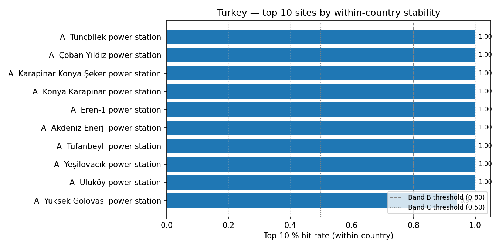

# Turkey (TR) — sensitivity shortlist — 20260523

_Generated on 2026-05-23 (UTC)._

## Envelope

- Scored sites (all-SMR pool): **120**.
- Scored sites (NuScale pool): **120**.
- Non-baseline scenarios: **17**.
- Within-country top-5 / 10 / 30 % percentiles are computed on the local pool, so **bands reflect national competitiveness**.

## Ranked shortlist — all SMRs pooled (top 10)

| Rank | Site | Country | Band | Top-5 % rate | Top-10 % rate | Top-30 % rate |
| ---: | --- | --- | :---: | ---: | ---: | ---: |
| 1 | Tunçbilek power station | TR | A | 1.0 | 1.0 | 1.0 |
| 2 | Çoban Yıldız power station | TR | A | 1.0 | 1.0 | 1.0 |
| 3 | Karapinar Konya Şeker power station | TR | A | 1.0 | 1.0 | 1.0 |
| 4 | Konya Karapınar power station | TR | A | 1.0 | 1.0 | 1.0 |
| 5 | Eren-1 power station | TR | A | 0.9412 | 1.0 | 1.0 |
| 6 | Akdeniz Enerji power station | TR | A | 0.9412 | 1.0 | 1.0 |
| 7 | Tufanbeyli power station | TR | A | 0.9412 | 1.0 | 1.0 |
| 8 | Yeşilovacık power station | TR | A | 0.9412 | 1.0 | 1.0 |
| 9 | Uluköy power station | TR | A | 0.8824 | 1.0 | 1.0 |
| 10 | Yüksek Gölovası power station | TR | A | 0.8824 | 0.9412 | 1.0 |
| … 110 more | | | | | | |

**Band counts:** A=21, B=13, C=5, D=44, E=4, F=1, G=8, H=24.

## Ranked shortlist — NuScale `nuscale_voygr6` (top 10)

| Rank | Site | Country | Band | Top-5 % rate | Top-10 % rate | Top-30 % rate |
| ---: | --- | --- | :---: | ---: | ---: | ---: |
| 1 | Tunçbilek power station | TR | A | 1.0 | 1.0 | 1.0 |
| 2 | Çoban Yıldız power station | TR | A | 1.0 | 1.0 | 1.0 |
| 3 | Karapinar Konya Şeker power station | TR | A | 1.0 | 1.0 | 1.0 |
| 4 | Konya Karapınar power station | TR | A | 1.0 | 1.0 | 1.0 |
| 5 | Eren-1 power station | TR | A | 0.9412 | 1.0 | 1.0 |
| 6 | Tufanbeyli power station | TR | A | 0.9412 | 1.0 | 1.0 |
| 7 | Uluköy power station | TR | A | 0.8824 | 1.0 | 1.0 |
| 8 | Yüksek Gölovası power station | TR | A | 0.8824 | 0.9412 | 1.0 |
| 9 | Çayırhan power station | TR | A | 0.8824 | 0.9412 | 1.0 |
| 10 | Sarp Golvasi power station | TR | A | 0.8824 | 0.9412 | 1.0 |
| … 110 more | | | | | | |

**NuScale band counts:** A=17, B=12, C=2, D=42, E=2, F=1, G=9, H=35.

## Interpretation

- Sites in Bands A–C (within-country robust top tier): **39**.
- Band A / B sites are in the local top-5 % / 10 % slice in ≥ 80 % of the 14 non-baseline scenarios — the defensible national shortlist under perturbation.
- Sources: `20260523_site_bands_TR.csv`, `20260523_site_bands_TR_nuscale_voygr6.csv`.

## Score provenance

Scores feeding this shortlist follow the project's API-primary / LLM-fallback hierarchy: exclusionary E-codes use Tier 1 (API / open-data) evidence only, while ranking criteria may fall back to Tier 2 (LLM-curated) values when API coverage is absent. See [`sensitivity_analysis.md` §9](../../../methodology/sensitivity_analysis.md#9-score-provenance-hierarchy) for the tier definitions and the per-tier audit rules.
