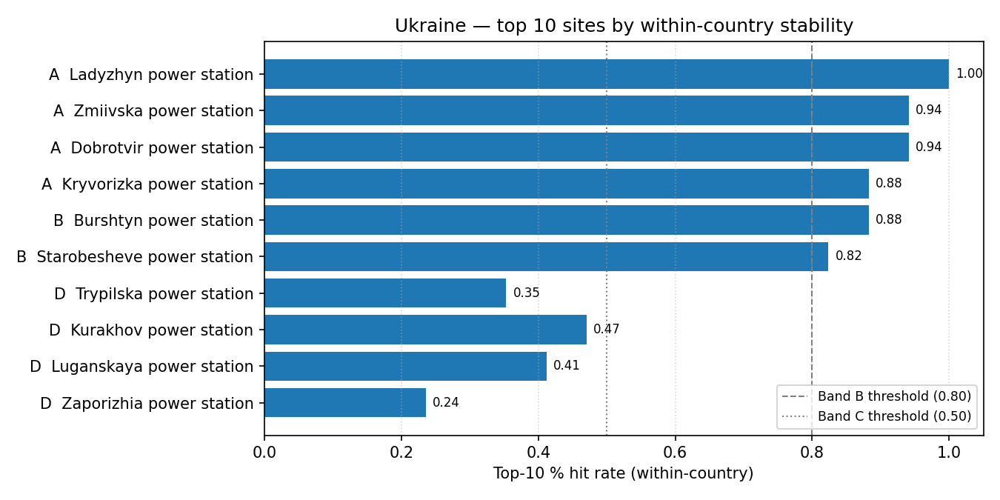

# Ukraine (UA) — sensitivity shortlist — 20260523

_Generated on 2026-05-23 (UTC)._

## Envelope

- Scored sites (all-SMR pool): **20**.
- Scored sites (NuScale pool): **20**.
- Non-baseline scenarios: **17**.
- Within-country top-5 / 10 / 30 % percentiles are computed on the local pool, so **bands reflect national competitiveness**.

## Ranked shortlist — all SMRs pooled (top 10)

| Rank | Site | Country | Band | Top-5 % rate | Top-10 % rate | Top-30 % rate |
| ---: | --- | --- | :---: | ---: | ---: | ---: |
| 1 | Ladyzhyn power station | UA | A | 0.9412 | 1.0 | 1.0 |
| 2 | Zmiivska power station | UA | A | 0.9412 | 0.9412 | 1.0 |
| 3 | Dobrotvir power station | UA | A | 0.9412 | 0.9412 | 1.0 |
| 4 | Kryvorizka power station | UA | A | 0.8235 | 0.8824 | 0.9412 |
| 5 | Burshtyn power station | UA | B | 0.1765 | 0.8824 | 1.0 |
| 6 | Starobesheve power station | UA | B | 0.1176 | 0.8235 | 0.9412 |
| 7 | Trypilska power station | UA | D | 0.1176 | 0.3529 | 1.0 |
| 8 | Kurakhov power station | UA | D | 0.0588 | 0.4706 | 0.9412 |
| 9 | Luganskaya power station | UA | D | 0.0 | 0.4118 | 0.8824 |
| 10 | Zaporizhia power station | UA | D | 0.0 | 0.2353 | 0.9412 |
| … 10 more | | | | | | |

**Band counts:** A=4, B=2, C=0, D=7, E=1, F=0, G=0, H=6.

## Ranked shortlist — NuScale `nuscale_voygr6` (top 10)

| Rank | Site | Country | Band | Top-5 % rate | Top-10 % rate | Top-30 % rate |
| ---: | --- | --- | :---: | ---: | ---: | ---: |
| 1 | Zmiivska power station | UA | A | 0.9412 | 0.9412 | 1.0 |
| 2 | Dobrotvir power station | UA | A | 0.9412 | 0.9412 | 1.0 |
| 3 | Ladyzhyn power station | UA | A | 0.8235 | 1.0 | 1.0 |
| 4 | Kryvorizka power station | UA | B | 0.2941 | 0.8824 | 0.9412 |
| 5 | Burshtyn power station | UA | B | 0.1176 | 0.8824 | 1.0 |
| 6 | Starobesheve power station | UA | D | 0.0588 | 0.1765 | 0.9412 |
| 7 | Trypilska power station | UA | D | 0.0 | 0.2353 | 1.0 |
| 8 | Luganskaya power station | UA | D | 0.0 | 0.2353 | 0.8824 |
| 9 | Kurakhov power station | UA | D | 0.0 | 0.1176 | 0.9412 |
| 10 | Zaporizhia power station | UA | D | 0.0 | 0.0588 | 0.9412 |
| … 10 more | | | | | | |

**NuScale band counts:** A=3, B=2, C=0, D=6, E=1, F=0, G=2, H=6.

## Interpretation

- Sites in Bands A–C (within-country robust top tier): **6**.
- Band A / B sites are in the local top-5 % / 10 % slice in ≥ 80 % of the 14 non-baseline scenarios — the defensible national shortlist under perturbation.
- Sources: `20260523_site_bands_UA.csv`, `20260523_site_bands_UA_nuscale_voygr6.csv`.

## Score provenance

Scores feeding this shortlist follow the project's API-primary / LLM-fallback hierarchy: exclusionary E-codes use Tier 1 (API / open-data) evidence only, while ranking criteria may fall back to Tier 2 (LLM-curated) values when API coverage is absent. See [`sensitivity_analysis.md` §9](../../../methodology/sensitivity_analysis.md#9-score-provenance-hierarchy) for the tier definitions and the per-tier audit rules.
