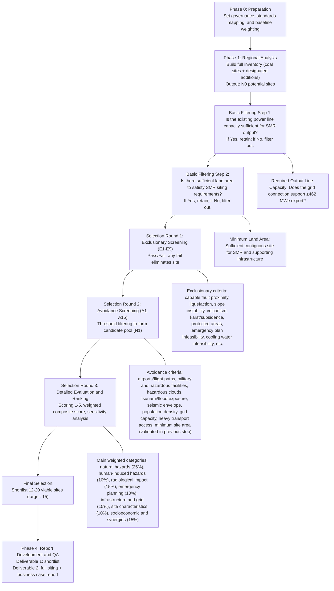

# Aggregated requirements

**Generated:** 2026-03-24  
**Source folder:** `requirements/`  

This file concatenates all Markdown files under `requirements/` for convenience. The canonical, maintained sources remain the individual files listed below. Relative links in embedded sections may still point to paths as written in the originals (for example `../architecture/specs/`).

---

## Included files (order)

- `00_index.md`
- `01_overview.md`
- `02_deliverables.md`
- `03_regulatory_framework.md`
- `04_siting_methodology.md`
- `05_siting_criteria.md`
- `06_scoring_matrix.md`
- `07_data_requirements.md`
- `08_automated_system.md`
- `09_business_case.md`
- `10_execution_plan.md`
- `11_quality_assurance.md`
- `12_references.md`
- `draft_requirements.md`

---

## Source: `requirements/00_index.md`

# SMR Siting Assessment — Requirements Index

**Project Title:** Assessment of Coal Power Plant Sites for Small Modular Reactor (SMR) Deployment in Central, Eastern, and Southern Europe

**Prepared for:** Government of Romania / Nuclearelectrica S.A. (SNN)

**Reference Technology:** NuScale VOYGR-6 (6 × 77 MWe = 462 MWe)

**Version:** 1.0

**Date:** March 2026

---

## Table of Contents

| File                                                     | Contents                                                                                             | Original Sections |
| -------------------------------------------------------- | ---------------------------------------------------------------------------------------------------- | ----------------- |
| [01_overview.md](01_overview.md)                         | Executive Summary, Context, Scope                                                                    | S1, S2, S3        |
| [02_deliverables.md](02_deliverables.md)                 | Deliverables                                                                                         | S4                |
| [03_regulatory_framework.md](03_regulatory_framework.md) | Regulatory and Standards Framework                                                                   | S5                |
| [04_siting_methodology.md](04_siting_methodology.md)     | Siting Methodology                                                                                   | S6                |
| [05_siting_criteria.md](05_siting_criteria.md)           | Siting Criteria Specification                                                                        | S7                |
| [06_scoring_matrix.md](06_scoring_matrix.md)             | Scoring Matrix Design                                                                                | S8                |
| [07_data_requirements.md](07_data_requirements.md)       | Data Requirements and Databases                                                                      | S9                |
| [08_automated_system.md](08_automated_system.md)         | Automated Site Evaluation System (pointer → [architecture/specs](../architecture/specs/00_index.md)) | S10               |
| [09_business_case.md](09_business_case.md)               | Business Case Framework                                                                              | S11               |
| [10_execution_plan.md](10_execution_plan.md)             | Project Execution Plan                                                                               | S12               |
| [11_quality_assurance.md](11_quality_assurance.md)       | Quality Assurance and Management System                                                              | S13               |
| [12_references.md](12_references.md)                     | References                                                                                           | S14               |

---

## Phase-to-File Mapping

| Phase       | Description         | Files to Open                                                                                                   |
| ----------- | ------------------- | --------------------------------------------------------------------------------------------------------------- |
| **Phase 0** | Preparation         | 01_overview, 03_regulatory_framework, 10_execution_plan                                                         |
| **Phase 1** | Data Infrastructure | 01_overview, 07_data_requirements, 08_automated_system, [architecture/specs](../architecture/specs/00_index.md) |
| **Phase 2** | Screening           | 04_siting_methodology, 05_siting_criteria                                                                       |
| **Phase 3** | Detailed Evaluation | 04_siting_methodology, 06_scoring_matrix                                                                        |
| **Phase 4** | Report Development  | 02_deliverables, 09_business_case, 11_quality_assurance                                                         |
| **Always**  | Reference material  | 00_index, 12_references                                                                                         |

---

## End-to-End Siting Process (At-a-Glance)



---

## Audit Trail

Per IAEA QA requirement 13.1.6 (see [11_quality_assurance.md](11_quality_assurance.md)), all correspondence and decision records are preserved in the project repository:

| Folder                                            | Contents                                                                                        |
| ------------------------------------------------- | ----------------------------------------------------------------------------------------------- |
| [`audit/conversations/`](../audit/conversations/) | Structured log of every AI-assisted work session (objective, decisions, files changed, outcome) |
| [`audit/plans/`](../audit/plans/)                 | Copy of every plan created and implemented for this project                                     |

Conventions are documented in [`audit/README.md`](../audit/README.md).

---

## Source: `requirements/01_overview.md`

# SMR Siting Assessment for Coal Power Plant Conversion in Central, Eastern, and Southern Europe

## Project Requirements Specification

**Project Title:** Assessment of Coal Power Plant Sites for Small Modular Reactor (SMR) Deployment in Central, Eastern, and Southern Europe

**Prepared for:** Government of Romania / Nuclearelectrica S.A. (SNN)

**Reference Technology:** NuScale VOYGR-6 (6 × 77 MWe = 462 MWe)

**Version:** 1.0

**Date:** March 2026

---

## 1. Executive Summary

This document specifies the full requirements for a siting assessment study that evaluates the potential of existing coal power plant sites in Central, Eastern, and Southern Europe to host NuScale VOYGR-6 Small Modular Reactors (462 MWe). The study region encompasses CEE including Romania, Serbia, Armenia. Romania receives additional focus with two supplementary non-coal sites: Braila-Chiscani (thermal power plant) and FPCU Feldioara.

The project shall produce two primary deliverables:

1. **A shortlist of 12–20 viable sites** (target: 15) that pass international siting criteria.
2. **A comprehensive siting report** detailing each site against IAEA and EPRI frameworks, coupled with a business case for Nuclearelectrica as the first-of-a-kind (FOAK) deployer of NuScale-6 in the European Union.

This project is informed by Romania's approval of the Final Investment Decision (FID) for the Doicești NuScale SMR facility (February 2026) and leverages the coal-to-nuclear transition framework established by DOE, IAEA, and EPRI research demonstrating that 80% of coal plant sites possess the basic characteristics needed to host advanced nuclear reactors.

---

## 2. Project Context and Strategic Rationale

### 2.1 Energy Transition Imperatives

Coal power plants across Central, Eastern, and Southern Europe face accelerated decommissioning timelines under EU climate policy, national decarbonization commitments, and economic pressure from carbon pricing mechanisms. These closures threaten regional employment, energy security, and grid stability. Converting retiring coal assets to nuclear generation addresses all three challenges simultaneously.

### 2.2 Coal-to-Nuclear Conversion Advantages

Research by the U.S. Department of Energy (DOE) and Idaho National Laboratory (INL) establishes that coal-to-nuclear conversions can reduce nuclear overnight capital costs by 15–35% compared to greenfield construction through reuse of:

- Electrical switchyard and transmission interconnections
- Cooling water systems, intake structures, and water rights
- Site roads, rail access, and heavy-haul transport infrastructure
- Administrative buildings, warehouses, and security infrastructure
- Existing environmental permits, baseline monitoring data, and land tenure
- Skilled workforce familiar with power generation operations

Each conversion site has the potential to generate approximately $275 million in regional economic activity and create approximately 650 permanent jobs.

### 2.3 NuScale VOYGR-6 Reference Plant

The reference technology for this assessment is the NuScale VOYGR-6:

**NuScale VOYGR-6 Reference Plant**

| Parameter                     | Value                                   |
| ----------------------------- | --------------------------------------- |
| Configuration                 | 6 × NuScale Power Modules (NPM)         |
| Gross Electrical Output       | 462 MWe (6 × 77 MWe)                    |
| Thermal Output per Module     | 250 MWt                                 |
| Fuel Type                     | UO₂, enrichment <4.95%                  |
| Fuel Assemblies per Module    | 37 (17 × 17 pin array)                  |
| Active Core Height            | 2 metres                                |
| Operating Cycle               | 18–21 months                            |
| Refuelling Outage Duration    | ~10 days                                |
| Design Life                   | 60 years                                |
| Emergency Planning Zone (EPZ) | Reduced relative to conventional LWRs   |
| Module Weight                 | ~700 tonnes (shipped in three segments) |
| NRC Design Approval           | First and only SMR to receive NRC SDA   |
| Land Requirement              | 72.8 ha                                 |

The VOYGR-6 plant footprint is considerably smaller than conventional nuclear installations, making it well-suited for colocation at coal plant sites with existing industrial land.

**GE Hitachi BWRX-300 Comparative Technology**

| Parameter                     | Value                                   |
| ----------------------------- | --------------------------------------- |
| Configuration                 | 1 × BWRX-300 Module                     |
| Gross Electrical Output       | 300 MWe                                 |
| Thermal Output                | ~870 MWt                                |
| Fuel Type                     | UO₂, enrichment <5%                     |
| Fuel Assemblies per Module    | 89 (square lattice, 11×11 array)        |
| Active Core Height            | ~3.7 metres                             |
| Operating Cycle               | 12–24 months                            |
| Refuelling Outage Duration    | ~10-14 days                             |
| Design Life                   | 60 years                                |
| Emergency Planning Zone (EPZ) | Expected to be site boundary            |
| Module Weight                 | Not specified (single pressure vessel)  |
| Regulatory Status             | Licensing underway (US NRC/Canada CNSC) |
| Land Requirement              | 25.3 ha                                 |

**Rolls-Royce SMR Comparative Technology**

| Parameter                     | Value                                   |
| ----------------------------- | --------------------------------------- |
| Configuration                 | 1 × Rolls-Royce SMR module              |
| Gross Electrical Output       | 470 MWe                                 |
| Thermal Output per Module     | 1,358 MWt                               |
| Fuel Type                     | UO₂, enrichment ≤4.95%                  |
| Fuel Assemblies per Module    | 121, 17 × 17 pin array                  |
| Active Core Height            | 2.8 metres active fuelled length        |
| Operating Cycle               | 18–24 months                            |
| Refuelling Outage Duration    | 18 days                                 |
| Design Life                   | 60 years                                |
| Emergency Planning Zone (EPZ) | Reduced relative to conventional LWRs   |
| Module Weight                 | Not public                              |
| NRC Design Approval           | Not applicable; UK GDA Step 2 completed |
| Land Requirement              | 44.5 ha                                 |

**Holtec SMR-300 (Additional Comparative Technology)**

| Parameter                     | Value                                            |
| ----------------------------- | ------------------------------------------------ |
| Configuration                 | 1 × Holtec SMR-300 module                        |
| Gross Electrical Output       | 300 MWe                                          |
| Thermal Output per Module     | 865 MWt                                          |
| Fuel Type                     | UO₂, enrichment <5%                              |
| Fuel Assemblies per Module    | 69, 17 × 17 pin array                            |
| Active Core Height            | Not public                                       |
| Operating Cycle               | 24 months                                        |
| Refuelling Outage Duration    | Up to 7 days                                     |
| Design Life                   | 80 years                                         |
| Emergency Planning Zone (EPZ) | Reduced relative to conventional LWRs            |
| Module Weight                 | Not public                                       |
| NRC Design Approval           | No; licensing/pre-application activities ongoing |
| Land Requirement              | 38 ha                                            |

**Kairos Power / KP-FHR (Hermes) Comparative Technology**

| Parameter                     | Value                                                |
| ----------------------------- | ---------------------------------------------------- |
| Configuration                 | 1 × Hermes test reactor module                       |
| Gross Electrical Output       | 0 MWe                                                |
| Thermal Output per Module     | 35 MWt                                               |
| Fuel Type                     | TRISO pebble fuel, HALEU                             |
| Fuel Assemblies per Module    | Not directly applicable; pebble-fueled core          |
| Active Core Height            | Not public                                           |
| Operating Cycle               | Not public                                           |
| Refuelling Outage Duration    | Not public                                           |
| Design Life                   | Not public                                           |
| Emergency Planning Zone (EPZ) | Not public                                           |
| Module Weight                 | Not public                                           |
| NRC Design Approval           | No; NRC construction permit issued December 14, 2023 |
| Land Requirement              | 30 ha                                                |

**X-energy / Xe-100 Comparative Technology**

| Parameter                     | Value                                          |
| ----------------------------- | ---------------------------------------------- |
| Configuration                 | 1 × Xe-100 module                              |
| Gross Electrical Output       | 80 MWe                                         |
| Thermal Output per Module     | 200 MWt                                        |
| Fuel Type                     | TRISO particle fuel, graphite moderated        |
| Fuel Assemblies per Module    | Not directly applicable; pebble-fueled core    |
| Active Core Height            | Not public                                     |
| Operating Cycle               | Online refuelling                              |
| Refuelling Outage Duration    | Not directly applicable; continuous refuelling |
| Design Life                   | 60 years                                       |
| Emergency Planning Zone (EPZ) | Reduced relative to conventional LWRs          |
| Module Weight                 | Not public                                     |
| NRC Design Approval           | No; NRC pre-application activities ongoing     |
| Land Requirement              | 31 ha                                          |

**Oklo / Aurora Comparative Technology**

| Parameter                     | Value                                                  |
| ----------------------------- | ------------------------------------------------------ |
| Configuration                 | 1 × Aurora powerhouse module                           |
| Gross Electrical Output       | Up to 75 MWe                                           |
| Thermal Output per Module     | Not public                                             |
| Fuel Type                     | Metal fuel, fast-spectrum reactor fuel                 |
| Fuel Assemblies per Module    | Not public                                             |
| Active Core Height            | Not public                                             |
| Operating Cycle               | 10 years or longer between refuelling                  |
| Refuelling Outage Duration    | Not public; long-life core concept                     |
| Design Life                   | Not public                                             |
| Emergency Planning Zone (EPZ) | Not public                                             |
| Module Weight                 | Not public                                             |
| NRC Design Approval           | No; NRC pre-application / licensing activities ongoing |
| Land Requirement              | 22 ha                                                  |

**TerraPower / Natrium Comparative Technology**

| Parameter                     | Value                                                |
| ----------------------------- | ---------------------------------------------------- |
| Configuration                 | 1 × Natrium module                                   |
| Gross Electrical Output       | 345 MWe nominal, 500 MWe peak                        |
| Thermal Output per Module     | 840 MWt                                              |
| Fuel Type                     | Metallic uranium fuel, fast-spectrum reactor         |
| Fuel Assemblies per Module    | Not public                                           |
| Active Core Height            | Not public                                           |
| Operating Cycle               | Not public                                           |
| Refuelling Outage Duration    | Not public                                           |
| Design Life                   | Up to 80 years                                       |
| Emergency Planning Zone (EPZ) | Not public                                           |
| Module Weight                 | Not public                                           |
| NRC Design Approval           | No; NRC construction permit authorized March 4, 2026 |
| Land Requirement              | 51 ha                                                |

### 2.4 Romania's Strategic Position

Romania occupies a unique position as:

- **FOAK EU Deployer:** The Doicești SMR facility, which received conditioned FID approval in February 2026, makes Romania the first EU member state to deploy NuScale technology.
- **Established Nuclear Operator:** Nuclearelectrica (SNN) operates the Cernavoda NPP (Units 1 and 2, CANDU-6) and possesses decades of nuclear regulatory, operational, and workforce experience.
- **Regional Hub Potential:** Romania's FOAK experience positions SNN to export nuclear expertise, project management capabilities, and workforce training services to other countries in the region pursuing similar deployments.

---

## 3. Scope Definition

### 3.1 Geographic Scope

The study region is defined as **Central, Eastern, and Southern Europe**, with mandatory coverage of:

| Country                | Category | Notes                                                                        |
| ---------------------- | -------- | ---------------------------------------------------------------------------- |
| Romania                | Primary  | All coal power plants + 2 additional sites (Braila-Chiscani, FPCU Feldioara) |
| Serbia                 | Primary  | Coal plants                                                                  |
| Armenia                | Primary  | Coal plants                                                                  |
| Bulgaria               | Primary  | Coal plants                                                                  |
| North Macedonia        | Primary  | Coal plants                                                                  |
| Bosnia and Herzegovina | Primary  | Coal plants                                                                  |
| Montenegro             | Primary  | Coal plants                                                                  |
| Greece                 | Primary  | Coal plants                                                                  |
| Hungary                | Primary  | Coal plants                                                                  |
| Croatia                | Primary  | Coal plants                                                                  |
| Czech Republic         | Primary  | Coal plants                                                                  |
| Slovakia               | Primary  | Coal plants                                                                  |
| Poland                 | Primary  | Coal plants                                                                  |
| Turkey                 | Primary  | Coal plants                                                                  |
| Ukraine                | Primary  | Coal plants                                                                  |
| Germany                | Primary  | Coal plants                                                                  |

Secondary-region countries are included to ensure a sufficiently large initial pool of potential sites for screening and to identify cross-border export opportunities for Nuclearelectrica.

### 3.2 Romania-Specific Additional Sites

Beyond coal power plants, the following Romanian sites shall be evaluated under the same criteria framework:

1. **Braila-Chiscani:** Existing thermal power plant site on the Danube River. Evaluation shall consider existing cooling water access, grid connection capacity, and industrial land availability.
2. **FPCU Feldioara:** Evaluation shall assess existing infrastructure, site characteristics, and development potential for SMR hosting.

### 3.3 Technology Scope

All evaluations shall be performed against the design envelopes of each of the three presented SMRs, with the principal candidate: NuScale VOYGR-6 (462 MWe). Specific attention will be given to the criteria map extracted from the iaea documentation and epri documentation, including:

- Site parameter envelope compatibility (seismic, meteorological, hydrological)
- Cooling water requirements (primary: light-water cooling; alternatives: dry cooling, hybrid systems)
- Footprint requirements (~14 hectares for the nuclear island)
- Transport logistics for module delivery (700-tonne segments via road, rail, or barge)
- Grid connection capacity (minimum 462 MWe export capability)

### 3.4 Exclusions

The following are outside the scope of this study:

- Detailed site characterization (SSG-35 Stage 3 and beyond)
- Final safety analysis or licensing documentation
- Environmental impact assessment (EIA) per national regulations
- Detailed engineering design of SMR plant layouts
- Public consultation or stakeholder engagement programmes
- Nuclear security threat assessment (covered separately under IAEA Nuclear Security Series)

---

## Source: `requirements/02_deliverables.md`

## 4. Deliverables

### 4.1 Deliverable 1: Viable Site Shortlist

**Objective:** Identify 12–20 viable sites (target: 15) from the study region.

**Content Requirements:**

| Element                      | Description                                                                                                                                      |
| ---------------------------- | ------------------------------------------------------------------------------------------------------------------------------------------------ |
| Site Identification          | Name, country, geographic coordinates (WGS84), current owner/operator                                                                            |
| Current Status               | Operating / Decommissioned / Planned for closure, with dates                                                                                     |
| Capacity Summary             | Existing installed capacity (MWe thermal), unit types and ages                                                                                   |
| Infrastructure Inventory     | Grid connection voltage and capacity, cooling water source and capacity, transport access (road gauge, rail gauge, navigable waterway proximity) |
| Preliminary Suitability Flag | Pass / Conditional Pass / Excluded, with justification reference                                                                                 |
| Site Map                     | Overview map at ≥1:50,000 scale showing site boundary, exclusion zones, key infrastructure, and population centres                               |

**Format:** postgres database and script to convert it into an Excel spreadsheet

**Selection Criteria:** Sites must have passed the exclusionary and avoidance screening phases (Section 6) and scored above the minimum threshold in the suitability evaluation.

### 4.2 Deliverable 2: Comprehensive Siting Report

**Objective:** A professional-grade report suitable for presentation to the Government of Romania, Nuclearelectrica Board, international partners, and regulatory bodies.

**Structure:**

| Chapter                               | Content                                                                                                        |
| ------------------------------------- | -------------------------------------------------------------------------------------------------------------- |
| 1. Executive Summary                  | Findings, methodology summary, key recommendations                                                             |
| 2. Introduction and Background        | Project rationale, coal-to-nuclear transition context, NuScale VOYGR-6 overview                                |
| 3. Regulatory and Standards Framework | IAEA SSG-35, SSR-1, NS-R-3 (Rev.1), EPRI 3002023910                                                            |
| 4. Methodology                        | Siting process description, data sources, scoring matrix, weighting rationale                                  |
| 5. Regional Analysis                  | Geographic, geopolitical, and energy-system overview of the study region                                       |
| 6. Site Survey Results                | Inventory of all identified coal/thermal plants, initial regional screening outcomes                           |
| 7. Screening Results                  | Exclusionary and avoidance screening, sites eliminated with justification                                      |
| 8. Site Evaluation Profiles           | Individual assessment of each shortlisted site (12–20 profiles) against all criteria                           |
| 9. Scoring and Ranking                | Completed scoring matrix, sensitivity analysis, final ranking                                                  |
| 10. Business Case                     | Coal-to-nuclear economic analysis, FOAK benefits for Nuclearelectrica, expertise export strategy, benefits map |
| 11. Conclusions and Recommendations   | Prioritized site recommendations, next-steps roadmap, risk register                                            |
| Annex A                               | Scoring Matrix (complete)                                                                                      |
| Annex B                               | Individual Site Data Sheets                                                                                    |
| Annex C                               | Database Catalogue and Data Quality Assessment                                                                 |
| Annex D                               | IAEA/EPRI Criteria Cross-Reference Matrix                                                                      |
| Annex E                               | NuScale VOYGR-6 Site Parameter Envelope                                                                        |
| Annex F                               | Benefits Map                                                                                                   |
| Annex G                               | Glossary and Abbreviations                                                                                     |

**Format:** Professional report (estimated 200–350 pages), PDF and editable format, with all figures, tables, and maps at print-quality resolution.

---

## Source: `requirements/03_regulatory_framework.md`

## 5. Regulatory and Standards Framework

### 5.1 IAEA Safety Standards (Primary)

The siting process shall comply with or reference the following IAEA publications:

| Standard          | Title                                                           | Application                                                                                                   |
| ----------------- | --------------------------------------------------------------- | ------------------------------------------------------------------------------------------------------------- |
| **SSG-35**        | Site Survey and Site Selection for Nuclear Installations (2015) | Primary procedural framework for the siting process: site survey, screening, candidate selection, and ranking |
| **SSR-1** (Rev.1) | Site Evaluation for Nuclear Installations                       | Overarching safety requirements for site evaluation (successor to NS-R-3)                                     |
| **SSG-9** (Rev.1) | Seismic Hazards in Site Evaluation for Nuclear Installations    | Seismological database, ground motion assessment, capable fault evaluation                                    |
| **SSG-18**        | Meteorological and Hydrological Hazards in Site Evaluation      | Extreme weather events, coastal and river flooding, drought, climate change projections                       |
| **SSG-21**        | Volcanic Hazards in Site Evaluation for Nuclear Installations   | Volcanic risk assessment where applicable                                                                     |
| **NS-G-3.1**      | External Human Induced Events in Site Evaluation                | Aircraft crash, explosion, toxic release, electromagnetic interference screening distances                    |
| **NS-G-3.2**      | Dispersion of Radioactive Material in Air and Water             | Population distribution, atmospheric and hydrological dispersion assessment                                   |
| **NS-G-3.6**      | Geotechnical Aspects of Site Evaluation and Foundations         | Soil liquefaction, slope stability, subsidence, foundation conditions                                         |
| **GSG-10**        | Prospective Radiological Environmental Impact Assessment        | Radiological impact framework for facilities and activities                                                   |
| **SSG-79**        | Hazards Associated with Human Induced External Events           | Updated guidance on human induced hazards                                                                     |
| **SF-1**          | Fundamental Safety Principles                                   | Overarching safety objective and defence-in-depth principles                                                  |

### 5.2 IAEA Siting Process Framework (per SSG-35)

The IAEA defines a five-stage siting and site evaluation process:

```
Stage 1: SITE SURVEY          → Regional analysis, identification of potential sites,
                                 screening to candidate sites
Stage 2: SITE SELECTION        → Evaluation, comparison, and ranking of candidate
                                 sites to arrive at preferred site(s)
Stage 3: SITE CHARACTERIZATION → Confirmation of suitability, detailed
                                 characterization, design basis derivation
Stage 4: PRE-OPERATIONAL       → Confirmatory and monitoring work
Stage 5: OPERATIONAL           → Monitoring, periodic safety review
```

**This project covers Stages 1 and 2 only.** The deliverables shall provide sufficient basis for a decision-maker to authorise progression to Stage 3 for the top-ranked sites.

### 5.3 IAEA Criteria Classification (per SSG-35 §4)

The IAEA classifies siting criteria into three groups:

1. **Safety-Related Criteria** (four thematic sets):
   - Set 1: Natural hazards (seismic, volcanic, flooding, meteorological, geotechnical)
   - Set 2: Human induced hazards (stationary sources, mobile sources, electromagnetic interference)
   - Set 3: Radiological impact characteristics (atmospheric dispersion, surface/groundwater dispersion, population density/distribution)
   - Set 4: Emergency planning feasibility (physical/infrastructure characteristics, population considerations, emergency planning zones)

2. **Nuclear Security Criteria:** Physical protection feasibility, deterrence, detection, delay, and response capability.

3. **Non-Safety-Related Criteria:** Topography, cooling water availability, grid access, transport infrastructure, socioeconomic impacts, environmental impacts, land use planning.

Each criterion is further typed as:

- **Exclusionary** (mandatory pass/fail)
- **Discretionary** (adjustable threshold for iterative screening)
- **Ranking** (comparative scoring between candidate sites)

If any site is recommended for exclusion this can only be done with human approval. You will provide the necessary reasoning at enough detail through the process to make the decision.

### 5.4 EPRI Siting Guide (3002023910, 2022 Revision)

The EPRI Advanced Nuclear Technology Siting Guide provides a four-step methodology:

| Step | EPRI Category                 | Mapping to IAEA                                              |
| ---- | ----------------------------- | ------------------------------------------------------------ |
| 1    | **Exclusionary Screening**    | Maps to IAEA exclusionary criteria (SSG-35 §3.8, §3.11–3.13) |
| 2    | **Avoidance Screening**       | Maps to IAEA discretionary criteria (SSG-35 §3.8, §3.14)     |
| 3    | **Suitability Evaluation**    | Maps to IAEA detailed site evaluation (SSG-35 §3.3 Step 3)   |
| 4    | **Alternative Sites Ranking** | Maps to IAEA ranking criteria (SSG-35 §3.19–3.23)            |

The EPRI framework explicitly addresses advanced nuclear technologies including SMRs and provides criteria refinements for:

- Reduced emergency planning zones applicable to SMR designs
- Smaller site footprint requirements
- Lower cooling water demands per MWe
- Enhanced transportability considerations

### 5.5 National Regulatory Frameworks

The report shall reference and cross-check against applicable national nuclear regulations for each country where shortlisted sites are located. At minimum:

| Country | Regulatory Authority                                                    | Key Regulations                     |
| ------- | ----------------------------------------------------------------------- | ----------------------------------- |
| Romania | CNCAN (Comisia Națională pentru Controlul Activităților Nucleare)       | Law 111/1996, Nuclear Safety Norms  |
| Serbia  | SRBATOM (Serbian Radiation and Nuclear Safety and Security Directorate) | Law on Radiation and Nuclear Safety |
| Armenia | ANRA (Armenian Nuclear Regulatory Authority)                            | Law on Safe Use of Nuclear Energy   |

---

## Source: `requirements/04_siting_methodology.md`

## 6. Siting Methodology

### 6.1 Process Overview

The siting process shall follow the three-step structure mandated by IAEA SSG-35 §3.3, enhanced by EPRI's four-step framework:

```
┌─────────────────────────────────────────────────────────────────┐
│  PHASE 1: REGIONAL ANALYSIS (IAEA Step 1 / EPRI Pre-screening) │
│  • Compile comprehensive power plant inventory                  │
│  • Define study region boundaries                               │
│  • Identify all potential sites (coal + designated additional)   │
│  Output: Complete inventory of potential sites (N₀ sites)       │
├─────────────────────────────────────────────────────────────────┤
│  PHASE 2: SCREENING (IAEA Step 2 / EPRI Steps 1–2)             │
│  • Apply exclusionary criteria → eliminate disqualified sites   │
│  • Apply avoidance criteria → further reduce to candidate set   │
│  Output: Candidate site list (N₁ sites, where N₁ ≥ 20)        │
├─────────────────────────────────────────────────────────────────┤
│  PHASE 3: EVALUATION & RANKING (IAEA Step 3 / EPRI Steps 3–4)  │
│  • Apply suitability evaluation criteria with weighted scoring  │
│  • Perform cross-comparison and ranking                         │
│  • Conduct sensitivity analysis on weighting assumptions        │
│  Output: Ranked shortlist of 12–20 viable sites (target: 15)   │
└─────────────────────────────────────────────────────────────────┘
```

### 6.2 Phase 1: Regional Analysis

**Objective:** Establish a complete inventory of coal and thermal power plant sites in the study region.

**Data Sources:**

- Global Energy Monitor — Global Coal Plant Tracker
- Beyond Fossil Fuels — Europe Coal Plant Database and Coal Exit Tracker
- National energy ministries and statistical offices
- ENTSO-E Transparency Platform (grid and generation data)
- JRC (EU Joint Research Centre) Power Plant Database

**Actions:**

1. Extract all coal-fired and lignite-fired power plants in the study region (operating, retired since 2000, and planned for retirement by 2045).
2. Extract the two additional Romanian sites (Braila-Chiscani, FPCU Feldioara).
3. For each site, compile: name, coordinates, country, installed capacity (MWe), fuel type, commissioning year, retirement date (actual or planned), owner/operator, and grid connection details.
4. Validate and update data through targeted web searches and cross-referencing against national sources.
5. Ingest the compiled database into a PostgreSQL database for programmatic access.

**Output:** A georeferenced inventory database with verified attributes for all potential sites.

### 6.3 Phase 2: Screening

#### 6.3.1 Exclusionary Screening (IAEA Exclusion Criteria / EPRI Step 1)

Sites shall be eliminated if any of the following conditions are met and no practicable engineering solution exists:

| #   | Criterion                    | Threshold / Condition                                                                                                   | IAEA Reference                                   |
| --- | ---------------------------- | ----------------------------------------------------------------------------------------------------------------------- | ------------------------------------------------ |
| E1  | Capable fault proximity      | Site within 8 km of a capable fault (surface rupture potential)                                                         | SSG-35 Annex II, Table II-1 (No. 1); NS-R-3 §3.7 |
| E2  | Massive soil liquefaction    | Unacceptable liquefaction potential with no engineering remedy                                                          | NS-R-3 §3.38–3.40                                |
| E3  | Massive slope instability    | Catastrophic landslide risk with no engineering remedy                                                                  | SSG-35 Table I-1                                 |
| E4  | Active volcanism             | Site within hazard zone of lava flow, pyroclastic flow, or massive lahar                                                | SSG-35 Table I-1; SSG-21                         |
| E5  | Karst (massive)              | Extensive karst formations threatening foundation integrity                                                             | SSG-35 Table I-1                                 |
| E6  | Subsidence/collapse          | Significant surface collapse potential (e.g., mining voids) without remedy                                              | NS-R-3 §3.35–3.36                                |
| E7  | Protected natural areas      | Site located within legally protected nature reserve, biosphere reserve, or UNESCO site exclusion zone                  | SSG-35 Table II-1 (No. 10)                       |
| E8  | Emergency plan infeasibility | Physical or demographic conditions making emergency response fundamentally infeasible                                   | NS-R-3 §2.27–2.29                                |
| E9  | Insufficient cooling water   | No water source adequate for 462 MWe thermal rejection within feasible engineering distance, and dry cooling not viable | SSG-35 §4.9                                      |

#### 6.3.2 Avoidance/Discretionary Screening (IAEA Discretionary Criteria / EPRI Step 2)

Remaining sites shall be further screened using adjustable thresholds. These thresholds may be iteratively adjusted to achieve the target number of candidate sites:

| #   | Criterion                        | Initial Threshold                                                                     | IAEA Reference                      |
| --- | -------------------------------- | ------------------------------------------------------------------------------------- | ----------------------------------- |
| A1  | Airport proximity (flight path)  | ≥4.0 km from flight paths approaching an airport                                      | SSG-35 Table II-1 (No. 2); NS-G-3.1 |
| A2  | Airport proximity (Type 2 event) | ≥7.5 km from airport with Type 2 event attributes                                     | SSG-35 Table II-1 (No. 3)           |
| A3  | Small airport proximity          | ≥10.0 km from small airports                                                          | SSG-35 Table II-1 (No. 4)           |
| A4  | Large airport proximity          | ≥16.0 km for >500d² yearly flight operations                                          | SSG-35 Table II-1 (No. 5)           |
| A5  | Military installation proximity  | ≥30.0 km from practice/bombing/firing ranges                                          | SSG-35 Table II-1 (No. 6)           |
| A6  | Military ammunition storage      | ≥8.0 km from ammunition storage facilities                                            | SSG-35 Table II-1 (No. 7)           |
| A7  | Hazardous material facilities    | ≥5.0 km from flammable/toxic/explosive storage                                        | SSG-35 Table II-1 (No. 8)           |
| A8  | Hazardous cloud sources          | ≥8.0 km from sources of hazardous clouds                                              | SSG-35 Table II-1 (No. 9)           |
| A9  | Tsunami exposure                 | ≥10 km from sea/ocean shore or ≥1 km from lake/fjord, or ≥50 m above mean water level | SSG-35 Table II-1 (No. 11)          |
| A10 | Seismic ground motion            | PGA within each SMR design envelope                                                   | SSG-9                               |
| A11 | River/coastal flood risk         | Site elevation adequate or flood defences technically feasible                        | SSG-18                              |
| A12 | Population density               | Population density in site vicinity below national thresholds                         | NS-G-3.2; SSG-35 §A.39              |
| A13 | Grid connection adequacy         | Transmission capacity ≥462 MWe within feasible connection distance                    | EPRI criteria                       |
| A14 | Transport access                 | Road, rail, or waterway capable of handling module segments (~700 tonnes)             | NuScale logistics                   |
| A15 | Site area adequacy               | Available industrial land ≥14 hectares for nuclear island                             | NuScale footprint                   |

### 6.4 Phase 3: Evaluation, Comparison, and Ranking

Candidate sites that pass Phase 2 shall undergo detailed suitability evaluation and comparative ranking using the weighted scoring matrix defined in Section 8.

The evaluation shall:

1. Collect detailed data for each candidate site across all ranking criteria.
2. Apply the scoring matrix to generate numerical scores.
3. Perform weighted aggregation to produce a composite site score.
4. Rank sites from highest to lowest composite score.
5. Conduct sensitivity analysis by varying criterion weights ±20% to test ranking robustness.
6. Select the top 12–20 sites (target: 15) as the final shortlist.

---

## Source: `requirements/05_siting_criteria.md`

## 7. Siting Criteria Specification

### 7.1 Criteria Master Table

The following table consolidates all criteria used across screening and ranking phases, mapped to both IAEA and EPRI frameworks:

#### 7.1.1 Safety-Related Criteria — Natural Hazards

| ID    | Criterion                     | Sub-criteria                                                 | Phase          | IAEA Source                 | EPRI Source              |
| ----- | ----------------------------- | ------------------------------------------------------------ | -------------- | --------------------------- | ------------------------ |
| NH-01 | Seismic: Ground Motion        | PGA, spectral acceleration, return period                    | Screen + Rank  | SSG-9; NS-R-3 §3.1–3.15     | Exclusionary/Suitability |
| NH-02 | Seismic: Surface Rupture      | Capable fault distance, activity, slip rate                  | Screen (Excl.) | SSG-9; NS-R-3 §3.7          | Exclusionary             |
| NH-03 | Geotechnical: Liquefaction    | Soil type, groundwater depth, PGA interaction                | Screen + Rank  | NS-R-3 §3.38–3.40; NS-G-3.6 | Exclusionary/Suitability |
| NH-04 | Geotechnical: Slope Stability | Slope angle, soil/rock type, seismic amplification           | Screen + Rank  | SSG-35 Table I-1; NS-G-3.6  | Exclusionary/Suitability |
| NH-05 | Geotechnical: Subsidence      | Mining history, karst, oil/gas extraction, ground settlement | Screen + Rank  | NS-R-3 §3.35–3.36           | Exclusionary/Suitability |
| NH-06 | Geotechnical: Foundation      | Bearing capacity, depth to bedrock, groundwater regime       | Rank           | NS-G-3.6                    | Suitability              |
| NH-07 | Volcanism                     | Proximity to Holocene volcanoes, volcanic product hazards    | Screen (Excl.) | SSG-21; SSG-35 Table I-1    | Exclusionary             |
| NH-08 | Coastal Flooding              | Storm surge, seiche, tsunami, tidal extremes, wave action    | Screen + Rank  | SSG-18; SSG-35 §A.19–A.27   | Avoidance/Suitability    |
| NH-09 | River Flooding                | Overtopping, dam break, ice hazard, flash flood              | Screen + Rank  | SSG-18; SSG-35 §A.28–A.30   | Avoidance/Suitability    |
| NH-10 | Extreme Winds                 | Straight winds, tornadoes, tropical storms                   | Rank           | SSG-18; SSG-35 Table I-1    | Suitability              |
| NH-11 | Extreme Precipitation         | Snow, hail, freezing rain, intense rainfall, drought         | Rank           | SSG-18                      | Suitability              |
| NH-12 | Extreme Temperatures          | Air and water temperature extremes, climate projections      | Rank           | SSG-18                      | Suitability              |
| NH-13 | Forest/Wildfire               | Proximity to combustible vegetation, fire history            | Rank           | SSG-35 §4.3(l)              | Suitability              |
| NH-14 | Combined Hazards              | Credible combinations (e.g., seismic + flood, wind + snow)   | Rank           | SSG-35 §4.3(m)              | Suitability              |

#### 7.1.2 Safety-Related Criteria — Human Induced Hazards

| ID    | Criterion                    | Sub-criteria                                                 | Phase         | IAEA Source                            | EPRI Source           |
| ----- | ---------------------------- | ------------------------------------------------------------ | ------------- | -------------------------------------- | --------------------- |
| HI-01 | Aircraft Crash               | Airport distance, flight path proximity, air traffic density | Screen + Rank | NS-G-3.1; SSG-35 Table II-1 (Nos. 2–5) | Avoidance/Suitability |
| HI-02 | Industrial Explosions        | Distance to chemical/petrochemical/munitions facilities      | Screen + Rank | NS-G-3.1; NS-R-3 §3.49–3.50            | Avoidance/Suitability |
| HI-03 | Toxic/Gas Releases           | Distance to hazardous cloud sources                          | Screen + Rank | NS-G-3.1; SSG-35 Table II-1 (No. 9)    | Avoidance/Suitability |
| HI-04 | External Fires               | Proximity to flammable storage, pipeline infrastructure      | Screen + Rank | NS-G-3.1                               | Avoidance/Suitability |
| HI-05 | Transport Hazards            | Road/rail/pipeline proximity carrying hazardous materials    | Rank          | NS-G-3.1                               | Suitability           |
| HI-06 | Military Installations       | Distance to ranges, arsenals, restricted airspace            | Screen + Rank | NS-G-3.1; SSG-35 Table II-1 (Nos. 6–7) | Avoidance/Suitability |
| HI-07 | Electromagnetic Interference | Proximity to high-power broadcasting/communication           | Rank          | SSG-35 §4.4(c)                         | Suitability           |
| HI-08 | Other Nuclear Installations  | Distance to existing nuclear facilities (combined risk)      | Rank          | SSG-35 §3.24–3.27                      | Suitability           |

#### 7.1.3 Safety-Related Criteria — Radiological Impact

| ID    | Criterion                   | Sub-criteria                                                 | Phase         | IAEA Source            | EPRI Source           |
| ----- | --------------------------- | ------------------------------------------------------------ | ------------- | ---------------------- | --------------------- |
| RI-01 | Atmospheric Dispersion      | Wind rose, stability classes, terrain effects, mixing height | Rank          | NS-G-3.2; SSG-35 §4.5  | Suitability           |
| RI-02 | Surface Water Dispersion    | River flow, dilution capacity, downstream population/intake  | Rank          | NS-G-3.2               | Suitability           |
| RI-03 | Groundwater Dispersion      | Aquifer characteristics, flow direction, downstream use      | Rank          | NS-G-3.2               | Suitability           |
| RI-04 | Population Density          | Current density within 5/16/25/80 km radii                   | Screen + Rank | NS-G-3.2; SSG-35 §A.39 | Avoidance/Suitability |
| RI-05 | Population Centres Distance | Distance to nearest city/town with population >50,000        | Rank          | NS-G-3.2               | Suitability           |
| RI-06 | Population Projections      | Projected density over 60-year design life                   | Rank          | SSG-35 §A.39           | Suitability           |

#### 7.1.4 Safety-Related Criteria — Emergency Planning

| ID    | Criterion                      | Sub-criteria                                                    | Phase         | IAEA Source                    | EPRI Source           |
| ----- | ------------------------------ | --------------------------------------------------------------- | ------------- | ------------------------------ | --------------------- |
| EP-01 | Emergency Plan Feasibility     | Overall feasibility of emergency response                       | Screen + Rank | NS-R-3 §2.27–2.29; SSG-35 §4.6 | Avoidance/Suitability |
| EP-02 | Evacuation Routes              | Road network capacity, alternative routes, seasonal constraints | Rank          | SSG-35 §4.6(a)–(b)             | Suitability           |
| EP-03 | Physical Geography Constraints | Islands, mountains, rivers obstructing evacuation               | Rank          | SSG-35 §4.6(a)                 | Suitability           |
| EP-04 | Special Populations            | Hospitals, prisons, elderly care within EPZ                     | Rank          | SSG-35 §4.6(c)                 | Suitability           |
| EP-05 | Concurrent Hazard Impact       | External hazards degrading emergency infrastructure             | Rank          | SSG-35 §4.6(f)                 | Suitability           |

#### 7.1.5 Non-Safety-Related Criteria

| ID    | Criterion                        | Sub-criteria                                                  | Phase         | Reference                    |
| ----- | -------------------------------- | ------------------------------------------------------------- | ------------- | ---------------------------- |
| NS-01 | Cooling Water Availability       | Source type, volume, seasonal variation, competing demands    | Screen + Rank | SSG-35 §4.9; EPRI            |
| NS-02 | Grid Connection                  | Transmission voltage, capacity, distance to substation        | Screen + Rank | EPRI                         |
| NS-03 | Transport Access                 | Heavy-haul road, rail gauge/capacity, navigable waterway      | Screen + Rank | EPRI; NuScale logistics      |
| NS-04 | Site Topography                  | Terrain suitability, grading requirements, drainage           | Rank          | SSG-35 Table I-1             |
| NS-05 | Land Availability                | Site footprint adequacy (≥14 ha), land ownership, zoning      | Screen + Rank | EPRI                         |
| NS-06 | Existing Infrastructure          | Reusable structures, roads, services, demolition burden       | Rank          | DOE coal-to-nuclear guidance |
| NS-07 | Environmental Impact (non-rad)   | Thermal discharge, chemical discharge, noise, visual          | Screen + Rank | SSG-35 §4.9; EPRI            |
| NS-08 | Ecological Sensitivity           | Proximity to Natura 2000, RAMSAR, IBAs, protected species     | Screen + Rank | SSG-35 Table II-1 (No. 10)   |
| NS-09 | Socioeconomic Impact             | Employment, tax revenue, community benefit, public acceptance | Rank          | SSG-35 §4.9; EPRI            |
| NS-10 | Workforce Availability           | Existing skilled workforce, retraining potential, housing     | Rank          | DOE coal-to-nuclear guidance |
| NS-11 | Coal-to-Nuclear Synergies        | Degree of infrastructure reuse, cost savings potential        | Rank          | DOE/INL; EPRI                |
| NS-12 | Regulatory/Political Environment | National nuclear policy, public opinion, licensing pathway    | Rank          | EPRI; national policy        |
| NS-13 | Construction Logistics           | Material supply, construction water, temporary facilities     | Rank          | SSG-35 Annex II §II-9(c)     |

---

## Source: `requirements/06_scoring_matrix.md`

## 8. Scoring Matrix Design

### 8.1 Scoring Methodology

Each ranking criterion shall be assessed using a five-level scoring scale:

| Score | Descriptor | Definition                                                          |
| ----- | ---------- | ------------------------------------------------------------------- |
| 5     | Excellent  | Significantly exceeds requirements; minimal or no mitigation needed |
| 4     | Good       | Meets requirements with minor favourable conditions                 |
| 3     | Acceptable | Meets minimum requirements; standard mitigation may be needed       |
| 2     | Marginal   | Approaches minimum requirements; significant mitigation required    |
| 1     | Poor       | Does not meet requirements without major engineering intervention   |

Binary exclusionary criteria (Section 7, Phase = "Screen (Excl.)") are scored Pass/Fail. A Fail on any exclusionary criterion eliminates the site regardless of other scores.

### 8.2 Weighting Framework

Criterion weights shall reflect the relative importance of each criterion category, informed by IAEA principles (safety primacy) and the project's coal-to-nuclear conversion objectives.

| Category                                         | Weight Allocation | Rationale                                              |
| ------------------------------------------------ | ----------------- | ------------------------------------------------------ |
| Safety-Related: Natural Hazards (NH)             | 25%               | Primary safety concern per SF-1 Principle 8            |
| Safety-Related: Human Induced Hazards (HI)       | 10%               | Defence-in-depth from external threats                 |
| Safety-Related: Radiological Impact (RI)         | 15%               | Population protection per NS-R-3 §2.27                 |
| Safety-Related: Emergency Planning (EP)          | 10%               | Emergency response feasibility per NS-R-3 §2.29        |
| Non-Safety: Infrastructure & Grid (NS-01–03)     | 15%               | Critical for coal-to-nuclear economic viability        |
| Non-Safety: Site Characteristics (NS-04–08)      | 10%               | Physical and environmental suitability                 |
| Non-Safety: Socioeconomic & Synergies (NS-09–13) | 15%               | Coal-to-nuclear business case and workforce transition |

**Total: 100%**

Within each category, individual criteria shall be assigned sub-weights summing to the category allocation. The detailed sub-weight table shall be developed during project execution and documented in the report Annex A.

### 8.3 Composite Score Calculation

For each candidate site _s_, the composite score _S(s)_ is calculated as:

\[
S(s) = \sum\_{i=1}^{n} w_i \cdot c_i(s)
\]

Where:

- \( w_i \) = normalised weight for criterion _i_ (sum of all weights = 1.0)
- \( c_i(s) \) = score (1–5) for site _s_ on criterion _i_
- \( n \) = total number of ranking criteria

### 8.4 Sensitivity Analysis

To ensure ranking robustness:

1. **Weight perturbation:** Each category weight shall be varied ±20% (with complementary adjustment of other weights to maintain sum = 100%). Rankings shall be re-computed for each perturbation.
2. **Score uncertainty:** Where data quality is low, criterion scores shall be assigned as ranges (e.g., 2–4). Monte Carlo simulation (1,000 iterations) using uniform distributions within score ranges shall produce a ranking stability index.
3. **Threshold sensitivity:** Discretionary screening thresholds (Section 6.3.2) shall be varied ±25% to assess the impact on the candidate site pool.

Results shall be reported as a ranking stability table showing whether each site's position in the top-15 is robust or sensitive to assumption changes.

---

## Source: `requirements/07_data_requirements.md`

## 9. Data Requirements and Databases

### 9.1 Data Categories

Per IAEA SSG-35 §5.8 and the Appendix to SSG-35, the following data categories shall be compiled for each potential/candidate site:

| #   | Data Category         | SSG-35 Ref | Key Data Elements                                                                                        |
| --- | --------------------- | ---------- | -------------------------------------------------------------------------------------------------------- |
| 1   | Geological            | §A.3–A.6   | Regional geological maps, stratigraphy, cross-sections, tectonic maps, satellite imagery, borehole logs  |
| 2   | Hydrogeological       | §A.3–A.6   | Groundwater maps, aquifer characteristics, flow direction, water table depth                             |
| 3   | Seismological         | §A.7–A.9   | Earthquake catalogues (historical and instrumental), seismic source zones, PGA maps, hazard curves       |
| 4   | Fault Displacement    | §A.10–A.12 | Capable fault maps, geomorphological surveys, slip rates, paleoseismic data                              |
| 5   | Volcanological        | §A.13–A.15 | Holocene volcano locations, eruption histories, volcanic product hazard zones                            |
| 6   | Geotechnical          | §A.16–A.18 | Soil classification, bearing capacity, liquefaction susceptibility, slope maps                           |
| 7   | Coastal Flooding      | §A.19–A.27 | Tidal data, storm surge records, tsunami catalogues, shoreline stability                                 |
| 8   | River Flooding        | §A.28–A.30 | Discharge/level records, flood extent maps, dam inventories, ice hazard data                             |
| 9   | Meteorological        | §A.31–A.33 | Temperature, precipitation, wind speed/direction, extreme event records, climate projections             |
| 10  | Human Induced Events  | §A.34–A.37 | Industrial facility locations, transport routes, air traffic data, military installations                |
| 11  | Population & Land Use | §A.38–A.41 | Census data, population projections, land use maps, water use, protected areas, emergency infrastructure |

### 9.2 Database Sources

| Data Need                | Primary Database(s)                                | Access Method            | Coverage              | Notes                                             |
| ------------------------ | -------------------------------------------------- | ------------------------ | --------------------- | ------------------------------------------------- |
| **Coal plant inventory** | Global Energy Monitor — Global Coal Plant Tracker  | CSV/XLSX download        | Global, 108 countries | Updated bi-annually                               |
|                          | Beyond Fossil Fuels — Europe Coal Database         | Web download             | EU + Western Balkans  | Retirement timelines                              |
| **Seismicity**           | USGS Earthquake Hazards Program                    | REST API                 | Global                | Real-time and historical catalogues               |
|                          | European-Mediterranean Seismological Centre (EMSC) | REST API / CSV           | Euro-Med region       | Regional seismicity                               |
|                          | GEM Global Earthquake Model                        | GIS datasets             | Global                | Hazard maps, PGA data                             |
|                          | SHARE European Seismic Hazard Model                | WMS/WFS                  | Europe                | Probabilistic hazard maps                         |
| **Geology/Tectonics**    | OneGeology (IUGS/CGI)                              | WMS/WFS                  | Global                | Geological maps                                   |
|                          | European Geological Data Infrastructure (EGDI)     | WMS/API                  | Europe                | Geological surveys, boreholes                     |
|                          | National geological surveys (per country)          | Variable                 | Per country           | High-resolution local data                        |
| **Flooding**             | EU Flood Risk Maps (Floods Directive 2007/60/EC)   | INSPIRE WMS/WFS          | EU member states      | Flood extent, depth, return period                |
|                          | Copernicus Emergency Management Service            | GIS download             | Europe                | Historical flood footprints                       |
|                          | Global Flood Monitoring System (GFMS)              | Web/API                  | Global                | Near-real-time flood data                         |
| **Meteorology**          | Copernicus Climate Data Store (CDS) / ERA5         | CDS API (Python)         | Global                | Reanalysis data: temperature, wind, precipitation |
|                          | NOAA NCEI                                          | API/FTP                  | Global                | Extreme weather records                           |
|                          | National meteorological services                   | Variable                 | Per country           | Station-based observations                        |
| **Population**           | Eurostat (GISCO)                                   | REST API / Bulk download | EU                    | Census data, population grids                     |
|                          | WorldPop                                           | GeoTIFF download         | Global                | High-resolution population density                |
|                          | LandScan (ORNL)                                    | GeoTIFF download         | Global                | Ambient population distribution                   |
| **Land Use/Environment** | CORINE Land Cover (Copernicus)                     | WMS/WFS                  | Europe                | Land use/land cover at 100m                       |
|                          | Natura 2000 Network (EEA)                          | GIS download             | EU                    | Protected areas                                   |
|                          | World Database on Protected Areas (WDPA)           | API/Download             | Global                | UNESCO, RAMSAR, national parks                    |
| **Grid Infrastructure**  | ENTSO-E Transparency Platform                      | REST API                 | Europe                | Generation, cross-border flows                    |
|                          | OpenStreetMap (power=\*)                           | Overpass API             | Global                | Transmission lines, substations                   |
|                          | National TSO data                                  | Variable                 | Per country           | Detailed grid maps                                |
| **Transport**            | OpenStreetMap                                      | Overpass API             | Global                | Road/rail networks                                |
|                          | Inland waterways databases (national)              | Variable                 | Per country           | Navigability, draft limits                        |
| **Volcanism**            | Smithsonian Global Volcanism Program               | Web/API                  | Global                | Holocene volcano database                         |
| **Industrial Hazards**   | EU-SEVESO III Directive facility registers         | National registers       | EU                    | Major accident hazard facilities                  |
|                          | OpenStreetMap (industrial=\*)                      | Overpass API             | Global                | Industrial facility locations                     |
| **Satellite Imagery**    | Copernicus Sentinel Hub                            | API                      | Global                | Optical and radar imagery                         |
|                          | Google Earth Engine                                | Python API               | Global                | Multi-temporal analysis                           |

### 9.3 Data Quality Assessment

Per IAEA SSG-35 §5.5–5.7, each dataset shall be assessed for:

| Quality Dimension      | Assessment Method                                                             |
| ---------------------- | ----------------------------------------------------------------------------- |
| **Completeness**       | Fraction of required data fields populated                                    |
| **Spatial Resolution** | Comparison of dataset resolution vs. required resolution for the siting phase |
| **Temporal Coverage**  | Length of historical record; suitability for return period estimation         |
| **Currency**           | Date of last update; relevance to current conditions                          |
| **Provenance**         | Authoritative source verification; peer review or regulatory acceptance       |
| **Uncertainty**        | Known measurement errors, interpolation artefacts, model assumptions          |

A data quality flag (High / Medium / Low / Insufficient) shall be assigned to each dataset per site. Where data quality is Insufficient, the impact on the screening/ranking decision shall be explicitly documented, and the site shall carry a conditional assessment flag pending additional data collection.

### 9.4 Limitations and Data Gaps

The study shall document all known limitations, including:

1. Non-EU countries (Serbia, Armenia) may have less comprehensive publicly accessible datasets for flood risk, seismic hazard, and land use.
2. Encrypted or restricted EPRI documents may limit direct citation of EPRI methodology details.
3. National-language databases may require translation and interpretation.
4. Some coal plant sites may lack publicly available detailed site plans and environmental monitoring baselines.
5. Military installation locations may be classified or incomplete in open sources.

Mitigation measures for each limitation shall be documented, including fallback data sources and conservative assumptions where data is absent.

---

## Source: `requirements/08_automated_system.md`

## 10. Automated Site Evaluation System

> **This section has been expanded into detailed architecture specifications.**
> The full technical design is maintained in [`architecture/specs/`](../architecture/specs/00_index.md).

### Summary

An automated evaluation system shall be developed to programmatically manage the power plant database, connect to external data APIs, apply screening criteria and scoring matrices, and generate reproducible site evaluation outputs and ranking tables.

### Architecture Specification Files

| Spec                                                                                   | Scope                                                                      |
| -------------------------------------------------------------------------------------- | -------------------------------------------------------------------------- |
| [01_system_overview.md](../architecture/specs/01_system_overview.md)                   | Objectives, high-level architecture, technology stack, development process |
| [02_data_model_postgres.md](../architecture/specs/02_data_model_postgres.md)           | Database schema, field definitions, ingestion pipeline, data quality       |
| [03_backend_services.md](../architecture/specs/03_backend_services.md)                 | Pipeline orchestration, configuration management, CLI entry points         |
| [04_connector_framework.md](../architecture/specs/04_connector_framework.md)           | API connector contracts, per-connector specs, caching, retry policies      |
| [05_screening_scoring_engine.md](../architecture/specs/05_screening_scoring_engine.md) | Exclusionary/avoidance screens, scoring, ranking, sensitivity analysis     |
| [06_execution_observability.md](../architecture/specs/06_execution_observability.md)   | Structured logging, run lifecycle, error handling, post-run reporting      |
| [07_test_validation_strategy.md](../architecture/specs/07_test_validation_strategy.md) | Unit, integration, and end-to-end testing; manual cross-validation         |

### Traceability

The original content of this document (S10.1–S10.8) maps to the architecture specs as follows:

| Original Subsection               | Architecture File(s)                                   |
| --------------------------------- | ------------------------------------------------------ |
| 10.1 System Objectives            | 01_system_overview                                     |
| 10.2 Architecture                 | 01_system_overview                                     |
| 10.3 Power Plant Database         | 02_data_model_postgres                                 |
| 10.4 Data Validation Module       | 03_backend_services (noted: not required at this time) |
| 10.5 API Connector Framework      | 04_connector_framework                                 |
| 10.6 Screening and Scoring Engine | 05_screening_scoring_engine                            |
| 10.7 Technology Stack             | 01_system_overview                                     |
| 10.8 Software Development Process | 01_system_overview, 07_test_validation_strategy        |

---

## Source: `requirements/09_business_case.md`

## 11. Business Case Framework

### 11.1 Objective

The business case chapter of the report (Deliverable 2, Chapter 10) shall argue for the deployment of NuScale VOYGR-6 on the shortlisted sites and articulate the strategic benefits for Nuclearelectrica (SNN) as the FOAK EU deployer.

### 11.2 Economic Analysis Components

| Component                                | Scope                                                                                                                                          |
| ---------------------------------------- | ---------------------------------------------------------------------------------------------------------------------------------------------- |
| **Capital Cost Comparison**              | Greenfield vs. coal-to-nuclear overnight capital cost, quantifying the 15–35% cost reduction from infrastructure reuse per DOE/INL analysis    |
| **Levelized Cost of Electricity (LCOE)** | LCOE estimate for NuScale-6 at representative shortlisted sites, benchmarked against regional alternatives (gas CCGT, onshore wind, solar PV)  |
| **Revenue Projections**                  | Electricity market price forecasts for each national market, capacity payment mechanisms, clean energy premiums                                |
| **Employment Impact**                    | Direct construction and permanent operations jobs, indirect supply chain employment, comparison with lost coal employment                      |
| **Tax Revenue**                          | National and local tax contributions from construction and operation                                                                           |
| **Avoided Costs**                        | Avoided carbon costs (ETS), avoided air pollution health costs (PM2.5, SOx, NOx), avoided grid reinforcement costs                             |
| **Financing Considerations**             | EU funding instruments (Modernisation Fund, Just Transition Fund, EURATOM loans), national investment incentives, export credit agency support |

### 11.3 Benefits Map

A structured benefits map shall be developed identifying all direct, indirect, and strategic benefits of NuScale-6 deployment for Nuclearelectrica and Romania. At minimum:

| Benefit Category          | Specific Benefits                                                                                                                                                                                                   |
| ------------------------- | ------------------------------------------------------------------------------------------------------------------------------------------------------------------------------------------------------------------- |
| **Energy Security**       | Fuel diversification, reduced gas import dependence, baseload stability, grid resilience                                                                                                                            |
| **Decarbonisation**       | Zero operational CO₂ emissions, coal phase-out compliance, EU Green Deal alignment, NDC contribution                                                                                                                |
| **Economic Development**  | Regional economic multiplier effects, industrial supply chain development, workforce upskilling                                                                                                                     |
| **Technology Leadership** | FOAK operational experience, intellectual property development, regulatory precedent                                                                                                                                |
| **Export Opportunities**  | Consulting and project management services to countries in the region (Serbia, Armenia, Bulgaria, etc.), workforce training export, supply chain supplier qualification services, regulatory harmonisation advisory |
| **Just Transition**       | Reemployment of coal workforce, community economic continuity, social licence enhancement                                                                                                                           |
| **Grid Services**         | Flexible operation capability, frequency regulation, grid inertia contribution, hydrogen co-production potential                                                                                                    |
| **National Security**     | Energy sovereignty, reduced vulnerability to fossil fuel supply disruptions, diversified energy mix                                                                                                                 |

### 11.4 FOAK Export Strategy

The report shall detail how Nuclearelectrica can leverage its FOAK NuScale deployment experience to generate revenue and strategic influence:

1. **Operational Expertise Licensing:** Packaging operational procedures, maintenance protocols, and lessons learned for sale to subsequent deployers.
2. **Workforce Training Academy:** Establishing a regional nuclear training centre (potentially co-funded by IAEA Technical Cooperation programmes) to train operators, maintenance staff, and regulators for other countries' deployments.
3. **Project Management Consultancy:** Offering turnkey project management services for coal-to-nuclear conversions based on proven Doicești methodology.
4. **Supply Chain Qualification:** Qualifying Romanian manufacturers and service providers for the NuScale supply chain, creating export-ready industrial capabilities.
5. **Regulatory Harmonisation Support:** Assisting partner countries in adapting Romania's NuScale licensing experience to their national regulatory frameworks.
6. **Joint Venture Participation:** Taking equity positions in subsequent NuScale deployments in the region, leveraging FOAK experience as a strategic asset.

---

## Source: `requirements/10_execution_plan.md`

## 12. Project Execution Plan

### 12.1 Phased Approach

| Phase                            | Activity                                                                 | Duration    | Dependencies  |
| -------------------------------- | ------------------------------------------------------------------------ | ----------- | ------------- |
| **Phase 0: Preparation**         |                                                                          | **2 weeks** |               |
| 0.1                              | Establish project management framework, tools, repositories              | Week 1      | —             |
| 0.2                              | Create document maps for IAEA SSG-35 and supplementary standards         | Week 1      | 0.1           |
| 0.3                              | Create document maps for EPRI 3002023910                                 | Week 1–2    | 0.1           |
| 0.4                              | Finalise criteria weights with project stakeholders                      | Week 2      | 0.2, 0.3      |
| **Phase 1: Data Infrastructure** |                                                                          | **3 weeks** |               |
| 1.1                              | Design and deploy PostgreSQL database schema                             | Week 3      | 0.1           |
| 1.2                              | Ingest coal plant inventory (Global Energy Monitor, Beyond Fossil Fuels) | Week 3      | 1.1           |
| 1.3                              | Add Romania supplementary sites (Braila-Chiscani, FPCU Feldioara)        | Week 3      | 1.1           |
| 1.4                              | Develop and execute web search validation module                         | Weeks 3–5   | 1.2           |
| 1.5                              | Develop API connectors for external databases                            | Weeks 3–5   | 1.1           |
| 1.6                              | Validate API connectors against known reference data                     | Week 5      | 1.5           |
| **Phase 2: Screening**           |                                                                          | **2 weeks** |               |
| 2.1                              | Execute exclusionary screening (E1–E9)                                   | Week 6      | 1.4, 1.5      |
| 2.2                              | Execute avoidance screening (A1–A15)                                     | Week 6–7    | 2.1           |
| 2.3                              | Review screening results, adjust thresholds if needed                    | Week 7      | 2.2           |
| 2.4                              | Produce candidate site list                                              | Week 7      | 2.3           |
| **Phase 3: Detailed Evaluation** |                                                                          | **3 weeks** |               |
| 3.1                              | Retrieve detailed data for all candidate sites via API connectors        | Week 8      | 2.4, 1.5      |
| 3.2                              | Conduct manual data enrichment for primary-region sites                  | Weeks 8–9   | 3.1           |
| 3.3                              | Apply scoring rubrics and compute scores                                 | Week 9      | 3.1, 3.2      |
| 3.4                              | Compute composite scores and rankings                                    | Week 9      | 3.3           |
| 3.5                              | Perform sensitivity analysis                                             | Week 10     | 3.4           |
| 3.6                              | Select final shortlist (12–20 sites)                                     | Week 10     | 3.5           |
| **Phase 4: Report Development**  |                                                                          | **3 weeks** |               |
| 4.1                              | Draft site evaluation profiles                                           | Weeks 10–11 | 3.6           |
| 4.2                              | Develop business case chapter                                            | Weeks 10–11 | 3.6           |
| 4.3                              | Develop benefits map                                                     | Week 11     | 4.2           |
| 4.4                              | Compile full report (Deliverable 2)                                      | Weeks 11–12 | 4.1, 4.2, 4.3 |
| 4.5                              | Compile viable site shortlist (Deliverable 1)                            | Week 12     | 3.6           |
| 4.6                              | Internal review and quality assurance                                    | Week 12–13  | 4.4, 4.5      |
| 4.7                              | Final revision and delivery                                              | Week 13     | 4.6           |

**Total Estimated Duration: 13 weeks**

### 12.2 Document Map Generation (Phase 0)

For each key reference document, a structured mapping file shall be created in the `document_maps/` folder to enable efficient reference during report development:

| Document        | Map File                                | Content                                                                                       |
| --------------- | --------------------------------------- | --------------------------------------------------------------------------------------------- |
| IAEA SSG-35     | `document_maps/SSG-35_map.md`           | Section-by-section summary with paragraph references, table/figure index, criteria extraction |
| IAEA SSR-1      | `document_maps/SSR-1_map.md`            | Requirements summary with paragraph references                                                |
| IAEA SSG-9      | `document_maps/SSG-9_map.md`            | Seismic criteria and data requirements                                                        |
| IAEA SSG-18     | `document_maps/SSG-18_map.md`           | Meteorological/hydrological criteria                                                          |
| IAEA SSG-21     | `document_maps/SSG-21_map.md`           | Volcanic hazard criteria                                                                      |
| IAEA NS-G-3.1   | `document_maps/NS-G-3.1_map.md`         | Human induced events criteria and screening distances                                         |
| IAEA NS-G-3.2   | `document_maps/NS-G-3.2_map.md`         | Dispersion and population criteria                                                            |
| IAEA NS-G-3.6   | `document_maps/NS-G-3.6_map.md`         | Geotechnical criteria                                                                         |
| IAEA GSG-10     | `document_maps/GSG-10_map.md`           | Radiological environmental impact framework                                                   |
| EPRI 3002023910 | `document_maps/EPRI-SitingGuide_map.md` | Criteria categories, screening steps, evaluation methodology                                  |

Each map file shall contain:

- Document metadata (title, year, number of pages, key sections)
- Section-level summaries (1–3 sentences per section)
- Extracted criteria, thresholds, and screening values with exact paragraph/table references
- Cross-references to other IAEA/EPRI documents
- Key figures and tables identified by page number

---

## Source: `requirements/11_quality_assurance.md`

## 13. Quality Assurance and Management System

### 13.1 Compliance with IAEA Management System Requirements

Per IAEA SSG-35 Section 7 and GS-R-3, the project shall maintain:

1. **Work Plan:** This requirements document and the Phase 0 project management framework.
2. **Documentation Control:** All project documents shall be version-controlled (Git), with clear revision history.
3. **Data Quality Programme:** Per Section 9.3, all data shall carry quality flags and provenance metadata.
4. **Traceability:** Every screening decision and score assignment shall be traceable to specific data sources and criteria definitions.
5. **Peer Review:** The final report shall undergo independent technical review before delivery.
6. **Records Management:** All raw data, intermediate calculations, software code, and correspondence shall be preserved in the project repository.

### 13.2 Report Quality Standards

The final report (Deliverable 2) shall meet the following quality standards:

| Aspect              | Requirement                                                                                                              |
| ------------------- | ------------------------------------------------------------------------------------------------------------------------ |
| **Accuracy**        | All factual claims supported by referenced data sources; no unsubstantiated assertions                                   |
| **Completeness**    | All criteria from Section 7 addressed for all shortlisted sites; all data gaps explicitly documented                     |
| **Consistency**     | Uniform scoring methodology applied to all sites; no ad hoc exceptions without documented justification                  |
| **Reproducibility** | Another qualified team, given the same data and methodology, should arrive at substantially the same rankings            |
| **Presentation**    | Professional formatting suitable for government and board-level presentation; all figures and tables publication-quality |
| **Language**        | English (primary); executive summary available for translation into Romanian                                             |

### 13.3 Assumptions Register

The following assumptions underpin this requirements specification. Changes to any assumption may require revision of scope, methodology, or deliverables:

| #   | Assumption                                                                                                                                                        |
| --- | ----------------------------------------------------------------------------------------------------------------------------------------------------------------- |
| A1  | The NuScale VOYGR-6 design envelope is the reference for all site parameter compatibility assessments.                                                            |
| A2  | Publicly available data is sufficient for the site survey (Stage 1) and preliminary site selection (Stage 2) purposes of this study.                              |
| A3  | The study does not constitute a regulatory submission and does not require formal regulatory review or approval.                                                  |
| A4  | The target of 15 sites (range 12–20) is achievable given the size of the study region and the number of coal plants.                                              |
| A5  | Access to the EPRI 3002023910 Siting Guide content is available for methodology reference.                                                                        |
| A6  | National regulatory requirements for site selection in Romania, Serbia, and Armenia are not fundamentally incompatible with the IAEA/EPRI frameworks used herein. |
| A7  | The Doicești FID approval (February 2026) establishes Romania's commitment to NuScale technology and validates the business case premise.                         |
| A8  | Cooling water availability is the primary thermal rejection mechanism; dry cooling or hybrid systems are considered as alternatives where water is constrained.   |

---

## Source: `requirements/12_references.md`

## 14. References

### IAEA Safety Standards

1. IAEA, _Site Survey and Site Selection for Nuclear Installations_, Safety Standards Series No. SSG-35, Vienna (2015).
2. IAEA, _Site Evaluation for Nuclear Installations_, Safety Standards Series No. SSR-1 (Rev. 1), Vienna (2019).
3. IAEA, _Seismic Hazards in Site Evaluation for Nuclear Installations_, Safety Standards Series No. SSG-9 (Rev. 1), Vienna (2022).
4. IAEA, _Meteorological and Hydrological Hazards in Site Evaluation for Nuclear Installations_, Safety Standards Series No. SSG-18, Vienna (2011).
5. IAEA, _Volcanic Hazards in Site Evaluation for Nuclear Installations_, Safety Standards Series No. SSG-21, Vienna (2012).
6. IAEA, _External Human Induced Events in Site Evaluation for Nuclear Power Plants_, Safety Standards Series No. NS-G-3.1, Vienna (2002).
7. IAEA, _Dispersion of Radioactive Material in Air and Water and Consideration of Population Distribution in Site Evaluation for Nuclear Power Plants_, Safety Standards Series No. NS-G-3.2, Vienna (2002).
8. IAEA, _Geotechnical Aspects of Site Evaluation and Foundations for Nuclear Power Plants_, Safety Standards Series No. NS-G-3.6, Vienna (2004).
9. IAEA, _Prospective Radiological Environmental Impact Assessment for Facilities and Activities_, Safety Standards Series No. GSG-10, Vienna (2018).
10. IAEA, _Hazards Associated with Human Induced External Events in Site Evaluation for Nuclear Installations_, Safety Standards Series No. SSG-79, Vienna (2023).
11. IAEA, _Fundamental Safety Principles_, Safety Standards Series No. SF-1, Vienna (2006).

### EPRI

12. EPRI, _Advanced Nuclear Technology: Site Selection and Evaluation Criteria for New Nuclear Energy Generation Facilities (Siting Guide) — 2022 Revision_, Report No. 3002023910, Palo Alto (2022).

### NuScale Power

13. NuScale Power, _NuScale Power Module Technical Specifications_, Portland, Oregon.
14. NuScale Power, _VOYGR SMR Plants_, https://www.nuscalepower.com/en/Products/VOYGR-SMR-Plants.

### DOE / INL — Coal-to-Nuclear

15. DOE/INL, _Investigating Benefits and Challenges of Converting Retiring Coal Plants into Nuclear Plants_, INL/RPT-22-67964, Idaho Falls (2022).
16. DOE, _Coal-to-Nuclear Transitions: An Information Guide_, U.S. Department of Energy (2024).

### Romania / Nuclearelectrica

17. Nuclearelectrica S.A., "The Doicești Small Modular Reactors (SMR) project obtains the Final Investment Decision and enters the third stage of development," Press Release, 12 February 2026.
18. RoPower Nuclear S.A., project documentation and FID approval materials.

### Data Sources

19. Global Energy Monitor, _Global Coal Plant Tracker_, https://globalenergymonitor.org/projects/global-coal-plant-tracker/.
20. Beyond Fossil Fuels, _Europe Coal Plant Database_, https://beyondfossilfuels.org/coal/.
21. USGS, _Earthquake Hazards Program_, https://earthquake.usgs.gov/.
22. Copernicus Climate Data Store, _ERA5 Reanalysis_, https://cds.climate.copernicus.eu/.
23. Eurostat/GISCO, _Population Grid_, https://ec.europa.eu/eurostat/web/gisco.
24. WorldPop, _Population Density_, https://www.worldpop.org/.
25. EEA, _Natura 2000 Network Viewer_, https://natura2000.eea.europa.eu/.
26. UNEP-WCMC, _World Database on Protected Areas_, https://www.protectedplanet.net/.
27. ENTSO-E, _Transparency Platform_, https://transparency.entsoe.eu/.

---

_End of Requirements Specification_

---

## Source: `requirements/draft_requirements.md`

Task: Create a siting report which assesses the potential of coal power plants to host SMRs in the future within the region.
The region is defined as: Central, Eastern, Southern Europe, including Romania, Serbia, Armenia. For Romania, on top of the coal power plants sites other two sites should be evaluated: 1. Braila - Chiscani (thermal power plant) and 2. FPCU Feldioara

Deliverable 1: The aim is to identify a list of between 12-20 viable sites, with an ideal spot on 15 sites.

Deliverable 2: A report which details each of the sites based on international siting criteria (IAEA and EPRI). The report will argue for the business case of building NuScale-6 of 462 MW on these sites and the benefits that Nuclearelectrica can have by building the FOAK of this SMR in Romania by then selling expertise (and any other possible benefits - identify via benefits map) to other countries or companies implementing such technology.

Planning:

1. Identify the IAEA procedures for siting (SSG 35);
   1.1 Read and create shortcut-mapping files for the procedure in order to quickly access parts of the file for token saving purposes. Output the mapping in an md file within document_maps folder.
2. Identify the EPRI procedures for siting
3. Identify the main criteria for siting on each of the main phases:
   a. site survey;
   b. screening;
   c. candidate sites;
4. Create the scoring matrix taking the criteria into account
5. Identify the required databases for obtaining data for each criteria in part.
6. Identify a method of connecting to each of the said database
7. Evaluate the suitability of each database and establish limitations. Establish if the data is suitable.

Build an automated system of site evaluation:

1. plan and ingest the available power plants database: <file> and turn it into a postgres database so we can work with it programatically.
2. Plan on how to update via websearches the status of each power plant in turn in order to validate all of the current data. The status is defined as all pieces of information from the power plant database: <file>
3. Plan and develop the required back-end code in order to connect to each of the required databases in order to obtain information for each evaluation criteria in part. Make sure to respect all software development steps in order to ensure good functioning.

---

