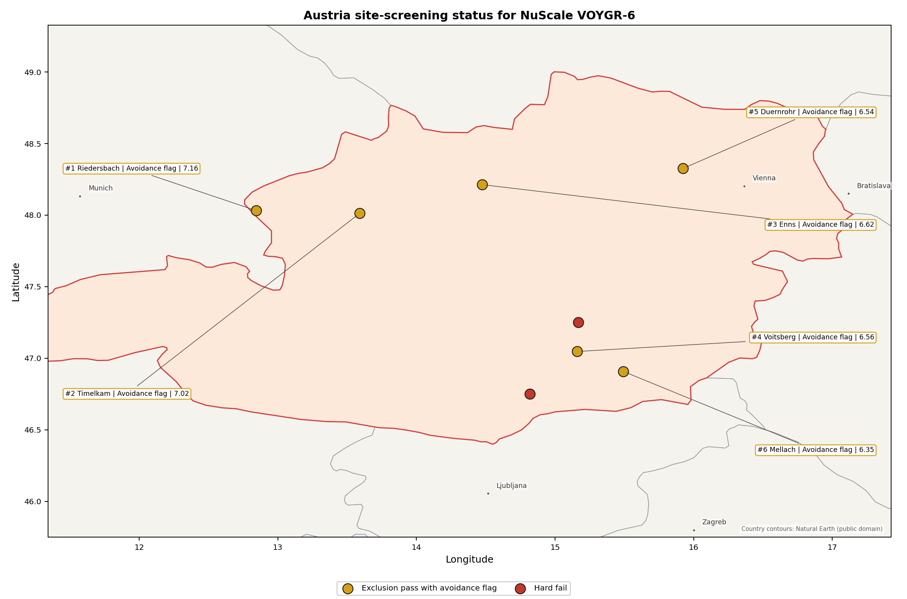
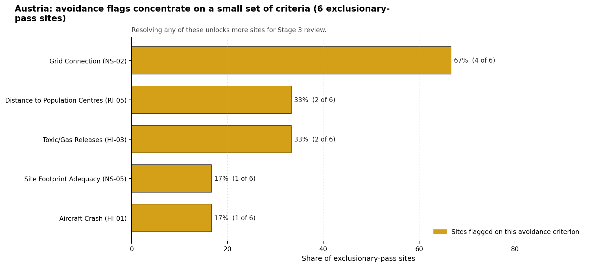

# Austria Country Profile

Analytical basis: the profile uses the frozen NuScale VOYGR-6 scoring baseline and the project's 50,000-iteration national sensitivity analysis.

Austria has 8 thermal and coal-site records tested against the NuScale VOYGR-6 reference deployment envelope. No site passes both the exclusionary and avoidance screens, 6 pass the exclusionary screen but retain avoidance flags, and 2 fail one or more exclusionary checks. Austria should therefore be read as a constrained brownfield pool rather than a clean shortlist. It also requires first-time nuclear-power operating-jurisdiction treatment in any Stage 3 programme, with legal, regulatory, workforce and public-policy readiness reviewed before a project claim is made.

The leading site is **Riedersbach power station**, with a composite score of 7.159 and a Monte Carlo interval of 6.361-7.650. Its national stability band is `A` with a national top-10% hit rate of 100%. The next five scored sites remain in band H, so the national result is a single robust leader followed by a technically relevant but sensitivity-fragile avoidance-flagged tier.

Riedersbach, Timelkam, Enns, Voitsberg and Duernrohr are the five selected Austrian profiles because they are the top five sites by national rank under the frozen baseline. None is a clean full-pass candidate at Stage 1-2. Riedersbach is the only band-A site and the only site with a 100% national top-10 hit rate; the other four selected sites have overlapping Monte Carlo bands but no top-10 persistence in the national sensitivity analysis. This makes Riedersbach the lead Stage 3 characterisation candidate, while the rest of the selected set should be treated as a contingency and issue-resolution pool.

The national unlock agenda is concentrated but demanding. Grid Connection (NS-02) affects 4 of 6 exclusionary-pass sites and is the main programme-level constraint. Toxic/Gas Releases (HI-03) and Distance to Population Centres (RI-05) each affect 2 of 6 sites, while Aircraft Crash (HI-01) and Site Footprint Adequacy (NS-05) each affect one site. Austria's favourable natural-hazard mean does not remove the need for this work: the weak national signals sit in human-induced hazards, radiological proximity and ecological sensitivity.

A credible sequence starts with Riedersbach, because it combines the strongest national stability signal with strong cooling-water and transport evidence, then tests Timelkam as the Upper Austria alternative and Enns, Voitsberg and Duernrohr as targeted issue-resolution cases. The decision gate is not whether Austria has brownfield assets; it does. The decision gate is whether the avoidance flags can be retired without creating a larger legal, emergency-planning or public-policy burden than a new industrial-site search would carry.

## Austria Site Ledger

| Rank | Site | Status | Composite | MC Low | MC High | Band | Top-10 Hit | Coverage |
|---:|---|---|---:|---:|---:|---|---:|---:|
| 1 | Riedersbach power station | Exclusion pass with avoidance flag | 7.159 | 6.361 | 7.650 | A | 100% | 76% |
| 2 | Timelkam power station | Exclusion pass with avoidance flag | 7.016 | 6.245 | 7.487 | H | 0% | 76% |
| 3 | Enns Power Station | Exclusion pass with avoidance flag | 6.616 | 5.922 | 7.156 | H | 0% | 76% |
| 4 | Voitsberg power station | Exclusion pass with avoidance flag | 6.559 | 5.876 | 7.050 | H | 0% | 76% |
| 5 | Duernrohr power station | Exclusion pass with avoidance flag | 6.544 | 5.864 | 7.081 | H | 0% | 76% |
| 6 | Mellach power station | Exclusion pass with avoidance flag | 6.347 | 5.705 | 6.837 | H | 0% | 76% |
| - | St Andrae power station | Hard fail | - | - | - | - | - | 0% |
| - | Zeltweg power station | Hard fail | - | - | - | - | - | 0% |

## Avoidance Flag Pareto

Of the 6 sites that pass the exclusionary screen, the avoidance-phase flags concentrate on a small set of criteria. Resolving them is what would move the country from a small leading group to a broader candidate pool.

- **Grid Connection (NS-02)** - 4 of 6 exclusionary-pass sites (67%).
- **Toxic/Gas Releases (HI-03)** - 2 of 6 exclusionary-pass sites (33%).
- **Distance to Population Centres (RI-05)** - 2 of 6 exclusionary-pass sites (33%).
- **Aircraft Crash (HI-01)** - 1 of 6 exclusionary-pass sites (17%).
- **Site Footprint Adequacy (NS-05)** - 1 of 6 exclusionary-pass sites (17%).

## Exclusionary Failure Pareto

The exclusionary failures across the country trace back to a small number of criteria. They identify which screening checks are responsible for removing sites from further consideration.

- **Seismic: Surface Rupture (NH-02)** - 1 of 8 country sites (12%).
- **Geotechnical: Slope Stability (NH-04)** - 1 of 8 country sites (12%).

## Family Strength and Weakness

Across the country the strongest criterion family is **Natural Hazards** at a mean normalised score of 7.65/10. The weakest family is **Radiological Impact** at 5.54/10. The bottom three individual criteria across the country are:

- **Electromagnetic Interference (HI-07)** - mean 1.50/10 across 8 scored sites (min 1.5, max 1.5).
- **Military Installations (HI-06)** - mean 1.62/10 across 8 scored sites (min 0.0, max 3.5).
- **Ecological Sensitivity (NS-08)** - mean 2.50/10 across 8 scored sites (min 1.5, max 5.5).

## Interpretation for Site Selection

Austria's site-selection result should be read by class first and rank second. The two hard-fail sites remain useful comparators for exclusionary logic, but they should not absorb Stage 3 effort unless the failed natural-hazard findings are overturned by better evidence. The six exclusionary-pass sites are not equivalent candidates: all carry avoidance flags, and only Riedersbach has a strong national sensitivity profile.

The avoidance Pareto shows the practical unlock sequence for Austria. Transmission adequacy is the first system-level question because NS-02 affects most of the exclusionary-pass pool. Hazardous-neighbour and population-centre checks follow because they determine whether Enns and Duernrohr can remain in the selected set after detailed evidence review. Site-footprint work is narrower but important for Riedersbach because its buildable development area is small relative to the broader site surface.

The Monte Carlo intervals overlap across the selected sites, so point-rank differences below Riedersbach should not be overinterpreted. The robust finding is that Austria has one nationally stable avoidance-flagged leader and four selected follow-up sites whose Stage 3 value depends on retiring specific flags. Field work should therefore begin with Riedersbach, run a parallel transmission and land review for Timelkam and Voitsberg, and keep Enns and Duernrohr contingent on hazardous-neighbour, population-centre and ecological screens.

## Status Counts

- Full pass: 0
- Exclusion pass with avoidance flag: 6
- Hard fail: 2
