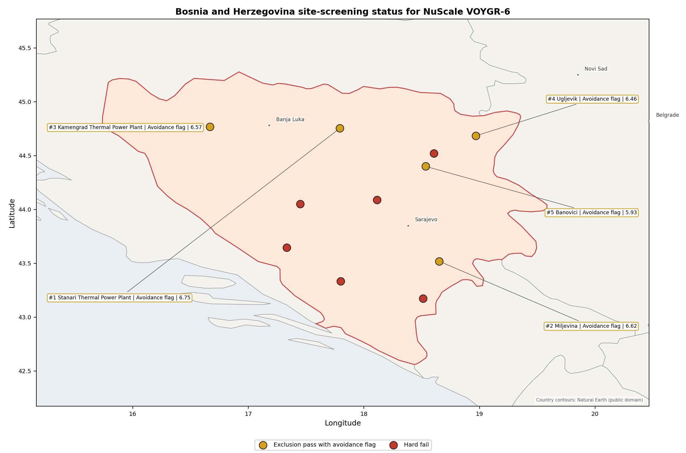
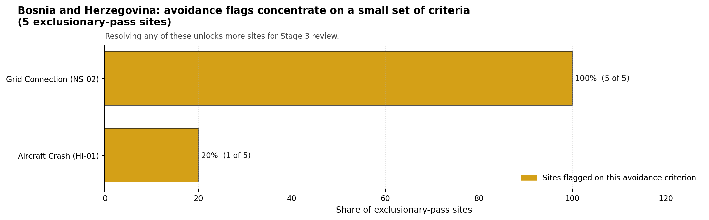
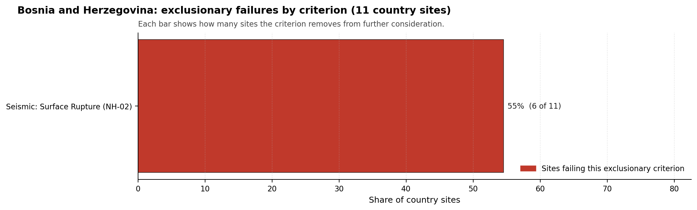

# Bosnia and Herzegovina Country Profile

Analytical basis: the profile uses the frozen NuScale VOYGR-6 scoring baseline and the project's 50,000-iteration national sensitivity analysis.

Bosnia and Herzegovina has 11 thermal and coal-site records tested against the NuScale VOYGR-6 reference deployment envelope. No site passes both the exclusionary and avoidance screens, 5 sites pass the exclusionary screen with avoidance flags, and 6 fail one or more exclusionary checks. The country is therefore an avoidance-led candidate pool: it has a ranked shortlist, but every progression case depends on closing at least one screening-stage constraint before Stage 3 characterisation can be justified.

Bosnia and Herzegovina should be handled as a first-time nuclear-power jurisdiction for this Stage 1-2 screening programme unless the sponsor supplies contrary institutional evidence. That does not prevent site progression, but it makes regulatory capacity, emergency-planning institutions, workforce readiness and cross-entity coordination part of the Stage 3 work plan rather than background assumptions.

The leading site is **Stanari Thermal Power Plant**, with a composite score of 6.747 and a national Monte Carlo interval of 6.028-7.237. Its national stability band is `A`, with a national top-10% hit rate of 91.7%. The leader is therefore a stable national candidate, but it remains avoidance-flagged and should not be described as a full-pass site.

Bosnia and Herzegovina's 11 ranked thermal records produce no full-pass site, 5 avoidance-flagged exclusionary-pass sites, and 6 hard-fail sites. Stanari, Miljevina, Kamengrad, Ugljevik and Banovici form the current leadership pool because they are the only scored exclusionary-pass sites in the frozen national run. The pool is narrow and conditional: Stanari leads with band A stability, while the other four sites sit in band H and therefore depend more heavily on the weight choice and on targeted constraint closure.

The avoidance unlock pool is concentrated. Grid Connection (NS-02) affects 5 of 5 exclusionary-pass sites, or 100%, making transmission-path confirmation the national unlock work. Aircraft Crash (HI-01) affects one site, or 20%, and should be closed through aviation and military-airspace review. The exclusionary tail is geological: Seismic: Surface Rupture (NH-02) removes 6 of 11 records, or 55%, and cannot be treated as a grid or permitting issue.

Greenfield options remain a programme lever if the brownfield shortlist cannot support the desired build-out, but they would need to screen against the same Dinaride capable-fault constraints from the outset. A credible Stage 3 sequence begins with Stanari as the national lead, tests Miljevina and Kamengrad as the first fast followers, keeps Ugljevik and Banovici as conditional reserve candidates, and treats the hard-fail sites as comparators unless new capable-fault evidence changes the exclusionary result.

## Bosnia and Herzegovina Site Ledger

| Rank | Site | Status | Composite | MC Low | MC High | Band | Top-10 Hit | Coverage |
|---:|---|---|---:|---:|---:|---|---:|---:|
| 1 | Stanari Thermal Power Plant | Exclusion pass with avoidance flag | 6.747 | 6.028 | 7.237 | A | 92% | 76% |
| 2 | Miljevina power station | Exclusion pass with avoidance flag | 6.622 | 5.927 | 7.131 | H | 8% | 76% |
| 3 | Kamengrad Thermal Power Plant | Exclusion pass with avoidance flag | 6.572 | 5.886 | 7.131 | H | 0% | 76% |
| 4 | Ugljevik power station | Exclusion pass with avoidance flag | 6.458 | 5.707 | 6.929 | H | 0% | 74% |
| 5 | Banovici power station | Exclusion pass with avoidance flag | 5.934 | 5.325 | 6.425 | H | 0% | 76% |
| - | Bugojno Thermal Power Project | Hard fail | - | - | - | - | - | 0% |
| - | Gacko Thermal Power Plant | Hard fail | - | - | - | - | - | 0% |
| - | Glinica power station | Hard fail | - | - | - | - | - | 0% |
| - | Kakanj Thermal Power Plant | Hard fail | - | - | - | - | - | 0% |
| - | Kongora Thermal Power Plant | Hard fail | - | - | - | - | - | 0% |
| - | Tuzla Thermal Power Plant | Hard fail | - | - | - | - | - | 0% |

## Selected Sites for Detailed Analysis

- **Stanari Thermal Power Plant** - national rank 1, exclusion pass with avoidance flag, composite 6.747, national stability band A.
- **Miljevina power station** - national rank 2, exclusion pass with avoidance flag, composite 6.622, national stability band H.
- **Kamengrad Thermal Power Plant** - national rank 3, exclusion pass with avoidance flag, composite 6.572, national stability band H.
- **Ugljevik power station** - national rank 4, exclusion pass with avoidance flag, composite 6.458, national stability band H.
- **Banovici power station** - national rank 5, exclusion pass with avoidance flag, composite 5.934, national stability band H.

## Avoidance Flag Pareto

Of the 5 sites that pass the exclusionary screen, the avoidance-phase flags concentrate on a small set of criteria. Resolving them is what would move Bosnia and Herzegovina from a conditional shortlist to a stronger Stage 3 candidate pool.

- **Grid Connection (NS-02)** - 5 of 5 exclusionary-pass sites (100%).
- **Aircraft Crash (HI-01)** - 1 of 5 exclusionary-pass sites (20%).

## Exclusionary Failure Pareto

The exclusionary failures across the country trace back to a single criterion. It identifies which screening check is responsible for removing sites from further consideration.

- **Seismic: Surface Rupture (NH-02)** - 6 of 11 country sites (55%).

## Family Strength and Weakness

Across the country the strongest criterion family is **HI** at a mean normalised score of 7.57/10. The weakest family is **EP** at 4.65/10. The bottom three individual criteria across the country are:

- **Military Installations (HI-06)** - mean 1.64/10 across 11 scored sites (min 0.0, max 5.0).
- **Evacuation Routes (EP-02)** - mean 2.41/10 across 11 scored sites (min 1.5, max 3.5).
- **Surface Water Dispersion (RI-02)** - mean 2.77/10 across 11 scored sites (min 1.5, max 7.5).

## Interpretation for Site Selection

The Bosnia and Herzegovina result should be read as a conditional shortlist, not as a full-pass country package. The decisive distinction is that the five ranked sites survive the exclusionary screen, while all five still carry avoidance flags. That makes them candidates for targeted Stage 3 scoping only after grid and aviation constraints are tested at site level.

Stanari is the only site with band A national stability, so it is the correct first characterisation focus. Miljevina, Kamengrad, Ugljevik and Banovici remain useful because their composite scores cluster near the leader, but their band H sensitivity result means small changes in weights or evidence can affect their order. The hard-fail sites remain in the evidence base as comparators because NH-02 surface-rupture screening is a structural exclusionary question until site-specific geological evidence proves otherwise.

The main Stage 3 questions are therefore targeted: confirm the transmission pathway and export-capacity case, resolve the aviation and airspace flag where present, verify capable-fault margins for excluded and near-threshold sites, and convert low-confidence emergency-planning, surface-water and land-envelope proxies into measured local evidence.

## Status Counts

- Full pass: 0
- Exclusion pass with avoidance flag: 5
- Hard fail: 6
