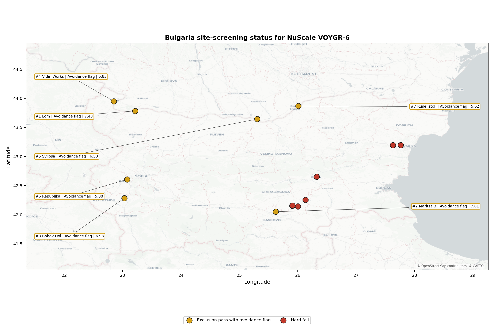
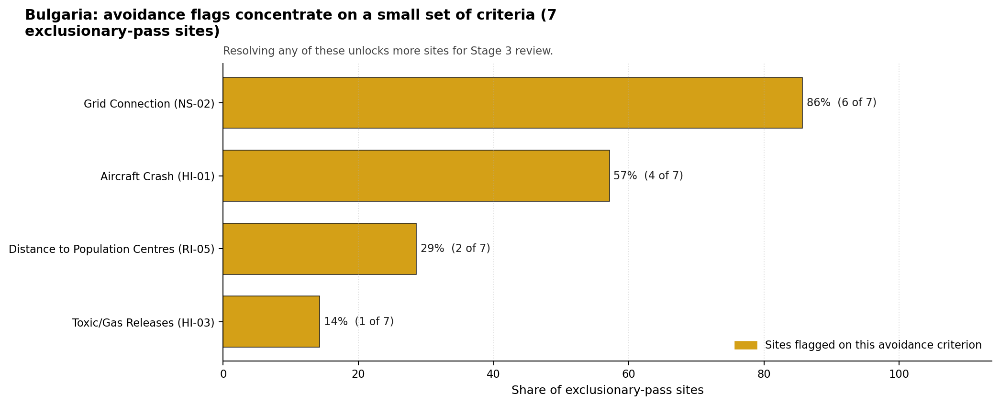
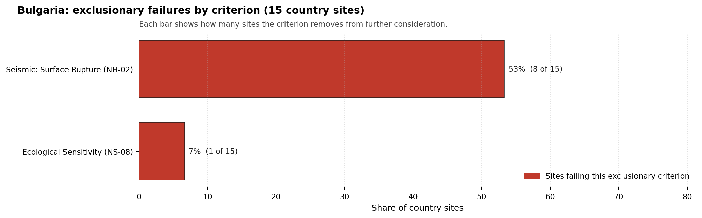

# Bulgaria Country Profile

Analytical basis: the profile uses the frozen NuScale VOYGR-6 scoring baseline and the project's 50,000-iteration national sensitivity analysis.

Bulgaria has 15 thermal and coal-site records tested against the NuScale VOYGR-6 reference deployment envelope. No site passes both the exclusionary and avoidance screens, seven sites pass the exclusionary screen but retain avoidance flags, and eight sites fail one or more exclusionary checks. The country is therefore a remediation-led brownfield pool: it has several sites worth Stage 3 attention, but no candidate should be presented as clear of avoidance work at Stage 1-2.

Bulgaria is a nuclear-experienced power-system jurisdiction, which gives the country a stronger institutional starting point than a first-time nuclear-power market. The country result still depends on site-specific screening evidence. The leading site is **Lom Power Station**, with a composite score of 7.428 and a Monte Carlo interval of 6.578-7.850. Its national stability band is A with a national top-10% hit rate of 100%, but it remains an avoidance-flag candidate because grid-capacity confirmation is still required.

Bulgaria's 15 ranked records produce no full-pass site, seven avoidance-flagged exclusionary-pass sites, and eight hard-fail sites. Lom is the clear national leader because it combines the highest composite score with band-A national stability. Maritsa 3, Bobov Dol, Vidin Works and Svilosa form the next characterisation tier, but each carries material avoidance or implementation work. This structure supports a focused Stage 3 sequence, not a broad fleet claim.

The unlock pool is led by Grid Connection (NS-02), which affects six of the seven exclusionary-pass sites, or 86% of the pool. Aircraft Crash (HI-01) affects four of seven sites, while Distance to Population Centres (RI-05) affects two. Resolving the grid and aviation questions would therefore move most of the Bulgarian exclusionary-pass pool from screening promise toward usable characterisation candidates. The hard-fail tail is dominated by Seismic: Surface Rupture (NH-02), which removes eight of 15 records and limits how much brownfield scale can be unlocked.

Greenfield sites remain a programme lever if Bulgaria's eventual SMR build-out target exceeds what the brownfield pool can support. Within the brownfield evidence, a credible Stage 3 cadence begins with Lom for full characterisation, treats Maritsa 3 and Bobov Dol as the next two comparators, and keeps Vidin Works and Svilosa as conditional options whose value depends on grid, aviation, military, ecological and emergency-planning confirmation.

## Bulgaria Site Ledger

| Rank | Site | Status | Composite | MC Low | MC High | Band | Top-10 Hit | Coverage |
|---:|---|---|---:|---:|---:|---|---:|---:|
| 1 | Lom Power Station | Exclusion pass with avoidance flag | 7.428 | 6.578 | 7.850 | A | 100% | 76% |
| 2 | Maritsa 3 power station | Exclusion pass with avoidance flag | 7.009 | 6.240 | 7.569 | D | 0% | 76% |
| 3 | Bobov Dol power station | Exclusion pass with avoidance flag | 6.984 | 6.220 | 7.525 | G | 0% | 76% |
| 4 | Vidin Works power station | Exclusion pass with avoidance flag | 6.828 | 6.093 | 7.369 | H | 0% | 76% |
| 5 | Svilosa power station | Exclusion pass with avoidance flag | 6.578 | 5.891 | 7.119 | H | 0% | 76% |
| 6 | Republika power station | Exclusion pass with avoidance flag | 5.875 | 5.323 | 6.325 | H | 0% | 76% |
| 7 | Ruse Iztok power station | Exclusion pass with avoidance flag | 5.616 | 5.114 | 6.156 | H | 0% | 76% |
| - | Brikel power station | Hard fail | - | - | - | - | - | 0% |
| - | Deven power station | Hard fail | - | - | - | - | - | 0% |
| - | Maritsa Iztok-1 power station | Hard fail | - | - | - | - | - | 0% |
| - | Maritsa Iztok-2 power station | Hard fail | - | - | - | - | - | 0% |
| - | Maritsa Iztok-3 power station | Hard fail | - | - | - | - | - | 0% |
| - | Maritsa Iztok-4 power station | Hard fail | - | - | - | - | - | 0% |
| - | Sliven power station | Hard fail | - | - | - | - | - | 0% |
| - | Varna power station | Hard fail | - | - | - | - | - | 0% |

Selected site profiles for this country batch are Lom Power Station, Maritsa 3 power station, Bobov Dol power station, Vidin Works power station, and Svilosa power station. This follows the plan rule: top five sites by national ranking under the frozen national run.

## Avoidance Flag Pareto

Of the 7 sites that pass the exclusionary screen, the avoidance-phase flags concentrate on a small set of criteria. Resolving them is what would move the country from a remediation-led pool to a broader candidate set.

- **Grid Connection (NS-02)** - 6 of 7 exclusionary-pass sites (86%).
- **Aircraft Crash (HI-01)** - 4 of 7 exclusionary-pass sites (57%).
- **Distance to Population Centres (RI-05)** - 2 of 7 exclusionary-pass sites (29%).
- **Toxic/Gas Releases (HI-03)** - 1 of 7 exclusionary-pass sites (14%).

## Exclusionary Failure Pareto

The exclusionary failures across Bulgaria are concentrated in a small number of criteria. They identify the screening checks responsible for removing sites from further consideration.

- **Seismic: Surface Rupture (NH-02)** - 8 of 15 country sites (53%).
- **Ecological Sensitivity (NS-08)** - 1 of 15 country sites (7%).

## Family Strength and Weakness

Across the country the strongest criterion family is **Natural Hazards** at a mean normalised score of 7.51/10. The weakest family is **Emergency Planning** at 5.67/10. The bottom three individual criteria across the country are:

- **Military Installations (HI-06)** - mean 1.77/10 across 15 scored sites (min 0.0, max 5.0).
- **Ecological Sensitivity (NS-08)** - mean 2.03/10 across 15 scored sites (min 1.5, max 5.5).
- **Electromagnetic Interference (HI-07)** - mean 2.17/10 across 15 scored sites (min 1.5, max 3.5).

## National Sensitivity and Robustness

The national sensitivity result separates Lom from the rest of the Bulgarian shortlist. Lom holds band A and a 100% national top-10 hit rate, making it the only Bulgarian brownfield site that remains consistently in the leading national tail under the 50,000-iteration sensitivity analysis. Maritsa 3 remains second on the baseline score but sits in band D with no national top-10 persistence, while Bobov Dol, Vidin Works and Svilosa fall into bands G or H. The practical conclusion is that Lom should be characterised first, while the other four sites should be compared through targeted unlock work rather than through small point-score differences.

## Interpretation for Site Selection

Bulgaria has no full-pass brownfield site in the frozen run. The Stage 3 question is therefore not which site is ready, but which avoidance-flagged site gives the strongest return from additional characterisation. Lom is the leading case because its score is highest and its national stability is strongest, but its grid-capacity flag means it still requires transmission-pathway confirmation before it can be treated as a mature candidate.

The chart shows that grid connection and aviation screening are the main country-wide unlocks. Maritsa 3, Bobov Dol, Vidin Works and Svilosa all remain relevant because they pass the exclusionary screen and carry different combinations of grid, aircraft-crash, emergency-planning, ecological and military-installation questions. Hard-fail sites should remain in the evidence base as comparators unless new site-specific evidence changes the NH-02 or NS-08 exclusionary finding.

The Monte Carlo intervals reinforce the need to avoid false precision. The top five sites have overlapping score bands, and only Lom has a stable national sensitivity read. Stage 3 should therefore start with Lom, then run a structured comparison of Maritsa 3 and Bobov Dol, with Vidin Works and Svilosa retained as conditional options where grid, aviation and cross-border environmental constraints can be resolved.

## Status Counts

- Full pass: 0
- Exclusion pass with avoidance flag: 7
- Hard fail: 8
