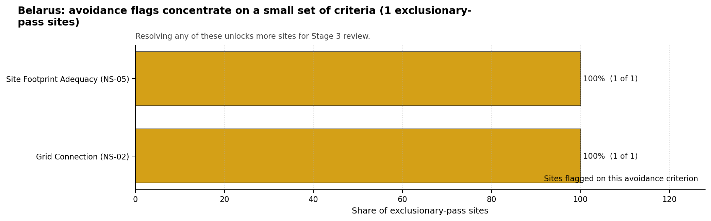
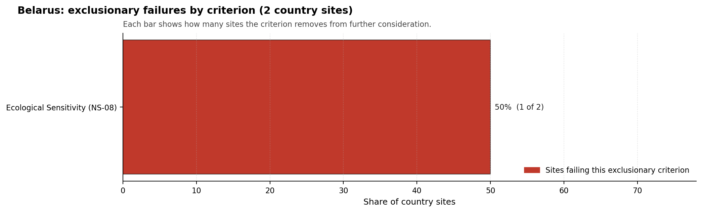

# Belarus Country Profile

Analytical basis: the project's 50,000-iteration national Monte Carlo sensitivity analysis over the current frozen scoring rubric.

Belarus has 2 thermal and coal-site records that have been tested against the NuScale VOYGR-6 reference deployment envelope. 0 sites pass both the exclusionary and avoidance screens, 1 pass the exclusionary screen but retain avoidance flags, and 1 fail one or more exclusionary checks. The country is therefore not a single-site case, but only a small subset of the national site population currently clears the full screening pathway without a remediation step.

The leading site is **Lelchitsy power station**, with a composite score of 5.434 and a Monte Carlo interval of 3.976-5.868. Its national stability band is `A` with a national top-10% hit rate of 88%. The leader is therefore not only the current point-estimate front-runner; it is also a stable national candidate under the sensitivity treatment used for the report.

Of 2 Belarusian thermal sites tested against the NuScale VOYGR-6 envelope, none clear both the exclusionary and avoidance screens, 1 passes exclusionary but carries avoidance flags, and 1 is removed at the exclusionary stage on Ecological Sensitivity (NS-08). Lelchitsy power station is the only ranked candidate with a band-A national stability profile, an 87.5 % top-10 % hit rate, and a composite score of 5.434. This is structurally a one-site-leader case, not a fleet pool.

The avoidance unlock pool is fully concentrated. **Grid Connection (NS-02)** and **Site Footprint Adequacy (NS-05)** each carry the single exclusionary-pass site (100 %), so both must be closed for Lelchitsy to advance: NS-02 needs a transmission-corridor study against the host operator interconnection plan; NS-05 needs a parcel-by-parcel land assessment against the buildable hectares the NuScale VOYGR-6 nuclear-island envelope requires. Both are remediation routes, not deal-breakers.

The Belarusian candidate pool is too small to support a fleet plan from the brownfield base; the greenfield lever would have to do most of the work if the host wishes to expand ambition beyond a single site. A credible Stage 3 sequence begins and ends with Lelchitsy power station, contingent on resolving NS-02 and NS-05 in parallel before any characterisation budget is committed.

## Belarus Site Ledger

| Rank | Site | Status | Composite | MC Low | MC High | Band | Top-10 Hit | Coverage |
|---:|---|---|---:|---:|---:|---|---:|---:|
| 1 | Lelchitsy power station | Exclusion pass with avoidance flag | 5.434 | 3.976 | 5.868 | A | 88% | 38% |
| - | Zelwa power station | Hard fail | - | - | - | H | 12% | 0% |

## Avoidance Flag Pareto

Of the 1 sites that pass the exclusionary screen, the avoidance-phase flags concentrate on a small set of criteria. Resolving them is what would move the country from a small leading group to a broader candidate pool.

- **Grid Connection (NS-02)** - 1 of 1 exclusionary-pass sites (100%).
- **Site Footprint Adequacy (NS-05)** - 1 of 1 exclusionary-pass sites (100%).

## Exclusionary Failure Pareto

The exclusionary failures across the country trace back to a small number of criteria. They identify which screening checks are responsible for removing sites from further consideration.

- **Ecological Sensitivity (NS-08)** - 1 of 2 country sites (50%).

## Family Strength and Weakness

Across the country the strongest criterion family is **Radiological Impact** at a mean normalised score of 6.40/10. The weakest family is **Human-Induced Hazards** at 2.96/10. The bottom three individual criteria across the country are:

- **Military Installations (HI-06)** - mean 0.00/10 across 2 scored sites (min 0.0, max 0.0).
- **Land Area Basic Filter (BF-02)** - mean 2.50/10 across 2 scored sites (min 1.5, max 3.5).
- **Ecological Sensitivity (NS-08)** - mean 2.50/10 across 2 scored sites (min 0.0, max 5.0).

## Interpretation for Site Selection

The Belarus result shows a clear separation between sites that can support further Stage 3 consideration and sites that should remain in the evidence base only as comparators. The full-pass group is the relevant pool for progression. Avoidance-flag sites are not discarded, but they identify locations where a specific constraint must be resolved before the site can be treated as equivalent to the leading group.

The chart shows where focused remediation effort would broaden the candidate pool. The criteria at the top of the Pareto are the policy and engineering levers that, if resolved, move avoidance-flag sites into the leading group.

An IAEA-style reading of the table focuses less on the exact rank number and more on screening class, score stability, and the nature of remaining uncertainty. **Lelchitsy power station** is important because it leads nationally, sits inside the strongest stability band, and retains a full-pass status. That does not establish final site suitability. It is a defensible reason to spend Stage 3 effort on field confirmation, national data review, and stakeholder engagement before lower-ranked or avoidance-flag locations.

The Monte Carlo interval is a caution against false precision: several sites have overlapping score bands, so small score differences should not be overinterpreted. The decisive distinction is whether a site combines acceptable exclusionary performance with a stable ranking position and no unresolved avoidance flag.

The main Stage 3 questions are therefore targeted rather than generic: confirm local natural-hazard inputs, verify emergency-planning assumptions, test land and ownership constraints, assess cooling and grid interface conditions, and reconcile environmental constraints with national permitting requirements.

## Status Counts

- Full pass: 0
- Exclusion pass with avoidance flag: 1
- Hard fail: 1
