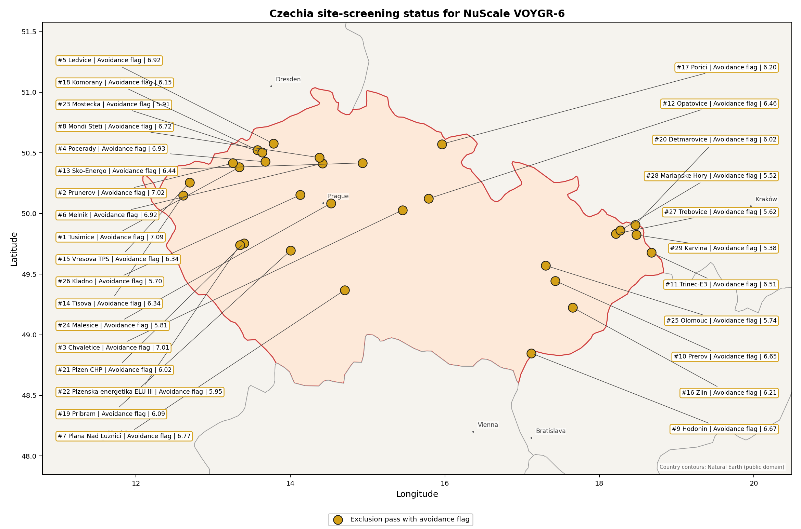
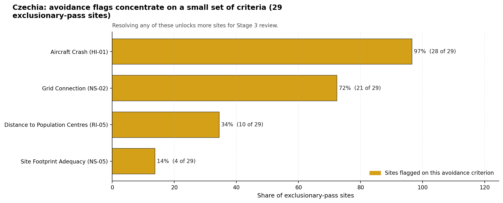

# Czechia Country Profile

Analytical basis: the profile uses the frozen NuScale VOYGR-6 scoring baseline and the project's 50,000-iteration national sensitivity analysis.

Czechia is an established nuclear-power jurisdiction with a large coal and lignite brownfield estate. The screening result should therefore be read as a practical site-reuse and sequencing problem: the institutional setting is more mature than in a first-time nuclear country, but the candidate coal sites still need site-specific avoidance resolution before they can be treated as Stage 3 characterisation priorities.

Czechia has 29 thermal and coal-site records tested against the NuScale VOYGR-6 reference deployment envelope. No site currently clears both the exclusionary and avoidance screens; all 29 exclusionary-pass sites retain at least one avoidance flag, and no site hard-fails the exclusionary screen. The country is therefore an unlock-led brownfield pool rather than a full-pass leadership case.

The leading site is **Tusimice power station**, with a composite score of 7.095 and a Monte Carlo interval of 6.144-7.691. Its national stability band is `A`, with a national top-10% hit rate of 92%. The point-estimate lead is narrow, but Tusimice is the only band-A site in the Czechia pool, so it is the strongest starting point for targeted avoidance-resolution work.

Selected sites for full treatment are the top five by national ranking: Tusimice power station, Prunerov power station, Chvaletice power station, Pocerady power station, and Ledvice power station.

## Czechia Site Ledger

| Rank | Site | Status | Composite | MC Low | MC High | Band | Top-10 Hit | Coverage |
|---:|---|---|---:|---:|---:|---|---:|---:|
| 1 | Tusimice power station | Exclusion pass with avoidance flag | 7.095 | 6.144 | 7.691 | A | 92% | 74% |
| 2 | Prunerov power station | Exclusion pass with avoidance flag | 7.016 | 6.083 | 7.559 | C | 67% | 74% |
| 3 | Chvaletice power station | Exclusion pass with avoidance flag | 7.009 | 6.240 | 7.594 | D | 33% | 76% |
| 4 | Pocerady power station | Exclusion pass with avoidance flag | 6.931 | 6.018 | 7.526 | D | 0% | 74% |
| 5 | Ledvice power station | Exclusion pass with avoidance flag | 6.916 | 6.164 | 7.512 | D | 0% | 76% |
| 6 | Melnik power station | Exclusion pass with avoidance flag | 6.916 | 6.164 | 7.531 | D | 8% | 76% |
| 7 | Plana Nad Luznici power station | Exclusion pass with avoidance flag | 6.773 | 5.896 | 7.309 | D | 0% | 74% |
| 8 | Mondi Steti power station | Exclusion pass with avoidance flag | 6.716 | 6.003 | 7.331 | D | 0% | 76% |
| 9 | Hodonin power station | Exclusion pass with avoidance flag | 6.672 | 5.967 | 7.181 | H | 0% | 76% |
| 10 | Prerov power station | Exclusion pass with avoidance flag | 6.648 | 5.801 | 7.145 | H | 0% | 74% |
| 11 | Trinec-E3 power station | Exclusion pass with avoidance flag | 6.510 | 5.694 | 7.046 | H | 0% | 74% |
| 12 | Opatovice power station | Exclusion pass with avoidance flag | 6.464 | 5.659 | 7.059 | H | 0% | 74% |
| 13 | Sko-Energo power station | Exclusion pass with avoidance flag | 6.438 | 5.639 | 6.980 | H | 0% | 74% |
| 14 | Tisova power station | Exclusion pass with avoidance flag | 6.345 | 5.568 | 6.888 | H | 0% | 74% |
| 15 | Vresova TPS power station | Exclusion pass with avoidance flag | 6.339 | 5.563 | 6.954 | H | 0% | 74% |
| 16 | Zlin power station | Exclusion pass with avoidance flag | 6.214 | 5.467 | 6.730 | H | 0% | 74% |
| 17 | Porici power station | Exclusion pass with avoidance flag | 6.201 | 5.457 | 6.724 | H | 0% | 74% |
| 18 | Komorany power station | Exclusion pass with avoidance flag | 6.153 | 5.548 | 6.700 | H | 0% | 76% |
| 19 | Pribram power station | Exclusion pass with avoidance flag | 6.089 | 5.371 | 6.572 | H | 0% | 74% |
| 20 | Detmarovice power station | Exclusion pass with avoidance flag | 6.016 | 5.437 | 6.506 | H | 0% | 76% |
| 21 | Plzen CHP power station | Exclusion pass with avoidance flag | 6.016 | 5.316 | 6.533 | H | 0% | 74% |
| 22 | Plzenska energetika ELU III power station | Exclusion pass with avoidance flag | 5.951 | 5.265 | 6.414 | H | 0% | 74% |
| 23 | Mostecka Power Station | Exclusion pass with avoidance flag | 5.911 | 5.235 | 6.487 | H | 0% | 74% |
| 24 | Malesice power station | Exclusion pass with avoidance flag | 5.809 | 5.270 | 6.344 | H | 0% | 76% |
| 25 | Olomouc power station | Exclusion pass with avoidance flag | 5.740 | 5.104 | 6.257 | H | 0% | 74% |
| 26 | Kladno power station | Exclusion pass with avoidance flag | 5.703 | 5.184 | 6.319 | H | 0% | 76% |
| 27 | Trebovice power station | Exclusion pass with avoidance flag | 5.622 | 5.013 | 6.066 | H | 0% | 74% |
| 28 | Marianske Hory power station | Exclusion pass with avoidance flag | 5.516 | 4.932 | 5.961 | H | 0% | 74% |
| 29 | Karvina power station | Exclusion pass with avoidance flag | 5.378 | 4.922 | 5.900 | H | 0% | 76% |

## Avoidance Flag Pareto

Of the 29 sites that pass the exclusionary screen, the avoidance-phase flags are concentrated in four criteria. Resolving these criteria is the national unlock agenda for Czechia and applies across the site pool.

- **Aircraft Crash (HI-01)** - 28 of 29 exclusionary-pass sites (97%) - this criterion controls how much of the national brownfield pool can move beyond avoidance review.
- **Grid Connection (NS-02)** - 21 of 29 exclusionary-pass sites (72%) - this criterion controls how much of the national brownfield pool can move beyond avoidance review.
- **Distance to Population Centres (RI-05)** - 10 of 29 exclusionary-pass sites (34%) - this criterion controls how much of the national brownfield pool can move beyond avoidance review.
- **Site Footprint Adequacy (NS-05)** - 4 of 29 exclusionary-pass sites (14%) - this criterion controls how much of the national brownfield pool can move beyond avoidance review.

## Family Strength and Weakness

Across the country the strongest criterion family is **Natural Hazards** at a mean normalised score of 6.99/10. The weakest family is **Radiological Impact** at 5.29/10. The bottom three individual criteria across the country are:

- **Military Installations (HI-06)** - mean 0.36/10 across 29 scored sites (min 0.0, max 1.5).
- **Electromagnetic Interference (HI-07)** - mean 1.50/10 across 29 scored sites (min 1.5, max 1.5).
- **Population Density at EPZ Radii (RI-04)** - mean 2.60/10 across 29 scored sites (min 1.5, max 5.5).

## National Sensitivity and Robustness

The national sensitivity analysis separates Tusimice from the rest of the pool more clearly by stability than by point score. The national band distribution is 1 site in band A, 1 in band C, 6 in band D, and 21 in band H. Prunerov records a 67% top-10% hit rate in band C, while Chvaletice records 33% in band D; Pocerady and Ledvice sit in band D with no national top-10 persistence.

The Monte Carlo intervals for the top five overlap materially. That overlap argues against treating the exact rank order from second to fifth as a final preference order. The practical distinction is that Tusimice combines the lead score with band-A persistence, while the next four sites form a close technical tier whose Stage 3 order depends on resolving aircraft, grid, population-distance, land and ecological constraints.

## Interpretation for Site Selection

Czechia's Stage 3 pathway is a controlled avoidance-resolution programme. It begins with the top-ranked sites because they combine the strongest composite scores with the best national sensitivity evidence, while every selected site still carries at least one avoidance flag.

Aircraft Crash (HI-01) is the dominant national blocker, affecting nearly the whole exclusionary-pass pool. Grid Connection (NS-02) is the second national lever, and Distance to Population Centres (RI-05) and Site Footprint Adequacy (NS-05) define the narrower siting-envelope questions. A credible sequence starts with Tusimice, then tests Prunerov and Chvaletice as the strongest follow-on cases, with Pocerady and Ledvice retained because their composite scores remain close to the leaders despite weaker national top-tier persistence.

## Status Counts

- Full pass: 0
- Exclusion pass with avoidance flag: 29
- Hard fail: 0
