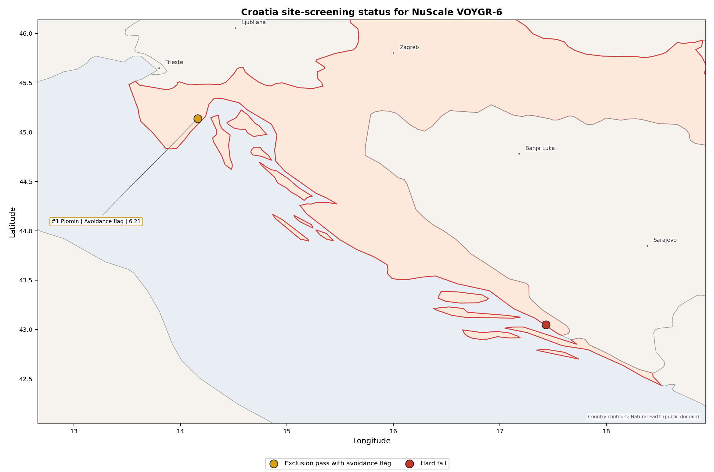
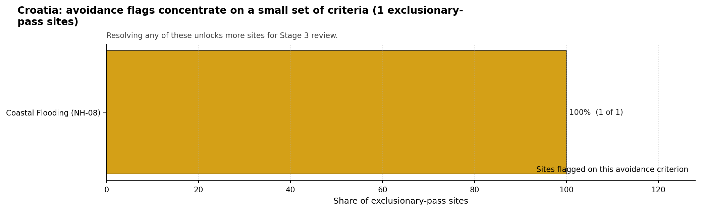
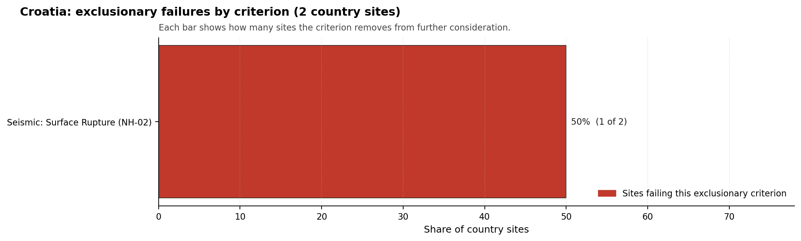

# Croatia Country Profile

Analytical basis: the profile uses the frozen NuScale VOYGR-6 scoring baseline and the project's 50,000-iteration national sensitivity analysis.

Croatia has two thermal and coal-site records tested against the NuScale VOYGR-6 reference deployment envelope. No site clears both the exclusionary and avoidance screens, one site passes the exclusionary screen with an avoidance flag, and one site fails an exclusionary check. The country is therefore a constrained brownfield case: Plomin is the only ranked Croatian candidate, while Ploče remains in the evidence base as a hard-fail comparator.

The leading site is **Plomin power station**, with a composite score of 6.214 and a Monte Carlo interval of 5.467-6.730. Its national stability band is `A` with a national top-10% hit rate of 100%. The leader is stable within Croatia, but it is not avoidance-clean because Coastal Flooding (NH-08) remains unresolved at screening stage.

Croatia's brownfield pool is narrow and should be treated as a single-candidate Stage 3 question rather than a fleet sequence. Plomin combines national rank 1, band A stability and 100% top-10 persistence with an avoidance flag on Coastal Flooding (NH-08). The relevant decision is therefore whether a focused Stage 3 package can resolve the low-elevation coastal exposure, land-envelope and ecological constraints around Plomin, not whether Croatia has several equivalent brownfield options.

The unlock pool is one site and one avoidance criterion. Plomin's NH-08 flag is driven by a sea-coast distance of 3.51 km and a site elevation of 5.88 m, with storm-surge and tsunami exposure still unconfirmed at this screening level. Ploče does not form part of that unlock pool because it fails Seismic: Surface Rupture (NH-02), with the nearest mapped capable fault 3.24 km from the site.

Croatia has regional nuclear-sector exposure through Krško co-ownership, but this screening record does not by itself establish a domestic new-build delivery pathway. A credible programme cadence would start with Plomin only after coastal-flood, land, ecological, security and emergency-planning questions are tested in Stage 3. Expansion beyond Plomin would require a separate greenfield or wider industrial-site search outside the current coal and thermal brownfield pool.

## Croatia Site Ledger

| Rank | Site | Status | Composite | MC Low | MC High | Band | Top-10 Hit | Coverage |
|---:|---|---|---:|---:|---:|---|---:|---:|
| 1 | Plomin power station | Exclusion pass with avoidance flag | 6.214 | 5.467 | 6.730 | A | 100% | 74% |
| - | Ploče power station | Hard fail | - | - | - | - | - | 0% |

## Avoidance Flag Pareto

Of the one site that passes the exclusionary screen, the avoidance-phase flag is concentrated in Coastal Flooding (NH-08). Resolving this question is the condition for treating Plomin as a cleaner Stage 3 candidate.

- **Coastal Flooding (NH-08)** - 1 of 1 exclusionary-pass sites (100%).

## Exclusionary Failure Pareto

The exclusionary failures across the country trace back to a small number of criteria. They identify which screening checks are responsible for removing sites from further consideration.

- **Seismic: Surface Rupture (NH-02)** - 1 of 2 country sites (50%).

## Family Strength and Weakness

Across the country the strongest criterion family is **Human-Induced Hazards** at a mean normalised score of 7.41/10. The weakest family is **Non-Safety / Implementation** at 5.13/10. The bottom three individual criteria across the country are:

- **Military Installations (HI-06)** - mean 0.00/10 across 2 scored sites (min 0.0, max 0.0).
- **Ecological Sensitivity (NS-08)** - mean 1.50/10 across 2 scored sites (min 1.5, max 1.5).
- **Coastal Flooding (NH-08)** - mean 1.75/10 across 2 scored sites (min 0.0, max 3.5).

## Interpretation for Site Selection

The Croatia result supports a targeted, single-site Stage 3 pathway rather than a multi-site brownfield shortlist. Plomin is the only ranked site and the only site that passes the exclusionary screen. Its avoidance flag means the site should progress only with a tightly scoped coastal-flood and site-envelope work package.

The chart shows where focused remediation effort would broaden the candidate pool. The criteria at the top of the Pareto are the policy and engineering levers that, if resolved, move avoidance-flag sites into the leading group.

An IAEA-style reading of the table focuses less on the exact rank number and more on screening class, score stability, and the nature of remaining uncertainty. **Plomin power station** is important because it leads nationally and sits inside the strongest stability band. The avoidance flag prevents it from being treated as a clean candidate, but the stable national ranking is a defensible reason to spend Stage 3 effort on field confirmation before reopening lower-ranked or excluded brownfield locations.

The Monte Carlo interval is a caution against false precision: Croatia has only one scored site, so national stability reflects Plomin's dominance within a small country pool. The decisive distinction is whether Stage 3 can retire the NH-08 avoidance flag while also confirming land, ecology, security and emergency-planning assumptions.

The main Stage 3 questions are therefore targeted rather than generic: confirm coastal flooding and tsunami exposure, test the buildable land envelope, verify ecological permitting constraints, review military and electromagnetic-interference features, and model emergency-planning clearance times for the Istrian setting.

## Status Counts

- Full pass: 0
- Exclusion pass with avoidance flag: 1
- Hard fail: 1
