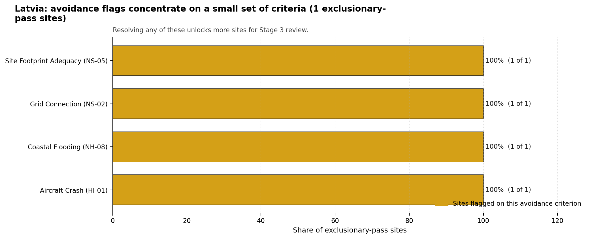

# Latvia Country Profile

Analytical basis: the profile uses the frozen NuScale VOYGR-6 scoring baseline and the project's 50,000-iteration national sensitivity analysis.

Latvia has one thermal and coal-site record tested against the NuScale VOYGR-6 reference deployment envelope. No site clears both the exclusionary and avoidance screens, one site passes the exclusionary screen with avoidance flags, and no site hard-fails the exclusionary screen. The country is therefore a one-site brownfield case, not a multi-site programme pool.

Latvia should be treated as a first-time nuclear-power jurisdiction for this screening profile. That does not weaken the brownfield finding, but it makes regulatory, institutional, workforce and emergency-planning readiness part of the normal Stage 3 programme agenda alongside site characterisation.

The leading and only ranked site is **Kurzeme power station**, with a composite score of 6.603 and a Monte Carlo interval of 5.912-7.200. Its national stability band is `A` with a national top-10% hit rate of 100%. Because the national cohort contains only one ranked site, the stability signal means Kurzeme remains Latvia's only brownfield candidate under the national weight perturbations considered; it does not remove the avoidance constraints that still govern Stage 3 entry.

Latvia's one ranked site gives the country a clear but narrow brownfield option. Kurzeme power station is the sole exclusionary-pass candidate, but it is not a full-pass site because four avoidance flags remain active. The current evidence supports one detailed site profile and a focused unlock programme, rather than a broader brownfield shortlist.

The avoidance unlock pool is fully concentrated on the single candidate. Aircraft Crash (HI-01), Coastal Flooding (NH-08), Grid Connection (NS-02), and Site Footprint Adequacy (NS-05) each affect one of one exclusionary-pass sites. The practical unlock work is therefore not a sequencing exercise across several Latvian sites; it is a direct test of whether Kurzeme can clear aircraft-crash, coastal-flood, grid-export and land-footprint questions within the NuScale VOYGR-6 envelope.

If Latvia wants more than one nuclear siting option, the next increment would need a separate greenfield or wider industrial-site screening pass. A credible Stage 3 sequence begins with Kurzeme only, with characterisation contingent on resolving the four avoidance flags, confirming the national emergency-planning case, and testing whether the 8.7 ha canonical site footprint can support the reference deployment envelope.

## Latvia Site Ledger

| Rank | Site | Status | Composite | MC Low | MC High | Band | Top-10 Hit | Coverage |
|---:|---|---|---:|---:|---:|---|---:|---:|
| 1 | Kurzeme power station | Exclusion pass with avoidance flag | 6.603 | 5.912 | 7.200 | A | 100% | 76% |

Selected site for detailed treatment: **Kurzeme power station**. The top-five national selection rule yields one site because Latvia has only one ranked NuScale VOYGR-6 brownfield candidate in the frozen run.

## Avoidance Flag Pareto

Of the one site that passes the exclusionary screen, all avoidance-phase flags are concentrated on the same candidate. Resolving them would not broaden a Latvian brownfield pool; it would determine whether the country's only brownfield record can move from screening candidate to Stage 3 characterisation candidate.

- **Aircraft Crash (HI-01)** - 1 of 1 exclusionary-pass sites (100%) - requires airport and flight-path hazard assessment before Kurzeme can be treated as a full-pass candidate.
- **Coastal Flooding (NH-08)** - 1 of 1 exclusionary-pass sites (100%) - requires coastal inundation and storm-surge modelling for a low-elevation Baltic coastal setting.
- **Grid Connection (NS-02)** - 1 of 1 exclusionary-pass sites (100%) - requires confirmation that the nearby 110 kV grid context can support the reference export requirement.
- **Site Footprint Adequacy (NS-05)** - 1 of 1 exclusionary-pass sites (100%) - requires confirmation that the 8.7 ha site footprint can be expanded, reconfigured or otherwise demonstrated for the reference envelope.

## Family Strength and Weakness

Across the country, the strongest criterion family is **Natural Hazards** at a mean normalised score of 7.08/10, closely followed by **Radiological Impact** at 7.07/10. The weakest family is **Human-Induced Hazards** at 5.81/10. The bottom three individual criteria across the country are:

- **Military Installations (HI-06)** - mean 0.00/10 across one scored site (min 0.0, max 0.0).
- **Evacuation Routes (EP-02)** - mean 1.50/10 across one scored site (min 1.5, max 1.5).
- **Extreme Winds (NH-10)** - mean 1.50/10 across one scored site (min 1.5, max 1.5).

Land Area Basic Filter (BF-02) and Electromagnetic Interference (HI-07) also score 1.50/10, so the bottom-tier weakness is broader than a single criterion. The country profile should therefore be read as a narrow candidate case with several concentrated Stage 3 workstreams.

## National Sensitivity and Robustness

Kurzeme records national stability band A, with 100% top-5%, top-10% and top-30% hit rates across the national sensitivity scenarios carried in the bundle. The result is robust inside Latvia because the country has only one ranked brownfield site. The same fact limits the interpretation: national rank stability confirms persistence of the only candidate, not the absence of material site constraints.

The Monte Carlo interval of 5.912-7.200 is useful because it keeps the site in a moderate-to-good screening range while still showing that unresolved criteria can move the composite materially. The appropriate Stage 3 reading is therefore focused: do not search for a lower-ranked brownfield alternative in Latvia before testing Kurzeme's aircraft, coastal-flood, land, grid and emergency-planning constraints.

## Interpretation for Site Selection

The Latvia result is structurally different from countries with several full-pass sites. There is no full-pass leadership group and no hard-fail tail; there is one exclusionary-pass site with avoidance flags. That places Kurzeme in a conditional category: it merits detailed characterisation planning only if the avoidance flags can be retired or bounded by site-specific evidence.

An IAEA-style reading of the table focuses less on the exact national rank and more on screening class, stability, and the nature of remaining uncertainty. Kurzeme leads nationally because it is the only ranked Latvian record, and it is stable under national sensitivity because no other Latvian brownfield site competes with it. The decisive question is whether Stage 3 can close the four avoidance flags without creating a new exclusionary issue.

The main Stage 3 questions are targeted: model aircraft-crash exposure around Ventspils International Airport and the flight-path proxy, model Baltic coastal flooding for a 9.95 m site elevation, confirm the grid-export pathway from a 110 kV local context, and verify whether the 8.7 ha canonical site footprint can support the NuScale VOYGR-6 reference envelope. Emergency-planning modelling, defence-feature confirmation, EMI survey, and ecological screening should run in parallel because each can materially affect the characterisation decision.

## Status Counts

- Full pass: 0
- Exclusion pass with avoidance flag: 1
- Hard fail: 0
