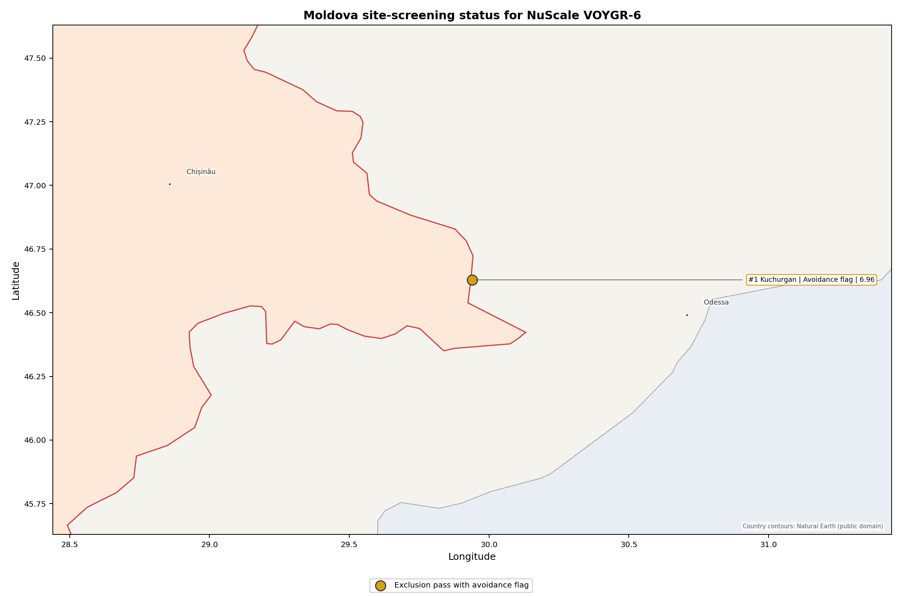
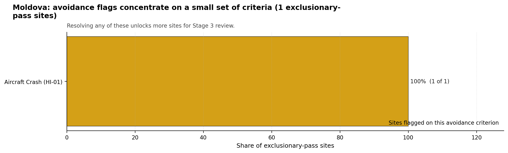

# Moldova Country Profile

Analytical basis: this profile uses the frozen NuScale VOYGR-6 scoring baseline and the project's 50,000-iteration national Monte Carlo sensitivity analysis.

Moldova has one thermal-site record in the current national screening pool. Kuchurgan power station passes the exclusionary screen but retains an avoidance flag, so Moldova has no full-pass brownfield candidate at this stage and no hard-failed site in the country ledger. The country should therefore be treated as a single-site, first-programme case for Stage 1-2 planning: the immediate question is whether Kuchurgan can be unlocked for Stage 3 characterisation, not how to sequence a multi-site national fleet.

The leading and only ranked site is **Kuchurgan power station**, with a composite score of 6.959 and a Monte Carlo interval of 6.199-7.500. Its national stability band is `A` with a national top-10% hit rate of 100%. That stability signal is useful, but it is also a function of Moldova's one-site pool. It should be read as national persistence for Kuchurgan, not as proof that the site is comparable to stronger multi-site country leaders.

The avoidance unlock pool is concentrated on one issue. **Aircraft Crash (HI-01)** affects the only exclusionary-pass site because the bundle records a small airfield at 7.03 km and a flight-path proxy at 3.52 km. Resolving this aviation constraint through national and cross-border aeronautical review is the prerequisite before Kuchurgan can be treated as a candidate for Stage 3 field characterisation.

The Stage 3 cadence is therefore narrow and conditional. Moldova should first resolve the HI-01 aviation screen, then test the site-specific governance, ownership, emergency-planning, grid, cooling-water, land and ecological assumptions that remain material at Kuchurgan. If the aviation issue cannot be resolved, the brownfield option should remain in the evidence base as a comparator and any Moldovan programme expansion would require a separate greenfield or wider industrial-site search.

## Moldova Site Ledger

| Rank | Site | Status | Composite | MC Low | MC High | Band | Top-10 Hit | Coverage |
|---:|---|---|---:|---:|---:|---|---:|---:|
| 1 | Kuchurgan power station | Exclusion pass with avoidance flag | 6.959 | 6.199 | 7.500 | A | 100% | 76% |

## Selected Sites for Detailed Analysis

The selected-site rule returns one Moldovan site because only one Moldovan record exists in the frozen national ranking. The detailed profile is **Kuchurgan power station**.

## Avoidance Flag Pareto

Of the one site that passes the exclusionary screen, the avoidance-phase flag is concentrated on a single criterion. This makes the Moldova unlock pathway clear and testable.

- **Aircraft Crash (HI-01)** - 1 of 1 exclusionary-pass sites (100%).

## Exclusionary Failure Pareto

No Moldovan site fails an exclusionary criterion in the frozen national run.

## Family Strength and Weakness

Across the Moldova pool, the strongest criterion family is **Non-Safety / Implementation** at a mean normalised score of 7.67/10. Radiological Impact follows at 7.28/10, Natural Hazards at 7.21/10, Human-Induced Hazards at 6.47/10, and Emergency Planning at 5.26/10. The bottom individual criteria are:

- **Military Installations (HI-06)** - mean 1.50/10 across one scored site.
- **Surface Water Dispersion (RI-02)** - mean 1.50/10 across one scored site.
- **Evacuation Routes (EP-02)** - mean 1.50/10 across one scored site.
- **Electromagnetic Interference (HI-07)** - mean 1.50/10 across one scored site.

## Interpretation for Site Selection

Moldova's Chapter 5 result is a single-candidate brownfield screen. Kuchurgan has a strong national rank by definition, a stable national sensitivity band, and useful reuse attributes, including an inherited 1,400 MW thermal complex, a nearby 330 kV grid context, rail access, cooling-water proximity, and a large site-area estimate. Those attributes justify a focused Stage 3 decision gate if the avoidance flag can be retired.

The main limitation is that Moldova does not have a diversified screened brownfield pool. Small changes to Kuchurgan's aviation, governance, ownership, emergency-planning, water-dispersion or land-control evidence can therefore change the whole country conclusion. The national sensitivity analysis supports Kuchurgan as Moldova's only ranked candidate, but it does not remove the need for an early go/no-go review on HI-01 and the Transnistria-related governance questions.

For IAEA SSG-35 Stage 1-2 purposes, Kuchurgan should be carried forward as an avoidance-flagged candidate requiring targeted resolution, not as an unconditional preferred site. The immediate Stage 3-preparation package should confirm aviation hazard, emergency-planning feasibility, cooling-water and liquid-pathway behaviour, land availability, ownership and programme governance, and ecological screening before committing to a broader site-characterisation campaign.

## Status Counts

- Full pass: 0
- Exclusion pass with avoidance flag: 1
- Hard fail: 0
