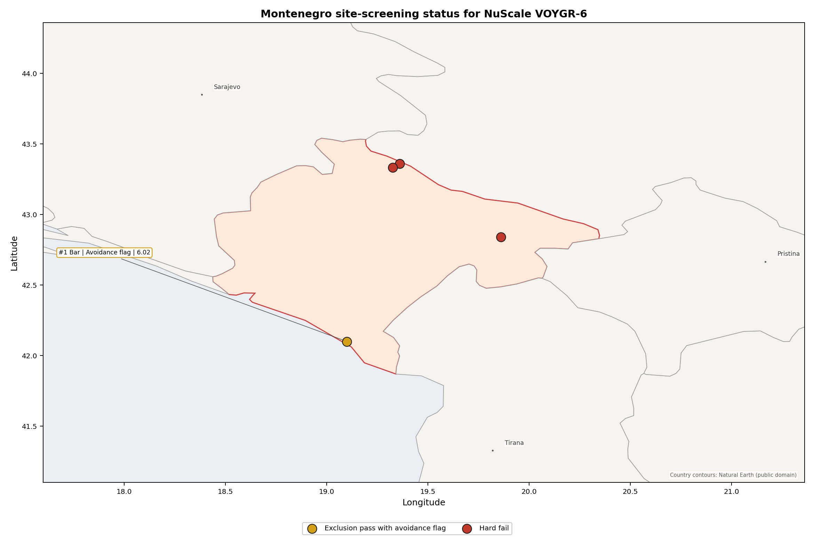
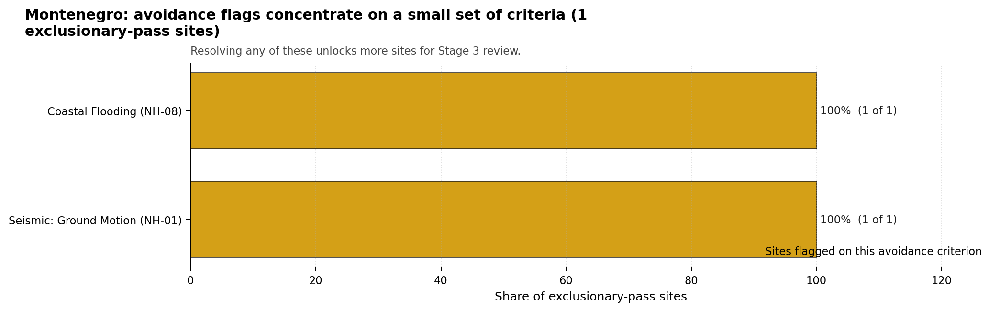
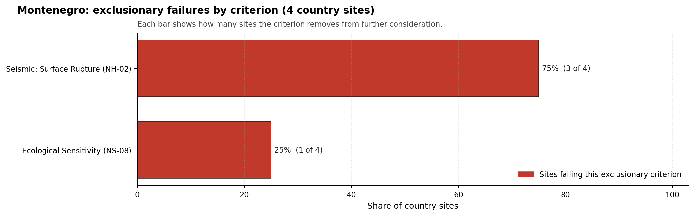

# Montenegro Country Profile

Analytical basis: the profile uses the frozen NuScale VOYGR-6 scoring baseline and the project's 50,000-iteration national sensitivity analysis.

Montenegro has 4 thermal and coal-site records tested against the NuScale VOYGR-6 reference deployment envelope. No site passes both the exclusionary and avoidance screens, one site passes the exclusionary screen with avoidance flags, and three sites fail one or more exclusionary checks. The country is therefore a one-candidate remediation case, not a multi-site brownfield programme pool.

Montenegro should also be treated as a first-time nuclear-power jurisdiction for Stage 1-2 programme planning unless a later national review adds evidence of an established civil nuclear-power framework. That makes regulatory capacity, emergency-planning institutions, workforce development and public-stakeholder readiness part of the same Stage 3 workstream as the site-specific technical investigations. The screening result is still useful, but it supports a cautious characterisation sequence rather than an immediate deployment programme.

The leading site is **Bar power station**, with a composite score of 6.023 and a Monte Carlo interval of 5.321-6.467. Its national stability band is `A`, with a national top-10% hit rate of 100%. Bar is therefore the only Montenegrin site that currently remains in the ranked candidate set, but it remains contingent on resolving the Seismic: Ground Motion (NH-01) and Coastal Flooding (NH-08) avoidance flags.

Montenegro's four-site pool has no full-pass leadership group. Bar is the only site that survives the exclusionary screen and the only site with a national composite score, while Berane, Maoce and Pljevlja are removed before ranking. This supports a single-site Stage 3 characterisation decision, not a national shortlist with fast followers.

The avoidance unlock pool is also narrow. Seismic: Ground Motion (NH-01) and Coastal Flooding (NH-08) each affect the one exclusionary-pass site, or 100% of the exclusionary-pass pool. Those are not administrative clean-up items: Bar needs a project-specific probabilistic seismic hazard assessment, measured site response, and coastal inundation, storm-surge and tsunami review before it can be treated as more than a contingent candidate.

Greenfield siting remains the realistic programme lever if Montenegro wishes to pursue a wider SMR siting strategy. The brownfield evidence does not yet identify a second coal or thermal site that can act as a fast follower. A credible Stage 3 sequence begins with Bar only, while any broader programme would need a greenfield or wider industrial-site survey alongside institutional and emergency-planning readiness work.

## Montenegro Site Ledger

| Rank | Site | Status | Composite | MC Low | MC High | Band | Top-10 Hit | Coverage |
|---:|---|---|---:|---:|---:|---|---:|---:|
| 1 | Bar power station | Exclusion pass with avoidance flag | 6.023 | 5.321 | 6.467 | A | 100% | 74% |
| - | Berane power station | Hard fail | - | - | - | - | - | 0% |
| - | Maoce Power Station | Hard fail | - | - | - | - | - | 0% |
| - | Pljevlja power station | Hard fail | - | - | - | - | - | 0% |

## Avoidance Flag Pareto

Of the 1 site that passes the exclusionary screen, the avoidance-phase flags are concentrated in two natural-hazard criteria. Resolving them would clarify Bar's status; it would not create a broader brownfield pool.

- **Seismic: Ground Motion (NH-01)** - 1 of 1 exclusionary-pass sites (100%) - Bar requires site-specific seismic characterisation before the avoidance flag can be retired.
- **Coastal Flooding (NH-08)** - 1 of 1 exclusionary-pass sites (100%) - Bar requires coastal inundation, storm-surge and tsunami confirmation because it is a low-elevation coastal site.

## Exclusionary Failure Pareto

The hard-fail pattern is dominated by capable-fault proximity. This is a structural siting constraint for the current brownfield pool, not a data-quality issue that can be solved by re-ranking.

- **Seismic: Surface Rupture (NH-02)** - 3 of 4 country sites (75%) - Berane, Maoce and Pljevlja require capable-fault confirmation before they could re-enter the candidate pool.
- **Ecological Sensitivity (NS-08)** - 1 of 4 country sites (25%) - Pljevlja carries an additional protected-area exclusionary trigger.

## Family Strength and Weakness

Across the one ranked Montenegrin site, the strongest criterion family is **Human-Induced and Security-Relevant Hazards** at a mean normalised score of 7.41/10. The weakest family is **Natural Hazards** at 4.79/10, which is consistent with Bar's seismic and coastal-plain constraints. The bottom three individual criteria across the four-site country pool are:

- **Military Installations (HI-06)** - mean 0.38/10 across 4 scored sites (min 0.0, max 1.5).
- **Evacuation Routes (EP-02)** - mean 1.50/10 across 4 scored sites (min 1.5, max 1.5).
- **Ecological Sensitivity (NS-08)** - mean 1.50/10 across 4 scored sites (min 1.5, max 1.5).

## National Sensitivity and Robustness

The national sensitivity result is small-n by construction: only Bar has a ranked composite score. Within that limited national frame, Bar is stable. Its 6.023 baseline composite remains inside a 5.321-6.467 Monte Carlo interval and records a band-A national stability result with a 100% national top-10 hit rate across the scored sensitivity cases.

That stability should not be over-read as general site strength. It means Bar is robustly the best Montenegrin brownfield candidate because the alternatives are excluded before ranking. The Stage 3 decision is therefore binary: either Bar's seismic and coastal evidence can support continued characterisation, or Montenegro's coal and thermal brownfield pool does not currently provide a credible NuScale VOYGR-6 candidate.

## Interpretation for Site Selection

An IAEA-style reading of the Montenegro result focuses first on screening class, then on rank. There is no full-pass group. The only site suitable for further Stage 3 consideration is Bar, and even that site remains an avoidance-flagged candidate rather than a clear shortlist leader.

The hard-fail sites should remain in the evidence base as comparators. Berane, Maoce and Pljevlja are not lower-ranked alternatives to Bar; they are removed by exclusionary checks before composite ranking. Any attempt to restore them would require new capable-fault evidence or, in Pljevlja's case, resolution of the protected-area trigger as well.

The main Stage 3 questions for Montenegro are therefore targeted and sequential: confirm Bar's seismic hazard and measured site response, model coastal flooding and tsunami exposure, test emergency-planning clearance on the coastal road network, verify security-relevant nearby features, and confirm whether any first-party land-control evidence supports the surface-area assumptions needed for NuScale VOYGR-6.

## Status Counts

- Full pass: 0
- Exclusion pass with avoidance flag: 1 (Bar power station)
- Hard fail: 3 (Berane power station, Maoce Power Station, Pljevlja power station)
