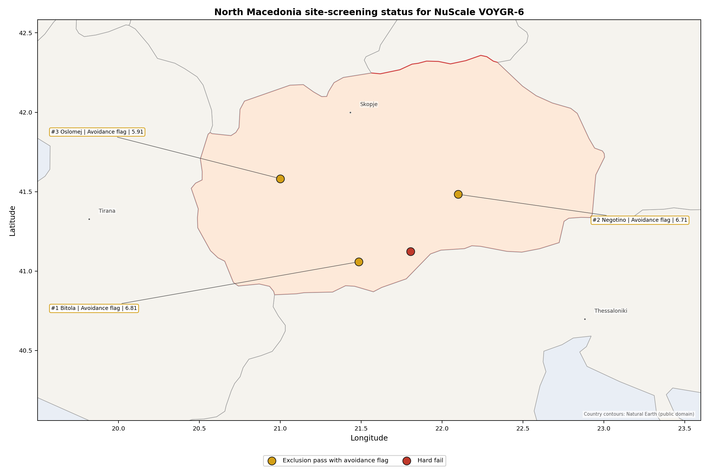
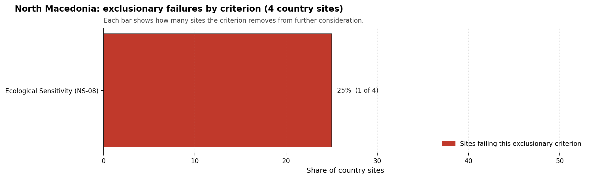

# North Macedonia Country Profile

Analytical basis: the profile uses the frozen NuScale VOYGR-6 scoring baseline and the project's 50,000-iteration national sensitivity analysis.

North Macedonia has four thermal and coal-site records tested against the NuScale VOYGR-6 reference deployment envelope. No site currently clears both the exclusionary and avoidance screens, three sites pass the exclusionary screen with avoidance flags, and one site fails an exclusionary check. The country is therefore a conditional brownfield pool rather than a ready full-pass shortlist.

For this screening programme, North Macedonia should be treated as a first-time nuclear-power jurisdiction unless a later regulatory review identifies operating nuclear-power experience outside the project evidence base. That status does not remove sites from Stage 3 consideration, but it makes regulatory capacity, emergency-planning institutions, nuclear workforce development, and owner-readiness checks central to the next phase.

Bitola power station leads the national ranking with a composite score of 6.812 and a Monte Carlo interval of 5.927-7.329. Negotino follows closely at 6.707, but its band-H stability and 0% national top-10 hit rate separate it from Bitola's band-A stability profile. Oslomej remains a lower third candidate at 5.905, while Mariovo is retained only as a hard-fail comparator.

The plan rule selects the top five nationally ranked sites for site profiles. North Macedonia has only three nationally ranked exclusionary-pass sites in the frozen bundle, so all three ranked sites are selected for detailed treatment: Bitola, Negotino and Oslomej.

## North Macedonia Site Ledger

| Rank | Site | Status | Composite | MC Low | MC High | Band | Top-10 Hit | Coverage |
|---:|---|---|---:|---:|---:|---|---:|---:|
| 1 | Bitola power station | Exclusion pass with avoidance flag | 6.812 | 5.927 | 7.329 | A | 100% | 74% |
| 2 | Negotino power station | Exclusion pass with avoidance flag | 6.707 | 5.846 | 7.171 | H | 0% | 74% |
| 3 | Oslomej power station | Exclusion pass with avoidance flag | 5.905 | 5.230 | 6.421 | H | 0% | 74% |
| - | Mariovo power station | Hard fail | - | - | - | - | - | 0% |

## Avoidance Flag Pareto

Of the three sites that pass the exclusionary screen, all three carry at least one avoidance-phase flag. The denominator for this section is the exclusionary-pass pool, not the full four-site country set.

- **Aircraft Crash (HI-01)** - 3 of 3 exclusionary-pass sites (100%): aviation and heliport screening is a country-wide Stage 3 work item.
- **Seismic: Ground Motion (NH-01)** - 2 of 3 exclusionary-pass sites (67%): site-specific probabilistic seismic hazard analysis is required before Bitola or Oslomej can be treated as comparable to full-pass sites.
- **Grid Connection (NS-02)** - 2 of 3 exclusionary-pass sites (67%): transmission capacity and voltage-pathway work controls the lower-ranked candidate pool.

## Exclusionary Failure Pareto

The exclusionary failure set is limited to one site in the country pool. The denominator for this section is the four-site country set.

- **Ecological Sensitivity (NS-08)** - 1 of 4 country sites (25%): Mariovo is removed from the ranked candidate set by the ecological screen and should remain a comparator unless that evidence is later re-measured.

## Family Strength and Weakness

Across the three scored exclusionary-pass sites, the strongest criterion family is **Natural Hazards** at a mean normalised score of 7.17/10. The weakest family is **Non-Safety / Implementation** at 5.75/10, reflecting grid, land, transport and ecological-evidence constraints rather than one universal defect.

The bottom individual criteria across the country are **Evacuation Routes (EP-02)** at a mean 1.50/10, **Electromagnetic Interference (HI-07)** at 2.00/10, and **Military Installations (HI-06)** at 2.00/10. These values make emergency-road modelling, RF/EMI survey work, and defence-interface confirmation early Stage 3 priorities for the national shortlist.

## National Sensitivity and Robustness

The national sensitivity analysis gives a clear sequencing signal despite overlapping score bands. Bitola is the only site in stability band A and records a 100% national top-10 hit rate. Negotino's point estimate is close to Bitola, but its band-H result and 0% top-10 hit rate show that it is not a robust national leader under the weight perturbations considered.

Oslomej also sits in band H with a 0% top-10 hit rate. The site remains useful as a ranked comparator because it passes the exclusionary screen, but its combination of seismic loading, grid limitation, emergency-road weakness and small-river cooling context makes it a second-wave or de-prioritised characterisation case unless national programme objectives require a third Macedonian option.

## Interpretation for Site Selection

The North Macedonia result should be read as a conditional Stage 3 programme, not as a direct progression list. There is no full-pass site. The practical question is therefore which avoidance flags are sufficiently measurable, remediable or policy-controllable to justify the first characterisation budget.

Bitola is the defensible lead because it combines the top national score, band-A stability, a 400 kV grid interface, 699 MW of inherited export capacity and 145.7 ha of current development-area evidence. Its lead remains conditional on resolving aircraft-crash screening, elevated 2,475-year PGA, sparse EPZ road density, EMI exposure and the land-cover evidence gap.

Negotino is the fast-follower only if the programme wants a second Macedonian site after Bitola. Its score band overlaps Bitola's, but its 110 kV / 165 MW grid envelope and 5.2 ha current development-area estimate create larger implementation questions. Oslomej is a third-wave comparator because it combines the lowest ranked score with the strongest seismic, grid, water-dispersion and military-proximity constraints in the Macedonian set.

The recommended Stage 3 cadence is therefore: characterise Bitola first; keep Negotino as a conditional second site for transmission, land and defence-interface review; and hold Oslomej as a comparator unless national policy requires a broader domestic portfolio. Mariovo should remain outside the ranked site-profile set until the ecological exclusionary trigger is re-tested.

## Status Counts

- Full pass: 0
- Exclusion pass with avoidance flag: 3
- Hard fail: 1
