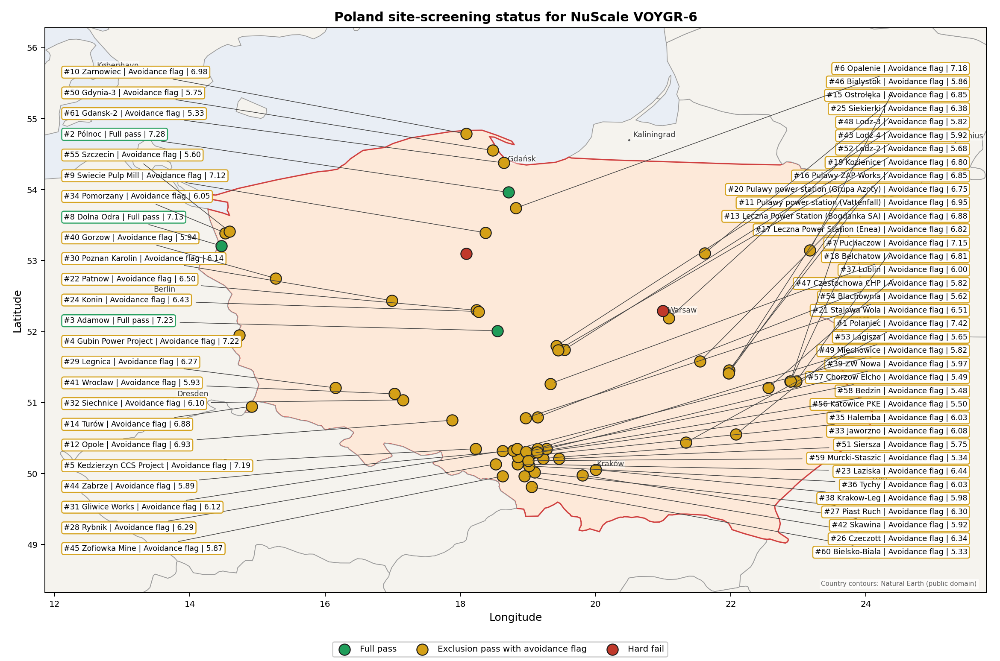
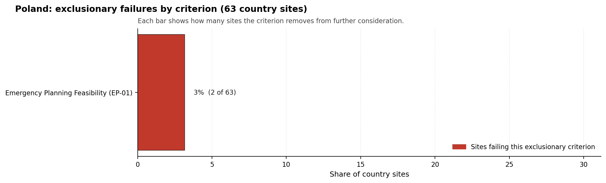

# Poland Country Profile

Analytical basis: the profile uses the frozen NuScale VOYGR-6 scoring baseline and the project's 50,000-iteration national sensitivity analysis.

Poland has 63 thermal and coal-site records tested against the NuScale VOYGR-6 reference deployment envelope. Three sites pass both the exclusionary and avoidance screens, 58 pass the exclusionary screen but retain avoidance flags, and two fail one or more exclusionary checks. The country is therefore a broad brownfield pool with a small full-pass leadership group, a large avoidance-unlock tier, and a limited hard-fail tail.

The leading site is **Polaniec power station**, with a composite score of 7.422 and a Monte Carlo interval of 6.573-7.956. Its national stability band is `A` with a national top-10% hit rate of 100%. Polaniec is the current point-estimate leader and a stable national candidate, but it remains an avoidance-flagged site because Aircraft Crash (HI-01) requires Stage 3 resolution.

Poland's 63 ranked thermal records produce three full-pass sites: Pólnoc, Adamow, and Dolna Odra. The top-five national ranking also selects Polaniec, Gubin Power Project, and Kedzierzyn CCS Project because their composite scores and national stability positions place them ahead of several full-pass or lower-risk comparators. That structure supports a staged programme in which the first characterisation tranche combines the highest-ranked avoidance-flagged candidate with the strongest full-pass sites, rather than treating full-pass status alone as the sequencing rule.

The avoidance unlock pool is the main national planning issue. Distance to Population Centres (RI-05) and Aircraft Crash (HI-01) each affect 39 of the 61 exclusionary-pass sites, or 64% of that pool, while Grid Connection (NS-02) affects 34 sites, or 56%. The unlock work is therefore country-wide: EPZ population micro-modelling, airfield and flight-path hazard assessment, and transmission-pathway confirmation would determine whether Poland's large exclusionary-pass pool can become a deeper Stage 3 candidate list.

A credible Stage 3 sequence begins with the top-five national ranking: Polaniec for national-leader characterisation subject to HI-01 resolution; Pólnoc and Adamow as the first full-pass followers; and Gubin and Kedzierzyn as high-scoring avoidance-flagged candidates where land, airfield, military, ecological, and EPZ constraints must be tested early. Dolna Odra remains the next full-pass reserve candidate, but it sits below the top-five rule for this country batch.

## Poland Site Ledger

| Rank | Site | Status | Composite | MC Low | MC High | Band | Top-10 Hit | Coverage |
|---:|---|---|---:|---:|---:|---|---:|---:|
| 1 | Polaniec power station | Exclusion pass with avoidance flag | 7.422 | 6.573 | 7.956 | A | 100% | 76% |
| 2 | Pólnoc power station | Full pass | 7.284 | 6.462 | 7.869 | A | 100% | 76% |
| 3 | Adamow power station | Full pass | 7.227 | 6.245 | 7.822 | B | 92% | 74% |
| 4 | Gubin Power Project | Exclusion pass with avoidance flag | 7.222 | 6.412 | 7.803 | B | 92% | 76% |
| 5 | Kedzierzyn CCS Project | Exclusion pass with avoidance flag | 7.191 | 6.386 | 7.737 | C | 75% | 76% |
| 6 | Opalenie power station | Exclusion pass with avoidance flag | 7.184 | 6.381 | 7.769 | B | 100% | 76% |
| 7 | Puchaczow power station | Exclusion pass with avoidance flag | 7.153 | 6.356 | 7.650 | D | 25% | 76% |
| 8 | Dolna Odra power station | Full pass | 7.134 | 6.341 | 7.769 | D | 8% | 76% |
| 9 | Swiecie Pulp Mill power station | Exclusion pass with avoidance flag | 7.116 | 6.326 | 7.731 | D | 8% | 76% |
| 10 | Zarnowiec power station | Exclusion pass with avoidance flag | 6.984 | 6.058 | 7.579 | D | 0% | 74% |
| 11 | Pulawy power station (Vattenfall) | Exclusion pass with avoidance flag | 6.953 | 6.194 | 7.566 | D | 0% | 76% |
| 12 | Opole power station | Exclusion pass with avoidance flag | 6.934 | 6.179 | 7.500 | D | 0% | 76% |
| 13 | Leczna Power Station (Bogdanka SA) | Exclusion pass with avoidance flag | 6.884 | 6.139 | 7.450 | D | 0% | 76% |
| 14 | Turów power station | Exclusion pass with avoidance flag | 6.884 | 6.139 | 7.469 | D | 0% | 76% |
| 15 | Ostrołęka power station | Exclusion pass with avoidance flag | 6.853 | 6.114 | 7.469 | D | 0% | 76% |
| 16 | Pulawy ZAP Works power station | Exclusion pass with avoidance flag | 6.853 | 6.114 | 7.469 | D | 0% | 76% |
| 17 | Leczna Power Station (Enea) | Exclusion pass with avoidance flag | 6.822 | 6.088 | 7.434 | D | 0% | 76% |
| 18 | Belchatow power station | Exclusion pass with avoidance flag | 6.806 | 5.922 | 7.349 | D | 0% | 74% |
| 19 | Kozienice power station | Exclusion pass with avoidance flag | 6.797 | 6.068 | 7.331 | F | 0% | 76% |
| 20 | Pulawy power station (Grupa Azoty) | Exclusion pass with avoidance flag | 6.753 | 6.033 | 7.366 | H | 0% | 76% |
| 21 | Stalowa Wola power station | Exclusion pass with avoidance flag | 6.513 | 5.838 | 7.106 | H | 0% | 76% |
| 22 | Patnow power station | Exclusion pass with avoidance flag | 6.503 | 5.831 | 7.069 | H | 0% | 76% |
| 23 | Laziska power station | Exclusion pass with avoidance flag | 6.441 | 5.780 | 7.056 | H | 0% | 76% |
| 24 | Konin power station | Exclusion pass with avoidance flag | 6.428 | 5.770 | 7.044 | H | 0% | 76% |
| 25 | Siekierki power station | Exclusion pass with avoidance flag | 6.384 | 5.735 | 6.969 | H | 0% | 76% |
| 26 | Czeczott power station | Exclusion pass with avoidance flag | 6.345 | 5.568 | 6.862 | H | 0% | 74% |
| 27 | Piast Ruch Power Station | Exclusion pass with avoidance flag | 6.297 | 5.664 | 6.931 | H | 0% | 76% |
| 28 | Rybnik power station | Exclusion pass with avoidance flag | 6.291 | 5.659 | 6.837 | H | 0% | 76% |
| 29 | Legnica Power Station | Exclusion pass with avoidance flag | 6.266 | 5.639 | 6.881 | H | 0% | 76% |
| 30 | Poznan Karolin power station | Exclusion pass with avoidance flag | 6.141 | 5.538 | 6.687 | H | 0% | 76% |
| 31 | Gliwice Works power station | Exclusion pass with avoidance flag | 6.116 | 5.518 | 6.631 | H | 0% | 76% |
| 32 | Siechnice power station | Exclusion pass with avoidance flag | 6.103 | 5.508 | 6.650 | H | 0% | 76% |
| 33 | Jaworzno power station | Exclusion pass with avoidance flag | 6.082 | 5.366 | 6.658 | H | 0% | 74% |
| 34 | Pomorzany power station | Exclusion pass with avoidance flag | 6.053 | 5.467 | 6.619 | H | 0% | 76% |
| 35 | Halemba power station | Exclusion pass with avoidance flag | 6.030 | 5.326 | 6.572 | H | 0% | 74% |
| 36 | Tychy power station | Exclusion pass with avoidance flag | 6.028 | 5.447 | 6.594 | H | 0% | 76% |
| 37 | Lublin Power Station | Exclusion pass with avoidance flag | 6.003 | 5.427 | 6.619 | H | 0% | 76% |
| 38 | Krakow-Leg power station | Exclusion pass with avoidance flag | 5.978 | 5.381 | 6.494 | H | 0% | 76% |
| 39 | ZW Nowa power station | Exclusion pass with avoidance flag | 5.969 | 5.399 | 6.500 | H | 0% | 76% |
| 40 | Gorzow power station | Exclusion pass with avoidance flag | 5.941 | 5.376 | 6.556 | H | 0% | 76% |
| 41 | Wroclaw power station | Exclusion pass with avoidance flag | 5.928 | 5.362 | 6.525 | H | 0% | 76% |
| 42 | Skawina power station | Exclusion pass with avoidance flag | 5.922 | 5.361 | 6.431 | H | 0% | 76% |
| 43 | Lodz-4 power station | Exclusion pass with avoidance flag | 5.916 | 5.356 | 6.531 | H | 0% | 76% |
| 44 | Zabrze power station | Exclusion pass with avoidance flag | 5.891 | 5.294 | 6.406 | H | 0% | 76% |
| 45 | Zofiowka Mine power station | Exclusion pass with avoidance flag | 5.866 | 5.316 | 6.356 | H | 0% | 76% |
| 46 | Bialystok power station | Exclusion pass with avoidance flag | 5.859 | 5.194 | 6.454 | H | 0% | 74% |
| 47 | Czestochowa CHP power station | Exclusion pass with avoidance flag | 5.819 | 5.164 | 6.414 | H | 0% | 74% |
| 48 | Lodz-3 power station | Exclusion pass with avoidance flag | 5.816 | 5.275 | 6.431 | H | 0% | 76% |
| 49 | Miechowice power station | Exclusion pass with avoidance flag | 5.816 | 5.269 | 6.381 | H | 0% | 76% |
| 50 | Gdynia-3 power station | Exclusion pass with avoidance flag | 5.753 | 5.114 | 6.329 | H | 0% | 74% |
| 51 | Siersza power station | Exclusion pass with avoidance flag | 5.753 | 5.225 | 6.350 | H | 0% | 76% |
| 52 | Lodz-2 power station | Exclusion pass with avoidance flag | 5.678 | 5.131 | 6.244 | H | 0% | 76% |
| 53 | Lagisza power station | Exclusion pass with avoidance flag | 5.653 | 5.087 | 6.200 | H | 0% | 76% |
| 54 | Blachownia power station | Exclusion pass with avoidance flag | 5.622 | 5.013 | 6.164 | H | 0% | 74% |
| 55 | Szczecin power station | Exclusion pass with avoidance flag | 5.603 | 5.056 | 6.169 | H | 0% | 76% |
| 56 | Katowice PKE power station | Exclusion pass with avoidance flag | 5.500 | 4.919 | 6.020 | H | 0% | 74% |
| 57 | Chorzow Elcho power station | Exclusion pass with avoidance flag | 5.493 | 4.914 | 6.020 | H | 0% | 74% |
| 58 | Bedzin power station | Exclusion pass with avoidance flag | 5.480 | 4.904 | 6.039 | H | 0% | 74% |
| 59 | Murcki-Staszic power station | Exclusion pass with avoidance flag | 5.341 | 4.844 | 5.956 | H | 0% | 76% |
| 60 | Bielsko-Biala power station | Exclusion pass with avoidance flag | 5.332 | 4.790 | 5.849 | H | 0% | 74% |
| 61 | Gdansk-2 power station | Exclusion pass with avoidance flag | 5.328 | 4.712 | 5.825 | H | 0% | 76% |
| - | Bydgoszcz power station | Hard fail | - | - | - | - | - | 0% |
| - | Zeran power station | Hard fail | - | - | - | - | - | 0% |

## Avoidance Flag Pareto

Of the 61 sites that pass the exclusionary screen, the avoidance-phase flags concentrate on a small set of criteria. Resolving them is what would move the country from a small leading group to a broader candidate pool.

- **Distance to Population Centres (RI-05)** - 39 of 61 exclusionary-pass sites (64%).
- **Aircraft Crash (HI-01)** - 39 of 61 exclusionary-pass sites (64%).
- **Grid Connection (NS-02)** - 34 of 61 exclusionary-pass sites (56%).
- **Toxic/Gas Releases (HI-03)** - 13 of 61 exclusionary-pass sites (21%).
- **Site Footprint Adequacy (NS-05)** - 9 of 61 exclusionary-pass sites (15%).
- **Coastal Flooding (NH-08)** - 3 of 61 exclusionary-pass sites (5%).
- **Cooling Water Availability (NS-01)** - 1 of 61 exclusionary-pass sites (2%).

## Exclusionary Failure Pareto

The exclusionary failures across the country trace back to a small number of criteria. They identify which screening checks are responsible for removing sites from further consideration.

- **Emergency Planning Feasibility (EP-01)** - 2 of 63 country sites (3%).

## Family Strength and Weakness

Across the country the strongest criterion family is **Natural Hazards** at a mean normalised score of 7.55/10. The weakest family is **Radiological Impact** at 4.44/10. The bottom three individual criteria across the country are:

- **Military Installations (HI-06)** - mean 0.37/10 across 63 scored sites (min 0.0, max 3.5).
- **Electromagnetic Interference (HI-07)** - mean 1.56/10 across 63 scored sites (min 1.5, max 3.5).
- **Population Density at EPZ Radii (RI-04)** - mean 2.45/10 across 63 scored sites (min 1.5, max 5.5).

## Interpretation for Site Selection

The Poland result is not a simple full-pass shortlist. The full-pass group, Pólnoc, Adamow, and Dolna Odra, provides the clearest low-friction Stage 3 entry points, but the national ranking places Polaniec first and keeps Gubin and Kedzierzyn in the selected top five. Those three avoidance-flagged sites should progress only with explicit early work on their binding avoidance criteria.

The chart shows the national unlock agenda for the 61 exclusionary-pass sites. RI-05 and HI-01 each affect 39 sites, and NS-02 affects 34 sites, so targeted population-centre modelling, aircraft-crash assessment, and grid-pathway confirmation would have programme-wide value rather than site-only value.

For this Poland tranche, the selected detailed profiles are the top five by national rank under the national sensitivity basis: **Polaniec power station**, **Pólnoc power station**, **Adamow power station**, **Gubin Power Project**, and **Kedzierzyn CCS Project**.

The Monte Carlo intervals are a caution against false precision: the first five sites sit in a tight score range from 7.191 to 7.422, and several bands overlap. The decisive Stage 3 distinction is therefore the type of residual work each site carries: Polaniec is an HI-01 resolution case; Pólnoc and Adamow are full-pass candidates with land, military, EMI, and cooling-water questions; Gubin is an airfield, ecological, land-footprint, and cross-border river case; and Kedzierzyn is a compact industrial-site case with footprint, HI-06, EMI, and RI-04 constraints.

## Status Counts

- Full pass: 3
- Exclusion pass with avoidance flag: 58
- Hard fail: 2
