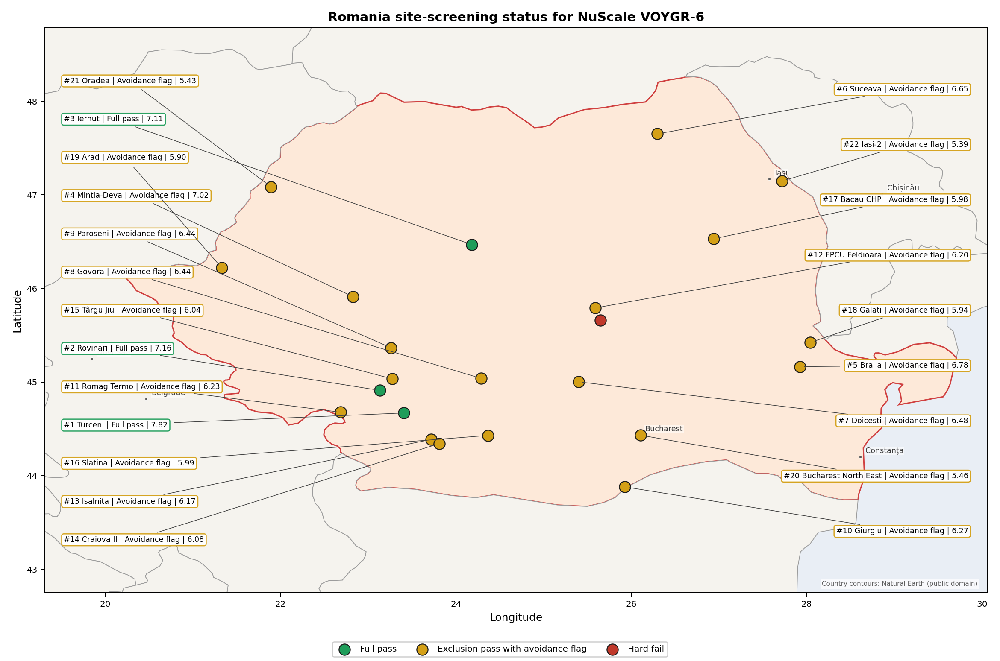
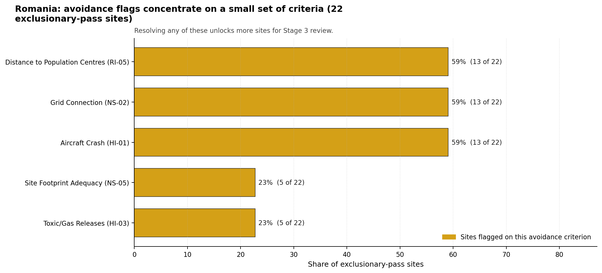
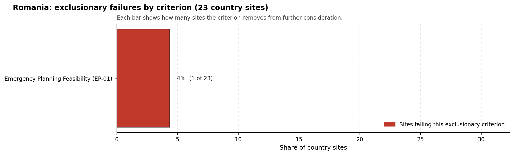

# Romania Country Profile

Analytical basis: the profile uses the frozen NuScale VOYGR-6 scoring baseline and the project's 50,000-iteration national sensitivity analysis.

Romania has 23 thermal and coal-site records tested against the NuScale VOYGR-6 reference deployment envelope. Three sites pass both the exclusionary and avoidance screens, 19 pass the exclusionary screen but retain avoidance flags, and one fails one or more exclusionary checks. The country is therefore a structured brownfield pool: a compact full-pass leadership group, a large unlock pool, and a limited hard-fail tail.

The leading site is **Turceni power station**, with a composite score of 7.816 and a Monte Carlo interval of 6.891-8.256. Its national stability band is `A` with a national top-10% hit rate of 100%. The leader is therefore not only the current point-estimate front-runner; it is also a stable national candidate under the sensitivity treatment used for the report.

Romania's 23 ranked coal and thermal records produce three full-pass sites, 19 exclusionary-pass sites with avoidance flags, and one hard-fail site. Turceni, Rovinari and Iernut form the full-pass leadership pool, but the pool is tiered: Turceni leads with band A stability and a 100% national top-10 hit rate, Rovinari follows in band B with the same top-10 hit rate, and Iernut is a qualifying third site with band D stability and no national top-10 persistence in the sensitivity run. That structure supports a staged brownfield programme led by one robust site and one fast follower, rather than an immediate large fleet claim.

The avoidance unlock pool is broad and material. Aircraft Crash (HI-01), Grid Connection (NS-02), and Distance to Population Centres (RI-05) each affect 13 of the 22 exclusionary-pass sites, or 59% of that pool; Toxic/Gas Releases (HI-03) and Site Footprint Adequacy (NS-05) each affect five sites, or 23%. The unlock work is therefore not a narrow Turceni issue. It is a national screening agenda covering flight-path and airport-class confirmation, transmission reinforcement and voltage-pathway review, population-centre and EPZ micro-modelling, hazardous-neighbour inventory checks, and site-footprint confirmation.

Greenfield options remain a programme lever if the eventual Romanian build-out target exceeds what the brownfield pool can support, but the current evidence does not require that lever for the first Stage 3 sequence. A credible sequence begins with Turceni for full characterisation, uses Rovinari as the fast follower, keeps Iernut as a qualifying third site subject to stability review, and treats Mintia-Deva, Braila and Suceava as the first avoidance-flagged candidates to revisit after the national unlock work resolves the leading HI-01, NS-02 and RI-05 constraints.

## Romania Site Ledger

| Rank | Site | Status | Composite | MC Low | MC High | Band | Top-10 Hit | Coverage |
|---:|---|---|---:|---:|---:|---|---:|---:|
| 1 | Turceni power station | Full pass | 7.816 | 6.891 | 8.256 | A | 100% | 76% |
| 2 | Rovinari power station | Full pass | 7.159 | 6.361 | 7.700 | B | 100% | 76% |
| 3 | Iernut power station | Full pass | 7.114 | 5.285 | 7.555 | D | 0% | 53% |
| 4 | Mintia-Deva power station | Exclusion pass with avoidance flag | 7.016 | 6.245 | 7.487 | D | 0% | 76% |
| 5 | Braila power station | Exclusion pass with avoidance flag | 6.784 | 6.058 | 7.275 | D | 0% | 76% |
| 6 | Suceava power station | Exclusion pass with avoidance flag | 6.653 | 5.952 | 7.144 | D | 0% | 76% |
| 7 | Doicesti power station | Exclusion pass with avoidance flag | 6.478 | 5.811 | 6.950 | H | 0% | 76% |
| 8 | Govora power station | Exclusion pass with avoidance flag | 6.441 | 5.780 | 6.862 | H | 0% | 76% |
| 9 | Paroseni power station | Exclusion pass with avoidance flag | 6.441 | 5.780 | 6.912 | H | 0% | 76% |
| 10 | Giurgiu power station | Exclusion pass with avoidance flag | 6.266 | 5.639 | 6.806 | H | 0% | 76% |
| 11 | Romag Termo power station | Exclusion pass with avoidance flag | 6.228 | 5.609 | 6.700 | H | 0% | 76% |
| 12 | FPCU Feldioara | Exclusion pass with avoidance flag | 6.197 | 5.583 | 6.662 | H | 0% | 76% |
| 13 | Isalnita power station | Exclusion pass with avoidance flag | 6.174 | 5.437 | 6.638 | H | 0% | 74% |
| 14 | Craiova II power station | Exclusion pass with avoidance flag | 6.078 | 5.487 | 6.569 | H | 0% | 76% |
| 15 | Târgu Jiu Thermal Plant | Exclusion pass with avoidance flag | 6.041 | 5.457 | 6.512 | H | 0% | 76% |
| 16 | Slatina power station | Exclusion pass with avoidance flag | 5.991 | 5.417 | 6.481 | H | 0% | 76% |
| 17 | Bacau CHP power station | Exclusion pass with avoidance flag | 5.978 | 5.407 | 6.419 | H | 0% | 76% |
| 18 | Galati Power Station | Exclusion pass with avoidance flag | 5.941 | 5.376 | 6.481 | H | 0% | 76% |
| 19 | Arad power station | Exclusion pass with avoidance flag | 5.903 | 5.346 | 6.444 | H | 0% | 76% |
| 20 | Bucharest North East power station | Exclusion pass with avoidance flag | 5.463 | 4.987 | 5.856 | H | 0% | 76% |
| 21 | Oradea power station | Exclusion pass with avoidance flag | 5.428 | 4.962 | 5.969 | H | 0% | 76% |
| 22 | Iasi-2 power station | Exclusion pass with avoidance flag | 5.391 | 4.800 | 5.912 | H | 0% | 76% |
| - | Brasov power station | Hard fail | - | - | - | - | - | 0% |

## Avoidance Flag Pareto

Of the 22 sites that pass the exclusionary screen, the avoidance-phase flags concentrate on a small set of criteria. Resolving them is what would move the country from a small leading group to a broader candidate pool.

- **Aircraft Crash (HI-01)** - 13 of 22 exclusionary-pass sites (59%).
- **Grid Connection (NS-02)** - 13 of 22 exclusionary-pass sites (59%).
- **Distance to Population Centres (RI-05)** - 13 of 22 exclusionary-pass sites (59%).
- **Toxic/Gas Releases (HI-03)** - 5 of 22 exclusionary-pass sites (23%).
- **Site Footprint Adequacy (NS-05)** - 5 of 22 exclusionary-pass sites (23%).

## Exclusionary Failure Pareto

The exclusionary failures across the country trace back to a small number of criteria. They identify which screening checks are responsible for removing sites from further consideration.

- **Emergency Planning Feasibility (EP-01)** - 1 of 23 country sites (4%).

## Family Strength and Weakness

Across the country the strongest criterion family is **Natural Hazards** at a mean normalised score of 7.31/10. The weakest family is **Radiological Impact** at 4.79/10. The bottom three individual criteria across the country are:

- **Military Installations (HI-06)** - mean 0.41/10 across 23 scored sites (min 0.0, max 5.0).
- **Electromagnetic Interference (HI-07)** - mean 2.70/10 across 23 scored sites (min 1.5, max 5.5).
- **Grid Connection (NS-02)** - mean 2.98/10 across 23 scored sites (min 0.0, max 5.5).

## Interpretation for Site Selection

The Romania result shows a clear separation between sites that can support further Stage 3 consideration and sites that should remain in the evidence base only as comparators. The full-pass group is the relevant pool for progression. Avoidance-flag sites are not discarded, but they identify locations where a specific constraint must be resolved before the site can be treated as equivalent to the leading group.

The chart shows where focused remediation effort would broaden the candidate pool. The criteria at the top of the Pareto are the policy and engineering levers that, if resolved, move avoidance-flag sites into the leading group.

An IAEA-style reading of the table focuses less on the exact rank number and more on screening class, score stability, and the nature of remaining uncertainty. **Turceni power station** is important because it leads nationally, sits inside the strongest stability band, and retains a full-pass status. That does not establish final site suitability. It is a defensible reason to spend Stage 3 effort on field confirmation, national data review, and stakeholder engagement before lower-ranked or avoidance-flag locations.

The Monte Carlo interval is a caution against false precision: several sites have overlapping score bands, so small score differences should not be overinterpreted. The decisive distinction is whether a site combines acceptable exclusionary performance with a stable ranking position and no unresolved avoidance flag.

The main Stage 3 questions are therefore targeted rather than generic: confirm local natural-hazard inputs, verify emergency-planning assumptions, test land and ownership constraints, assess cooling and grid interface conditions, and reconcile environmental constraints with national permitting requirements.

## Status Counts

- Full pass: 3 (Turceni, Rovinari, Iernut)
- Exclusion pass with avoidance flag: 19
- Hard fail: 1
