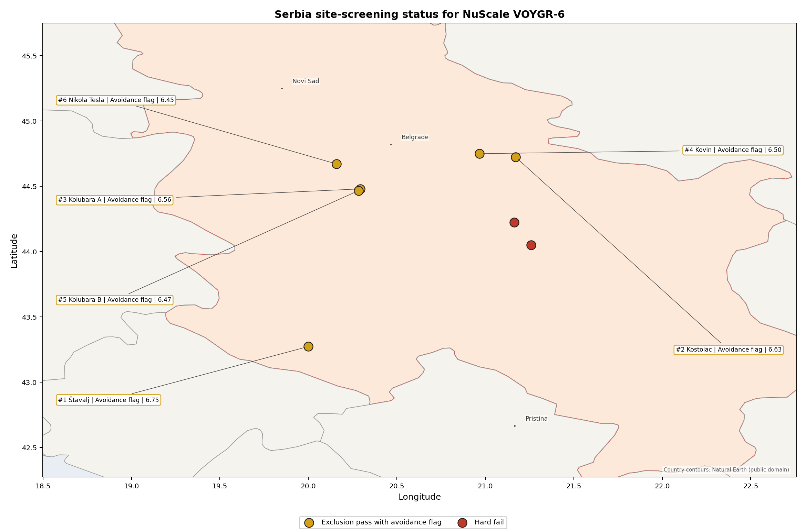
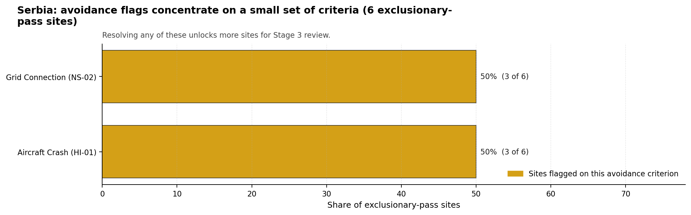

# Serbia Country Profile

Analytical basis: the profile uses the frozen NuScale VOYGR-6 scoring baseline and the project's 50,000-iteration national sensitivity analysis.

Serbia has 8 thermal and coal-site records tested against the NuScale VOYGR-6 reference deployment envelope. No site clears both the exclusionary and avoidance screens, 6 sites pass the exclusionary screen with avoidance flags, and 2 sites are removed at the exclusionary stage. The national pool is therefore a remediation-first brownfield portfolio rather than a ready full-pass shortlist.

The current evidence base does not treat national nuclear-programme readiness as settled. Serbia's profile should therefore couple any Stage 3 site characterisation with regulatory, emergency-planning, workforce and owner-governance readiness work. The screening result is still useful: it identifies where the existing thermal estate offers grid, water, land and transport inheritance, and where those advantages are conditional on avoidance-flag resolution.

The leading site is **Štavalj Power Station**, with a composite score of 6.753 and a Monte Carlo interval of 5.928-7.175. Its national stability band is `A` with a national top-10% hit rate of 92%. Kostolac, Kolubara A, Kovin and Kolubara B complete the selected top five, but all four sit in band H, so the national sequence should start with the stable leader and treat the remaining sites as conditional fast followers.

Serbia's 8 ranked thermal records produce no full-pass site, 6 exclusionary-pass sites with avoidance flags, and 2 hard-fail sites. The leadership pool is therefore narrow and conditional: Štavalj leads with band A stability, while Kostolac, Kolubara A, Kovin and Kolubara B remain close on point-estimate score but much weaker on national stability. That structure supports one priority characterisation candidate and a second tier that should be tested through targeted avoidance-flag work before any multi-site programme claim is made.

The avoidance unlock pool is concentrated. Aircraft Crash (HI-01) and Grid Connection (NS-02) each affect 3 of the 6 exclusionary-pass sites, or 50% of the pool. Resolving those constraints means airport and flight-path confirmation, transmission voltage and export-capacity review, and owner-specific interface work for the plants whose brownfield value depends on grid inheritance.

Greenfield options remain a programme lever if Serbia's eventual build-out objective exceeds what the brownfield pool can support. On the current screening evidence, a credible Stage 3 sequence begins with Štavalj as the stable national leader, uses Kostolac as the first operating-site comparator, and keeps the Kolubara and Kovin entries as a third wave dependent on resolving grid and aircraft-crash constraints. Morava and Despotovac should remain in the evidence base as hard-fail comparators unless site-specific work refutes their Seismic: Surface Rupture (NH-02) exclusionary trigger.

## Serbia Site Ledger

| Rank | Site | Status | Composite | MC Low | MC High | Band | Top-10 Hit | Coverage |
|---:|---|---|---:|---:|---:|---|---:|---:|
| 1 | Štavalj Power Station | Exclusion pass with avoidance flag | 6.753 | 5.928 | 7.175 | A | 92% | 76% |
| 2 | Kostolac power station | Exclusion pass with avoidance flag | 6.634 | 5.906 | 7.244 | H | 8% | 76% |
| 3 | Kolubara A power station | Exclusion pass with avoidance flag | 6.559 | 5.831 | 7.069 | H | 0% | 76% |
| 4 | Kovin power station | Exclusion pass with avoidance flag | 6.503 | 5.831 | 7.094 | H | 0% | 76% |
| 5 | Kolubara B power station | Exclusion pass with avoidance flag | 6.472 | 5.744 | 6.981 | H | 0% | 76% |
| 6 | Nikola Tesla power station | Exclusion pass with avoidance flag | 6.453 | 5.694 | 6.994 | H | 0% | 76% |
| - | Despotovac power station | Hard fail | - | - | - | - | - | 0% |
| - | Morava power station | Hard fail | - | - | - | - | - | 0% |

Selected for detailed site profiles: **Štavalj Power Station**, **Kostolac power station**, **Kolubara A power station**, **Kovin power station**, and **Kolubara B power station**. These are the top five sites by national ranking under the frozen national sensitivity basis.

## Avoidance Flag Pareto

Of the 6 sites that pass the exclusionary screen, the avoidance-phase flags concentrate on two criteria. Each affects half of the exclusionary-pass pool, so the unlock work is narrow but material.

- **Aircraft Crash (HI-01)** - 3 of 6 exclusionary-pass sites (50%) - airport, airspace and flight-path confirmation for the selected brownfield envelope.
- **Grid Connection (NS-02)** - 3 of 6 exclusionary-pass sites (50%) - transmission voltage, export-capacity and reinforcement-path confirmation.

## Exclusionary Failure Pareto

The hard-fail tail is driven by one criterion. This keeps the exclusionary story clear: the removed sites require site-specific capable-fault review before they can re-enter the brownfield candidate pool.

- **Seismic: Surface Rupture (NH-02)** - 2 of 8 country sites (25%) - capable-fault stand-off controls whether the site remains excluded.

## Family Strength and Weakness

Across the country the strongest criterion family is **Natural Hazards** at a mean normalised score of 7.07/10. The weakest family is **Radiological Impact** at 5.41/10. The bottom three individual criteria across the country are:

- **Military Installations (HI-06)** - mean 1.25/10 across 8 scored sites (min 0.0, max 3.5).
- **Electromagnetic Interference (HI-07)** - mean 1.75/10 across 8 scored sites (min 1.5, max 3.5).
- **Grid Connection (NS-02)** - mean 3.25/10 across 8 scored sites (min 1.5, max 7.5).

## National Sensitivity and Robustness

The national sensitivity result separates Štavalj from the rest of the scored pool. Štavalj records band A and a 92% national top-10% hit rate, while the other five scored sites sit in band H with top-10% hit rates from 0% to 8%. The Monte Carlo score intervals overlap across the selected group, so exact point-estimate differences should not drive sequencing by themselves.

## Interpretation for Site Selection

Serbia has no current full-pass site. The selected top five are therefore not deployment recommendations; they are the most defensible places to spend Stage 3 characterisation effort if the programme owner accepts an avoidance-resolution workstream. The first distinction is exclusionary survival: Štavalj, Kostolac, Kolubara A, Kovin and Kolubara B remain in the ranked pool, while Morava and Despotovac are hard-fail comparators until their NH-02 evidence changes.

The chart shows that targeted work can retire a large share of Serbia's uncertainty. Aircraft Crash (HI-01) and Grid Connection (NS-02) are the leading unlock levers, and both are better handled as national or owner-level workstreams than as isolated site notes.

A practical Stage 3 cadence starts with Štavalj because it combines the highest point estimate, the only band A stability profile, and a large enough surface-area envelope for screening purposes. Kostolac should be reviewed next because it is an operating thermal site with large installed capacity and direct brownfield relevance. Kolubara A, Kovin and Kolubara B then form the conditional third wave, with the Kolubara entries treated as related evidence on the same wider brownfield envelope rather than as independent programme slots until ownership, grid and land controls are confirmed.

## Status Counts

- Full pass: 0
- Exclusion pass with avoidance flag: 6
- Hard fail: 2
