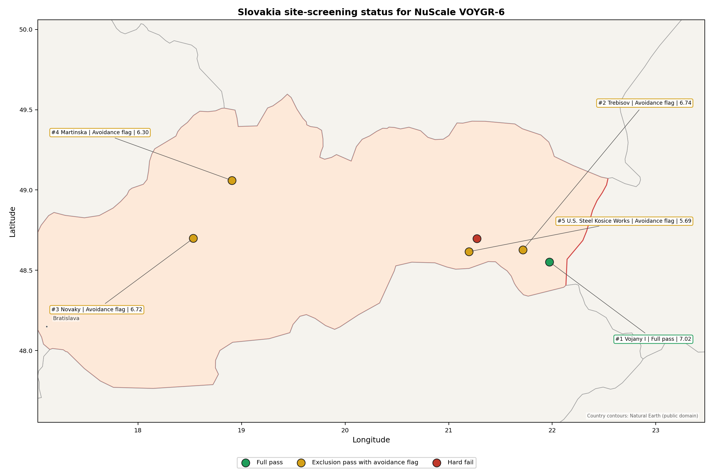
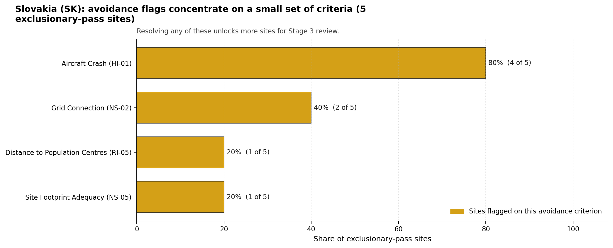

# Slovakia Country Profile

Analytical basis: the profile uses the frozen NuScale VOYGR-6 scoring baseline and the project's 50,000-iteration national sensitivity analysis.

Slovakia has six thermal and coal-site records tested against the NuScale VOYGR-6 reference deployment envelope. One site passes both the exclusionary and avoidance screens, four pass the exclusionary screen but retain avoidance flags, and one fails one or more exclusionary checks. Slovakia is an established nuclear-power jurisdiction, so the Stage 3 question is less about first-time institutional readiness and more about whether brownfield thermal assets can be characterised within the national nuclear governance framework.

The leading site is **Vojany I power station**, with a composite score of 7.022 and a Monte Carlo interval of 6.250-7.481. Its national stability band is `A`, and it records a 100% national top-10% hit rate. The next four ranked sites remain relevant as comparators and possible later candidates, but their band H sensitivity results mean they require constraint-specific unlock work before they can be treated as equivalent to Vojany I.

Slovakia's six ranked thermal records produce one full-pass site, four exclusionary-pass sites with avoidance flags, and one hard-fail site. Vojany I is the only site that combines a full pass with band A national stability, so the current brownfield sequence is a one-site leadership case rather than an immediate multi-site programme pool. Trebisov and Novaky sit close on point score, but both carry avoidance flags and band H national stability.

The avoidance unlock pool is concentrated across the exclusionary-pass cohort. Aircraft Crash (HI-01) affects four of the five exclusionary-pass sites, or 80% of that pool, while Grid Connection (NS-02) affects two sites, or 40%. Site Footprint Adequacy (NS-05) and Distance to Population Centres (RI-05) each affect one site. The practical unlock agenda is therefore an aviation and flight-path review across the Slovak candidate set, followed by targeted grid export, site-footprint and population-centre checks for the weaker second-tier sites.

A greenfield option remains available if a future Slovak build-out target exceeds what the brownfield pool can credibly support, but the current evidence does not require it for the first characterisation sequence. A credible Stage 3 sequence begins with Vojany I, keeps Trebisov and Novaky as avoidance-flagged comparators, and treats Martinska and U.S. Steel Kosice Works as later-wave candidates only if aircraft, grid, emergency-planning and land constraints can be retired.

## Slovakia Site Ledger

| Rank | Site | Status | Composite | MC Low | MC High | Band | Top-10 Hit | Coverage |
|---:|---|---|---:|---:|---:|---|---:|---:|
| 1 | Vojany I power station | Full pass | 7.022 | 6.250 | 7.481 | A | 100% | 76% |
| 2 | Trebisov power station | Exclusion pass with avoidance flag | 6.741 | 6.023 | 7.281 | H | 0% | 76% |
| 3 | Novaky power station | Exclusion pass with avoidance flag | 6.716 | 6.003 | 7.237 | H | 0% | 76% |
| 4 | Martinska power station | Exclusion pass with avoidance flag | 6.303 | 5.669 | 6.775 | H | 0% | 76% |
| 5 | U.S. Steel Kosice Works power station | Exclusion pass with avoidance flag | 5.691 | 5.174 | 6.181 | H | 0% | 76% |
| - | Kosice power station | Hard fail | - | - | - | - | - | 0% |

## Avoidance Flag Pareto

Of the 5 sites that pass the exclusionary screen, the avoidance-phase flags concentrate on a small set of criteria. Resolving them is what would move the country from a small leading group to a broader candidate pool.

- **Aircraft Crash (HI-01)** - 4 of 5 exclusionary-pass sites (80%).
- **Grid Connection (NS-02)** - 2 of 5 exclusionary-pass sites (40%).
- **Site Footprint Adequacy (NS-05)** - 1 of 5 exclusionary-pass sites (20%).
- **Distance to Population Centres (RI-05)** - 1 of 5 exclusionary-pass sites (20%).

## Exclusionary Failure Pareto

The exclusionary failures across the country trace back to a small number of criteria. They identify which screening checks are responsible for removing sites from further consideration.

- **Emergency Planning Feasibility (EP-01)** - 1 of 6 country sites (17%).

## Family Strength and Weakness

Across the country the strongest criterion family is **Non-Safety / Implementation** at a mean normalised score of 7.04/10. The weakest family is **Emergency Planning** at 5.22/10. The bottom three individual criteria across the country are:

- **Military Installations (HI-06)** - mean 0.25/10 across 6 scored sites (min 0.0, max 1.5).
- **Electromagnetic Interference (HI-07)** - mean 1.50/10 across 6 scored sites (min 1.5, max 1.5).
- **Ecological Sensitivity (NS-08)** - mean 2.17/10 across 6 scored sites (min 1.5, max 3.5).

## Interpretation for Site Selection

The Slovakia result separates a single defensible characterisation candidate from a wider avoidance-flagged comparison pool. The full-pass group contains only Vojany I. Avoidance-flag sites remain useful because they show which national constraints could unlock a broader brownfield programme, but they should not be sequenced ahead of the full-pass leader without resolving the specific aviation, grid, land or population-centre flags shown in the ledger.

The chart shows the unlock agenda for the five exclusionary-pass sites. Aviation dominates the avoidance pool, while grid connection is the main implementation constraint that appears across more than one site.

An IAEA-style reading of the table focuses less on exact rank number and more on screening class, score stability, and the nature of remaining uncertainty. **Vojany I power station** leads nationally, sits inside the strongest stability band, and retains a full-pass status. That supports a decision to progress the site toward Stage 3 characterisation before lower-ranked or avoidance-flagged locations.

The Monte Carlo interval is a caution against false precision: several sites have overlapping score bands, so small score differences should not be overinterpreted. The decisive distinction is whether a site combines acceptable exclusionary performance with a stable ranking position and no unresolved avoidance flag.

The main Stage 3 questions are therefore targeted rather than generic: confirm local natural-hazard inputs, verify emergency-planning assumptions, test land and ownership constraints, assess cooling and grid interface conditions, and reconcile environmental constraints with national permitting requirements.

## Status Counts

- Full pass: 1
- Exclusion pass with avoidance flag: 4
- Hard fail: 1
