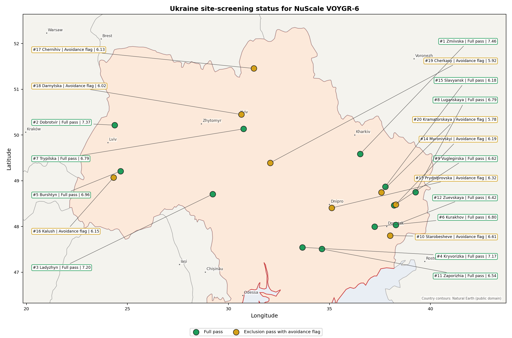
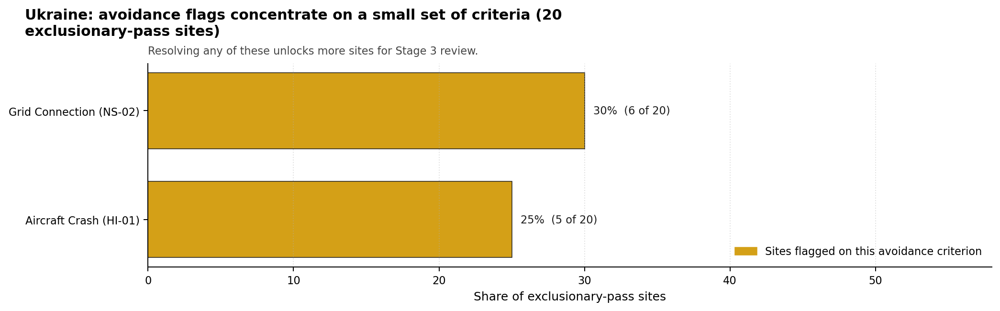

# Ukraine Country Profile

Analytical basis: this profile uses the frozen NuScale VOYGR-6 scoring baseline and the project's 50,000-iteration national sensitivity analysis.

Ukraine has 20 thermal and coal-site records tested against the NuScale VOYGR-6 reference deployment envelope. 12 sites pass both the exclusionary and avoidance screens, 8 pass the exclusionary screen with avoidance flags, and 0 fail one or more exclusionary checks. Ukraine is therefore analytically important: the desk-study pool is broad, and every record remains inside the comparison set.

Ukraine is an established nuclear-power jurisdiction, but the current war context changes how the screening result can be used. This profile applies a conflict and territorial-access caveat: current security conditions, practical site access, infrastructure condition, regulator engagement, emergency-planning continuity and data currency prevent the desk-study records from being treated as practical near-term progression candidates. The report does not make a legal or conflict-status determination for any site.

The leading site is **Zmiivska power station**, with a composite score of 7.455 and a Monte Carlo interval of 6.263-7.945. Its national stability band is `A` with a national top-10% hit rate of 92%. That makes it the clearest Ukrainian desk-study leader, but only as an analytical priority for post-war verification.

The selected Ukraine site profiles follow the national ranking rule and cover the top five records: Zmiivska power station, Dobrotvir power station, Ladyzhyn power station, Kryvorizka power station, Burshtyn power station. These are detailed desk-study profiles under caveat, not recommendations for immediate Stage 3 mobilisation.

## Ukraine Site Ledger

| Rank | Site | Status | Composite | MC Low | MC High | Band | Top-10 Hit | Coverage |
|---:|---|---|---:|---:|---:|---|---:|---:|
| 1 | Zmiivska power station | Full pass | 7.455 | 6.263 | 7.945 | A | 92% | 71% |
| 2 | Dobrotvir power station | Full pass | 7.372 | 6.533 | 8.006 | B | 100% | 76% |
| 3 | Ladyzhyn power station | Full pass | 7.197 | 6.391 | 7.706 | D | 8% | 76% |
| 4 | Kryvorizka power station | Full pass | 7.166 | 6.051 | 7.655 | D | 0% | 71% |
| 5 | Burshtyn power station | Full pass | 6.959 | 6.199 | 7.450 | D | 0% | 76% |
| 6 | Kurakhov power station | Full pass | 6.797 | 5.742 | 7.315 | G | 0% | 71% |
| 7 | Trypilska power station | Full pass | 6.795 | 5.894 | 7.364 | G | 0% | 74% |
| 8 | Luganskaya power station | Full pass | 6.788 | 5.889 | 7.258 | G | 0% | 74% |
| 9 | Vuglegirska power station | Full pass | 6.616 | 5.758 | 7.139 | H | 0% | 74% |
| 10 | Starobesheve power station | Exclusion pass with avoidance flag | 6.609 | 5.753 | 7.099 | H | 0% | 74% |
| 11 | Zaporizhia power station | Full pass | 6.543 | 5.702 | 7.033 | H | 0% | 74% |
| 12 | Zuevskaya power station | Full pass | 6.417 | 5.606 | 6.887 | H | 0% | 74% |
| 13 | Prydniprovska power station | Exclusion pass with avoidance flag | 6.318 | 5.530 | 6.808 | H | 0% | 74% |
| 14 | Myronivskyi power station | Exclusion pass with avoidance flag | 6.192 | 5.434 | 6.609 | H | 0% | 74% |
| 15 | Slavyansk power station | Full pass | 6.185 | 5.429 | 6.728 | H | 0% | 74% |
| 16 | Kalush power station | Exclusion pass with avoidance flag | 6.153 | 5.548 | 6.694 | H | 0% | 76% |
| 17 | Chernihiv power station | Exclusion pass with avoidance flag | 6.126 | 5.384 | 6.748 | H | 0% | 74% |
| 18 | Darnytska power station | Exclusion pass with avoidance flag | 6.020 | 5.303 | 6.623 | H | 0% | 74% |
| 19 | Cherkasy power station | Exclusion pass with avoidance flag | 5.921 | 5.227 | 6.358 | H | 0% | 74% |
| 20 | Kramatorskaya power station | Exclusion pass with avoidance flag | 5.781 | 5.121 | 6.252 | H | 0% | 74% |

## Avoidance Flag Pareto

Of the 20 sites that pass the exclusionary screen, the avoidance-phase flags are concentrated in two criteria. Resolving them would improve the desk-study comparability of the lower-ranked pool; it would not remove the Ukraine conflict and territorial-access caveat.

- **Grid Connection (NS-02)** - 6 of 20 exclusionary-pass sites (30%).
- **Aircraft Crash (HI-01)** - 5 of 20 exclusionary-pass sites (25%).

## Family Strength and Weakness

Across Ukraine the strongest criterion family is **Human-Induced Hazards** at a mean normalised score of 7.28/10. The weakest family is **Emergency Planning** at 4.78/10. The bottom three individual criteria across the country are:

- **Military Installations (HI-06)** - mean 1.55/10 across 20 scored sites (min 0.0, max 5.0).
- **Electromagnetic Interference (HI-07)** - mean 1.80/10 across 20 scored sites (min 1.5, max 3.5).
- **Ecological Sensitivity (NS-08)** - mean 2.60/10 across 20 scored sites (min 1.5, max 5.5).

## Interpretation for Site Selection

The Ukrainian result is strong as a desk-study comparison and weak as a near-term implementation signal. The full-pass count shows that the scoring framework can identify several brownfield records with favourable grid, transport, land and natural-hazard attributes. The conflict and territorial-access caveat is controlling, so these records should be read as a post-war verification queue rather than a current investment sequence.

Zmiivska and Dobrotvir are the most robust analytical leaders under the national sensitivity treatment. Ladyzhyn, Kryvorizka and Burshtyn complete the top-five profile set but sit in stability band D, so their rank order is less resilient to weight perturbation even though each remains a full-pass site in the baseline screen.

A credible post-war work programme would start with national prerequisites before site-specific progression: updated territorial-control and access review, physical asset-condition surveys, refreshed population and emergency-planning data, security and airspace cadastre checks, grid-restoration evidence, and environmental screening for nearby protected areas. Only after those prerequisites are satisfied should the top-five site packets be used to define Stage 3 scopes.

## Status Counts

- Full pass: 12
- Exclusion pass with avoidance flag: 8
- Hard fail: 0
