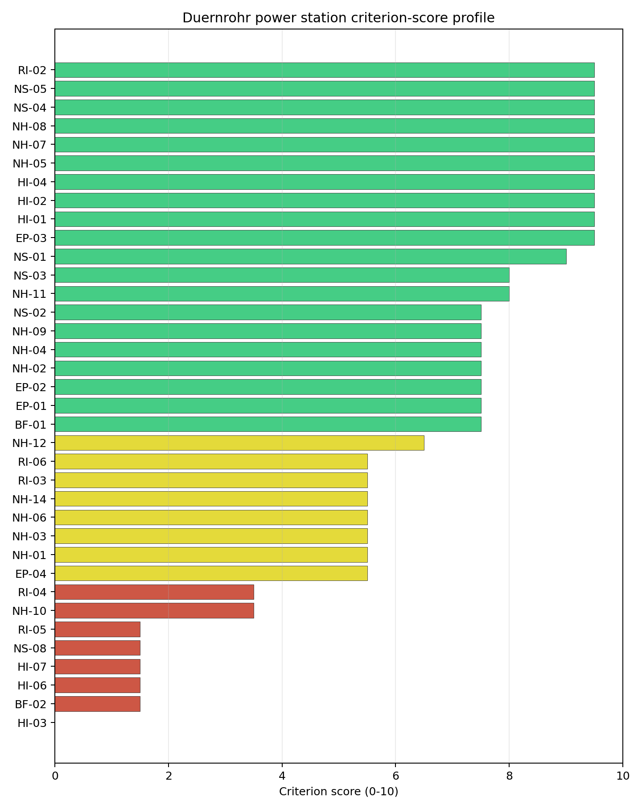
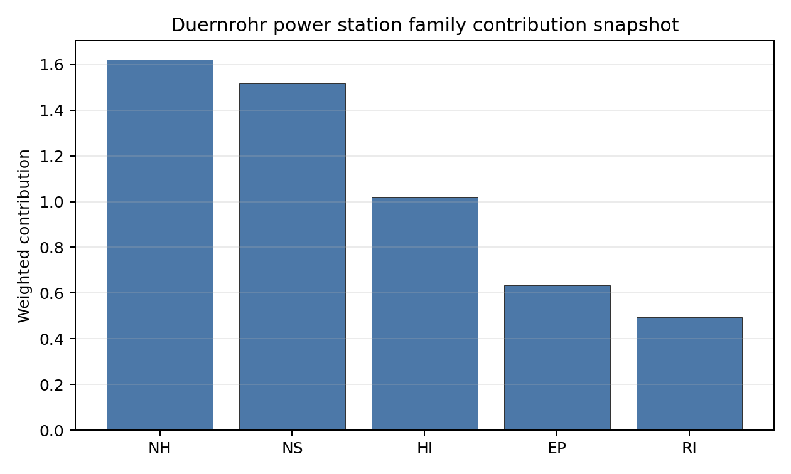

# Duernrohr power station Site Profile

Duernrohr power station is a coal/thermal site in Austria that has been tested against the NuScale VOYGR-6 reference deployment envelope. This profile reads the screening evidence at a level that supports a decision to progress toward Stage 3 characterisation. It is not a site-suitability determination, vendor recommendation, or licensing finding.

## Site Snapshot

| Field | Value |
| --- | --- |
| Site name | Duernrohr power station |
| Coordinates | 48.3261, 15.9233 |
| Subnational unit | Lower Austria |
| Installed thermal capacity (source data) | 802 MW |
| Available surface area | 120.0 ha |
| Available surface area for development | 10.2 ha |
| Composite score (baseline weights) | 6.544 (5.864-7.081 MC band) |
| National stability band | H (top-10% hit rate 0%) |
| National rank | 5 |

_See the country status map in_ [Austria Country Profile](../AT_country_prototype.md#country-status-map).

## Ownership and Coal-to-Nuclear Context

Duernrohr is recorded with a split operating context: EVN AG appears as immediate operator for one unit, while Verbund Thermal Power GmbH & Co KG appears through Verbund AG for another. The bundle shows the **Government of Austria** holding 51.00% of Verbund AG, and EVN AG as a direct Austrian utility owner for Unit 2. Stage 3 would need to reconcile these chains into a single site-control and reuse position before treating the site as development-ready.

Generating units on record: 2 retired. Earliest unit commissioning: 1985; most recent: 1987. Retirements span 2015 to 2019, leaving a large brownfield thermal complex with strong grid, rail, water and industrial-transition relevance.

## Natural Hazards (NH)

- **Seismic: Ground Motion (NH-01)** - score 5.5/10 (MC 5.0-6.0), pass-mark band: At or below the score-5 risk boundary., weight 0.0455, data quality high. Evidence: PGA at 475-year return period 0.087 g; PGA at 2,475-year return period 0.201 g; Vs30 reference (m/s): 760.0.
- **Seismic: Surface Rupture (NH-02)** - score 7.5/10 (MC 7.0-8.0), weight n/a, data quality screening grade. Evidence: nearest mapped capable fault 23.9 km; fault slip rate 0.022 mm/yr; fault name: ATCF008.
- **Geotechnical: Liquefaction (NH-03)** - score 5.5/10 (MC 5.0-6.0), pass-mark band: Moderate susceptibility, or high/very-high with documented (with mitigation to be confirmed) mitigation., weight n/a, data quality medium. Evidence: liquefaction susceptibility: high; dominant soil type: silty_clay_loam.
- **Geotechnical: Slope Stability (NH-04)** - score 7.5/10 (MC 7.0-8.0), weight n/a, data quality screening grade. Evidence: site slope 5.46 deg; max slope in 1 km box 84.2 deg; slope stability class: moderate.
- **Geotechnical: Subsidence (NH-05)** - score 9.5/10 (MC 9.0-10.0), favourable: No karst; mine-feature distance well above the score-5 pivot (or unknown)., weight 0.0354, data quality medium. Evidence: karst present: no; karst severity: none.
- **Geotechnical: Foundation (NH-06)** - score 5.5/10 (MC 5.0-6.0), pass-mark band: Typical European mixed conditions (bearing 80-150 kPa)., weight 0.0253, data quality medium. Evidence: bearing capacity 84.7 kPa; depth to bedrock 31.8 m.
- **Volcanism (NH-07)** - score 9.5/10 (MC 9.0-10.0), favourable: Very strong margin above the score-5 boundary (or screening found no in-radius signal)., weight n/a, data quality high. Evidence: volcanic hazard class: negligible.
- **Coastal Flooding (NH-08)** - score 9.5/10 (MC 9.0-10.0), favourable: Non-coastal OR elevation >= 50 m AMSL OR landlocked country, with no positive marine-hazard signal., weight 0.0303, data quality medium. Evidence: distance to coast 333.3 km.
- **River Flooding (NH-09)** - score 7.5/10 (MC 7.0-8.0), weight 0.0404, data quality medium. Evidence: flood zone class: negligible.
- **Extreme Winds (NH-10)** - score 3.5/10 (MC 3.0-4.0), weight 0.0152, data quality medium. Evidence: screening wind-speed index 11.1 m/s.
- **Extreme Precipitation (NH-11)** - score 8.0/10 (MC 8.0-9.0), favourable: aggregated(mean_of_sub_scores), weight 0.0152, data quality medium. Evidence: screening extreme-precipitation index 0.25 mm; screening precipitation index 25.2 mm/yr.
- **Extreme Temperatures (NH-12)** - score 6.5/10 (MC 6.0-7.0), pass-mark band: aggregated(mean_of_sub_scores), weight 0.0202, data quality medium. Evidence: extreme high temperature 23.4 deg C; extreme low temperature -5.12 deg C.
- **Combined Hazards (NH-14)** - score 5.5/10 (MC 5.0-6.0), pass-mark band: At least 5 resolved, exactly one moderate hazard (3-5) or moderate interaction only., weight 0.0152, data quality n/a. Evidence: no measured value in the current screening record.

### Interpretation - Natural Hazards (NH)

Duernrohr has a moderate natural-hazard screen compared with the other selected Austrian sites. Ground motion is the highest in the selected set, with PGA of 0.087 g at 475 years and 0.201 g at 2,475 years, and the nearest mapped capable fault is 23.9 km away. Liquefaction susceptibility is high on silty clay loam, bearing capacity is 84.7 kPa, and depth to bedrock is 31.8 m. River flooding is negligible and the site is 333.3 km from the coast, but extreme winds score lower at 11.1 m/s. Stage 3 should confirm liquefaction, wind design basis and foundation conditions before relying on Duernrohr's otherwise favourable non-safety profile.

## Human-Induced and Security-Relevant Hazards (HI)

- **Aircraft Crash (HI-01)** - score 9.5/10 (MC 9.0-10.0), favourable: Only small / GA / heliport airport >= 10 km nearby, no flight-path proxy < 4 km, no major airport within 30 km, and no military airbase within 60 km., weight 0.0354, data quality high. Evidence: nearest airport 10.5 km; nearest flight path 7.06 km; airports within search radius 7; airport name: Tulln Heliport; airport type: heliport.
- **Industrial Explosions (HI-02)** - score 9.5/10 (MC 9.0-10.0), favourable: Very strong margin above the score-5 boundary (or completed search confirmed no in-radius signal)., weight 0.0354, data quality high. Evidence: nearest industrial site 0.69 km.
- **Toxic/Gas Releases (HI-03)** - score 0.0/10 (MC 0.0-0.0), weight 0.0354, data quality high. Evidence: nearest toxic source 0.69 km.
- **External Fires (HI-04)** - score 9.5/10 (MC 9.0-10.0), favourable: > 15 km, or completed flammable-storage search found nothing in radius., weight 0.0303, data quality high. Evidence: no measured value in the current screening record.
- **Military Installations (HI-06)** - score 1.5/10 (MC 1.0-2.0), weight 0.0303, data quality medium. Evidence: nearest military installation 7.93 km; military installations within radius 70; installation name: unnamed.
- **Electromagnetic Interference (HI-07)** - score 1.5/10 (MC 1.0-2.0), weight 0.0101, data quality medium. Evidence: nearest high-power transmitter 0.2 km; transmitters within radius 313; transmitter type: mast.

### Interpretation - Human-Induced and Security-Relevant Hazards (HI)

Human-induced hazards are Duernrohr's main weakness. Aircraft Crash (HI-01) is favourable at screening level, with Tulln Heliport 10.5 km away, the nearest flight path 7.06 km away and 7 airports in radius. The hazardous-neighbour screen is not favourable: Toxic/Gas Releases (HI-03) scores 0.0/10 because the nearest toxic source is 0.69 km away, creating an avoidance flag. Military Installations (HI-06) is also weak, with the nearest feature 7.93 km away and 70 records in radius, and Electromagnetic Interference (HI-07) has a transmitter 0.20 km away. Stage 3 should not proceed without a hazardous-cloud consequence study, defence-feature review and RF survey.

## Radiological Impact and Emergency Planning (RI / EP)

- **Emergency Planning Feasibility (EP-01)** - score 7.5/10 (MC 7.0-8.0), weight n/a, data quality high. Evidence: EP feasibility composite 72.0 /100; road sub-score 78.2 /100; special-population sub-score 90.0 /100; geography sub-score 95.0 /100; population sub-score 80.0 /100; evacuation feasible: yes.
- **Evacuation Routes (EP-02)** - score 7.5/10 (MC 7.0-8.0), weight 0.0303, data quality medium. Evidence: road density in EPZ 1.13 km/km2; road length in EPZ 2,219 km; motorway access: yes.
- **Physical Geography Constraints (EP-03)** - score 9.5/10 (MC 9.0-10.0), favourable: No measured relief; open river/waterway context (interim screening)., weight 0.0253, data quality medium. Evidence: waterways crossing EPZ 0; major river barrier: no.
- **Special Populations (EP-04)** - score 5.5/10 (MC 5.0-6.0), pass-mark band: 9-25., weight 0.0303, data quality medium. Evidence: hospitals in EPZ 14; prisons in EPZ 3; care homes in EPZ 6.
- **Atmospheric Dispersion (RI-01)** - unscored (no band matched), weight 0.0303, data quality medium. Evidence: annual mean wind speed 1.35 m/s; atmospheric mixing height 548.6 m; prevailing wind direction: W.
- **Surface Water Dispersion (RI-02)** - score 9.5/10 (MC 9.0-10.0), favourable: > 500 m3/s., weight 0.0253, data quality n/a. Evidence: no measured value in the current screening record.
- **Groundwater Dispersion (RI-03)** - score 5.5/10 (MC 5.0-6.0), pass-mark band: Moderate-permeability aquifer screening proxy., weight 0.0253, data quality medium. Evidence: aquifer type: sedimentary sands.
- **Population Density at EPZ Radii (RI-04)** - score 3.5/10 (MC 3.0-4.0), weight 0.0404, data quality screening grade. Evidence: population density within 5 km 109.8 /km2; population density within 16 km 106.4 /km2; population density within 25 km 129.1 /km2; population density within 80 km 184.6 /km2; population within 25 km 253,384 people.
- **Distance to Population Centres (RI-05)** - score 1.5/10 (MC 1.0-2.0), weight 0.0505, data quality screening grade. Evidence: nearest city above 50k people 35.9 km; nearest city population 1,766,746 people; city name: Greater Wien.
- **Population Projections (RI-06)** - score 5.5/10 (MC 5.0-6.0), pass-mark band: 0 % to +0.3 %., weight 0.0253, data quality screening grade. Evidence: annual population growth rate 0.233 %/yr; projected population at 25 km in 60 yr 264,777 people.

### Interpretation - Radiological Impact and Emergency Planning (RI / EP)

Duernrohr's emergency-planning indicators are strong, but its position relative to Greater Wien creates an avoidance issue. EP-01 scores 72.0/100 and is feasible, supported by 1.13 km/km2 road density, 2,219 km of EPZ road length and no major river barrier. Population within 25 km is 253,384, but the 80 km density is 184.6 people/km2 and Greater Wien, with 1,766,746 people, is 35.9 km away. That is below the 48.0 km distance threshold used for a population centre of that size, so RI-05 remains an avoidance flag. The Danube setting supports strong surface-water dispersion at screening level. Stage 3 should micro-site the population-centre distance and model EPZ planning assumptions with the Vienna-region receptor context in view.

## Non-Safety and Implementation Considerations (NS)

- **Grid Capacity Basic Filter (BF-01)** - score 7.5/10 (MC 7.0-8.0), weight n/a, data quality n/a. Evidence: no measured value in the current screening record.
- **Land Area Basic Filter (BF-02)** - score 1.5/10 (MC 1.0-2.0), weight 0.0253, data quality n/a. Evidence: no measured value in the current screening record.
- **Cooling Water Availability (NS-01)** - score 9.0/10 (MC 8.0-10.0), favourable: aggregated(weighted_mean_of_sub_scores), weight 0.0404, data quality screening grade. Evidence: distance to cooling source 1.92 km; cooling source flow 1,918 m3/s; cooling source type: major_river; cooling source name: Danube; water stress label: Low.
- **Grid Connection (NS-02)** - score 7.5/10 (MC 7.0-8.0), weight 0.0404, data quality high. Evidence: nearest substation 0.2 km; nearest high-voltage line 0.2 km; highest nearby line voltage 380.0 kV; grid export capacity 802.0 MW; substations within radius 2,936; HV lines within radius 896.
- **Transport Access (NS-03)** - score 8.0/10 (MC 8.0-9.0), favourable: aggregated(weighted_mean_of_sub_scores), weight 0.0404, data quality high. Evidence: nearest highway 3.35 km; nearest rail line 0.02 km; nearest waterway 2.18 km; heavy-haul capable: yes.
- **Site Topography (NS-04)** - score 9.5/10 (MC 9.0-10.0), favourable: > 80 %., weight 0.0303, data quality screening grade. Evidence: favourable land cover 92.2 %; moderate land cover 5.7 %; unfavourable land cover 2.1 %; favourable area 289.0 ha; dominant land class: 211.
- **Site Footprint Adequacy (NS-05)** - score 9.5/10 (MC 9.0-10.0), favourable: Very strong margin above the score-5 boundary., weight 0.0253, data quality high. Evidence: buildable area 10.2 ha; largest contiguous patch 10.2 ha; buildable patch count 6.
- **Existing Infrastructure (NS-06)** - unscored (no band matched), weight 0.0253, data quality n/a. Evidence: not measured at this site (criterion remains unscored).
- **Ecological Sensitivity (NS-08)** - score 1.5/10 (MC 1.0-2.0), weight n/a, data quality high. Evidence: natural land cover 2.1 %; distance to nearest Natura 2000 site 1.744 km; distance to nearest protected area 6.718 km; Natura 2000 overlap: no; Natura 2000 sensitivity class: moderate; protected-area overlap: no; protected-area sensitivity class: low; nearest Natura 2000 site: Tullnerfelder Donau-Auen; Natura 2000 sites within 5 km: 2; nearest protected-area designation: Landscape Protection Area.
- **Workforce Availability (NS-10)** - unscored (no band matched), weight 0.0202, data quality n/a. Evidence: not measured at this site (criterion remains unscored).
- **Regulatory/Political Environment (NS-12)** - unscored (no band matched), weight 0.0303, data quality n/a. Evidence: not measured at this site (criterion remains unscored).
- **Construction Logistics (NS-13)** - unscored (no band matched), weight 0.0202, data quality n/a. Evidence: not measured at this site (criterion remains unscored).

### Interpretation - Non-Safety and Implementation Considerations (NS)

Duernrohr has the strongest grid and cooling infrastructure in the selected Austrian set. The Danube is 1.92 km away with recorded flow of 1,918 m3/s, the nearest substation and high-voltage line are both 0.20 km away, the highest nearby voltage is 380 kV, and recorded export capacity is 802 MW. Rail access is very close at 0.02 km and highway access is 3.35 km away. Land is more complex: the site surface is 120.0 ha, while the development-area estimate is 10.2 ha, so the wider surface should not be treated as already development-ready. Ecology is another constraint because Tullnerfelder Donau-Auen lies 1.744 km away and two Natura 2000 sites sit within 5 km. Stage 3 should confirm controlled developable land and start ecological screening alongside the hazardous-neighbour work.

## Composite Score and Stability

Baseline composite score is 6.544, bracketed by Monte Carlo at 5.864-7.081. National stability band is `H` with a top-10% hit rate of 0% in the national sensitivity analysis.

Duernrohr ranks fifth nationally with a composite score of 6.544 and a Monte Carlo band of 5.864-7.081. It is band H with a 0% top-10 hit rate in the national sensitivity analysis. The site stays in the selected set because its grid, cooling and logistics evidence are unusually strong for Austria. Its Stage 3 case is nevertheless conditional: HI-03 and RI-05 are active avoidance flags, and both relate to issues that can be decisive for nuclear siting rather than simple engineering refinements.

## Residual Risk Register

| Concern | Evidence | Consequence | Stage 3 action | Owner discipline |
| --- | --- | --- | --- | --- |
| Toxic/Gas Releases (HI-03) | Nearest toxic source 0.69 km | Hazardous-cloud source may be incompatible without relocation or separation | Complete hazardous-neighbour consequence analysis | Industrial safety |
| Distance to Population Centres (RI-05) | Greater Wien 35.9 km away; required distance 48.0 km | Large-population-centre proximity may remain an avoidance constraint | Micro-site and model population-centre distance and receptor exposure | Radiological / EP |
| Land Development Area | 120.0 ha site surface; 10.2 ha development-area estimate | Usable controlled footprint may be smaller than the headline site area | Survey parcels, constraints and laydown envelope | Site engineering |
| Ecological Sensitivity (NS-08) | Tullnerfelder Donau-Auen 1.744 km away; 2 Natura 2000 sites within 5 km | Permitting schedule may be driven by protected floodplain receptors | Start Habitats Directive screening and EIA scoping | EIA |
| Military / EMI Context | Military feature 7.93 km away; transmitter 0.20 km away | Security or RF controls may affect layout | Confirm feature classification and complete RF survey | Security / I&C |

## Stage 3 Follow-Up Checklist

- Resolve **Toxic/Gas Releases (HI-03)** through hazardous-cloud consequence modelling and separation review.
- Resolve **Distance to Population Centres (RI-05)** against the Greater Wien threshold.
- Confirm **Military Installations (HI-06)** classification and standoff assumptions.
- Survey **Electromagnetic Interference (HI-07)** around the 0.20 km transmitter record.
- Complete **Ecological Sensitivity (NS-08)** screening for Tullnerfelder Donau-Auen.
- Improve data quality for **Geotechnical: Subsidence & Collapse (NH-05b)**.

## Evidence Limitations

- Geotechnical: Subsidence & Collapse (NH-05b) - quality `low`.
