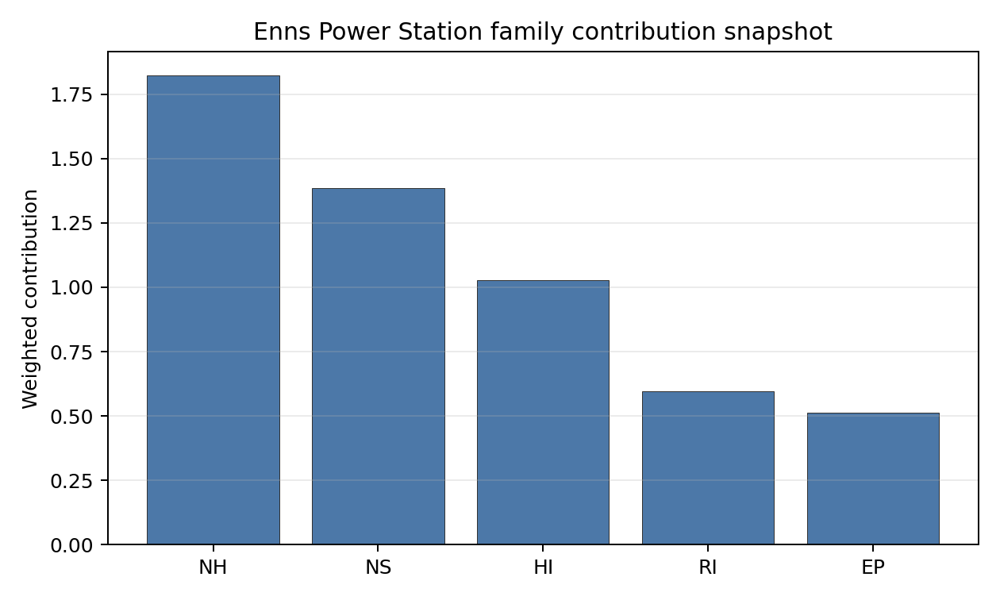

# Enns Power Station Site Profile

Enns Power Station is a coal/thermal site in Austria that has been tested against the NuScale VOYGR-6 reference deployment envelope. This profile reads the screening evidence at a level that supports a decision to progress toward Stage 3 characterisation. It is not a site-suitability determination, vendor recommendation, or licensing finding.

## Site Snapshot

| Field | Value |
| --- | --- |
| Site name | Enns Power Station |
| Coordinates | 48.2131, 14.4752 |
| Subnational unit | Enns |
| Installed thermal capacity (source data) | 800 MW |
| Available surface area | 41.5 ha |
| Available surface area for development | 5.7 ha |
| Composite score (baseline weights) | 6.616 (5.922-7.156 MC band) |
| National stability band | H (top-10% hit rate 0%) |
| National rank | 3 |

_See the country status map in_ [Austria Country Profile](../AT_country_prototype.md#country-status-map).

## Ownership and Coal-to-Nuclear Context

Enns is recorded with Energie AG Oberösterreich as immediate operator. The ownership chain in the bundle is led by **OÖ Landesholding GmbH** at 52.71%, with additional Austrian municipal, banking and utility shareholders including Linz AG, Raiffeisenlandesbank Oberösterreich AG, TIWAG-Tiroler Wasserkraft AG and Verbund AG. Because the unit record is cancelled rather than retired operation, Stage 3 would need to confirm the current industrial land status, permitting history and reusable infrastructure before assuming coal-to-nuclear continuity.

Generating units on record: 1 cancelled. The site remains relevant because the bundle records large installed thermal capacity and strong infrastructure indicators, but it requires a stronger evidence check than a retired operating station.

## Natural Hazards (NH)

- **Seismic: Ground Motion (NH-01)** - score 9.5/10 (MC 9.0-10.0), favourable: Well below the risk boundary., weight 0.0455, data quality high. Evidence: PGA at 475-year return period 0.036 g; PGA at 2,475-year return period 0.068 g; Vs30 reference (m/s): 760.0.
- **Seismic: Surface Rupture (NH-02)** - score 9.5/10 (MC 9.0-10.0), favourable: Very strong separation from mapped capable faults; surface-rupture concern effectively screened at desk-study level., weight n/a, data quality screening grade. Evidence: nearest mapped capable fault 50.0 km; fault slip rate 0 mm/yr; fault name: none_in_search_radius.
- **Geotechnical: Liquefaction (NH-03)** - score 5.5/10 (MC 5.0-6.0), pass-mark band: Moderate susceptibility, or high/very-high with documented (with mitigation to be confirmed) mitigation., weight n/a, data quality medium. Evidence: liquefaction susceptibility: moderate; dominant soil type: silty_clay_loam.
- **Geotechnical: Slope Stability (NH-04)** - score 7.5/10 (MC 7.0-8.0), weight n/a, data quality screening grade. Evidence: site slope 5.19 deg; max slope in 1 km box 85.5 deg; slope stability class: moderate.
- **Geotechnical: Subsidence (NH-05)** - score 9.5/10 (MC 9.0-10.0), favourable: No karst; mine-feature distance well above the score-5 pivot (or unknown)., weight 0.0354, data quality medium. Evidence: karst present: no; karst severity: none.
- **Geotechnical: Foundation (NH-06)** - score 5.5/10 (MC 5.0-6.0), pass-mark band: Typical European mixed conditions (bearing 80-150 kPa)., weight 0.0253, data quality medium. Evidence: bearing capacity 87.3 kPa; depth to bedrock 24.7 m.
- **Volcanism (NH-07)** - score 9.5/10 (MC 9.0-10.0), favourable: Very strong margin above the score-5 boundary (or screening found no in-radius signal)., weight n/a, data quality high. Evidence: volcanic hazard class: negligible.
- **Coastal Flooding (NH-08)** - score 9.5/10 (MC 9.0-10.0), favourable: Non-coastal OR elevation >= 50 m AMSL OR landlocked country, with no positive marine-hazard signal., weight 0.0303, data quality medium. Evidence: distance to coast 279.0 km.
- **River Flooding (NH-09)** - score 7.5/10 (MC 7.0-8.0), weight 0.0404, data quality medium. Evidence: flood zone class: negligible.
- **Extreme Winds (NH-10)** - score 5.5/10 (MC 5.0-6.0), pass-mark band: Middle relative wind exposure around the observed cohort mean (9.0-10.5 m/s)., weight 0.0152, data quality medium. Evidence: screening wind-speed index 10.4 m/s.
- **Extreme Precipitation (NH-11)** - score 6.0/10 (MC 6.0-7.0), pass-mark band: aggregated(mean_of_sub_scores), weight 0.0152, data quality medium. Evidence: screening extreme-precipitation index 0.36 mm; screening precipitation index 28.8 mm/yr.
- **Extreme Temperatures (NH-12)** - score 7.5/10 (MC 7.0-8.0), weight 0.0202, data quality medium. Evidence: extreme high temperature 23.1 deg C; extreme low temperature -3.75 deg C.
- **Combined Hazards (NH-14)** - score 5.5/10 (MC 5.0-6.0), pass-mark band: At least 5 resolved, exactly one moderate hazard (3-5) or moderate interaction only., weight 0.0152, data quality n/a. Evidence: no measured value in the current screening record.

### Interpretation - Natural Hazards (NH)

Enns has a favourable natural-hazard screen, with low seismic loading and no current natural-hazard exclusionary signal. PGA is 0.036 g at 475 years and 0.068 g at 2,475 years, and the nearest mapped capable fault is 50.0 km away. Liquefaction susceptibility is moderate on silty clay loam, bearing capacity is 87.3 kPa, depth to bedrock is 24.7 m, and mean site slope is 5.19 degrees. The river-flood class is negligible and the site is 279.0 km from the coast. The main Stage 3 tasks are local geotechnical confirmation and a check of the precipitation values, which are too coarse for design drainage or flood claims.

## Human-Induced and Security-Relevant Hazards (HI)

- **Aircraft Crash (HI-01)** - score 7.5/10 (MC 7.0-8.0), weight 0.0354, data quality high. Evidence: nearest airport 13.2 km; nearest flight path 6.6 km; airports within search radius 6; airport name: Hofkirchen Airfield; airport type: small airfield.
- **Industrial Explosions (HI-02)** - score 9.5/10 (MC 9.0-10.0), favourable: Very strong margin above the score-5 boundary (or completed search confirmed no in-radius signal)., weight 0.0354, data quality high. Evidence: nearest industrial site 5.36 km.
- **Toxic/Gas Releases (HI-03)** - score 3.5/10 (MC 3.0-4.0), weight 0.0354, data quality high. Evidence: nearest toxic source 5.36 km.
- **External Fires (HI-04)** - score 9.5/10 (MC 9.0-10.0), favourable: > 15 km, or completed flammable-storage search found nothing in radius., weight 0.0303, data quality high. Evidence: no measured value in the current screening record.
- **Military Installations (HI-06)** - score 0.0/10 (MC 0.0-0.0), weight 0.0303, data quality high. Evidence: nearest military installation 0.36 km; military installations within radius 32; installation name: unnamed.
- **Electromagnetic Interference (HI-07)** - score 1.5/10 (MC 1.0-2.0), weight 0.0101, data quality medium. Evidence: nearest high-power transmitter 0.37 km; transmitters within radius 447; transmitter type: lighting.

### Interpretation - Human-Induced and Security-Relevant Hazards (HI)

Human-induced hazards are a serious constraint at Enns. Aircraft Crash (HI-01) is acceptable at screening level, with Hofkirchen Airfield 13.2 km away and the nearest flight-path proxy 6.6 km away. Industrial explosion distance is favourable at 5.36 km under the current scoring, but Toxic/Gas Releases (HI-03) remains an avoidance flag because the nearest toxic source is also 5.36 km, inside the 8 km avoidance threshold. The highest-severity concern is Military Installations (HI-06): the nearest military feature is only 0.36 km away and 32 features are recorded in the wider radius. Electromagnetic Interference (HI-07) is also weak, with a transmitter 0.37 km away and 447 transmitters in radius. Enns should not progress without a hazardous-neighbour, military and RF screen at site scale.

## Radiological Impact and Emergency Planning (RI / EP)

- **Emergency Planning Feasibility (EP-01)** - score 7.5/10 (MC 7.0-8.0), weight n/a, data quality high. Evidence: EP feasibility composite 65.2 /100; road sub-score 78.6 /100; special-population sub-score 90.0 /100; geography sub-score 95.0 /100; population sub-score 60.0 /100; evacuation feasible: yes.
- **Evacuation Routes (EP-02)** - score 7.5/10 (MC 7.0-8.0), weight 0.0303, data quality medium. Evidence: road density in EPZ 1.145 km/km2; road length in EPZ 2,249 km; motorway access: yes.
- **Physical Geography Constraints (EP-03)** - score 9.5/10 (MC 9.0-10.0), favourable: No measured relief; open river/waterway context (interim screening)., weight 0.0253, data quality medium. Evidence: waterways crossing EPZ 0; major river barrier: no.
- **Special Populations (EP-04)** - score 1.5/10 (MC 1.0-2.0), weight 0.0303, data quality medium. Evidence: hospitals in EPZ 37; prisons in EPZ 4; care homes in EPZ 30.
- **Atmospheric Dispersion (RI-01)** - unscored (no band matched), weight 0.0303, data quality medium. Evidence: annual mean wind speed 1.03 m/s; atmospheric mixing height 496.3 m; prevailing wind direction: W.
- **Surface Water Dispersion (RI-02)** - score 9.5/10 (MC 9.0-10.0), favourable: > 500 m3/s., weight 0.0253, data quality n/a. Evidence: no measured value in the current screening record.
- **Groundwater Dispersion (RI-03)** - score 5.5/10 (MC 5.0-6.0), pass-mark band: Moderate-permeability aquifer screening proxy., weight 0.0253, data quality medium. Evidence: aquifer type: sedimentary sands.
- **Population Density at EPZ Radii (RI-04)** - score 3.5/10 (MC 3.0-4.0), weight 0.0404, data quality screening grade. Evidence: population density within 5 km 362.9 /km2; population density within 16 km 336.7 /km2; population density within 25 km 301.0 /km2; population density within 80 km 89.2 /km2; population within 25 km 590,914 people.
- **Distance to Population Centres (RI-05)** - score 3.5/10 (MC 3.0-4.0), weight 0.0505, data quality screening grade. Evidence: nearest city above 50k people 14.9 km; nearest city population 193,814 people; city name: Greater Linz.
- **Population Projections (RI-06)** - score 5.5/10 (MC 5.0-6.0), pass-mark band: 0 % to +0.3 %., weight 0.0253, data quality screening grade. Evidence: annual population growth rate 0.269 %/yr; projected population at 25 km in 60 yr 617,485 people.

### Interpretation - Radiological Impact and Emergency Planning (RI / EP)

Radiological impact and emergency planning are the main reasons Enns is a conditional rather than robust candidate. The EP-01 composite is 65.2/100 and evacuation is marked feasible, helped by 1.145 km/km2 road density, 2,249 km of EPZ road length and motorway access. That positive access picture is offset by high receptor load: 37 hospitals, 4 prisons and 30 care homes in the EPZ, population density of 301.0 people/km2 within 25 km, and 590,914 people within 25 km. Greater Linz is 14.9 km away, which creates a Distance to Population Centres (RI-05) avoidance flag. Stage 3 would need detailed time-to-clear modelling, special-population transport planning and a population-centre micro-siting review before Enns can remain in the shortlist.

## Non-Safety and Implementation Considerations (NS)

- **Grid Capacity Basic Filter (BF-01)** - score 5.5/10 (MC 5.0-6.0), pass-mark band: Note: substation 15-30 km OR 110-219 kV; reinforcement plausible., weight n/a, data quality n/a. Evidence: no measured value in the current screening record.
- **Land Area Basic Filter (BF-02)** - score 1.5/10 (MC 1.0-2.0), weight 0.0253, data quality n/a. Evidence: no measured value in the current screening record.
- **Cooling Water Availability (NS-01)** - score 8.0/10 (MC 8.0-9.0), favourable: aggregated(weighted_mean_of_sub_scores), weight 0.0404, data quality screening grade. Evidence: distance to cooling source 2.53 km; cooling source flow 1,563 m3/s; cooling source type: major_river; cooling source name: Bleicherbach (Stallbach); water stress label: Low.
- **Grid Connection (NS-02)** - score 5.5/10 (MC 5.0-6.0), pass-mark band: aggregated(min_of_sub_scores), weight 0.0404, data quality high. Evidence: nearest substation 0.73 km; nearest high-voltage line 1.65 km; highest nearby line voltage 110.0 kV; grid export capacity 800.0 MW; substations within radius 2,090; HV lines within radius 469.
- **Transport Access (NS-03)** - score 9.0/10 (MC 9.0-10.0), favourable: aggregated(weighted_mean_of_sub_scores), weight 0.0404, data quality high. Evidence: nearest highway 1.01 km; nearest rail line 0.91 km; nearest waterway 3.49 km; heavy-haul capable: yes.
- **Site Topography (NS-04)** - score 9.5/10 (MC 9.0-10.0), favourable: > 80 %., weight 0.0303, data quality screening grade. Evidence: favourable land cover 81.8 %; moderate land cover 9.9 %; unfavourable land cover 8.4 %; favourable area 41.5 ha; dominant land class: 211.
- **Site Footprint Adequacy (NS-05)** - score 7.5/10 (MC 7.0-8.0), weight 0.0253, data quality medium. Evidence: buildable area 5.71 ha; largest contiguous patch 5.71 ha; buildable patch count 11.
- **Existing Infrastructure (NS-06)** - unscored (no band matched), weight 0.0253, data quality n/a. Evidence: not measured at this site (criterion remains unscored).
- **Ecological Sensitivity (NS-08)** - score 1.5/10 (MC 1.0-2.0), weight n/a, data quality high. Evidence: natural land cover 8.4 %; distance to nearest Natura 2000 site 0.687 km; distance to nearest protected area 6.302 km; Natura 2000 overlap: no; Natura 2000 sensitivity class: high; protected-area overlap: no; protected-area sensitivity class: low; nearest Natura 2000 site: Unteres Steyr- und Ennstal; Natura 2000 sites within 5 km: 1; nearest protected-area designation: Nature Reserve.
- **Workforce Availability (NS-10)** - unscored (no band matched), weight 0.0202, data quality n/a. Evidence: not measured at this site (criterion remains unscored).
- **Regulatory/Political Environment (NS-12)** - unscored (no band matched), weight 0.0303, data quality n/a. Evidence: not measured at this site (criterion remains unscored).
- **Construction Logistics (NS-13)** - unscored (no band matched), weight 0.0202, data quality n/a. Evidence: not measured at this site (criterion remains unscored).

### Interpretation - Non-Safety and Implementation Considerations (NS)

Enns has strong industrial infrastructure but a tight development envelope. Cooling is a major strength: the recorded cooling source is 2.53 km away with 1,563 m3/s flow, and road, rail and waterway access are all close enough to support heavy logistics. Grid evidence is also better than several Austrian peers, with a 0.73 km substation distance, 1.65 km high-voltage-line distance and 800 MW export-capacity record, although nearby voltage remains 110 kV. Land and ecology are the limiting issues. The site surface is 41.5 ha, but the development-area estimate is only 5.7 ha; the nearest Natura 2000 site, Unteres Steyr- und Ennstal, is 0.687 km away and has high sensitivity. Stage 3 should test whether additional controlled brownfield land exists and whether the Natura 2000 setting can be managed without narrowing the usable envelope further.

## Composite Score and Stability

Baseline composite score is 6.616, bracketed by Monte Carlo at 5.922-7.156. National stability band is `H` with a top-10% hit rate of 0% in the national sensitivity analysis.

Enns ranks third nationally with a composite score of 6.616 and a Monte Carlo band of 5.922-7.156. Its national stability band is `H` with a 0% top-10 hit rate, so the point estimate does not survive the national sensitivity analysis as a robust high-ranking result. Enns is still selected because it is in the national top five and has strong cooling, access and export-capacity evidence. Its Stage 3 value depends on whether the HI-03, RI-05, military, special-population, ecology and land findings can be retired without a major redesign.

## Residual Risk Register

| Concern | Evidence | Consequence | Stage 3 action | Owner discipline |
| --- | --- | --- | --- | --- |
| Toxic/Gas Releases (HI-03) | Nearest toxic source 5.36 km | Avoidance flag remains until hazardous-cloud source is resolved | Refresh hazardous-neighbour inventory and consequence distances | Industrial safety |
| Distance to Population Centres (RI-05) | Greater Linz 14.9 km away; required distance 16.0 km | Small distance shortfall may constrain emergency-planning confidence | Micro-site receptor distance and population-centre boundary | Radiological / EP |
| Military Installations (HI-06) | Nearest military feature 0.36 km; 32 features in radius | Security standoff could become a decisive constraint | Confirm feature type, status and required cordons | Security |
| Special Populations (EP-04) | 37 hospitals, 4 prisons and 30 care homes in EPZ | Special-mover demand may dominate evacuation planning | Model special-population clearance and support routes | Emergency planning |
| Ecological Sensitivity (NS-08) | Unteres Steyr- und Ennstal 0.687 km away | Permitting envelope may narrow the already small development area | Start Natura 2000 screening and receptor-pathway review | EIA |

## Stage 3 Follow-Up Checklist

- Resolve **Toxic/Gas Releases (HI-03)** through a refreshed hazardous-neighbour consequence screen.
- Resolve **Distance to Population Centres (RI-05)** by micro-siting against the Greater Linz distance threshold.
- Confirm **Military Installations (HI-06)** feature status and security-cordon implications.
- Model **Special Populations (EP-04)** and EPZ special-mover demand.
- Survey **Electromagnetic Interference (HI-07)** around the 0.37 km transmitter record.
- Complete **Ecological Sensitivity (NS-08)** screening for Unteres Steyr- und Ennstal.
- Improve data quality for **Geotechnical: Subsidence & Collapse (NH-05b)**.

## Evidence Limitations

- Geotechnical: Subsidence & Collapse (NH-05b) - quality `low`.
