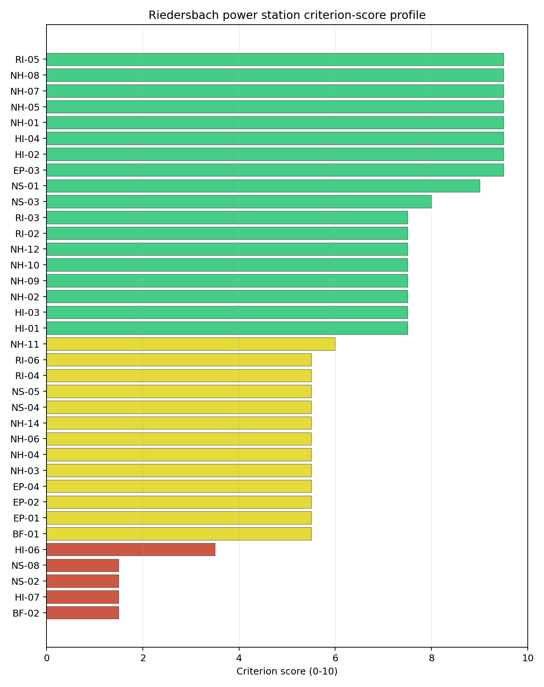
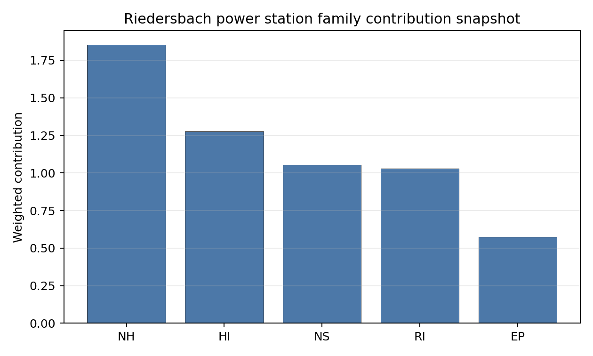

# Riedersbach power station Site Profile

Riedersbach power station is a coal/thermal site in Austria that has been tested against the NuScale VOYGR-6 reference deployment envelope. This profile reads the screening evidence at a level that supports a decision to progress toward Stage 3 characterisation. It is not a site-suitability determination, vendor recommendation, or licensing finding.

## Site Snapshot

| Field | Value |
| --- | --- |
| Site name | Riedersbach power station |
| Coordinates | 48.0318, 12.8431 |
| Subnational unit | Upper Austria |
| Installed thermal capacity (source data) | 220 MW |
| Available surface area | 18.0 ha |
| Available surface area for development | 12.8 ha |
| Composite score (baseline weights) | 7.159 (6.361-7.650 MC band) |
| National stability band | A (top-10% hit rate 100%) |
| National rank | 1 |

_See the country status map in_ [Austria Country Profile](../AT_country_prototype.md#country-status-map).

## Ownership and Coal-to-Nuclear Context

Riedersbach is recorded with Energie AG Oberösterreich as immediate operator. The ownership chain in the bundle is led by **OÖ Landesholding GmbH** at 52.71%, with additional Austrian municipal, banking and utility shareholders including Linz AG, Raiffeisenlandesbank Oberösterreich AG, TIWAG-Tiroler Wasserkraft AG and Verbund AG. The chain is therefore anchored in Austrian public and domestic utility ownership, but detailed legal control and land rights still require owner confirmation.

Generating units on record: 2 retired. Earliest unit commissioning: 1969; most recent: 1986. Retirements span 2010 to 2016, leaving a brownfield industrial site with grid, water, transport and workforce relevance for Stage 3 review.

## Natural Hazards (NH)

- **Seismic: Ground Motion (NH-01)** - score 9.5/10 (MC 9.0-10.0), favourable: Well below the risk boundary., weight 0.0455, data quality high. Evidence: PGA at 475-year return period 0.034 g; PGA at 2,475-year return period 0.067 g; Vs30 reference (m/s): 760.0.
- **Seismic: Surface Rupture (NH-02)** - score 7.5/10 (MC 7.0-8.0), weight n/a, data quality screening grade. Evidence: nearest mapped capable fault 31.2 km; fault slip rate 0.707 mm/yr; fault name: ATCF007.
- **Geotechnical: Liquefaction (NH-03)** - score 5.5/10 (MC 5.0-6.0), pass-mark band: Moderate susceptibility, or high/very-high with documented (with mitigation to be confirmed) mitigation., weight n/a, data quality medium. Evidence: liquefaction susceptibility: high; dominant soil type: loam.
- **Geotechnical: Slope Stability (NH-04)** - score 5.5/10 (MC 5.0-6.0), pass-mark band: At or below the score-5 risk boundary., weight n/a, data quality screening grade. Evidence: site slope 11.2 deg; max slope in 1 km box 87.3 deg; slope stability class: steep.
- **Geotechnical: Subsidence (NH-05)** - score 9.5/10 (MC 9.0-10.0), favourable: No karst; mine-feature distance well above the score-5 pivot (or unknown)., weight 0.0354, data quality medium. Evidence: karst present: no; karst severity: none.
- **Geotechnical: Foundation (NH-06)** - score 5.5/10 (MC 5.0-6.0), pass-mark band: Typical European mixed conditions (bearing 80-150 kPa)., weight 0.0253, data quality medium. Evidence: bearing capacity 80.7 kPa; depth to bedrock 20.5 m.
- **Volcanism (NH-07)** - score 9.5/10 (MC 9.0-10.0), favourable: Very strong margin above the score-5 boundary (or screening found no in-radius signal)., weight n/a, data quality high. Evidence: volcanic hazard class: negligible.
- **Coastal Flooding (NH-08)** - score 9.5/10 (MC 9.0-10.0), favourable: Non-coastal OR elevation >= 50 m AMSL OR landlocked country, with no positive marine-hazard signal., weight 0.0303, data quality medium. Evidence: distance to coast 252.8 km.
- **River Flooding (NH-09)** - score 7.5/10 (MC 7.0-8.0), weight 0.0404, data quality medium. Evidence: flood zone class: negligible.
- **Extreme Winds (NH-10)** - score 7.5/10 (MC 7.0-8.0), weight 0.0152, data quality medium. Evidence: screening wind-speed index 8.74 m/s.
- **Extreme Precipitation (NH-11)** - score 6.0/10 (MC 5.0-6.0), pass-mark band: aggregated(mean_of_sub_scores), weight 0.0152, data quality medium. Evidence: screening extreme-precipitation index 0.34 mm; screening precipitation index 44.2 mm/yr.
- **Extreme Temperatures (NH-12)** - score 7.5/10 (MC 7.0-8.0), weight 0.0202, data quality medium. Evidence: extreme high temperature 21.8 deg C; extreme low temperature -5.04 deg C.
- **Combined Hazards (NH-14)** - score 5.5/10 (MC 5.0-6.0), pass-mark band: At least 5 resolved, exactly one moderate hazard (3-5) or moderate interaction only., weight 0.0152, data quality n/a. Evidence: no measured value in the current screening record.

### Interpretation - Natural Hazards (NH)

Riedersbach has a favourable natural-hazard screen, led by very low ground motion and a strong separation from mapped capable faults. The 475-year PGA is 0.034 g and the 2,475-year PGA is 0.067 g, while the nearest mapped capable fault is 31.2 km away. The main physical-site questions are geotechnical rather than country-scale: liquefaction susceptibility is high on loam soils, bearing capacity is 80.7 kPa, and depth to bedrock is 20.5 m. The site is non-coastal at 252.8 km from the coast, has negligible river-flood classification, and records moderate wind and temperature loads. Stage 3 should confirm liquefaction, bearing capacity and precipitation inputs with site investigations before the buildable patch is treated as firm.

## Human-Induced and Security-Relevant Hazards (HI)

- **Aircraft Crash (HI-01)** - score 7.5/10 (MC 7.0-8.0), weight 0.0354, data quality high. Evidence: nearest airport 15.1 km; nearest flight path 12.5 km; airports within search radius 12; airport name: Altötting-Burghausen District Hospital Burghausen Heliport; airport type: heliport.
- **Industrial Explosions (HI-02)** - score 9.5/10 (MC 9.0-10.0), favourable: Very strong margin above the score-5 boundary (or completed search confirmed no in-radius signal)., weight 0.0354, data quality high. Evidence: nearest industrial site 21.9 km.
- **Toxic/Gas Releases (HI-03)** - score 7.5/10 (MC 7.0-8.0), weight 0.0354, data quality high. Evidence: nearest toxic source 21.9 km.
- **External Fires (HI-04)** - score 9.5/10 (MC 9.0-10.0), favourable: > 15 km, or completed flammable-storage search found nothing in radius., weight 0.0303, data quality high. Evidence: no measured value in the current screening record.
- **Military Installations (HI-06)** - score 3.5/10 (MC 3.0-4.0), weight 0.0303, data quality medium. Evidence: nearest military installation 19.0 km; military installations within radius 4; installation name: unnamed.
- **Electromagnetic Interference (HI-07)** - score 1.5/10 (MC 1.0-2.0), weight 0.0101, data quality medium. Evidence: nearest high-power transmitter 0.29 km; transmitters within radius 166; transmitter type: mast.

### Interpretation - Human-Induced and Security-Relevant Hazards (HI)

Human-induced hazards are material but not dominated by a single exclusionary finding. Aircraft Crash (HI-01) is acceptable at screening level, with the nearest heliport 15.1 km away, the nearest flight-path proxy 12.5 km away, and 12 airports inside the search radius. Industrial and toxic-source distances are both 21.9 km, supporting a favourable hazardous-neighbour read. The principal weaknesses are Military Installations (HI-06), with 4 military features inside the radius and the nearest at 19.0 km, and Electromagnetic Interference (HI-07), with a high-power transmitter 0.29 km away and 166 transmitters in the wider radius. Stage 3 should quantify aircraft frequency, confirm military-feature classification and complete an RF/EMI survey.

## Radiological Impact and Emergency Planning (RI / EP)

- **Emergency Planning Feasibility (EP-01)** - score 5.5/10 (MC 5.0-6.0), pass-mark band: At or above the composite score-5 boundary., weight n/a, data quality high. Evidence: EP feasibility composite 55.6 /100; road sub-score 66.4 /100; special-population sub-score 0 /100; geography sub-score 95.0 /100; population sub-score 80.0 /100; evacuation feasible: yes.
- **Evacuation Routes (EP-02)** - score 5.5/10 (MC 5.0-6.0), pass-mark band: Adequate primary routes (0.5-1.0)., weight 0.0303, data quality medium. Evidence: road density in EPZ 0.74 km/km2; road length in EPZ 1,452 km; motorway access: yes.
- **Physical Geography Constraints (EP-03)** - score 9.5/10 (MC 9.0-10.0), favourable: No measured relief; open river/waterway context (interim screening)., weight 0.0253, data quality medium. Evidence: waterways crossing EPZ 0; major river barrier: no.
- **Special Populations (EP-04)** - score 5.5/10 (MC 5.0-6.0), pass-mark band: 9-25., weight 0.0303, data quality medium. Evidence: hospitals in EPZ 17; prisons in EPZ 3; care homes in EPZ 2.
- **Atmospheric Dispersion (RI-01)** - unscored (no band matched), weight 0.0303, data quality medium. Evidence: annual mean wind speed 0.91 m/s; atmospheric mixing height 419.5 m; prevailing wind direction: WSW.
- **Surface Water Dispersion (RI-02)** - score 7.5/10 (MC 7.0-8.0), weight 0.0253, data quality n/a. Evidence: no measured value in the current screening record.
- **Groundwater Dispersion (RI-03)** - score 7.5/10 (MC 7.0-8.0), weight 0.0253, data quality medium. Evidence: aquifer type: low permeability.
- **Population Density at EPZ Radii (RI-04)** - score 5.5/10 (MC 5.0-6.0), pass-mark band: aggregated(min_of_sub_scores), weight 0.0404, data quality screening grade. Evidence: population density within 5 km 145.6 /km2; population density within 16 km 110.8 /km2; population density within 25 km 153.3 /km2; population density within 80 km 134.6 /km2; population within 25 km 301,073 people.
- **Distance to Population Centres (RI-05)** - score 9.5/10 (MC 9.0-10.0), favourable: Nearest >=50k population-centre proxy exceeds required distance by >= 50 %., weight 0.0505, data quality screening grade. Evidence: nearest city above 50k people 30.1 km; nearest city population 146,631 people; city name: Salzburg.
- **Population Projections (RI-06)** - score 5.5/10 (MC 5.0-6.0), pass-mark band: 0 % to +0.3 %., weight 0.0253, data quality screening grade. Evidence: annual population growth rate 0.054 %/yr; projected population at 25 km in 60 yr 314,610 people.

### Interpretation - Radiological Impact and Emergency Planning (RI / EP)

Radiological and emergency-planning conditions are moderate and manageable at screening level. The EP-01 composite is 55.6/100 and marked feasible, supported by 1,452 km of road in the EPZ and no major river barrier. The weak point is the special-population burden: 17 hospitals, 3 prisons and 2 care homes sit inside the EPZ, producing a zero special-population sub-score in the composite even though EP-04 remains at 5.5/10. Population density is 145.6 people/km2 within 5 km and 153.3 people/km2 within 25 km, with Salzburg 30.1 km away. Low-permeability groundwater and the 7.5/10 surface-water dispersion score support the screen, but Stage 3 should still confirm discharge-pathway and clearance-time modelling.

## Non-Safety and Implementation Considerations (NS)

- **Grid Capacity Basic Filter (BF-01)** - score 5.5/10 (MC 5.0-6.0), pass-mark band: Note: substation 15-30 km OR 110-219 kV; reinforcement plausible., weight n/a, data quality n/a. Evidence: no measured value in the current screening record.
- **Land Area Basic Filter (BF-02)** - score 1.5/10 (MC 1.0-2.0), weight 0.0253, data quality n/a. Evidence: no measured value in the current screening record.
- **Cooling Water Availability (NS-01)** - score 9.0/10 (MC 8.0-10.0), favourable: aggregated(weighted_mean_of_sub_scores), weight 0.0404, data quality screening grade. Evidence: distance to cooling source 0.58 km; cooling source flow 156.2 m3/s; cooling source type: major_river; cooling source name: Redlbach; water stress label: Low.
- **Grid Connection (NS-02)** - score 1.5/10 (MC 1.0-2.0), weight 0.0404, data quality high. Evidence: nearest substation 0.23 km; nearest high-voltage line 6.11 km; highest nearby line voltage 110.0 kV; grid export capacity 220.0 MW; substations within radius 2,656; HV lines within radius 671.
- **Transport Access (NS-03)** - score 8.0/10 (MC 7.0-8.0), favourable: aggregated(weighted_mean_of_sub_scores), weight 0.0404, data quality high. Evidence: nearest highway 2.55 km; nearest rail line 1.17 km; heavy-haul capable: yes.
- **Site Topography (NS-04)** - score 5.5/10 (MC 5.0-6.0), pass-mark band: 40-60 %., weight 0.0303, data quality screening grade. Evidence: favourable land cover 50.5 %; moderate land cover 18.3 %; unfavourable land cover 31.1 %; favourable area 90.2 ha; dominant land class: 311.
- **Site Footprint Adequacy (NS-05)** - score 5.5/10 (MC 5.0-6.0), pass-mark band: At or above the score-5 boundary., weight 0.0253, data quality high. Evidence: buildable area 12.8 ha; largest contiguous patch 12.8 ha; buildable patch count 17.
- **Existing Infrastructure (NS-06)** - unscored (no band matched), weight 0.0253, data quality n/a. Evidence: not measured at this site (criterion remains unscored).
- **Ecological Sensitivity (NS-08)** - score 1.5/10 (MC 1.0-2.0), weight n/a, data quality high. Evidence: natural land cover 31.1 %; distance to nearest Natura 2000 site 0.293 km; distance to nearest protected area 2.973 km; Natura 2000 overlap: no; Natura 2000 sensitivity class: high; protected-area overlap: no; protected-area sensitivity class: moderate; nearest Natura 2000 site: Salzachauen; Natura 2000 sites within 5 km: 8; nearest protected-area designation: Nature Reserve.
- **Workforce Availability (NS-10)** - unscored (no band matched), weight 0.0202, data quality n/a. Evidence: not measured at this site (criterion remains unscored).
- **Regulatory/Political Environment (NS-12)** - unscored (no band matched), weight 0.0303, data quality n/a. Evidence: not measured at this site (criterion remains unscored).
- **Construction Logistics (NS-13)** - unscored (no band matched), weight 0.0202, data quality n/a. Evidence: not measured at this site (criterion remains unscored).

### Interpretation - Non-Safety and Implementation Considerations (NS)

Riedersbach's implementation case is mixed: cooling water and transport are strong, while grid, ecology and land development constrain the site. The cooling source is 0.58 km away with a recorded flow of 156.2 m3/s, and heavy-haul access is supported by highway at 2.55 km and rail at 1.17 km. The grid file is the main avoidance flag: the nearest substation is 0.23 km away, but the nearest high-voltage line is 6.11 km away, the highest nearby voltage is 110 kV, and recorded export capacity is 220 MW against the 462 MWe VOYGR-6 reference output. Land is tight: the site surface is 18.0 ha and the development-area estimate is 12.8 ha. Ecological sensitivity is also high because Salzachauen lies 0.293 km away and 8 Natura 2000 sites sit within 5 km. Stage 3 should therefore combine grid-upgrade scoping, parcel/footprint confirmation and early Habitats Directive screening.

## Composite Score and Stability

Baseline composite score is 7.159, bracketed by Monte Carlo at 6.361-7.650. National stability band is `A` with a top-10% hit rate of 100% in the national sensitivity analysis.

Riedersbach is Austria's only stable national leader. Its baseline composite is 7.159, with a Monte Carlo band of 6.361-7.650, and it records band A with a 100% national top-10 hit rate in the project's 50,000-iteration national sensitivity analysis. The site remains avoidance-flagged, principally through NS-02 and the small development footprint, but its lead survives the national uncertainty treatment. Stage 3 spending on Riedersbach is therefore more defensible than starting with the band-H follow-up sites.

## Residual Risk Register

| Concern | Evidence | Consequence | Stage 3 action | Owner discipline |
| --- | --- | --- | --- | --- |
| Grid Connection (NS-02) | 220 MW export capacity, 110 kV nearby voltage, high-voltage line 6.11 km away | Full VOYGR-6 export would require a confirmed transmission pathway | Confirm upgrade route, voltage level and export capacity with the transmission system operator | Grid |
| Ecological Sensitivity (NS-08) | Salzachauen 0.293 km away; 8 Natura 2000 sites within 5 km | Permitting envelope could narrow before design optimisation | Start Habitats Directive screening and receptor-pathway review | EIA |
| Site Footprint / Land Area | 18.0 ha site surface; 12.8 ha development-area estimate | Layout and laydown margin may be tight for the reference envelope | Verify contiguous controlled land and adjacent-parcel options | Site engineering |
| Electromagnetic Interference (HI-07) | Nearest high-power transmitter 0.29 km; 166 transmitters in radius | RF restrictions may affect siting or shielding assumptions | Complete field RF survey and transmitter inventory | Security / I&C |
| Special Populations / EPZ | 17 hospitals, 3 prisons and 2 care homes in the EPZ | Emergency planning may depend on special-mover capacity | Model time-to-clear with special-population transport assumptions | Emergency planning |

## Stage 3 Follow-Up Checklist

- Resolve **Grid Connection (NS-02)** by confirming a transmission upgrade from the 220 MW / 110 kV screening position.
- Confirm **Land Area Basic Filter (BF-02)** with surveyed contiguous, controlled land.
- Survey **Electromagnetic Interference (HI-07)** around the 0.29 km transmitter record.
- Complete **Ecological Sensitivity (NS-08)** screening for Salzachauen and nearby Natura 2000 sites.
- Confirm **Military Installations (HI-06)** feature classification and standoff assumptions.
- Improve data quality for **Geotechnical: Subsidence & Collapse (NH-05b)**.

## Evidence Limitations

- Geotechnical: Subsidence & Collapse (NH-05b) - quality `low`.
