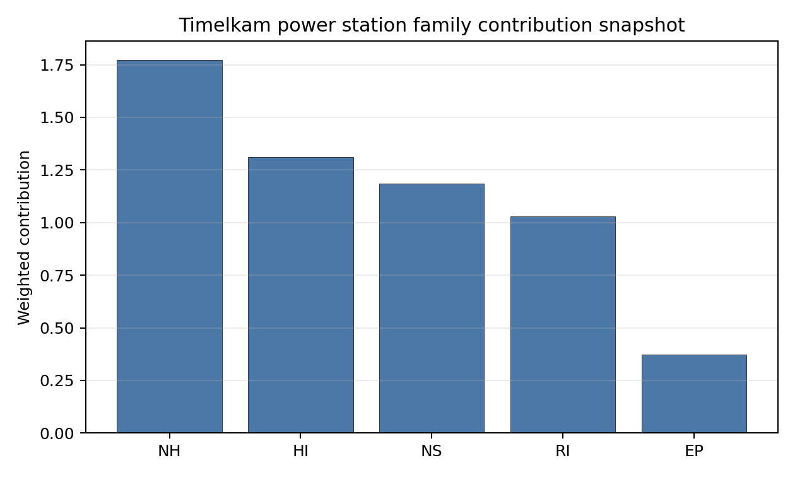

# Timelkam power station Site Profile

Timelkam power station is a coal/thermal site in Austria that has been tested against the NuScale VOYGR-6 reference deployment envelope. This profile reads the screening evidence at a level that supports a decision to progress toward Stage 3 characterisation. It is not a site-suitability determination, vendor recommendation, or licensing finding.

## Site Snapshot

| Field | Value |
| --- | --- |
| Site name | Timelkam power station |
| Coordinates | 48.0122, 13.5895 |
| Subnational unit | Upper Austria |
| Installed thermal capacity (source data) | 66 MW |
| Available surface area | 30.6 ha |
| Available surface area for development | 30.6 ha |
| Composite score (baseline weights) | 7.016 (6.245-7.487 MC band) |
| National stability band | H (top-10% hit rate 0%) |
| National rank | 2 |

_See the country status map in_ [Austria Country Profile](../AT_country_prototype.md#country-status-map).

## Ownership and Coal-to-Nuclear Context

Timelkam is recorded with Energie AG Oberösterreich as immediate operator. The ownership chain in the bundle is led by **OÖ Landesholding GmbH** at 52.71%, with additional Austrian municipal, banking and utility shareholders including Linz AG, Raiffeisenlandesbank Oberösterreich AG, TIWAG-Tiroler Wasserkraft AG and Verbund AG. The chain points to Austrian public and domestic utility ownership, but detailed legal control, parcel rights and reuse permissions remain Stage 3 diligence items.

Generating units on record: 1 retired. Earliest and most recent unit commissioning: 1962. Retirement is recorded in 2008, leaving a compact brownfield grid and transport setting for further characterisation.

## Natural Hazards (NH)

- **Seismic: Ground Motion (NH-01)** - score 9.5/10 (MC 9.0-10.0), favourable: Well below the risk boundary., weight 0.0455, data quality high. Evidence: PGA at 475-year return period 0.036 g; PGA at 2,475-year return period 0.07 g; Vs30 reference (m/s): 760.0.
- **Seismic: Surface Rupture (NH-02)** - score 9.5/10 (MC 9.0-10.0), favourable: Very strong separation from mapped capable faults; surface-rupture concern effectively screened at desk-study level., weight n/a, data quality screening grade. Evidence: nearest mapped capable fault 50.0 km; fault slip rate 0 mm/yr; fault name: none_in_search_radius.
- **Geotechnical: Liquefaction (NH-03)** - score 9.5/10 (MC 9.0-10.0), favourable: Negligible susceptibility (Stage-1 favourable default)., weight n/a, data quality medium. Evidence: liquefaction susceptibility: very_low; dominant soil type: loam.
- **Geotechnical: Slope Stability (NH-04)** - score 5.5/10 (MC 5.0-6.0), pass-mark band: At or below the score-5 risk boundary., weight n/a, data quality screening grade. Evidence: site slope 10.2 deg; max slope in 1 km box 87.6 deg; slope stability class: steep.
- **Geotechnical: Subsidence (NH-05)** - score 9.5/10 (MC 9.0-10.0), favourable: No karst; mine-feature distance well above the score-5 pivot (or unknown)., weight 0.0354, data quality medium. Evidence: karst present: no; karst severity: none.
- **Geotechnical: Foundation (NH-06)** - score 3.5/10 (MC 3.0-4.0), weight 0.0253, data quality medium. Evidence: bearing capacity 73.3 kPa; depth to bedrock 22.9 m.
- **Volcanism (NH-07)** - score 9.5/10 (MC 9.0-10.0), favourable: Very strong margin above the score-5 boundary (or screening found no in-radius signal)., weight n/a, data quality high. Evidence: volcanic hazard class: negligible.
- **Coastal Flooding (NH-08)** - score 9.5/10 (MC 9.0-10.0), favourable: Non-coastal OR elevation >= 50 m AMSL OR landlocked country, with no positive marine-hazard signal., weight 0.0303, data quality medium. Evidence: distance to coast 249.2 km.
- **River Flooding (NH-09)** - score 7.5/10 (MC 7.0-8.0), weight 0.0404, data quality medium. Evidence: flood zone class: negligible.
- **Extreme Winds (NH-10)** - score 5.5/10 (MC 5.0-6.0), pass-mark band: Middle relative wind exposure around the observed cohort mean (9.0-10.5 m/s)., weight 0.0152, data quality medium. Evidence: screening wind-speed index 10.1 m/s.
- **Extreme Precipitation (NH-11)** - score 6.0/10 (MC 5.0-6.0), pass-mark band: aggregated(mean_of_sub_scores), weight 0.0152, data quality medium. Evidence: screening extreme-precipitation index 0.35 mm; screening precipitation index 44.7 mm/yr.
- **Extreme Temperatures (NH-12)** - score 7.5/10 (MC 7.0-8.0), weight 0.0202, data quality medium. Evidence: extreme high temperature 21.4 deg C; extreme low temperature -4.92 deg C.
- **Combined Hazards (NH-14)** - score 5.5/10 (MC 5.0-6.0), pass-mark band: At least 5 resolved, exactly one moderate hazard (3-5) or moderate interaction only., weight 0.0152, data quality n/a. Evidence: no measured value in the current screening record.

### Interpretation - Natural Hazards (NH)

Timelkam has one of Austria's strongest natural-hazard screens. Ground motion is low, with PGA of 0.036 g at 475 years and 0.070 g at 2,475 years, and the nearest mapped capable fault is 50.0 km away. Liquefaction susceptibility is very low, subsidence evidence is favourable, the site is 249.2 km from the coast, and river flooding is negligible. The binding physical-site issue is foundation quality: bearing capacity is 73.3 kPa over 22.9 m to bedrock. The steep-slope proxy and the very low precipitation values should be treated as screening inputs requiring confirmation, not as design values. Stage 3 should begin with geotechnical drilling and local hydrology / precipitation reconciliation.

## Human-Induced and Security-Relevant Hazards (HI)

- **Aircraft Crash (HI-01)** - score 9.5/10 (MC 9.0-10.0), favourable: Only small / GA / heliport airport >= 10 km nearby, no flight-path proxy < 4 km, no major airport within 30 km, and no military airbase within 60 km., weight 0.0354, data quality high. Evidence: nearest airport 21.8 km; nearest flight path 10.9 km; airports within search radius 3; airport name: Gmunden-Laakirchen Airfield; airport type: small airfield.
- **Industrial Explosions (HI-02)** - score 9.5/10 (MC 9.0-10.0), favourable: Very strong margin above the score-5 boundary (or completed search confirmed no in-radius signal)., weight 0.0354, data quality medium. Evidence: no measured value in the current screening record.
- **Toxic/Gas Releases (HI-03)** - score 9.5/10 (MC 9.0-10.0), favourable: Very strong margin above the score-5 boundary (or completed search confirmed no in-radius signal)., weight 0.0354, data quality medium. Evidence: no measured value in the current screening record.
- **External Fires (HI-04)** - score 9.5/10 (MC 9.0-10.0), favourable: > 15 km, or completed flammable-storage search found nothing in radius., weight 0.0303, data quality medium. Evidence: no measured value in the current screening record.
- **Military Installations (HI-06)** - score 0.0/10 (MC 0.0-0.0), weight 0.0303, data quality medium. Evidence: nearest military installation 5.9 km; military installations within radius 81; installation name: Ehemaliger FLAK-Turm.
- **Electromagnetic Interference (HI-07)** - score 1.5/10 (MC 1.0-2.0), weight 0.0101, data quality medium. Evidence: nearest high-power transmitter 0.19 km; transmitters within radius 225; transmitter type: mast.

### Interpretation - Human-Induced and Security-Relevant Hazards (HI)

Human-induced hazards are the main reason Timelkam remains a conditional candidate. Aircraft Crash (HI-01) is favourable, with the nearest small airport 21.8 km away, the nearest flight path 10.9 km away, and no major airport signal in the available record. Industrial, toxic and external-fire screens are also favourable at this level. The weaknesses are security and electromagnetic context: the nearest recorded military feature is the Ehemaliger FLAK-Turm at 5.9 km, with 81 military records in the wider radius, and the nearest high-power transmitter is 0.19 km away with 225 transmitters in radius. Stage 3 should prioritize defence engagement and an RF/EMI survey before design siting is fixed.

## Radiological Impact and Emergency Planning (RI / EP)

- **Emergency Planning Feasibility (EP-01)** - score 5.5/10 (MC 5.0-6.0), pass-mark band: At or above the composite score-5 boundary., weight n/a, data quality high. Evidence: EP feasibility composite 60.9 /100; road sub-score 67.6 /100; special-population sub-score 90.0 /100; geography sub-score 10.0 /100; population sub-score 80.0 /100; evacuation feasible: yes.
- **Evacuation Routes (EP-02)** - score 5.5/10 (MC 5.0-6.0), pass-mark band: Adequate primary routes (0.5-1.0)., weight 0.0303, data quality medium. Evidence: road density in EPZ 0.76 km/km2; road length in EPZ 1,493 km; motorway access: yes.
- **Physical Geography Constraints (EP-03)** - score 1.5/10 (MC 1.0-2.0), weight 0.0253, data quality medium. Evidence: waterways crossing EPZ 163; major river barrier: yes.
- **Special Populations (EP-04)** - score 5.5/10 (MC 5.0-6.0), pass-mark band: 9-25., weight 0.0303, data quality medium. Evidence: hospitals in EPZ 13; prisons in EPZ 1; care homes in EPZ 9.
- **Atmospheric Dispersion (RI-01)** - unscored (no band matched), weight 0.0303, data quality medium. Evidence: annual mean wind speed 0.83 m/s; atmospheric mixing height 434.4 m; prevailing wind direction: WSW.
- **Surface Water Dispersion (RI-02)** - score 1.5/10 (MC 1.0-2.0), weight 0.0253, data quality n/a. Evidence: no measured value in the current screening record.
- **Groundwater Dispersion (RI-03)** - score 5.5/10 (MC 5.0-6.0), pass-mark band: Moderate-permeability aquifer screening proxy., weight 0.0253, data quality medium. Evidence: aquifer type: alluvial.
- **Population Density at EPZ Radii (RI-04)** - score 5.5/10 (MC 5.0-6.0), pass-mark band: aggregated(min_of_sub_scores), weight 0.0404, data quality screening grade. Evidence: population density within 5 km 246.4 /km2; population density within 16 km 149.4 /km2; population density within 25 km 125.7 /km2; population density within 80 km 127.7 /km2; population within 25 km 246,746 people.
- **Distance to Population Centres (RI-05)** - score 9.5/10 (MC 9.0-10.0), favourable: Nearest >=50k population-centre proxy exceeds required distance by >= 50 %., weight 0.0505, data quality screening grade. Evidence: nearest city above 50k people 47.0 km; nearest city population 146,631 people; city name: Salzburg.
- **Population Projections (RI-06)** - score 7.5/10 (MC 7.0-8.0), weight 0.0253, data quality screening grade. Evidence: annual population growth rate -0.174 %/yr; projected population at 25 km in 60 yr 257,843 people.

### Interpretation - Radiological Impact and Emergency Planning (RI / EP)

Timelkam's emergency-planning profile is feasible but geographically constrained. The EP-01 composite is 60.9/100 and marked feasible, with road density of 0.76 km/km2 and 1,493 km of roads inside the EPZ. The weakness is physical geography: 163 waterways cross the EPZ and a major river barrier is recorded, producing a 1.5/10 EP-03 score despite otherwise adequate road access. Population density is 246.4 people/km2 within 5 km and 125.7 people/km2 within 25 km, while Salzburg is 47.0 km away. Surface-water dispersion remains weak because the Vöckla dilution pathway is not measured. Stage 3 should model clearance times under the valley and waterway constraints and confirm the discharge-pathway basis.

## Non-Safety and Implementation Considerations (NS)

- **Grid Capacity Basic Filter (BF-01)** - score 5.5/10 (MC 5.0-6.0), pass-mark band: Note: substation 15-30 km OR 110-219 kV; reinforcement plausible., weight n/a, data quality n/a. Evidence: no measured value in the current screening record.
- **Land Area Basic Filter (BF-02)** - score 3.5/10 (MC 3.0-4.0), weight 0.0253, data quality n/a. Evidence: no measured value in the current screening record.
- **Cooling Water Availability (NS-01)** - score 8.0/10 (MC 7.0-8.0), favourable: aggregated(weighted_mean_of_sub_scores), weight 0.0404, data quality screening grade. Evidence: distance to cooling source 0.11 km; cooling source flow 6.45 m3/s; cooling source type: small_river; cooling source name: Vöckla; water stress label: Low.
- **Grid Connection (NS-02)** - score 3.5/10 (MC 3.0-4.0), weight 0.0404, data quality high. Evidence: nearest substation 0.19 km; nearest high-voltage line 1.82 km; highest nearby line voltage 110.0 kV; grid export capacity 400.0 MW; substations within radius 2,987; HV lines within radius 428.
- **Transport Access (NS-03)** - score 9.0/10 (MC 9.0-10.0), favourable: aggregated(weighted_mean_of_sub_scores), weight 0.0404, data quality high. Evidence: nearest highway 1.51 km; nearest rail line 0.06 km; heavy-haul capable: yes.
- **Site Topography (NS-04)** - score 5.5/10 (MC 5.0-6.0), pass-mark band: 40-60 %., weight 0.0303, data quality screening grade. Evidence: favourable land cover 57.6 %; moderate land cover 15.1 %; unfavourable land cover 27.3 %; favourable area 150.4 ha; dominant land class: 312.
- **Site Footprint Adequacy (NS-05)** - score 7.5/10 (MC 7.0-8.0), weight 0.0253, data quality medium. Evidence: buildable area 30.6 ha; largest contiguous patch 30.6 ha; buildable patch count 18.
- **Existing Infrastructure (NS-06)** - unscored (no band matched), weight 0.0253, data quality n/a. Evidence: not measured at this site (criterion remains unscored).
- **Ecological Sensitivity (NS-08)** - score 3.5/10 (MC 3.0-4.0), weight n/a, data quality high. Evidence: natural land cover 27.3 %; distance to nearest Natura 2000 site 6.837 km; distance to nearest protected area 4.288 km; Natura 2000 overlap: no; Natura 2000 sensitivity class: low; protected-area overlap: no; protected-area sensitivity class: low; nearest Natura 2000 site: Mond- und Attersee; Natura 2000 sites within 5 km: 0; nearest protected-area designation: Landscape Protection Area.
- **Workforce Availability (NS-10)** - unscored (no band matched), weight 0.0202, data quality n/a. Evidence: not measured at this site (criterion remains unscored).
- **Regulatory/Political Environment (NS-12)** - unscored (no band matched), weight 0.0303, data quality n/a. Evidence: not measured at this site (criterion remains unscored).
- **Construction Logistics (NS-13)** - unscored (no band matched), weight 0.0202, data quality n/a. Evidence: not measured at this site (criterion remains unscored).

### Interpretation - Non-Safety and Implementation Considerations (NS)

Timelkam has a strong brownfield implementation case but remains limited by grid export capacity. The Vöckla is 0.11 km from the site with 6.45 m3/s recorded flow, rail is 0.06 km away, highway access is 1.51 km away, and heavy-haul capability is recorded. The site surface and development-area estimate are both 30.6 ha, which gives a clearer land basis than several Austrian peers. Grid Connection (NS-02) is the active constraint: the nearest substation is 0.19 km away and the nearest high-voltage line is 1.82 km away, but the highest nearby voltage is 110 kV and export capacity is 400 MW, below the 462 MWe reference output. Ecological sensitivity is moderate rather than decisive, with Mond- und Attersee 6.837 km away and no Natura 2000 site within 5 km. Stage 3 should test the grid-upgrade pathway, confirm controlled land, and convert the unscored implementation criteria into project-specific evidence.

## Composite Score and Stability

Baseline composite score is 7.016, bracketed by Monte Carlo at 6.245-7.487. National stability band is `H` with a top-10% hit rate of 0% in the national sensitivity analysis.

Timelkam ranks second nationally with a composite score of 7.016 and a Monte Carlo band of 6.245-7.487. Its national stability band is `H` with a 0% top-10 hit rate in the project's 50,000-iteration national sensitivity analysis. The point estimate is strong, but the ranking is not robust once national weight uncertainty is applied. Timelkam is therefore a credible follow-up site, especially because its land and transport evidence are comparatively clear, but it should not displace Riedersbach unless the Riedersbach grid, ecology or land findings worsen in Stage 3.

## Residual Risk Register

| Concern | Evidence | Consequence | Stage 3 action | Owner discipline |
| --- | --- | --- | --- | --- |
| Grid Connection (NS-02) | 400 MW export capacity; highest nearby voltage 110 kV | Existing connection is below the 462 MWe reference output | Confirm upgrade route and higher-voltage interconnection option | Grid |
| Military Installations (HI-06) | Ehemaliger FLAK-Turm 5.9 km away; 81 military records in radius | Security standoff and feature classification could affect site boundary | Engage defence authorities and confirm feature type | Security |
| Physical Geography (EP-03) | 163 waterways crossing EPZ; major river barrier recorded | Clearance-time modelling may be constrained by valley and waterway structure | Run EPZ evacuation and access modelling | Emergency planning |
| Surface Water Dispersion (RI-02) | Vöckla discharge pathway not measured in the criterion record | Liquid-pathway assumptions remain screening grade | Measure low-flow and discharge/dilution conditions | Hydrology |
| Foundation (NH-06) | Bearing capacity 73.3 kPa; depth to bedrock 22.9 m | Ground improvement or deep foundation may be needed | Complete CPT/SPT and foundation campaign | Geotechnical |

## Stage 3 Follow-Up Checklist

- Resolve **Grid Connection (NS-02)** by confirming export capacity above the VOYGR-6 reference output.
- Confirm **Military Installations (HI-06)** classification and standoff implications.
- Model **Physical Geography Constraints (EP-03)** for EPZ clearance under the waterway-barrier setting.
- Measure **Surface Water Dispersion (RI-02)** using Vöckla low-flow and discharge-pathway data.
- Re-measure **Geotechnical: Foundation (NH-06)** with site-specific bearing and settlement evidence.
- Improve data quality for **Geotechnical: Subsidence & Collapse (NH-05b)**.

## Evidence Limitations

- Geotechnical: Subsidence & Collapse (NH-05b) - quality `low`.
