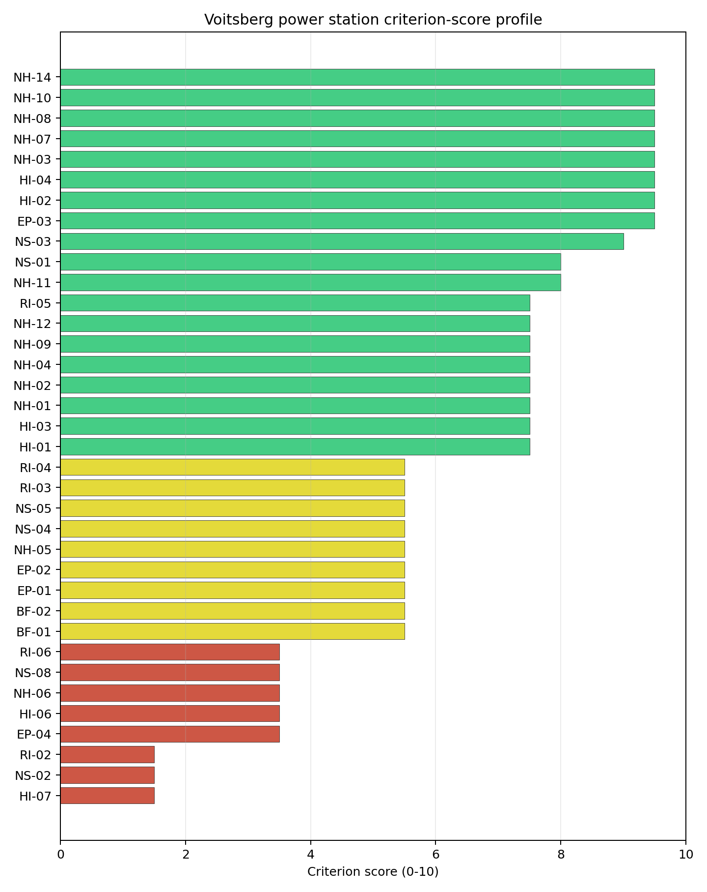

# Voitsberg power station Site Profile

Voitsberg power station is a coal/thermal site in Austria that has been tested against the NuScale VOYGR-6 reference deployment envelope. This profile reads the screening evidence at a level that supports a decision to progress toward Stage 3 characterisation. It is not a site-suitability determination, vendor recommendation, or licensing finding.

## Site Snapshot

| Field | Value |
| --- | --- |
| Site name | Voitsberg power station |
| Coordinates | 47.0475, 15.1603 |
| Subnational unit | Styria |
| Installed thermal capacity (source data) | 330 MW |
| Available surface area | 24.5 ha |
| Available surface area for development | 41.4 ha |
| Composite score (baseline weights) | 6.559 (5.876-7.050 MC band) |
| National stability band | H (top-10% hit rate 0%) |
| National rank | 4 |

_See the country status map in_ [Austria Country Profile](../AT_country_prototype.md#country-status-map).

## Ownership and Coal-to-Nuclear Context

Voitsberg is recorded with Verbund AG as immediate operator. The bundle shows the **Government of Austria** holding 51.00% of Verbund AG, with additional Austrian utility and small-shareholder interests. The ownership chain is therefore state-anchored through Verbund, although site control, land disposition and reuse permissions still require direct confirmation.

Generating units on record: 1 retired. Earliest and most recent unit commissioning: 1983. Retirement is recorded in 2006, leaving a brownfield station context with grid, road, rail and workforce relevance for Stage 3 review.

## Natural Hazards (NH)

- **Seismic: Ground Motion (NH-01)** - score 7.5/10 (MC 7.0-8.0), weight 0.0455, data quality high. Evidence: PGA at 475-year return period 0.083 g; PGA at 2,475-year return period 0.16 g; Vs30 reference (m/s): 760.0.
- **Seismic: Surface Rupture (NH-02)** - score 7.5/10 (MC 7.0-8.0), weight n/a, data quality screening grade. Evidence: nearest mapped capable fault 31.5 km; fault slip rate 0.382 mm/yr; fault name: ATCF00D.
- **Geotechnical: Liquefaction (NH-03)** - score 9.5/10 (MC 9.0-10.0), favourable: Negligible susceptibility (Stage-1 favourable default)., weight n/a, data quality medium. Evidence: liquefaction susceptibility: very_low; dominant soil type: loam.
- **Geotechnical: Slope Stability (NH-04)** - score 7.5/10 (MC 7.0-8.0), weight n/a, data quality screening grade. Evidence: site slope 9.03 deg; max slope in 1 km box 45.0 deg; slope stability class: moderate.
- **Geotechnical: Subsidence (NH-05)** - score 5.5/10 (MC 5.0-6.0), pass-mark band: At or above the mine-distance score-5 pivot; review possible., weight 0.0354, data quality medium. Evidence: karst present: no; karst severity: moderate; formation type: carbonate (Continuous carbonate rocks).
- **Geotechnical: Foundation (NH-06)** - score 3.5/10 (MC 3.0-4.0), weight 0.0253, data quality medium. Evidence: bearing capacity 73.3 kPa; depth to bedrock 24.3 m.
- **Volcanism (NH-07)** - score 9.5/10 (MC 9.0-10.0), favourable: Very strong margin above the score-5 boundary (or screening found no in-radius signal)., weight n/a, data quality high. Evidence: volcanic hazard class: negligible.
- **Coastal Flooding (NH-08)** - score 9.5/10 (MC 9.0-10.0), favourable: Non-coastal OR elevation >= 50 m AMSL OR landlocked country, with no positive marine-hazard signal., weight 0.0303, data quality medium. Evidence: distance to coast 184.4 km.
- **River Flooding (NH-09)** - score 7.5/10 (MC 7.0-8.0), weight 0.0404, data quality medium. Evidence: flood zone class: negligible.
- **Extreme Winds (NH-10)** - score 9.5/10 (MC 9.0-10.0), favourable: Lowest relative wind exposure in the current monthly-means gust cohort (< 7.5 m/s)., weight 0.0152, data quality medium. Evidence: screening wind-speed index 6.91 m/s.
- **Extreme Precipitation (NH-11)** - score 8.0/10 (MC 7.0-8.0), favourable: aggregated(mean_of_sub_scores), weight 0.0152, data quality medium. Evidence: screening extreme-precipitation index 0.24 mm; screening precipitation index 31.8 mm/yr.
- **Extreme Temperatures (NH-12)** - score 7.5/10 (MC 7.0-8.0), weight 0.0202, data quality medium. Evidence: extreme high temperature 21.2 deg C; extreme low temperature -5.52 deg C.
- **Combined Hazards (NH-14)** - score 9.5/10 (MC 9.0-10.0), favourable: At least 5 underlying NH criteria resolved, all >= 7; no interaction pair below 7., weight 0.0152, data quality n/a. Evidence: no measured value in the current screening record.

### Interpretation - Natural Hazards (NH)

Voitsberg has a generally favourable natural-hazard screen with one geotechnical weakness. Ground motion is moderate for Austria, with PGA of 0.083 g at 475 years and 0.160 g at 2,475 years, and the nearest mapped capable fault is 31.5 km away. Liquefaction susceptibility is very low, slope class is moderate, river flooding is negligible, and coastal flooding is irrelevant at 184.4 km from the coast. The main weakness is foundation bearing capacity at 73.3 kPa with 24.3 m depth to bedrock, while the carbonate-formation context keeps subsidence under review. Stage 3 should measure bearing capacity, settlement and any karst-related subsurface features before relying on the current moderate natural-hazard score.

## Human-Induced and Security-Relevant Hazards (HI)

- **Aircraft Crash (HI-01)** - score 7.5/10 (MC 7.0-8.0), weight 0.0354, data quality high. Evidence: nearest airport 22.1 km; nearest flight path 11.0 km; airports within search radius 3; airport name: Graz Airport; airport type: large airport.
- **Industrial Explosions (HI-02)** - score 9.5/10 (MC 9.0-10.0), favourable: Very strong margin above the score-5 boundary (or completed search confirmed no in-radius signal)., weight 0.0354, data quality high. Evidence: nearest industrial site 19.6 km.
- **Toxic/Gas Releases (HI-03)** - score 7.5/10 (MC 7.0-8.0), weight 0.0354, data quality high. Evidence: nearest toxic source 19.6 km.
- **External Fires (HI-04)** - score 9.5/10 (MC 9.0-10.0), favourable: > 15 km, or completed flammable-storage search found nothing in radius., weight 0.0303, data quality high. Evidence: no measured value in the current screening record.
- **Military Installations (HI-06)** - score 3.5/10 (MC 3.0-4.0), weight 0.0303, data quality medium. Evidence: nearest military installation 16.1 km; military installations within radius 58; installation name: unnamed.
- **Electromagnetic Interference (HI-07)** - score 1.5/10 (MC 1.0-2.0), weight 0.0101, data quality medium. Evidence: nearest high-power transmitter 0.72 km; transmitters within radius 360; transmitter type: communication.

### Interpretation - Human-Induced and Security-Relevant Hazards (HI)

Voitsberg's human-induced hazard profile is shaped by its Styrian industrial and airport context. Graz Airport is 22.1 km away, the nearest flight-path proxy is 11.0 km away, and 3 airports are recorded in the search radius, so Aircraft Crash (HI-01) remains a Stage 3 micro-siting calculation rather than a simple dismissal. Industrial and toxic sources are each 19.6 km away, which is favourable under the current avoidance logic. The weak points are Military Installations (HI-06), with the nearest feature 16.1 km away and 58 records in radius, and Electromagnetic Interference (HI-07), with a transmitter 0.72 km away and 360 transmitters in the wider radius. Stage 3 should verify military classifications and RF field strengths while preserving the airport-frequency calculation as a design input.

## Radiological Impact and Emergency Planning (RI / EP)

- **Emergency Planning Feasibility (EP-01)** - score 5.5/10 (MC 5.0-6.0), pass-mark band: At or above the composite score-5 boundary., weight n/a, data quality high. Evidence: EP feasibility composite 55.4 /100; road sub-score 65.4 /100; special-population sub-score 0 /100; geography sub-score 95.0 /100; population sub-score 80.0 /100; evacuation feasible: yes.
- **Evacuation Routes (EP-02)** - score 5.5/10 (MC 5.0-6.0), pass-mark band: Adequate primary routes (0.5-1.0)., weight 0.0303, data quality medium. Evidence: road density in EPZ 0.723 km/km2; road length in EPZ 1,420 km; motorway access: yes.
- **Physical Geography Constraints (EP-03)** - score 9.5/10 (MC 9.0-10.0), favourable: No measured relief; open river/waterway context (interim screening)., weight 0.0253, data quality medium. Evidence: waterways crossing EPZ 0; major river barrier: no.
- **Special Populations (EP-04)** - score 3.5/10 (MC 3.0-4.0), weight 0.0303, data quality medium. Evidence: hospitals in EPZ 38; prisons in EPZ 4; care homes in EPZ 4.
- **Atmospheric Dispersion (RI-01)** - unscored (no band matched), weight 0.0303, data quality medium. Evidence: annual mean wind speed 0.64 m/s; atmospheric mixing height 395.1 m; prevailing wind direction: W.
- **Surface Water Dispersion (RI-02)** - score 1.5/10 (MC 1.0-2.0), weight 0.0253, data quality n/a. Evidence: no measured value in the current screening record.
- **Groundwater Dispersion (RI-03)** - score 5.5/10 (MC 5.0-6.0), pass-mark band: Moderate-permeability aquifer screening proxy., weight 0.0253, data quality medium. Evidence: aquifer type: alluvial.
- **Population Density at EPZ Radii (RI-04)** - score 5.5/10 (MC 5.0-6.0), pass-mark band: aggregated(min_of_sub_scores), weight 0.0404, data quality screening grade. Evidence: population density within 5 km 233.2 /km2; population density within 16 km 103.2 /km2; population density within 25 km 230.0 /km2; population density within 80 km 89.3 /km2; population within 25 km 451,536 people.
- **Distance to Population Centres (RI-05)** - score 7.5/10 (MC 7.0-8.0), weight 0.0505, data quality screening grade. Evidence: nearest city above 50k people 21.4 km; nearest city population 269,997 people; city name: Graz.
- **Population Projections (RI-06)** - score 3.5/10 (MC 3.0-4.0), weight 0.0253, data quality screening grade. Evidence: annual population growth rate 0.503 %/yr; projected population at 25 km in 60 yr 471,844 people.

### Interpretation - Radiological Impact and Emergency Planning (RI / EP)

Voitsberg has a feasible but periurban emergency-planning profile. EP-01 scores 55.4/100 and is marked feasible, with 1,420 km of EPZ roads, road density of 0.723 km/km2 and motorway access. The special-population term is weak: 38 hospitals, 4 prisons and 4 care homes are recorded in the EPZ. Population within 25 km is 451,536 and Graz, with 269,997 people, is 21.4 km away. Population growth is positive at 0.503%/year, producing a 25 km projection of 471,844 people after 60 years. Surface-water dispersion remains a low-confidence floor. Stage 3 should model special-population evacuation, long-horizon growth and Tregistbach dilution before Voitsberg is treated as a robust fallback.

## Non-Safety and Implementation Considerations (NS)

- **Grid Capacity Basic Filter (BF-01)** - score 5.5/10 (MC 5.0-6.0), pass-mark band: Note: substation 15-30 km OR 110-219 kV; reinforcement plausible., weight n/a, data quality n/a. Evidence: no measured value in the current screening record.
- **Land Area Basic Filter (BF-02)** - score 5.5/10 (MC 5.0-6.0), pass-mark band: 80-100% of required area with documented expansion / layout flexibility., weight 0.0253, data quality n/a. Evidence: no measured value in the current screening record.
- **Cooling Water Availability (NS-01)** - score 8.0/10 (MC 7.0-8.0), favourable: aggregated(weighted_mean_of_sub_scores), weight 0.0404, data quality screening grade. Evidence: distance to cooling source 3.73 km; cooling source flow 7.51 m3/s; cooling source type: river; cooling source name: Tregistbach; water stress label: Low.
- **Grid Connection (NS-02)** - score 1.5/10 (MC 1.0-2.0), weight 0.0404, data quality high. Evidence: nearest substation 2.1 km; nearest high-voltage line 1.74 km; highest nearby line voltage 110.0 kV; grid export capacity 330.0 MW; substations within radius 1,418; HV lines within radius 618.
- **Transport Access (NS-03)** - score 9.0/10 (MC 9.0-10.0), favourable: aggregated(weighted_mean_of_sub_scores), weight 0.0404, data quality high. Evidence: nearest highway 0.89 km; nearest rail line 0.85 km; heavy-haul capable: yes.
- **Site Topography (NS-04)** - score 5.5/10 (MC 5.0-6.0), pass-mark band: 40-60 %., weight 0.0303, data quality screening grade. Evidence: favourable land cover 51.2 %; moderate land cover 10.2 %; unfavourable land cover 29.0 %; favourable area 22.1 ha; dominant land class: 112.
- **Site Footprint Adequacy (NS-05)** - score 5.5/10 (MC 5.0-6.0), pass-mark band: At or above the score-5 boundary., weight 0.0253, data quality medium. Evidence: buildable area 41.4 ha; largest contiguous patch 41.4 ha; buildable patch count 12.
- **Existing Infrastructure (NS-06)** - unscored (no band matched), weight 0.0253, data quality n/a. Evidence: not measured at this site (criterion remains unscored).
- **Ecological Sensitivity (NS-08)** - score 3.5/10 (MC 3.0-4.0), weight n/a, data quality high. Evidence: natural land cover 29.0 %; distance to nearest Natura 2000 site 8.901 km; distance to nearest protected area 2.933 km; Natura 2000 overlap: no; Natura 2000 sensitivity class: low; protected-area overlap: no; protected-area sensitivity class: moderate; nearest Natura 2000 site: Oberlauf des Schirningbaches mit Zubringerbächen sowie Unterlauf des Enzenbaches; Natura 2000 sites within 5 km: 0; nearest protected-area designation: Landscape Protection Area.
- **Workforce Availability (NS-10)** - unscored (no band matched), weight 0.0202, data quality n/a. Evidence: not measured at this site (criterion remains unscored).
- **Regulatory/Political Environment (NS-12)** - unscored (no band matched), weight 0.0303, data quality n/a. Evidence: not measured at this site (criterion remains unscored).
- **Construction Logistics (NS-13)** - unscored (no band matched), weight 0.0202, data quality n/a. Evidence: not measured at this site (criterion remains unscored).

### Interpretation - Non-Safety and Implementation Considerations (NS)

Voitsberg's implementation case is strong on access and land, but weak on grid export. The site has highway access at 0.89 km, rail at 0.85 km and heavy-haul capability. Cooling is feasible but offset, with the Tregistbach 3.73 km away and recorded flow of 7.51 m3/s. The site surface is 24.5 ha and the development-area estimate is 41.4 ha, but this wider development figure should be treated as a screening envelope, not as confirmed controlled land. Grid Connection (NS-02) is the principal avoidance issue: the nearest substation is 2.10 km away, the highest nearby voltage is 110 kV, and export capacity is 330 MW, below the VOYGR-6 reference output. Ecology is moderate, with no Natura 2000 site within 5 km. Stage 3 should test a higher-voltage export route and confirm which land parcels are controlled, contiguous and developable.

## Composite Score and Stability

Baseline composite score is 6.559, bracketed by Monte Carlo at 5.876-7.050. National stability band is `H` with a top-10% hit rate of 0% in the national sensitivity analysis.

Voitsberg ranks fourth nationally with a composite score of 6.559 and a Monte Carlo band of 5.876-7.050. It is band H with a 0% national top-10 hit rate, so it is a point-estimate follow-up site rather than a sensitivity-robust candidate. Its value in the selected set is practical: it has good access, usable land evidence and a retired industrial context. Its weakness is that NS-02, special-population exposure and surface-water evidence all need resolution before it could move from fallback to preferred Stage 3 work.

## Residual Risk Register

| Concern | Evidence | Consequence | Stage 3 action | Owner discipline |
| --- | --- | --- | --- | --- |
| Grid Connection (NS-02) | 330 MW export capacity; 110 kV nearby voltage | Existing export basis is below the 462 MWe reference output | Confirm transmission upgrade and higher-voltage route | Grid |
| Surface Water Dispersion (RI-02) | Criterion at 1.5/10; Tregistbach 3.73 km away with 7.51 m3/s flow | Dilution pathway remains weak and offset from site | Measure discharge and model liquid-pathway dispersion | Hydrology |
| Special Populations (EP-04) | 38 hospitals, 4 prisons and 4 care homes in EPZ | Emergency planning may require high special-mover capacity | Model time-to-clear and special transport resources | Emergency planning |
| Foundation (NH-06) | Bearing capacity 73.3 kPa; 24.3 m depth to bedrock | Ground improvement may affect cost and layout | Complete site geotechnical campaign | Geotechnical |
| Electromagnetic Interference (HI-07) | Transmitter 0.72 km away; 360 transmitters in radius | RF controls may affect detailed siting | Complete RF field survey and transmitter inventory | Security / I&C |

## Stage 3 Follow-Up Checklist

- Resolve **Grid Connection (NS-02)** through a higher-voltage export-capacity study.
- Survey **Electromagnetic Interference (HI-07)** around the 0.72 km transmitter record.
- Measure **Surface Water Dispersion (RI-02)** for the Tregistbach pathway.
- Model **Special Populations (EP-04)** and EPZ special-mover demand.
- Confirm **Military Installations (HI-06)** classification and standoff assumptions.
- Improve data quality for **Geotechnical: Subsidence & Collapse (NH-05b)**.

## Evidence Limitations

- Geotechnical: Subsidence & Collapse (NH-05b) - quality `low`.
