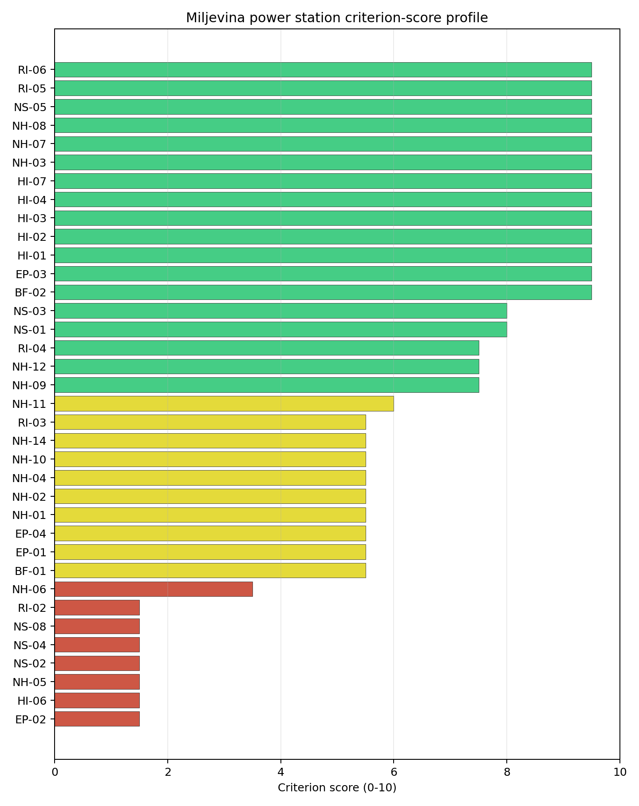
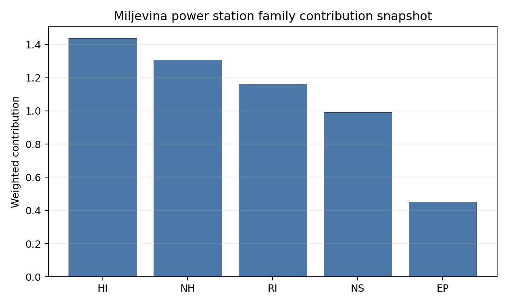

# Miljevina power station Site Profile

Miljevina power station is a coal/thermal site in Bosnia and Herzegovina that has been tested against the NuScale VOYGR-6 reference deployment envelope. This profile reads the screening evidence at a level that supports a decision to progress toward Stage 3 characterisation. It is not a site-suitability determination, vendor recommendation, or licensing finding.

## Site Snapshot

| Field | Value |
| --- | --- |
| Site name | Miljevina power station |
| Coordinates | 43.5183, 18.6521 |
| Subnational unit | Republika Srpska |
| Installed thermal capacity (source data) | 220 MW |
| Available surface area | 106.2 ha |
| Available surface area for development | 106.2 ha |
| Composite score (baseline weights) | 6.622 (5.927-7.131 MC band) |
| National stability band | H (top-10% hit rate 8%) |
| National rank | 2 |

_See the country status map in_ [Bosnia and Herzegovina Country Profile](../BA_country_prototype.md#country-status-map).

## Ownership and Coal-to-Nuclear Context

Generating units on record: 2 cancelled.

## Natural Hazards (NH)

- **Seismic: Ground Motion (NH-01)** - score 5.5/10 (MC 5.0-6.0) - pass-mark band: At or below the score-5 risk boundary., weight 0.0455, data quality high. Evidence: PGA at 475-year return period 0.132 g; PGA at 2,475-year return period 0.273 g; Vs30 reference (m/s): 760.0.
- **Seismic: Surface Rupture (NH-02)** - score 5.5/10 (MC 5.0-6.0) - pass-mark band: Borderline acceptable separation: meets the 8.0 km score boundary; check against the 8 km conservative screen and local capability evidence., weight n/a, data quality screening grade. Evidence: nearest mapped capable fault 13.6 km; fault slip rate 0.173 mm/yr; fault name: MECF007.
- **Geotechnical: Liquefaction (NH-03)** - score 9.5/10 (MC 9.0-10.0) - favourable: Negligible susceptibility (Stage-1 favourable default)., weight n/a, data quality medium. Evidence: liquefaction susceptibility: very_low; dominant soil type: loam.
- **Geotechnical: Slope Stability (NH-04)** - score 5.5/10 (MC 5.0-6.0) - pass-mark band: At or below the score-5 risk boundary., weight n/a, data quality screening grade. Evidence: site slope 18.7 deg; max slope in 1 km box 88.1 deg; slope stability class: very_steep.
- **Geotechnical: Subsidence (NH-05)** - score 1.5/10 (MC 1.0-2.0), weight 0.0354, data quality medium. Evidence: karst present: no; karst severity: moderate; formation type: carbonate (Continuous carbonate rocks).
- **Geotechnical: Foundation (NH-06)** - score 3.5/10 (MC 3.0-4.0), weight 0.0253, data quality medium. Evidence: bearing capacity 67.3 kPa; depth to bedrock 18.3 m.
- **Volcanism (NH-07)** - score 9.5/10 (MC 9.0-10.0) - favourable: Very strong margin above the score-5 boundary (or connector confirmed no in-radius signal)., weight n/a, data quality high. Evidence: volcanic hazard class: negligible.
- **Coastal Flooding (NH-08)** - score 9.5/10 (MC 9.0-10.0) - favourable: Non-coastal OR elevation >= 50 m AMSL OR landlocked country, with no positive marine-hazard signal., weight 0.0303, data quality medium. Evidence: distance to coast 104.0 km.
- **River Flooding (NH-09)** - score 7.5/10 (MC 7.0-8.0), weight 0.0404, data quality medium. Evidence: flood zone class: negligible.
- **Extreme Winds (NH-10)** - score 5.5/10 (MC 5.0-6.0) - pass-mark band: Middle relative wind exposure around the observed cohort mean (9.0-10.5 m/s)., weight 0.0152, data quality medium. Evidence: screening wind-speed index 10.1 m/s.
- **Extreme Precipitation (NH-11)** - score 6.0/10 (MC 6.0-7.0) - pass-mark band: aggregated(mean_of_sub_scores), weight 0.0152, data quality medium. Evidence: screening extreme-precipitation index 0.26 mm; screening precipitation index 33.8 mm/yr.
- **Extreme Temperatures (NH-12)** - score 7.5/10 (MC 7.0-8.0), weight 0.0202, data quality medium. Evidence: extreme high temperature 21.3 deg C; extreme low temperature -7.69 deg C.
- **Combined Hazards (NH-14)** - score 5.5/10 (MC 5.0-6.0) - pass-mark band: At least 5 resolved, exactly one moderate hazard (3-5) or moderate interaction only., weight 0.0152, data quality n/a. Evidence: values not in measurement tables.

### Interpretation - Natural Hazards (NH)

Natural hazards at Miljevina power station support an avoidance-flagged Stage 3 screening case rather than an unqualified site-selection conclusion. The measured record includes liquefaction susceptibility: very_low; dominant soil type: loam; volcanic hazard class: negligible; karst present: no. The strongest evidence is Geotechnical: Liquefaction (NH-03) at 9.5/10, Volcanism (NH-07) at 9.5/10, while the limiting criteria are Geotechnical: Subsidence (NH-05) at 1.5/10, Geotechnical: Foundation (NH-06) at 3.5/10, Seismic: Ground Motion (NH-01) at 5.5/10. Those limitations do not establish a licensing or suitability finding; they define the work that must be closed before the site can be treated as equivalent to a full-pass candidate. Stage 3 should therefore prioritise seismic, geotechnical, flood and meteorological confirmation, with the lowest-scoring and avoidance-flagged criteria measured first.

## Human-Induced and Security-Relevant Hazards (HI)

- **Aircraft Crash (HI-01)** - score 9.5/10 (MC 9.0-10.0) - favourable: Nearest large/medium airport > 30 km, no flight-path proxy < 4 km, and no military airbase within 60 km., weight 0.0354, data quality high. Evidence: nearest airport 42.7 km; nearest flight path 21.4 km; airports within search radius 0; airport name: Sarajevo International Airport; airport type: large airport.
- **Industrial Explosions (HI-02)** - score 9.5/10 (MC 9.0-10.0) - favourable: Very strong margin above the score-5 boundary (or completed search confirmed no in-radius signal)., weight 0.0354, data quality screening grade. Evidence: values not in measurement tables.
- **Toxic/Gas Releases (HI-03)** - score 9.5/10 (MC 9.0-10.0) - favourable: Very strong margin above the score-5 boundary (or completed search confirmed no in-radius signal)., weight 0.0354, data quality screening grade. Evidence: values not in measurement tables.
- **External Fires (HI-04)** - score 9.5/10 (MC 9.0-10.0) - favourable: > 15 km, or completed flammable-storage search found nothing in radius., weight 0.0303, data quality screening grade. Evidence: values not in measurement tables.
- **Military Installations (HI-06)** - score 1.5/10 (MC 1.0-2.0), weight 0.0303, data quality medium. Evidence: nearest military installation 7.42 km; military installations within radius 40; installation name: unnamed.
- **Electromagnetic Interference (HI-07)** - score 9.5/10 (MC 9.0-10.0) - favourable: Sparse and distant transmitter proxy: at most five transmitter-like features and none measured within 10 km., weight 0.0101, data quality medium. Evidence: nearest high-power transmitter 16.1 km; transmitters within radius 5; transmitter type: tower.

### Interpretation - Human-Induced and Security-Relevant Hazards (HI)

Human-induced and security-relevant hazards at Miljevina power station support an avoidance-flagged Stage 3 screening case rather than an unqualified site-selection conclusion. The measured record includes nearest airport 42.7 km; nearest flight path 21.4 km; nearest military installation 7.42 km; military installations within radius 40. The strongest evidence is Aircraft Crash (HI-01) at 9.5/10, Industrial Explosions (HI-02) at 9.5/10, while the limiting criteria are Military Installations (HI-06) at 1.5/10, Aircraft Crash (HI-01) at 9.5/10, Industrial Explosions (HI-02) at 9.5/10. Those limitations do not establish a licensing or suitability finding; they define the work that must be closed before the site can be treated as equivalent to a full-pass candidate. Stage 3 should therefore prioritise aviation, military, industrial-neighbour and electromagnetic-interference checks, with the lowest-scoring and avoidance-flagged criteria measured first.

## Radiological Impact and Emergency Planning (RI / EP)

- **Emergency Planning Feasibility (EP-01)** - score 5.5/10 (MC 5.0-6.0) - pass-mark band: At or above the composite score-5 boundary., weight n/a, data quality high. Evidence: EP feasibility composite 63.0 /100; road sub-score 21.1 /100; special-population sub-score 90.0 /100; geography sub-score 95.0 /100; population sub-score 95.0 /100; evacuation feasible: yes.
- **Evacuation Routes (EP-02)** - score 1.5/10 (MC 1.0-2.0), weight 0.0303, data quality medium. Evidence: road density in EPZ 0.211 km/km2; road length in EPZ 413.7 km; motorway access: no.
- **Physical Geography Constraints (EP-03)** - score 9.5/10 (MC 9.0-10.0) - favourable: No measured relief; open river/waterway context (interim screening)., weight 0.0253, data quality medium. Evidence: waterways crossing EPZ 0; major river barrier: no.
- **Special Populations (EP-04)** - score 5.5/10 (MC 5.0-6.0) - pass-mark band: 9-25., weight 0.0303, data quality medium. Evidence: hospitals in EPZ 9; prisons in EPZ 2; care homes in EPZ 0.
- **Atmospheric Dispersion (RI-01)** - score no native score (unscored - no band matched), weight 0.0303, data quality medium. Evidence: annual mean wind speed 0.53 m/s; atmospheric mixing height 461.8 m; prevailing wind direction: SSW.
- **Surface Water Dispersion (RI-02)** - score 1.5/10 (MC 1.0-2.0), weight 0.0253, data quality n/a. Evidence: values not in measurement tables.
- **Groundwater Dispersion (RI-03)** - score 5.5/10 (MC 5.0-6.0) - pass-mark band: Moderate-permeability aquifer screening proxy., weight 0.0253, data quality medium. Evidence: aquifer type: sedimentary sands.
- **Population Density at EPZ Radii (RI-04)** - score 7.5/10 (MC 7.0-8.0), weight 0.0404, data quality screening grade. Evidence: population density within 5 km 19.7 /km2; population density within 16 km 18.6 /km2; population density within 25 km 12.8 /km2; population density within 80 km 43.4 /km2; population within 25 km 25,220 people.
- **Distance to Population Centres (RI-05)** - score 9.5/10 (MC 9.0-10.0) - favourable: No >=50k population-centre proxy within screening envelope., weight 0.0505, data quality screening grade. Evidence: values not in measurement tables.
- **Population Projections (RI-06)** - score 9.5/10 (MC 9.0-10.0) - favourable: Declining (< -0.5 %/yr)., weight 0.0253, data quality screening grade. Evidence: annual population growth rate -1.328 %/yr; projected population at 25 km in 60 yr 13,845 people.

### Interpretation - Radiological Impact and Emergency Planning (RI / EP)

Radiological impact and emergency planning at Miljevina power station support an avoidance-flagged Stage 3 screening case rather than an unqualified site-selection conclusion. The measured record includes waterways crossing EPZ 0; major river barrier: no; road density in EPZ 0.211 km/km2; road length in EPZ 413.7 km. The strongest evidence is Physical Geography Constraints (EP-03) at 9.5/10, Distance to Population Centres (RI-05) at 9.5/10, while the limiting criteria are Evacuation Routes (EP-02) at 1.5/10, Surface Water Dispersion (RI-02) at 1.5/10, Atmospheric Dispersion (RI-01) at 5.0/10. Those limitations do not establish a licensing or suitability finding; they define the work that must be closed before the site can be treated as equivalent to a full-pass candidate. Stage 3 should therefore prioritise EPZ evacuation, population, atmospheric and water-pathway modelling, with the lowest-scoring and avoidance-flagged criteria measured first.

## Non-Safety and Implementation Considerations (NS)

- **Grid Capacity Basic Filter (BF-01)** - score 5.5/10 (MC 5.0-6.0) - pass-mark band: Note: substation 15-30 km OR 110-219 kV; reinforcement plausible., weight n/a, data quality n/a. Evidence: values not in measurement tables.
- **Land Area Basic Filter (BF-02)** - score 9.5/10 (MC 9.0-10.0) - favourable: Contiguous and buildable >= ideal area (70 ha/module)., weight 0.0253, data quality n/a. Evidence: values not in measurement tables.
- **Cooling Water Availability (NS-01)** - score 8.0/10 (MC 7.0-8.0) - favourable: aggregated(weighted_mean_of_sub_scores), weight 0.0404, data quality screening grade. Evidence: distance to cooling source 0.25 km; cooling source flow 8.6 m3/s; cooling source type: small_river; cooling source name: Bistrica; water stress label: Low.
- **Grid Connection (NS-02)** - score 1.5/10 (MC 1.0-2.0), weight 0.0404, data quality high. Evidence: nearest substation 9.07 km; nearest high-voltage line 3.94 km; highest nearby line voltage 400.0 kV; grid export capacity 220.0 MW; substations within radius 35; HV lines within radius 22.
- **Transport Access (NS-03)** - score 8.0/10 (MC 6.0-9.0) - favourable: aggregated(weighted_mean_of_sub_scores), weight 0.0404, data quality low. Evidence: nearest highway 0.33 km; nearest waterway 13.1 km; heavy-haul capable: yes.
- **Site Topography (NS-04)** - score 1.5/10 (MC 1.0-2.0), weight 0.0303, data quality screening grade. Evidence: favourable land cover 5.5 %; moderate land cover 28.8 %; unfavourable land cover 65.7 %; favourable area 6.37 ha; dominant land class: 311.
- **Site Footprint Adequacy (NS-05)** - score 9.5/10 (MC 9.0-10.0) - favourable: Very strong margin above the score-5 boundary., weight 0.0253, data quality screening grade. Evidence: buildable area 106.2 ha; largest contiguous patch 154.4 ha; buildable patch count 23.
- **Existing Infrastructure (NS-06)** - score no native score (unscored - no band matched), weight 0.0253, data quality n/a. Evidence: not measured at this site (criterion remains unscored).
- **Ecological Sensitivity (NS-08)** - score 1.5/10 (MC 0.0-3.5), weight n/a, data quality insufficient. Evidence: natural land cover 65.7 %; distance to nearest protected area 1.181 km; Natura 2000 sensitivity class: unknown; protected-area overlap: no; protected-area sensitivity class: high; Natura 2000 sites within 5 km: 0; nearest protected-area designation: Nature Monument (RS law).
- **Workforce Availability (NS-10)** - score no native score (unscored - no band matched), weight 0.0202, data quality n/a. Evidence: not measured at this site (criterion remains unscored).
- **Regulatory/Political Environment (NS-12)** - score no native score (unscored - no band matched), weight 0.0303, data quality n/a. Evidence: not measured at this site (criterion remains unscored).
- **Construction Logistics (NS-13)** - score no native score (unscored - no band matched), weight 0.0202, data quality n/a. Evidence: not measured at this site (criterion remains unscored).

### Interpretation - Non-Safety and Implementation Considerations (NS)

Non-safety and implementation conditions at Miljevina power station support an avoidance-flagged Stage 3 screening case rather than an unqualified site-selection conclusion. The measured record includes buildable area 106.2 ha; largest contiguous patch 154.4 ha; nearest substation 9.07 km; nearest high-voltage line 3.94 km. The strongest evidence is Land Area Basic Filter (BF-02) at 9.5/10, Site Footprint Adequacy (NS-05) at 9.5/10, while the limiting criteria are Grid Connection (NS-02) at 1.5/10, Site Topography (NS-04) at 1.5/10, Ecological Sensitivity (NS-08) at 1.5/10. Those limitations do not establish a licensing or suitability finding; they define the work that must be closed before the site can be treated as equivalent to a full-pass candidate. Stage 3 should therefore prioritise grid, cooling-water, transport, land and environmental-permitting checks, with the lowest-scoring and avoidance-flagged criteria measured first.

## Composite Score and Stability

Baseline composite score is 6.622, bracketed by Monte Carlo at 5.927-7.131. National stability band is `H` with a top-10% hit rate of 8% in the project's 50,000-iteration national sensitivity analysis.

Miljevina power station's baseline composite score is 6.622, with a national Monte Carlo bracket of 5.927-7.131 and national rank 2. Its national stability band is H, with a 8.3% national top-10 hit rate in the project's 50,000-iteration national sensitivity analysis; this indicates a fragile or weight-dependent shortlist position. The composite is supported most by RI 8.21, HI 8.13, while the lowest family scores are NS 5.61, EP 5.26. Stage 3 effort should narrow the uncertainty around the avoidance flags first, because those criteria determine whether the ranking can become a progression case rather than only a screened shortlist position.

## Residual Risk Register

| Concern | Evidence | Consequence | Stage 3 action | Owner discipline |
| --- | --- | --- | --- | --- |
| Grid Connection (NS-02) | nearest substation 9.07 km; nearest high-voltage line 3.94 km | Grid reinforcement or voltage-path uncertainty could delay a bankable connection case. | Confirm transmission corridor, voltage pathway and export-capacity reinforcement requirements | grid |
| Evacuation Routes (EP-02) | road density in EPZ 0.211 km/km2; road length in EPZ 413.7 km | Emergency-planning clearance time or logistics could limit the usable siting envelope. | Model EPZ time-to-clear under seasonal and peak-load conditions | emergency planning |
| Military Installations (HI-06) | nearest military installation 7.42 km; military installations within radius 40 | Security or external-event separation could require programme-level stakeholder review. | Engage defence stakeholders on feature classification and security standoff | security |
| Geotechnical: Subsidence (NH-05) | karst present: no; karst severity: moderate | Natural-hazard margin could narrow after field characterisation. | Confirm subsidence and karst conditions with field geophysics | geotech |
| Site Topography (NS-04) | favourable land cover 5.5 %; moderate land cover 28.8 % | Implementation confidence remains limited until measured project evidence replaces screening proxies. | Re-measure NS-04 with site-specific Stage 3 evidence | socioeconomic |
| Ecological Sensitivity (NS-08) | natural land cover 65.7 %; distance to nearest protected area 1.181 km | Implementation confidence remains limited until measured project evidence replaces screening proxies. | Screen ecological receptors and permitting triggers around the site boundary | EIA |

Grid Connection (NS-02), Evacuation Routes (EP-02), Military Installations (HI-06) dominate the residual-risk register because they either keep the site in the avoidance-flag pool or carry the weakest measured screening scores. The register is a Stage 3 work plan for an avoidance-flagged candidate, not a site-approval finding.

## Stage 3 Follow-Up Checklist

| Priority | Work item | Evidence driver | Owner discipline |
| ---: | --- | --- | --- |
| 1 | Confirm transmission corridor, voltage pathway and export-capacity reinforcement requirements | Grid Connection (NS-02): nearest substation 9.07 km | grid |
| 2 | Model EPZ time-to-clear under seasonal and peak-load conditions | Evacuation Routes (EP-02): road density in EPZ 0.211 km/km2 | emergency planning |
| 3 | Engage defence stakeholders on feature classification and security standoff | Military Installations (HI-06): nearest military installation 7.42 km | security |
| 4 | Confirm subsidence and karst conditions with field geophysics | Geotechnical: Subsidence (NH-05): karst present: no | geotech |
| 5 | Re-measure NS-04 with site-specific Stage 3 evidence | Site Topography (NS-04): favourable land cover 5.5 % | socioeconomic |
| 6 | Screen ecological receptors and permitting triggers around the site boundary | Ecological Sensitivity (NS-08): natural land cover 65.7 % | EIA |

## Evidence Limitations

- Transport Access (NS-03) - quality `low`.
