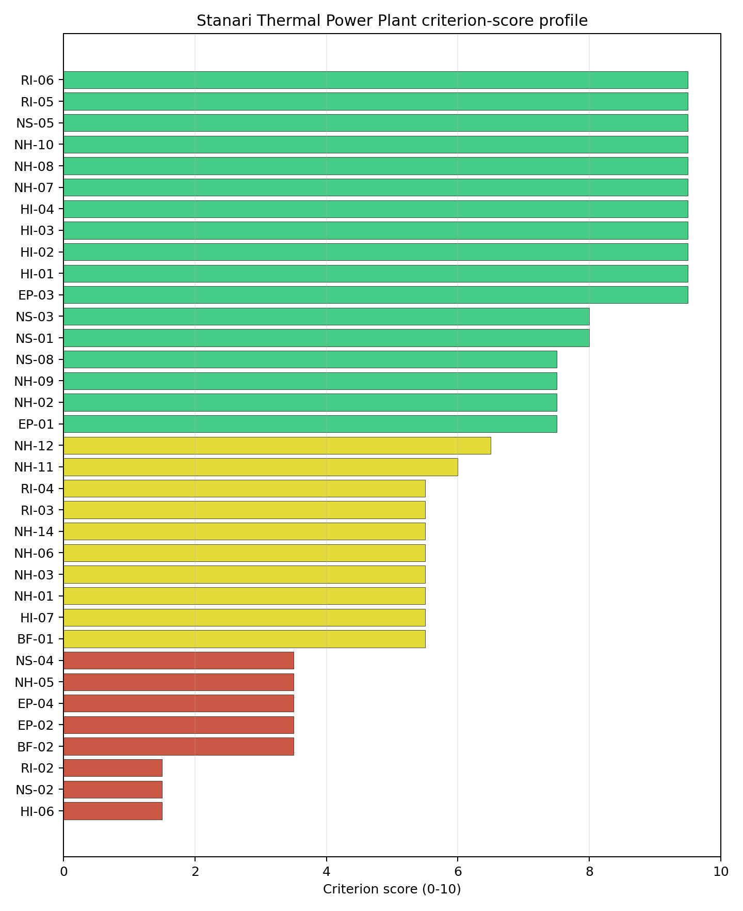

# Stanari Thermal Power Plant Site Profile

Stanari Thermal Power Plant is a coal/thermal site in Bosnia and Herzegovina that has been tested against the NuScale VOYGR-6 reference deployment envelope. This profile reads the screening evidence at a level that supports a decision to progress toward Stage 3 characterisation. It is not a site-suitability determination, vendor recommendation, or licensing finding.

## Site Snapshot

| Field | Value |
| --- | --- |
| Site name | Stanari Thermal Power Plant |
| Coordinates | 44.7539, 17.7924 |
| Subnational unit | Republika Srpska |
| Installed thermal capacity (source data) | 300 MW |
| Available surface area | 269.0 ha |
| Available surface area for development | 26.6 ha |
| Composite score (baseline weights) | 6.747 (6.028-7.237 MC band) |
| National stability band | A (top-10% hit rate 92%) |
| National rank | 1 |

_See the country status map in_ [Bosnia and Herzegovina Country Profile](../BA_country_prototype.md#country-status-map).

## Ownership and Coal-to-Nuclear Context

- **Stanari Investments Ltd** (100.00% share), headquartered in United Kingdom; immediate operator EFT Rudnik i Termoelektrana Stanari doo. Path: Stanari Investments Ltd -> EFT Rudnik i Termoelektrana Stanari doo [100.0%] -> Stanari Thermal Power Plant -- [100.0%]
- **natural person(s)** (share not specified); immediate operator EFT Rudnik i Termoelektrana Stanari doo. Path: natural person(s)  -> Stanari Investments Ltd [unknown %] -> EFT Rudnik i Termoelektrana Stanari doo [100.0%] -> Stanari Thermal Power Plant -- [100.0%]

Generating units on record: 1 operating.
Earliest unit commissioning: 2016; most recent: 2016.

## Natural Hazards (NH)

- **Seismic: Ground Motion (NH-01)** - score 5.5/10 (MC 5.0-6.0) - pass-mark band: At or below the score-5 risk boundary., weight 0.0455, data quality high. Evidence: PGA at 475-year return period 0.136 g; PGA at 2,475-year return period 0.284 g; Vs30 reference (m/s): 760.0.
- **Seismic: Surface Rupture (NH-02)** - score 7.5/10 (MC 7.0-8.0), weight n/a, data quality screening grade. Evidence: nearest mapped capable fault 29.9 km; fault slip rate 0.1 mm/yr; fault name: BACF005.
- **Geotechnical: Liquefaction (NH-03)** - score 5.5/10 (MC 5.0-6.0) - pass-mark band: Moderate susceptibility, or high/very-high with documented (or pending for `high`) mitigation., weight n/a, data quality medium. Evidence: liquefaction susceptibility: moderate; dominant soil type: clay_loam.
- **Geotechnical: Slope Stability (NH-04)** - score no native score (unscored - no band matched), weight n/a, data quality screening grade. Evidence: not measured at this site (criterion remains unscored).
- **Geotechnical: Subsidence (NH-05)** - score 3.5/10 (MC 3.0-4.0), weight 0.0354, data quality medium. Evidence: karst present: no; karst severity: none.
- **Geotechnical: Foundation (NH-06)** - score 5.5/10 (MC 5.0-6.0) - pass-mark band: Typical European mixed conditions (bearing 80-150 kPa)., weight 0.0253, data quality medium. Evidence: bearing capacity 88.7 kPa; depth to bedrock 21.4 m.
- **Volcanism (NH-07)** - score 9.5/10 (MC 9.0-10.0) - favourable: Very strong margin above the score-5 boundary (or connector confirmed no in-radius signal)., weight n/a, data quality high. Evidence: volcanic hazard class: negligible.
- **Coastal Flooding (NH-08)** - score 9.5/10 (MC 9.0-10.0) - favourable: Non-coastal OR elevation >= 50 m AMSL OR landlocked country, with no positive marine-hazard signal., weight 0.0303, data quality medium. Evidence: distance to coast 167.2 km.
- **River Flooding (NH-09)** - score 7.5/10 (MC 7.0-8.0), weight 0.0404, data quality medium. Evidence: flood zone class: negligible.
- **Extreme Winds (NH-10)** - score 9.5/10 (MC 9.0-10.0) - favourable: Lowest relative wind exposure in the current reanalysis-grade monthly-mean gust cohort (< 7.5 m/s)., weight 0.0152, data quality medium. Evidence: screening wind-speed index 6.12 m/s.
- **Extreme Precipitation (NH-11)** - score 6.0/10 (MC 5.0-6.0) - pass-mark band: aggregated(mean_of_sub_scores), weight 0.0152, data quality medium. Evidence: screening extreme-precipitation index 0.31 mm; screening precipitation index 34.5 mm/yr.
- **Extreme Temperatures (NH-12)** - score 6.5/10 (MC 6.0-7.0) - pass-mark band: aggregated(mean_of_sub_scores), weight 0.0202, data quality medium. Evidence: extreme high temperature 24.7 deg C; extreme low temperature -4.96 deg C.
- **Combined Hazards (NH-14)** - score 5.5/10 (MC 5.0-6.0) - pass-mark band: At least 5 resolved, exactly one moderate hazard (3-5) or moderate interaction only., weight 0.0152, data quality n/a. Evidence: values not in measurement tables.

### Interpretation - Natural Hazards (NH)

Natural hazards at Stanari Thermal Power Plant support an avoidance-flagged Stage 3 screening case rather than an unqualified site-selection conclusion. The measured record includes volcanic hazard class: negligible; distance to coast 167.2 km; karst present: no; karst severity: none. The strongest evidence is Volcanism (NH-07) at 9.5/10, Coastal Flooding (NH-08) at 9.5/10, while the limiting criteria are Geotechnical: Subsidence (NH-05) at 3.5/10, Geotechnical: Slope Stability (NH-04) at 5.0/10, Seismic: Ground Motion (NH-01) at 5.5/10. Those limitations do not establish a licensing or suitability finding; they define the work that must be closed before the site can be treated as equivalent to a full-pass candidate. Stage 3 should therefore prioritise seismic, geotechnical, flood and meteorological confirmation, with the lowest-scoring and avoidance-flagged criteria measured first.

## Human-Induced and Security-Relevant Hazards (HI)

- **Aircraft Crash (HI-01)** - score 9.5/10 (MC 9.0-10.0) - favourable: Only small / GA / heliport airport >= 10 km nearby, no flight-path proxy < 4 km, no major airport within 30 km, and no military airbase within 60 km., weight 0.0354, data quality high. Evidence: nearest airport 33.5 km; nearest flight path 16.7 km; airports within search radius 0; airport name: Koprivna Begovac Airfield; airport type: small airfield.
- **Industrial Explosions (HI-02)** - score 9.5/10 (MC 9.0-10.0) - favourable: Very strong margin above the score-5 boundary (or completed search confirmed no in-radius signal)., weight 0.0354, data quality screening grade. Evidence: values not in measurement tables.
- **Toxic/Gas Releases (HI-03)** - score 9.5/10 (MC 9.0-10.0) - favourable: Very strong margin above the score-5 boundary (or completed search confirmed no in-radius signal)., weight 0.0354, data quality screening grade. Evidence: values not in measurement tables.
- **External Fires (HI-04)** - score 9.5/10 (MC 9.0-10.0) - favourable: > 15 km, or completed flammable-storage search found nothing in radius., weight 0.0303, data quality screening grade. Evidence: values not in measurement tables.
- **Military Installations (HI-06)** - score 1.5/10 (MC 1.0-2.0), weight 0.0303, data quality medium. Evidence: nearest military installation 10.5 km; military installations within radius 7; installation name: unnamed.
- **Electromagnetic Interference (HI-07)** - score 5.5/10 (MC 5.0-6.0) - pass-mark band: Scoreable ordinary RF environment from count/proximity evidence; power-class-specific severity deferred., weight 0.0101, data quality medium. Evidence: nearest high-power transmitter 16.4 km; transmitters within radius 18; transmitter type: minaret.

### Interpretation - Human-Induced and Security-Relevant Hazards (HI)

Human-induced and security-relevant hazards at Stanari Thermal Power Plant support an avoidance-flagged Stage 3 screening case rather than an unqualified site-selection conclusion. The measured record includes nearest airport 33.5 km; nearest flight path 16.7 km; nearest military installation 10.5 km; military installations within radius 7. The strongest evidence is Aircraft Crash (HI-01) at 9.5/10, Industrial Explosions (HI-02) at 9.5/10, while the limiting criteria are Military Installations (HI-06) at 1.5/10, Electromagnetic Interference (HI-07) at 5.5/10, Aircraft Crash (HI-01) at 9.5/10. Those limitations do not establish a licensing or suitability finding; they define the work that must be closed before the site can be treated as equivalent to a full-pass candidate. Stage 3 should therefore prioritise aviation, military, industrial-neighbour and electromagnetic-interference checks, with the lowest-scoring and avoidance-flagged criteria measured first.

## Radiological Impact and Emergency Planning (RI / EP)

- **Emergency Planning Feasibility (EP-01)** - score 7.5/10 (MC 7.0-8.0), weight n/a, data quality high. Evidence: EP feasibility composite 70.1 /100; road sub-score 49.4 /100; special-population sub-score 90.0 /100; geography sub-score 95.0 /100; population sub-score 95.0 /100; evacuation feasible: yes.
- **Evacuation Routes (EP-02)** - score 3.5/10 (MC 3.0-4.0), weight 0.0303, data quality medium. Evidence: road density in EPZ 0.457 km/km2; road length in EPZ 897.0 km; motorway access: yes.
- **Physical Geography Constraints (EP-03)** - score 9.5/10 (MC 9.0-10.0) - favourable: No measured relief; open river/waterway context (interim screening)., weight 0.0253, data quality medium. Evidence: waterways crossing EPZ 0; major river barrier: no.
- **Special Populations (EP-04)** - score 3.5/10 (MC 3.0-4.0), weight 0.0303, data quality medium. Evidence: hospitals in EPZ 26; prisons in EPZ 0; care homes in EPZ 0.
- **Atmospheric Dispersion (RI-01)** - score no native score (unscored - no band matched), weight 0.0303, data quality medium. Evidence: annual mean wind speed 0.5 m/s; atmospheric mixing height 394.6 m; prevailing wind direction: SSW.
- **Surface Water Dispersion (RI-02)** - score 1.5/10 (MC 1.0-2.0), weight 0.0253, data quality n/a. Evidence: values not in measurement tables.
- **Groundwater Dispersion (RI-03)** - score 5.5/10 (MC 5.0-6.0) - pass-mark band: Moderate-permeability aquifer screening proxy., weight 0.0253, data quality medium. Evidence: aquifer type: sedimentary sands.
- **Population Density at EPZ Radii (RI-04)** - score 5.5/10 (MC 5.0-6.0) - pass-mark band: aggregated(min_of_sub_scores), weight 0.0404, data quality screening grade. Evidence: population density within 5 km 51.5 /km2; population density within 16 km 52.5 /km2; population density within 25 km 86.6 /km2; population density within 80 km 85.1 /km2; population within 25 km 170,016 people.
- **Distance to Population Centres (RI-05)** - score 9.5/10 (MC 9.0-10.0) - favourable: No >=50k population-centre proxy within screening envelope., weight 0.0505, data quality screening grade. Evidence: values not in measurement tables.
- **Population Projections (RI-06)** - score 9.5/10 (MC 9.0-10.0) - favourable: Declining (< -0.5 %/yr)., weight 0.0253, data quality screening grade. Evidence: annual population growth rate -1.266 %/yr; projected population at 25 km in 60 yr 93,305 people.

### Interpretation - Radiological Impact and Emergency Planning (RI / EP)

Radiological impact and emergency planning at Stanari Thermal Power Plant support an avoidance-flagged Stage 3 screening case rather than an unqualified site-selection conclusion. The measured record includes waterways crossing EPZ 0; major river barrier: no; road density in EPZ 0.457 km/km2; road length in EPZ 897.0 km. The strongest evidence is Physical Geography Constraints (EP-03) at 9.5/10, Distance to Population Centres (RI-05) at 9.5/10, while the limiting criteria are Surface Water Dispersion (RI-02) at 1.5/10, Evacuation Routes (EP-02) at 3.5/10, Special Populations (EP-04) at 3.5/10. Those limitations do not establish a licensing or suitability finding; they define the work that must be closed before the site can be treated as equivalent to a full-pass candidate. Stage 3 should therefore prioritise EPZ evacuation, population, atmospheric and water-pathway modelling, with the lowest-scoring and avoidance-flagged criteria measured first.

## Non-Safety and Implementation Considerations (NS)

- **Grid Capacity Basic Filter (BF-01)** - score 5.5/10 (MC 5.0-6.0) - pass-mark band: Note: substation 15-30 km OR 110-219 kV; reinforcement plausible., weight n/a, data quality n/a. Evidence: values not in measurement tables.
- **Land Area Basic Filter (BF-02)** - score 3.5/10 (MC 3.0-4.0), weight 0.0253, data quality n/a. Evidence: values not in measurement tables.
- **Cooling Water Availability (NS-01)** - score 8.0/10 (MC 7.0-8.0) - favourable: aggregated(weighted_mean_of_sub_scores), weight 0.0404, data quality screening grade. Evidence: distance to cooling source 4.1 km; cooling source flow 6.98 m3/s; cooling source type: river; cooling source name: Ostružnja; water stress label: Low.
- **Grid Connection (NS-02)** - score 1.5/10 (MC 1.0-2.0), weight 0.0404, data quality medium. Evidence: nearest substation 0.29 km; nearest high-voltage line 10.9 km; highest nearby line voltage 400.0 kV; grid export capacity 300.0 MW; substations within radius 49; HV lines within radius 25.
- **Transport Access (NS-03)** - score 8.0/10 (MC 6.0-9.0) - favourable: aggregated(weighted_mean_of_sub_scores), weight 0.0404, data quality low. Evidence: nearest highway 7.77 km; nearest rail line 1.55 km; heavy-haul capable: yes.
- **Site Topography (NS-04)** - score 3.5/10 (MC 3.0-4.0), weight 0.0303, data quality screening grade. Evidence: favourable land cover 24.4 %; moderate land cover 35.9 %; unfavourable land cover 39.7 %; favourable area 53.8 ha; dominant land class: 311.
- **Site Footprint Adequacy (NS-05)** - score 9.5/10 (MC 9.0-10.0) - favourable: Very strong margin above the score-5 boundary., weight 0.0253, data quality high. Evidence: buildable area 26.6 ha; largest contiguous patch 26.6 ha; buildable patch count 19.
- **Existing Infrastructure (NS-06)** - score no native score (unscored - no band matched), weight 0.0253, data quality n/a. Evidence: not measured at this site (criterion remains unscored).
- **Ecological Sensitivity (NS-08)** - score 7.5/10 (MC 5.5-9.5), weight n/a, data quality insufficient. Evidence: natural land cover 39.7 %; Natura 2000 sensitivity class: unknown; protected-area overlap: no; protected-area sensitivity class: none; Natura 2000 sites within 5 km: 0.
- **Workforce Availability (NS-10)** - score no native score (unscored - no band matched), weight 0.0202, data quality n/a. Evidence: not measured at this site (criterion remains unscored).
- **Regulatory/Political Environment (NS-12)** - score no native score (unscored - no band matched), weight 0.0303, data quality n/a. Evidence: not measured at this site (criterion remains unscored).
- **Construction Logistics (NS-13)** - score no native score (unscored - no band matched), weight 0.0202, data quality n/a. Evidence: not measured at this site (criterion remains unscored).

### Interpretation - Non-Safety and Implementation Considerations (NS)

Non-safety and implementation conditions at Stanari Thermal Power Plant support an avoidance-flagged Stage 3 screening case rather than an unqualified site-selection conclusion. The measured record includes buildable area 26.6 ha; largest contiguous patch 26.6 ha; distance to cooling source 4.1 km; cooling source flow 6.98 m3/s. The strongest evidence is Site Footprint Adequacy (NS-05) at 9.5/10, Cooling Water Availability (NS-01) at 8.0/10, while the limiting criteria are Grid Connection (NS-02) at 1.5/10, Land Area Basic Filter (BF-02) at 3.5/10, Site Topography (NS-04) at 3.5/10. Those limitations do not establish a licensing or suitability finding; they define the work that must be closed before the site can be treated as equivalent to a full-pass candidate. Stage 3 should therefore prioritise grid, cooling-water, transport, land and environmental-permitting checks, with the lowest-scoring and avoidance-flagged criteria measured first.

## Composite Score and Stability

Baseline composite score is 6.747, bracketed by Monte Carlo at 6.028-7.237. National stability band is `A` with a top-10% hit rate of 92% in the project's 50,000-iteration national sensitivity analysis.

Stanari Thermal Power Plant's baseline composite score is 6.747, with a national Monte Carlo bracket of 6.028-7.237 and national rank 1. Its national stability band is A, with a 91.7% national top-10 hit rate in the project's 50,000-iteration national sensitivity analysis; this indicates a robust national lead under the weight perturbations considered. The composite is supported most by HI 7.90, RI 7.64, while the lowest family scores are NS 5.96, EP 5.26. Stage 3 effort should narrow the uncertainty around the avoidance flags first, because those criteria determine whether the ranking can become a progression case rather than only a screened shortlist position.

## Residual Risk Register

| Concern | Evidence | Consequence | Stage 3 action | Owner discipline |
| --- | --- | --- | --- | --- |
| Grid Connection (NS-02) | nearest substation 0.29 km; nearest high-voltage line 10.9 km | Grid reinforcement or voltage-path uncertainty could delay a bankable connection case. | Confirm transmission corridor, voltage pathway and export-capacity reinforcement requirements | grid |
| Military Installations (HI-06) | nearest military installation 10.5 km; military installations within radius 7 | Security or external-event separation could require programme-level stakeholder review. | Engage defence stakeholders on feature classification and security standoff | security |
| Surface Water Dispersion (RI-02) | No measured value beyond the screening score is available in the bundle | Dose-pathway confidence remains constrained until site-specific dispersion evidence is measured. | Quantify surface-water dilution and downstream receptor pathways | hydrology |
| Land Area Basic Filter (BF-02) | No measured value beyond the screening score is available in the bundle | Implementation confidence remains limited until measured project evidence replaces screening proxies. | Re-measure BF-02 with site-specific Stage 3 evidence | socioeconomic |
| Evacuation Routes (EP-02) | road density in EPZ 0.457 km/km2; road length in EPZ 897.0 km | Emergency-planning clearance time or logistics could limit the usable siting envelope. | Model EPZ time-to-clear under seasonal and peak-load conditions | emergency planning |
| Special Populations (EP-04) | hospitals in EPZ 26; prisons in EPZ 0 | Emergency-planning clearance time or logistics could limit the usable siting envelope. | Re-measure EP-04 with site-specific Stage 3 evidence | emergency planning |

Grid Connection (NS-02), Military Installations (HI-06), Surface Water Dispersion (RI-02) dominate the residual-risk register because they either keep the site in the avoidance-flag pool or carry the weakest measured screening scores. The register is a Stage 3 work plan for an avoidance-flagged candidate, not a site-approval finding.

## Stage 3 Follow-Up Checklist

| Priority | Work item | Evidence driver | Owner discipline |
| ---: | --- | --- | --- |
| 1 | Confirm transmission corridor, voltage pathway and export-capacity reinforcement requirements | Grid Connection (NS-02): nearest substation 0.29 km | grid |
| 2 | Engage defence stakeholders on feature classification and security standoff | Military Installations (HI-06): nearest military installation 10.5 km | security |
| 3 | Quantify surface-water dilution and downstream receptor pathways | Surface Water Dispersion (RI-02): screening score 1.5/10 | hydrology |
| 4 | Re-measure BF-02 with site-specific Stage 3 evidence | Land Area Basic Filter (BF-02): screening score 3.5/10 | socioeconomic |
| 5 | Model EPZ time-to-clear under seasonal and peak-load conditions | Evacuation Routes (EP-02): road density in EPZ 0.457 km/km2 | emergency planning |
| 6 | Re-measure EP-04 with site-specific Stage 3 evidence | Special Populations (EP-04): hospitals in EPZ 26 | emergency planning |

## Evidence Limitations

- Transport Access (NS-03) - quality `low`.
