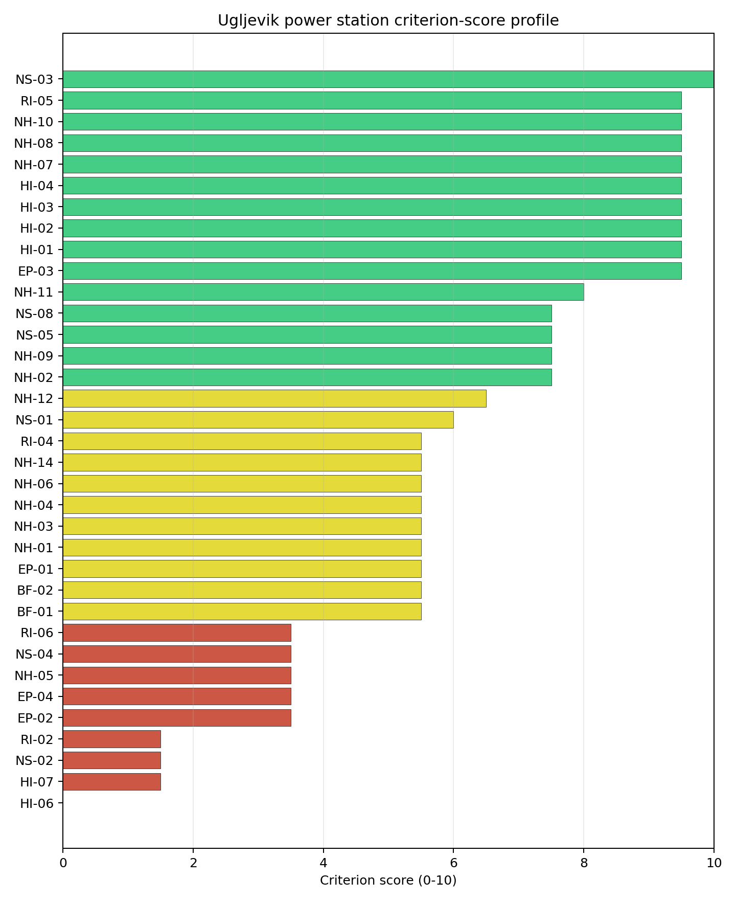
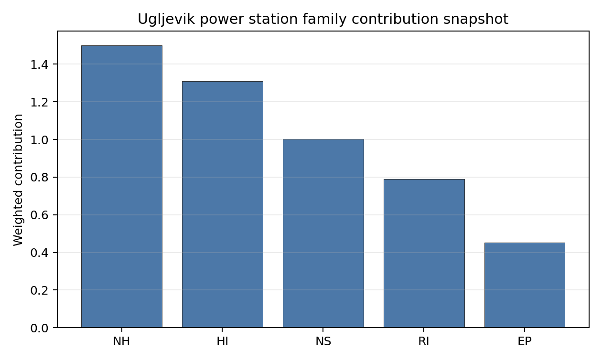

# Ugljevik power station Site Profile

Ugljevik power station is a coal/thermal site in Bosnia and Herzegovina that has been tested against the NuScale VOYGR-6 reference deployment envelope. This profile reads the screening evidence at a level that supports a decision to progress toward Stage 3 characterisation. It is not a site-suitability determination, vendor recommendation, or licensing finding.

## Site Snapshot

| Field | Value |
| --- | --- |
| Site name | Ugljevik power station |
| Coordinates | 44.6834, 18.9685 |
| Subnational unit | Republika Srpska |
| Installed thermal capacity (source data) | 1,000 MW |
| Available surface area | 47.1 ha |
| Available surface area for development | 47.1 ha |
| Composite score (baseline weights) | 6.458 (5.707-6.929 MC band) |
| National stability band | H (top-10% hit rate 0%) |
| National rank | 4 |

_See the country status map in_ [Bosnia and Herzegovina Country Profile](../BA_country_prototype.md#country-status-map).

## Ownership and Coal-to-Nuclear Context

- **Elektroprivreda Republike Srpske AD** (share not specified), headquartered in Bosnia and Herzegovina; immediate operator Rudnik i Termoelektrana Ugljevik AD. Path: Elektroprivreda Republike Srpske AD -> Rudnik i Termoelektrana Ugljevik AD [unknown %] -> Ugljevik power station Unit 1 [100.0%]
- **Rudnik i Termoelektrana Ugljevik AD** (10.00% share), headquartered in Bosnia and Herzegovina; immediate operator Comsar Energy Republika Sprska doo. Path: Rudnik i Termoelektrana Ugljevik AD -> Comsar Energy Republika Sprska doo [10.0%] -> Ugljevik power station Expansion Unit 1 [100.0%]
- **Comsar Energy Group** (90.00% share), headquartered in Bosnia and Herzegovina; immediate operator Comsar Energy Republika Sprska doo. Path: Comsar Energy Group  -> Comsar Energy Republika Sprska doo [90.0%] -> Ugljevik power station Expansion Unit 1 [100.0%]
- **Republika Srpska (Bosnia and Herzegovina)** (share not specified), headquartered in Bosnia and Herzegovina; immediate operator Rudnik i Termoelektrana Ugljevik AD. Path: Republika Srpska (Bosnia and Herzegovina)  -> Elektroprivreda Republike Srpske AD [100.0%] -> Rudnik i Termoelektrana Ugljevik AD [unknown %] -> Ugljevik power station Unit 1 [100.0%]

Generating units on record: 1 operating, 2 pre_permit.
Earliest unit commissioning: 1985; most recent: 1985.

## Natural Hazards (NH)

- **Seismic: Ground Motion (NH-01)** - score 5.5/10 (MC 5.0-6.0) - pass-mark band: At or below the score-5 risk boundary., weight 0.0455, data quality high. Evidence: PGA at 475-year return period 0.117 g; PGA at 2,475-year return period 0.259 g; Vs30 reference (m/s): 760.0.
- **Seismic: Surface Rupture (NH-02)** - score 7.5/10 (MC 7.0-8.0), weight n/a, data quality screening grade. Evidence: nearest mapped capable fault 29.9 km; fault slip rate 0.1 mm/yr; fault name: BACF007.
- **Geotechnical: Liquefaction (NH-03)** - score 5.5/10 (MC 5.0-6.0) - pass-mark band: Moderate susceptibility, or high/very-high with documented (or pending for `high`) mitigation., weight n/a, data quality medium. Evidence: liquefaction susceptibility: moderate; dominant soil type: clay_loam.
- **Geotechnical: Slope Stability (NH-04)** - score 5.5/10 (MC 5.0-6.0) - pass-mark band: At or below the score-5 risk boundary., weight n/a, data quality screening grade. Evidence: site slope 13.0 deg; max slope in 1 km box 86.2 deg; slope stability class: steep.
- **Geotechnical: Subsidence (NH-05)** - score 3.5/10 (MC 3.0-4.0), weight 0.0354, data quality medium. Evidence: karst present: no; karst severity: none.
- **Geotechnical: Foundation (NH-06)** - score 5.5/10 (MC 5.0-6.0) - pass-mark band: Typical European mixed conditions (bearing 80-150 kPa)., weight 0.0253, data quality medium. Evidence: bearing capacity 88.0 kPa; depth to bedrock 18.1 m.
- **Volcanism (NH-07)** - score 9.5/10 (MC 9.0-10.0) - favourable: Very strong margin above the score-5 boundary (or connector confirmed no in-radius signal)., weight n/a, data quality high. Evidence: volcanic hazard class: negligible.
- **Coastal Flooding (NH-08)** - score 9.5/10 (MC 9.0-10.0) - favourable: Non-coastal OR elevation >= 50 m AMSL OR landlocked country, with no positive marine-hazard signal., weight 0.0303, data quality medium. Evidence: distance to coast 218.4 km.
- **River Flooding (NH-09)** - score 7.5/10 (MC 7.0-8.0), weight 0.0404, data quality medium. Evidence: flood zone class: negligible.
- **Extreme Winds (NH-10)** - score 9.5/10 (MC 9.0-10.0) - favourable: Lowest relative wind exposure in the current reanalysis-grade monthly-mean gust cohort (< 7.5 m/s)., weight 0.0152, data quality medium. Evidence: screening wind-speed index 6.35 m/s.
- **Extreme Precipitation (NH-11)** - score 8.0/10 (MC 7.0-8.0) - favourable: aggregated(mean_of_sub_scores), weight 0.0152, data quality medium. Evidence: screening extreme-precipitation index 0.26 mm; screening precipitation index 27.5 mm/yr.
- **Extreme Temperatures (NH-12)** - score 6.5/10 (MC 6.0-7.0) - pass-mark band: aggregated(mean_of_sub_scores), weight 0.0202, data quality medium. Evidence: extreme high temperature 25.4 deg C; extreme low temperature -5.88 deg C.
- **Combined Hazards (NH-14)** - score 5.5/10 (MC 5.0-6.0) - pass-mark band: At least 5 resolved, exactly one moderate hazard (3-5) or moderate interaction only., weight 0.0152, data quality n/a. Evidence: values not in measurement tables.

### Interpretation - Natural Hazards (NH)

Natural hazards at Ugljevik power station support an avoidance-flagged Stage 3 screening case rather than an unqualified site-selection conclusion. The measured record includes volcanic hazard class: negligible; distance to coast 218.4 km; karst present: no; karst severity: none. The strongest evidence is Volcanism (NH-07) at 9.5/10, Coastal Flooding (NH-08) at 9.5/10, while the limiting criteria are Geotechnical: Subsidence (NH-05) at 3.5/10, Seismic: Ground Motion (NH-01) at 5.5/10, Geotechnical: Liquefaction (NH-03) at 5.5/10. Those limitations do not establish a licensing or suitability finding; they define the work that must be closed before the site can be treated as equivalent to a full-pass candidate. Stage 3 should therefore prioritise seismic, geotechnical, flood and meteorological confirmation, with the lowest-scoring and avoidance-flagged criteria measured first.

## Human-Induced and Security-Relevant Hazards (HI)

- **Aircraft Crash (HI-01)** - score 9.5/10 (MC 9.0-10.0) - favourable: Only small / GA / heliport airport >= 10 km nearby, no flight-path proxy < 4 km, no major airport within 30 km, and no military airbase within 60 km., weight 0.0354, data quality high. Evidence: nearest airport 12.8 km; nearest flight path 6.39 km; airports within search radius 4; airport name: Dragon Airfield; airport type: small airfield.
- **Industrial Explosions (HI-02)** - score 9.5/10 (MC 9.0-10.0) - favourable: Very strong margin above the score-5 boundary (or completed search confirmed no in-radius signal)., weight 0.0354, data quality screening grade. Evidence: values not in measurement tables.
- **Toxic/Gas Releases (HI-03)** - score 9.5/10 (MC 9.0-10.0) - favourable: Very strong margin above the score-5 boundary (or completed search confirmed no in-radius signal)., weight 0.0354, data quality screening grade. Evidence: values not in measurement tables.
- **External Fires (HI-04)** - score 9.5/10 (MC 9.0-10.0) - favourable: > 15 km, or completed flammable-storage search found nothing in radius., weight 0.0303, data quality screening grade. Evidence: values not in measurement tables.
- **Military Installations (HI-06)** - score 0.0/10 (MC 0.0-0.0), weight 0.0303, data quality high. Evidence: nearest military installation 2.48 km; military installations within radius 11; installation name: unnamed.
- **Electromagnetic Interference (HI-07)** - score 1.5/10 (MC 1.0-2.0), weight 0.0101, data quality medium. Evidence: nearest high-power transmitter 0.4 km; transmitters within radius 29; transmitter type: mast.

### Interpretation - Human-Induced and Security-Relevant Hazards (HI)

Human-induced and security-relevant hazards at Ugljevik power station support an avoidance-flagged Stage 3 screening case rather than an unqualified site-selection conclusion. The measured record includes nearest airport 12.8 km; nearest flight path 6.39 km; nearest military installation 2.48 km; military installations within radius 11. The strongest evidence is Aircraft Crash (HI-01) at 9.5/10, Industrial Explosions (HI-02) at 9.5/10, while the limiting criteria are Military Installations (HI-06) at 0.0/10, Electromagnetic Interference (HI-07) at 1.5/10, Aircraft Crash (HI-01) at 9.5/10. Those limitations do not establish a licensing or suitability finding; they define the work that must be closed before the site can be treated as equivalent to a full-pass candidate. Stage 3 should therefore prioritise aviation, military, industrial-neighbour and electromagnetic-interference checks, with the lowest-scoring and avoidance-flagged criteria measured first.

## Radiological Impact and Emergency Planning (RI / EP)

- **Emergency Planning Feasibility (EP-01)** - score 5.5/10 (MC 5.0-6.0) - pass-mark band: At or above the composite score-5 boundary., weight n/a, data quality high. Evidence: EP feasibility composite 64.8 /100; road sub-score 49.2 /100; special-population sub-score 90.0 /100; geography sub-score 95.0 /100; population sub-score 80.0 /100; evacuation feasible: yes.
- **Evacuation Routes (EP-02)** - score 3.5/10 (MC 3.0-4.0), weight 0.0303, data quality medium. Evidence: road density in EPZ 0.453 km/km2; road length in EPZ 890.2 km; motorway access: yes.
- **Physical Geography Constraints (EP-03)** - score 9.5/10 (MC 9.0-10.0) - favourable: No measured relief; open river/waterway context (interim screening)., weight 0.0253, data quality medium. Evidence: waterways crossing EPZ 0; major river barrier: no.
- **Special Populations (EP-04)** - score 3.5/10 (MC 3.0-4.0), weight 0.0303, data quality medium. Evidence: hospitals in EPZ 28; prisons in EPZ 2; care homes in EPZ 0.
- **Atmospheric Dispersion (RI-01)** - score no native score (unscored - no band matched), weight 0.0303, data quality medium. Evidence: annual mean wind speed 0.6 m/s; atmospheric mixing height 429.2 m; prevailing wind direction: W.
- **Surface Water Dispersion (RI-02)** - score 1.5/10 (MC 1.0-2.0), weight 0.0253, data quality n/a. Evidence: values not in measurement tables.
- **Groundwater Dispersion (RI-03)** - score no native score (unscored - no band matched), weight 0.0253, data quality low. Evidence: not measured at this site (criterion remains unscored).
- **Population Density at EPZ Radii (RI-04)** - score 5.5/10 (MC 5.0-6.0) - pass-mark band: aggregated(min_of_sub_scores), weight 0.0404, data quality screening grade. Evidence: population density within 5 km 116.7 /km2; population density within 16 km 68.3 /km2; population density within 25 km 128.0 /km2; population density within 80 km 87.2 /km2; population within 25 km 251,241 people.
- **Distance to Population Centres (RI-05)** - score 9.5/10 (MC 9.0-10.0) - favourable: Nearest >=50k population-centre proxy exceeds required distance by >= 50 %., weight 0.0505, data quality screening grade. Evidence: nearest city above 50k people 95.9 km; nearest city population 92,966 people; city name: Osijek.
- **Population Projections (RI-06)** - score 3.5/10 (MC 3.0-4.0), weight 0.0253, data quality screening grade. Evidence: annual population growth rate 0.482 %/yr; projected population at 25 km in 60 yr 137,878 people.

### Interpretation - Radiological Impact and Emergency Planning (RI / EP)

Radiological impact and emergency planning at Ugljevik power station support an avoidance-flagged Stage 3 screening case rather than an unqualified site-selection conclusion. The measured record includes waterways crossing EPZ 0; major river barrier: no; nearest city above 50k people 95.9 km; nearest city population 92,966 people. The strongest evidence is Physical Geography Constraints (EP-03) at 9.5/10, Distance to Population Centres (RI-05) at 9.5/10, while the limiting criteria are Surface Water Dispersion (RI-02) at 1.5/10, Evacuation Routes (EP-02) at 3.5/10, Special Populations (EP-04) at 3.5/10. Those limitations do not establish a licensing or suitability finding; they define the work that must be closed before the site can be treated as equivalent to a full-pass candidate. Stage 3 should therefore prioritise EPZ evacuation, population, atmospheric and water-pathway modelling, with the lowest-scoring and avoidance-flagged criteria measured first.

## Non-Safety and Implementation Considerations (NS)

- **Grid Capacity Basic Filter (BF-01)** - score 5.5/10 (MC 5.0-6.0) - pass-mark band: Note: substation 15-30 km OR 110-219 kV; reinforcement plausible., weight n/a, data quality n/a. Evidence: values not in measurement tables.
- **Land Area Basic Filter (BF-02)** - score 5.5/10 (MC 5.0-6.0) - pass-mark band: 80-100% of required area with documented expansion / layout flexibility., weight 0.0253, data quality n/a. Evidence: values not in measurement tables.
- **Cooling Water Availability (NS-01)** - score 6.0/10 (MC 6.0-7.0) - pass-mark band: aggregated(weighted_mean_of_sub_scores), weight 0.0404, data quality screening grade. Evidence: distance to cooling source 9.17 km; cooling source flow 2.55 m3/s; cooling source type: small_river; cooling source name: Јања; water stress label: Low.
- **Grid Connection (NS-02)** - score 1.5/10 (MC 1.0-2.0), weight 0.0404, data quality high. Evidence: nearest substation 0.4 km; nearest high-voltage line 0.27 km; highest nearby line voltage 400.0 kV; grid export capacity 269.0 MW; substations within radius 44; HV lines within radius 52.
- **Transport Access (NS-03)** - score 10.0/10 (MC 8.0-10.0) - favourable: aggregated(weighted_mean_of_sub_scores), weight 0.0404, data quality low. Evidence: nearest highway 0.64 km; heavy-haul capable: yes.
- **Site Topography (NS-04)** - score 3.5/10 (MC 3.0-4.0), weight 0.0303, data quality screening grade. Evidence: favourable land cover 23.5 %; moderate land cover 26.5 %; unfavourable land cover 50.0 %; favourable area 40.6 ha; dominant land class: 311.
- **Site Footprint Adequacy (NS-05)** - score 7.5/10 (MC 7.0-8.0), weight 0.0253, data quality high. Evidence: buildable area 47.1 ha; largest contiguous patch 47.1 ha; buildable patch count 15.
- **Existing Infrastructure (NS-06)** - score no native score (unscored - no band matched), weight 0.0253, data quality n/a. Evidence: not measured at this site (criterion remains unscored).
- **Ecological Sensitivity (NS-08)** - score 7.5/10 (MC 5.5-9.5), weight n/a, data quality insufficient. Evidence: natural land cover 50.0 %; distance to nearest protected area 22.5 km; Natura 2000 sensitivity class: unknown; protected-area overlap: no; protected-area sensitivity class: low; Natura 2000 sites within 5 km: 0; nearest protected-area designation: Emerald Network.
- **Workforce Availability (NS-10)** - score no native score (unscored - no band matched), weight 0.0202, data quality n/a. Evidence: not measured at this site (criterion remains unscored).
- **Regulatory/Political Environment (NS-12)** - score no native score (unscored - no band matched), weight 0.0303, data quality n/a. Evidence: not measured at this site (criterion remains unscored).
- **Construction Logistics (NS-13)** - score no native score (unscored - no band matched), weight 0.0202, data quality n/a. Evidence: not measured at this site (criterion remains unscored).

### Interpretation - Non-Safety and Implementation Considerations (NS)

Non-safety and implementation conditions at Ugljevik power station support an avoidance-flagged Stage 3 screening case rather than an unqualified site-selection conclusion. The measured record includes nearest highway 0.64 km; heavy-haul capable: yes; buildable area 47.1 ha; largest contiguous patch 47.1 ha. The strongest evidence is Transport Access (NS-03) at 10.0/10, Site Footprint Adequacy (NS-05) at 7.5/10, while the limiting criteria are Grid Connection (NS-02) at 1.5/10, Site Topography (NS-04) at 3.5/10, Existing Infrastructure (NS-06) at 5.0/10. Those limitations do not establish a licensing or suitability finding; they define the work that must be closed before the site can be treated as equivalent to a full-pass candidate. Stage 3 should therefore prioritise grid, cooling-water, transport, land and environmental-permitting checks, with the lowest-scoring and avoidance-flagged criteria measured first.

## Composite Score and Stability

Baseline composite score is 6.458, bracketed by Monte Carlo at 5.707-6.929. National stability band is `H` with a top-10% hit rate of 0% in the project's 50,000-iteration national sensitivity analysis.

Ugljevik power station's baseline composite score is 6.458, with a national Monte Carlo bracket of 5.707-6.929 and national rank 4. Its national stability band is H, with a 0.0% national top-10 hit rate in the project's 50,000-iteration national sensitivity analysis; this indicates a fragile or weight-dependent shortlist position. The composite is supported most by HI 7.41, RI 6.80, while the lowest family scores are NS 5.67, EP 5.26. Stage 3 effort should narrow the uncertainty around the avoidance flags first, because those criteria determine whether the ranking can become a progression case rather than only a screened shortlist position.

## Residual Risk Register

| Concern | Evidence | Consequence | Stage 3 action | Owner discipline |
| --- | --- | --- | --- | --- |
| Grid Connection (NS-02) | nearest substation 0.4 km; nearest high-voltage line 0.27 km | Grid reinforcement or voltage-path uncertainty could delay a bankable connection case. | Confirm transmission corridor, voltage pathway and export-capacity reinforcement requirements | grid |
| Military Installations (HI-06) | nearest military installation 2.48 km; military installations within radius 11 | Security or external-event separation could require programme-level stakeholder review. | Engage defence stakeholders on feature classification and security standoff | security |
| Electromagnetic Interference (HI-07) | nearest high-power transmitter 0.4 km; transmitters within radius 29 | Security or external-event separation could require programme-level stakeholder review. | Re-measure HI-07 with site-specific Stage 3 evidence | security |
| Surface Water Dispersion (RI-02) | No measured value beyond the screening score is available in the bundle | Dose-pathway confidence remains constrained until site-specific dispersion evidence is measured. | Quantify surface-water dilution and downstream receptor pathways | hydrology |
| Evacuation Routes (EP-02) | road density in EPZ 0.453 km/km2; road length in EPZ 890.2 km | Emergency-planning clearance time or logistics could limit the usable siting envelope. | Model EPZ time-to-clear under seasonal and peak-load conditions | emergency planning |
| Special Populations (EP-04) | hospitals in EPZ 28; prisons in EPZ 2 | Emergency-planning clearance time or logistics could limit the usable siting envelope. | Re-measure EP-04 with site-specific Stage 3 evidence | emergency planning |

Grid Connection (NS-02), Military Installations (HI-06), Electromagnetic Interference (HI-07) dominate the residual-risk register because they either keep the site in the avoidance-flag pool or carry the weakest measured screening scores. The register is a Stage 3 work plan for an avoidance-flagged candidate, not a site-approval finding.

## Stage 3 Follow-Up Checklist

| Priority | Work item | Evidence driver | Owner discipline |
| ---: | --- | --- | --- |
| 1 | Confirm transmission corridor, voltage pathway and export-capacity reinforcement requirements | Grid Connection (NS-02): nearest substation 0.4 km | grid |
| 2 | Engage defence stakeholders on feature classification and security standoff | Military Installations (HI-06): nearest military installation 2.48 km | security |
| 3 | Re-measure HI-07 with site-specific Stage 3 evidence | Electromagnetic Interference (HI-07): nearest high-power transmitter 0.4 km | security |
| 4 | Quantify surface-water dilution and downstream receptor pathways | Surface Water Dispersion (RI-02): screening score 1.5/10 | hydrology |
| 5 | Model EPZ time-to-clear under seasonal and peak-load conditions | Evacuation Routes (EP-02): road density in EPZ 0.453 km/km2 | emergency planning |
| 6 | Re-measure EP-04 with site-specific Stage 3 evidence | Special Populations (EP-04): hospitals in EPZ 28 | emergency planning |

## Evidence Limitations

- Groundwater Dispersion (RI-03) - quality `low`.
- Transport Access (NS-03) - quality `low`.
