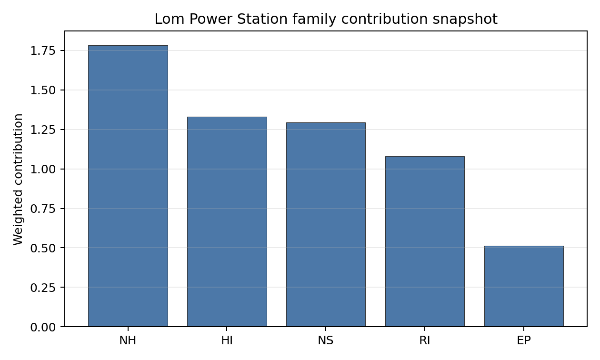

# Lom Power Station Site Profile

Lom Power Station is a coal/thermal site in Bulgaria that has been tested against the NuScale VOYGR-6 reference deployment envelope. This profile reads the screening evidence at a level that supports a decision to progress toward Stage 3 characterisation. It is not a site-suitability determination, vendor recommendation, or licensing finding.

## Site Snapshot

| Field | Value |
| --- | --- |
| Site name | Lom Power Station |
| Coordinates | 43.7825, 23.2175 |
| Subnational unit | Montana |
| Installed thermal capacity (source data) | 400 MW |
| Available surface area | 146.3 ha |
| Available surface area for development | 9.7 ha |
| Composite score (baseline weights) | 7.428 (6.578-7.850 MC band) |
| National stability band | A (top-10% hit rate 100%) |
| National rank | 1 |

_See the country status map in_ [Bulgaria Country Profile](../BG_country_prototype.md#country-status-map).

## Ownership and Coal-to-Nuclear Context

No ownership row is carried in the site bundle. Stage 3 should verify the controlling owner, land-control chain and operator status before any project-level conclusion.

Generating units on record: 1 cancelled.
Earliest unit commissioning: 2011; most recent: 2011.

## Natural Hazards (NH)

- **Seismic: Ground Motion (NH-01)** - score 7.5/10 (MC 7.0-8.0), weight 0.0455, data quality high. Evidence: PGA at 475-year return period 0.068 g; PGA at 2,475-year return period 0.135 g; Vs30 reference (m/s): 760.0.
- **Seismic: Surface Rupture (NH-02)** - score 7.5/10 (MC 7.0-8.0), weight n/a, data quality screening grade. Evidence: nearest mapped capable fault 22.3 km; fault slip rate 0.141 mm/yr; fault name: BGCF00M.
- **Geotechnical: Liquefaction (NH-03)** - score 9.5/10 (MC 9.0-10.0) - favourable: Negligible susceptibility (Stage 1 favourable default)., weight n/a, data quality medium. Evidence: liquefaction susceptibility: very_low; dominant soil type: silty_clay_loam.
- **Geotechnical: Slope Stability (NH-04)** - score no native score (unscored - no band matched), weight n/a, data quality screening grade. Evidence: not measured at this site (criterion remains unscored).
- **Geotechnical: Subsidence (NH-05)** - score 9.5/10 (MC 9.0-10.0) - favourable: No karst; mine-feature distance well above the score-5 pivot (or unknown)., weight 0.0354, data quality medium. Evidence: karst present: no; karst severity: none.
- **Geotechnical: Foundation (NH-06)** - score 5.5/10 (MC 5.0-6.0) - pass-mark band: Typical European mixed conditions (bearing 80-150 kPa)., weight 0.0253, data quality medium. Evidence: bearing capacity 92.0 kPa; depth to bedrock 22.9 m.
- **Volcanism (NH-07)** - score 9.5/10 (MC 9.0-10.0) - favourable: Very strong margin above the score-5 boundary (or screening evidence records no in-radius signal)., weight n/a, data quality high. Evidence: volcanic hazard class: negligible.
- **Coastal Flooding (NH-08)** - score 9.5/10 (MC 9.0-10.0) - favourable: Non-coastal OR elevation >= 50 m AMSL OR landlocked country, with no positive marine-hazard signal., weight 0.0303, data quality medium. Evidence: distance to coast 331.5 km.
- **River Flooding (NH-09)** - score 7.5/10 (MC 7.0-8.0), weight 0.0404, data quality medium. Evidence: flood zone class: negligible.
- **Extreme Winds (NH-10)** - score 7.5/10 (MC 7.0-8.0), weight 0.0152, data quality medium. Evidence: screening wind-speed index 7.61 m/s.
- **Extreme Precipitation (NH-11)** - score 10.0/10 (MC 9.0-10.0) - favourable: aggregated(mean_of_sub_scores), weight 0.0152, data quality medium. Evidence: screening extreme-precipitation index 0.16 mm; screening precipitation index 18.1 mm/yr.
- **Extreme Temperatures (NH-12)** - score 5.5/10 (MC 5.0-6.0) - pass-mark band: aggregated(mean_of_sub_scores), weight 0.0202, data quality medium. Evidence: extreme high temperature 29.0 deg C; extreme low temperature -5.45 deg C.
- **Combined Hazards (NH-14)** - score 9.5/10 (MC 9.0-10.0) - favourable: At least 5 underlying NH criteria resolved, all >= 7; no interaction pair below 7., weight 0.0152, data quality n/a. Evidence: values not in measurement tables.

### Interpretation - Natural Hazards (NH)

Natural hazards at Lom are favourable overall, with low to moderate seismic demand and no standing exclusionary natural-hazard trigger in the screening evidence. The 475-year PGA is 0.068 g and the 2,475-year PGA is 0.135 g, while the nearest mapped capable fault is 22.3 km away. Liquefaction susceptibility is very low, karst is not present, and the foundation proxy records 92.0 kPa bearing capacity with 22.9 m depth to bedrock. Coastal exposure is remote at 331.5 km, the flood-zone class is negligible, and the 50-year screening wind-speed index is 7.61 m/s. The main limitations are that Slope Stability (NH-04) remains unscored and the precipitation values are screening-grade. Stage 3 should confirm slope, precipitation and geotechnical inputs before hardening the design-basis envelope.

## Human-Induced and Security-Relevant Hazards (HI)

- **Aircraft Crash (HI-01)** - score 9.5/10 (MC 9.0-10.0) - favourable: Only small / GA / heliport airport >= 10 km nearby, no flight-path proxy < 4 km, no major airport within 30 km, and no military airbase within 60 km., weight 0.0354, data quality high. Evidence: nearest airport 32.3 km; nearest flight path 16.1 km; airports within search radius 0; airport name: Erden Airfield; airport type: small airfield.
- **Industrial Explosions (HI-02)** - score 9.5/10 (MC 9.0-10.0) - favourable: Very strong margin above the score-5 boundary (or no in-radius signal is recorded)., weight 0.0354, data quality medium. Evidence: values not in measurement tables.
- **Toxic/Gas Releases (HI-03)** - score 9.5/10 (MC 9.0-10.0) - favourable: Very strong margin above the score-5 boundary (or no in-radius signal is recorded)., weight 0.0354, data quality medium. Evidence: values not in measurement tables.
- **External Fires (HI-04)** - score 9.5/10 (MC 9.0-10.0) - favourable: > 15 km, or no flammable-storage signal is recorded in radius., weight 0.0303, data quality medium. Evidence: values not in measurement tables.
- **Military Installations (HI-06)** - score 0.0/10 (MC 0.0-0.0), weight 0.0303, data quality high. Evidence: nearest military installation 3.87 km; military installations within radius 2; installation name: unnamed.
- **Electromagnetic Interference (HI-07)** - score 3.5/10 (MC 3.0-4.0), weight 0.0101, data quality medium. Evidence: nearest high-power transmitter 4.1 km; transmitters within radius 18; transmitter type: tower.

### Interpretation - Human-Induced and Security-Relevant Hazards (HI)

Human-induced hazards at Lom are strong for aviation and industrial-neighbour screening, but weak on military-installation and electromagnetic-interference evidence. Aircraft Crash (HI-01) is favourable: the nearest small airport is 32.3 km away and the nearest flight-path proxy is 16.1 km away. Industrial Explosions (HI-02), Toxic/Gas Releases (HI-03) and External Fires (HI-04) carry favourable scores because no nearby positive hazard signal is recorded in the screening evidence. The binding issue is Military Installations (HI-06), with the nearest feature 3.87 km away and two features within the search radius, producing a 0.0/10 score. Electromagnetic Interference (HI-07) also requires review, with the nearest transmitter at 4.1 km and 18 transmitters in radius. Stage 3 should begin with defence-feature classification and an RF/EMI field survey.

## Radiological Impact and Emergency Planning (RI / EP)

- **Emergency Planning Feasibility (EP-01)** - score 5.5/10 (MC 5.0-6.0) - pass-mark band: At or above the composite score-5 boundary., weight n/a, data quality high. Evidence: EP feasibility composite 58.3 /100; road sub-score 23.2 /100; special-population sub-score 90.0 /100; geography sub-score 95.0 /100; population sub-score 80.0 /100; evacuation feasible: yes.
- **Evacuation Routes (EP-02)** - score 1.5/10 (MC 1.0-2.0), weight 0.0303, data quality medium. Evidence: road density in EPZ 0.232 km/km2; road length in EPZ 455.6 km; motorway access: no.
- **Physical Geography Constraints (EP-03)** - score 9.5/10 (MC 9.0-10.0) - favourable: No measured relief; open river/waterway context (interim screening)., weight 0.0253, data quality medium. Evidence: waterways crossing EPZ 0; major river barrier: no.
- **Special Populations (EP-04)** - score 7.5/10 (MC 7.0-8.0), weight 0.0303, data quality medium. Evidence: hospitals in EPZ 6; prisons in EPZ 0; care homes in EPZ 0.
- **Atmospheric Dispersion (RI-01)** - score no native score (unscored - no band matched), weight 0.0303, data quality medium. Evidence: annual mean wind speed 0.99 m/s; atmospheric mixing height 523.7 m; prevailing wind direction: W.
- **Surface Water Dispersion (RI-02)** - score 1.5/10 (MC 1.0-2.0), weight 0.0253, data quality n/a. Evidence: values not in measurement tables.
- **Groundwater Dispersion (RI-03)** - score 5.5/10 (MC 5.0-6.0) - pass-mark band: Moderate-permeability aquifer screening proxy., weight 0.0253, data quality medium. Evidence: aquifer type: sedimentary sands.
- **Population Density at EPZ Radii (RI-04)** - score 5.5/10 (MC 5.0-6.0) - pass-mark band: aggregated(min_of_sub_scores), weight 0.0404, data quality screening grade. Evidence: population density within 5 km 176.2 /km2; population density within 16 km 42.4 /km2; population density within 25 km 37.3 /km2; population density within 80 km 52.2 /km2; population within 25 km 73,177 people.
- **Distance to Population Centres (RI-05)** - score 9.5/10 (MC 9.0-10.0) - favourable: Nearest >=50k population-centre proxy exceeds required distance by >= 50 %., weight 0.0505, data quality screening grade. Evidence: nearest city above 50k people 75.6 km; nearest city population 301,269 people; city name: Craiova.
- **Population Projections (RI-06)** - score 9.5/10 (MC 9.0-10.0) - favourable: Declining (< -0.5 %/yr)., weight 0.0253, data quality screening grade. Evidence: annual population growth rate -1.578 %/yr; projected population at 25 km in 60 yr 54,381 people.

### Interpretation - Radiological Impact and Emergency Planning (RI / EP)

Radiological and emergency-planning evidence at Lom is mixed. Population density is 176.2 people/km2 within 5 km, 37.3 people/km2 within 25 km, and the 25 km population is 73,177 people. The nearest city above 50,000 people is Craiova at 75.6 km, and the projected 25 km population declines to 54,381 people over the 60-year horizon. Emergency Planning Feasibility (EP-01) remains feasible at 58.3/100, but the road sub-score is only 23.2/100 and Evacuation Routes (EP-02) scores 1.5/10 because road density is 0.232 km/km2, road length is 455.6 km, and motorway access is absent. Surface Water Dispersion (RI-02) also sits at 1.5/10 without a measured basis. Stage 3 should model EPZ clearance times and quantify the Lom river dilution pathway.

## Non-Safety and Implementation Considerations (NS)

- **Grid Capacity Basic Filter (BF-01)** - score 5.5/10 (MC 5.0-6.0) - pass-mark band: Note: substation 15-30 km OR 110-219 kV; reinforcement plausible., weight n/a, data quality n/a. Evidence: values not in measurement tables.
- **Land Area Basic Filter (BF-02)** - score 1.5/10 (MC 1.0-2.0), weight 0.0253, data quality n/a. Evidence: values not in measurement tables.
- **Cooling Water Availability (NS-01)** - score 9.0/10 (MC 8.0-9.0) - favourable: aggregated(weighted_mean_of_sub_scores), weight 0.0404, data quality screening grade. Evidence: distance to cooling source 0.46 km; cooling source flow 4.14 m3/s; cooling source type: river; cooling source name: Lom; water stress label: Low.
- **Grid Connection (NS-02)** - score 3.5/10 (MC 3.0-4.0), weight 0.0404, data quality high. Evidence: nearest substation 2.38 km; nearest high-voltage line 3.9 km; highest nearby line voltage 110.0 kV; grid export capacity 400.0 MW; substations within radius 42; HV lines within radius 260.
- **Transport Access (NS-03)** - score 8.0/10 (MC 7.0-8.0) - favourable: aggregated(weighted_mean_of_sub_scores), weight 0.0404, data quality medium. Evidence: nearest rail line 2.37 km; nearest waterway 8.36 km; heavy-haul capable: yes.
- **Site Topography (NS-04)** - score 7.5/10 (MC 7.0-8.0), weight 0.0303, data quality screening grade. Evidence: favourable land cover 63.3 %; moderate land cover 34.5 %; unfavourable land cover 2.1 %; favourable area 146.3 ha; dominant land class: 211.
- **Site Footprint Adequacy (NS-05)** - score 9.5/10 (MC 9.0-10.0) - favourable: Very strong margin above the score-5 boundary., weight 0.0253, data quality high. Evidence: buildable area 9.66 ha; largest contiguous patch 9.66 ha; buildable patch count 7.
- **Existing Infrastructure (NS-06)** - score no native score (unscored - no band matched), weight 0.0253, data quality n/a. Evidence: not measured at this site (criterion remains unscored).
- **Ecological Sensitivity (NS-08)** - score 1.5/10 (MC 1.0-2.0), weight n/a, data quality high. Evidence: natural land cover 2.1 %; distance to nearest Natura 2000 site 0.475 km; distance to nearest protected area 1.979 km; Natura 2000 overlap: no; Natura 2000 sensitivity class: high; protected-area overlap: no; protected-area sensitivity class: high; nearest Natura 2000 site: Mominbrodsko blato; Natura 2000 sites within 5 km: 2; nearest protected-area designation: Protected Site.
- **Workforce Availability (NS-10)** - score no native score (unscored - no band matched), weight 0.0202, data quality n/a. Evidence: not measured at this site (criterion remains unscored).
- **Regulatory/Political Environment (NS-12)** - score no native score (unscored - no band matched), weight 0.0303, data quality n/a. Evidence: not measured at this site (criterion remains unscored).
- **Construction Logistics (NS-13)** - score no native score (unscored - no band matched), weight 0.0202, data quality n/a. Evidence: not measured at this site (criterion remains unscored).

### Interpretation - Non-Safety and Implementation Considerations (NS)

Non-safety implementation is the main reason Lom leads nationally, but it is not free of constraints. Cooling Water Availability (NS-01) is strong, with the Lom river 0.46 km away, a 4.14 m3/s flow value, and a Low water-stress label. Transport access is also favourable, with rail at 2.37 km, waterway access at 8.36 km, and heavy-haul capability recorded. The canonical available surface area is 146.3 ha, but the current development-area value is only 9.7 ha; Stage 3 must therefore verify what portion is controlled, contiguous and usable for a VOYGR-6 layout. Grid Connection (NS-02) is the formal avoidance flag: the site has 400 MW inherited export capacity, a 110 kV nearby line, and substations within radius, but the transmission pathway still needs confirmation. Ecological Sensitivity (NS-08) is also material because Mominbrodsko blato is 0.475 km away and two Natura 2000 sites lie within 5 km. Stage 3 should prioritize grid pathway, land-control and Habitats Directive screening work.

## Composite Score and Stability

Baseline composite score is 7.428, bracketed by Monte Carlo at 6.578-7.850. National stability band is `A` with a top-10% hit rate of 100% across 12 scored Monte Carlo scenarios.

Lom records a baseline composite score of 7.428, with a Monte Carlo bracket of 6.578-7.850. The national stability band is A and the national top-10% hit rate is 100%, so the site remains Bulgaria's leading brownfield candidate under the national sensitivity analysis rather than depending on a narrow baseline-weight result. The composite is balanced: Natural Hazards score 7.84, Radiological Impact 7.64, Human-Induced Hazards 7.53, Non-Safety Implementation 7.33 and Emergency Planning 5.97 after the unscored-criterion penalty. The largest uncertainty does not come from the whole-site ranking. It comes from specific Stage 3 unlocks: HI-06, NS-02, EP-02, NS-08, RI-02 and the surface-area distinction between 146.3 ha of site area and 9.7 ha of development area.

## Residual Risk Register

| Concern | Evidence | Consequence | Stage 3 action | Owner discipline |
| --- | --- | --- | --- | --- |
| Military Installations (HI-06) | Nearest military feature 3.87 km away; two features in radius | Security standoff or co-existence requirements could change the usable site envelope | Engage defence authorities on feature classification and required standoff | security |
| Grid Connection (NS-02) | Grid export capacity 400.0 MW; highest nearby line voltage 110.0 kV | Transmission capacity may be insufficient for the VOYGR-6 envelope without reinforcement | Confirm the transmission pathway and reinforcement scope | grid |
| Evacuation Routes (EP-02) | Road density 0.232 km/km2; motorway access absent | EPZ clearance time may become the limiting emergency-planning issue | Model time-to-clear and identify secondary evacuation corridors | emergency planning |
| Ecological Sensitivity (NS-08) | Mominbrodsko blato is 0.475 km away; two Natura 2000 sites within 5 km | Permitting and layout could narrow if indirect effects are identified | Run Habitats Directive screening and receptor-pathway review | EIA |
| Site Footprint and Development Area (BF-02 / NS-05) | Site area 146.3 ha; development-area value 9.7 ha | Available, controlled and contiguous development land remains uncertain | Confirm land control, contiguity and usable development envelope | ownership/legal |

The dominant risks are grid capacity, defence standoff and emergency planning. They are characterisation tasks for a leading screening candidate, not a finding of site approval.

## Stage 3 Follow-Up Checklist

- Confirm **Grid Connection (NS-02)** - 400.0 MW export capacity and 110.0 kV nearby line require a VOYGR-6 transmission-pathway review.
- Engage **Military Installations (HI-06)** - nearest feature 3.87 km away and two features in radius.
- Verify **Available surface area for development** - 9.7 ha development-area value against 146.3 ha canonical site area.
- Model **Evacuation Routes (EP-02)** - 0.232 km/km2 EPZ road density and no motorway access.
- Screen **Ecological Sensitivity (NS-08)** - Mominbrodsko blato 0.475 km away and two Natura 2000 sites within 5 km.
- Quantify **Surface Water Dispersion (RI-02)** - criterion remains at 1.5/10 without measured dilution evidence.

## Evidence Limitations

- Geotechnical: Subsidence & Collapse (NH-05b) - quality `low`.
