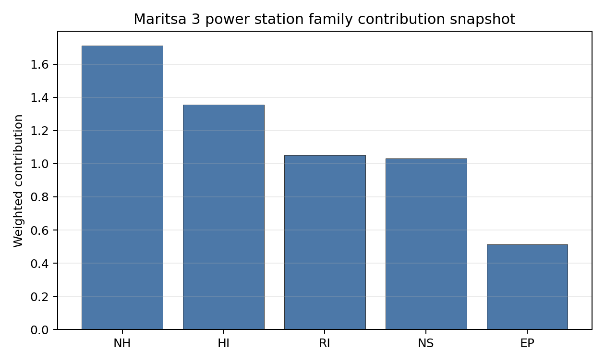

# Maritsa 3 power station Site Profile

Maritsa 3 power station is a coal/thermal site in Bulgaria that has been tested against the NuScale VOYGR-6 reference deployment envelope. This profile reads the screening evidence at a level that supports a decision to progress toward Stage 3 characterisation. It is not a site-suitability determination, vendor recommendation, or licensing finding.

## Site Snapshot

| Field | Value |
| --- | --- |
| Site name | Maritsa 3 power station |
| Coordinates | 42.0519, 25.6233 |
| Subnational unit | Haskovo |
| Installed thermal capacity (source data) | 120 MW |
| Available surface area | 18.9 ha |
| Available surface area for development | 18.9 ha |
| Composite score (baseline weights) | 7.009 (6.240-7.569 MC band) |
| National stability band | D (top-10% hit rate 0%) |
| National rank | 2 |

_See the country status map in_ [Bulgaria Country Profile](../BG_country_prototype.md#country-status-map).

## Ownership and Coal-to-Nuclear Context

- **Draft EOOD** (46.01% share), headquartered in Bulgaria; immediate operator TEC Maritsa 3 AD. Path: Draft EOOD -> TEC Maritsa 3 AD [46.01%] -> Maritsa 3 power station -- [100.0%]
- **Draft AG** (46.01% share), headquartered in Liechtenstein; immediate operator TEC Maritsa 3 AD. Path: Draft AG -> Draft EOOD [100.0%] -> TEC Maritsa 3 AD [46.01%] -> Maritsa 3 power station -- [100.0%]
- **Heatherdell Ltd** (49.00% share), headquartered in United Kingdom; immediate operator TEC Maritsa 3 AD. Path: Heatherdell Ltd -> Top Group EOOD [100.0%] -> TEC Maritsa 3 AD [49.0%] -> Maritsa 3 power station -- [100.0%]
- **TEC Maritsa 3 AD** (100.00% share), headquartered in Bulgaria; immediate operator TEC Maritsa 3 AD. Path: TEC Maritsa 3 AD -> Maritsa 3 power station -- [100.0%]
- **natural person(s)** (share not reported); immediate operator TEC Maritsa 3 AD. Path: natural person(s) -> Heatherdell Ltd [unknown %] -> Top Group EOOD [100.0%] -> TEC Maritsa 3 AD [49.0%] -> Maritsa 3 power station -- [100.0%]
- **Top Group EOOD** (49.00% share), headquartered in Bulgaria; immediate operator TEC Maritsa 3 AD. Path: Top Group EOOD -> TEC Maritsa 3 AD [49.0%] -> Maritsa 3 power station -- [100.0%]

Generating units on record: 1 mothballed.
Earliest unit commissioning: 1971; most recent: 1971.

## Natural Hazards (NH)

- **Seismic: Ground Motion (NH-01)** - score 5.5/10 (MC 5.0-6.0) - pass-mark band: At or below the score-5 risk boundary., weight 0.0455, data quality high. Evidence: PGA at 475-year return period 0.202 g; PGA at 2,475-year return period 0.5 g; Vs30 reference (m/s): 760.0.
- **Seismic: Surface Rupture (NH-02)** - score 5.5/10 (MC 5.0-6.0) - pass-mark band: Borderline acceptable separation: meets the 8.0 km score boundary; check against the 8 km conservative screen and local capability evidence., weight n/a, data quality screening grade. Evidence: nearest mapped capable fault 9.77 km; fault slip rate 0.2 mm/yr; fault name: BGCF000.
- **Geotechnical: Liquefaction (NH-03)** - score 5.5/10 (MC 5.0-6.0) - pass-mark band: Moderate susceptibility, or high/very-high with documented (or pending for `high`) mitigation., weight n/a, data quality medium. Evidence: liquefaction susceptibility: high; dominant soil type: clay_loam.
- **Geotechnical: Slope Stability (NH-04)** - score 7.5/10 (MC 7.0-8.0), weight n/a, data quality screening grade. Evidence: site slope 7.17 deg; max slope in 1 km box 79.3 deg; slope stability class: moderate.
- **Geotechnical: Subsidence (NH-05)** - score 9.5/10 (MC 9.0-10.0) - favourable: No karst; mine-feature distance well above the score-5 pivot (or unknown)., weight 0.0354, data quality medium. Evidence: karst present: no; karst severity: none.
- **Geotechnical: Foundation (NH-06)** - score 5.5/10 (MC 5.0-6.0) - pass-mark band: Typical European mixed conditions (bearing 80-150 kPa)., weight 0.0253, data quality medium. Evidence: bearing capacity 92.0 kPa; depth to bedrock 24.1 m.
- **Volcanism (NH-07)** - score 9.5/10 (MC 9.0-10.0) - favourable: Very strong margin above the score-5 boundary (or screening evidence records no in-radius signal)., weight n/a, data quality high. Evidence: volcanic hazard class: negligible.
- **Coastal Flooding (NH-08)** - score 9.5/10 (MC 9.0-10.0) - favourable: Non-coastal OR elevation >= 50 m AMSL OR landlocked country, with no positive marine-hazard signal., weight 0.0303, data quality medium. Evidence: distance to coast 125.2 km.
- **River Flooding (NH-09)** - score 7.5/10 (MC 7.0-8.0), weight 0.0404, data quality medium. Evidence: flood zone class: negligible.
- **Extreme Winds (NH-10)** - score 9.5/10 (MC 9.0-10.0) - favourable: Lowest relative wind exposure in the current screening wind-exposure cohort (< 7.5 m/s)., weight 0.0152, data quality medium. Evidence: screening wind-speed index 6.3 m/s.
- **Extreme Precipitation (NH-11)** - score 8.0/10 (MC 8.0-9.0) - favourable: aggregated(mean_of_sub_scores), weight 0.0152, data quality medium. Evidence: screening extreme-precipitation index 0.2 mm; screening precipitation index 21.2 mm/yr.
- **Extreme Temperatures (NH-12)** - score 6.5/10 (MC 6.0-7.0) - pass-mark band: aggregated(mean_of_sub_scores), weight 0.0202, data quality medium. Evidence: extreme high temperature 27.7 deg C; extreme low temperature -3.2 deg C.
- **Combined Hazards (NH-14)** - score 5.5/10 (MC 5.0-6.0) - pass-mark band: At least 5 resolved, exactly one moderate hazard (3-5) or moderate interaction only., weight 0.0152, data quality n/a. Evidence: values not in measurement tables.

### Interpretation - Natural Hazards (NH)

Natural hazards at Maritsa 3 are acceptable for screening, but the seismic and geotechnical margins are closer than at Lom. The 475-year PGA is 0.202 g and the 2,475-year PGA reaches 0.5 g, which sits at the project screening boundary for this reference envelope. The nearest mapped capable fault is 9.77 km away, outside the exclusionary buffer but close enough to justify a site-specific seismic review. Liquefaction susceptibility is high, bearing capacity is 92.0 kPa, depth to bedrock is 24.1 m, and site slope is 7.17 degrees. Flood, coastal and volcanic indicators are favourable or remote, and design wind is 6.3 m/s. Stage 3 should prioritize seismic-source review, liquefaction testing and replacement of screening precipitation values with national station evidence.

## Human-Induced and Security-Relevant Hazards (HI)

- **Aircraft Crash (HI-01)** - score 9.5/10 (MC 9.0-10.0) - favourable: Only small / GA / heliport airport >= 10 km nearby, no flight-path proxy < 4 km, no major airport within 30 km, and no military airbase within 60 km., weight 0.0354, data quality high. Evidence: nearest airport 17.9 km; nearest flight path 8.92 km; airports within search radius 2; airport name: Gorski Izvor Airstrip; airport type: small airfield.
- **Industrial Explosions (HI-02)** - score 9.5/10 (MC 9.0-10.0) - favourable: Very strong margin above the score-5 boundary (or no in-radius signal is recorded)., weight 0.0354, data quality medium. Evidence: values not in measurement tables.
- **Toxic/Gas Releases (HI-03)** - score 9.5/10 (MC 9.0-10.0) - favourable: Very strong margin above the score-5 boundary (or no in-radius signal is recorded)., weight 0.0354, data quality medium. Evidence: values not in measurement tables.
- **External Fires (HI-04)** - score 9.5/10 (MC 9.0-10.0) - favourable: > 15 km, or no flammable-storage signal is recorded in radius., weight 0.0303, data quality medium. Evidence: values not in measurement tables.
- **Military Installations (HI-06)** - score 1.5/10 (MC 1.0-2.0), weight 0.0303, data quality medium. Evidence: nearest military installation 9.99 km; military installations within radius 6; installation name: unnamed.
- **Electromagnetic Interference (HI-07)** - score 1.5/10 (MC 1.0-2.0), weight 0.0101, data quality medium. Evidence: nearest high-power transmitter 0.54 km; transmitters within radius 34; transmitter type: mast.

### Interpretation - Human-Induced and Security-Relevant Hazards (HI)

Human-induced hazards at Maritsa 3 are limited by military and electromagnetic conditions rather than by aircraft-crash screening. The nearest small airport is 17.9 km away and the nearest flight-path proxy is 8.92 km away, so Aircraft Crash (HI-01) is favourable. Industrial Explosions (HI-02), Toxic/Gas Releases (HI-03) and External Fires (HI-04) also score favourably on the current record. The weak points are Military Installations (HI-06), with the nearest feature 9.99 km away and six features in radius, and Electromagnetic Interference (HI-07), with the nearest transmitter 0.54 km away and 34 transmitters in radius. Stage 3 should obtain defence-feature classification, run an RF/EMI survey and refresh the hazardous-neighbour inventory for the Haskovo area.

## Radiological Impact and Emergency Planning (RI / EP)

- **Emergency Planning Feasibility (EP-01)** - score 5.5/10 (MC 5.0-6.0) - pass-mark band: At or above the composite score-5 boundary., weight n/a, data quality high. Evidence: EP feasibility composite 56.9 /100; road sub-score 45.5 /100; special-population sub-score 90.0 /100; geography sub-score 95.0 /100; population sub-score 60.0 /100; evacuation feasible: yes.
- **Evacuation Routes (EP-02)** - score 3.5/10 (MC 3.0-4.0), weight 0.0303, data quality medium. Evidence: road density in EPZ 0.392 km/km2; road length in EPZ 770.0 km; motorway access: yes.
- **Physical Geography Constraints (EP-03)** - score 9.5/10 (MC 9.0-10.0) - favourable: No measured relief; open river/waterway context (interim screening)., weight 0.0253, data quality medium. Evidence: waterways crossing EPZ 0; major river barrier: no.
- **Special Populations (EP-04)** - score 5.5/10 (MC 5.0-6.0) - pass-mark band: 9-25., weight 0.0303, data quality medium. Evidence: hospitals in EPZ 15; prisons in EPZ 0; care homes in EPZ 0.
- **Atmospheric Dispersion (RI-01)** - score no native score (unscored - no band matched), weight 0.0303, data quality medium. Evidence: annual mean wind speed 0.78 m/s; atmospheric mixing height 482.1 m; prevailing wind direction: NW.
- **Surface Water Dispersion (RI-02)** - score 5.5/10 (MC 5.0-6.0) - pass-mark band: 30-100 m3/s., weight 0.0253, data quality n/a. Evidence: values not in measurement tables.
- **Groundwater Dispersion (RI-03)** - score 7.5/10 (MC 7.0-8.0), weight 0.0253, data quality medium. Evidence: aquifer type: low permeability.
- **Population Density at EPZ Radii (RI-04)** - score 3.5/10 (MC 3.0-4.0), weight 0.0404, data quality screening grade. Evidence: population density within 5 km 316.0 /km2; population density within 16 km 131.2 /km2; population density within 25 km 76.4 /km2; population density within 80 km 65.7 /km2; population within 25 km 149,923 people.
- **Distance to Population Centres (RI-05)** - score 9.5/10 (MC 9.0-10.0) - favourable: Nearest >=50k population-centre proxy exceeds required distance by >= 50 %., weight 0.0505, data quality screening grade. Evidence: nearest city above 50k people 18.0 km; nearest city population 67,086 people; city name: Haskovo.
- **Population Projections (RI-06)** - score 9.5/10 (MC 9.0-10.0) - favourable: Declining (< -0.5 %/yr)., weight 0.0253, data quality screening grade. Evidence: annual population growth rate -1.486 %/yr; projected population at 25 km in 60 yr 111,418 people.

### Interpretation - Radiological Impact and Emergency Planning (RI / EP)

Radiological impact and emergency planning at Maritsa 3 are driven by the population and special-population envelope around Haskovo. Population density is 316.0 people/km2 within 5 km and 76.4 people/km2 within 25 km, with 149,923 people inside 25 km. Haskovo, with 67,086 people, is 18.0 km away. The 25 km population declines to 111,418 people over the 60-year horizon, which supports the long-term demographic read but does not remove the near-field population issue. Emergency Planning Feasibility (EP-01) is feasible at 56.9/100, with road density of 0.392 km/km2 and motorway access present, but 15 hospitals in the EPZ make EP-04 a practical planning concern. Stage 3 should model evacuation timing, hospital surge arrangements and source-term placement against local wind evidence.

## Non-Safety and Implementation Considerations (NS)

- **Grid Capacity Basic Filter (BF-01)** - score 5.5/10 (MC 5.0-6.0) - pass-mark band: Note: substation 15-30 km OR 110-219 kV; reinforcement plausible., weight n/a, data quality n/a. Evidence: values not in measurement tables.
- **Land Area Basic Filter (BF-02)** - score 1.5/10 (MC 1.0-2.0), weight 0.0253, data quality n/a. Evidence: values not in measurement tables.
- **Cooling Water Availability (NS-01)** - score 6.0/10 (MC 6.0-7.0) - pass-mark band: aggregated(weighted_mean_of_sub_scores), weight 0.0404, data quality screening grade. Evidence: distance to cooling source 0.62 km; cooling source flow 76.0 m3/s; cooling source type: river; cooling source name: Maritsa; water stress label: High.
- **Grid Connection (NS-02)** - score 1.5/10 (MC 1.0-2.0), weight 0.0404, data quality high. Evidence: nearest substation 0.21 km; nearest high-voltage line 1.53 km; highest nearby line voltage 110.0 kV; grid export capacity 120.0 MW; substations within radius 339; HV lines within radius 261.
- **Transport Access (NS-03)** - score 9.0/10 (MC 9.0-10.0) - favourable: aggregated(weighted_mean_of_sub_scores), weight 0.0404, data quality high. Evidence: nearest highway 0.76 km; nearest rail line 0.32 km; nearest waterway 3.2 km; heavy-haul capable: yes.
- **Site Topography (NS-04)** - score 7.5/10 (MC 7.0-8.0), weight 0.0303, data quality screening grade. Evidence: favourable land cover 70.2 %; moderate land cover 7.4 %; unfavourable land cover 13.4 %; favourable area 159.2 ha; dominant land class: 211.
- **Site Footprint Adequacy (NS-05)** - score 5.5/10 (MC 5.0-6.0) - pass-mark band: At or above the score-5 boundary., weight 0.0253, data quality high. Evidence: buildable area 18.9 ha; largest contiguous patch 18.9 ha; buildable patch count 10.
- **Existing Infrastructure (NS-06)** - score no native score (unscored - no band matched), weight 0.0253, data quality n/a. Evidence: not measured at this site (criterion remains unscored).
- **Ecological Sensitivity (NS-08)** - score 1.5/10 (MC 1.0-2.0), weight n/a, data quality high. Evidence: natural land cover 13.4 %; distance to nearest Natura 2000 site 0.545 km; distance to nearest protected area 0.512 km; Natura 2000 overlap: no; Natura 2000 sensitivity class: high; protected-area overlap: no; protected-area sensitivity class: moderate; nearest Natura 2000 site: Reka Maritsa; Natura 2000 sites within 5 km: 3; nearest protected-area designation: Protected Site.
- **Workforce Availability (NS-10)** - score no native score (unscored - no band matched), weight 0.0202, data quality n/a. Evidence: not measured at this site (criterion remains unscored).
- **Regulatory/Political Environment (NS-12)** - score no native score (unscored - no band matched), weight 0.0303, data quality n/a. Evidence: not measured at this site (criterion remains unscored).
- **Construction Logistics (NS-13)** - score no native score (unscored - no band matched), weight 0.0202, data quality n/a. Evidence: not measured at this site (criterion remains unscored).

### Interpretation - Non-Safety and Implementation Considerations (NS)

Non-safety implementation at Maritsa 3 is a split profile. Transport access is strong, with highway access at 0.76 km, rail at 0.32 km, waterway access at 3.2 km and heavy-haul capability recorded. Cooling Water Availability (NS-01) is plausible on distance and flow, with the Maritsa river 0.62 km away and a 76.0 m3/s flow value, but the High water-stress label requires project-specific water review. The canonical available surface area is only 18.9 ha, even though the wider favourable-area envelope is 159.2 ha; this makes land control and usable layout a core Stage 3 question. Grid Connection (NS-02) is the formal avoidance flag, with 120 MW grid export capacity against the VOYGR-6 envelope. Ecological Sensitivity (NS-08) is also material because Reka Maritsa is 0.545 km away and three Natura 2000 sites lie within 5 km. Stage 3 should focus on grid reinforcement, controlled land area, water allocation and appropriate assessment.

## Composite Score and Stability

Baseline composite score is 7.009, bracketed by Monte Carlo at 6.240-7.569. National stability band is `D` with a top-10% hit rate of 0% across 12 scored Monte Carlo scenarios.

Maritsa 3 records a baseline composite score of 7.009, with a Monte Carlo bracket of 6.240-7.569. It ranks second nationally, but its national stability band is D and its national top-10% hit rate is 0%, which means its position is materially less robust than Lom's. The family pattern explains the result: Human-Induced Hazards score 7.67, Natural Hazards 7.53 and Radiological Impact 7.43, while Non-Safety Implementation falls to 5.84 because grid capacity, land area and ecological proximity are binding. Maritsa 3 is therefore a useful comparator, not a first Stage 3 lead. Characterisation should test whether NS-02, BF-02 and NS-08 can be converted from constraints into resolvable project work.

## Residual Risk Register

| Concern | Evidence | Consequence | Stage 3 action | Owner discipline |
| --- | --- | --- | --- | --- |
| Grid Connection (NS-02) | Grid export capacity 120.0 MW; highest nearby line voltage 110.0 kV | The site may require material transmission reinforcement before VOYGR-6 integration | Confirm 220 kV or 400 kV connection route and reinforcement scope | grid |
| Site Footprint (BF-02 / NS-05) | Available surface area 18.9 ha; wider favourable envelope 159.2 ha | The usable deployment footprint may be too small without adjacent controlled land | Verify ownership, contiguity and developable area | ownership/legal |
| Ecological Sensitivity (NS-08) | Reka Maritsa is 0.545 km away; three Natura 2000 sites within 5 km | Environmental assessment could constrain layout or cooling works | Run appropriate assessment and receptor-pathway screening | EIA |
| Electromagnetic Interference (HI-07) | Nearest transmitter 0.54 km away; 34 transmitters in radius | EMI controls may affect siting of safety and communications systems | Survey field strengths and exclusion distances | security |
| Population Density (RI-04) | 316.0 people/km2 within 5 km; 149,923 people within 25 km | EPZ planning and dose modelling may be more demanding than at rural sites | Model EPZ population, source-term placement and evacuation timing | emergency planning |

Grid, land and ecological constraints dominate the register. The site remains a valid second-ranked comparator, but it needs targeted unlock evidence before it can rival Lom.

## Stage 3 Follow-Up Checklist

- Confirm **Grid Connection (NS-02)** - 120.0 MW export capacity and 110.0 kV nearby line require reinforcement review.
- Verify **Available surface area** - 18.9 ha canonical site area against the VOYGR-6 layout envelope.
- Engage **Military Installations (HI-06)** - six military features in radius and nearest feature 9.99 km away.
- Survey **Electromagnetic Interference (HI-07)** - nearest transmitter 0.54 km away and 34 transmitters in radius.
- Screen **Ecological Sensitivity (NS-08)** - Reka Maritsa 0.545 km away and three Natura 2000 sites within 5 km.
- Model **Population Density at EPZ Radii (RI-04)** - 316.0 people/km2 within 5 km and 149,923 people within 25 km.

## Evidence Limitations

- Geotechnical: Subsidence & Collapse (NH-05b) - quality `low`.
