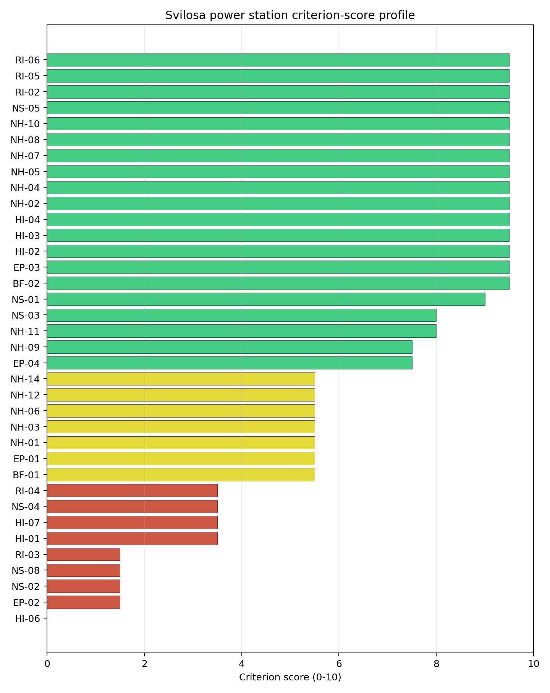
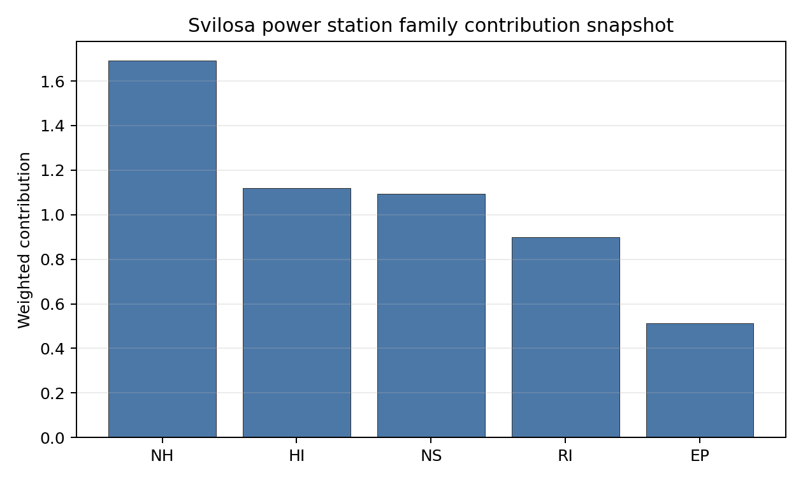

# Svilosa power station Site Profile

Svilosa power station is a coal/thermal site in Bulgaria that has been tested against the NuScale VOYGR-6 reference deployment envelope. This profile reads the screening evidence at a level that supports a decision to progress toward Stage 3 characterisation. It is not a site-suitability determination, vendor recommendation, or licensing finding.

## Site Snapshot

| Field | Value |
| --- | --- |
| Site name | Svilosa power station |
| Coordinates | 43.6423, 25.3050 |
| Subnational unit | Veliko Tarnovo |
| Installed thermal capacity (source data) | 120 MW |
| Available surface area | 172.0 ha |
| Available surface area for development | 135.7 ha |
| Composite score (baseline weights) | 6.578 (5.891-7.119 MC band) |
| National stability band | H (top-10% hit rate 0%) |
| National rank | 5 |

_See the country status map in_ [Bulgaria Country Profile](../BG_country_prototype.md#country-status-map).

## Ownership and Coal-to-Nuclear Context

- **A.R.U.S. Holding AD** (96.64% share), headquartered in Bulgaria; immediate operator Svilosa AD. Path: A.R.U.S. Holding AD -> Svilosa AD [96.64%] -> Svilosa power station Unit 2 [100.0%]
- **unknown** (share not reported); immediate operator Svilosa AD. Path: unknown -> Svilosa AD [unknown %] -> Svilosa power station Unit 1 [100.0%]
- **natural person(s)** (share not reported); immediate operator Svilosa AD. Path: natural person(s) -> A.R.U.S. Holding AD [unknown %] -> Svilosa AD [96.64%] -> Svilosa power station Unit 1 [100.0%]

Generating units on record: 2 retired.
Earliest unit commissioning: 1971; most recent: 1972.
Retirements span 2004 to 2004, leaving brownfield grid, water, transport, and workforce assets that materially shorten Stage 3 site preparation.

## Natural Hazards (NH)

- **Seismic: Ground Motion (NH-01)** - score 5.5/10 (MC 5.0-6.0) - pass-mark band: At or below the score-5 risk boundary., weight 0.0455, data quality high. Evidence: PGA at 475-year return period 0.142 g; PGA at 2,475-year return period 0.275 g; Vs30 reference (m/s): 760.0.
- **Seismic: Surface Rupture (NH-02)** - score 9.5/10 (MC 9.0-10.0) - favourable: Very strong separation from mapped capable faults; surface-rupture concern effectively screened at desk-study level., weight n/a, data quality screening grade. Evidence: nearest mapped capable fault 46.9 km; fault slip rate 0.1 mm/yr; fault name: BGCF00K.
- **Geotechnical: Liquefaction (NH-03)** - score 5.5/10 (MC 5.0-6.0) - pass-mark band: Moderate susceptibility, or high/very-high with documented (or pending for `high`) mitigation., weight n/a, data quality medium. Evidence: liquefaction susceptibility: high; dominant soil type: silty_clay_loam.
- **Geotechnical: Slope Stability (NH-04)** - score 9.5/10 (MC 9.0-10.0) - favourable: Well below the risk boundary., weight n/a, data quality screening grade. Evidence: site slope 3.86 deg; max slope in 1 km box 53.1 deg; slope stability class: gentle.
- **Geotechnical: Subsidence (NH-05)** - score 9.5/10 (MC 9.0-10.0) - favourable: No karst; mine-feature distance well above the score-5 pivot (or unknown)., weight 0.0354, data quality medium. Evidence: karst present: no; karst severity: none.
- **Geotechnical: Foundation (NH-06)** - score 5.5/10 (MC 5.0-6.0) - pass-mark band: Typical European mixed conditions (bearing 80-150 kPa)., weight 0.0253, data quality medium. Evidence: bearing capacity 84.0 kPa; depth to bedrock 19.2 m.
- **Volcanism (NH-07)** - score 9.5/10 (MC 9.0-10.0) - favourable: Very strong margin above the score-5 boundary (or screening evidence records no in-radius signal)., weight n/a, data quality high. Evidence: volcanic hazard class: negligible.
- **Coastal Flooding (NH-08)** - score 9.5/10 (MC 9.0-10.0) - favourable: Non-coastal OR elevation >= 50 m AMSL OR landlocked country, with no positive marine-hazard signal., weight 0.0303, data quality medium. Evidence: distance to coast 218.5 km.
- **River Flooding (NH-09)** - score 7.5/10 (MC 7.0-8.0), weight 0.0404, data quality medium. Evidence: flood zone class: negligible.
- **Extreme Winds (NH-10)** - score 9.5/10 (MC 9.0-10.0) - favourable: Lowest relative wind exposure in the current screening wind-exposure cohort (< 7.5 m/s)., weight 0.0152, data quality medium. Evidence: screening wind-speed index 7.08 m/s.
- **Extreme Precipitation (NH-11)** - score 8.0/10 (MC 8.0-9.0) - favourable: aggregated(mean_of_sub_scores), weight 0.0152, data quality medium. Evidence: screening extreme-precipitation index 0.21 mm; screening precipitation index 20.8 mm/yr.
- **Extreme Temperatures (NH-12)** - score 5.5/10 (MC 5.0-6.0) - pass-mark band: aggregated(mean_of_sub_scores), weight 0.0202, data quality medium. Evidence: extreme high temperature 28.9 deg C; extreme low temperature -5.44 deg C.
- **Combined Hazards (NH-14)** - score 5.5/10 (MC 5.0-6.0) - pass-mark band: At least 5 resolved, exactly one moderate hazard (3-5) or moderate interaction only., weight 0.0152, data quality n/a. Evidence: values not in measurement tables.

### Interpretation - Natural Hazards (NH)

Natural hazards at Svilosa are generally favourable, with good fault separation and gentle topography, but alluvial ground conditions require confirmation. The 475-year PGA is 0.142 g and the 2,475-year PGA is 0.275 g. The nearest mapped capable fault is 46.9 km away, which is a strong surface-rupture margin. Liquefaction susceptibility is high on silty-clay-loam soils, while bearing capacity is 84.0 kPa and depth to bedrock is 19.2 m. Site slope is 3.86 degrees, karst is not present, the flood-zone class is negligible, and the distance to coast is 218.5 km. Design wind is 7.08 m/s and the temperature range remains within the screening envelope. Stage 3 should focus on CPT/SPT testing, flood-interface confirmation and local precipitation evidence.

## Human-Induced and Security-Relevant Hazards (HI)

- **Aircraft Crash (HI-01)** - score 3.5/10 (MC 3.0-4.0), weight 0.0354, data quality high. Evidence: nearest airport 3.18 km; nearest flight path 1.59 km; airports within search radius 3; airport name: Svishtov Airfield; airport type: small airfield.
- **Industrial Explosions (HI-02)** - score 9.5/10 (MC 9.0-10.0) - favourable: Very strong margin above the score-5 boundary (or no in-radius signal is recorded)., weight 0.0354, data quality medium. Evidence: values not in measurement tables.
- **Toxic/Gas Releases (HI-03)** - score 9.5/10 (MC 9.0-10.0) - favourable: Very strong margin above the score-5 boundary (or no in-radius signal is recorded)., weight 0.0354, data quality medium. Evidence: values not in measurement tables.
- **External Fires (HI-04)** - score 9.5/10 (MC 9.0-10.0) - favourable: > 15 km, or no flammable-storage signal is recorded in radius., weight 0.0303, data quality medium. Evidence: values not in measurement tables.
- **Military Installations (HI-06)** - score 0.0/10 (MC 0.0-0.0), weight 0.0303, data quality high. Evidence: nearest military installation 4.7 km; military installations within radius 7; installation name: unnamed.
- **Electromagnetic Interference (HI-07)** - score 3.5/10 (MC 3.0-4.0), weight 0.0101, data quality medium. Evidence: nearest high-power transmitter 4.75 km; transmitters within radius 8; transmitter type: communication.

### Interpretation - Human-Induced and Security-Relevant Hazards (HI)

Human-induced hazards at Svilosa are a major constraint. Aircraft Crash (HI-01) scores 3.5/10 because Svishtov Airfield is 3.18 km away, the nearest flight-path proxy is 1.59 km away, and three airports are in the search radius. Military Installations (HI-06) is more severe, with the nearest feature 4.7 km away and seven military features in radius, producing a 0.0/10 score. Electromagnetic Interference (HI-07) also requires review, with the nearest transmitter 4.75 km away and eight transmitters in radius. Industrial, toxic and external-fire indicators are otherwise favourable in the current screening record. Stage 3 should first test whether the aviation and military findings are recoverable before detailed engineering work proceeds.

## Radiological Impact and Emergency Planning (RI / EP)

- **Emergency Planning Feasibility (EP-01)** - score 5.5/10 (MC 5.0-6.0) - pass-mark band: At or above the composite score-5 boundary., weight n/a, data quality high. Evidence: EP feasibility composite 44.9 /100; road sub-score 17.7 /100; special-population sub-score 10.0 /100; geography sub-score 95.0 /100; population sub-score 80.0 /100; evacuation feasible: yes.
- **Evacuation Routes (EP-02)** - score 1.5/10 (MC 1.0-2.0), weight 0.0303, data quality medium. Evidence: road density in EPZ 0.177 km/km2; road length in EPZ 347.5 km; motorway access: no.
- **Physical Geography Constraints (EP-03)** - score 9.5/10 (MC 9.0-10.0) - favourable: No measured relief; open river/waterway context (interim screening)., weight 0.0253, data quality medium. Evidence: waterways crossing EPZ 0; major river barrier: no.
- **Special Populations (EP-04)** - score 7.5/10 (MC 7.0-8.0), weight 0.0303, data quality medium. Evidence: hospitals in EPZ 7; prisons in EPZ 1; care homes in EPZ 0.
- **Atmospheric Dispersion (RI-01)** - score no native score (unscored - no band matched), weight 0.0303, data quality medium. Evidence: annual mean wind speed 0.76 m/s; atmospheric mixing height 471.8 m; prevailing wind direction: WSW.
- **Surface Water Dispersion (RI-02)** - score 9.5/10 (MC 9.0-10.0) - favourable: > 500 m3/s., weight 0.0253, data quality n/a. Evidence: values not in measurement tables.
- **Groundwater Dispersion (RI-03)** - score 1.5/10 (MC 1.0-2.0), weight 0.0253, data quality medium. Evidence: aquifer type: karsts and chalkstones.
- **Population Density at EPZ Radii (RI-04)** - score 3.5/10 (MC 3.0-4.0), weight 0.0404, data quality screening grade. Evidence: population density within 5 km 292.5 /km2; population density within 16 km 71.1 /km2; population density within 25 km 47.8 /km2; population density within 80 km 61.2 /km2; population within 25 km 93,874 people.
- **Distance to Population Centres (RI-05)** - score 9.5/10 (MC 9.0-10.0) - favourable: Nearest >=50k population-centre proxy exceeds required distance by >= 50 %., weight 0.0505, data quality screening grade. Evidence: nearest city above 50k people 58.6 km; nearest city population 89,823 people; city name: Pleven.
- **Population Projections (RI-06)** - score 9.5/10 (MC 9.0-10.0) - favourable: Declining (< -0.5 %/yr)., weight 0.0253, data quality screening grade. Evidence: annual population growth rate -0.95 %/yr; projected population at 25 km in 60 yr 69,760 people.

### Interpretation - Radiological Impact and Emergency Planning (RI / EP)

Radiological and emergency-planning evidence at Svilosa is mixed. Population density is 292.5 people/km2 within 5 km, 47.8 people/km2 within 25 km, and 93,874 people inside 25 km. Pleven, with 89,823 people, is 58.6 km away, and the projected 25 km population declines to 69,760 people over 60 years. Emergency Planning Feasibility (EP-01) remains feasible at 44.9/100, but it is weak: the road sub-score is 17.7/100, road density is 0.177 km/km2, road length is 347.5 km, and motorway access is absent. Surface Water Dispersion (RI-02) is favourable because of the Danube-scale watercourse, but Groundwater Dispersion (RI-03) scores 1.5/10 on karsts and chalkstones. Stage 3 should model evacuation clearance, groundwater pathways and atmospheric dispersion before the site advances.

## Non-Safety and Implementation Considerations (NS)

- **Grid Capacity Basic Filter (BF-01)** - score 5.5/10 (MC 5.0-6.0) - pass-mark band: Note: substation 15-30 km OR 110-219 kV; reinforcement plausible., weight n/a, data quality n/a. Evidence: values not in measurement tables.
- **Land Area Basic Filter (BF-02)** - score 9.5/10 (MC 9.0-10.0) - favourable: Contiguous and buildable >= ideal area (70 ha/module)., weight 0.0253, data quality n/a. Evidence: values not in measurement tables.
- **Cooling Water Availability (NS-01)** - score 9.0/10 (MC 8.0-10.0) - favourable: aggregated(weighted_mean_of_sub_scores), weight 0.0404, data quality screening grade. Evidence: distance to cooling source 0.76 km; cooling source flow 5,779 m3/s; cooling source type: major_river; cooling source name: Danube; water stress label: Low.
- **Grid Connection (NS-02)** - score 1.5/10 (MC 1.0-2.0), weight 0.0404, data quality high. Evidence: nearest substation 0.19 km; nearest high-voltage line 0.19 km; highest nearby line voltage 110.0 kV; grid export capacity 120.0 MW; substations within radius 36; HV lines within radius 77.
- **Transport Access (NS-03)** - score 8.0/10 (MC 8.0-9.0) - favourable: aggregated(weighted_mean_of_sub_scores), weight 0.0404, data quality high. Evidence: nearest highway 4.32 km; nearest rail line 0.25 km; nearest waterway 8.83 km; heavy-haul capable: yes.
- **Site Topography (NS-04)** - score 3.5/10 (MC 3.0-4.0), weight 0.0303, data quality screening grade. Evidence: favourable land cover 39.2 %; moderate land cover 9.9 %; unfavourable land cover 32.3 %; favourable area 77.1 ha; dominant land class: 211.
- **Site Footprint Adequacy (NS-05)** - score 9.5/10 (MC 9.0-10.0) - favourable: Very strong margin above the score-5 boundary., weight 0.0253, data quality medium. Evidence: buildable area 135.7 ha; largest contiguous patch 135.7 ha; buildable patch count 6.
- **Existing Infrastructure (NS-06)** - score no native score (unscored - no band matched), weight 0.0253, data quality n/a. Evidence: not measured at this site (criterion remains unscored).
- **Ecological Sensitivity (NS-08)** - score 1.5/10 (MC 1.0-2.0), weight n/a, data quality high. Evidence: natural land cover 32.3 %; distance to nearest Natura 2000 site 0.734 km; distance to nearest protected area 0.74 km; Natura 2000 overlap: no; Natura 2000 sensitivity class: high; protected-area overlap: no; protected-area sensitivity class: high; nearest Natura 2000 site: Suhaia; Natura 2000 sites within 5 km: 5; nearest protected-area designation: Wetland of International Importance (Ramsar Site).
- **Workforce Availability (NS-10)** - score no native score (unscored - no band matched), weight 0.0202, data quality n/a. Evidence: not measured at this site (criterion remains unscored).
- **Regulatory/Political Environment (NS-12)** - score no native score (unscored - no band matched), weight 0.0303, data quality n/a. Evidence: not measured at this site (criterion remains unscored).
- **Construction Logistics (NS-13)** - score no native score (unscored - no band matched), weight 0.0202, data quality n/a. Evidence: not measured at this site (criterion remains unscored).

### Interpretation - Non-Safety and Implementation Considerations (NS)

Non-safety implementation at Svilosa is strong on cooling and land, but weak on grid, topography and ecology. Cooling Water Availability (NS-01) is favourable, with the Danube 0.76 km away, a 5,779 m3/s flow value and Low water stress. The canonical available surface area is 172.0 ha and the development-area value is 135.7 ha, which is the strongest land envelope among the selected sites. Transport access is usable, with highway access at 4.32 km, rail at 0.25 km, waterway access at 8.83 km and heavy-haul capability recorded. Grid Connection (NS-02) is binding because grid export capacity is 120.0 MW and the highest nearby voltage is 110.0 kV. Ecological Sensitivity (NS-08) is also binding: Suhaia is 0.734 km away, five Natura 2000 sites lie within 5 km, and the nearest protected-area designation is a Ramsar wetland. Stage 3 should focus on grid upgrade, ecological assessment and confirmation of usable land outside sensitive receptors.

## Composite Score and Stability

Baseline composite score is 6.578, bracketed by Monte Carlo at 5.891-7.119. National stability band is `H` with a top-10% hit rate of 0% across 12 scored Monte Carlo scenarios.

Svilosa records a baseline composite score of 6.578, with a Monte Carlo bracket of 5.891-7.119. It ranks fifth nationally, sits in stability band H and has a 0% national top-10 and top-30 hit rate. The site is therefore the weakest of the selected five from a robustness perspective. Natural Hazards score 7.44, while Human-Induced Hazards, Non-Safety Implementation and Radiological Impact sit between 6.19 and 6.36, with Emergency Planning at 5.97. The ranking depends on whether several binding questions can be retired together: HI-01, HI-06, NS-02, NS-08, RI-03 and EP-02. Svilosa should stay as a conditional option only if early Stage 3 work shows those constraints are recoverable.

## Residual Risk Register

| Concern | Evidence | Consequence | Stage 3 action | Owner discipline |
| --- | --- | --- | --- | --- |
| Aircraft Crash (HI-01) | Svishtov Airfield 3.18 km away; flight-path proxy 1.59 km away | Aviation screening may remain binding without project-specific hazard evidence | Model aircraft-crash frequency and flight-path exposure | security |
| Military Installations (HI-06) | Nearest military feature 4.7 km away; seven features in radius | Defence standoff could constrain or deprecate the site | Engage defence authorities on feature classification | security |
| Grid Connection (NS-02) | Grid export capacity 120.0 MW; highest nearby line voltage 110.0 kV | Transmission reinforcement may be a gating implementation issue | Confirm grid upgrade and connection economics | grid |
| Ecological Sensitivity (NS-08) | Suhaia 0.734 km away; five Natura 2000 sites within 5 km; Ramsar-designated protected area nearby | Environmental assessment could narrow the siting envelope materially | Run appropriate assessment and wetland receptor review | EIA |
| Evacuation Routes (EP-02) | Road density 0.177 km/km2; motorway access absent | EPZ clearance may be difficult without new traffic arrangements | Model evacuation timing and secondary routes | emergency planning |

Svilosa's residual risk is broad. Its land and cooling strengths justify retaining it as the fifth profile, but early Stage 3 work should be designed as a recoverability test.

## Stage 3 Follow-Up Checklist

- Resolve **Aircraft Crash (HI-01)** - Svishtov Airfield 3.18 km away and flight-path proxy 1.59 km away.
- Engage **Military Installations (HI-06)** - nearest feature 4.7 km away and seven features in radius.
- Confirm **Grid Connection (NS-02)** - 120.0 MW export capacity and 110.0 kV nearby line require upgrade review.
- Screen **Ecological Sensitivity (NS-08)** - Suhaia 0.734 km away, five Natura 2000 sites within 5 km and nearby Ramsar wetland designation.
- Model **Evacuation Routes (EP-02)** - 0.177 km/km2 EPZ road density and no motorway access.
- Quantify **Groundwater Dispersion (RI-03)** - karsts and chalkstones aquifer type produces the binding groundwater read.

## Evidence Limitations

- Geotechnical: Subsidence & Collapse (NH-05b) - quality `low`.
