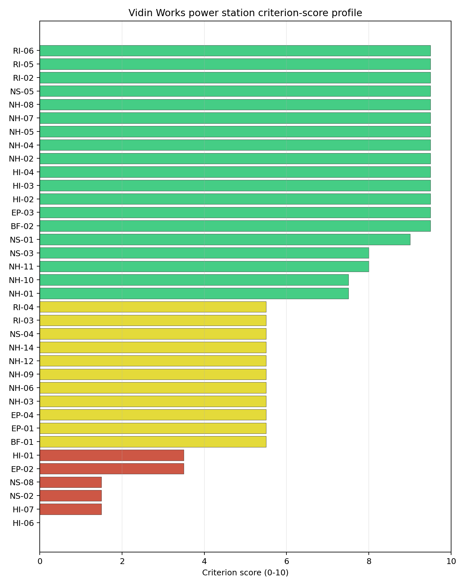

# Vidin Works power station Site Profile

Vidin Works power station is a coal/thermal site in Bulgaria that has been tested against the NuScale VOYGR-6 reference deployment envelope. This profile reads the screening evidence at a level that supports a decision to progress toward Stage 3 characterisation. It is not a site-suitability determination, vendor recommendation, or licensing finding.

## Site Snapshot

| Field | Value |
| --- | --- |
| Site name | Vidin Works power station |
| Coordinates | 43.9484, 22.8509 |
| Subnational unit | Vidin |
| Installed thermal capacity (source data) | 120 MW |
| Available surface area | 130.0 ha |
| Available surface area for development | 156.3 ha |
| Composite score (baseline weights) | 6.828 (6.093-7.369 MC band) |
| National stability band | H (top-10% hit rate 0%) |
| National rank | 4 |

_See the country status map in_ [Bulgaria Country Profile](../BG_country_prototype.md#country-status-map).

## Ownership and Coal-to-Nuclear Context

- **Vidachim AD** (100.00% share), headquartered in Bulgaria; immediate operator Vidachim AD. Path: Vidachim AD -> Vidin Works power station Unit 2 [100.0%]
- **Pristisgrup-Vodno Stroitelstvo AD** (70.00% share), headquartered in Bulgaria; immediate operator Vidachim AD. Path: Pristisgrup-Vodno Stroitelstvo AD -> Vidachim AD [70.0%] -> Vidin Works power station Unit 1 [100.0%]

Generating units on record: 2 mothballed.
Earliest unit commissioning: 1970; most recent: 1970.

## Natural Hazards (NH)

- **Seismic: Ground Motion (NH-01)** - score 7.5/10 (MC 7.0-8.0), weight 0.0455, data quality high. Evidence: PGA at 475-year return period 0.061 g; PGA at 2,475-year return period 0.118 g; Vs30 reference (m/s): 760.0.
- **Seismic: Surface Rupture (NH-02)** - score 9.5/10 (MC 9.0-10.0) - favourable: Very strong separation from mapped capable faults; surface-rupture concern effectively screened at desk-study level., weight n/a, data quality screening grade. Evidence: nearest mapped capable fault 44.4 km; fault slip rate 0.141 mm/yr; fault name: BGCF00M.
- **Geotechnical: Liquefaction (NH-03)** - score 5.5/10 (MC 5.0-6.0) - pass-mark band: Moderate susceptibility, or high/very-high with documented (or pending for `high`) mitigation., weight n/a, data quality medium. Evidence: liquefaction susceptibility: high; dominant soil type: silty_clay_loam.
- **Geotechnical: Slope Stability (NH-04)** - score 9.5/10 (MC 9.0-10.0) - favourable: Well below the risk boundary., weight n/a, data quality screening grade. Evidence: site slope 4.46 deg; max slope in 1 km box 59.6 deg; slope stability class: gentle.
- **Geotechnical: Subsidence (NH-05)** - score 9.5/10 (MC 9.0-10.0) - favourable: No karst; mine-feature distance well above the score-5 pivot (or unknown)., weight 0.0354, data quality medium. Evidence: karst present: no; karst severity: none.
- **Geotechnical: Foundation (NH-06)** - score 5.5/10 (MC 5.0-6.0) - pass-mark band: Typical European mixed conditions (bearing 80-150 kPa)., weight 0.0253, data quality medium. Evidence: bearing capacity 88.7 kPa; depth to bedrock 25.5 m.
- **Volcanism (NH-07)** - score 9.5/10 (MC 9.0-10.0) - favourable: Very strong margin above the score-5 boundary (or screening evidence records no in-radius signal)., weight n/a, data quality high. Evidence: volcanic hazard class: negligible.
- **Coastal Flooding (NH-08)** - score 9.5/10 (MC 9.0-10.0) - favourable: Non-coastal OR elevation >= 50 m AMSL OR landlocked country, with no positive marine-hazard signal., weight 0.0303, data quality medium. Evidence: distance to coast 359.1 km.
- **River Flooding (NH-09)** - score 5.5/10 (MC 5.0-6.0) - pass-mark band: Benign flood-zone class but river/waterway proxy is within 2 km; routine flood-interface review., weight 0.0404, data quality medium. Evidence: nearest river 0 km; flood zone class: negligible.
- **Extreme Winds (NH-10)** - score 7.5/10 (MC 7.0-8.0), weight 0.0152, data quality medium. Evidence: screening wind-speed index 7.59 m/s.
- **Extreme Precipitation (NH-11)** - score 8.0/10 (MC 8.0-9.0) - favourable: aggregated(mean_of_sub_scores), weight 0.0152, data quality medium. Evidence: screening extreme-precipitation index 0.21 mm; screening precipitation index 19.8 mm/yr.
- **Extreme Temperatures (NH-12)** - score 5.5/10 (MC 5.0-6.0) - pass-mark band: aggregated(mean_of_sub_scores), weight 0.0202, data quality medium. Evidence: extreme high temperature 27.7 deg C; extreme low temperature -5.2 deg C.
- **Combined Hazards (NH-14)** - score 5.5/10 (MC 5.0-6.0) - pass-mark band: At least 5 resolved, exactly one moderate hazard (3-5) or moderate interaction only., weight 0.0152, data quality n/a. Evidence: values not in measurement tables.

### Interpretation - Natural Hazards (NH)

Natural hazards at Vidin Works are favourable on seismic separation and topography, with a specific river-interface question. The 475-year PGA is 0.061 g and the 2,475-year PGA is 0.118 g, the lowest seismic demand among the selected Bulgarian sites. The nearest mapped capable fault is 44.4 km away. Site slope is 4.46 degrees, the slope class is gentle, karst is not present, and volcanic and coastal indicators are favourable. The main issue is River Flooding (NH-09): the nearest river distance is 0 km while the flood-zone class is negligible, implying a levee and local flood-interface question rather than a direct exclusionary finding. Liquefaction susceptibility is high on silty-clay-loam soils, with 88.7 kPa bearing capacity and 25.5 m depth to bedrock. Stage 3 should confirm Danube flood levels, levee performance and liquefaction conditions.

## Human-Induced and Security-Relevant Hazards (HI)

- **Aircraft Crash (HI-01)** - score 3.5/10 (MC 3.0-4.0), weight 0.0354, data quality high. Evidence: nearest airport 8.69 km; nearest flight path 4.35 km; airports within search radius 1; airport name: Vidin Smurdan Airfield; airport type: small airfield.
- **Industrial Explosions (HI-02)** - score 9.5/10 (MC 9.0-10.0) - favourable: Very strong margin above the score-5 boundary (or no in-radius signal is recorded)., weight 0.0354, data quality medium. Evidence: values not in measurement tables.
- **Toxic/Gas Releases (HI-03)** - score 9.5/10 (MC 9.0-10.0) - favourable: Very strong margin above the score-5 boundary (or no in-radius signal is recorded)., weight 0.0354, data quality medium. Evidence: values not in measurement tables.
- **External Fires (HI-04)** - score 9.5/10 (MC 9.0-10.0) - favourable: > 15 km, or no flammable-storage signal is recorded in radius., weight 0.0303, data quality medium. Evidence: values not in measurement tables.
- **Military Installations (HI-06)** - score 0.0/10 (MC 0.0-0.0), weight 0.0303, data quality medium. Evidence: nearest military installation 5.36 km; military installations within radius 9; installation name: ВО.
- **Electromagnetic Interference (HI-07)** - score 1.5/10 (MC 1.0-2.0), weight 0.0101, data quality medium. Evidence: nearest high-power transmitter 1.44 km; transmitters within radius 51; transmitter type: mast.

### Interpretation - Human-Induced and Security-Relevant Hazards (HI)

Human-induced hazards at Vidin Works are dominated by military and electromagnetic findings, with an additional aircraft-crash avoidance flag. Vidin Smurdan Airfield is 8.69 km away and the nearest flight-path proxy is 4.35 km away, so aviation exposure requires a project-specific hazard assessment. Military Installations (HI-06) scores 0.0/10, with the nearest feature 5.36 km away, nine military features in radius, and the nearest named feature recorded as ВО. Electromagnetic Interference (HI-07) scores 1.5/10, with the nearest transmitter 1.44 km away and 51 transmitters in radius. Industrial, toxic and external-fire indicators are favourable in the screening record. Stage 3 should begin with defence-feature classification, RF/EMI measurement and aircraft-crash hazard assessment.

## Radiological Impact and Emergency Planning (RI / EP)

- **Emergency Planning Feasibility (EP-01)** - score 5.5/10 (MC 5.0-6.0) - pass-mark band: At or above the composite score-5 boundary., weight n/a, data quality high. Evidence: EP feasibility composite 62.5 /100; road sub-score 40.0 /100; special-population sub-score 90.0 /100; geography sub-score 95.0 /100; population sub-score 80.0 /100; evacuation feasible: yes.
- **Evacuation Routes (EP-02)** - score 3.5/10 (MC 3.0-4.0), weight 0.0303, data quality medium. Evidence: road density in EPZ 0.3 km/km2; road length in EPZ 588.6 km; motorway access: yes.
- **Physical Geography Constraints (EP-03)** - score 9.5/10 (MC 9.0-10.0) - favourable: No measured relief; open river/waterway context (interim screening)., weight 0.0253, data quality medium. Evidence: waterways crossing EPZ 0; major river barrier: no.
- **Special Populations (EP-04)** - score 5.5/10 (MC 5.0-6.0) - pass-mark band: 9-25., weight 0.0303, data quality medium. Evidence: hospitals in EPZ 15; prisons in EPZ 0; care homes in EPZ 1.
- **Atmospheric Dispersion (RI-01)** - score no native score (unscored - no band matched), weight 0.0303, data quality medium. Evidence: annual mean wind speed 1.04 m/s; atmospheric mixing height 526.7 m; prevailing wind direction: W.
- **Surface Water Dispersion (RI-02)** - score 9.5/10 (MC 9.0-10.0) - favourable: > 500 m3/s., weight 0.0253, data quality n/a. Evidence: values not in measurement tables.
- **Groundwater Dispersion (RI-03)** - score 5.5/10 (MC 5.0-6.0) - pass-mark band: Moderate-permeability aquifer screening proxy., weight 0.0253, data quality medium. Evidence: aquifer type: inland water.
- **Population Density at EPZ Radii (RI-04)** - score 5.5/10 (MC 5.0-6.0) - pass-mark band: aggregated(min_of_sub_scores), weight 0.0404, data quality screening grade. Evidence: population density within 5 km 245.2 /km2; population density within 16 km 86.8 /km2; population density within 25 km 55.1 /km2; population density within 80 km 38.0 /km2; population within 25 km 108,261 people.
- **Distance to Population Centres (RI-05)** - score 9.5/10 (MC 9.0-10.0) - favourable: Nearest >=50k population-centre proxy exceeds required distance by >= 50 %., weight 0.0505, data quality screening grade. Evidence: nearest city above 50k people 81.4 km; nearest city population 106,707 people; city name: Drobeta-Turnu Severin.
- **Population Projections (RI-06)** - score 9.5/10 (MC 9.0-10.0) - favourable: Declining (< -0.5 %/yr)., weight 0.0253, data quality screening grade. Evidence: annual population growth rate -1.697 %/yr; projected population at 25 km in 60 yr 80,456 people.

### Interpretation - Radiological Impact and Emergency Planning (RI / EP)

Radiological impact and emergency planning at Vidin Works are shaped by the urban-edge setting and Danube context. Population density is 245.2 people/km2 within 5 km, 55.1 people/km2 within 25 km, and the 25 km population is 108,261 people. The nearest city above 50,000 people is Drobeta-Turnu Severin at 81.4 km, but the 5 km density shows that Vidin itself drives near-field planning. Emergency Planning Feasibility (EP-01) is feasible at 62.5/100, road density is 0.300 km/km2, and motorway access is present. Special populations remain important, with 15 hospitals and one care home in the EPZ. Surface Water Dispersion (RI-02) is favourable because the Danube-scale flow is recorded, while atmospheric dispersion is unscored and should be modelled with local wind data. Stage 3 should focus on urban-edge EPZ modelling and cross-border emergency coordination.

## Non-Safety and Implementation Considerations (NS)

- **Grid Capacity Basic Filter (BF-01)** - score 5.5/10 (MC 5.0-6.0) - pass-mark band: Note: substation 15-30 km OR 110-219 kV; reinforcement plausible., weight n/a, data quality n/a. Evidence: values not in measurement tables.
- **Land Area Basic Filter (BF-02)** - score 9.5/10 (MC 9.0-10.0) - favourable: Contiguous and buildable >= ideal area (70 ha/module)., weight 0.0253, data quality n/a. Evidence: values not in measurement tables.
- **Cooling Water Availability (NS-01)** - score 9.0/10 (MC 8.0-10.0) - favourable: aggregated(weighted_mean_of_sub_scores), weight 0.0404, data quality screening grade. Evidence: distance to cooling source 1.43 km; cooling source flow 5,552 m3/s; cooling source type: major_river; cooling source name: Тополовец; water stress label: Low.
- **Grid Connection (NS-02)** - score 1.5/10 (MC 1.0-2.0), weight 0.0404, data quality high. Evidence: nearest substation 0.23 km; nearest high-voltage line 0.25 km; highest nearby line voltage 110.0 kV; grid export capacity 120.0 MW; substations within radius 41; HV lines within radius 94.
- **Transport Access (NS-03)** - score 8.0/10 (MC 8.0-9.0) - favourable: aggregated(weighted_mean_of_sub_scores), weight 0.0404, data quality high. Evidence: nearest highway 0.39 km; nearest rail line 2.26 km; nearest waterway 11.0 km; heavy-haul capable: yes.
- **Site Topography (NS-04)** - score 5.5/10 (MC 5.0-6.0) - pass-mark band: 40-60 %., weight 0.0303, data quality screening grade. Evidence: favourable land cover 56.7 %; moderate land cover 14.5 %; unfavourable land cover 28.8 %; favourable area 169.5 ha; dominant land class: 211.
- **Site Footprint Adequacy (NS-05)** - score 9.5/10 (MC 9.0-10.0) - favourable: Very strong margin above the score-5 boundary., weight 0.0253, data quality medium. Evidence: buildable area 156.3 ha; largest contiguous patch 156.3 ha; buildable patch count 5.
- **Existing Infrastructure (NS-06)** - score no native score (unscored - no band matched), weight 0.0253, data quality n/a. Evidence: not measured at this site (criterion remains unscored).
- **Ecological Sensitivity (NS-08)** - score 1.5/10 (MC 1.0-2.0), weight n/a, data quality high. Evidence: natural land cover 28.8 %; distance to nearest Natura 2000 site 1.33 km; distance to nearest protected area 8.599 km; Natura 2000 overlap: no; Natura 2000 sensitivity class: moderate; protected-area overlap: no; protected-area sensitivity class: low; nearest Natura 2000 site: Ciuperceni - Desa; Natura 2000 sites within 5 km: 2; nearest protected-area designation: Protected Site.
- **Workforce Availability (NS-10)** - score no native score (unscored - no band matched), weight 0.0202, data quality n/a. Evidence: not measured at this site (criterion remains unscored).
- **Regulatory/Political Environment (NS-12)** - score no native score (unscored - no band matched), weight 0.0303, data quality n/a. Evidence: not measured at this site (criterion remains unscored).
- **Construction Logistics (NS-13)** - score no native score (unscored - no band matched), weight 0.0202, data quality n/a. Evidence: not measured at this site (criterion remains unscored).

### Interpretation - Non-Safety and Implementation Considerations (NS)

Non-safety implementation at Vidin Works combines a strong cooling and transport setting with a binding grid and ecological profile. Cooling Water Availability (NS-01) scores strongly, with the cooling source 1.43 km away, a 5,552 m3/s flow value and Low water stress. Transport access is favourable, with highway access at 0.39 km, rail at 2.26 km, waterway access at 11.0 km and heavy-haul capability recorded. The canonical available surface area is 130.0 ha and the development-area value is 156.3 ha. Grid Connection (NS-02) is the key implementation flag: the nearest substation is 0.23 km away and the nearest high-voltage line is 0.25 km away, but the highest nearby voltage is 110.0 kV and grid export capacity is 120.0 MW. Ecological Sensitivity (NS-08) is also material because Ciuperceni - Desa is 1.33 km away and two Natura 2000 sites lie within 5 km. Stage 3 should focus on grid upgrade feasibility, cross-border ecological screening and land-control confirmation.

## Composite Score and Stability

Baseline composite score is 6.828, bracketed by Monte Carlo at 6.093-7.369. National stability band is `H` with a top-10% hit rate of 0% across 12 scored Monte Carlo scenarios.

Vidin Works records a baseline composite score of 6.828, with a Monte Carlo bracket of 6.093-7.369. It ranks fourth nationally, sits in stability band H, and records a 0% top-10 hit rate with only an 8.33% top-30 hit rate. The site is therefore a conditional option rather than a robust national lead. The family profile is lifted by Radiological Impact at 7.64 and Natural Hazards at 7.36, but Human-Induced Hazards at 6.21 and Non-Safety Implementation at 6.53 are pulled down by HI-06, HI-07, NS-02 and NS-08. Vidin's value lies in its low seismic demand, Danube cooling and transport access. Its Stage 3 priority is to test whether grid, defence and cross-border environmental questions can be resolved.

## Residual Risk Register

| Concern | Evidence | Consequence | Stage 3 action | Owner discipline |
| --- | --- | --- | --- | --- |
| Military Installations (HI-06) | Nearest military feature 5.36 km away; nine features in radius | Defence constraints could determine whether the site remains usable | Engage defence authorities on feature classification and standoff | security |
| Grid Connection (NS-02) | Grid export capacity 120.0 MW; highest nearby line voltage 110.0 kV | Transmission reinforcement may dominate cost and schedule | Confirm upgrade path to a suitable transmission voltage | grid |
| Ecological Sensitivity (NS-08) | Ciuperceni - Desa is 1.33 km away; two Natura 2000 sites within 5 km | Cross-border environmental assessment could constrain layout or water works | Scope appropriate assessment with cross-border receptors | EIA |
| Population Density (RI-04) | 245.2 people/km2 within 5 km; 108,261 people within 25 km | EPZ planning may be sensitive to Vidin's urban edge | Model source-term placement and evacuation timing | emergency planning |
| Electromagnetic Interference (HI-07) | Nearest transmitter 1.44 km away; 51 transmitters in radius | RF/EMI controls could affect safety and communications systems | Survey transmitter inventory and field strengths | security |

Vidin's risks are governance-heavy rather than purely physical. The site should remain in the shortlist only if grid and defence questions can be resolved early.

## Stage 3 Follow-Up Checklist

- Resolve **Aircraft Crash (HI-01)** - Vidin Smurdan Airfield 8.69 km away.
- Confirm **Grid Connection (NS-02)** - 120.0 MW export capacity and 110.0 kV nearby line require upgrade review.
- Engage **Military Installations (HI-06)** - nearest feature 5.36 km away and nine features in radius.
- Survey **Electromagnetic Interference (HI-07)** - nearest transmitter 1.44 km away and 51 transmitters in radius.
- Screen **Ecological Sensitivity (NS-08)** - Ciuperceni - Desa 1.33 km away and two Natura 2000 sites within 5 km.
- Model **River Flooding (NH-09)** and EPZ response for the Danube-adjacent urban-edge setting.

## Evidence Limitations

- Geotechnical: Subsidence & Collapse (NH-05b) - quality `low`.
