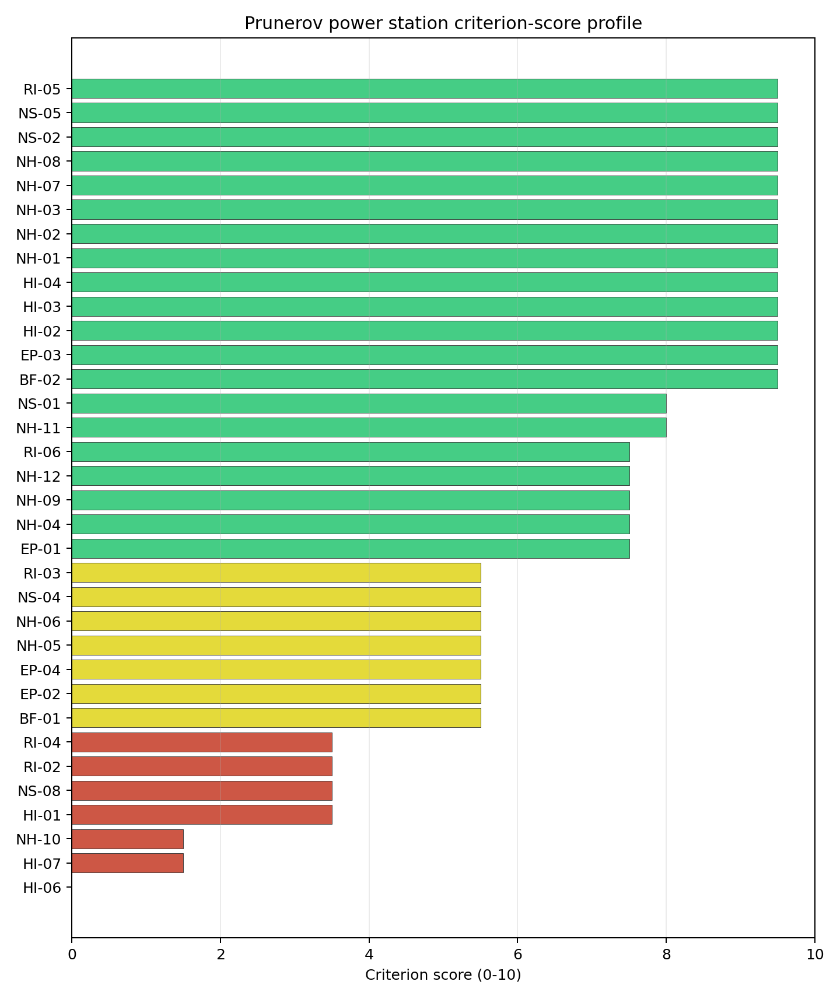
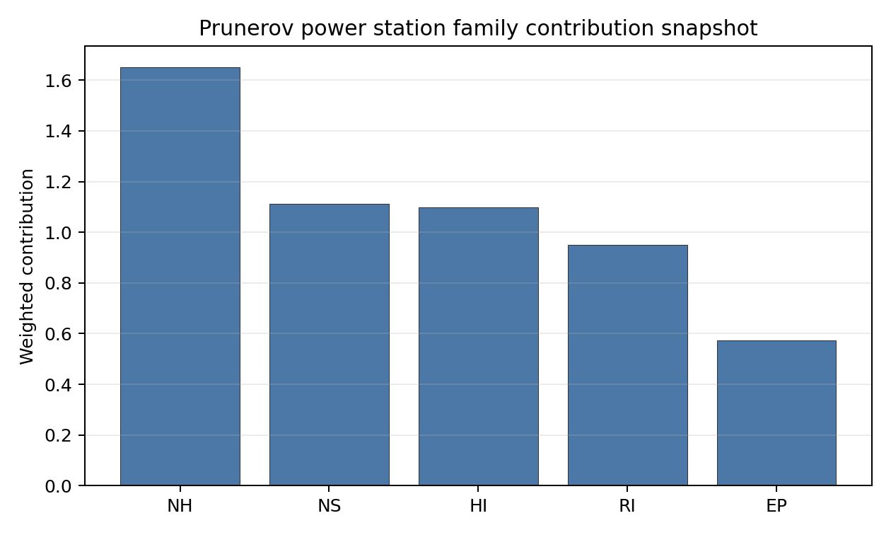

# Prunerov power station Site Profile

Prunerov power station is a coal/thermal site in Czechia that has been tested against the NuScale VOYGR-6 reference deployment envelope. This profile reads the screening evidence at a level that supports a decision to progress toward Stage 3 characterisation. It supports Stage 1-2 screening and defines the evidence needed before any Stage 3 judgement.

## Site Snapshot

| Field | Value |
| --- | --- |
| Site name | Prunerov power station |
| Coordinates | 50.4151, 13.2560 |
| Subnational unit | Ústí nad Labem |
| Installed thermal capacity (source data) | 2,240 MW |
| Available surface area | 300.0 ha |
| Available surface area for development | 74.0 ha |
| Composite score (baseline weights) | 7.016 (6.083-7.559 MC band) |
| National stability band | C (top-10% hit rate 67%) |
| National rank | 2 |

_See the country status map in_ [Czechia Country Profile](../CZ_country_prototype.md#country-status-map).

## Ownership and Coal-to-Nuclear Context

- **Government of Czech Republic** (69.80% share), headquartered in Czech Republic; immediate operator CEZ AS. Path: Government of Czech Republic  -> Ministry of Finance (Czech Republic)  [100.0%] -> CEZ AS [69.8%] -> Prunerov power station Phase 2 Unit B21 [100.0%]
- **natural person(s)** (13.00% share); immediate operator CEZ AS. Path: natural person(s)  -> CEZ AS [13.0%] -> Prunerov power station Phase 2 Unit B22 [100.0%]
- **small shareholder(s)** (17.00% share); immediate operator CEZ AS. Path: small shareholder(s)  -> CEZ AS [17.0%] -> Prunerov power station Phase 2 Unit B22 [100.0%]
- **CEZ AS** (100.00% share), headquartered in Czech Republic; immediate operator CEZ AS. Path: CEZ AS -> Prunerov power station Phase 2 Unit B21 [100.0%]
- **Ministry of Finance (Czech Republic)** (69.80% share), headquartered in Czech Republic; immediate operator CEZ AS. Path: Ministry of Finance (Czech Republic)  -> CEZ AS [69.8%] -> Prunerov power station Phase 2 Unit B21 [100.0%]

Generating units on record: 3 operating, 9 retired.
Earliest unit commissioning: 1968; most recent: 2016.
Retirements span 2012 to 2020, leaving brownfield grid, water, transport, and workforce assets that materially shorten Stage 3 site preparation.

## Natural Hazards (NH)

- **Seismic: Ground Motion (NH-01)** - score 9.5/10 (MC 9.0-10.0); favourable: Well below the risk boundary., weight 0.0455, data quality high. Evidence: PGA at 475-year return period 0.025 g; PGA at 2,475-year return period 0.048 g; Vs30 reference (m/s): 760.0.
- **Seismic: Surface Rupture (NH-02)** - score 9.5/10 (MC 9.0-10.0); favourable: Very strong separation from mapped capable faults; surface-rupture concern effectively screened at desk-study level., weight n/a, data quality screening grade. Evidence: nearest mapped capable fault 50.0 km; fault slip rate 0 mm/yr; fault name: none_in_search_radius.
- **Geotechnical: Liquefaction (NH-03)** - score 9.5/10 (MC 9.0-10.0); favourable: Negligible susceptibility (Stage-1 favourable default)., weight n/a, data quality medium. Evidence: liquefaction susceptibility: very_low; dominant soil type: silty_clay_loam.
- **Geotechnical: Slope Stability (NH-04)** - score 7.5/10 (MC 7.0-8.0), weight n/a, data quality screening grade. Evidence: site slope 9.61 deg; max slope in 1 km box 86.0 deg; slope stability class: moderate.
- **Geotechnical: Subsidence (NH-05)** - score 5.5/10 (MC 5.0-6.0); pass-mark band: At or above the mine-distance score-5 pivot; review possible., weight 0.0354, data quality medium. Evidence: karst present: no; karst severity: none.
- **Geotechnical: Foundation (NH-06)** - score 5.5/10 (MC 5.0-6.0); pass-mark band: Typical European mixed conditions (bearing 80-150 kPa)., weight 0.0253, data quality medium. Evidence: bearing capacity 83.3 kPa; depth to bedrock 20.5 m.
- **Volcanism (NH-07)** - score 9.5/10 (MC 9.0-10.0); favourable: Very strong margin above the score-5 boundary, with no in-radius signal in the screening evidence., weight n/a, data quality high. Evidence: volcanic hazard class: negligible.
- **Coastal Flooding (NH-08)** - score 9.5/10 (MC 9.0-10.0); favourable: Non-coastal OR elevation >= 50 m AMSL OR landlocked country, with no positive marine-hazard signal., weight 0.0303, data quality medium. Evidence: distance to coast 370.1 km.
- **River Flooding (NH-09)** - score 7.5/10 (MC 5.5-9.5), weight 0.0404, data quality insufficient. Evidence: flood zone class: negligible.
- **Extreme Winds (NH-10)** - score 1.5/10 (MC 1.0-2.0), weight 0.0152, data quality medium. Evidence: screening wind-speed index 12.8 m/s.
- **Extreme Precipitation (NH-11)** - score 8.0/10 (MC 8.0-9.0); favourable: aggregated(mean_of_sub_scores), weight 0.0152, data quality medium. Evidence: screening extreme-precipitation index 0.18 mm; screening precipitation index 27.4 mm/yr.
- **Extreme Temperatures (NH-12)** - score 7.5/10 (MC 7.0-8.0), weight 0.0202, data quality medium. Evidence: extreme high temperature 20.8 deg C; extreme low temperature -6.21 deg C.
- **Combined Hazards (NH-14)** - score no native score (unscored; no band matched), weight 0.0152, data quality n/a. Evidence: not measured at this site (criterion remains unscored).

### Interpretation - Natural Hazards (NH)

Natural hazards are generally supportive at this screening stage. Ground-motion evidence is low, with PGA of 0.025 g at the 475-year return period and 0.048 g at the 2,475-year return period; the nearest mapped capable fault is 50.0 km away. Flooding and coastal exposure are not the leading constraints: the flood-zone class is negligible and the site is 370.1 km from the coast. Stage 3 should focus on Geotechnical: Subsidence (NH-05), Geotechnical: Foundation (NH-06), Extreme Winds (NH-10), with particular attention to screening wind speed, mine or foundation evidence, and local hydrology where the bundle marks data quality below final-design standard.

## Human-Induced and Security-Relevant Hazards (HI)

- **Aircraft Crash (HI-01)** - score 3.5/10 (MC 3.0-4.0), weight 0.0354, data quality high. Evidence: nearest airport 2.88 km; nearest flight path 2.88 km; airports within search radius 15; airport name: Kadaň Hospital Heliport; airport type: heliport.
- **Industrial Explosions (HI-02)** - score 9.5/10 (MC 9.0-10.0); favourable: Very strong margin above the score-5 boundary, with no in-radius signal in the screening evidence., weight 0.0354, data quality medium. Evidence: values not in measurement tables.
- **Toxic/Gas Releases (HI-03)** - score 9.5/10 (MC 9.0-10.0); favourable: Very strong margin above the score-5 boundary, with no in-radius signal in the screening evidence., weight 0.0354, data quality medium. Evidence: values not in measurement tables.
- **External Fires (HI-04)** - score 9.5/10 (MC 9.0-10.0); favourable: > 15 km, with no flammable-storage signal in the screening radius., weight 0.0303, data quality medium. Evidence: values not in measurement tables.
- **Military Installations (HI-06)** - score 0.0/10 (MC 0.0-0.0), weight 0.0303, data quality high. Evidence: nearest military installation 1.59 km; military installations within radius 172; installation name: K-50/6/D2.
- **Electromagnetic Interference (HI-07)** - score 1.5/10 (MC 1.0-2.0), weight 0.0101, data quality medium. Evidence: nearest high-power transmitter 0.43 km; transmitters within radius 151; transmitter type: communication.

### Interpretation - Human-Induced and Security-Relevant Hazards (HI)

Human-induced hazards are the binding avoidance issue for this site. Aircraft Crash (HI-01) is flagged because the nearest recorded airport or heliport is 2.88 km away and the nearest flight-path proxy is 2.88 km away. The security file is also material: the nearest high-consequence military feature is 1.59 km away, and the nearest high-power transmitter is 0.43 km away. Industrial explosion, toxic-release and external-fire scores are favourable in the current screening record, so Stage 3 should prioritise aviation, security and RF/EMI confirmation before broader industrial-neighbour work.

## Radiological Impact and Emergency Planning (RI / EP)

- **Emergency Planning Feasibility (EP-01)** - score 7.5/10 (MC 7.0-8.0), weight n/a, data quality high. Evidence: EP feasibility composite 68.2 /100; road sub-score 62.6 /100; special-population sub-score 90.0 /100; geography sub-score 95.0 /100; population sub-score 80.0 /100; evacuation feasible: yes.
- **Evacuation Routes (EP-02)** - score 5.5/10 (MC 5.0-6.0); pass-mark band: Adequate primary routes (0.5-1.0)., weight 0.0303, data quality medium. Evidence: road density in EPZ 0.677 km/km2; road length in EPZ 1,329 km; motorway access: yes.
- **Physical Geography Constraints (EP-03)** - score 9.5/10 (MC 9.0-10.0); favourable: No measured relief; open river/waterway context (interim screening)., weight 0.0253, data quality medium. Evidence: waterways crossing EPZ 0; major river barrier: no.
- **Special Populations (EP-04)** - score 5.5/10 (MC 5.0-6.0); pass-mark band: 9-25., weight 0.0303, data quality medium. Evidence: hospitals in EPZ 13; prisons in EPZ 4; care homes in EPZ 0.
- **Atmospheric Dispersion (RI-01)** - score no native score (unscored; no band matched), weight 0.0303, data quality medium. Evidence: annual mean wind speed 1.49 m/s; atmospheric mixing height 536.9 m; prevailing wind direction: WSW.
- **Surface Water Dispersion (RI-02)** - score 3.5/10 (MC 3.0-4.0), weight 0.0253, data quality n/a. Evidence: values not in measurement tables.
- **Groundwater Dispersion (RI-03)** - score 5.5/10 (MC 5.0-6.0); pass-mark band: Moderate-permeability aquifer screening proxy., weight 0.0253, data quality medium. Evidence: aquifer type: volcanic rocks.
- **Population Density at EPZ Radii (RI-04)** - score 3.5/10 (MC 3.0-4.0), weight 0.0404, data quality screening grade. Evidence: population density within 5 km 189.7 /km2; population density within 16 km 125.8 /km2; population density within 25 km 99.7 /km2; population density within 80 km 183.1 /km2; population within 25 km 195,748 people.
- **Distance to Population Centres (RI-05)** - score 9.5/10 (MC 9.0-10.0); favourable: Nearest >=50k population-centre proxy exceeds required distance by >= 50 %., weight 0.0505, data quality screening grade. Evidence: nearest city above 50k people 13.8 km; nearest city population 65,208 people; city name: Chomutov-Jirkov.
- **Population Projections (RI-06)** - score 7.5/10 (MC 7.0-8.0), weight 0.0253, data quality screening grade. Evidence: annual population growth rate -0.492 %/yr; projected population at 25 km in 60 yr 188,626 people.

### Interpretation - Radiological Impact and Emergency Planning (RI / EP)

Radiological impact and emergency-planning evidence supports continued screening, but the population and liquid-pathway questions need refinement. Emergency Planning Feasibility (EP-01) is marked feasible with a composite score of 68.2 /100; road density in the emergency-planning zone is 0.677 km/km2 and motorway access is recorded. The 25 km population is 195,748, with density of 99.7 people/km2; the nearest city above 50,000 people is Chomutov-Jirkov at 13.8 km. Stage 3 should model EPZ clearance, special-population handling, atmospheric dispersion and low-flow water pathways before the emergency-planning case is hardened.

## Non-Safety and Implementation Considerations (NS)

- **Grid Capacity Basic Filter (BF-01)** - score 5.5/10 (MC 5.0-6.0); pass-mark band: Note: substation 15-30 km OR 110-219 kV; reinforcement plausible., weight n/a, data quality n/a. Evidence: values not in measurement tables.
- **Land Area Basic Filter (BF-02)** - score 9.5/10 (MC 9.0-10.0); favourable: Contiguous and buildable >= ideal area (70 ha/module)., weight 0.0253, data quality n/a. Evidence: values not in measurement tables.
- **Cooling Water Availability (NS-01)** - score 8.0/10 (MC 7.0-8.0); favourable: aggregated(weighted_mean_of_sub_scores), weight 0.0404, data quality screening grade. Evidence: distance to cooling source 3.78 km; cooling source flow 24.5 m3/s; cooling source type: river; cooling source name: Prunéřovský potok; water stress label: Low.
- **Grid Connection (NS-02)** - score 9.5/10 (MC 9.0-10.0); favourable: aggregated(min_of_sub_scores), weight 0.0404, data quality high. Evidence: nearest substation 0.45 km; nearest high-voltage line 0.38 km; grid export capacity 2,240 MW; substations within radius 1,133; HV lines within radius 1,115.
- **Transport Access (NS-03)** - score no native score (unscored; no band matched), weight 0.0404, data quality low. Evidence: not measured at this site (criterion remains unscored).
- **Site Topography (NS-04)** - score 5.5/10 (MC 5.0-6.0); pass-mark band: 40-60 %., weight 0.0303, data quality screening grade. Evidence: favourable land cover 49.0 %; moderate land cover 7 %; unfavourable land cover 14.5 %; favourable area 91.0 ha; dominant land class: 324.
- **Site Footprint Adequacy (NS-05)** - score 9.5/10 (MC 9.0-10.0); favourable: Very strong margin above the score-5 boundary., weight 0.0253, data quality high. Evidence: buildable area 74.0 ha; largest contiguous patch 74.0 ha; buildable patch count 14.
- **Existing Infrastructure (NS-06)** - score no native score (unscored; no band matched), weight 0.0253, data quality n/a. Evidence: not measured at this site (criterion remains unscored).
- **Ecological Sensitivity (NS-08)** - score 3.5/10 (MC 3.0-4.0), weight n/a, data quality high. Evidence: natural land cover 14.5 %; distance to nearest Natura 2000 site 2.171 km; distance to nearest protected area 2.813 km; Natura 2000 overlap: no; Natura 2000 sensitivity class: moderate; protected-area overlap: no; protected-area sensitivity class: moderate; nearest Natura 2000 site: Kokrháč - Hasištejn; Natura 2000 sites within 5 km: 4; nearest protected-area designation: Nature Monument.
- **Workforce Availability (NS-10)** - score no native score (unscored; no band matched), weight 0.0202, data quality n/a. Evidence: not measured at this site (criterion remains unscored).
- **Regulatory/Political Environment (NS-12)** - score no native score (unscored; no band matched), weight 0.0303, data quality n/a. Evidence: not measured at this site (criterion remains unscored).
- **Construction Logistics (NS-13)** - score no native score (unscored; no band matched), weight 0.0202, data quality n/a. Evidence: not measured at this site (criterion remains unscored).

### Interpretation - Non-Safety and Implementation Considerations (NS)

Non-safety implementation conditions are the main reason the selected Czech sites remain credible despite avoidance flags. Cooling evidence identifies Prunéřovský potok as the nearest source, 3.78 km away, with flow of 24.5 m3/s and a Low water-stress label. Grid proximity is strong where measured: the nearest substation is 0.45 km away, the nearest high-voltage line is 0.38 km away, and the inherited export-capacity estimate is 2240 MW. The canonical site surface area is 300.0 ha; the wider screening-stage favourable-area envelope is 91.0 ha and should be treated as potential laydown or expansion context, not development-ready land. Ecological screening and unscored transport or implementation criteria remain normal Stage 3 follow-up items.

## Composite Score and Stability

Baseline composite score is 7.016, bracketed by Monte Carlo at 6.083-7.559. National stability band is `C` with a top-10% hit rate of 67% in the project's 50,000-iteration national sensitivity analysis.

The site records a baseline composite score of 7.016, with a Monte Carlo bracket of 6.083-7.559. Its national stability band is C, with a national top-10% hit rate of 67%. This places the site at national rank 2 in the frozen ranking, but the overlapping top-five intervals mean the rank should guide sequencing rather than settle final preference. Family scores after the unscored-criterion treatment are EP 6.68, HI 6.21, NH 7.27, NS 8.17, RI 6.71; the Stage 3 priority is therefore to retire the avoidance flags and low-scoring criteria that could change the site boundary or emergency-planning case.

## Residual Risk Register

| Concern | Evidence | Consequence | Stage 3 action | Owner discipline |
| --- | --- | --- | --- | --- |
| Aircraft crash avoidance flag | Nearest airport 2.88 km; nearest flight-path proxy 2.88 km | May constrain the usable nuclear island envelope or require detailed aviation-route demonstration. | Run airport, heliport and flight-path micro-siting review against the NuScale reference envelope. | aviation / safety |
| Military and security proximity | Nearest high-consequence military feature 1.59 km; military features in search radius 172 | Security standoff and emergency-zone coordination could reshape the candidate area. | Confirm feature classification, activity status, and required protective separation with national authorities. | security |
| Electromagnetic interference | Nearest high-power transmitter 0.43 km; transmitter count 151 | RF/EMI controls may affect instrumentation, communications and site layout. | Survey transmitter inventory, field strength and shielding or separation needs. | electrical / security |
| Ecological sensitivity | Nearest Natura 2000 site 2.17 km; nearest protected area 2.81 km | Permitting envelope may narrow even without a direct protected-area overlap. | Run protected-area boundary confirmation, receptor-pathway screening and EIA scoping. | environment |
| Surface-water dispersion | Cooling source Prunéřovský potok; flow 24.5 m3/s | Liquid-pathway dilution and discharge assumptions remain screening-grade. | Model low-flow, intake, discharge and downstream-user pathways. | hydrology |

The register defines follow-up work for Stage 3. Approval, licensing readiness and procurement decisions require later evidence beyond this screening profile.

## Stage 3 Follow-Up Checklist

| Action | Evidence basis | Purpose |
| --- | --- | --- |
| Run airport, heliport and flight-path micro-siting review against the NuScale reference envelope. | Aircraft crash avoidance flag: Nearest airport 2.88 km; nearest flight-path proxy 2.88 km | Reduce the main residual uncertainty before detailed site characterisation. |
| Confirm feature classification, activity status, and required protective separation with national authorities. | Military and security proximity: Nearest high-consequence military feature 1.59 km; military features in search radius 172 | Reduce the main residual uncertainty before detailed site characterisation. |
| Survey transmitter inventory, field strength and shielding or separation needs. | Electromagnetic interference: Nearest high-power transmitter 0.43 km; transmitter count 151 | Reduce the main residual uncertainty before detailed site characterisation. |
| Run protected-area boundary confirmation, receptor-pathway screening and EIA scoping. | Ecological sensitivity: Nearest Natura 2000 site 2.17 km; nearest protected area 2.81 km | Reduce the main residual uncertainty before detailed site characterisation. |
| Model low-flow, intake, discharge and downstream-user pathways. | Surface-water dispersion: Cooling source Prunéřovský potok; flow 24.5 m3/s | Reduce the main residual uncertainty before detailed site characterisation. |
| Close unscored or low-confidence evidence gaps. | Grid Capacity Basic Filter (BF-01), Land Area Basic Filter (BF-02), Seismic: Surface Rupture (NH-02), Geotechnical: Slope Stability (NH-04). | Improve confidence in the composite score and implementation work plan. |

## Evidence Limitations

- Grid Capacity Basic Filter (BF-01) - evidence quality `low`.
- Land Area Basic Filter (BF-02) - evidence quality `low`.
- Seismic: Surface Rupture (NH-02) - evidence quality `low`.
- Geotechnical: Slope Stability (NH-04) - evidence quality `low`.
- Extreme Precipitation (NH-11) - evidence quality `low`.
- Combined Hazards (NH-14) - evidence quality `unscored`.
- Cooling Water Availability (NS-01) - evidence quality `low`.
- Grid Connection (NS-02) - evidence quality `low`.
- Transport Access (NS-03) - evidence quality `unscored`.
- Site Topography (NS-04) - evidence quality `low`.
