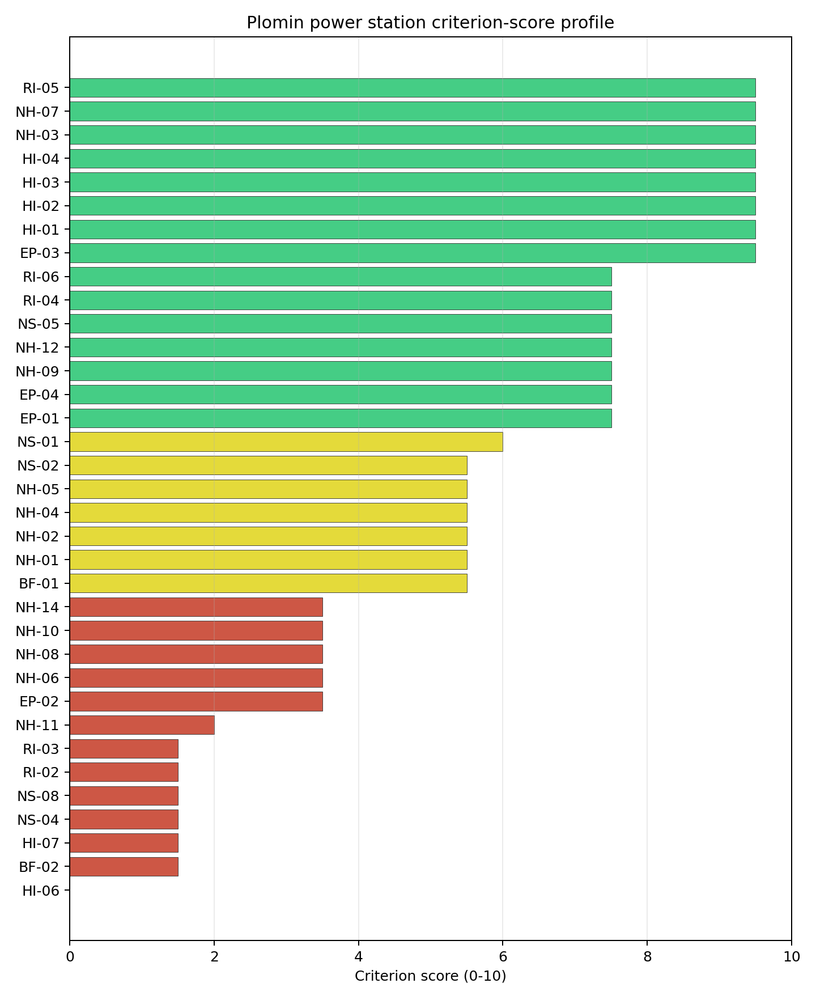

# Plomin power station Site Profile

Plomin power station is a coal/thermal site in Croatia that has been tested against the NuScale VOYGR-6 reference deployment envelope. This profile reads the screening evidence at a level that supports a decision to progress toward Stage 3 characterisation. It is not a site-suitability determination, vendor recommendation, or licensing finding.

## Site Snapshot

| Field | Value |
| --- | --- |
| Site name | Plomin power station |
| Coordinates | 45.1368, 14.1627 |
| Subnational unit | Istra |
| Installed thermal capacity (source data) | 842 MW |
| Available surface area | 30.0 ha |
| Available surface area for development | 21.1 ha |
| Composite score (baseline weights) | 6.214 (5.467-6.730 MC band) |
| National stability band | A (top-10% hit rate 100%) |
| National rank | 1 |

_See the country status map in_ [Croatia Country Profile](../HR_country_prototype.md#country-status-map).

## Ownership and Coal-to-Nuclear Context

The ownership record identifies Hrvatska elektroprivreda dd as the owner/operator and records a Government of Croatia ownership path through Hrvatska elektroprivreda dd. Unit-level shares are incomplete for the operating and mothballed phases, so legal control, site rights and any reuse mandate should be confirmed before Stage 3 procurement or permitting work is framed.

Generating units on record: 1 cancelled, 1 mothballed, 1 operating.
Earliest unit commissioning: 1969; most recent: 2016.

## Natural Hazards (NH)

- **Seismic: Ground Motion (NH-01)** - score 5.5/10 (MC 5.0-6.0) - pass-mark band: At or below the score-5 risk boundary., weight 0.0455, data quality high. Evidence: PGA at 475-year return period 0.166 g; PGA at 2,475-year return period 0.381 g; Vs30 reference (m/s): 760.0.
- **Seismic: Surface Rupture (NH-02)** - score 5.5/10 (MC 5.0-6.0) - pass-mark band: Borderline acceptable separation: meets the 8.0 km score boundary; check against the 8 km conservative screen and local capability evidence., weight n/a, data quality screening grade. Evidence: nearest mapped capable fault 15.9 km; fault slip rate 0.102 mm/yr; fault name: HRCF00T.
- **Geotechnical: Liquefaction (NH-03)** - score 9.5/10 (MC 9.0-10.0) - favourable: Negligible susceptibility (Stage-1 favourable default)., weight n/a, data quality medium. Evidence: liquefaction susceptibility: very_low; dominant soil type: clay_loam.
- **Geotechnical: Slope Stability (NH-04)** - score 5.5/10 (MC 5.0-6.0) - pass-mark band: At or below the score-5 risk boundary., weight n/a, data quality screening grade. Evidence: site slope 11.9 deg; max slope in 1 km box 85.4 deg; slope stability class: steep.
- **Geotechnical: Subsidence (NH-05)** - score 5.5/10 (MC 5.0-6.0) - pass-mark band: At or above the mine-distance score-5 pivot; review possible., weight 0.0354, data quality medium. Evidence: karst present: no; karst severity: moderate; formation type: carbonate (Continuous carbonate rocks).
- **Geotechnical: Foundation (NH-06)** - score 3.5/10 (MC 3.0-4.0), weight 0.0253, data quality medium. Evidence: bearing capacity 77.3 kPa; depth to bedrock 18.2 m.
- **Volcanism (NH-07)** - score 9.5/10 (MC 9.0-10.0) - favourable: Very strong margin above the score-5 boundary, or no in-radius signal confirmed., weight n/a, data quality high. Evidence: volcanic hazard class: negligible.
- **Coastal Flooding (NH-08)** - score 3.5/10 (MC 3.0-4.0), weight 0.0303, data quality medium. Evidence: distance to coast 3.51 km.
- **River Flooding (NH-09)** - score 7.5/10 (MC 7.0-8.0), weight 0.0404, data quality medium. Evidence: flood zone class: negligible.
- **Extreme Winds (NH-10)** - score 3.5/10 (MC 3.0-4.0), weight 0.0152, data quality medium. Evidence: screening wind-speed index 11.1 m/s.
- **Extreme Precipitation (NH-11)** - score 2.0/10 (MC 2.0-3.0), weight 0.0152, data quality medium. Evidence: screening extreme-precipitation index 0.82 mm; screening precipitation index 65.5 mm/yr.
- **Extreme Temperatures (NH-12)** - score 7.5/10 (MC 7.0-8.0), weight 0.0202, data quality medium. Evidence: extreme high temperature 24.7 deg C; extreme low temperature 0.27 deg C.
- **Combined Hazards (NH-14)** - score 3.5/10 (MC 3.0-4.0), weight 0.0152, data quality n/a. Evidence: values not in measurement tables.

### Interpretation - Natural Hazards (NH)

Natural hazards at Plomin support continued screening, but the site remains avoidance-flagged because coastal flooding is unresolved. Ground motion is moderate for the reference envelope, with PGA of 0.166 g at the 475-year return period and 0.381 g at the 2,475-year return period. The nearest mapped capable fault is 15.9 km away, so surface rupture does not drive the exclusionary result for this site. The controlling natural-hazard question is different: Coastal Flooding (NH-08) scores 3.5/10 because the site is 3.51 km from the coast at 5.88 m elevation, with storm-surge and tsunami proxies still unconfirmed. The local ground file also needs field confirmation. Mean site slope is 11.9 degrees, the maximum slope in the one-kilometre box is 85.4 degrees, bearing capacity is 77.3 kPa, and depth to bedrock is 18.2 m. Extreme wind and precipitation also sit in the lower score range, with 11.1 m/s design wind, 65.5 mm/year screening precipitation index and 0.82 mm screening extreme-precipitation index, values that should be checked against national hydrometeorological records before design use. Stage 3 should therefore start with coastal inundation and tsunami screening, followed by boreholes, slope-stability checks and local hydrology confirmation for the buildable patch.

## Human-Induced and Security-Relevant Hazards (HI)

- **Aircraft Crash (HI-01)** - score 9.5/10 (MC 9.0-10.0) - favourable: Only small / GA / heliport airport >= 10 km nearby, no flight-path proxy < 4 km, no major airport within 30 km, and no military airbase within 60 km., weight 0.0354, data quality high. Evidence: nearest airport 26.6 km; nearest flight path 16.5 km; airports within search radius 1; airport name: Cres Heliport; airport type: heliport.
- **Industrial Explosions (HI-02)** - score 9.5/10 (MC 9.0-10.0) - favourable: Very strong margin above the score-5 boundary (or completed search confirmed no in-radius signal)., weight 0.0354, data quality medium. Evidence: values not in measurement tables.
- **Toxic/Gas Releases (HI-03)** - score 9.5/10 (MC 9.0-10.0) - favourable: Very strong margin above the score-5 boundary (or completed search confirmed no in-radius signal)., weight 0.0354, data quality medium. Evidence: values not in measurement tables.
- **External Fires (HI-04)** - score 9.5/10 (MC 9.0-10.0) - favourable: > 15 km, or completed flammable-storage search found nothing in radius., weight 0.0303, data quality medium. Evidence: values not in measurement tables.
- **Military Installations (HI-06)** - score 0.0/10 (MC 0.0-0.0), weight 0.0303, data quality high. Evidence: nearest military installation 4.25 km; military installations within radius 4; installation name: unnamed.
- **Electromagnetic Interference (HI-07)** - score 1.5/10 (MC 1.0-2.0), weight 0.0101, data quality medium. Evidence: nearest high-power transmitter 1.67 km; transmitters within radius 41; transmitter type: communication.

### Interpretation - Human-Induced and Security-Relevant Hazards (HI)

Human-induced and security-relevant hazards at Plomin are mixed: aviation and industrial hazards are favourable, while military and electromagnetic-interference evidence require early Stage 3 confirmation. Aircraft Crash (HI-01) is strong, with the nearest airport feature, Cres Heliport, 26.6 km away, the nearest flight-path proxy 16.5 km away, and the nearest major airport 33.0 km away. Industrial Explosions (HI-02), Toxic/Gas Releases (HI-03), and External Fires (HI-04) also score 9.5/10 because the available screening record does not identify a nearby hazardous facility in the relevant radius. The binding issue is Military Installations (HI-06), which scores 0.0/10: the nearest depot-class military feature is 4.25 km away and four military features are recorded within 25 km. Electromagnetic Interference (HI-07) is the second weak point, with the nearest communication transmitter 1.67 km away and 41 transmitters in the search radius. Stage 3 should therefore open with Croatian defence engagement on the depot classification and required security standoff, followed by an RF/EMI survey and a refreshed hazardous-neighbour inventory for the coastal industrial and transport setting.

## Radiological Impact and Emergency Planning (RI / EP)

- **Emergency Planning Feasibility (EP-01)** - score 7.5/10 (MC 7.0-8.0), weight n/a, data quality high. Evidence: EP feasibility composite 70.0 /100; road sub-score 49.1 /100; special-population sub-score 90.0 /100; geography sub-score 95.0 /100; population sub-score 95.0 /100; evacuation feasible: yes.
- **Evacuation Routes (EP-02)** - score 3.5/10 (MC 3.0-4.0), weight 0.0303, data quality medium. Evidence: road density in EPZ 0.451 km/km2; road length in EPZ 885.3 km; motorway access: yes.
- **Physical Geography Constraints (EP-03)** - score 9.5/10 (MC 9.0-10.0) - favourable: No measured relief; open river/waterway context (interim screening)., weight 0.0253, data quality medium. Evidence: waterways crossing EPZ 0; major river barrier: no.
- **Special Populations (EP-04)** - score 7.5/10 (MC 7.0-8.0), weight 0.0303, data quality medium. Evidence: hospitals in EPZ 7; prisons in EPZ 0; care homes in EPZ 0.
- **Atmospheric Dispersion (RI-01)** - score no native score (unscored - no band matched), weight 0.0303, data quality medium. Evidence: annual mean wind speed 1.5 m/s; atmospheric mixing height 431.6 m; prevailing wind direction: NE.
- **Surface Water Dispersion (RI-02)** - score 1.5/10 (MC 1.0-2.0), weight 0.0253, data quality n/a. Evidence: values not in measurement tables.
- **Groundwater Dispersion (RI-03)** - score 1.5/10 (MC 1.0-2.0), weight 0.0253, data quality medium. Evidence: aquifer type: karsts and chalkstones.
- **Population Density at EPZ Radii (RI-04)** - score 7.5/10 (MC 7.0-8.0), weight 0.0404, data quality screening grade. Evidence: population density within 5 km 47.0 /km2; population density within 16 km 31.1 /km2; population density within 25 km 27.7 /km2; population density within 80 km 45.3 /km2; population within 25 km 54,410 people.
- **Distance to Population Centres (RI-05)** - score 9.5/10 (MC 9.0-10.0) - favourable: Nearest >=50k population-centre proxy exceeds required distance by >= 50 %., weight 0.0505, data quality screening grade. Evidence: nearest city above 50k people 31.2 km; nearest city population 102,415 people; city name: Rijeka.
- **Population Projections (RI-06)** - score 7.5/10 (MC 7.0-8.0), weight 0.0253, data quality screening grade. Evidence: annual population growth rate -0.494 %/yr; projected population at 25 km in 60 yr 41,042 people.

### Interpretation - Radiological Impact and Emergency Planning (RI / EP)

Radiological impact and emergency-planning conditions are one of Plomin's stronger screening dimensions, but evacuation, surface-water and groundwater pathways need early characterisation. Population pressure is relatively low: the record shows 3,690 people within 5 km, 54,410 within 25 km and 910,646 within 80 km. Population density is 47.0 people/km2 at 5 km and 27.7 people/km2 at 25 km, while Rijeka, the nearest city above 50,000 people, is 31.2 km away. The 60-year population projection is also favourable, with the 25 km population falling to 41,042 people. Emergency Planning Feasibility (EP-01) scores 70.0/100 and is marked feasible, but the road sub-score is only 49.1/100 and Evacuation Routes (EP-02) scores 3.5/10 despite 885.3 km of road and motorway access. Atmospheric dispersion remains screening-grade, with annual mean wind speed of 1.5 m/s, a 431.6 m mixing height and a prevailing NE wind direction. The weaker radiological-pathway items are Surface Water Dispersion (RI-02), which scores 1.5/10 without measured flow evidence in the criterion row, and Groundwater Dispersion (RI-03), which scores 1.5/10 in a karsts-and-chalkstones aquifer setting. Stage 3 should model EPZ time-to-clear for seasonal traffic, quantify liquid-pathway behaviour, and confirm the site-specific meteorological basis before emergency-planning claims are hardened.

## Non-Safety and Implementation Considerations (NS)

- **Grid Capacity Basic Filter (BF-01)** - score 5.5/10 (MC 5.0-6.0) - pass-mark band: Note: substation 15-30 km OR 110-219 kV; reinforcement plausible., weight n/a, data quality n/a. Evidence: values not in measurement tables.
- **Land Area Basic Filter (BF-02)** - score 1.5/10 (MC 1.0-2.0), weight 0.0253, data quality n/a. Evidence: values not in measurement tables.
- **Cooling Water Availability (NS-01)** - score 6.0/10 (MC 6.0-7.0) - pass-mark band: aggregated(weighted_mean_of_sub_scores), weight 0.0404, data quality screening grade. Evidence: distance to cooling source 6.59 km; cooling source flow 4.91 m3/s; cooling source type: small_river; cooling source name: Boljunčica; water stress label: Low.
- **Grid Connection (NS-02)** - score 5.5/10 (MC 5.0-6.0) - pass-mark band: aggregated(min_of_sub_scores), weight 0.0404, data quality high. Evidence: nearest substation 0.32 km; nearest high-voltage line 0.3 km; highest nearby line voltage 110.0 kV; grid export capacity 842.0 MW; substations within radius 291; HV lines within radius 384.
- **Transport Access (NS-03)** - score no native score (unscored - no band matched), weight 0.0404, data quality low. Evidence: not measured at this site (criterion remains unscored).
- **Site Topography (NS-04)** - score 1.5/10 (MC 1.0-2.0), weight 0.0303, data quality screening grade. Evidence: favourable land cover 6.4 %; moderate land cover 15.9 %; unfavourable land cover 71.0 %; favourable area 7.49 ha; dominant land class: 311.
- **Site Footprint Adequacy (NS-05)** - score 7.5/10 (MC 7.0-8.0), weight 0.0253, data quality high. Evidence: buildable area 21.1 ha; largest contiguous patch 21.1 ha; buildable patch count 8.
- **Existing Infrastructure (NS-06)** - score no native score (unscored - no band matched), weight 0.0253, data quality n/a. Evidence: not measured at this site (criterion remains unscored).
- **Ecological Sensitivity (NS-08)** - score 1.5/10 (MC 1.0-2.0), weight n/a, data quality high. Evidence: natural land cover 71.0 %; distance to nearest Natura 2000 site 2.968 km; distance to nearest protected area 1.567 km; Natura 2000 overlap: no; Natura 2000 sensitivity class: moderate; protected-area overlap: no; protected-area sensitivity class: moderate; nearest Natura 2000 site: Čepić tunel; Natura 2000 sites within 5 km: 4; nearest protected-area designation: Significant Landscape.
- **Workforce Availability (NS-10)** - score no native score (unscored - no band matched), weight 0.0202, data quality n/a. Evidence: not measured at this site (criterion remains unscored).
- **Regulatory/Political Environment (NS-12)** - score no native score (unscored - no band matched), weight 0.0303, data quality n/a. Evidence: not measured at this site (criterion remains unscored).
- **Construction Logistics (NS-13)** - score no native score (unscored - no band matched), weight 0.0202, data quality n/a. Evidence: not measured at this site (criterion remains unscored).

### Interpretation - Non-Safety and Implementation Considerations (NS)

Non-safety implementation is Plomin's most constrained family. The site has useful inherited infrastructure, but the land, terrain and ecological envelope is tight for a NuScale VOYGR-6 reference case. The canonical site footprint is 30.0 ha and the current buildable-area estimate is 21.1 ha; this supports continued screening but leaves the Land Area Basic Filter (BF-02) at 1.5/10. Site Topography (NS-04) also scores 1.5/10, with only 6.4% favourable land cover, 15.9% moderate land cover and 71.0% unfavourable land cover. The 7.49 ha favourable-area value is a wider screening indicator, not proof of available, permitted or contiguous development land. Cooling Water Availability (NS-01) scores 6.0/10, with the Boljunčica source 6.59 km away and a recorded flow of 4.91 m3/s under a Low water-stress label. Grid Connection (NS-02) is workable but not definitive, with the nearest substation 0.32 km away, the nearest high-voltage line 0.30 km away, a highest nearby voltage of 110 kV and an 842 MW grid export-capacity estimate. Ecological Sensitivity (NS-08) is the main non-safety constraint, scoring 1.5/10 because Čepić tunel is 2.968 km away, four Natura 2000 sites sit within 5 km, and the nearest protected area is 1.567 km away. Stage 3 should confirm the land envelope, ecological assessment pathway, grid-voltage upgrade route, cooling basis and ownership rights before any layout claim is made.

## Composite Score and Stability

Baseline composite score is 6.214, bracketed by Monte Carlo at 5.467-6.730. National stability band is `A` with a top-10% hit rate of 100% across 12 scored Monte Carlo scenarios.

Plomin's baseline composite score is 6.214, bracketed by a Monte Carlo interval of 5.467-6.730. The national stability band is A, and the site records 100% top-5, top-10 and top-30 hit rates across 12 scored national sensitivity scenarios. That is a robust national signal, but it needs careful interpretation because Croatia has only one scored site: Plomin is stable within the Croatian pool while still carrying an avoidance flag. The score is supported by Distance to Population Centres (RI-05), Aircraft Crash (HI-01), Industrial Explosions (HI-02), Toxic/Gas Releases (HI-03), River Flooding (NH-09), Population Density (RI-04), and Grid Connection (NS-02). The same composite is pulled down by Military Installations (HI-06), Land Area Basic Filter (BF-02), Electromagnetic Interference (HI-07), Site Topography (NS-04), Ecological Sensitivity (NS-08), Surface Water Dispersion (RI-02), and Groundwater Dispersion (RI-03). Stage 3 should therefore narrow the uncertainty band by resolving NH-08 coastal exposure, confirming the buildable land envelope, and testing the security, ecological and liquid-pathway assumptions before Plomin is treated as a clean progression candidate.

## Residual Risk Register

| Concern | Evidence | Consequence | Stage 3 action | Owner discipline |
| --- | --- | --- | --- | --- |
| Coastal Flooding (NH-08) | Coast distance 3.51 km; site elevation 5.88 m | Storm-surge or tsunami exposure could keep the site in avoidance status | Model coastal inundation, storm surge and tsunami exposure for the Plomin Bay setting | hydrology |
| Land Area Basic Filter (BF-02) and Site Topography (NS-04) | Site footprint 30.0 ha; buildable area 21.1 ha; favourable land cover 6.4% | Layout, laydown or earthworks constraints could limit a VOYGR-6 envelope | Re-survey the controlled land boundary, terrain and contiguous buildable patch | geotech |
| Ecological Sensitivity (NS-08) | Čepić tunel is 2.968 km away; four Natura 2000 sites lie within 5 km | Permitting could narrow the usable site envelope or require early design changes | Confirm receptor pathways and appropriate-assessment triggers | EIA |
| Military Installations (HI-06) | Nearest depot-class feature 4.25 km away; four military features within 25 km | Security standoff or emergency-zone coordination could affect siting boundaries | Engage Croatian defence authorities on feature classification and required standoff | security |
| Electromagnetic Interference (HI-07) | Nearest transmitter 1.67 km away; 41 transmitters in the search radius | RF/EMI constraints may require equipment qualification or exclusion-zone controls | Survey transmitter inventory, field strengths and control measures | security |
| Surface Water and Groundwater Dispersion (RI-02 / RI-03) | Surface-water criterion row lacks measured flow evidence; aquifer type is karsts and chalkstones | Liquid-pathway assumptions may be too coarse for emergency-planning and dose-pathway screening | Quantify site-specific liquid pathways, groundwater behaviour and receiving-water assumptions | hydrology |

The dominant residual risks are NH-08, the constrained land envelope, and ecological sensitivity because they could determine whether Plomin moves from an avoidance-flagged screened site to a clean Stage 3 candidate. HI-06, HI-07 and the liquid-pathway questions are characterisation tasks that should run in parallel. The register is a Stage 3 work plan, not a finding of final site suitability.

## Stage 3 Follow-Up Checklist

- Resolve **Coastal Flooding (NH-08)** avoidance flag by modelling the 3.51 km coast-distance and 5.88 m elevation case for storm surge and tsunami exposure.
- Re-measure **Military Installations (HI-06)** - native score 0.0/10 with confidence high.
- Re-measure **Land Area Basic Filter (BF-02)** - native score 1.5/10 with confidence insufficient.
- Re-measure **Electromagnetic Interference (HI-07)** - native score 1.5/10 with confidence medium.
- Re-measure **Site Topography (NS-04)** - native score 1.5/10 with confidence medium.
- Re-measure **Ecological Sensitivity (NS-08)** - native score 1.5/10 with confidence high.
- Improve data quality for **Transport Access (NS-03)** - current flag `low`.

## Evidence Limitations

- Transport Access (NS-03) - quality `low`.
