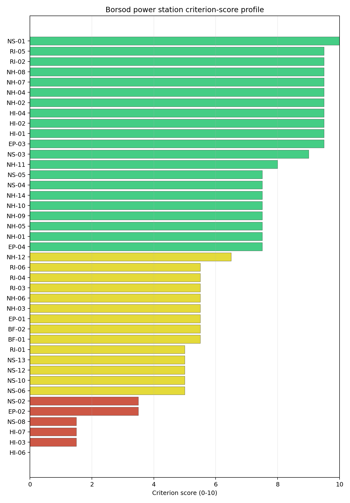
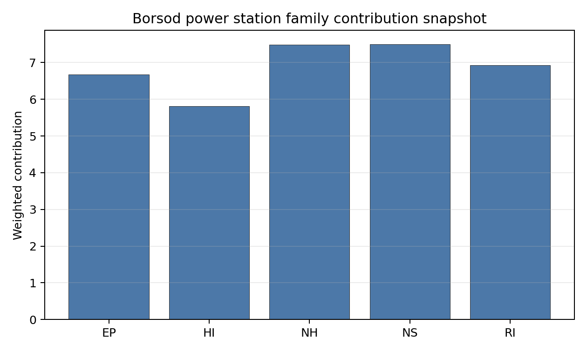

# Borsod power station Site Profile

Borsod power station is a coal/thermal site in Hungary that has been tested against the NuScale VOYGR-6 reference deployment envelope. This profile reads the screening evidence at a level that supports a decision to progress toward Stage 3 characterisation. It is not a site-suitability determination, vendor recommendation, or licensing finding.

## Site Snapshot

| Field | Value |
| --- | --- |
| Site name | Borsod power station |
| Coordinates | 47.9048, 21.0553 |
| Subnational unit | Northern Hungary |
| Installed thermal capacity (source data) | 420 MW |
| Available surface area | 66.0 ha |
| Available surface area for development | 66.0 ha |
| Composite score (baseline weights) | 6.941 (6.184-7.381 MC band) |
| National stability band | D (top-10% hit rate 0%) |
| National rank | 2 |

_See the country status map in_ [Hungary Country Profile](../HU_country_prototype.md#country-status-map).

## Ownership and Coal-to-Nuclear Context

- **Blackrock Advisors LLC** (0.36% share), headquartered in United States; immediate operator AES Corp. Path: Blackrock Advisors LLC -> BlackRock Inc [5.07%] -> AES Corp [7.09%] -> Borsod power station New Unit 2 [100.0%]
- **AES Corp** (100.00% share), headquartered in United States; immediate operator AES Corp. Path: AES Corp -> Borsod power station Unit 3 [100.0%]
- **BlackRock Inc** (7.09% share), headquartered in United States; immediate operator AES Corp. Path: BlackRock Inc -> AES Corp [7.09%] -> Borsod power station New Unit 2 [100.0%]
- **small shareholder(s)** (80.58% share); immediate operator AES Corp. Path: small shareholder(s)  -> AES Corp [80.58%] -> Borsod power station Unit 1 [100.0%]
- **The Vanguard Group Inc** (12.33% share), headquartered in United States; immediate operator AES Corp. Path: The Vanguard Group Inc -> AES Corp [12.33%] -> Borsod power station New Unit 2 [100.0%]

Generating units on record: 2 cancelled, 3 retired.
Earliest unit commissioning: 1951; most recent: 1951.
Retirements span 2011 to 2011, leaving brownfield grid, water, transport, and workforce assets that materially shorten Stage 3 site preparation.

## Natural Hazards (NH)

- **Seismic: Ground Motion (NH-01)** - score 7.5/10 (MC 7.0-8.0), weight 0.0455, data quality high. Evidence: PGA at 475-year return period 0.045 g; PGA at 2,475-year return period 0.105 g; Vs30 reference (m/s): 760.0.
- **Seismic: Surface Rupture (NH-02)** - score 9.5/10 (MC 9.0-10.0), weight n/a, data quality screening grade. Evidence: nearest mapped capable fault 50.0 km; fault slip rate 0 mm/yr; fault name: none_in_search_radius.
- **Geotechnical: Liquefaction (NH-03)** - score 5.5/10 (MC 5.0-6.0), weight n/a, data quality medium. Evidence: liquefaction susceptibility: high; dominant soil type: clay_loam.
- **Geotechnical: Slope Stability (NH-04)** - score 9.5/10 (MC 9.0-10.0), weight n/a, data quality screening grade. Evidence: site slope 3.57 deg; max slope in 1 km box 41.7 deg; slope stability class: gentle.
- **Geotechnical: Subsidence (NH-05)** - score 7.5/10 (MC 7.0-8.0), weight 0.0354, data quality medium. Evidence: karst present: no; karst severity: none.
- **Geotechnical: Foundation (NH-06)** - score 5.5/10 (MC 5.0-6.0), weight 0.0253, data quality medium. Evidence: bearing capacity 84.0 kPa; depth to bedrock 22.8 m.
- **Volcanism (NH-07)** - score 9.5/10 (MC 9.0-10.0), weight n/a, data quality high. Evidence: volcanic hazard class: negligible.
- **Coastal Flooding (NH-08)** - score 9.5/10 (MC 9.0-10.0), weight 0.0303, data quality medium. Evidence: distance to coast 569.9 km.
- **River Flooding (NH-09)** - score 7.5/10 (MC 7.0-8.0), weight 0.0404, data quality medium. Evidence: flood zone class: negligible.
- **Extreme Winds (NH-10)** - score 7.5/10 (MC 7.0-8.0), weight 0.0152, data quality medium. Evidence: screening wind-speed index 7.71 m/s.
- **Extreme Precipitation (NH-11)** - score 8.0/10 (MC 8.0-9.0), weight 0.0152, data quality medium. Evidence: screening extreme-precipitation index 0.23 mm; screening precipitation index 21.2 mm/yr.
- **Extreme Temperatures (NH-12)** - score 6.5/10 (MC 6.0-7.0), weight 0.0202, data quality medium. Evidence: extreme high temperature 25.9 deg C; extreme low temperature -6.51 deg C.
- **Combined Hazards (NH-14)** - score 7.5/10 (MC 7.0-8.0), weight 0.0152, data quality n/a. Evidence: values not in measurement tables.

### Interpretation - Natural Hazards (NH)

Natural hazards at Borsod are favourable overall, with the main Stage 3 questions on Tisza flood behaviour and alluvial geotechnics. The 475-year PGA is 0.045 g and the 2,475-year PGA is 0.105 g, the lowest loading in the selected Hungarian group, and the nearest mapped capable fault is 50.0 km away. The site is gentle, with a mean slope of 3.57 degrees and a maximum one-kilometre slope of 41.69 degrees, but liquefaction susceptibility is high on clay loam and the foundation proxy is 84.0 kPa bearing capacity with 22.77 m depth to bedrock. The site is 569.94 km from the coast, flood-zone class is negligible at screening level, screening wind-speed index is 7.71 m/s, and temperatures range from -6.51 deg C to 25.95 deg C. Stage 3 should confirm Tisza design-basis flood levels, liquefaction susceptibility and precipitation inputs.

## Human-Induced and Security-Relevant Hazards (HI)

- **Aircraft Crash (HI-01)** - score 9.5/10 (MC 9.0-10.0), weight 0.0354, data quality high. Evidence: nearest airport 31.8 km; nearest flight path 24.1 km; airports within search radius 0; airport name: Miskolc Heliport; airport type: heliport.
- **Industrial Explosions (HI-02)** - score 9.5/10 (MC 9.0-10.0), weight 0.0354, data quality high. Evidence: nearest industrial site 3 km.
- **Toxic/Gas Releases (HI-03)** - score 1.5/10 (MC 1.0-2.0), weight 0.0354, data quality high. Evidence: nearest toxic source 3 km.
- **External Fires (HI-04)** - score 9.5/10 (MC 9.0-10.0), weight 0.0303, data quality high. Evidence: values not in measurement tables.
- **Military Installations (HI-06)** - score 0.0/10 (MC 0.0-0.0), weight 0.0303, data quality high. Evidence: nearest military installation 0.39 km; military installations within radius 6; installation name: unnamed.
- **Electromagnetic Interference (HI-07)** - score 1.5/10 (MC 1.0-2.0), weight 0.0101, data quality medium. Evidence: nearest high-power transmitter 1.17 km; transmitters within radius 132; transmitter type: water_tower.

### Interpretation - Human-Induced and Security-Relevant Hazards (HI)

Human-induced hazards are Borsod's limiting family. The aircraft screen is favourable, with Miskolc Heliport 31.84 km away, the nearest flight path 24.13 km away and no airports inside the 30 km search radius. The binding issue is Toxic/Gas Releases (HI-03): the nearest toxic source is 3.0 km from the site, inside the 8 km avoidance threshold. Industrial-neighbour evidence also records an industrial site 3.0 km away. Military Installations (HI-06) is severe, with a depot-class feature 0.39 km away and six military features within 25 km. Electromagnetic Interference (HI-07) is weak, with the nearest transmitter 1.17 km away and 132 transmitters in the search radius. Stage 3 should therefore begin with hazardous-cloud assessment, military-feature confirmation and an EMI survey before Borsod is elevated from avoidance-flagged status.

## Radiological Impact and Emergency Planning (RI / EP)

- **Emergency Planning Feasibility (EP-01)** - score 5.5/10 (MC 5.0-6.0), weight n/a, data quality high. Evidence: EP feasibility composite 64.7 /100; road sub-score 48.8 /100; special-population sub-score 90.0 /100; geography sub-score 95.0 /100; population sub-score 80.0 /100; evacuation feasible: yes.
- **Evacuation Routes (EP-02)** - score 3.5/10 (MC 3.0-4.0), weight 0.0303, data quality medium. Evidence: road density in EPZ 0.446 km/km2; road length in EPZ 875.2 km; motorway access: yes.
- **Physical Geography Constraints (EP-03)** - score 9.5/10 (MC 9.0-10.0), weight 0.0253, data quality medium. Evidence: waterways crossing EPZ 0; major river barrier: no.
- **Special Populations (EP-04)** - score 7.5/10 (MC 7.0-8.0), weight 0.0303, data quality medium. Evidence: hospitals in EPZ 3; prisons in EPZ 0; care homes in EPZ 0.
- **Atmospheric Dispersion (RI-01)** - unscored (no matched band), weight 0.0303, data quality medium. Evidence: annual mean wind speed 0.91 m/s; atmospheric mixing height 518.7 m; prevailing wind direction: N.
- **Surface Water Dispersion (RI-02)** - score 9.5/10 (MC 9.0-10.0), weight 0.0253, data quality n/a. Evidence: values not in measurement tables.
- **Groundwater Dispersion (RI-03)** - score 5.5/10 (MC 5.0-6.0), weight 0.0253, data quality medium. Evidence: aquifer type: alluvial.
- **Population Density at EPZ Radii (RI-04)** - score 5.5/10 (MC 5.0-6.0), weight 0.0404, data quality screening grade. Evidence: population density within 5 km 235.9 /km2; population density within 16 km 86.7 /km2; population density within 25 km 76.5 /km2; population density within 80 km 91.7 /km2; population within 25 km 150,225 people.
- **Distance to Population Centres (RI-05)** - score 9.5/10 (MC 9.0-10.0), weight 0.0505, data quality screening grade. Evidence: nearest city above 50k people 33.7 km; nearest city population 143,502 people; city name: Miskolc.
- **Population Projections (RI-06)** - score 5.5/10 (MC 5.0-6.0), weight 0.0253, data quality screening grade. Evidence: annual population growth rate 0.115 %/yr; projected population at 25 km in 60 yr 139,693 people.

### Interpretation - Radiological Impact and Emergency Planning (RI / EP)

Radiological and emergency-planning evidence is usable but not clean enough to offset the human-hazard constraint. Population density is 235.94 people/km2 within 5 km, 86.66 people/km2 within 16 km and 76.52 people/km2 within 25 km, with 150,225 people inside 25 km. Miskolc, population 143,502, is 33.73 km away, so no city above 50,000 people sits inside the 25 km EPZ. The EP feasibility composite is 64.7/100 and evacuation is marked feasible, but the road sub-score is 48.8/100 and road density is 0.446 km/km2 despite motorway access and 875.19 km of roads. The Tisza provides a strong surface-water dilution context, but alluvial groundwater and the petrochemical-neighbour setting require integrated emergency modelling. Stage 3 should combine EPZ traffic modelling with hazardous-cloud and radiological release scenarios.

## Non-Safety and Implementation Considerations (NS)

- **Grid Capacity Basic Filter (BF-01)** - score 5.5/10 (MC 5.0-6.0), weight n/a, data quality n/a. Evidence: values not in measurement tables.
- **Land Area Basic Filter (BF-02)** - score 5.5/10 (MC 5.0-6.0), weight 0.0253, data quality n/a. Evidence: values not in measurement tables.
- **Cooling Water Availability (NS-01)** - score 10.0/10 (MC 9.0-10.0), weight 0.0404, data quality screening grade. Evidence: distance to cooling source 0.49 km; cooling source flow 549.2 m3/s; cooling source type: major_river; cooling source name: Tisza; water stress label: Low.
- **Grid Connection (NS-02)** - score 3.5/10 (MC 3.0-4.0), weight 0.0404, data quality high. Evidence: nearest substation 1.56 km; nearest high-voltage line 0.29 km; highest nearby line voltage 132.0 kV; grid export capacity 420.0 MW; substations within radius 84; HV lines within radius 599.
- **Transport Access (NS-03)** - score 9.0/10 (MC 8.0-9.0), weight 0.0404, data quality high. Evidence: nearest highway 0.53 km; nearest rail line 0.71 km; nearest waterway 18.6 km; heavy-haul capable: yes.
- **Site Topography (NS-04)** - score 7.5/10 (MC 7.0-8.0), weight 0.0303, data quality screening grade. Evidence: favourable land cover 78.6 %; moderate land cover 0 %; unfavourable land cover 17.0 %; favourable area 168.7 ha; dominant land class: 211.
- **Site Footprint Adequacy (NS-05)** - score 7.5/10 (MC 7.0-8.0), weight 0.0253, data quality medium. Evidence: buildable area 66.0 ha; largest contiguous patch 39.0 ha; buildable patch count 12.
- **Existing Infrastructure (NS-06)** - unscored (no matched band), weight 0.0253, data quality n/a. Evidence: not measured at this site (criterion remains unscored).
- **Ecological Sensitivity (NS-08)** - score 1.5/10 (MC 1.0-2.0), weight n/a, data quality high. Evidence: natural land cover 17.0 %; distance to nearest Natura 2000 site 1.706 km; distance to nearest protected area 4.867 km; Natura 2000 overlap: no; Natura 2000 sensitivity class: moderate; protected-area overlap: no; protected-area sensitivity class: low; nearest Natura 2000 site: Tiszaújvárosi ártéri erdők; Natura 2000 sites within 5 km: 3; nearest protected-area designation: Landscape Protection Area.
- **Workforce Availability (NS-10)** - unscored (no matched band), weight 0.0202, data quality n/a. Evidence: not measured at this site (criterion remains unscored).
- **Regulatory/Political Environment (NS-12)** - unscored (no matched band), weight 0.0303, data quality n/a. Evidence: not measured at this site (criterion remains unscored).
- **Construction Logistics (NS-13)** - unscored (no matched band), weight 0.0202, data quality n/a. Evidence: not measured at this site (criterion remains unscored).

### Interpretation - Non-Safety and Implementation Considerations (NS)

Borsod has strong physical implementation attributes but remains avoidance-flagged on grid capacity. The Tisza is 0.49 km away with a recorded flow of 549.23 m3/s and a Low water-stress label. Transport access is strong: highway access is 0.53 km away, rail is 0.71 km away, a waterway is 18.55 km away and heavy-haul capability is recorded. The canonical site footprint is 66.01 ha, with the same current development-area value and a wider favourable-area screen of 168.74 ha. The grid interface is the main implementation constraint: the nearest substation is 1.56 km away, the nearest high-voltage line is 0.29 km away, the highest nearby voltage is 132 kV, and the inherited export-capacity estimate is 420 MW. Stage 3 should test the 220 kV or 400 kV upgrade path and verify whether the 66.01 ha footprint remains available and contiguous under current ownership and land-use constraints.

## Composite Score and Stability

Baseline composite score is 6.941, bracketed by Monte Carlo at 6.184-7.381. National stability band is `D` with a top-10% hit rate of 0% across 12 scored Monte Carlo scenarios.

Borsod has a baseline composite score of 6.941 and a Monte Carlo bracket of 6.184-7.381. Its national stability band is D, with a 0% national top-10 hit rate and a 100% national top-30 hit rate across the scored national sensitivity scenarios. The site is therefore a strong follower by point estimate, but it is not a robust national leader under the weight perturbations considered. The family profile is led by NS 7.50 and NH 7.49, with RI 6.93 and EP 6.68 supporting the case, while HI 5.81 carries the hazardous-neighbour and military-feature drag. The fastest way to narrow the uncertainty band is to resolve HI-03, HI-06 and NS-02.

## Residual Risk Register

| Concern | Evidence | Consequence | Stage 3 action | Owner discipline |
| --- | --- | --- | --- | --- |
| Toxic/Gas Releases (HI-03) | Nearest toxic source 3.0 km; avoidance threshold 8 km | Hazardous-cloud exposure may prevent the site from moving into the full-pass group | Model hazardous-cloud envelopes and source inventories | security |
| Military Installations (HI-06) | Nearest depot-class feature 0.39 km; six military features within 25 km | Security standoff or emergency-interface constraints may become controlling | Confirm feature classification and required standoff distances | security |
| Grid Connection (NS-02) | Grid export capacity 420 MW; highest nearby voltage 132 kV | Export capacity and voltage path may be insufficient for the reference envelope | Confirm transmission upgrade and reinforcement scope | grid |
| Evacuation Routes (EP-02) | Road density 0.446 km/km2; 875.19 km of road; motorway access present | EPZ clearance may be constrained by local road geometry and industrial traffic | Model time-to-clear under radiological and hazardous-cloud scenarios | emergency planning |
| Geotechnical: Liquefaction (NH-03) | High liquefaction susceptibility; bearing capacity 84.0 kPa | Foundation design margins may depend on alluvial-soil treatment | Re-measure liquefaction and bearing conditions | geotech |

Borsod's register is dominated by HI-03, HI-06 and NS-02. The site remains valuable as a fast-follower candidate, but only if those avoidance flags can be resolved with measured Stage 3 evidence.

## Stage 3 Follow-Up Checklist

- Resolve **Toxic/Gas Releases (HI-03)** avoidance flag - confirm hazardous-source distance and consequence envelope against the 8 km avoidance screen.
- Resolve **Grid Connection (NS-02)** avoidance flag - confirm deliverable export capacity and voltage pathway for the reference deployment envelope.
- Re-measure **Military Installations (HI-06)** - native score 0.0/10 with confidence high.
- Re-measure **Toxic/Gas Releases (HI-03)** - native score 1.5/10 with confidence high.
- Re-measure **Electromagnetic Interference (HI-07)** - native score 1.5/10 with confidence medium.
- Re-measure **Ecological Sensitivity (NS-08)** - native score 1.5/10 with confidence high.
- Re-measure **Evacuation Routes (EP-02)** - native score 3.5/10 with confidence medium.

## Evidence Limitations

- No criterion-family quality fields are flagged as low or missing in this bundle.
