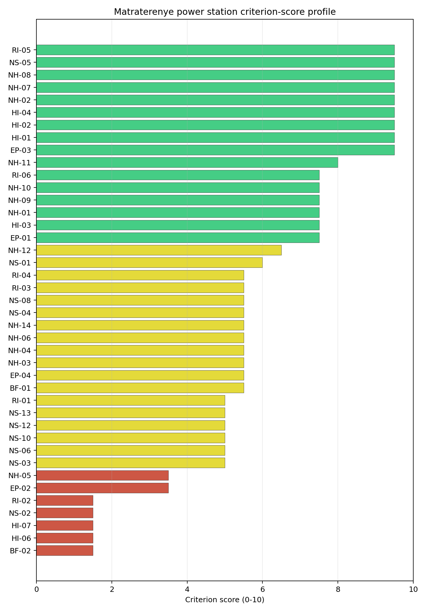
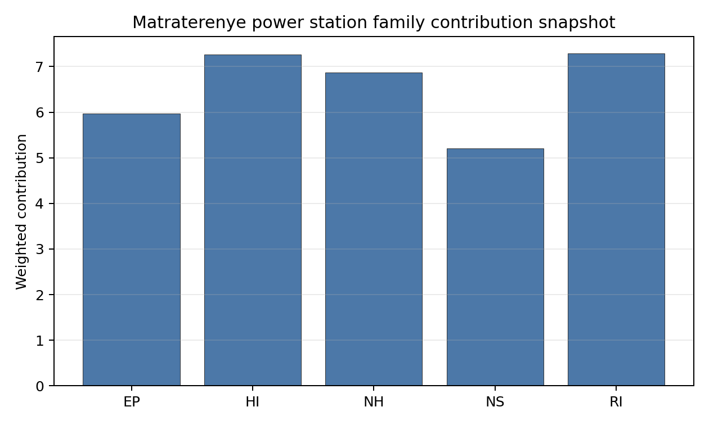

# Matraterenye power station Site Profile

Matraterenye power station is a coal/thermal site in Hungary that has been tested against the NuScale VOYGR-6 reference deployment envelope. This profile reads the screening evidence at a level that supports a decision to progress toward Stage 3 characterisation. It is not a site-suitability determination, vendor recommendation, or licensing finding.

## Site Snapshot

| Field | Value |
| --- | --- |
| Site name | Matraterenye power station |
| Coordinates | 48.0167, 19.9500 |
| Subnational unit | Northern Hungary |
| Installed thermal capacity (source data) | 49 MW |
| Available surface area | 98.5 ha |
| Available surface area for development | 1.2 ha |
| Composite score (baseline weights) | 6.641 (5.795-7.158 MC band) |
| National stability band | H (top-10% hit rate 0%) |
| National rank | 4 |

_See the country status map in_ [Hungary Country Profile](../HU_country_prototype.md#country-status-map).

## Ownership and Coal-to-Nuclear Context

- **Herco Holdings** (nan% share), headquartered in Belgium; immediate operator Elso Nogradi Eromu. Path: Herco Holdings  -> Elso Nogradi Eromu  [unknown %] -> Matraterenye power station -- [100.0%]

Generating units on record: 1 cancelled.

## Natural Hazards (NH)

- **Seismic: Ground Motion (NH-01)** - score 7.5/10 (MC 7.0-8.0), weight 0.0455, data quality high. Evidence: PGA at 475-year return period 0.049 g; PGA at 2,475-year return period 0.114 g; Vs30 reference (m/s): 760.0.
- **Seismic: Surface Rupture (NH-02)** - score 9.5/10 (MC 9.0-10.0), weight n/a, data quality screening grade. Evidence: nearest mapped capable fault 50.0 km; fault slip rate 0 mm/yr; fault name: none_in_search_radius.
- **Geotechnical: Liquefaction (NH-03)** - score 5.5/10 (MC 5.0-6.0), weight n/a, data quality medium. Evidence: liquefaction susceptibility: moderate; dominant soil type: clay_loam.
- **Geotechnical: Slope Stability (NH-04)** - score 5.5/10 (MC 5.0-6.0), weight n/a, data quality screening grade. Evidence: site slope 10.1 deg; max slope in 1 km box 86.1 deg; slope stability class: steep.
- **Geotechnical: Subsidence (NH-05)** - score 3.5/10 (MC 3.0-4.0), weight 0.0354, data quality medium. Evidence: karst present: no; karst severity: none.
- **Geotechnical: Foundation (NH-06)** - score 5.5/10 (MC 5.0-6.0), weight 0.0253, data quality medium. Evidence: bearing capacity 88.7 kPa; depth to bedrock 25.3 m.
- **Volcanism (NH-07)** - score 9.5/10 (MC 9.0-10.0), weight n/a, data quality high. Evidence: volcanic hazard class: negligible.
- **Coastal Flooding (NH-08)** - score 9.5/10 (MC 9.0-10.0), weight 0.0303, data quality medium. Evidence: distance to coast 508.9 km.
- **River Flooding (NH-09)** - score 7.5/10 (MC 7.0-8.0), weight 0.0404, data quality medium. Evidence: flood zone class: negligible.
- **Extreme Winds (NH-10)** - score 7.5/10 (MC 7.0-8.0), weight 0.0152, data quality medium. Evidence: screening wind-speed index 8.28 m/s.
- **Extreme Precipitation (NH-11)** - score 8.0/10 (MC 7.0-8.0), weight 0.0152, data quality medium. Evidence: screening extreme-precipitation index 0.29 mm; screening precipitation index 26.6 mm/yr.
- **Extreme Temperatures (NH-12)** - score 6.5/10 (MC 6.0-7.0), weight 0.0202, data quality medium. Evidence: extreme high temperature 23.1 deg C; extreme low temperature -7.17 deg C.
- **Combined Hazards (NH-14)** - score 5.5/10 (MC 5.0-6.0), weight 0.0152, data quality n/a. Evidence: values not in measurement tables.

### Interpretation - Natural Hazards (NH)

Natural hazards at Matraterenye are acceptable for screening but weaker than the Tisza and Danube sites. The 475-year PGA is 0.049 g and the 2,475-year PGA is 0.114 g, and the nearest mapped capable fault is 50.0 km away. Liquefaction susceptibility is moderate and bearing capacity is 88.7 kPa, but slope and subsidence require attention: mean site slope is 10.09 degrees, the one-kilometre maximum is 86.08 degrees, and the nearest mapped mining feature is 1.189 km away. The site is 508.93 km from the coast, river-flood class is negligible at screening level, screening wind-speed index is 8.28 m/s, and temperatures range from -7.17 deg C to 23.07 deg C. Stage 3 should focus on slope stability, mining-related subsidence and local geotechnical confirmation before treating the natural-hazard envelope as settled.

## Human-Induced and Security-Relevant Hazards (HI)

- **Aircraft Crash (HI-01)** - score 9.5/10 (MC 9.0-10.0), weight 0.0354, data quality high. Evidence: nearest airport 10.8 km; nearest flight path 5.41 km; airports within search radius 3; airport name: Bátonyterenye-Világosipuszta sportreptér; airport type: small airfield.
- **Industrial Explosions (HI-02)** - score 9.5/10 (MC 9.0-10.0), weight 0.0354, data quality high. Evidence: nearest industrial site 26.8 km.
- **Toxic/Gas Releases (HI-03)** - score 7.5/10 (MC 7.0-8.0), weight 0.0354, data quality high. Evidence: nearest toxic source 26.8 km.
- **External Fires (HI-04)** - score 9.5/10 (MC 9.0-10.0), weight 0.0303, data quality high. Evidence: values not in measurement tables.
- **Military Installations (HI-06)** - score 1.5/10 (MC 1.0-2.0), weight 0.0303, data quality medium. Evidence: nearest military installation 10.6 km; military installations within radius 5; installation name: Bem József laktanya.
- **Electromagnetic Interference (HI-07)** - score 1.5/10 (MC 1.0-2.0), weight 0.0101, data quality medium. Evidence: nearest high-power transmitter 1.21 km; transmitters within radius 150; transmitter type: communication.

### Interpretation - Human-Induced and Security-Relevant Hazards (HI)

Human-induced hazards at Matraterenye are not the main reason for its low stability band, but they still need targeted confirmation. The nearest airport is Bátonyterenye-Világosipuszta sportreptér at 10.82 km, with the nearest flight-path proxy 5.41 km away and three airports in the search radius. The nearest industrial and toxic-release source is 26.78 km away, which is favourable compared with Borsod and Tiszapalkonya. Military Installations (HI-06) remains weak because Bem József laktanya is 10.64 km away and five military features are recorded within 25 km. Electromagnetic Interference (HI-07) is also weak, with a communication transmitter 1.21 km away and 150 transmitters in the search radius. Stage 3 should verify aviation use, military-feature status and EMI exposure before the site is considered beyond comparator status.

## Radiological Impact and Emergency Planning (RI / EP)

- **Emergency Planning Feasibility (EP-01)** - score 7.5/10 (MC 7.0-8.0), weight n/a, data quality high. Evidence: EP feasibility composite 66.4 /100; road sub-score 34.5 /100; special-population sub-score 90.0 /100; geography sub-score 95.0 /100; population sub-score 95.0 /100; evacuation feasible: yes.
- **Evacuation Routes (EP-02)** - score 3.5/10 (MC 3.0-4.0), weight 0.0303, data quality medium. Evidence: road density in EPZ 0.375 km/km2; road length in EPZ 735.8 km; motorway access: no.
- **Physical Geography Constraints (EP-03)** - score 9.5/10 (MC 9.0-10.0), weight 0.0253, data quality medium. Evidence: waterways crossing EPZ 0; major river barrier: no.
- **Special Populations (EP-04)** - score 5.5/10 (MC 5.0-6.0), weight 0.0303, data quality medium. Evidence: hospitals in EPZ 12; prisons in EPZ 0; care homes in EPZ 1.
- **Atmospheric Dispersion (RI-01)** - unscored (no matched band), weight 0.0303, data quality medium. Evidence: annual mean wind speed 0.72 m/s; atmospheric mixing height 439.1 m; prevailing wind direction: NNE.
- **Surface Water Dispersion (RI-02)** - score 1.5/10 (MC 1.0-2.0), weight 0.0253, data quality n/a. Evidence: values not in measurement tables.
- **Groundwater Dispersion (RI-03)** - score 5.5/10 (MC 5.0-6.0), weight 0.0253, data quality medium. Evidence: aquifer type: sedimentary sands.
- **Population Density at EPZ Radii (RI-04)** - score 5.5/10 (MC 5.0-6.0), weight 0.0404, data quality screening grade. Evidence: population density within 5 km 75.6 /km2; population density within 16 km 96.7 /km2; population density within 25 km 76.0 /km2; population density within 80 km 103.1 /km2; population within 25 km 149,129 people.
- **Distance to Population Centres (RI-05)** - score 9.5/10 (MC 9.0-10.0), weight 0.0505, data quality screening grade. Evidence: nearest city above 50k people 56.3 km; nearest city population 143,502 people; city name: Miskolc.
- **Population Projections (RI-06)** - score 7.5/10 (MC 7.0-8.0), weight 0.0253, data quality screening grade. Evidence: annual population growth rate -0.347 %/yr; projected population at 25 km in 60 yr 138,671 people.

### Interpretation - Radiological Impact and Emergency Planning (RI / EP)

Radiological and emergency-planning conditions at Matraterenye are moderate, with a lower immediate population density but a weaker road envelope. Population density is 75.63 people/km2 within 5 km, 96.71 people/km2 within 16 km and 75.96 people/km2 within 25 km, with 149,129 people inside 25 km. Miskolc, population 143,502, is 56.34 km away, and the 60-year 25 km population projection is 138,671 people. The EP feasibility composite is 66.4/100 and evacuation is marked feasible, but road density is only 0.375 km/km2, the road sub-score is 34.5/100, and motorway access is not recorded. The EPZ includes 12 hospitals and one care home. Stage 3 should prioritise road-network modelling, hospital evacuation assumptions and surface-water dispersion confirmation, since RI-02 remains weak.

## Non-Safety and Implementation Considerations (NS)

- **Grid Capacity Basic Filter (BF-01)** - score 5.5/10 (MC 5.0-6.0), weight n/a, data quality n/a. Evidence: values not in measurement tables.
- **Land Area Basic Filter (BF-02)** - score 1.5/10 (MC 1.0-2.0), weight 0.0253, data quality n/a. Evidence: values not in measurement tables.
- **Cooling Water Availability (NS-01)** - score 6.0/10 (MC 6.0-7.0), weight 0.0404, data quality screening grade. Evidence: distance to cooling source 8.98 km; cooling source flow 0.96 m3/s; cooling source type: small_river; cooling source name: Zagyva; water stress label: Low.
- **Grid Connection (NS-02)** - score 1.5/10 (MC 1.0-2.0), weight 0.0404, data quality high. Evidence: nearest substation 10.7 km; nearest high-voltage line 6.26 km; highest nearby line voltage 132.0 kV; grid export capacity 49.9 MW; substations within radius 75; HV lines within radius 309.
- **Transport Access (NS-03)** - unscored (no matched band), weight 0.0404, data quality low. Evidence: not measured at this site (criterion remains unscored).
- **Site Topography (NS-04)** - score 5.5/10 (MC 5.0-6.0), weight 0.0303, data quality screening grade. Evidence: favourable land cover 48.8 %; moderate land cover 11.7 %; unfavourable land cover 32.2 %; favourable area 98.5 ha; dominant land class: 231.
- **Site Footprint Adequacy (NS-05)** - score 9.5/10 (MC 7.5-10.0), weight 0.0253, data quality low. Evidence: buildable area 1.17 ha; largest contiguous patch 1.17 ha; buildable patch count 11.
- **Existing Infrastructure (NS-06)** - unscored (no matched band), weight 0.0253, data quality n/a. Evidence: not measured at this site (criterion remains unscored).
- **Ecological Sensitivity (NS-08)** - score 5.5/10 (MC 5.0-6.0), weight n/a, data quality high. Evidence: natural land cover 32.2 %; distance to nearest Natura 2000 site 8.414 km; distance to nearest protected area 7.636 km; Natura 2000 overlap: no; Natura 2000 sensitivity class: low; protected-area overlap: no; protected-area sensitivity class: low; nearest Natura 2000 site: Mátra; Natura 2000 sites within 5 km: 0; nearest protected-area designation: Nature Conservation Area.
- **Workforce Availability (NS-10)** - unscored (no matched band), weight 0.0202, data quality n/a. Evidence: not measured at this site (criterion remains unscored).
- **Regulatory/Political Environment (NS-12)** - unscored (no matched band), weight 0.0303, data quality n/a. Evidence: not measured at this site (criterion remains unscored).
- **Construction Logistics (NS-13)** - unscored (no matched band), weight 0.0202, data quality n/a. Evidence: not measured at this site (criterion remains unscored).

### Interpretation - Non-Safety and Implementation Considerations (NS)

Matraterenye is materially constrained on implementation. The Zagyva is 8.98 km away with a recorded flow of 0.96 m3/s and a Low water-stress label, which is a limited cooling-water envelope for the reference deployment case. The grid position is also weak: the nearest substation is 10.71 km away, the nearest high-voltage line is 6.26 km away, the highest nearby voltage is 132 kV and the inherited export-capacity estimate is only 49.9 MW. The land hierarchy is mixed. The canonical site footprint is 98.54 ha, but the current development-area value is only 1.17 ha, and the wider favourable-area screen does not prove controlled or developable land. Stage 3 should therefore test whether the site has any realistic VOYGR-6 layout, grid and cooling pathway before major characterisation spend is committed.

## Composite Score and Stability

Baseline composite score is 6.641, bracketed by Monte Carlo at 5.795-7.158. National stability band is `H` with a top-10% hit rate of 0% across 12 scored Monte Carlo scenarios.

Matraterenye has a baseline composite score of 6.641 and a Monte Carlo bracket of 5.795-7.158. Its national stability band is H, with a 0% national top-10 hit rate across the scored national sensitivity scenarios. The point estimate is high enough to justify inclusion in the top-five selected profiles, but the national sensitivity result is fragile. RI 7.29, HI 7.27 and NH 6.87 support the score, while NS 5.20 and EP 5.97 expose the practical weakness: grid, cooling, developable land and evacuation-road capacity. Stage 3 value would come first from proving whether the site has a credible infrastructure pathway at all.

## Residual Risk Register

| Concern | Evidence | Consequence | Stage 3 action | Owner discipline |
| --- | --- | --- | --- | --- |
| Grid Connection (NS-02) | Grid export capacity 49.9 MW; nearest substation 10.71 km; highest nearby voltage 132 kV | The grid pathway may be too weak for the reference deployment envelope | Confirm transmission reinforcement feasibility and cost class | grid |
| Site Footprint Adequacy (NS-05) | Canonical footprint 98.54 ha; current development-area value 1.17 ha | Usable land may be far smaller than the nominal site footprint | Re-survey controlled, contiguous and developable land | ownership/legal |
| Cooling Water Availability (NS-01) | Zagyva 8.98 km away; recorded flow 0.96 m3/s | Cooling-water strategy may require closed-cycle assumptions or an alternative source | Quantify low-flow availability and cooling configuration | hydrology |
| Evacuation Routes (EP-02) | Road density 0.375 km/km2; motorway access not recorded | EPZ clearance may be constrained by local road capacity | Model evacuation routes and road-upgrade needs | emergency planning |
| Geotechnical: Subsidence (NH-05) | Nearest mapped mining feature 1.189 km; mean site slope 10.09 degrees | Ground stability and earthworks scope may affect the site boundary | Re-measure mining, slope and foundation conditions | geotech |

Matraterenye's residual register is dominated by infrastructure feasibility. It is useful as a top-five comparator, but its Stage 3 case should be gated by grid, land and cooling confirmation.

## Stage 3 Follow-Up Checklist

- Resolve **Grid Connection (NS-02)** avoidance flag - confirm deliverable export capacity and voltage pathway for the reference deployment envelope.
- Re-measure **Land Area Basic Filter (BF-02)** - native score 1.5/10 with confidence insufficient.
- Re-measure **Military Installations (HI-06)** - native score 1.5/10 with confidence medium.
- Re-measure **Electromagnetic Interference (HI-07)** - native score 1.5/10 with confidence medium.
- Re-measure **Grid Connection (NS-02)** - native score 1.5/10 with confidence high.
- Re-measure **Surface Water Dispersion (RI-02)** - native score 1.5/10 with confidence insufficient.
- Improve data quality for **Transport Access (NS-03)** - current flag `low`.
- Improve data quality for **Site Footprint Adequacy (NS-05)** - current flag `low`.

## Evidence Limitations

- Transport Access (NS-03) - quality `low`.
- Site Footprint Adequacy (NS-05) - quality `low`.
