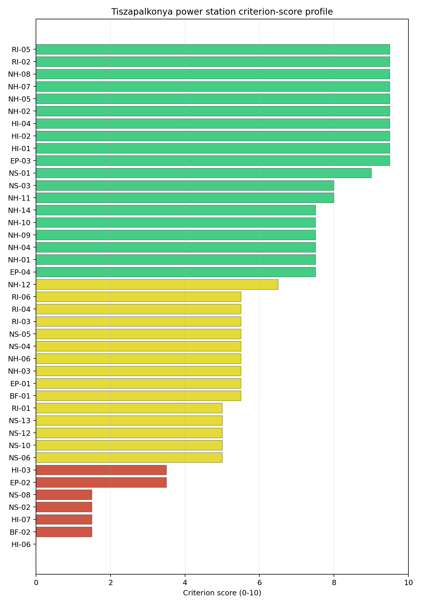
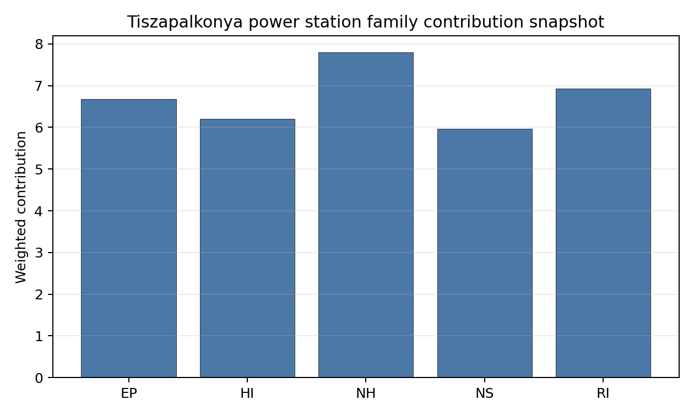

# Tiszapalkonya power station Site Profile

Tiszapalkonya power station is a coal/thermal site in Hungary that has been tested against the NuScale VOYGR-6 reference deployment envelope. This profile reads the screening evidence at a level that supports a decision to progress toward Stage 3 characterisation. It is not a site-suitability determination, vendor recommendation, or licensing finding.

## Site Snapshot

| Field | Value |
| --- | --- |
| Site name | Tiszapalkonya power station |
| Coordinates | 47.9168, 21.0759 |
| Subnational unit | Northern Hungary |
| Installed thermal capacity (source data) | 265 MW |
| Available surface area | 18.8 ha |
| Available surface area for development | 18.8 ha |
| Composite score (baseline weights) | 6.778 (6.053-7.319 MC band) |
| National stability band | D (top-10% hit rate 0%) |
| National rank | 3 |

_See the country status map in_ [Hungary Country Profile](../HU_country_prototype.md#country-status-map).

## Ownership and Coal-to-Nuclear Context

- **Blackrock Advisors LLC** (0.36% share), headquartered in United States; immediate operator AES Corp. Path: Blackrock Advisors LLC -> BlackRock Inc [5.07%] -> AES Corp [7.09%] -> Tiszapalkonya power station Unit 5 [100.0%]
- **AES Corp** (100.00% share), headquartered in United States; immediate operator AES Corp. Path: AES Corp -> Tiszapalkonya power station Unit 3 [100.0%]
- **BlackRock Inc** (7.09% share), headquartered in United States; immediate operator AES Corp. Path: BlackRock Inc -> AES Corp [7.09%] -> Tiszapalkonya power station Unit 5 [100.0%]
- **small shareholder(s)** (80.58% share); immediate operator AES Corp. Path: small shareholder(s)  -> AES Corp [80.58%] -> Tiszapalkonya power station Unit 3 [100.0%]
- **The Vanguard Group Inc** (12.33% share), headquartered in United States; immediate operator AES Corp. Path: The Vanguard Group Inc -> AES Corp [12.33%] -> Tiszapalkonya power station Unit 5 [100.0%]

Generating units on record: 5 retired.
Earliest unit commissioning: 1952; most recent: 1952.
Retirements span 2011 to 2012, leaving brownfield grid, water, transport, and workforce assets that materially shorten Stage 3 site preparation.

## Natural Hazards (NH)

- **Seismic: Ground Motion (NH-01)** - score 7.5/10 (MC 7.0-8.0), weight 0.0455, data quality high. Evidence: PGA at 475-year return period 0.045 g; PGA at 2,475-year return period 0.105 g; Vs30 reference (m/s): 760.0.
- **Seismic: Surface Rupture (NH-02)** - score 9.5/10 (MC 9.0-10.0), weight n/a, data quality screening grade. Evidence: nearest mapped capable fault 50.0 km; fault slip rate 0 mm/yr; fault name: none_in_search_radius.
- **Geotechnical: Liquefaction (NH-03)** - score 5.5/10 (MC 5.0-6.0), weight n/a, data quality medium. Evidence: liquefaction susceptibility: high; dominant soil type: clay_loam.
- **Geotechnical: Slope Stability (NH-04)** - score 7.5/10 (MC 7.0-8.0), weight n/a, data quality screening grade. Evidence: site slope 5.25 deg; max slope in 1 km box 40.1 deg; slope stability class: moderate.
- **Geotechnical: Subsidence (NH-05)** - score 9.5/10 (MC 9.0-10.0), weight 0.0354, data quality medium. Evidence: karst present: no; karst severity: none.
- **Geotechnical: Foundation (NH-06)** - score 5.5/10 (MC 5.0-6.0), weight 0.0253, data quality medium. Evidence: bearing capacity 88.7 kPa; depth to bedrock 24.4 m.
- **Volcanism (NH-07)** - score 9.5/10 (MC 9.0-10.0), weight n/a, data quality high. Evidence: volcanic hazard class: negligible.
- **Coastal Flooding (NH-08)** - score 9.5/10 (MC 9.0-10.0), weight 0.0303, data quality medium. Evidence: distance to coast 572.0 km.
- **River Flooding (NH-09)** - score 7.5/10 (MC 7.0-8.0), weight 0.0404, data quality medium. Evidence: flood zone class: negligible.
- **Extreme Winds (NH-10)** - score 7.5/10 (MC 7.0-8.0), weight 0.0152, data quality medium. Evidence: screening wind-speed index 7.71 m/s.
- **Extreme Precipitation (NH-11)** - score 8.0/10 (MC 8.0-9.0), weight 0.0152, data quality medium. Evidence: screening extreme-precipitation index 0.23 mm; screening precipitation index 21.2 mm/yr.
- **Extreme Temperatures (NH-12)** - score 6.5/10 (MC 6.0-7.0), weight 0.0202, data quality medium. Evidence: extreme high temperature 25.9 deg C; extreme low temperature -6.51 deg C.
- **Combined Hazards (NH-14)** - score 7.5/10 (MC 7.0-8.0), weight 0.0152, data quality n/a. Evidence: values not in measurement tables.

### Interpretation - Natural Hazards (NH)

Natural hazards at Tiszapalkonya are broadly favourable, with a similar Tisza alluvial setting to Borsod and the same need for field confirmation. The 475-year PGA is 0.045 g and the 2,475-year PGA is 0.105 g, and the nearest mapped capable fault is 50.0 km away. Liquefaction susceptibility is high on clay loam, while bearing capacity is 88.7 kPa and depth to bedrock is 24.4 m. The mean site slope is 5.25 degrees, with a maximum one-kilometre slope of 40.15 degrees. The site is 571.95 km from the coast, the flood-zone class is negligible at screening level, screening wind-speed index is 7.71 m/s and temperatures range from -6.51 deg C to 25.95 deg C. Stage 3 should confirm Tisza flood levels, liquefaction behaviour and the local precipitation record before the natural-hazard case is treated as mature.

## Human-Induced and Security-Relevant Hazards (HI)

- **Aircraft Crash (HI-01)** - score 9.5/10 (MC 9.0-10.0), weight 0.0354, data quality high. Evidence: nearest airport 31.8 km; nearest flight path 23.2 km; airports within search radius 0; airport name: Miskolc Heliport; airport type: heliport.
- **Industrial Explosions (HI-02)** - score 9.5/10 (MC 9.0-10.0), weight 0.0354, data quality high. Evidence: nearest industrial site 4 km.
- **Toxic/Gas Releases (HI-03)** - score 3.5/10 (MC 3.0-4.0), weight 0.0354, data quality high. Evidence: nearest toxic source 4 km.
- **External Fires (HI-04)** - score 9.5/10 (MC 9.0-10.0), weight 0.0303, data quality high. Evidence: values not in measurement tables.
- **Military Installations (HI-06)** - score 0.0/10 (MC 0.0-0.0), weight 0.0303, data quality high. Evidence: nearest military installation 2.09 km; military installations within radius 6; installation name: unnamed.
- **Electromagnetic Interference (HI-07)** - score 1.5/10 (MC 1.0-2.0), weight 0.0101, data quality medium. Evidence: nearest high-power transmitter 1.52 km; transmitters within radius 131; transmitter type: communication.

### Interpretation - Human-Induced and Security-Relevant Hazards (HI)

Human-induced hazards at Tiszapalkonya are mixed. Aircraft Crash (HI-01) is favourable, with Miskolc Heliport 31.8 km away, the nearest flight path 23.25 km away and no airports inside the 30 km radius. Industrial Explosions (HI-02) is also favourable at screening level, with the nearest industrial site 4.0 km away. The principal avoidance issue is Toxic/Gas Releases (HI-03), where the nearest toxic source is 4.0 km away against an 8 km avoidance threshold. Military Installations (HI-06) is more severe: the nearest military feature is 2.09 km away and six military features are recorded within 25 km. Electromagnetic Interference (HI-07) is also weak, with a communication transmitter 1.52 km away and 131 transmitters in the search radius. Stage 3 should prioritise hazardous-cloud, military and EMI confirmation.

## Radiological Impact and Emergency Planning (RI / EP)

- **Emergency Planning Feasibility (EP-01)** - score 5.5/10 (MC 5.0-6.0), weight n/a, data quality high. Evidence: EP feasibility composite 64.7 /100; road sub-score 48.9 /100; special-population sub-score 90.0 /100; geography sub-score 95.0 /100; population sub-score 80.0 /100; evacuation feasible: yes.
- **Evacuation Routes (EP-02)** - score 3.5/10 (MC 3.0-4.0), weight 0.0303, data quality medium. Evidence: road density in EPZ 0.448 km/km2; road length in EPZ 880.6 km; motorway access: yes.
- **Physical Geography Constraints (EP-03)** - score 9.5/10 (MC 9.0-10.0), weight 0.0253, data quality medium. Evidence: waterways crossing EPZ 0; major river barrier: no.
- **Special Populations (EP-04)** - score 7.5/10 (MC 7.0-8.0), weight 0.0303, data quality medium. Evidence: hospitals in EPZ 3; prisons in EPZ 1; care homes in EPZ 0.
- **Atmospheric Dispersion (RI-01)** - unscored (no matched band), weight 0.0303, data quality medium. Evidence: annual mean wind speed 0.91 m/s; atmospheric mixing height 518.7 m; prevailing wind direction: N.
- **Surface Water Dispersion (RI-02)** - score 9.5/10 (MC 9.0-10.0), weight 0.0253, data quality n/a. Evidence: values not in measurement tables.
- **Groundwater Dispersion (RI-03)** - score 5.5/10 (MC 5.0-6.0), weight 0.0253, data quality medium. Evidence: aquifer type: alluvial.
- **Population Density at EPZ Radii (RI-04)** - score 5.5/10 (MC 5.0-6.0), weight 0.0404, data quality screening grade. Evidence: population density within 5 km 231.6 /km2; population density within 16 km 83.2 /km2; population density within 25 km 77.9 /km2; population density within 80 km 92.3 /km2; population within 25 km 152,917 people.
- **Distance to Population Centres (RI-05)** - score 9.5/10 (MC 9.0-10.0), weight 0.0505, data quality screening grade. Evidence: nearest city above 50k people 34.2 km; nearest city population 143,502 people; city name: Miskolc.
- **Population Projections (RI-06)** - score 5.5/10 (MC 5.0-6.0), weight 0.0253, data quality screening grade. Evidence: annual population growth rate 0.126 %/yr; projected population at 25 km in 60 yr 142,194 people.

### Interpretation - Radiological Impact and Emergency Planning (RI / EP)

Radiological and emergency-planning conditions at Tiszapalkonya are moderate and closely tied to the Tiszaújváros urban-industrial setting. Population density is 231.57 people/km2 within 5 km, 83.16 people/km2 within 16 km and 77.89 people/km2 within 25 km, with 152,917 people inside 25 km. Miskolc, population 143,502, is 34.16 km away, and the 60-year 25 km population projection is 142,194 people. The EP feasibility composite is 64.7/100 and evacuation is marked feasible, but the road sub-score is 48.9/100 and EPZ road density is 0.448 km/km2. The EPZ includes three hospitals and one prison. Stage 3 should model time-to-clear for the Tiszaújváros area, test prison and hospital evacuation interfaces, and combine radiological planning with the hazardous-neighbour work required by HI-03.

## Non-Safety and Implementation Considerations (NS)

- **Grid Capacity Basic Filter (BF-01)** - score 5.5/10 (MC 5.0-6.0), weight n/a, data quality n/a. Evidence: values not in measurement tables.
- **Land Area Basic Filter (BF-02)** - score 1.5/10 (MC 1.0-2.0), weight 0.0253, data quality n/a. Evidence: values not in measurement tables.
- **Cooling Water Availability (NS-01)** - score 9.0/10 (MC 8.0-10.0), weight 0.0404, data quality screening grade. Evidence: distance to cooling source 0.72 km; cooling source flow 549.2 m3/s; cooling source type: major_river; cooling source name: Üzemvíz-csatorna; water stress label: Low.
- **Grid Connection (NS-02)** - score 1.5/10 (MC 1.0-2.0), weight 0.0404, data quality high. Evidence: nearest substation 1.22 km; nearest high-voltage line 0.2 km; highest nearby line voltage 220.0 kV; grid export capacity 265.0 MW; substations within radius 83; HV lines within radius 594.
- **Transport Access (NS-03)** - score 8.0/10 (MC 8.0-9.0), weight 0.0404, data quality high. Evidence: nearest highway 0.36 km; nearest rail line 2.17 km; nearest waterway 20.6 km; heavy-haul capable: yes.
- **Site Topography (NS-04)** - score 5.5/10 (MC 5.0-6.0), weight 0.0303, data quality screening grade. Evidence: favourable land cover 53.9 %; moderate land cover 0.2 %; unfavourable land cover 33.7 %; favourable area 98.1 ha; dominant land class: 311.
- **Site Footprint Adequacy (NS-05)** - score 5.5/10 (MC 5.0-6.0), weight 0.0253, data quality high. Evidence: buildable area 18.8 ha; largest contiguous patch 18.8 ha; buildable patch count 10.
- **Existing Infrastructure (NS-06)** - unscored (no matched band), weight 0.0253, data quality n/a. Evidence: not measured at this site (criterion remains unscored).
- **Ecological Sensitivity (NS-08)** - score 1.5/10 (MC 1.0-2.0), weight n/a, data quality high. Evidence: natural land cover 33.7 %; distance to nearest Natura 2000 site 0.477 km; distance to nearest protected area 3 km; Natura 2000 overlap: no; Natura 2000 sensitivity class: high; protected-area overlap: no; protected-area sensitivity class: low; nearest Natura 2000 site: Tiszaújvárosi ártéri erdők; Natura 2000 sites within 5 km: 3; nearest protected-area designation: Landscape Protection Area.
- **Workforce Availability (NS-10)** - unscored (no matched band), weight 0.0202, data quality n/a. Evidence: not measured at this site (criterion remains unscored).
- **Regulatory/Political Environment (NS-12)** - unscored (no matched band), weight 0.0303, data quality n/a. Evidence: not measured at this site (criterion remains unscored).
- **Construction Logistics (NS-13)** - unscored (no matched band), weight 0.0202, data quality n/a. Evidence: not measured at this site (criterion remains unscored).

### Interpretation - Non-Safety and Implementation Considerations (NS)

Implementation evidence at Tiszapalkonya is constrained by land and grid capacity despite strong transport and cooling proximity. The cooling source is 0.72 km away with a recorded flow of 549.23 m3/s and a Low water-stress label. The nearest substation is 1.22 km away and the nearest high-voltage line is 0.20 km away, with 220 kV recorded nearby, but the inherited export-capacity estimate is only 265 MW and NS-02 remains avoidance-flagged. Transport is favourable, with highway access 0.36 km away, rail 2.17 km away and heavy-haul capability recorded. The canonical site footprint is 18.77 ha, which is also the current development-area value; the wider favourable-area screen is 98.06 ha but does not prove controlled or contiguous land. Stage 3 should confirm whether a VOYGR-6 layout can be accommodated, and whether transmission reinforcement can lift the grid constraint.

## Composite Score and Stability

Baseline composite score is 6.778, bracketed by Monte Carlo at 6.053-7.319. National stability band is `D` with a top-10% hit rate of 0% across 12 scored Monte Carlo scenarios.

Tiszapalkonya has a baseline composite score of 6.778 and a Monte Carlo bracket of 6.053-7.319. Its national stability band is D, with a 0% national top-10 hit rate across the scored national sensitivity scenarios. The result makes Tiszapalkonya a credible point-estimate follower, but not a stable leader. The family profile is strongest in NH 7.80, with RI 6.93 and EP 6.68 supporting the case; NS 5.96 and HI 6.21 carry the land, grid, hazardous-neighbour, military and EMI constraints. The Stage 3 work that would narrow uncertainty fastest is the combined NS-02 grid review, NS-05 land-footprint confirmation and HI-03 hazardous-cloud assessment.

## Residual Risk Register

| Concern | Evidence | Consequence | Stage 3 action | Owner discipline |
| --- | --- | --- | --- | --- |
| Grid Connection (NS-02) | Grid export capacity 265 MW; nearest high-voltage line 0.20 km; highest nearby voltage 220 kV | Export capacity may fall below the reference deployment envelope even with nearby grid assets | Confirm upgrade scope and deliverable export capacity | grid |
| Site Footprint Adequacy (NS-05) | Canonical footprint 18.77 ha; wider favourable-area screen 98.06 ha | The reference layout may require land assembly or a different siting envelope | Confirm controlled, contiguous and developable land | ownership/legal |
| Toxic/Gas Releases (HI-03) | Nearest toxic source 4.0 km; avoidance threshold 8 km | Hazardous-cloud exposure may keep the site in the avoidance-flag pool | Model hazardous-cloud envelope and inventories | security |
| Military Installations (HI-06) | Nearest military feature 2.09 km; six features within 25 km | Security standoff and emergency coordination could constrain the site boundary | Confirm feature classification and standoff requirements | security |
| Evacuation Routes (EP-02) | Road density 0.448 km/km2; EPZ includes three hospitals and one prison | Clearance-time and special-facility planning may drive emergency-plan design | Model time-to-clear and institutional evacuation interfaces | emergency planning |

The register is dominated by land, grid and hazardous-neighbour constraints. Tiszapalkonya remains a high-ranking follower, but its Stage 3 case depends on converting these avoidance items into measured, resolvable conditions.

## Stage 3 Follow-Up Checklist

- Resolve **Toxic/Gas Releases (HI-03)** avoidance flag - confirm hazardous-source distance and consequence envelope against the 8 km avoidance screen.
- Resolve **Grid Connection (NS-02)** avoidance flag - confirm deliverable export capacity and voltage pathway for the reference deployment envelope.
- Re-measure **Military Installations (HI-06)** - native score 0.0/10 with confidence high.
- Re-measure **Land Area Basic Filter (BF-02)** - native score 1.5/10 with confidence insufficient.
- Re-measure **Electromagnetic Interference (HI-07)** - native score 1.5/10 with confidence medium.
- Re-measure **Grid Connection (NS-02)** - native score 1.5/10 with confidence high.
- Re-measure **Ecological Sensitivity (NS-08)** - native score 1.5/10 with confidence high.

## Evidence Limitations

- No criterion-family quality fields are flagged as low or missing in this bundle.
