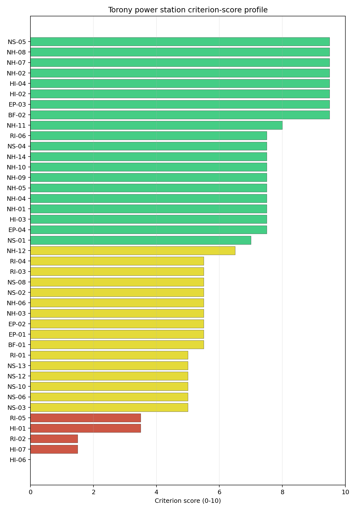
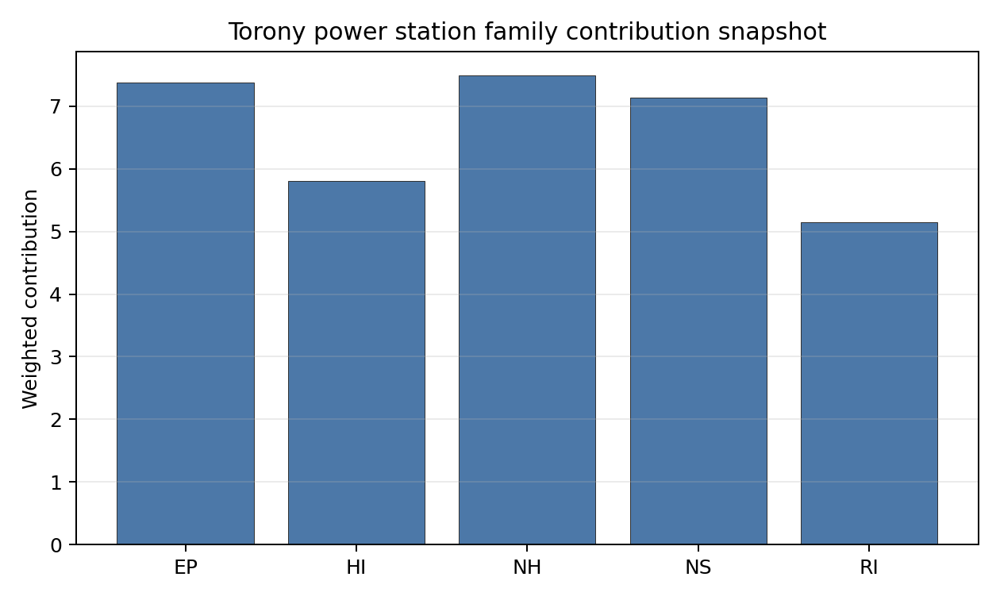

# Torony power station Site Profile

Torony power station is a coal/thermal site in Hungary that has been tested against the NuScale VOYGR-6 reference deployment envelope. This profile reads the screening evidence at a level that supports a decision to progress toward Stage 3 characterisation. It is not a site-suitability determination, vendor recommendation, or licensing finding.

## Site Snapshot

| Field | Value |
| --- | --- |
| Site name | Torony power station |
| Coordinates | 47.2363, 16.5371 |
| Subnational unit | Western Transdanubia |
| Installed thermal capacity (source data) | 600 MW |
| Available surface area | 135.3 ha |
| Available surface area for development | 135.3 ha |
| Composite score (baseline weights) | 6.595 (5.760-7.059 MC band) |
| National stability band | H (top-10% hit rate 0%) |
| National rank | 5 |

_See the country status map in_ [Hungary Country Profile](../HU_country_prototype.md#country-status-map).

## Ownership and Coal-to-Nuclear Context

Generating units on record: 1 cancelled.

## Natural Hazards (NH)

- **Seismic: Ground Motion (NH-01)** - score 7.5/10 (MC 7.0-8.0), weight 0.0455, data quality high. Evidence: PGA at 475-year return period 0.058 g; PGA at 2,475-year return period 0.13 g; Vs30 reference (m/s): 760.0.
- **Seismic: Surface Rupture (NH-02)** - score 9.5/10 (MC 9.0-10.0), weight n/a, data quality screening grade. Evidence: nearest mapped capable fault 50.0 km; fault slip rate 0 mm/yr; fault name: none_in_search_radius.
- **Geotechnical: Liquefaction (NH-03)** - score 5.5/10 (MC 5.0-6.0), weight n/a, data quality medium. Evidence: liquefaction susceptibility: moderate; dominant soil type: silty_clay_loam.
- **Geotechnical: Slope Stability (NH-04)** - score 7.5/10 (MC 7.0-8.0), weight n/a, data quality screening grade. Evidence: site slope 9.06 deg; max slope in 1 km box 85.5 deg; slope stability class: moderate.
- **Geotechnical: Subsidence (NH-05)** - score 7.5/10 (MC 7.0-8.0), weight 0.0354, data quality medium. Evidence: karst present: no; karst severity: none.
- **Geotechnical: Foundation (NH-06)** - score 5.5/10 (MC 5.0-6.0), weight 0.0253, data quality medium. Evidence: bearing capacity 83.3 kPa; depth to bedrock 19.7 m.
- **Volcanism (NH-07)** - score 9.5/10 (MC 9.0-10.0), weight n/a, data quality high. Evidence: volcanic hazard class: negligible.
- **Coastal Flooding (NH-08)** - score 9.5/10 (MC 9.0-10.0), weight 0.0303, data quality medium. Evidence: distance to coast 264.3 km.
- **River Flooding (NH-09)** - score 7.5/10 (MC 7.0-8.0), weight 0.0404, data quality medium. Evidence: flood zone class: negligible.
- **Extreme Winds (NH-10)** - score 7.5/10 (MC 7.0-8.0), weight 0.0152, data quality medium. Evidence: screening wind-speed index 8.51 m/s.
- **Extreme Precipitation (NH-11)** - score 8.0/10 (MC 8.0-9.0), weight 0.0152, data quality medium. Evidence: screening extreme-precipitation index 0.21 mm; screening precipitation index 24.6 mm/yr.
- **Extreme Temperatures (NH-12)** - score 6.5/10 (MC 6.0-7.0), weight 0.0202, data quality medium. Evidence: extreme high temperature 24.0 deg C; extreme low temperature -4.23 deg C.
- **Combined Hazards (NH-14)** - score 7.5/10 (MC 7.0-8.0), weight 0.0152, data quality n/a. Evidence: values not in measurement tables.

### Interpretation - Natural Hazards (NH)

Natural hazards at Torony are generally favourable, although the western Transdanubian site still needs field geotechnical confirmation. The 475-year PGA is 0.058 g and the 2,475-year PGA is 0.130 g, while the nearest mapped capable fault is 50.0 km away. Liquefaction susceptibility is moderate on silty clay loam, bearing capacity is 83.3 kPa and depth to bedrock is 19.7 m. The mean site slope is 9.06 degrees, with a maximum one-kilometre slope of 85.54 degrees, so local slope and earthworks conditions should be checked. The site is 264.34 km from the coast, river-flood class is negligible, screening wind-speed index is 8.51 m/s, and temperatures range from -4.23 deg C to 24.03 deg C. Stage 3 should confirm geotechnical properties, local drainage and the precipitation record.

## Human-Induced and Security-Relevant Hazards (HI)

- **Aircraft Crash (HI-01)** - score 3.5/10 (MC 3.0-4.0), weight 0.0354, data quality high. Evidence: nearest airport 6.13 km; nearest flight path 4.16 km; airports within search radius 8; airport name: Markusovszky Hospital Heliport; airport type: heliport.
- **Industrial Explosions (HI-02)** - score 9.5/10 (MC 9.0-10.0), weight 0.0354, data quality high. Evidence: nearest industrial site 27.9 km.
- **Toxic/Gas Releases (HI-03)** - score 7.5/10 (MC 7.0-8.0), weight 0.0354, data quality high. Evidence: nearest toxic source 27.9 km.
- **External Fires (HI-04)** - score 9.5/10 (MC 9.0-10.0), weight 0.0303, data quality high. Evidence: values not in measurement tables.
- **Military Installations (HI-06)** - score 0.0/10 (MC 0.0-0.0), weight 0.0303, data quality high. Evidence: nearest military installation 4.83 km; military installations within radius 20; installation name: unnamed.
- **Electromagnetic Interference (HI-07)** - score 1.5/10 (MC 1.0-2.0), weight 0.0101, data quality medium. Evidence: nearest high-power transmitter 1.95 km; transmitters within radius 206; transmitter type: observation.

### Interpretation - Human-Induced and Security-Relevant Hazards (HI)

Human-induced hazards at Torony are driven by aviation, military and EMI questions rather than by industrial neighbours. Markusovszky Hospital Heliport is 6.13 km away, the nearest flight-path proxy is 4.16 km away and eight airports are recorded within the search radius, which triggers the Aircraft Crash (HI-01) avoidance flag. The nearest industrial and toxic-release source is 27.91 km away, giving a stronger hazardous-neighbour position than the northern industrial sites. Military Installations (HI-06) is weak, with the nearest military feature 4.83 km away and 20 features within 25 km. Electromagnetic Interference (HI-07) is also weak, with an observation-type transmitter 1.95 km away and 206 transmitters in the search radius. Stage 3 should begin with aviation, defence and EMI confirmation.

## Radiological Impact and Emergency Planning (RI / EP)

- **Emergency Planning Feasibility (EP-01)** - score 5.5/10 (MC 5.0-6.0), weight n/a, data quality high. Evidence: EP feasibility composite 54.7 /100; road sub-score 56.7 /100; special-population sub-score 10.0 /100; geography sub-score 95.0 /100; population sub-score 80.0 /100; evacuation feasible: yes.
- **Evacuation Routes (EP-02)** - score 5.5/10 (MC 5.0-6.0), weight 0.0303, data quality medium. Evidence: road density in EPZ 0.579 km/km2; road length in EPZ 1,136 km; motorway access: yes.
- **Physical Geography Constraints (EP-03)** - score 9.5/10 (MC 9.0-10.0), weight 0.0253, data quality medium. Evidence: waterways crossing EPZ 0; major river barrier: no.
- **Special Populations (EP-04)** - score 7.5/10 (MC 7.0-8.0), weight 0.0303, data quality medium. Evidence: hospitals in EPZ 3; prisons in EPZ 1; care homes in EPZ 4.
- **Atmospheric Dispersion (RI-01)** - unscored (no matched band), weight 0.0303, data quality medium. Evidence: annual mean wind speed 0.91 m/s; atmospheric mixing height 506.7 m; prevailing wind direction: NNW.
- **Surface Water Dispersion (RI-02)** - score 1.5/10 (MC 1.0-2.0), weight 0.0253, data quality n/a. Evidence: values not in measurement tables.
- **Groundwater Dispersion (RI-03)** - score 5.5/10 (MC 5.0-6.0), weight 0.0253, data quality medium. Evidence: aquifer type: sedimentary sands.
- **Population Density at EPZ Radii (RI-04)** - score 5.5/10 (MC 5.0-6.0), weight 0.0404, data quality screening grade. Evidence: population density within 5 km 150.5 /km2; population density within 16 km 145.9 /km2; population density within 25 km 93.1 /km2; population density within 80 km 79.9 /km2; population within 25 km 182,718 people.
- **Distance to Population Centres (RI-05)** - score 3.5/10 (MC 3.0-4.0), weight 0.0505, data quality screening grade. Evidence: nearest city above 50k people 6.66 km; nearest city population 77,757 people; city name: Szombathely.
- **Population Projections (RI-06)** - score 7.5/10 (MC 7.0-8.0), weight 0.0253, data quality screening grade. Evidence: annual population growth rate -0.379 %/yr; projected population at 25 km in 60 yr 169,906 people.

### Interpretation - Radiological Impact and Emergency Planning (RI / EP)

Radiological impact and emergency planning are Torony's binding issue. Population density is 150.47 people/km2 within 5 km, 145.91 people/km2 within 16 km and 93.07 people/km2 within 25 km, with 182,718 people inside 25 km. Szombathely, population 77,757, is only 6.66 km from the site, inside the 8 km population-distance screen for a city above 50,000 people. The EP feasibility composite is 54.7/100, and evacuation is marked feasible, but the EPZ includes three hospitals, one prison and four care homes. Road density is better than several Hungarian sites at 0.579 km/km2 and motorway access is present. Stage 3 should model Szombathely-centred EPZ evacuation, special-population movement and atmospheric-dispersion sensitivity before Torony is treated as more than an avoidance-flagged comparator.

## Non-Safety and Implementation Considerations (NS)

- **Grid Capacity Basic Filter (BF-01)** - score 5.5/10 (MC 5.0-6.0), weight n/a, data quality n/a. Evidence: values not in measurement tables.
- **Land Area Basic Filter (BF-02)** - score 9.5/10 (MC 9.0-10.0), weight 0.0253, data quality n/a. Evidence: values not in measurement tables.
- **Cooling Water Availability (NS-01)** - score 7.0/10 (MC 6.0-7.0), weight 0.0404, data quality screening grade. Evidence: distance to cooling source 4.67 km; cooling source flow 2.46 m3/s; cooling source type: small_river; cooling source name: Arany-patak; water stress label: Low.
- **Grid Connection (NS-02)** - score 5.5/10 (MC 5.0-6.0), weight 0.0404, data quality high. Evidence: nearest substation 1.29 km; nearest high-voltage line 7.71 km; highest nearby line voltage 132.0 kV; grid export capacity 600.0 MW; substations within radius 379; HV lines within radius 301.
- **Transport Access (NS-03)** - unscored (no matched band), weight 0.0404, data quality low. Evidence: not measured at this site (criterion remains unscored).
- **Site Topography (NS-04)** - score 7.5/10 (MC 7.0-8.0), weight 0.0303, data quality screening grade. Evidence: favourable land cover 66.0 %; moderate land cover 4 %; unfavourable land cover 30.0 %; favourable area 89.3 ha; dominant land class: 211.
- **Site Footprint Adequacy (NS-05)** - score 9.5/10 (MC 9.0-10.0), weight 0.0253, data quality screening grade. Evidence: buildable area 135.3 ha; largest contiguous patch 464.5 ha; buildable patch count 6.
- **Existing Infrastructure (NS-06)** - unscored (no matched band), weight 0.0253, data quality n/a. Evidence: not measured at this site (criterion remains unscored).
- **Ecological Sensitivity (NS-08)** - score 5.5/10 (MC 5.0-6.0), weight n/a, data quality high. Evidence: natural land cover 30.0 %; distance to nearest Natura 2000 site 6.926 km; distance to nearest protected area 5.536 km; Natura 2000 overlap: no; Natura 2000 sensitivity class: low; protected-area overlap: no; protected-area sensitivity class: low; nearest Natura 2000 site: Pinka; Natura 2000 sites within 5 km: 0; nearest protected-area designation: Nature Conservation Area.
- **Workforce Availability (NS-10)** - unscored (no matched band), weight 0.0202, data quality n/a. Evidence: not measured at this site (criterion remains unscored).
- **Regulatory/Political Environment (NS-12)** - unscored (no matched band), weight 0.0303, data quality n/a. Evidence: not measured at this site (criterion remains unscored).
- **Construction Logistics (NS-13)** - unscored (no matched band), weight 0.0202, data quality n/a. Evidence: not measured at this site (criterion remains unscored).

### Interpretation - Non-Safety and Implementation Considerations (NS)

Torony has useful land and grid proximity, but cooling-water and population-interface questions weigh on the site. The Arany-patak is 4.67 km away with a recorded flow of 2.46 m3/s and a Low water-stress label, which is limited for the reference deployment envelope. The nearest substation is 1.29 km away, the nearest high-voltage line is 7.71 km away, the highest nearby voltage is 132 kV and the inherited export-capacity estimate is 600 MW. The canonical site footprint is 135.32 ha, with the same current development-area value; the wider favourable-area screen is 89.30 ha. Transport access remains unmeasured in the current bundle. Stage 3 should confirm cooling configuration, transmission upgrade pathway, transport access and the controlled land envelope.

## Composite Score and Stability

Baseline composite score is 6.595, bracketed by Monte Carlo at 5.760-7.059. National stability band is `H` with a top-10% hit rate of 0% across 12 scored Monte Carlo scenarios.

Torony has a baseline composite score of 6.595 and a Monte Carlo bracket of 5.760-7.059. Its national stability band is H, with a 0% national top-10 hit rate across the scored national sensitivity scenarios. The site remains in the selected top five because its point estimate is high, but the national sensitivity result is fragile and rank-dependent. EP 7.38, NH 7.49 and NS 7.13 support the case, while RI 5.14 and HI 5.81 reflect the Szombathely, aircraft, military and EMI constraints. The largest uncertainty reduction would come from RI-05 population-distance modelling, HI-01 aviation review and NS-01 cooling-water confirmation.

## Residual Risk Register

| Concern | Evidence | Consequence | Stage 3 action | Owner discipline |
| --- | --- | --- | --- | --- |
| Distance to Population Centres (RI-05) | Szombathely, population 77,757, is 6.66 km away | The population-distance avoidance flag may constrain the EPZ basis | Model source-term placement and population-centre exposure | emergency planning |
| Aircraft Crash (HI-01) | Hospital heliport 6.13 km away; nearest flight-path proxy 4.16 km; eight airports in the search radius | Aviation hazard classification may require a site-specific aircraft-crash assessment | Confirm heliport operations and flight-path envelopes | security |
| Military Installations (HI-06) | Nearest military feature 4.83 km; 20 features within 25 km | Defence interfaces may affect security planning and standoff assumptions | Confirm feature classification and coordination requirements | security |
| Cooling Water Availability (NS-01) | Arany-patak 4.67 km away; recorded flow 2.46 m3/s | Cooling-water strategy may depend on closed-cycle assumptions or alternative sourcing | Quantify low-flow availability and cooling configuration | hydrology |
| Special populations (EP-04) | EPZ contains three hospitals, one prison and four care homes | Evacuation planning may require facility-specific movement assumptions | Model special-population evacuation and sheltering arrangements | emergency planning |

Torony's register is dominated by the Szombathely population interface and aviation/security questions. Those issues explain why a high point estimate still sits in a fragile national stability band.

## Stage 3 Follow-Up Checklist

- Resolve **Aircraft Crash (HI-01)** avoidance flag - confirm the 6.13 km hospital-heliport distance and flight-path envelope against the 10 km heliport screen.
- Resolve **Distance to Population Centres (RI-05)** avoidance flag - confirm Szombathely at 6.66 km against the 8 km screening distance for a city above 50,000 people.
- Re-measure **Military Installations (HI-06)** - native score 0.0/10 with confidence high.
- Re-measure **Electromagnetic Interference (HI-07)** - native score 1.5/10 with confidence medium.
- Re-measure **Surface Water Dispersion (RI-02)** - native score 1.5/10 with confidence insufficient.
- Re-measure **Aircraft Crash (HI-01)** - native score 3.5/10 with confidence high.
- Re-measure **Distance to Population Centres (RI-05)** - native score 3.5/10 with confidence medium.
- Improve data quality for **Transport Access (NS-03)** - current flag `low`.

## Evidence Limitations

- Transport Access (NS-03) - quality `low`.
