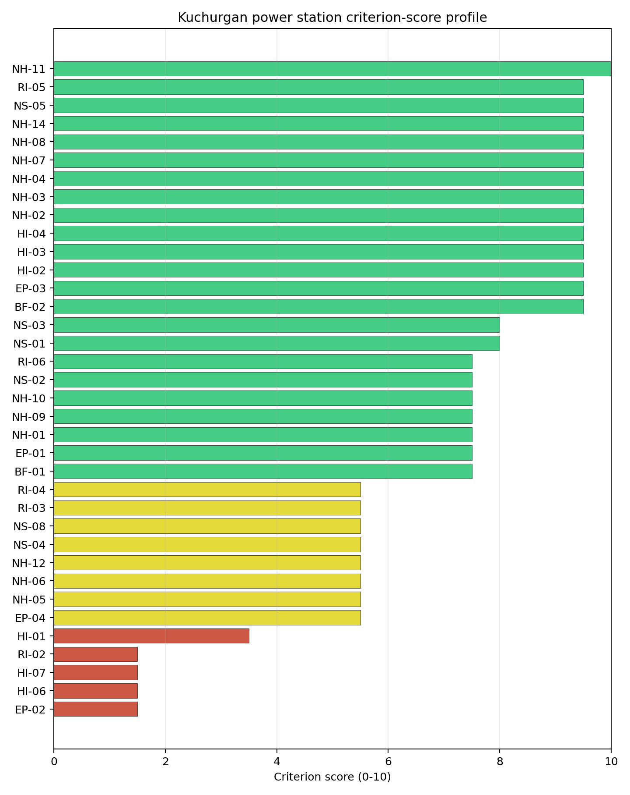

# Kuchurgan power station Site Profile

Kuchurgan power station is Moldova's only ranked brownfield thermal-site candidate in the frozen NuScale VOYGR-6 Stage 1-2 screen. It passes the exclusionary screen but retains an Aircraft Crash (HI-01) avoidance flag, so the profile supports a targeted Stage 3 decision gate rather than an unconditional site-characterisation programme.

## Site Snapshot

| Field | Value |
| --- | --- |
| Site name | Kuchurgan power station |
| Coordinates | 46.6290, 29.9397 |
| Subnational unit | Transnistria |
| Installed thermal capacity (source data) | 1,400 MW |
| Available surface area | 200.0 ha |
| Available surface area for development | 186.2 ha |
| Composite score (baseline weights) | 6.959 (6.199-7.500 MC band) |
| National stability band | A (top-10% hit rate 100%) |
| National rank | 1 |

_See the country status map in_ [Moldova Country Profile](../MD_country_prototype.md#country-status-map).

## Ownership and Coal-to-Nuclear Context

The bundle records Kuchurgan as a mothballed 1,400 MW coal-fired complex with seven mothballed units. The earliest unit commissioning year is 1964 and the most recent is 1971. The site therefore has a long thermal-generation history, but the reuse case depends on whether grid, land, cooling, ownership and governance conditions can be verified for nuclear-grade redevelopment.

The ownership chain is concentrated around Russian-linked entities. The immediate operator is Moldavskaya GRES CJSC, with Inter RAO PJSC recorded as the 100% parent of the plant operator in the site bundle. Additional beneficial ownership rows include Inter RAO Capital JSC, Rosneftegaz JSC, the Government of Russia, the Federal Agency for State Property Management, and Federal Grid Company - Rosseti PJSC. This evidence should be treated as an ownership and programme-governance issue for Stage 3, not as a statement that any party has project rights for nuclear redevelopment.

Kuchurgan is also a first-programme governance case for Moldova. Stage 3 preparation would need to test the recognised Moldovan regulatory pathway, the de facto local governance environment, cross-border interfaces with Ukraine where relevant, workforce readiness, site access, land control and investor eligibility before technical characterisation can be relied on for a deployment decision.

## Natural Hazards (NH)

| Criterion | Screening score | Key evidence |
| --- | ---: | --- |
| NH-01 Seismic ground motion | 7.5/10 | 475-year PGA 0.085 g; 2,475-year PGA 0.156 g |
| NH-02 Surface rupture | 9.5/10 | No mapped capable fault inside the 50 km search radius |
| NH-03 Liquefaction | 9.5/10 | Very low liquefaction susceptibility; silty clay loam |
| NH-04 Slope stability | 9.5/10 | Mean site slope 2.73 degrees; gentle slope-stability class |
| NH-05 Subsidence / karst / mining | 5.5/10 | Moderate karst-severity context; mapped mining feature 9.301 km away |
| NH-06 Foundation conditions | 5.5/10 | Bearing-capacity proxy 84.7 kPa; depth to bedrock 26.74 m |
| NH-09 River flooding | 7.5/10 | Flood-zone class negligible at screening stage |
| NH-11 Extreme precipitation | 10.0/10 | Screening precipitation values remain low-confidence for design use |

Natural hazards are one of Kuchurgan's stronger screening families. Ground motion sits comfortably below the project screening boundary, surface-rupture evidence is favourable at desk-study level, liquefaction is very low in the current data, and the site has a gentle topographic profile. These findings support carrying the site into targeted review if the aviation avoidance issue is resolved.

The main natural-hazard follow-up is not a standing exclusionary trigger; it is evidence hardening. Stage 3 should confirm flood levels for the Kuchurhan River and reservoir setting, run geotechnical fieldwork for bearing, groundwater, liquefaction and karst uncertainty, and replace the low-confidence precipitation and design-hydrology proxies with national station records and site drainage surveys.

## Human-Induced and Security-Relevant Hazards (HI)

| Criterion | Screening score | Key evidence |
| --- | ---: | --- |
| HI-01 Aircraft Crash | 3.5/10 | Lymanske Airfield 7.03 km away; flight-path proxy 3.52 km away; 2 airports within 30 km |
| HI-02 Industrial explosions | 9.5/10 | Completed search records no in-radius signal in the current evidence |
| HI-03 Toxic / gas releases | 9.5/10 | Completed search records no in-radius signal in the current evidence |
| HI-04 External fires | 9.5/10 | Completed search records no in-radius signal in the current evidence |
| HI-06 Military installations | 1.5/10 | Nearest high-consequence military feature 11.38 km away; 13 military features within 25 km |
| HI-07 Electromagnetic interference | 1.5/10 | Nearest transmitter 0.47 km away; 85 transmitter-like features within 25 km |

Human-induced hazards are the binding family for site selection. HI-01 is the only country-level avoidance flag and must be resolved before Kuchurgan is promoted from an avoidance-flagged candidate to a Stage 3 characterisation candidate. The airfield and flight-path distances require a current aviation hazard assessment, including runway use, approach and departure paths, airspace restrictions and cross-border operating conditions.

HI-06 and HI-07 are not recorded as exclusionary failures, but they are material residual risks. The military-feature cluster, nearest high-consequence feature at 11.38 km, and dense transmitter environment require security, standoff and electromagnetic compatibility review. Stage 3 should also refresh hazardous-neighbour evidence because the site sits in a governance environment where standard public industrial registers may be incomplete.

## Radiological Impact and Emergency Planning (RI / EP)

| Criterion | Screening score | Key evidence |
| --- | ---: | --- |
| EP-01 Emergency planning feasibility | 7.5/10 | Composite 67.0/100; road sub-score 37.0/100; evacuation feasible |
| EP-02 Evacuation routes | 1.5/10 | EPZ road density 0.27 km/km2; road length 529.66 km; motorway access present |
| EP-04 Special populations | 5.5/10 | 15 hospitals or clinics in the EPZ; no prisons or care homes recorded |
| RI-02 Surface water dispersion | 1.5/10 | Cooling-source flow 6.73 m3/s; liquid-pathway dilution needs low-flow confirmation |
| RI-04 Population density | 5.5/10 | 7,498 people within 5 km; 81,888 people within 25 km |
| RI-05 Distance to large population centres | 9.5/10 | No city above 50,000 people recorded within the screening envelope |
| RI-06 Population projections | 7.5/10 | Projected 25 km population 44,025 after 60 years |

Radiological impact is moderate in the current evidence and emergency planning is the more immediate constraint. Population density is manageable for a screening-stage site, with 95.48 people/km2 within 5 km and 41.71 people/km2 within 25 km. The nearest large-population-centre criterion is favourable in the current bundle, and population projection evidence reduces long-term pressure within the 25 km planning radius.

The road network and liquid-pathway evidence require early Stage 3 attention. EP-02 scores 1.5/10 because the EPZ road density is low, even though the bundle records motorway access. RI-02 also scores 1.5/10 because the current surface-water dispersion proxy is tied to a 6.73 m3/s Kuchurhan River flow. Stage 3 should therefore model EPZ clearance times, test cross-border emergency-planning interfaces, and quantify low-flow dilution and discharge pathways before any emergency-planning conclusion is hardened.

## Non-Safety and Implementation Considerations (NS)

| Criterion | Screening score | Key evidence |
| --- | ---: | --- |
| BF-01 Grid capacity basic filter | 7.5/10 | Basic grid adequacy note is favourable |
| BF-02 Land area basic filter | 9.5/10 | Contiguous and buildable area exceeds the ideal screening area |
| NS-01 Cooling water availability | 8.0/10 | Kuchurhan River 0.98 km away; flow 6.73 m3/s; water-stress label Low |
| NS-02 Grid connection | 7.5/10 | Substation 0.47 km away; high-voltage line 0.06 km away; 330 kV nearby line; 1,400 MW export-capacity estimate |
| NS-03 Transport access | 8.0/10 | Highway 2.77 km away; rail 0.20 km away; waterway 8.29 km away; heavy-haul capable |
| NS-04 Site topography | 5.5/10 | 44.1% favourable land cover; 48.0% unfavourable land cover |
| NS-05 Site footprint adequacy | 9.5/10 | 200.0 ha canonical site area; 186.16 ha buildable area; 4 buildable patches |
| NS-08 Ecological sensitivity | 5.5/10 | Nistrul de Jos Emerald Network area 8.444 km away; no direct overlap recorded |

Implementation evidence is the strongest part of Kuchurgan's profile. The physical brownfield case is clear at screening level: the site has a large available surface-area estimate, a 186.16 ha buildable-area estimate, a nearby 330 kV grid context, 1,400 MW of inferred export capacity, rail access, and a low water-stress cooling-source label. These are the attributes that justify retaining Kuchurgan after the aviation flag is resolved.

The same evidence also defines the main limits. The 200.0 ha surface-area value and 186.16 ha development-area value are screening-stage land figures; they do not prove available, contiguous, permitted or controlled nuclear-development land. The ecological screen records Nistrul de Jos 8.444 km away with no overlap, but the non-EU protected-area context and the low-confidence regulatory-political criterion mean Stage 3 should include national EIA scoping, protected-area pathway review, land-title confirmation and grid-operability confirmation.

## Composite Score and Stability

Baseline composite score is 6.959, bracketed by the national Monte Carlo interval at 6.199-7.500. National stability band is `A`, with 100% top-5, top-10 and top-30 hit rates across 12 scored national sensitivity scenarios.

Kuchurgan's national stability is high because it is the only ranked Moldovan site. The score is still useful: it shows that the site remains Moldova's leading brownfield candidate under national weight perturbations and that its positive implementation, natural-hazard and radiological attributes are not a narrow baseline-weight artefact. The interpretation should stay disciplined, however. The site is nationally stable but avoidance-flagged, and the country has no second brownfield candidate to absorb a negative finding.

The practical Stage 3 priority is therefore to retire the issues that could change the go/no-go judgement. HI-01 aviation hazard comes first, followed by HI-06 security and governance, EP-02 evacuation capacity, RI-02 liquid-pathway dilution, HI-07 electromagnetic compatibility, land-control confirmation, ecological screening and ownership/programme governance.

## Residual Risk Register

| Concern | Evidence | Consequence | Stage 3 action | Owner discipline |
| --- | --- | --- | --- | --- |
| Aircraft Crash (HI-01) | Small airfield 7.03 km away; flight-path proxy 3.52 km away | The only Moldovan site remains avoidance-flagged until aviation hazard is resolved | Commission aviation hazard assessment with current flight-path and airspace evidence | aviation safety |
| Military Installations (HI-06) | Nearest high-consequence military feature 11.38 km away; 13 military features within 25 km | Security standoff and governance constraints could materially narrow the feasible site envelope | Confirm feature classification, operating status, standoff requirements and security interfaces | security |
| Electromagnetic Interference (HI-07) | Nearest transmitter 0.47 km away; 85 transmitter-like features within 25 km | RF/EMI controls may require exclusion distances, shielding or operating constraints | Survey transmitter inventory, field strengths and compatibility requirements | electrical / I&C |
| Evacuation Routes (EP-02) | EPZ road density 0.27 km/km2; 529.66 km of road; motorway access present | Low route density may constrain clearance-time assumptions | Model EPZ clearance times under realistic traffic and seasonal conditions | emergency planning |
| Surface Water Dispersion (RI-02) | Kuchurhan River flow proxy 6.73 m3/s; RI-02 score 1.5/10 | Low-flow dilution may constrain discharge pathway design | Quantify low-flow recurrence, reservoir interaction, downstream users and discharge limits | hydrology |
| Land and Ownership | 200.0 ha site area and 186.16 ha buildable area are screening-stage values; ownership chain runs through Russian-linked entities | Land control, sanctions, title, access or programme eligibility may become gating issues | Verify title, site-control rights, ownership eligibility and governance approvals | legal / programme |
| Ecological Sensitivity (NS-08) | Nistrul de Jos Emerald Network area 8.444 km away; no overlap recorded | Indirect effects could alter the usable development envelope | Run protected-area pathway review and national EIA scoping | EIA |
| Governance and First-Programme Readiness | Moldova is treated as a first-programme nuclear jurisdiction in this profile | Regulatory, institutional and workforce readiness may dominate the technical site path | Define national regulator, emergency authorities, workforce plan and international support route | programme governance |

## Stage 3 Follow-Up Checklist

- Resolve **Aircraft Crash (HI-01)** using current aviation, flight-path and airspace data for the 7.03 km airfield and 3.52 km flight-path proxy.
- Confirm **Military Installations (HI-06)** feature class, operating status and required security standoff.
- Run **Electromagnetic Interference (HI-07)** field-strength and transmitter-inventory surveys.
- Model **Evacuation Routes (EP-02)** clearance times using the 0.27 km/km2 EPZ road-density constraint.
- Quantify **Surface Water Dispersion (RI-02)** low-flow dilution for the Kuchurhan River and reservoir setting.
- Verify **Site Footprint Adequacy (NS-05)** land control, contiguity, buildability and permitted reuse for the 200.0 ha site area and 186.16 ha development-area estimate.
- Scope **Ecological Sensitivity (NS-08)** against the Nistrul de Jos protected-area pathway and national EIA requirements.
- Confirm grid operability for the 330 kV context, nearby substation, nearby high-voltage line and 1,400 MW export-capacity estimate.
- Resolve ownership and programme-governance eligibility before committing to field characterisation.

## Evidence Limitations

- The aviation, military, industrial-hazard and emergency-planning evidence needs current local authority confirmation because Kuchurgan sits in a complex governance setting.
- The surface-area and development-area values are screening-stage land indicators and do not prove nuclear-development rights, title, permitting status or constructability.
- RI-02, EP-02, HI-06 and HI-07 have low or weak scores that should be treated as priority characterisation issues.
- NS-06, NS-10, NS-12 and NS-13 remain unscored or low-confidence implementation fields and should be converted into site-specific evidence before any deployment-level conclusion.
