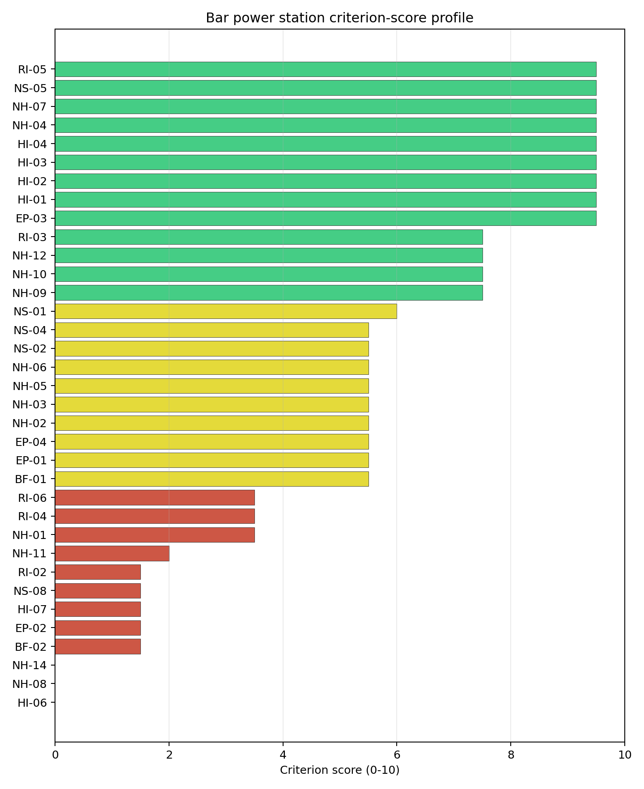

# Bar power station Site Profile

Bar power station is a coal/thermal site in Montenegro that has been tested against the NuScale VOYGR-6 reference deployment envelope. This profile reads the screening evidence at a level that supports a decision to progress toward Stage 3 characterisation. It is not a site-suitability determination, vendor recommendation, or licensing finding.

## Site Snapshot

| Field | Value |
| --- | --- |
| Site name | Bar power station |
| Coordinates | 42.1000, 19.1000 |
| Subnational unit | Bar |
| Installed thermal capacity (source data) | 800 MW |
| Available surface area | N/A |
| Available surface area for development | N/A |
| Composite score (baseline weights) | 6.023 (5.321-6.467 MC band) |
| National stability band | A (top-10% hit rate 100%) |
| National rank | 1 |

_See the country status map in_ [Montenegro Country Profile](../ME_country_prototype.md#country-status-map).

## Ownership and Coal-to-Nuclear Context

The ownership record lists Enel SpA and Dufenergy Italia SpA as immediate owners or operators. The parent-chain record also includes Duferco Participations Holding SA, the Ministry of Economy and Finance (Italy), BlackRock Inc, Blackrock Advisors LLC, The Vanguard Group Inc and small shareholder(s), but the plant-level share entries are not quantified. Legal control, land rights and any state or private decision pathway therefore require first-party confirmation before publication or Stage 3 procurement assumptions.

Generating units on record: 1 cancelled.
Earliest unit commissioning: 2014; most recent: 2014.

## Natural Hazards (NH)

- **Seismic: Ground Motion (NH-01)** - score 3.5/10 (MC 3.0-4.0), weight 0.0455, data quality high. Evidence: PGA at 475-year return period 0.289 g; PGA at 2,475-year return period 0.689 g; Vs30 reference (m/s): 760.0.
- **Seismic: Surface Rupture (NH-02)** - score 5.5/10 (MC 5.0-6.0) - pass-mark band: Borderline acceptable separation: meets the 8.0 km score boundary; check against the 8 km conservative screen and local capability evidence., weight n/a, data quality screening grade. Evidence: nearest mapped capable fault 10.4 km; fault slip rate 0.324 mm/yr; fault name: MECF005.
- **Geotechnical: Liquefaction (NH-03)** - score 5.5/10 (MC 5.0-6.0) - pass-mark band: Moderate susceptibility, or high/very-high with documented (or pending for `high`) mitigation., weight n/a, data quality medium. Evidence: liquefaction susceptibility: moderate; dominant soil type: silty_clay_loam.
- **Geotechnical: Slope Stability (NH-04)** - score 9.5/10 (MC 9.0-10.0) - favourable: Well below the risk boundary., weight n/a, data quality screening grade. Evidence: site slope 3.81 deg; max slope in 1 km box 67.6 deg; slope stability class: gentle.
- **Geotechnical: Subsidence (NH-05)** - score 5.5/10 (MC 5.0-6.0) - pass-mark band: At or above the mine-distance score-5 pivot; review possible., weight 0.0354, data quality medium. Evidence: karst present: no; karst severity: moderate; formation type: carbonate (Continuous carbonate rocks).
- **Geotechnical: Foundation (NH-06)** - score 5.5/10 (MC 5.0-6.0) - pass-mark band: Typical European mixed conditions (bearing 80-150 kPa)., weight 0.0253, data quality medium. Evidence: bearing capacity 87.3 kPa; depth to bedrock 23.0 m.
- **Volcanism (NH-07)** - score 9.5/10 (MC 9.0-10.0) - favourable: Very strong margin above the score-5 boundary (or no in-radius signal is recorded)., weight n/a, data quality high. Evidence: volcanic hazard class: negligible.
- **Coastal Flooding (NH-08)** - score 0.0/10 (MC 0.0-0.0), weight 0.0303, data quality medium. Evidence: distance to coast 1.56 km.
- **River Flooding (NH-09)** - score 7.5/10 (MC 7.0-8.0), weight 0.0404, data quality medium. Evidence: flood zone class: negligible.
- **Extreme Winds (NH-10)** - score 7.5/10 (MC 7.0-8.0), weight 0.0152, data quality medium. Evidence: screening wind-speed index 8.79 m/s.
- **Extreme Precipitation (NH-11)** - score 2.0/10 (MC 2.0-3.0), weight 0.0152, data quality medium. Evidence: screening extreme-precipitation index 0.81 mm; screening precipitation index 66.4 mm/yr.
- **Extreme Temperatures (NH-12)** - score 7.5/10 (MC 7.0-8.0), weight 0.0202, data quality medium. Evidence: extreme high temperature 27.0 deg C; extreme low temperature 6.14 deg C.
- **Combined Hazards (NH-14)** - score 0.0/10 (MC 0.0-0.0), weight 0.0152, data quality n/a. Evidence: values not in measurement tables.

### Interpretation - Natural Hazards (NH)

Natural hazards at Bar are the controlling technical issue for the site. Seismic: Ground Motion (NH-01) carries an avoidance flag: PGA is 0.289 g at the 475-year return period and 0.689 g at the 2,475-year return period, above the project's 0.5 g avoidance threshold for the long-return-period case. Seismic: Surface Rupture (NH-02) is less severe but still material, with the nearest mapped capable fault 10.42 km away and a recorded slip rate of 0.324 mm/year. Coastal Flooding (NH-08) is the second avoidance flag: the site is 1.56 km from the coast and only 11.9 m above sea level, with no final storm-surge or tsunami characterisation at this stage. The geotechnical record is mixed rather than prohibitive. Liquefaction susceptibility is moderate, bearing capacity is 87.3 kPa, depth to bedrock is 23.02 m, and the mean site slope is 3.81 degrees, although local relief still requires field confirmation. Extreme precipitation remains a low-confidence input at 66.44 mm/year screening precipitation index and 0.81 mm screening extreme-precipitation index. Stage 3 should begin with a project-specific probabilistic seismic hazard assessment on measured site response, then coastal inundation and tsunami modelling, followed by geotechnical and design-hydrology confirmation.

## Human-Induced and Security-Relevant Hazards (HI)

- **Aircraft Crash (HI-01)** - score 9.5/10 (MC 9.0-10.0) - favourable: Only small / GA / heliport airport >= 10 km nearby, no flight-path proxy < 4 km, no major airport within 30 km, and no military airbase within 60 km., weight 0.0354, data quality high. Evidence: nearest airport 28.0 km; nearest flight path 15.7 km; airports within search radius 1; airport name: Splendid Hotel Helipad; airport type: heliport.
- **Industrial Explosions (HI-02)** - score 9.5/10 (MC 9.0-10.0) - favourable: Very strong margin above the score-5 boundary (or completed search confirmed no in-radius signal)., weight 0.0354, data quality screening grade. Evidence: values not in measurement tables.
- **Toxic/Gas Releases (HI-03)** - score 9.5/10 (MC 9.0-10.0) - favourable: Very strong margin above the score-5 boundary (or completed search confirmed no in-radius signal)., weight 0.0354, data quality screening grade. Evidence: values not in measurement tables.
- **External Fires (HI-04)** - score 9.5/10 (MC 9.0-10.0) - favourable: > 15 km, or completed flammable-storage search found nothing in radius., weight 0.0303, data quality screening grade. Evidence: values not in measurement tables.
- **Military Installations (HI-06)** - score 0.0/10 (MC 0.0-0.0), weight 0.0303, data quality high. Evidence: nearest military installation 0.89 km; military installations within radius 8; installation name: unnamed.
- **Electromagnetic Interference (HI-07)** - score 1.5/10 (MC 1.0-2.0), weight 0.0101, data quality medium. Evidence: nearest high-power transmitter 0.46 km; transmitters within radius 56; transmitter type: tower.

### Interpretation - Human-Induced and Security-Relevant Hazards (HI)

Human-induced and security-relevant hazards at Bar are uneven: the aviation and industrial screens are manageable, while security and electromagnetic-interference questions require early confirmation. Aircraft Crash (HI-01) records the nearest air feature, Splendid Hotel Helipad, at 28.0 km and the nearest flight-path proxy at 15.72 km, with one air feature in the search radius. Industrial Explosions (HI-02), Toxic/Gas Releases (HI-03), and External Fires (HI-04) score strongly in the frozen run, indicating no measured nearby hazard driver in the available screening evidence. The principal weakness is Military Installations (HI-06), which scores 0.0/10: the nearest recorded military feature is 0.89 km from the site, the nearest high-consequence feature is 23.94 km away, and eight military features are recorded within 25 km. Electromagnetic Interference (HI-07) is also material, with the nearest transmitter 0.46 km away and 56 transmitters within 25 km. Stage 3 should therefore prioritize official security-feature confirmation, airspace and standoff review, and an RF/EMI field survey before the site is treated as a stable implementation option.

## Radiological Impact and Emergency Planning (RI / EP)

- **Emergency Planning Feasibility (EP-01)** - score 5.5/10 (MC 5.0-6.0) - pass-mark band: At or above the composite score-5 boundary., weight n/a, data quality high. Evidence: EP feasibility composite 52.7 /100; road sub-score 28.8 /100; special-population sub-score 90.0 /100; geography sub-score 95.0 /100; population sub-score 60.0 /100; evacuation feasible: yes.
- **Evacuation Routes (EP-02)** - score 1.5/10 (MC 1.0-2.0), weight 0.0303, data quality medium. Evidence: road density in EPZ 0.188 km/km2; road length in EPZ 369.4 km; motorway access: yes.
- **Physical Geography Constraints (EP-03)** - score 9.5/10 (MC 9.0-10.0) - favourable: No measured relief; open river/waterway context (interim screening)., weight 0.0253, data quality medium. Evidence: waterways crossing EPZ 0; major river barrier: no.
- **Special Populations (EP-04)** - score 5.5/10 (MC 5.0-6.0) - pass-mark band: 9-25., weight 0.0303, data quality medium. Evidence: hospitals in EPZ 10; prisons in EPZ 0; care homes in EPZ 0.
- **Atmospheric Dispersion (RI-01)** - score no native score (unscored - no band matched), weight 0.0303, data quality medium. Evidence: annual mean wind speed 1.4 m/s; atmospheric mixing height 425.8 m; prevailing wind direction: ENE.
- **Surface Water Dispersion (RI-02)** - score 1.5/10 (MC 1.0-2.0), weight 0.0253, data quality n/a. Evidence: values not in measurement tables.
- **Groundwater Dispersion (RI-03)** - score 7.5/10 (MC 7.0-8.0), weight 0.0253, data quality medium. Evidence: aquifer type: low permeability.
- **Population Density at EPZ Radii (RI-04)** - score 3.5/10 (MC 3.0-4.0), weight 0.0404, data quality screening grade. Evidence: population density within 5 km 396.1 /km2; population density within 16 km 59.2 /km2; population density within 25 km 34.9 /km2; population density within 80 km 40.8 /km2; population within 25 km 68,443 people.
- **Distance to Population Centres (RI-05)** - score 9.5/10 (MC 9.0-10.0) - favourable: No >=50k population-centre proxy within screening envelope., weight 0.0505, data quality screening grade. Evidence: values not in measurement tables.
- **Population Projections (RI-06)** - score 3.5/10 (MC 3.0-4.0), weight 0.0253, data quality screening grade. Evidence: annual population growth rate 0.497 %/yr; projected population at 25 km in 60 yr 50,059 people.

### Interpretation - Radiological Impact and Emergency Planning (RI / EP)

Radiological impact and emergency planning at Bar are dominated by the coastal settlement pattern and the constrained evacuation network. The 5 km population is 31,106 people, with density of 396.09 people/km2; the 25 km population is 68,443 people and the 80 km population is 819,869 people. Population growth is recorded at 0.497% per year, with a 60-year 25 km projection of 50,059 people. Emergency Planning Feasibility (EP-01) remains feasible at 52.7/100, but the sub-scores show why this is not a comfortable result: the road score is 28.8/100 and the terrain score is 10.0/100, while EPZ road density is only 0.188 km/km2 across 369.39 km of roads. Surface Water Dispersion (RI-02) is a low-scoring liquid-pathway issue, while the recorded cooling-source proxy is a small river 13.52 km away with 2.27 m3/s flow. Stage 3 should model EPZ clearance under seasonal coastal demand, confirm the source-term placement against the Bar urban area, and replace the screening liquid-pathway proxy with a site-specific marine and groundwater dispersion assessment.

## Non-Safety and Implementation Considerations (NS)

- **Grid Capacity Basic Filter (BF-01)** - score 5.5/10 (MC 5.0-6.0) - pass-mark band: Note: substation 15-30 km OR 110-219 kV; reinforcement plausible., weight n/a, data quality n/a. Evidence: values not in measurement tables.
- **Land Area Basic Filter (BF-02)** - score 1.5/10 (MC 1.0-2.0), weight 0.0253, data quality n/a. Evidence: values not in measurement tables.
- **Cooling Water Availability (NS-01)** - score 6.0/10 (MC 5.0-6.0) - pass-mark band: aggregated(weighted_mean_of_sub_scores), weight 0.0404, data quality screening grade. Evidence: distance to cooling source 13.5 km; cooling source flow 2.27 m3/s; cooling source type: small_river; cooling source name: Rena; water stress label: Low.
- **Grid Connection (NS-02)** - score 5.5/10 (MC 5.0-6.0) - pass-mark band: aggregated(min_of_sub_scores), weight 0.0404, data quality high. Evidence: nearest substation 0.26 km; nearest high-voltage line 1.01 km; highest nearby line voltage 110.0 kV; grid export capacity 800.0 MW; substations within radius 264; HV lines within radius 186.
- **Transport Access (NS-03)** - score no native score (unscored - no band matched), weight 0.0404, data quality low. Evidence: not measured at this site (criterion remains unscored).
- **Site Topography (NS-04)** - score 5.5/10 (MC 5.0-6.0) - pass-mark band: 40-60 %., weight 0.0303, data quality screening grade. Evidence: favourable land cover 41.7 %; moderate land cover 10.6 %; unfavourable land cover 47.7 %; favourable area 92.9 ha; dominant land class: 112.
- **Site Footprint Adequacy (NS-05)** - score 9.5/10 (MC 9.0-10.0) - favourable: Very strong margin above the score-5 boundary., weight 0.0253, data quality high. Evidence: buildable area 9.68 ha; largest contiguous patch 9.68 ha; buildable patch count 12.
- **Existing Infrastructure (NS-06)** - score no native score (unscored - no band matched), weight 0.0253, data quality n/a. Evidence: not measured at this site (criterion remains unscored).
- **Ecological Sensitivity (NS-08)** - score 1.5/10 (MC 0.0-3.5), weight n/a, data quality insufficient. Evidence: natural land cover 47.7 %; distance to nearest protected area 0.575 km; Natura 2000 sensitivity class: unknown; protected-area overlap: no; protected-area sensitivity class: high; Natura 2000 sites within 5 km: 0; nearest protected-area designation: Natural Monument.
- **Workforce Availability (NS-10)** - score no native score (unscored - no band matched), weight 0.0202, data quality n/a. Evidence: not measured at this site (criterion remains unscored).
- **Regulatory/Political Environment (NS-12)** - score no native score (unscored - no band matched), weight 0.0303, data quality n/a. Evidence: not measured at this site (criterion remains unscored).
- **Construction Logistics (NS-13)** - score no native score (unscored - no band matched), weight 0.0202, data quality n/a. Evidence: not measured at this site (criterion remains unscored).

### Interpretation - Non-Safety and Implementation Considerations (NS)

Non-safety and implementation conditions at Bar contain useful brownfield attributes but also several constraints that could shape the NuScale VOYGR-6 envelope. The local screening record identifies 92.86 ha of favourable area, but first-party evidence of available, controlled and permitted development land is not yet present, so land availability remains a Stage 3 confirmation item. The older buildable-patch indicator is 9.68 ha across 12 patches and should be treated as supporting context rather than proof of the final deployment footprint. Grid proximity is favourable in distance terms: the nearest substation is 0.26 km away, the nearest high-voltage line is 1.01 km away, and the screening export-capacity estimate is 800 MW. The voltage pathway is less mature, with the highest nearby line at 110 kV. Cooling Water Availability (NS-01) needs replacement by a project-specific cooling strategy because the recorded small-river proxy is 13.52 km away with 2.27 m3/s flow. Ecological Sensitivity (NS-08) is a material permitting question: the nearest protected area is 0.575 km away and has a high sensitivity class, although no overlap is recorded for the Bar site. Stage 3 should confirm land control and contiguity, the 220 kV or 400 kV grid pathway, cooling concept, transport access, and ecological screening before any implementation claim is hardened.

## Composite Score and Stability

Baseline composite score is 6.023, bracketed by Monte Carlo at 5.321-6.467. National stability band is `A` with a top-10% hit rate of 100% across 12 scored Monte Carlo scenarios.

Bar's baseline composite score is 6.023, with a national Monte Carlo bracket of 5.321-6.467. The national stability band is A, and the site records 100% top-5, top-10 and top-30 hit rates across the 12 scored national sensitivity cases. That is a strong national stability result, but it is strong inside a very small candidate pool: Bar remains the only ranked Montenegrin site because Berane, Maoce and Pljevlja are removed at the exclusionary screen. The family balance is mixed. Human-induced hazards are the strongest family at 7.41/10, followed by Non-Safety and Implementation at 6.39/10 and Radiological Impact at 6.35/10, while Natural Hazards are the main drag at 4.80/10 and Emergency Planning is moderate at 5.26/10. The next characterisation effort would narrow the uncertainty band most by resolving NH-01, NH-08, HI-06, EP-02 and first-party land availability, because those items determine whether Bar is a credible Stage 3 candidate or only the least-constrained member of a weak national brownfield pool.

## Residual Risk Register

| Concern | Evidence | Consequence | Stage 3 action | Owner discipline |
| --- | --- | --- | --- | --- |
| Seismic: Ground Motion (NH-01) | PGA at 2,475-year return period is 0.689 g | Design-basis ground motion may remain above the project avoidance envelope | Re-measure site response and complete project-specific seismic hazard analysis | seismic |
| Coastal Flooding (NH-08) | Coast distance is 1.56 km and elevation is 11.9 m | Storm-surge or tsunami exposure could constrain the usable site envelope | Model coastal inundation, storm surge and tsunami return periods | hydrology |
| Military Installations (HI-06) | Nearest recorded military feature is 0.89 km away; eight features are within 25 km | Security standoff or coordination requirements could narrow the site boundary | Engage national defence authorities and verify the feature inventory | security |
| Evacuation Routes (EP-02) | EPZ road density is 0.188 km/km2 and the road sub-score is 28.8/100 | Clearance time may be constrained by the coastal corridor and terrain | Model EPZ evacuation under seasonal and peak-traffic conditions | emergency planning |
| Ecological Sensitivity (NS-08) | Nearest protected area is 0.575 km away with high sensitivity class | Permitting may narrow the development envelope or require avoidance buffers | Confirm protected-area boundaries and receptor pathways | EIA |
| Land availability and contiguity | First-party availability evidence is absent; supporting buildable-patch indicator is 9.68 ha | The VOYGR-6 footprint may not fit without boundary or layout changes | Confirm ownership, control, contiguity and permitted development area | ownership/legal |

NH-01 and NH-08 dominate the register because they decide whether the site can remain in the Stage 3 characterisation sequence at all. HI-06, EP-02, NS-08 and land control are the practical implementation risks that would determine the shape, cost and stakeholder pathway of any later site evaluation. This register is a Stage 3 work plan, not a finding of site approval.

## Stage 3 Follow-Up Checklist

- Complete site-specific seismic hazard and site-response work for **Seismic: Ground Motion (NH-01)**, because PGA at the 2,475-year return period is 0.689 g.
- Model coastal inundation, storm surge and tsunami exposure for **Coastal Flooding (NH-08)**, because the site is 1.56 km from the coast and 11.9 m above sea level.
- Confirm the official security-feature inventory for **Military Installations (HI-06)**, because the nearest recorded feature is 0.89 km away.
- Model EPZ clearance and seasonal traffic constraints for **Evacuation Routes (EP-02)**, because EPZ road density is 0.188 km/km2.
- Survey RF conditions for **Electromagnetic Interference (HI-07)**, because the nearest transmitter is 0.46 km away and 56 transmitters are recorded within 25 km.
- Replace the screening liquid-pathway proxy for **Surface Water Dispersion (RI-02)** with a site-specific marine and groundwater dispersion assessment.
- Confirm first-party land control, contiguity and permitted development area before relying on the screening land envelope.
- Improve data quality for **Geotechnical: Subsidence & Collapse (NH-05b)** and **Transport Access (NS-03)**.

## Evidence Limitations

- No first-party available-area or development-area value is present in the local bundle, so both snapshot area rows are reported as `N/A`.
- Geotechnical: Subsidence & Collapse (NH-05b) and Transport Access (NS-03) carry low-quality evidence flags.
- Several implementation criteria remain unscored at Stage 1-2, including Existing Infrastructure (NS-06), Workforce Availability (NS-10), Regulatory/Political Environment (NS-12), and Construction Logistics (NS-13).
