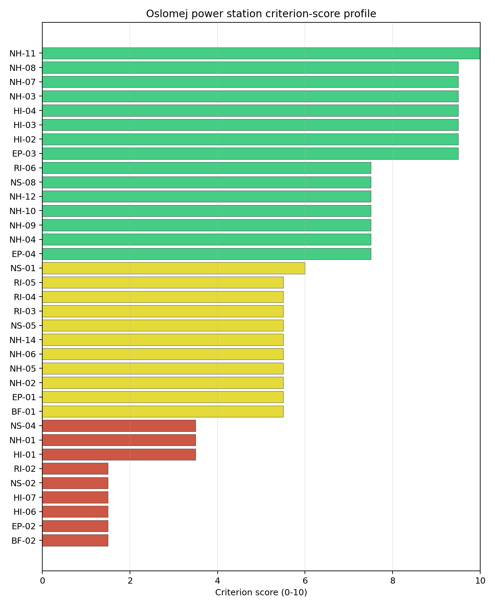
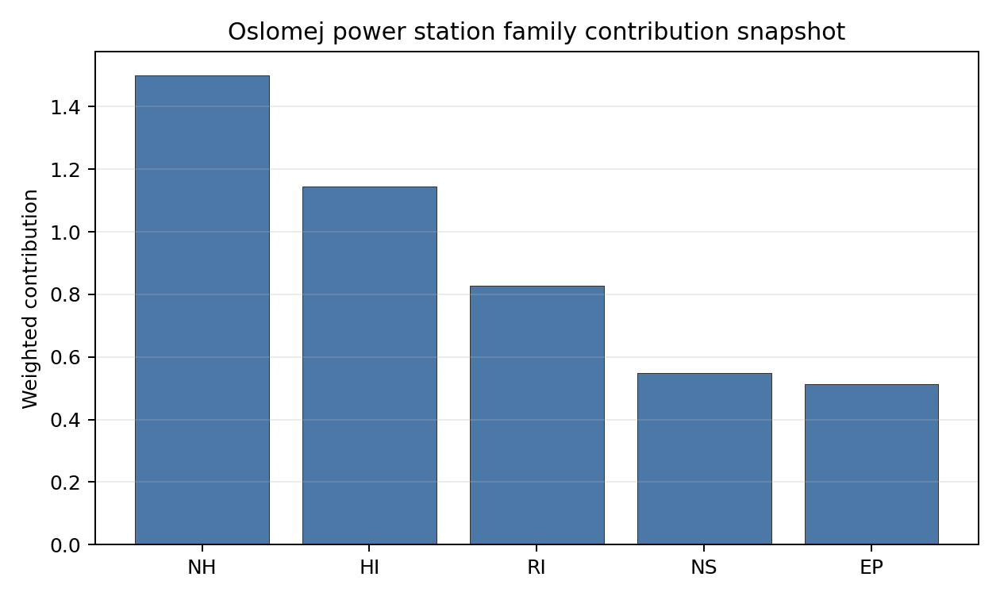

# Oslomej power station Site Profile

Oslomej power station is a coal/thermal site in North Macedonia that has been tested against the NuScale VOYGR-6 reference deployment envelope. This profile reads the screening evidence at a level that supports a decision to progress toward Stage 3 characterisation. It is not a site-suitability determination, vendor recommendation, or licensing finding.

## Site Snapshot

| Field | Value |
| --- | --- |
| Site name | Oslomej power station |
| Coordinates | 41.5821, 21.0003 |
| Subnational unit | Kičevo |
| Installed thermal capacity (source data) | 254 MW |
| Available surface area | 26.0 ha |
| Available surface area for development | 18.8 ha |
| Composite score (baseline weights) | 5.905 (5.230-6.421 MC band) |
| National stability band | H (top-10% hit rate 0%) |
| National rank | 3 |

_See the country status map in_ [North Macedonia Country Profile](../MK_country_prototype.md#country-status-map).

## Ownership and Coal-to-Nuclear Context

- **Government of North Macedonia** (100.00% share), headquartered in North Macedonia; immediate operator Elektrani na Severna Makedonija AD. Path: Government of North Macedonia  -> Elektrani na Severna Makedonija AD [100.0%] -> Oslomej power station Reconstruction [100.0%]
- **Elektrani na Severna Makedonija AD** (100.00% share), headquartered in North Macedonia; immediate operator Elektrani na Severna Makedonija AD. Path: Elektrani na Severna Makedonija AD -> Oslomej power station Reconstruction [100.0%]

Generating units on record: 1 cancelled, 1 operating.
Earliest unit commissioning: 1980; most recent: 1980.

## Natural Hazards (NH)

- **Seismic: Ground Motion (NH-01)** - score 3.5/10 (MC 3.0-4.0), weight 0.0455, data quality high. Evidence: PGA at 475-year return period 0.346 g; PGA at 2,475-year return period 0.727 g; Vs30 reference (m/s): 760.0.
- **Seismic: Surface Rupture (NH-02)** - score 5.5/10 (MC 5.0-6.0), weight n/a, data quality screening grade. Evidence: nearest mapped capable fault 11.4 km; fault slip rate 0.2 mm/yr; fault name: MKCF005.
- **Geotechnical: Liquefaction (NH-03)** - score 9.5/10 (MC 9.0-10.0), weight n/a, data quality medium. Evidence: liquefaction susceptibility: very_low; dominant soil type: loam.
- **Geotechnical: Slope Stability (NH-04)** - score 7.5/10 (MC 7.0-8.0), weight n/a, data quality screening grade. Evidence: site slope 9.92 deg; max slope in 1 km box 88.0 deg; slope stability class: moderate.
- **Geotechnical: Subsidence (NH-05)** - score 5.5/10 (MC 5.0-6.0), weight 0.0354, data quality medium. Evidence: karst present: no; karst severity: moderate; formation type: carbonate (Discontinuous carbonate rocks).
- **Geotechnical: Foundation (NH-06)** - score 5.5/10 (MC 5.0-6.0), weight 0.0253, data quality medium. Evidence: bearing capacity 86.0 kPa; depth to bedrock 22.8 m.
- **Volcanism (NH-07)** - score 9.5/10 (MC 9.0-10.0), weight n/a, data quality high. Evidence: volcanic hazard class: negligible.
- **Coastal Flooding (NH-08)** - score 9.5/10 (MC 9.0-10.0), weight 0.0303, data quality medium. Evidence: distance to coast 118.9 km.
- **River Flooding (NH-09)** - score 7.5/10 (MC 7.0-8.0), weight 0.0404, data quality medium. Evidence: flood zone class: negligible.
- **Extreme Winds (NH-10)** - score 7.5/10 (MC 7.0-8.0), weight 0.0152, data quality medium. Evidence: screening wind-speed index 7.89 m/s.
- **Extreme Precipitation (NH-11)** - score 10.0/10 (MC 9.0-10.0), weight 0.0152, data quality medium. Evidence: screening extreme-precipitation index 0.19 mm; screening precipitation index 24.1 mm/yr.
- **Extreme Temperatures (NH-12)** - score 7.5/10 (MC 7.0-8.0), weight 0.0202, data quality medium. Evidence: extreme high temperature 22.2 deg C; extreme low temperature -7.9 deg C.
- **Combined Hazards (NH-14)** - score 5.5/10 (MC 5.0-6.0), weight 0.0152, data quality n/a. Evidence: values not in measurement tables.

### Interpretation - Natural Hazards (NH)

Natural hazards at Oslomej are controlled by the strongest seismic signal in the Macedonian ranked set. Seismic: Ground Motion (NH-01) records 0.346 g at the 475-year return period and 0.727 g at the 2,475-year return period, well above the project's avoidance trigger and materially higher than Bitola or Negotino. Surface rupture is less severe in the screening record: the nearest mapped capable fault is 11.4 km away and the recorded slip rate is 0.2 mm/yr for MKCF005. Other geotechnical evidence is mixed. Liquefaction susceptibility is very low, but the site slope is 9.92 degrees, the maximum 1 km slope is 88.0 degrees, and the subsidence file records moderate karst severity in discontinuous carbonate rocks. Bearing capacity is 86.0 kPa and depth to bedrock is 22.8 m. River flooding is negligible, the coast is 118.9 km away, and the screening wind-speed index is 7.89 m/s. Stage 3 would therefore need a site-specific PSHA first, followed by karst-focused geophysics, slope review and foundation investigation; the ground-motion result may remain a binding avoidance issue even after better measurement.

## Human-Induced and Security-Relevant Hazards (HI)

- **Aircraft Crash (HI-01)** - score 3.5/10 (MC 3.0-4.0), weight 0.0354, data quality high. Evidence: nearest airport 7.41 km; nearest flight path 7.41 km; airports within search radius 1; airport name: Kičevo Military Barracks Heliport; airport type: heliport.
- **Industrial Explosions (HI-02)** - score 9.5/10 (MC 9.0-10.0), weight 0.0354, data quality screening grade. Evidence: values not in measurement tables.
- **Toxic/Gas Releases (HI-03)** - score 9.5/10 (MC 9.0-10.0), weight 0.0354, data quality screening grade. Evidence: values not in measurement tables.
- **External Fires (HI-04)** - score 9.5/10 (MC 9.0-10.0), weight 0.0303, data quality screening grade. Evidence: values not in measurement tables.
- **Military Installations (HI-06)** - score 1.5/10 (MC 1.0-2.0), weight 0.0303, data quality medium. Evidence: nearest military installation 7.33 km; military installations within radius 3; installation name: unnamed.
- **Electromagnetic Interference (HI-07)** - score 1.5/10 (MC 1.0-2.0), weight 0.0101, data quality medium. Evidence: nearest high-power transmitter 1.44 km; transmitters within radius 15; transmitter type: communication.

### Interpretation - Human-Induced and Security-Relevant Hazards (HI)

Human-induced hazards at Oslomej combine military, aviation and EMI constraints. Aircraft Crash (HI-01) scores 3.5/10 because Kičevo Military Barracks Heliport is 7.41 km from the site, with the nearest flight-path proxy also at 7.41 km. Military Installations (HI-06) scores 1.5/10: the nearest military feature is 7.33 km away and three military installations are recorded in the wider search radius. Electromagnetic Interference (HI-07) is also material, with the nearest communication transmitter 1.44 km away and 15 transmitters in the search radius. The wider industrial-hazard file is less adverse in the frozen run, with Industrial Explosions (HI-02), Toxic/Gas Releases (HI-03), and External Fires (HI-04) each at 9.5/10. Stage 3 should still refresh those inventories, but the first-order decisions are defence-interface confirmation, helicopter-crash hazard modelling and RF/EMI survey work. These checks decide whether Oslomej can move beyond a comparison case into an active characterisation option.

## Radiological Impact and Emergency Planning (RI / EP)

- **Emergency Planning Feasibility (EP-01)** - score 5.5/10 (MC 5.0-6.0), weight n/a, data quality high. Evidence: EP feasibility composite 59.7 /100; road sub-score 28.8 /100; special-population sub-score 90.0 /100; geography sub-score 95.0 /100; population sub-score 80.0 /100; evacuation feasible: yes.
- **Evacuation Routes (EP-02)** - score 1.5/10 (MC 1.0-2.0), weight 0.0303, data quality medium. Evidence: road density in EPZ 0.188 km/km2; road length in EPZ 368.9 km; motorway access: yes.
- **Physical Geography Constraints (EP-03)** - score 9.5/10 (MC 9.0-10.0), weight 0.0253, data quality medium. Evidence: waterways crossing EPZ 0; major river barrier: no.
- **Special Populations (EP-04)** - score 7.5/10 (MC 7.0-8.0), weight 0.0303, data quality medium. Evidence: hospitals in EPZ 7; prisons in EPZ 0; care homes in EPZ 0.
- **Atmospheric Dispersion (RI-01)** - score no native score (unscored, no band matched), weight 0.0303, data quality medium. Evidence: annual mean wind speed 0.59 m/s; atmospheric mixing height 445.5 m; prevailing wind direction: NNW.
- **Surface Water Dispersion (RI-02)** - score 1.5/10 (MC 1.0-2.0), weight 0.0253, data quality n/a. Evidence: values not in measurement tables.
- **Groundwater Dispersion (RI-03)** - score 5.5/10 (MC 5.0-6.0), weight 0.0253, data quality medium. Evidence: aquifer type: alluvial.
- **Population Density at EPZ Radii (RI-04)** - score 5.5/10 (MC 5.0-6.0), weight 0.0404, data quality screening grade. Evidence: population density within 5 km 181.2 /km2; population density within 16 km 74.3 /km2; population density within 25 km 56.9 /km2; population density within 80 km 95.8 /km2; population within 25 km 111,730 people.
- **Distance to Population Centres (RI-05)** - score 5.5/10 (MC 5.0-6.0), weight 0.0505, data quality screening grade. Evidence: values not in measurement tables.
- **Population Projections (RI-06)** - score 7.5/10 (MC 7.0-8.0), weight 0.0253, data quality screening grade. Evidence: annual population growth rate -0.047 %/yr; projected population at 25 km in 60 yr 74,984 people.

### Interpretation - Radiological Impact and Emergency Planning (RI / EP)

Radiological impact and emergency-planning conditions at Oslomej are constrained by the weakest road and surface-water-dispersion signals in the Macedonian ranked set. Emergency Planning Feasibility (EP-01) is marked feasible with a 59.7/100 composite, but its road sub-score is only 28.8/100. Evacuation Routes (EP-02) therefore remains a binding concern: EPZ road density is 0.188 km/km2 and total road length is 368.9 km, despite motorway access being recorded. Special-population evidence includes seven hospitals inside the EPZ and no prisons or care homes. Population density is moderate, with 181.2 people/km2 within 5 km and 56.9 people/km2 within 25 km; the 25 km population is 111,730 and the 60-year projection is 74,984. Atmospheric evidence remains unscored, with 0.59 m/s annual mean wind speed, 445.5 m mixing height and NNW prevailing wind direction. Surface Water Dispersion (RI-02) scores 1.5/10 with no measured values in the table, which is especially important because the associated cooling source is a small river. Stage 3 should model EPZ clearance, install site meteorology, and quantify low-flow liquid-pathway behaviour before Oslomej receives any stronger screening claim.

## Non-Safety and Implementation Considerations (NS)

- **Grid Capacity Basic Filter (BF-01)** - score 5.5/10 (MC 5.0-6.0), weight n/a, data quality n/a. Evidence: values not in measurement tables.
- **Land Area Basic Filter (BF-02)** - score 1.5/10 (MC 1.0-2.0), weight 0.0253, data quality n/a. Evidence: values not in measurement tables.
- **Cooling Water Availability (NS-01)** - score 6.0/10 (MC 6.0-7.0), weight 0.0404, data quality screening grade. Evidence: distance to cooling source 3.55 km; cooling source flow 2.97 m3/s; cooling source type: small_river; cooling source name: Темница; water stress label: Low-Medium.
- **Grid Connection (NS-02)** - score 1.5/10 (MC 1.0-2.0), weight 0.0404, data quality high. Evidence: nearest substation 0.46 km; nearest high-voltage line 4.09 km; highest nearby line voltage 110.0 kV; grid export capacity 125.0 MW; substations within radius 34; HV lines within radius 44.
- **Transport Access (NS-03)** - score no native score (unscored, no band matched), weight 0.0404, data quality low. Evidence: not measured at this site (criterion remains unscored).
- **Site Topography (NS-04)** - score 3.5/10 (MC 3.0-4.0), weight 0.0303, data quality screening grade. Evidence: favourable land cover 23.9 %; moderate land cover 51.1 %; unfavourable land cover 24.9 %; favourable area 51.2 ha; dominant land class: 321.
- **Site Footprint Adequacy (NS-05)** - score 5.5/10 (MC 5.0-6.0), weight 0.0253, data quality high. Evidence: buildable area 18.8 ha; largest contiguous patch 18.8 ha; buildable patch count 7.
- **Existing Infrastructure (NS-06)** - score no native score (unscored, no band matched), weight 0.0253, data quality n/a. Evidence: not measured at this site (criterion remains unscored).
- **Ecological Sensitivity (NS-08)** - score 7.5/10 (MC 5.5-9.5), weight n/a, data quality insufficient. Evidence: natural land cover 24.9 %; distance to nearest protected area 13.8 km; Natura 2000 sensitivity class: unknown; protected-area overlap: no; protected-area sensitivity class: low; Natura 2000 sites within 5 km: 0; nearest protected-area designation: Designated area not yet reviewed.
- **Workforce Availability (NS-10)** - score no native score (unscored, no band matched), weight 0.0202, data quality n/a. Evidence: not measured at this site (criterion remains unscored).
- **Regulatory/Political Environment (NS-12)** - score no native score (unscored, no band matched), weight 0.0303, data quality n/a. Evidence: not measured at this site (criterion remains unscored).
- **Construction Logistics (NS-13)** - score no native score (unscored, no band matched), weight 0.0202, data quality n/a. Evidence: not measured at this site (criterion remains unscored).

### Interpretation - Non-Safety and Implementation Considerations (NS)

Non-safety and implementation conditions at Oslomej are weaker than at Bitola and Negotino. Grid Connection (NS-02) is the main constraint: the nearest substation is 0.46 km away and the nearest high-voltage line is 4.09 km away, but the highest nearby voltage is 110 kV and inherited export capacity is 125 MW. That is well below the 462 MWe reference envelope and leaves the site dependent on major grid reinforcement. Cooling Water Availability (NS-01) is also constrained by scale. The Темница source is 3.55 km away with 2.97 m3/s flow, so water stress is labelled Low-Medium but absolute flow is limited for a multi-module reference case. The site snapshot records 26.0 ha of available surface area and 18.8 ha of current development-area evidence. Site Topography (NS-04) is moderate to weak, with 23.9% favourable, 51.1% moderate and 24.9% unfavourable land cover in the wider area. Ecological Sensitivity (NS-08) is favourable on distance, with the nearest protected area 13.8 km away, but data quality remains insufficient. Stage 3 would need to resolve grid capacity, cooling-water reliability, land layout and ecological evidence before Oslomej could be advanced beyond a lower-ranked comparator.

## Composite Score and Stability

Baseline composite score is 5.905, bracketed by Monte Carlo at 5.230-6.421. National stability band is `H` with a top-10% hit rate of 0% across 12 scored Monte Carlo scenarios.

Oslomej's baseline composite score is 5.905, with a Monte Carlo bracket of 5.230-6.421. It is the lowest ranked Macedonian site in the frozen national pool and sits in stability band H, with a 0% national top-10 hit rate across the 12 scored national sensitivity scenarios. The bracket is narrower than Bitola's, but it is centred lower and does not create a credible leadership case. The composite has some support from land-footprint adequacy, population context and several natural-hazard scores, but the practical constraints are strong: 0.727 g 2,475-year PGA, 125 MW grid export capacity, 0.188 km/km2 EPZ road density, 2.97 m3/s cooling-source flow, military proximity and EMI. Stage 3 should treat Oslomej as a comparator unless the national programme needs a third domestic option and is prepared to fund simultaneous seismic, grid, water and security work.

## Residual Risk Register

| Concern | Evidence | Consequence | Stage 3 action | Owner discipline |
| --- | --- | --- | --- | --- |
| Seismic: Ground Motion (NH-01) | PGA at 2,475-year return period is 0.727 g | Ground motion may remain an avoidance constraint after refined analysis | Re-measure with site-specific PSHA and measured Vs30 | seismic |
| Grid Connection (NS-02) | Export capacity is 125 MW and highest nearby voltage is 110 kV | The inherited grid is below the 462 MWe reference envelope | Confirm a reinforcement route to 220 kV or 400 kV service | grid |
| Surface Water Dispersion (RI-02) | Criterion scores 1.5/10; cooling source flow is 2.97 m3/s | Low-flow dilution may constrain liquid-pathway assumptions | Quantify seasonal flow and dilution behaviour for the Темница source | hydrology |
| Evacuation Routes (EP-02) | EPZ road density is 0.188 km/km2; road sub-score is 28.8/100 | Emergency clearance could be constrained by the sparse road network | Model EPZ clearance and required road upgrades | emergency planning |
| Military Installations (HI-06) | Nearest military feature is 7.33 km away | Defence buffers could constrain the siting envelope | Engage defence authorities on operational buffers and feature classification | security |
| Electromagnetic Interference (HI-07) | Nearest transmitter is 1.44 km away; 15 transmitters are recorded | RF/EMI controls may require separation or shielding assumptions | Survey transmitter inventory and field strengths | security |

Oslomej's register is heavier than Bitola's because several constraints would need to be retired together. Seismic loading, grid capacity, water dispersion, EPZ road capacity and military/EMI evidence all require early work. The register supports comparison and contingency planning, not a progression finding.

## Stage 3 Follow-Up Checklist

- Re-measure Seismic: Ground Motion (NH-01) because the 2,475-year PGA is 0.727 g.
- Confirm Grid Connection (NS-02) reinforcement because export capacity is 125 MW at 110 kV.
- Quantify Surface Water Dispersion (RI-02) and cooling-source reliability for the 2.97 m3/s Темница source.
- Model Evacuation Routes (EP-02) because EPZ road density is 0.188 km/km2.
- Engage defence authorities on Military Installations (HI-06) because the nearest feature is 7.33 km away.
- Survey Electromagnetic Interference (HI-07) because the nearest transmitter is 1.44 km away.
- Improve Transport Access (NS-03) and Geotechnical: Subsidence and Collapse (NH-05b) evidence quality.

## Evidence Limitations

- Geotechnical: Subsidence & Collapse (NH-05b) - quality `low`.
- Transport Access (NS-03) - quality `low`.
