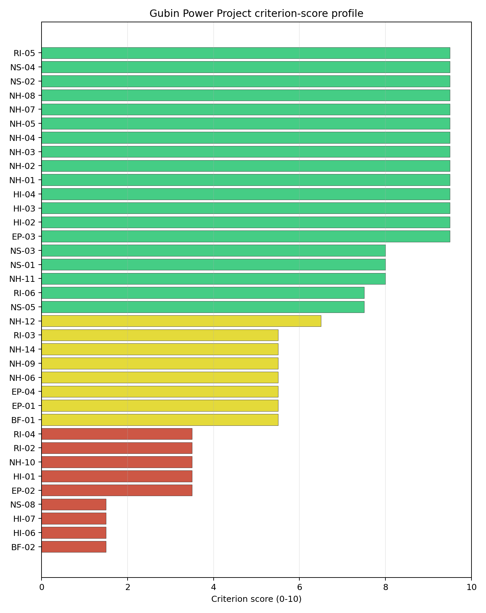
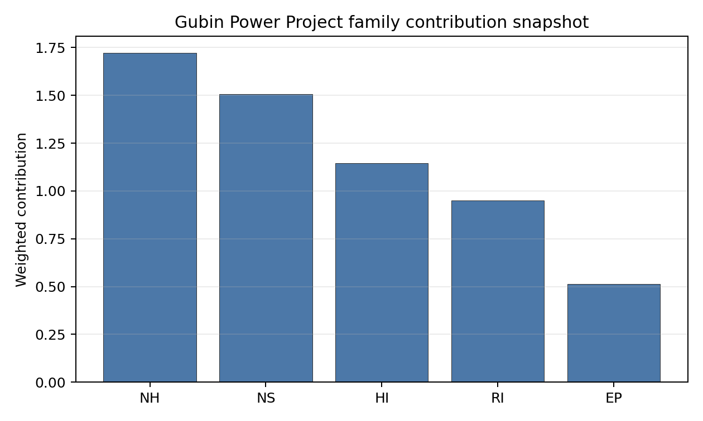

# Gubin Power Project Site Profile

Gubin Power Project is a coal/thermal site in Poland that has been tested against the NuScale VOYGR-6 reference deployment envelope. This profile reads the screening evidence at a level that supports a decision to progress toward Stage 3 characterisation. It is not a site-suitability determination, vendor recommendation, or licensing finding.

## Site Snapshot

| Field | Value |
| --- | --- |
| Site name | Gubin Power Project |
| Coordinates | 51.9490, 14.7285 |
| Subnational unit | Lubuskie |
| Installed thermal capacity (source data) | 3,000 MW |
| Available surface area | 38.8 ha |
| Available surface area for development | 0.1 ha |
| Composite score (baseline weights) | 7.222 (6.412-7.803 MC band) |
| National stability band | B (top-10% hit rate 92%) |
| National rank | 4 |

_See the country status map in_ [Poland Country Profile](../PL_country_prototype.md#country-status-map).

## Ownership and Coal-to-Nuclear Context

- **Ministry of State Treasury (Poland)** (60.86% share), headquartered in Poland; immediate operator PGE Polska Grupa Energetyczna SA. Path: Ministry of State Treasury (Poland)  -> PGE Polska Grupa Energetyczna SA [60.86%] -> Gubin Power Project -- [100.0%]
- **small shareholder(s)** (39.14% share); immediate operator PGE Polska Grupa Energetyczna SA. Path: small shareholder(s)  -> PGE Polska Grupa Energetyczna SA [39.14%] -> Gubin Power Project -- [100.0%]
- **PGE Polska Grupa Energetyczna SA** (100.00% share), headquartered in Poland; immediate operator PGE Polska Grupa Energetyczna SA. Path: PGE Polska Grupa Energetyczna SA -> Gubin Power Project -- [100.0%]

Generating units on record: 1 cancelled.
Earliest unit commissioning: 2020; most recent: 2020.

## Natural Hazards (NH)

- **Seismic: Ground Motion (NH-01)** - score 9.5/10 (MC 9.0-10.0) - favourable: Well below the risk boundary., weight 0.0455, data quality high. Evidence: PGA at 475-year return period 0.009 g; PGA at 2,475-year return period 0.024 g; Vs30 reference (m/s): 760.0.
- **Seismic: Surface Rupture (NH-02)** - score 9.5/10 (MC 9.0-10.0) - favourable: Very strong separation from mapped capable faults; surface-rupture concern effectively screened at desk-study level., weight n/a, data quality screening grade. Evidence: nearest mapped capable fault 50.0 km; fault slip rate 0 mm/yr; fault name: none_in_search_radius.
- **Geotechnical: Liquefaction (NH-03)** - score 9.5/10 (MC 9.0-10.0) - favourable: Negligible susceptibility (Stage-1 favourable default)., weight n/a, data quality medium. Evidence: liquefaction susceptibility: very_low; dominant soil type: sandy_loam.
- **Geotechnical: Slope Stability (NH-04)** - score 9.5/10 (MC 9.0-10.0) - favourable: Well below the risk boundary., weight n/a, data quality screening grade. Evidence: site slope 2.91 deg; max slope in 1 km box 21.0 deg; slope stability class: gentle.
- **Geotechnical: Subsidence (NH-05)** - score 9.5/10 (MC 9.0-10.0) - favourable: No karst; mine-feature distance well above the score-5 pivot (or unknown)., weight 0.0354, data quality medium. Evidence: karst present: no; karst severity: none.
- **Geotechnical: Foundation (NH-06)** - score 5.5/10 (MC 5.0-6.0) - pass-mark band: Typical European mixed conditions (bearing 80-150 kPa)., weight 0.0253, data quality medium. Evidence: bearing capacity 123.0 kPa; depth to bedrock 22.8 m.
- **Volcanism (NH-07)** - score 9.5/10 (MC 9.0-10.0) - favourable: Very strong margin above the score-5 boundary (or screening evidence confirms no in-radius signal)., weight n/a, data quality high. Evidence: volcanic hazard class: negligible.
- **Coastal Flooding (NH-08)** - score 9.5/10 (MC 9.0-10.0) - favourable: Non-coastal OR elevation >= 50 m AMSL OR landlocked country, with no positive marine-hazard signal., weight 0.0303, data quality medium. Evidence: distance to coast 188.4 km.
- **River Flooding (NH-09)** - score 5.5/10 (MC 3.5-7.5) - pass-mark band: Benign flood-zone class but river/waterway proxy is within 2 km; routine flood-interface review., weight 0.0404, data quality insufficient. Evidence: nearest river 0 km; flood zone class: negligible.
- **Extreme Winds (NH-10)** - score 3.5/10 (MC 3.0-4.0), weight 0.0152, data quality medium. Evidence: screening wind-speed index 11.4 m/s.
- **Extreme Precipitation (NH-11)** - score 8.0/10 (MC 8.0-9.0) - favourable: aggregated(mean_of_sub_scores), weight 0.0152, data quality medium. Evidence: screening extreme-precipitation index 0.23 mm; screening precipitation index 22.6 mm/yr.
- **Extreme Temperatures (NH-12)** - score 6.5/10 (MC 6.0-7.0) - pass-mark band: aggregated(mean_of_sub_scores), weight 0.0202, data quality medium. Evidence: extreme high temperature 24.4 deg C; extreme low temperature -5.56 deg C.
- **Combined Hazards (NH-14)** - score 5.5/10 (MC 5.0-6.0) - pass-mark band: At least 5 resolved, exactly one moderate hazard (3-5) or moderate interaction only., weight 0.0152, data quality n/a. Evidence: values not in measurement tables.

### Interpretation - Natural Hazards (NH)

Natural hazards at Gubin are favourable on seismic, surface-rupture, liquefaction, slope, karst, and coastal indicators, but river interface and wind require Stage 3 confirmation. Ground motion is very low, with PGA of 0.009 g at the 475-year return period and 0.024 g at the 2,475-year return period, and no mapped capable fault is recorded within 50.0 km. Liquefaction susceptibility is very low, site slope is 2.91 degrees, and bearing capacity is 123.0 kPa. River Flooding (NH-09) is weaker at 5.5/10 because the nearest river is 0 km from the site, despite a negligible flood-zone class and insufficient data quality. Extreme Winds (NH-10) scores 3.5/10 with screening wind-speed index of 11.4 m/s. Stage 3 should confirm the river-edge flood envelope, drainage, and design wind loading before detailed site layout.

## Human-Induced and Security-Relevant Hazards (HI)

- **Aircraft Crash (HI-01)** - score 3.5/10 (MC 3.0-4.0), weight 0.0354, data quality high. Evidence: nearest airport 4.77 km; nearest flight path 2.38 km; airports within search radius 3; airport name: Lotnisko Sportowe Gubin; airport type: small airfield.
- **Industrial Explosions (HI-02)** - score 9.5/10 (MC 9.0-10.0) - favourable: Very strong margin above the score-5 boundary (or completed search confirmed no in-radius signal)., weight 0.0354, data quality medium. Evidence: values not in measurement tables.
- **Toxic/Gas Releases (HI-03)** - score 9.5/10 (MC 9.0-10.0) - favourable: Very strong margin above the score-5 boundary (or completed search confirmed no in-radius signal)., weight 0.0354, data quality medium. Evidence: values not in measurement tables.
- **External Fires (HI-04)** - score 9.5/10 (MC 9.0-10.0) - favourable: > 15 km, or completed flammable-storage search found nothing in radius., weight 0.0303, data quality medium. Evidence: values not in measurement tables.
- **Military Installations (HI-06)** - score 1.5/10 (MC 1.0-2.0), weight 0.0303, data quality medium. Evidence: nearest military installation 14.0 km; military installations within radius 25; installation name: unnamed.
- **Electromagnetic Interference (HI-07)** - score 1.5/10 (MC 1.0-2.0), weight 0.0101, data quality medium. Evidence: nearest high-power transmitter 1.27 km; transmitters within radius 101; transmitter type: communication.

### Interpretation - Human-Induced and Security-Relevant Hazards (HI)

Human-induced hazards are the main screening constraint at Gubin. Aircraft Crash (HI-01) scores 3.5/10 because Lotnisko Sportowe Gubin is 4.77 km away and the nearest flight-path proxy is 2.38 km away; both require a focused aircraft-crash hazard assessment. Military Installations (HI-06) scores 1.5/10, with the nearest military feature 14.0 km away and 25 features within 25 km. Electromagnetic Interference (HI-07) also scores 1.5/10, with a communication transmitter 1.27 km away and 101 transmitters in the search radius. Industrial, toxic, and external-fire screens are favourable on the current record. Stage 3 should start with airfield and flight-path modelling, then confirm military-feature classification and the RF environment.

## Radiological Impact and Emergency Planning (RI / EP)

- **Emergency Planning Feasibility (EP-01)** - score 5.5/10 (MC 5.0-6.0) - pass-mark band: At or above the composite score-5 boundary., weight n/a, data quality high. Evidence: EP feasibility composite 60.3 /100; road sub-score 47.2 /100; special-population sub-score 90.0 /100; geography sub-score 95.0 /100; population sub-score 60.0 /100; evacuation feasible: yes.
- **Evacuation Routes (EP-02)** - score 3.5/10 (MC 3.0-4.0), weight 0.0303, data quality medium. Evidence: road density in EPZ 0.42 km/km2; road length in EPZ 825.2 km; motorway access: yes.
- **Physical Geography Constraints (EP-03)** - score 9.5/10 (MC 9.0-10.0) - favourable: No measured relief; open river/waterway context (interim screening)., weight 0.0253, data quality medium. Evidence: waterways crossing EPZ 0; major river barrier: no.
- **Special Populations (EP-04)** - score 5.5/10 (MC 5.0-6.0) - pass-mark band: 9-25., weight 0.0303, data quality medium. Evidence: hospitals in EPZ 14; prisons in EPZ 2; care homes in EPZ 4.
- **Atmospheric Dispersion (RI-01)** - score no native score (unscored - no band matched), weight 0.0303, data quality medium. Evidence: annual mean wind speed 1.57 m/s; atmospheric mixing height 615.4 m; prevailing wind direction: SW.
- **Surface Water Dispersion (RI-02)** - score 3.5/10 (MC 3.0-4.0), weight 0.0253, data quality n/a. Evidence: values not in measurement tables.
- **Groundwater Dispersion (RI-03)** - score 5.5/10 (MC 5.0-6.0) - pass-mark band: Moderate-permeability aquifer screening proxy., weight 0.0253, data quality medium. Evidence: aquifer type: alluvial.
- **Population Density at EPZ Radii (RI-04)** - score 3.5/10 (MC 3.0-4.0), weight 0.0404, data quality screening grade. Evidence: population density within 5 km 448.9 /km2; population density within 16 km 62.0 /km2; population density within 25 km 60.3 /km2; population density within 80 km 74.7 /km2; population within 25 km 118,459 people.
- **Distance to Population Centres (RI-05)** - score 9.5/10 (MC 9.0-10.0) - favourable: Nearest >=50k population-centre proxy exceeds required distance by >= 50 %., weight 0.0505, data quality screening grade. Evidence: nearest city above 50k people 31.7 km; nearest city population 94,778 people; city name: Cottbus.
- **Population Projections (RI-06)** - score 7.5/10 (MC 7.0-8.0), weight 0.0253, data quality screening grade. Evidence: annual population growth rate -0.38 %/yr; projected population at 25 km in 60 yr 93,100 people.

### Interpretation - Radiological Impact and Emergency Planning (RI / EP)

Radiological and emergency-planning conditions at Gubin are acceptable but constrained by road density, local population density, and liquid-pathway uncertainty. EP-01 is 60.3/100 and marked evacuation feasible, with road score 47.2/100, special populations 90.0/100, geography 95.0/100, and population 60.0/100. Evacuation Routes (EP-02) scores 3.5/10, with road density of 0.42 km/km2, road length of 825.2 km, and motorway access present. RI-04 also scores 3.5/10, reflecting 448.9 people/km2 within 5 km, though the 25 km density is 60.3 people/km2 and the 25 km population is 118,459. Cottbus is the nearest city above 50,000 people at 31.7 km, and the 60-year projected 25 km population is 93,100 people. Stage 3 should model EPZ clearance, surface-water pathways, and cross-border population assumptions.

## Non-Safety and Implementation Considerations (NS)

- **Grid Capacity Basic Filter (BF-01)** - score 5.5/10 (MC 5.0-6.0) - pass-mark band: Note: substation 15-30 km OR 110-219 kV; reinforcement plausible., weight n/a, data quality n/a. Evidence: values not in measurement tables.
- **Land Area Basic Filter (BF-02)** - score 1.5/10 (MC 1.0-2.0), weight 0.0253, data quality n/a. Evidence: values not in measurement tables.
- **Cooling Water Availability (NS-01)** - score 8.0/10 (MC 8.0-8.0) - favourable: aggregated(weighted_mean_of_sub_scores), weight 0.0404, data quality screening grade. Evidence: distance to cooling source 0.38 km; cooling source flow 21.6 m3/s; cooling source type: river; cooling source name: Lubsza; water stress label: Low-Medium.
- **Grid Connection (NS-02)** - score 9.5/10 (MC 9.0-10.0) - favourable: aggregated(min_of_sub_scores), weight 0.0404, data quality high. Evidence: nearest substation 0.98 km; nearest high-voltage line 0.99 km; grid export capacity 3,000 MW; substations within radius 526; HV lines within radius 553.
- **Transport Access (NS-03)** - score 8.0/10 (MC 7.0-8.0) - favourable: aggregated(weighted_mean_of_sub_scores), weight 0.0404, data quality high. Evidence: nearest highway 3.02 km; nearest rail line 1.04 km; nearest waterway 0.73 km; heavy-haul capable: yes.
- **Site Topography (NS-04)** - score 9.5/10 (MC 9.0-10.0) - favourable: > 80 %., weight 0.0303, data quality screening grade. Evidence: favourable land cover 85.1 %; moderate land cover 2 %; unfavourable land cover 0.5 %; favourable area 38.8 ha; dominant land class: 112.
- **Site Footprint Adequacy (NS-05)** - score 7.5/10 (MC 5.5-9.5), weight 0.0253, data quality low. Evidence: buildable area 0.05 ha; largest contiguous patch 0.05 ha; buildable patch count 9.
- **Existing Infrastructure (NS-06)** - score no native score (unscored - no band matched), weight 0.0253, data quality n/a. Evidence: not measured at this site (criterion remains unscored).
- **Ecological Sensitivity (NS-08)** - score 1.5/10 (MC 1.0-2.0), weight n/a, data quality high. Evidence: natural land cover 0.5 %; distance to nearest Natura 2000 site 0.554 km; distance to nearest protected area 3.134 km; Natura 2000 overlap: no; Natura 2000 sensitivity class: high; protected-area overlap: no; protected-area sensitivity class: moderate; nearest Natura 2000 site: Oder-Neiße Ergänzung; Natura 2000 sites within 5 km: 3; nearest protected-area designation: Protected Landscape Area.
- **Workforce Availability (NS-10)** - score no native score (unscored - no band matched), weight 0.0202, data quality n/a. Evidence: not measured at this site (criterion remains unscored).
- **Regulatory/Political Environment (NS-12)** - score no native score (unscored - no band matched), weight 0.0303, data quality n/a. Evidence: not measured at this site (criterion remains unscored).
- **Construction Logistics (NS-13)** - score no native score (unscored - no band matched), weight 0.0202, data quality n/a. Evidence: not measured at this site (criterion remains unscored).

### Interpretation - Non-Safety and Implementation Considerations (NS)

Gubin has strong grid, water, transport, and topography signals, but its land and ecology evidence are limiting. Cooling water is close, with the Lubsza 0.38 km away, 21.6 m3/s flow, and a Low-Medium water-stress label. Grid Connection (NS-02) scores 9.5/10, with the nearest substation 0.98 km away, the nearest high-voltage line 0.99 km away, and 3,000 MW export capacity. Transport access is also strong, with highway 3.02 km away, rail 1.04 km away, waterway 0.73 km away, and heavy-haul capability recorded. The land hierarchy is weak: canonical site surface area is 38.8 ha, but the development-area estimate is only 0.1 ha and NS-05 has low data quality. Ecological Sensitivity (NS-08) is also weak, with Oder-Neiße Ergänzung 0.554 km away and three Natura 2000 sites within 5 km. Stage 3 should confirm developable land, ecological pathways, and whether the river-adjacent envelope can accommodate the reference design.

## Composite Score and Stability

Baseline composite score is 7.222, bracketed by Monte Carlo at 6.412-7.803. National stability band is `B` with a top-10% hit rate of 92% in the project's 50,000-iteration national sensitivity analysis.

Gubin's baseline composite score is 7.222, with a Monte Carlo bracket of 6.412-7.803. Its national stability band is B with a 92% top-10 hit rate in the project's 50,000-iteration national sensitivity analysis, so the site is robust under most weight perturbations despite being avoidance-flagged. The composite is supported by very low seismic hazard, strong grid connection, cooling proximity, transport access, and distance to major population centres. The residual uncertainty is concentrated in HI-01, BF-02/NS-05 land evidence, NS-08 ecology, EP-02 evacuation routes, and HI-07 EMI. Stage 3 should treat Gubin as a high-ranking characterisation candidate only if the airfield, land, and ecological constraints are tested in the first work package.

## Residual Risk Register

| Concern | Evidence | Consequence | Stage 3 action | Owner discipline |
| --- | --- | --- | --- | --- |
| Aircraft Crash (HI-01) | Lotnisko Sportowe Gubin is 4.77 km away; flight-path proxy is 2.38 km away | The avoidance flag may constrain or preclude parts of the site envelope | Model airfield operations, flight paths, and aircraft-crash frequency | security |
| Site Footprint Adequacy (NS-05) | Canonical site area is 38.8 ha; development-area estimate is 0.1 ha; low data quality | Usable land may be insufficient without a wider parcel strategy | Re-survey parcels, constraints, contiguity, and ownership | ownership/legal |
| Ecological Sensitivity (NS-08) | Oder-Neiße Ergänzung is 0.554 km away; three Natura 2000 sites lie within 5 km | Permitting and siting corridor could narrow materially | Confirm receptor pathways and Article 6(3) requirements | EIA |
| Evacuation Routes (EP-02) | Road density is 0.42 km/km2; road length is 825.2 km; motorway access is present | EPZ clearance may be sensitive to local routing assumptions | Model evacuation clearance and cross-border road constraints | emergency planning |
| Electromagnetic Interference (HI-07) | Nearest transmitter is 1.27 km away; 101 transmitters are within the search radius | RF environment may affect controls and layout | Survey transmitter inventory and field strengths | security |

Gubin's score is strong, but the risk register is front-loaded. Airfield, land, ecological, and evacuation questions must be resolved before the site can move from high-ranking screening candidate to a credible detailed-characterisation case.

## Stage 3 Follow-Up Checklist

- Model **Aircraft Crash (HI-01)** for Lotnisko Sportowe Gubin at 4.77 km and the 2.38 km flight-path proxy.
- Confirm **Site Footprint Adequacy (NS-05)** using parcel, ownership, constraint, and contiguity evidence for the 0.1 ha development-area estimate.
- Screen **Ecological Sensitivity (NS-08)** for Oder-Neiße Ergänzung 0.554 km away and the three Natura 2000 sites within 5 km.
- Model **Evacuation Routes (EP-02)** for the 0.42 km/km2 road-density screen and cross-border routing assumptions.
- Survey **Electromagnetic Interference (HI-07)** for the transmitter 1.27 km away and 101-transmitter inventory.

## Evidence Limitations

- Geotechnical: Subsidence & Collapse (NH-05b) - quality `low`.
- Site Footprint Adequacy (NS-05) - quality `low`.
