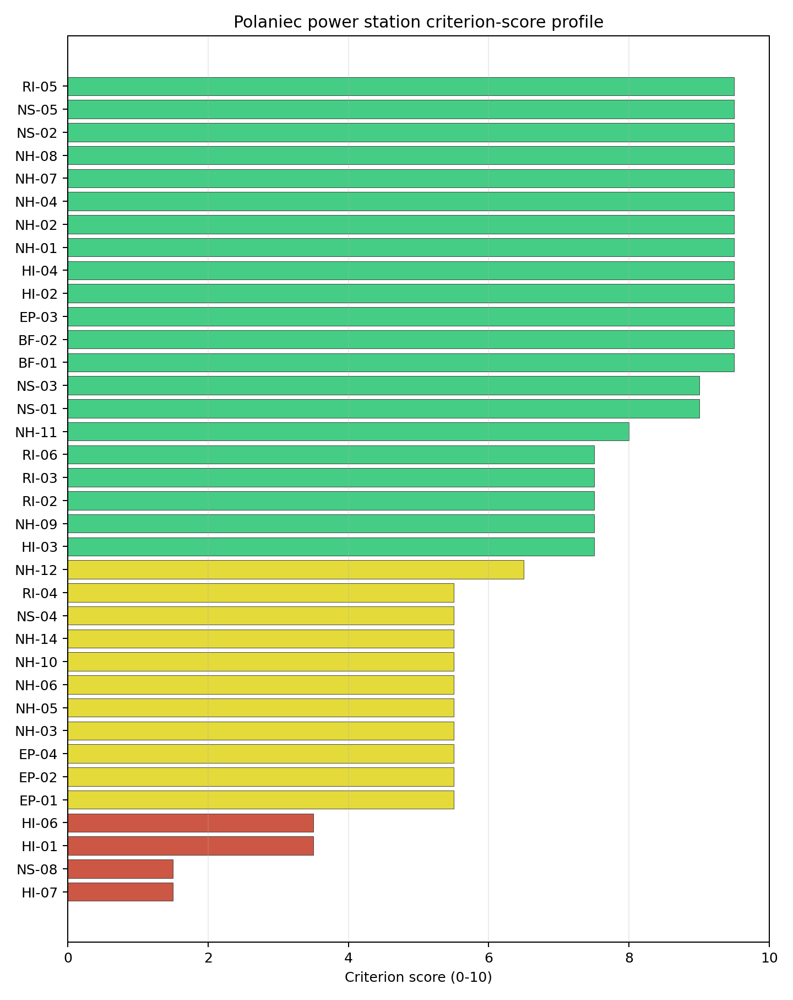
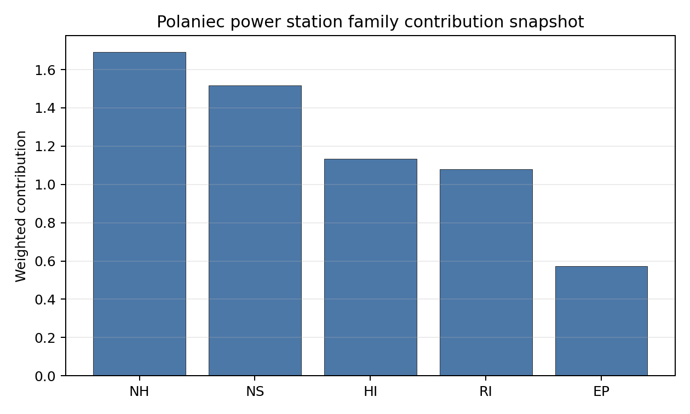

# Polaniec power station Site Profile

Polaniec power station is a coal/thermal site in Poland that has been tested against the NuScale VOYGR-6 reference deployment envelope. This profile reads the screening evidence at a level that supports a decision to progress toward Stage 3 characterisation. It is not a site-suitability determination, vendor recommendation, or licensing finding.

## Site Snapshot

| Field | Value |
| --- | --- |
| Site name | Polaniec power station |
| Coordinates | 50.4377, 21.3377 |
| Subnational unit | Świętokrzyskie |
| Installed thermal capacity (source data) | 1,882 MW |
| Available surface area | 188.0 ha |
| Available surface area for development | 116.4 ha |
| Composite score (baseline weights) | 7.422 (6.573-7.956 MC band) |
| National stability band | A (top-10% hit rate 100%) |
| National rank | 1 |

_See the country status map in_ [Poland Country Profile](../PL_country_prototype.md#country-status-map).

## Ownership and Coal-to-Nuclear Context

- **ENEA SA** (100.00% share), headquartered in Poland; immediate operator ENEA SA. Path: ENEA SA -> Polaniec power station Unit 8, timepoint 1 [100.0%]
- **Ministry of State Treasury (Poland)** (52.29% share), headquartered in Poland; immediate operator ENEA SA. Path: Ministry of State Treasury (Poland)  -> ENEA SA [52.29%] -> Polaniec power station Unit 3 [100.0%]

Generating units on record: 7 operating, 1 retired.
Earliest unit commissioning: 1979; most recent: 1983.
Retirements span 2011 to 2011, leaving brownfield grid, water, transport, and workforce assets that materially shorten Stage 3 site preparation.

## Natural Hazards (NH)

- **Seismic: Ground Motion (NH-01)** - score 9.5/10 (MC 9.0-10.0) - favourable: Well below the risk boundary., weight 0.0455, data quality high. Evidence: PGA at 475-year return period 0.023 g; PGA at 2,475-year return period 0.054 g; Vs30 reference (m/s): 760.0.
- **Seismic: Surface Rupture (NH-02)** - score 9.5/10 (MC 9.0-10.0) - favourable: Very strong separation from mapped capable faults; surface-rupture concern effectively screened at desk-study level., weight n/a, data quality screening grade. Evidence: nearest mapped capable fault 50.0 km; fault slip rate 0 mm/yr; fault name: none_in_search_radius.
- **Geotechnical: Liquefaction (NH-03)** - score 5.5/10 (MC 5.0-6.0) - pass-mark band: Moderate susceptibility, or high/very-high with documented (or pending for `high`) mitigation., weight n/a, data quality medium. Evidence: liquefaction susceptibility: moderate; dominant soil type: loam.
- **Geotechnical: Slope Stability (NH-04)** - score 9.5/10 (MC 9.0-10.0) - favourable: Well below the risk boundary., weight n/a, data quality screening grade. Evidence: site slope 2.54 deg; max slope in 1 km box 23.7 deg; slope stability class: gentle.
- **Geotechnical: Subsidence (NH-05)** - score 5.5/10 (MC 5.0-6.0) - pass-mark band: At or above the mine-distance score-5 pivot; review possible., weight 0.0354, data quality medium. Evidence: karst present: no; karst severity: moderate; formation type: carbonate (Discontinuous carbonate rocks).
- **Geotechnical: Foundation (NH-06)** - score 5.5/10 (MC 5.0-6.0) - pass-mark band: Typical European mixed conditions (bearing 80-150 kPa)., weight 0.0253, data quality medium. Evidence: bearing capacity 87.3 kPa; depth to bedrock 19.9 m.
- **Volcanism (NH-07)** - score 9.5/10 (MC 9.0-10.0) - favourable: Very strong margin above the score-5 boundary (or screening evidence confirms no in-radius signal)., weight n/a, data quality high. Evidence: volcanic hazard class: negligible.
- **Coastal Flooding (NH-08)** - score 9.5/10 (MC 9.0-10.0) - favourable: Non-coastal OR elevation >= 50 m AMSL OR landlocked country, with no positive marine-hazard signal., weight 0.0303, data quality medium. Evidence: distance to coast 458.5 km.
- **River Flooding (NH-09)** - score 7.5/10 (MC 5.5-9.5), weight 0.0404, data quality insufficient. Evidence: flood zone class: negligible.
- **Extreme Winds (NH-10)** - score 5.5/10 (MC 5.0-6.0) - pass-mark band: Middle relative wind exposure around the observed cohort mean (9.0-10.5 m/s)., weight 0.0152, data quality medium. Evidence: screening wind-speed index 9.75 m/s.
- **Extreme Precipitation (NH-11)** - score 8.0/10 (MC 8.0-9.0) - favourable: aggregated(mean_of_sub_scores), weight 0.0152, data quality medium. Evidence: screening extreme-precipitation index 0.25 mm; screening precipitation index 23.6 mm/yr.
- **Extreme Temperatures (NH-12)** - score 6.5/10 (MC 6.0-7.0) - pass-mark band: aggregated(mean_of_sub_scores), weight 0.0202, data quality medium. Evidence: extreme high temperature 23.2 deg C; extreme low temperature -7.76 deg C.
- **Combined Hazards (NH-14)** - score 5.5/10 (MC 5.0-6.0) - pass-mark band: At least 5 resolved, exactly one moderate hazard (3-5) or moderate interaction only., weight 0.0152, data quality n/a. Evidence: values not in measurement tables.

### Interpretation - Natural Hazards (NH)

Natural hazards at Polaniec are favourable overall, with the screening burden concentrated in geotechnical and flood confirmation rather than in seismic or volcanic hazards. Ground motion is low, with PGA of 0.023 g at the 475-year return period and 0.054 g at the 2,475-year return period, and no mapped capable fault is recorded within 50.0 km. The site is gently sloped at 2.54 degrees, while liquefaction remains a moderate alluvial-soil question and foundation bearing capacity is 87.3 kPa over 19.9 m to bedrock. River Flooding (NH-09) scores 7.5/10 but still carries insufficient data quality, and Extreme Precipitation (NH-11) relies on screening values of 0.25 mm screening extreme-precipitation index and 23.6 mm/year screening precipitation index. Stage 3 should therefore confirm Vistula flood levels, run CPT/SPT geotechnical tests, and reconcile the precipitation proxy with local hydrological design data.

## Human-Induced and Security-Relevant Hazards (HI)

- **Aircraft Crash (HI-01)** - score 3.5/10 (MC 3.0-4.0), weight 0.0354, data quality high. Evidence: nearest airport 8.02 km; nearest flight path 4.01 km; airports within search radius 3; airport name: Górki Airfield; airport type: small airfield.
- **Industrial Explosions (HI-02)** - score 9.5/10 (MC 9.0-10.0) - favourable: Very strong margin above the score-5 boundary (or completed search confirmed no in-radius signal)., weight 0.0354, data quality high. Evidence: nearest industrial site 23.0 km.
- **Toxic/Gas Releases (HI-03)** - score 7.5/10 (MC 7.0-8.0), weight 0.0354, data quality high. Evidence: nearest toxic source 23.0 km.
- **External Fires (HI-04)** - score 9.5/10 (MC 9.0-10.0) - favourable: > 15 km, or completed flammable-storage search found nothing in radius., weight 0.0303, data quality high. Evidence: values not in measurement tables.
- **Military Installations (HI-06)** - score 3.5/10 (MC 3.0-4.0), weight 0.0303, data quality medium. Evidence: nearest military installation 17.0 km; military installations within radius 4; installation name: unnamed.
- **Electromagnetic Interference (HI-07)** - score 1.5/10 (MC 1.0-2.0), weight 0.0101, data quality medium. Evidence: nearest high-power transmitter 0.45 km; transmitters within radius 101; transmitter type: lighting.

### Interpretation - Human-Induced and Security-Relevant Hazards (HI)

Human-induced hazards are the main reason Polaniec is not a full-pass site. Aircraft Crash (HI-01) scores 3.5/10 because Górki Airfield is 8.02 km from the site and the nearest flight-path proxy is 4.01 km away; this is a concrete SSG-35 Stage 3 hazard-assessment item, not a finding of unsuitability. Military Installations (HI-06) sits at 3.5/10, with the nearest feature 17.0 km away and four installations within 25 km. Electromagnetic Interference (HI-07) is weaker, with the nearest high-power transmitter 0.45 km away and 101 transmitters in the search radius. The favourable offset is that industrial explosion and toxic-release proxies are both 23.0 km away. Stage 3 should begin with airfield and flight-path modelling, then confirm the transmitter inventory and military-feature classification.

## Radiological Impact and Emergency Planning (RI / EP)

- **Emergency Planning Feasibility (EP-01)** - score 5.5/10 (MC 5.0-6.0) - pass-mark band: At or above the composite score-5 boundary., weight n/a, data quality high. Evidence: EP feasibility composite 54.6 /100; road sub-score 44.5 /100; special-population sub-score 10.0 /100; geography sub-score 95.0 /100; population sub-score 80.0 /100; evacuation feasible: yes.
- **Evacuation Routes (EP-02)** - score 5.5/10 (MC 5.0-6.0) - pass-mark band: Adequate primary routes (0.5-1.0)., weight 0.0303, data quality medium. Evidence: road density in EPZ 0.542 km/km2; road length in EPZ 1,064 km; motorway access: no.
- **Physical Geography Constraints (EP-03)** - score 9.5/10 (MC 9.0-10.0) - favourable: No measured relief; open river/waterway context (interim screening)., weight 0.0253, data quality medium. Evidence: waterways crossing EPZ 0; major river barrier: no.
- **Special Populations (EP-04)** - score 5.5/10 (MC 5.0-6.0) - pass-mark band: 9-25., weight 0.0303, data quality medium. Evidence: hospitals in EPZ 15; prisons in EPZ 1; care homes in EPZ 0.
- **Atmospheric Dispersion (RI-01)** - score no native score (unscored - no band matched), weight 0.0303, data quality medium. Evidence: annual mean wind speed 1.35 m/s; atmospheric mixing height 548.5 m; prevailing wind direction: WSW.
- **Surface Water Dispersion (RI-02)** - score 7.5/10 (MC 7.0-8.0), weight 0.0253, data quality n/a. Evidence: values not in measurement tables.
- **Groundwater Dispersion (RI-03)** - score 7.5/10 (MC 7.0-8.0), weight 0.0253, data quality medium. Evidence: aquifer type: low permeability.
- **Population Density at EPZ Radii (RI-04)** - score 5.5/10 (MC 5.0-6.0) - pass-mark band: aggregated(min_of_sub_scores), weight 0.0404, data quality screening grade. Evidence: population density within 5 km 155.2 /km2; population density within 16 km 89.2 /km2; population density within 25 km 117.3 /km2; population density within 80 km 138.7 /km2; population within 25 km 230,209 people.
- **Distance to Population Centres (RI-05)** - score 9.5/10 (MC 9.0-10.0) - favourable: Nearest >=50k population-centre proxy exceeds required distance by >= 50 %., weight 0.0505, data quality screening grade. Evidence: nearest city above 50k people 52.8 km; nearest city population 103,129 people; city name: Tarnów.
- **Population Projections (RI-06)** - score 7.5/10 (MC 7.0-8.0), weight 0.0253, data quality screening grade. Evidence: annual population growth rate -0.121 %/yr; projected population at 25 km in 60 yr 180,924 people.

### Interpretation - Radiological Impact and Emergency Planning (RI / EP)

Radiological and emergency-planning indicators support further characterisation, with special-population and road-network details requiring early attention. Emergency Planning Feasibility (EP-01) is 54.6/100 and marked evacuation feasible; the road sub-score is 44.5/100, and the special-population sub-score is 10.0/100 because the EPZ contains 15 hospitals and one prison. Population density is moderate by the Polish pool: 155.2 people/km2 within 5 km, 117.3 people/km2 within 25 km, and 230,209 people within 25 km. The nearest city above 50,000 people is Tarnów at 52.8 km, and the 60-year projected 25 km population is 180,924 people. Stage 3 should model EPZ clearance times, confirm special-population evacuation arrangements, and install site meteorology for the 1.35 m/s annual mean wind-speed setting.

## Non-Safety and Implementation Considerations (NS)

- **Grid Capacity Basic Filter (BF-01)** - score 9.5/10 (MC 9.0-10.0) - favourable: Note: substation <= 5 km, >= 400 kV, headroom >= 600 MW., weight n/a, data quality n/a. Evidence: values not in measurement tables.
- **Land Area Basic Filter (BF-02)** - score 9.5/10 (MC 9.0-10.0) - favourable: Contiguous and buildable >= ideal area (70 ha/module)., weight 0.0253, data quality n/a. Evidence: values not in measurement tables.
- **Cooling Water Availability (NS-01)** - score 9.0/10 (MC 8.0-9.0) - favourable: aggregated(weighted_mean_of_sub_scores), weight 0.0404, data quality screening grade. Evidence: distance to cooling source 0.29 km; cooling source flow 236.2 m3/s; cooling source type: major_river; cooling source name: Wisła; water stress label: Low-Medium.
- **Grid Connection (NS-02)** - score 9.5/10 (MC 9.0-10.0) - favourable: aggregated(min_of_sub_scores), weight 0.0404, data quality high. Evidence: nearest substation 0.69 km; nearest high-voltage line 0.17 km; highest nearby line voltage 400.0 kV; grid export capacity 1,558 MW; substations within radius 207; HV lines within radius 450.
- **Transport Access (NS-03)** - score 9.0/10 (MC 8.0-9.0) - favourable: aggregated(weighted_mean_of_sub_scores), weight 0.0404, data quality high. Evidence: nearest highway 1.27 km; nearest rail line 0.13 km; nearest waterway 12.8 km; heavy-haul capable: yes.
- **Site Topography (NS-04)** - score 5.5/10 (MC 5.0-6.0) - pass-mark band: 40-60 %., weight 0.0303, data quality screening grade. Evidence: favourable land cover 48.8 %; moderate land cover 22.3 %; unfavourable land cover 20.4 %; favourable area 114.4 ha; dominant land class: 211.
- **Site Footprint Adequacy (NS-05)** - score 9.5/10 (MC 9.0-10.0) - favourable: Very strong margin above the score-5 boundary., weight 0.0253, data quality high. Evidence: buildable area 116.4 ha; largest contiguous patch 116.4 ha; buildable patch count 19.
- **Existing Infrastructure (NS-06)** - score no native score (unscored - no band matched), weight 0.0253, data quality n/a. Evidence: not measured at this site (criterion remains unscored).
- **Ecological Sensitivity (NS-08)** - score 1.5/10 (MC 1.0-2.0), weight n/a, data quality high. Evidence: natural land cover 20.4 %; distance to nearest Natura 2000 site 2.353 km; distance to nearest protected area 1.782 km; Natura 2000 overlap: no; Natura 2000 sensitivity class: moderate; protected-area overlap: no; protected-area sensitivity class: low; nearest Natura 2000 site: Dolna Wisłoka z Dopływami; Natura 2000 sites within 5 km: 2; nearest protected-area designation: Nature Reserve.
- **Workforce Availability (NS-10)** - score no native score (unscored - no band matched), weight 0.0202, data quality n/a. Evidence: not measured at this site (criterion remains unscored).
- **Regulatory/Political Environment (NS-12)** - score no native score (unscored - no band matched), weight 0.0303, data quality n/a. Evidence: not measured at this site (criterion remains unscored).
- **Construction Logistics (NS-13)** - score no native score (unscored - no band matched), weight 0.0202, data quality n/a. Evidence: not measured at this site (criterion remains unscored).

### Interpretation - Non-Safety and Implementation Considerations (NS)

Polaniec has one of Poland's strongest brownfield infrastructure cases. Cooling Water Availability (NS-01) draws on the Wisła 0.29 km away, with 236.2 m3/s flow and a Low-Medium water-stress label. Grid Connection (NS-02) is also strong: the nearest substation is 0.69 km away, the nearest high-voltage line is 0.17 km away, the highest nearby voltage is 400.0 kV, and recorded grid export capacity is 1,558 MW. Transport access is strong, with rail 0.13 km away, highway 1.27 km away, and heavy-haul capability recorded. The land hierarchy is important: the canonical site surface area is 188.0 ha, while the development-area estimate is 116.4 ha and must not be treated as permitted or controlled nuclear land. Ecological Sensitivity (NS-08) is the main non-safety weakness, with Dolna Wisłoka z Dopływami 2.353 km away and two Natura 2000 sites within 5 km. Stage 3 should confirm land control, Article 6(3) screening, and the 400 kV export path.

## Composite Score and Stability

Baseline composite score is 7.422, bracketed by Monte Carlo at 6.573-7.956. National stability band is `A` with a top-10% hit rate of 100% in the project's 50,000-iteration national sensitivity analysis.

Polaniec's baseline composite score is 7.422, with a Monte Carlo bracket of 6.573-7.956. Its national stability band is A with a 100% top-10 hit rate in the project's 50,000-iteration national sensitivity analysis, so the national-leader result is robust to the weight perturbations considered. The score is driven by strong seismic, grid, cooling-water, transport, site-area, and distance-to-population-centre evidence, while the principal drag comes from HI-01, HI-07, NS-08, and HI-06. The Stage 3 sequencing implication is clear: Polaniec deserves early characterisation because it leads nationally, but the first work package must test the airfield and flight-path constraint before the site can be treated as equivalent to the full-pass group.

## Residual Risk Register

| Concern | Evidence | Consequence | Stage 3 action | Owner discipline |
| --- | --- | --- | --- | --- |
| Aircraft Crash (HI-01) | Górki Airfield is 8.02 km away; nearest flight-path proxy is 4.01 km | The avoidance flag could constrain the usable siting envelope | Model airfield operations, flight paths, and aircraft-crash frequency | security |
| Electromagnetic Interference (HI-07) | Nearest transmitter is 0.45 km away; 101 transmitters are within the search radius | RF controls could affect layout and instrumentation assumptions | Survey transmitter inventory and field strengths | security |
| Ecological Sensitivity (NS-08) | Dolna Wisłoka z Dopływami is 2.353 km away; two Natura 2000 sites lie within 5 km | Permitting scope may expand if indirect pathways are identified | Confirm receptor pathways and Article 6(3) screening needs | EIA |
| Emergency Planning Special Populations (EP-04) | 15 hospitals and one prison are inside the EPZ | Evacuation planning could drive additional authority coordination | Engage regional emergency-planning authorities on facility-specific arrangements | emergency planning |
| River Flooding (NH-09) | Flood-zone class is negligible but data quality is insufficient | Design-basis flood confidence remains incomplete | Re-measure Vistula flood and drainage inputs | hydrology |

The register is dominated by HI-01 because it is the standing avoidance flag on the national leader. The other entries are normal Stage 3 work items for a strong brownfield candidate and should be retired through field confirmation, agency engagement, and site-specific modelling.

## Stage 3 Follow-Up Checklist

- Model **Aircraft Crash (HI-01)** for Górki Airfield at 8.02 km and the 4.01 km flight-path proxy.
- Survey **Electromagnetic Interference (HI-07)** for the transmitter 0.45 km away and the 101-transmitter search-radius inventory.
- Screen **Ecological Sensitivity (NS-08)** for Dolna Wisłoka z Dopływami 2.353 km away and the two Natura 2000 sites within 5 km.
- Confirm **Military Installations (HI-06)** feature classification for the nearest installation 17.0 km away.
- Re-measure **River Flooding (NH-09)** and drainage assumptions because flood evidence remains insufficient.

## Evidence Limitations

- Geotechnical: Subsidence & Collapse (NH-05b) - quality `low`.
