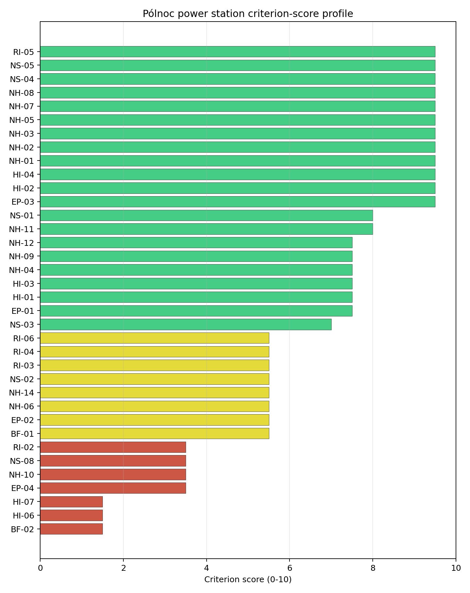
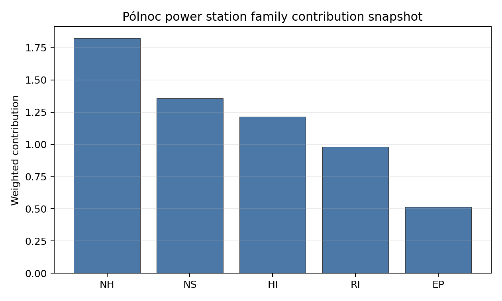

# Pólnoc power station Site Profile

Pólnoc power station is a coal/thermal site in Poland that has been tested against the NuScale VOYGR-6 reference deployment envelope. This profile reads the screening evidence at a level that supports a decision to progress toward Stage 3 characterisation. It is not a site-suitability determination, vendor recommendation, or licensing finding.

## Site Snapshot

| Field | Value |
| --- | --- |
| Site name | Pólnoc power station |
| Coordinates | 53.9629, 18.7118 |
| Subnational unit | Pomorskie |
| Installed thermal capacity (source data) | 1,600 MW |
| Available surface area | 209.8 ha |
| Available surface area for development | 5.5 ha |
| Composite score (baseline weights) | 7.284 (6.462-7.869 MC band) |
| National stability band | A (top-10% hit rate 100%) |
| National rank | 2 |

_See the country status map in_ [Poland Country Profile](../PL_country_prototype.md#country-status-map).

## Ownership and Coal-to-Nuclear Context

- **Allianz Polska Open Pension Fund** (7.83% share), headquartered in Poland; immediate operator Polenergia SA. Path: Allianz Polska Open Pension Fund  -> Polenergia SA [7.83%] -> Pólnoc power station Unit 1 [100.0%]
- **Polenergia SA** (100.00% share), headquartered in Poland; immediate operator Polenergia SA. Path: Polenergia SA -> Pólnoc power station Unit 1 [100.0%]
- **BIF IV Europe Holdings Ltd** (32.04% share), headquartered in United Kingdom; immediate operator Polenergia SA. Path: BIF IV Europe Holdings Ltd -> Polenergia SA [32.04%] -> Pólnoc power station Unit 1 [100.0%]
- **Mansa Investments SP zoo** (42.84% share), headquartered in Poland; immediate operator Polenergia SA. Path: Mansa Investments SP zoo -> Polenergia SA [42.84%] -> Pólnoc power station Unit 1 [100.0%]
- **Nationale-Nederlanden Open Pension Fund** (5.92% share), headquartered in Poland; immediate operator Polenergia SA. Path: Nationale-Nederlanden Open Pension Fund  -> Polenergia SA [5.92%] -> Pólnoc power station Unit 2 [100.0%]
- **Master Bif Iv Uk Holdings Ltd** (share not reported), headquartered in United Kingdom; immediate operator Polenergia SA. Path: Master Bif Iv Uk Holdings Ltd -> BIF IV Europe Holdings Ltd [unknown %] -> Polenergia SA [32.04%] -> Pólnoc power station Unit 2 [100.0%]

Generating units on record: 2 cancelled.

## Natural Hazards (NH)

- **Seismic: Ground Motion (NH-01)** - score 9.5/10 (MC 9.0-10.0) - favourable: Well below the risk boundary., weight 0.0455, data quality high. Evidence: PGA at 475-year return period 0.008 g; PGA at 2,475-year return period 0.025 g; Vs30 reference (m/s): 760.0.
- **Seismic: Surface Rupture (NH-02)** - score 9.5/10 (MC 9.0-10.0) - favourable: Very strong separation from mapped capable faults; surface-rupture concern effectively screened at desk-study level., weight n/a, data quality screening grade. Evidence: nearest mapped capable fault 50.0 km; fault slip rate 0 mm/yr; fault name: none_in_search_radius.
- **Geotechnical: Liquefaction (NH-03)** - score 9.5/10 (MC 9.0-10.0) - favourable: Negligible susceptibility (Stage-1 favourable default)., weight n/a, data quality medium. Evidence: liquefaction susceptibility: very_low; dominant soil type: sandy_loam.
- **Geotechnical: Slope Stability (NH-04)** - score 7.5/10 (MC 7.0-8.0), weight n/a, data quality screening grade. Evidence: site slope 6.52 deg; max slope in 1 km box 71.1 deg; slope stability class: moderate.
- **Geotechnical: Subsidence (NH-05)** - score 9.5/10 (MC 9.0-10.0) - favourable: No karst; mine-feature distance well above the score-5 pivot (or unknown)., weight 0.0354, data quality medium. Evidence: karst present: no; karst severity: none.
- **Geotechnical: Foundation (NH-06)** - score 5.5/10 (MC 5.0-6.0) - pass-mark band: Typical European mixed conditions (bearing 80-150 kPa)., weight 0.0253, data quality medium. Evidence: bearing capacity 106.0 kPa; depth to bedrock 20.2 m.
- **Volcanism (NH-07)** - score 9.5/10 (MC 9.0-10.0) - favourable: Very strong margin above the score-5 boundary (or screening evidence confirms no in-radius signal)., weight n/a, data quality high. Evidence: volcanic hazard class: negligible.
- **Coastal Flooding (NH-08)** - score 9.5/10 (MC 9.0-10.0) - favourable: Non-coastal OR elevation >= 50 m AMSL OR landlocked country, with no positive marine-hazard signal., weight 0.0303, data quality medium. Evidence: distance to coast 45.9 km.
- **River Flooding (NH-09)** - score 7.5/10 (MC 5.5-9.5), weight 0.0404, data quality insufficient. Evidence: flood zone class: negligible.
- **Extreme Winds (NH-10)** - score 3.5/10 (MC 3.0-4.0), weight 0.0152, data quality medium. Evidence: screening wind-speed index 11.4 m/s.
- **Extreme Precipitation (NH-11)** - score 8.0/10 (MC 8.0-9.0) - favourable: aggregated(mean_of_sub_scores), weight 0.0152, data quality medium. Evidence: screening extreme-precipitation index 0.2 mm; screening precipitation index 21.6 mm/yr.
- **Extreme Temperatures (NH-12)** - score 7.5/10 (MC 7.0-8.0), weight 0.0202, data quality medium. Evidence: extreme high temperature 21.4 deg C; extreme low temperature -7.65 deg C.
- **Combined Hazards (NH-14)** - score 5.5/10 (MC 5.0-6.0) - pass-mark band: At least 5 resolved, exactly one moderate hazard (3-5) or moderate interaction only., weight 0.0152, data quality n/a. Evidence: values not in measurement tables.

### Interpretation - Natural Hazards (NH)

Natural hazards at Pólnoc are favourable for Stage 1-2 screening, with wind and river-flood confirmation the main priorities. Ground motion is very low, with PGA of 0.008 g at the 475-year return period and 0.025 g at the 2,475-year return period, and no mapped capable fault is recorded within 50.0 km. Liquefaction susceptibility is very low, karst is absent, and bearing capacity is 106.0 kPa with 20.2 m to bedrock. The site is 45.9 km from the coast, but Coastal Flooding (NH-08) is favourable in the bundle. Extreme Winds (NH-10) is the weak natural-hazard criterion at 3.5/10, with screening wind-speed index of 11.4 m/s, while River Flooding (NH-09) has insufficient data quality. Stage 3 should confirm design wind, drainage, and flood assumptions before layout work begins.

## Human-Induced and Security-Relevant Hazards (HI)

- **Aircraft Crash (HI-01)** - score 7.5/10 (MC 7.0-8.0), weight 0.0354, data quality high. Evidence: nearest airport 14.7 km; nearest flight path 7.36 km; airports within search radius 5; airport name: Linowiec Airfield; airport type: small airfield.
- **Industrial Explosions (HI-02)** - score 9.5/10 (MC 9.0-10.0) - favourable: Very strong margin above the score-5 boundary (or completed search confirmed no in-radius signal)., weight 0.0354, data quality high. Evidence: nearest industrial site 18.5 km.
- **Toxic/Gas Releases (HI-03)** - score 7.5/10 (MC 7.0-8.0), weight 0.0354, data quality high. Evidence: nearest toxic source 18.5 km.
- **External Fires (HI-04)** - score 9.5/10 (MC 9.0-10.0) - favourable: > 15 km, or completed flammable-storage search found nothing in radius., weight 0.0303, data quality high. Evidence: values not in measurement tables.
- **Military Installations (HI-06)** - score 1.5/10 (MC 1.0-2.0), weight 0.0303, data quality medium. Evidence: nearest military installation 7.81 km; military installations within radius 22; installation name: Bateria artyleryjska Mały Garc.
- **Electromagnetic Interference (HI-07)** - score 1.5/10 (MC 1.0-2.0), weight 0.0101, data quality medium. Evidence: nearest high-power transmitter 0.56 km; transmitters within radius 111; transmitter type: communication.

### Interpretation - Human-Induced and Security-Relevant Hazards (HI)

Human-induced hazards at Pólnoc are mixed: aircraft and industrial hazards are manageable, but military and EMI evidence require early confirmation. Aircraft Crash (HI-01) scores 7.5/10, with Linowiec Airfield 14.7 km away and the nearest flight-path proxy 7.36 km away. Industrial and toxic-source distances are both 18.5 km, supporting a favourable initial read. The main weakness is Military Installations (HI-06), which scores 1.5/10 because Bateria artyleryjska Mały Garc is 7.81 km away and 22 military features are recorded within 25 km. Electromagnetic Interference (HI-07) also scores 1.5/10, with a communication transmitter 0.56 km away and 111 transmitters within the search radius. Stage 3 should classify the military features, confirm airspace use, and complete an RF/EMI survey.

## Radiological Impact and Emergency Planning (RI / EP)

- **Emergency Planning Feasibility (EP-01)** - score 7.5/10 (MC 7.0-8.0), weight n/a, data quality high. Evidence: EP feasibility composite 66.6 /100; road sub-score 56.3 /100; special-population sub-score 90.0 /100; geography sub-score 95.0 /100; population sub-score 80.0 /100; evacuation feasible: yes.
- **Evacuation Routes (EP-02)** - score 5.5/10 (MC 5.0-6.0) - pass-mark band: Adequate primary routes (0.5-1.0)., weight 0.0303, data quality medium. Evidence: road density in EPZ 0.572 km/km2; road length in EPZ 1,122 km; motorway access: yes.
- **Physical Geography Constraints (EP-03)** - score 9.5/10 (MC 9.0-10.0) - favourable: No measured relief; open river/waterway context (interim screening)., weight 0.0253, data quality medium. Evidence: waterways crossing EPZ 0; major river barrier: no.
- **Special Populations (EP-04)** - score 3.5/10 (MC 3.0-4.0), weight 0.0303, data quality medium. Evidence: hospitals in EPZ 32; prisons in EPZ 3; care homes in EPZ 2.
- **Atmospheric Dispersion (RI-01)** - score no native score (unscored - no band matched), weight 0.0303, data quality medium. Evidence: annual mean wind speed 1.8 m/s; atmospheric mixing height 565.1 m; prevailing wind direction: SW.
- **Surface Water Dispersion (RI-02)** - score 3.5/10 (MC 3.0-4.0), weight 0.0253, data quality n/a. Evidence: values not in measurement tables.
- **Groundwater Dispersion (RI-03)** - score 5.5/10 (MC 5.0-6.0) - pass-mark band: Moderate-permeability aquifer screening proxy., weight 0.0253, data quality medium. Evidence: aquifer type: alluvial.
- **Population Density at EPZ Radii (RI-04)** - score 5.5/10 (MC 5.0-6.0) - pass-mark band: aggregated(min_of_sub_scores), weight 0.0404, data quality screening grade. Evidence: population density within 5 km 149.0 /km2; population density within 16 km 204.2 /km2; population density within 25 km 155.1 /km2; population density within 80 km 122.8 /km2; population within 25 km 304,409 people.
- **Distance to Population Centres (RI-05)** - score 9.5/10 (MC 9.0-10.0) - favourable: Nearest >=50k population-centre proxy exceeds required distance by >= 50 %., weight 0.0505, data quality screening grade. Evidence: nearest city above 50k people 14.8 km; nearest city population 56,936 people; city name: Tczew.
- **Population Projections (RI-06)** - score 5.5/10 (MC 5.0-6.0) - pass-mark band: 0 % to +0.3 %., weight 0.0253, data quality screening grade. Evidence: annual population growth rate 0.217 %/yr; projected population at 25 km in 60 yr 239,231 people.

### Interpretation - Radiological Impact and Emergency Planning (RI / EP)

Radiological and emergency-planning conditions support Pólnoc's full-pass status, but the special-population count and positive population trajectory need careful treatment. EP-01 is 66.6/100 and marked evacuation feasible, with road score 56.3/100, geography 95.0/100, and population 80.0/100. The EPZ contains 32 hospitals, three prisons, and two care homes, which explains the 3.5/10 Special Populations (EP-04) score. Road density is 0.572 km/km2 and motorway access is present. Population density is 149.0 people/km2 within 5 km and 155.1 people/km2 within 25 km, with 304,409 people within 25 km. Tczew is 14.8 km away, and projected 25 km population is 239,231 people after 60 years. Stage 3 should test EPZ clearance, special-population movement, and dispersion assumptions for the 1.8 m/s wind setting.

## Non-Safety and Implementation Considerations (NS)

- **Grid Capacity Basic Filter (BF-01)** - score 5.5/10 (MC 5.0-6.0) - pass-mark band: Note: substation 15-30 km OR 110-219 kV; reinforcement plausible., weight n/a, data quality n/a. Evidence: values not in measurement tables.
- **Land Area Basic Filter (BF-02)** - score 1.5/10 (MC 1.0-2.0), weight 0.0253, data quality n/a. Evidence: values not in measurement tables.
- **Cooling Water Availability (NS-01)** - score 8.0/10 (MC 7.0-8.0) - favourable: aggregated(weighted_mean_of_sub_scores), weight 0.0404, data quality screening grade. Evidence: distance to cooling source 2.4 km; cooling source flow 25.5 m3/s; cooling source type: river; cooling source name: Wierzyca; water stress label: Low.
- **Grid Connection (NS-02)** - score 5.5/10 (MC 5.0-6.0) - pass-mark band: aggregated(min_of_sub_scores), weight 0.0404, data quality high. Evidence: nearest substation 0.17 km; nearest high-voltage line 1.98 km; highest nearby line voltage 110.0 kV; grid export capacity 1,600 MW; substations within radius 691; HV lines within radius 590.
- **Transport Access (NS-03)** - score 7.0/10 (MC 7.0-8.0), weight 0.0404, data quality high. Evidence: nearest highway 3.49 km; nearest rail line 1.76 km; nearest waterway 18.3 km; heavy-haul capable: yes.
- **Site Topography (NS-04)** - score 9.5/10 (MC 9.0-10.0) - favourable: > 80 %., weight 0.0303, data quality screening grade. Evidence: favourable land cover 80.4 %; moderate land cover 7.3 %; unfavourable land cover 12.4 %; favourable area 209.8 ha; dominant land class: 211.
- **Site Footprint Adequacy (NS-05)** - score 9.5/10 (MC 9.0-10.0) - favourable: Very strong margin above the score-5 boundary., weight 0.0253, data quality medium. Evidence: buildable area 5.46 ha; largest contiguous patch 5.46 ha; buildable patch count 6.
- **Existing Infrastructure (NS-06)** - score no native score (unscored - no band matched), weight 0.0253, data quality n/a. Evidence: not measured at this site (criterion remains unscored).
- **Ecological Sensitivity (NS-08)** - score 3.5/10 (MC 3.0-4.0), weight n/a, data quality high. Evidence: natural land cover 12.4 %; distance to nearest Natura 2000 site 3.692 km; distance to nearest protected area 7.524 km; Natura 2000 overlap: no; Natura 2000 sensitivity class: low; protected-area overlap: no; protected-area sensitivity class: low; nearest Natura 2000 site: Waćmierz; Natura 2000 sites within 5 km: 1; nearest protected-area designation: Protected Landscape Area.
- **Workforce Availability (NS-10)** - score no native score (unscored - no band matched), weight 0.0202, data quality n/a. Evidence: not measured at this site (criterion remains unscored).
- **Regulatory/Political Environment (NS-12)** - score no native score (unscored - no band matched), weight 0.0303, data quality n/a. Evidence: not measured at this site (criterion remains unscored).
- **Construction Logistics (NS-13)** - score no native score (unscored - no band matched), weight 0.0202, data quality n/a. Evidence: not measured at this site (criterion remains unscored).

### Interpretation - Non-Safety and Implementation Considerations (NS)

Pólnoc has strong surface-area and transport context but a narrow development-area indicator. The canonical site surface area is 209.8 ha, while the development-area estimate is only 5.5 ha; this must be treated as a screening-stage development envelope, not as proof of available nuclear land. Cooling water comes from the Wierzyca 2.4 km away, with 25.5 m3/s flow and a Low water-stress label. Grid evidence is plausible but not ideal: the nearest substation is 0.17 km away, the nearest high-voltage line is 1.98 km away, the highest nearby voltage is 110.0 kV, and export capacity is 1,600 MW. Transport access is credible, with highway 3.49 km away, rail 1.76 km away, and heavy-haul capability recorded. Stage 3 should confirm land contiguity and rights, the 110 kV-to-higher-voltage pathway, and whether the Wierzyca cooling envelope is adequate in dry-year conditions.

## Composite Score and Stability

Baseline composite score is 7.284, bracketed by Monte Carlo at 6.462-7.869. National stability band is `A` with a top-10% hit rate of 100% in the project's 50,000-iteration national sensitivity analysis.

Pólnoc's baseline composite score is 7.284, with a Monte Carlo bracket of 6.462-7.869. Its national stability band is A with a 100% top-10 hit rate in the project's 50,000-iteration national sensitivity analysis, making it the strongest full-pass candidate in the Poland batch. The score is supported by very low seismic hazard, strong site topography, favourable cooling-water and transport evidence, and a full-pass screening class. The main uncertainty is not rank stability; it is whether the small development-area estimate, HI-06 military proximity, and EMI environment can be resolved into a usable project envelope. Stage 3 should therefore start with land and security confirmation while preserving Pólnoc as the first full-pass follower after Polaniec.

## Residual Risk Register

| Concern | Evidence | Consequence | Stage 3 action | Owner discipline |
| --- | --- | --- | --- | --- |
| Land Area Basic Filter (BF-02) | Canonical site area is 209.8 ha; development-area estimate is 5.5 ha | The usable nuclear island and laydown envelope may be narrower than the site record implies | Confirm ownership, contiguity, constraints, and developable parcels | ownership/legal |
| Military Installations (HI-06) | Nearest feature is 7.81 km away; 22 features are within 25 km | Security consultation could change the screening class or required buffers | Engage defence authorities and classify each feature | security |
| Electromagnetic Interference (HI-07) | Nearest communication transmitter is 0.56 km away; 111 transmitters are within the search radius | RF environment may constrain instrumentation or layout | Survey transmitter inventory and field strengths | security |
| Special Populations (EP-04) | 32 hospitals, three prisons, and two care homes are inside the EPZ | Emergency-planning coordination burden may be material | Model assisted-evacuation arrangements | emergency planning |
| Extreme Winds (NH-10) | Screening wind-speed index is 11.4 m/s | Design-basis wind loading needs local confirmation | Re-measure site wind climate and extreme gust assumptions | hydrology |

Pólnoc is a full-pass candidate, but its residual work is not trivial. Land, security, EMI, and special-population planning are the issues most likely to determine whether the site can move efficiently into detailed characterisation.

## Stage 3 Follow-Up Checklist

- Confirm **Land Area Basic Filter (BF-02)** using parcel, ownership, constraint, and contiguity evidence for the 5.5 ha development-area estimate.
- Classify **Military Installations (HI-06)** for the feature 7.81 km away and the 22-feature search-radius inventory.
- Survey **Electromagnetic Interference (HI-07)** for the transmitter 0.56 km away and 111-transmitter inventory.
- Model **Special Populations (EP-04)** evacuation arrangements for 32 hospitals, three prisons, and two care homes inside the EPZ.
- Re-measure **Extreme Winds (NH-10)** for the 11.4 m/s design-wind screen.

## Evidence Limitations

- Geotechnical: Subsidence & Collapse (NH-05b) - quality `low`.
