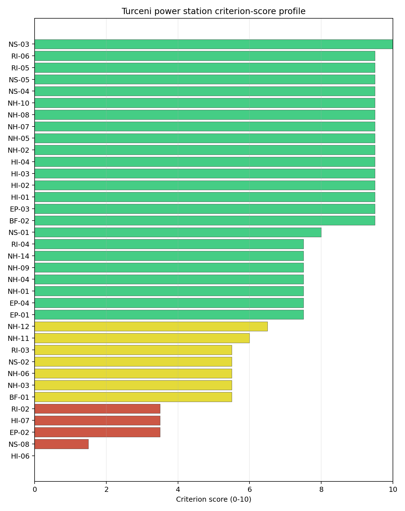

# Turceni power station Site Profile

Turceni power station is a coal/thermal site in Romania that has been tested against the NuScale VOYGR-6 reference deployment envelope. This profile reads the screening evidence at a level that supports a decision to progress toward Stage 3 characterisation. It is not a site-suitability determination, vendor recommendation, or licensing finding.

## Site Snapshot

| Field | Value |
| --- | --- |
| Site name | Turceni power station |
| Coordinates | 44.6697, 23.4078 |
| Subnational unit | Gorj |
| Installed thermal capacity (source data) | 2,640 MW |
| Available surface area | 173.0 ha |
| Available surface area for development | 169.8 ha |
| Composite score (baseline weights) | 7.816 (6.891-8.256 MC band) |
| National stability band | A (top-10% hit rate 100%) |
| National rank | 1 |

_See the country status map in_ [Romania Country Profile](../RO_country_prototype.md#country-status-map).

## Ownership and Coal-to-Nuclear Context

- **Government of Romania** (77.15% share), headquartered in Romania; immediate operator Complexul Energetic Oltenia SA. Path: Government of Romania  -> Ministry of Energy (Romania)  [100.0%] -> Complexul Energetic Oltenia SA [77.15%] -> Turceni power station Unit 6 [100.0%]
- **Fondul Proprietatea SA** (21.55% share), headquartered in Romania; immediate operator Complexul Energetic Oltenia SA. Path: Fondul Proprietatea SA -> Complexul Energetic Oltenia SA [21.55%] -> Turceni power station Unit 1 [100.0%]
- **NN Group NV** (2.42% share), headquartered in Netherlands; immediate operator Complexul Energetic Oltenia SA. Path: NN Group NV -> Fondul Proprietatea SA [11.24%] -> Complexul Energetic Oltenia SA [21.55%] -> Turceni power station Unit 1 [100.0%]
- **small shareholder(s)** (17.84% share); immediate operator Complexul Energetic Oltenia SA. Path: small shareholder(s)  -> Fondul Proprietatea SA [82.79%] -> Complexul Energetic Oltenia SA [21.55%] -> Turceni power station Unit 6 [100.0%]
- **Ministry of Energy (Romania)** (77.15% share), headquartered in Romania; immediate operator Complexul Energetic Oltenia SA. Path: Ministry of Energy (Romania)  -> Complexul Energetic Oltenia SA [77.15%] -> Turceni power station Unit 6 [100.0%]

Generating units on record: 1 cancelled, 2 operating, 5 retired.
Earliest unit commissioning: 1976; most recent: 1989.
Retirements span 2006 to 2025, leaving brownfield grid, water, transport, and workforce assets that materially shorten Stage 3 site preparation.

## Natural Hazards (NH)

- **Seismic: Ground Motion (NH-01)** - score 7.5/10 (MC 7.0-8.0), weight 0.0455, data quality high. Evidence: PGA at 475-year return period 0.081 g; PGA at 2,475-year return period 0.158 g; Vs30 reference (m/s): 760.0.
- **Seismic: Surface Rupture (NH-02)** - score 9.5/10 (MC 9.0-10.0), favourable band: very strong separation from mapped capable faults; surface-rupture concern effectively screened at desk-study level, weight n/a, data quality screening grade. Evidence: nearest mapped capable fault 50.0 km; fault slip rate 0 mm/yr; fault name: none_in_search_radius.
- **Geotechnical: Liquefaction (NH-03)** - score 5.5/10 (MC 5.0-6.0), pass-mark band: moderate susceptibility, or high/very-high with documented or pending mitigation, weight n/a, data quality medium. Evidence: liquefaction susceptibility: high; dominant soil type: clay_loam.
- **Geotechnical: Slope Stability (NH-04)** - score 7.5/10 (MC 7.0-8.0), weight n/a, data quality screening grade. Evidence: site slope 7.75 deg; max slope in 1 km box 79.9 deg; slope stability class: moderate.
- **Geotechnical: Subsidence (NH-05)** - score 9.5/10 (MC 9.0-10.0), favourable band: no karst and mine-feature distance well above the score-5 pivot, weight 0.0354, data quality medium. Evidence: karst present: no; karst severity: none.
- **Geotechnical: Foundation (NH-06)** - score 5.5/10 (MC 5.0-6.0), pass-mark band: typical European mixed conditions at 80-150 kPa bearing capacity, weight 0.0253, data quality medium. Evidence: bearing capacity 91.3 kPa; depth to bedrock 23.4 m.
- **Volcanism (NH-07)** - score 9.5/10 (MC 9.0-10.0), favourable band: very strong margin above the score-5 boundary with no in-radius signal, weight n/a, data quality high. Evidence: volcanic hazard class: negligible.
- **Coastal Flooding (NH-08)** - score 9.5/10 (MC 9.0-10.0), favourable band: non-coastal setting with no positive marine-hazard signal, weight 0.0303, data quality medium. Evidence: distance to coast 398.7 km.
- **River Flooding (NH-09)** - score 7.5/10 (MC 7.0-8.0), weight 0.0404, data quality medium. Evidence: flood zone class: negligible.
- **Extreme Winds (NH-10)** - score 9.5/10 (MC 9.0-10.0), favourable band: lowest relative wind exposure in the current monthly-means gust cohort, weight 0.0152, data quality medium. Evidence: screening wind-speed index 6.65 m/s.
- **Extreme Precipitation (NH-11)** - score 6.0/10 (MC 6.0-7.0), pass-mark band: aggregated mean of sub-scores, weight 0.0152, data quality medium. Evidence: screening extreme-precipitation index 0.37 mm; screening precipitation index 28.2 mm/yr.
- **Extreme Temperatures (NH-12)** - score 6.5/10 (MC 6.0-7.0), pass-mark band: aggregated mean of sub-scores, weight 0.0202, data quality medium. Evidence: extreme high temperature 25.7 deg C; extreme low temperature -4.67 deg C.
- **Combined Hazards (NH-14)** - score 7.5/10 (MC 7.0-8.0), weight 0.0152, data quality n/a. Evidence: values not in measurement tables.

### Interpretation - Natural Hazards (NH)

Natural hazards at Turceni are favourable overall, with screening attention concentrated on liquefaction confidence, local precipitation, and geotechnical confirmation rather than on any standing exclusionary natural-hazard trigger. Ground motion is moderate: PGA is 0.081 g at the 475-year return period and 0.158 g at the 2,475-year return period, while the nearest mapped capable fault is 50.0 km from the site. The geotechnical file is adequate for Stage 1-2 but not final: liquefaction susceptibility is high, bearing capacity is 91.3 kPa, depth to bedrock is 23.4 m, site slope is 7.75 degrees, and the one-kilometre maximum slope of 79.94 degrees is a screening artefact that still warrants field confirmation. The wider hazard setting is stronger. Volcanic hazard is negligible, the coast is 398.66 km away, the flood-zone class is negligible, and the 50-year screening wind-speed index is 6.65 m/s. Extreme Precipitation (NH-11) has improved to 6.0/10 in the frozen scoring run, but the underlying values, 28.22 mm/year screening precipitation index and 0.37 mm screening extreme-precipitation index, remain implausibly low for a site near the southern Carpathian fringe. Stage 3 should therefore start with site-specific precipitation, snow-load and drainage confirmation, then run a CPT/SPT geotechnical campaign to settle liquefaction, bearing and foundation design inputs.

## Human-Induced and Security-Relevant Hazards (HI)

- **Aircraft Crash (HI-01)** - score 9.5/10 (MC 9.0-10.0), favourable band: only small / GA / heliport airport >= 10 km nearby, no flight-path proxy < 4 km, no major airport within 30 km, and no military airbase within 60 km, weight 0.0354, data quality high. Evidence: nearest airport 36.9 km; nearest flight path 18.4 km; airports within search radius 0; airport name: Predeşti SkyFun Airfield; airport type: small airfield.
- **Industrial Explosions (HI-02)** - score 9.5/10 (MC 9.0-10.0), favourable band: very strong margin above the score-5 boundary, weight 0.0354, data quality medium. Evidence: values not in measurement tables.
- **Toxic/Gas Releases (HI-03)** - score 9.5/10 (MC 9.0-10.0), favourable band: very strong margin above the score-5 boundary, weight 0.0354, data quality medium. Evidence: values not in measurement tables.
- **External Fires (HI-04)** - score 9.5/10 (MC 9.0-10.0), favourable band: > 15 km or no flammable-storage signal found in radius, weight 0.0303, data quality medium. Evidence: values not in measurement tables.
- **Military Installations (HI-06)** - score 0.0/10 (MC 0.0-0.0), weight 0.0303, data quality high. Evidence: nearest military installation 2.91 km; military installations within radius 8; installation name: unnamed.
- **Electromagnetic Interference (HI-07)** - score 3.5/10 (MC 3.0-4.0), weight 0.0101, data quality medium. Evidence: nearest high-power transmitter 2.97 km; transmitters within radius 21; transmitter type: communication.

### Interpretation - Human-Induced and Security-Relevant Hazards (HI)

Human-induced hazards at Turceni have one severe security issue inside an otherwise strong screening profile. Aircraft Crash (HI-01) is now favourable in the frozen run: the nearest airport is the Predeşti SkyFun Airfield at 36.85 km, the nearest major airport is 54.6 km away, the nearest flight-path proxy is 18.43 km away, and no airport is recorded inside the search radius. Industrial Explosions (HI-02), Toxic/Gas Releases (HI-03), and External Fires (HI-04) also score 9.5/10 on the current record, indicating no positive nearby hazard signal in the available screening evidence. The binding exception is Military Installations (HI-06), which scores 0.0/10: the nearest high-consequence military feature is a depot at 2.91 km, and eight depot-class military features sit within 25 km. Electromagnetic Interference (HI-07) is the second material issue, with the nearest transmitter at 2.97 km and 21 communication transmitters within 25 km, producing a 3.5/10 score. Stage 3 should therefore open with Ministry of National Defence engagement on the depot cluster and airspace/security perimeter, followed by an RF/EMI survey and a refreshed hazardous-neighbour inventory for the industrial and transport criteria.

## Radiological Impact and Emergency Planning (RI / EP)

- **Emergency Planning Feasibility (EP-01)** - score 7.5/10 (MC 7.0-8.0), weight n/a, data quality high. Evidence: EP feasibility composite 69.7 /100; road sub-score 47.6 /100; special-population sub-score 90.0 /100; geography sub-score 95.0 /100; population sub-score 95.0 /100; evacuation feasible: yes.
- **Evacuation Routes (EP-02)** - score 3.5/10 (MC 3.0-4.0), weight 0.0303, data quality medium. Evidence: road density in EPZ 0.427 km/km2; road length in EPZ 838.6 km; motorway access: yes.
- **Physical Geography Constraints (EP-03)** - score 9.5/10 (MC 9.0-10.0), favourable band: no measured relief and open river/waterway context at interim screening, weight 0.0253, data quality medium. Evidence: waterways crossing EPZ 0; major river barrier: no.
- **Special Populations (EP-04)** - score 7.5/10 (MC 7.0-8.0), weight 0.0303, data quality medium. Evidence: hospitals in EPZ 6; prisons in EPZ 0; care homes in EPZ 0.
- **Atmospheric Dispersion (RI-01)** - score no native score (unscored, no band matched), weight 0.0303, data quality medium. Evidence: annual mean wind speed 0.75 m/s; atmospheric mixing height 417.5 m; prevailing wind direction: NE.
- **Surface Water Dispersion (RI-02)** - score 3.5/10 (MC 3.0-4.0), weight 0.0253, data quality n/a. Evidence: values not in measurement tables.
- **Groundwater Dispersion (RI-03)** - score 5.5/10 (MC 5.0-6.0), pass-mark band: moderate-permeability aquifer screening proxy, weight 0.0253, data quality medium. Evidence: aquifer type: alluvial.
- **Population Density at EPZ Radii (RI-04)** - score 7.5/10 (MC 7.0-8.0), weight 0.0404, data quality screening grade. Evidence: population density within 5 km 84.4 /km2; population density within 16 km 63.2 /km2; population density within 25 km 59.9 /km2; population density within 80 km 70.9 /km2; population within 25 km 117,614 people.
- **Distance to Population Centres (RI-05)** - score 9.5/10 (MC 9.0-10.0), favourable band: nearest >=50k population-centre proxy exceeds required distance by >= 50%, weight 0.0505, data quality screening grade. Evidence: nearest city above 50k people 42.7 km; nearest city population 95,351 people; city name: Târgu Jiu.
- **Population Projections (RI-06)** - score 9.5/10 (MC 9.0-10.0), favourable band: declining population projection below -0.5%/year, weight 0.0253, data quality screening grade. Evidence: annual population growth rate -0.667 %/yr; projected population at 25 km in 60 yr 90,790 people.

### Interpretation - Radiological Impact and Emergency Planning (RI / EP)

Radiological impact and emergency planning at Turceni support Stage 3 consideration, but evacuation capacity and liquid-pathway evidence need early verification. Population pressure is moderate to low: the bundle records 6,628 people within 5 km, 117,614 within 25 km, and 1,424,739 within 80 km; population density is 84.4 people/km2 at 5 km and 59.91 people/km2 at 25 km. Târgu Jiu, with 95,351 people, is the nearest city above 50,000 people and lies 42.72 km away. Population Projections (RI-06) strengthen the screening read, with a -0.667%/year national growth rate and a projected 25 km population of 90,790 after 60 years. Emergency Planning Feasibility (EP-01) scores 69.7/100 and is marked feasible, with 47.6/100 on roads, 90.0/100 on special populations, 95.0/100 on geography, and 95.0/100 on population. The main weakness is Evacuation Routes (EP-02), where road density is 0.427 km/km2 despite 838.63 km of road and motorway access. Atmospheric dispersion remains a screening question because annual mean wind speed is 0.75 m/s and mixing height is 417.51 m, while Surface Water Dispersion (RI-02) sits at 3.5/10 pending a measured discharge and dilution analysis. Stage 3 should model EPZ clearance times on the Gorj road network, confirm Jiu low-flow and dilution behaviour, and run site-specific meteorological dispersion modelling before any emergency-planning claim is hardened.

## Non-Safety and Implementation Considerations (NS)

- **Grid Capacity Basic Filter (BF-01)** - score 5.5/10 (MC 5.0-6.0), pass-mark band: substation 15-30 km or 110-219 kV, reinforcement plausible, weight n/a, data quality n/a. Evidence: values not in measurement tables.
- **Land Area Basic Filter (BF-02)** - score 9.5/10 (MC 9.0-10.0), favourable band: contiguous and buildable area above the ideal area, weight 0.0253, data quality n/a. Evidence: values not in measurement tables.
- **Cooling Water Availability (NS-01)** - score 8.0/10 (MC 7.0-8.0), favourable band: aggregated weighted mean of sub-scores, weight 0.0404, data quality screening grade. Evidence: distance to cooling source 1.28 km; cooling source flow 24.2 m3/s; cooling source type: river; cooling source name: Râul Jiu; water stress label: Low-Medium.
- **Grid Connection (NS-02)** - score 5.5/10 (MC 5.0-6.0), pass-mark band: aggregated minimum of sub-scores, weight 0.0404, data quality high. Evidence: nearest substation 0.22 km; nearest high-voltage line 0.59 km; highest nearby line voltage 110.0 kV; grid export capacity 1,311 MW; substations within radius 33; HV lines within radius 117.
- **Transport Access (NS-03)** - score 10.0/10 (MC 9.0-10.0), favourable band: aggregated weighted mean of sub-scores, weight 0.0404, data quality medium. Evidence: nearest rail line 0.26 km; heavy-haul capable: yes.
- **Site Topography (NS-04)** - score 9.5/10 (MC 9.0-10.0), favourable band: > 80%, weight 0.0303, data quality screening grade. Evidence: favourable land cover 83.9%; moderate land cover 7.8%; unfavourable land cover 8.2%; favourable area 235.1 ha; dominant land class: 211.
- **Site Footprint Adequacy (NS-05)** - score 9.5/10 (MC 9.0-10.0), favourable band: very strong margin above the score-5 boundary, weight 0.0253, data quality high. Evidence: buildable area 169.8 ha; largest contiguous patch 169.8 ha; buildable patch count 14.
- **Existing Infrastructure (NS-06)** - score no native score (unscored, no band matched), weight 0.0253, data quality n/a. Evidence: not measured at this site (criterion remains unscored).
- **Ecological Sensitivity (NS-08)** - score 1.5/10 (MC 1.0-2.0), weight n/a, data quality high. Evidence: natural land cover 8.2 %; distance to nearest Natura 2000 site 1.418 km; distance to nearest protected area 7.473 km; Natura 2000 overlap: no; Natura 2000 sensitivity class: moderate; protected-area overlap: no; protected-area sensitivity class: low; nearest Natura 2000 site: Coridorul Jiului; Natura 2000 sites within 5 km: 1; nearest protected-area designation: Not Assigned.
- **Workforce Availability (NS-10)** - score no native score (unscored, no band matched), weight 0.0202, data quality n/a. Evidence: not measured at this site (criterion remains unscored).
- **Regulatory/Political Environment (NS-12)** - score no native score (unscored, no band matched), weight 0.0303, data quality n/a. Evidence: not measured at this site (criterion remains unscored).
- **Construction Logistics (NS-13)** - score no native score (unscored, no band matched), weight 0.0202, data quality n/a. Evidence: not measured at this site (criterion remains unscored).

### Interpretation - Non-Safety and Implementation Considerations (NS)

Non-safety and implementation conditions are the strongest part of Turceni's profile, although ecological sensitivity and voltage pathway remain material Stage 3 questions. Cooling Water Availability (NS-01) scores 8.0/10: the Râul Jiu is 1.28 km from the site, mean discharge is 24.24 m3/s, and the water-stress score is 0.25, labelled Low-Medium. Grid Connection (NS-02) is close but not yet ideal for a nuclear project, with the nearest substation at 0.22 km, the nearest high-voltage line at 0.59 km, 117 high-voltage lines and 33 substations within the search radius, but a highest nearby voltage of 110 kV and a 1,311 MW inherited export-capacity estimate. Transport access is strong, with rail at 0.26 km and heavy-haul capability recorded. Land is also strong when the correct hierarchy is used: the canonical site footprint is 173.0 ha, the current buildable-area estimate is 169.78 ha in the largest contiguous patch, and the 235.12 ha favourable-area figure is only a wider screening-stage expansion envelope. Ecological Sensitivity (NS-08) is the main non-safety constraint, scoring 1.5/10 because Coridorul Jiului is 1.418 km away and one Natura 2000 site lies within 5 km, despite no direct overlap; the nearest protected-area record is 7.473 km away. Stage 3 should therefore confirm the 220 kV or 400 kV grid pathway, run a Habitats Directive Article 6(3) screening and national EIA scoping review, and verify ownership, contiguity and reuse conditions for the 173.0 ha site footprint.

## Composite Score and Stability

Baseline composite score is 7.816, bracketed by Monte Carlo at 6.891-8.256. National stability band is `A` with a top-10% hit rate of 100% across 12 scored Monte Carlo scenarios.

Turceni's baseline composite score is 7.816, with a Monte Carlo bracket of 6.891-8.256. The national stability band is A, and the site records 100% top-5, top-10 and top-30 hit rates across all 12 scored national sensitivity scenarios. That is a tight and useful Stage 1-2 signal: Turceni remains Romania's leading brownfield candidate under the national weight perturbations considered, rather than depending on a narrow baseline-weight result. The composite is also balanced across families, with NS 8.36, RI 8.21, NH 7.80, HI 7.53 and EP 6.68 after the unscored-criterion penalty. The remaining uncertainty is therefore not about the whole-site ranking, but about which Stage 3 work items can retire the largest residual risk. HI-06, NS-08, EP-02, HI-07 and RI-02 are the practical priorities, while NS-06, NS-10, NS-12 and NS-13 need conversion from unscored or low-confidence values into project-specific evidence.

## Residual Risk Register

| Concern | Evidence | Consequence | Stage 3 action | Owner discipline |
| --- | --- | --- | --- | --- |
| Military Installations (HI-06) | Nearest depot-class military feature 2.91 km away; eight depot-class features within 25 km | Security standoff, airspace and emergency-zone coordination could become exclusionary if the feature classification is confirmed | Engage the Ministry of National Defence on feature classification, airspace, and required security-cordon depth | security |
| Ecological Sensitivity (NS-08) | Coridorul Jiului is 1.418 km away with no overlap; one Natura 2000 site lies within 5 km; nearest protected-area record is 7.473 km away | Permitting and siting envelope may narrow if the Article 6(3) and EIA screens identify indirect effects | Confirm protected-area boundaries, receptor pathways and appropriate-assessment trigger status | EIA |
| Evacuation Routes (EP-02) | EPZ road density 0.427 km/km2; 838.63 km of road; motorway access present | Time-to-clear may be constrained despite regional road access | Model EPZ evacuation clearance under seasonal and peak-load conditions | emergency planning |
| Electromagnetic Interference (HI-07) | Nearest transmitter 2.97 km away; 21 communication transmitters within 25 km | RF/EMI controls may require design separation or operating restrictions | Survey transmitter inventory, field strengths and exclusion distances | security |
| Surface Water Dispersion (RI-02) | Cooling source 1.28 km away; mean flow 24.24 m3/s; liquid-pathway score 3.5/10 | Low-flow dilution margin remains unverified for the radioactive-discharge envelope | Quantify Jiu low-flow recurrence, intake/discharge pathways and downstream users | hydrology |
| Extreme Precipitation (NH-11) | Screening precipitation index 28.22 mm/year; screening extreme-precipitation index 0.37 mm | Screening precipitation values appear too low for design-rainfall and drainage sizing | Re-measure precipitation and snow-load inputs against national station records and site drainage surveys | hydrology |

HI-06 and NS-08 dominate the residual-risk register because either could change the site boundary or the go/no-go judgement before engineering optimisation begins. EP-02, HI-07, RI-02 and NH-11 are characterisation tasks that can narrow the Stage 3 work programme and reduce uncertainty around emergency planning, EMI, liquid pathways and design hydrology. The register is a Stage 3 work plan for a leading screening candidate, not a finding of site approval.

## Stage 3 Follow-Up Checklist

- Re-measure **Military Installations (HI-06)** - native score 0.0/10 with confidence high.
- Re-measure **Ecological Sensitivity (NS-08)** - native score 1.5/10 with confidence high.
- Re-measure **Evacuation Routes (EP-02)** - native score 3.5/10 with confidence medium.
- Re-measure **Electromagnetic Interference (HI-07)** - native score 3.5/10 with confidence medium.
- Re-measure **Surface Water Dispersion (RI-02)** - native score 3.5/10 with confidence insufficient.
- Improve data quality for **Geotechnical: Subsidence & Collapse (NH-05b)** - current flag `low`.

## Evidence Limitations

- Geotechnical: Subsidence & Collapse (NH-05b) - quality `low`.
