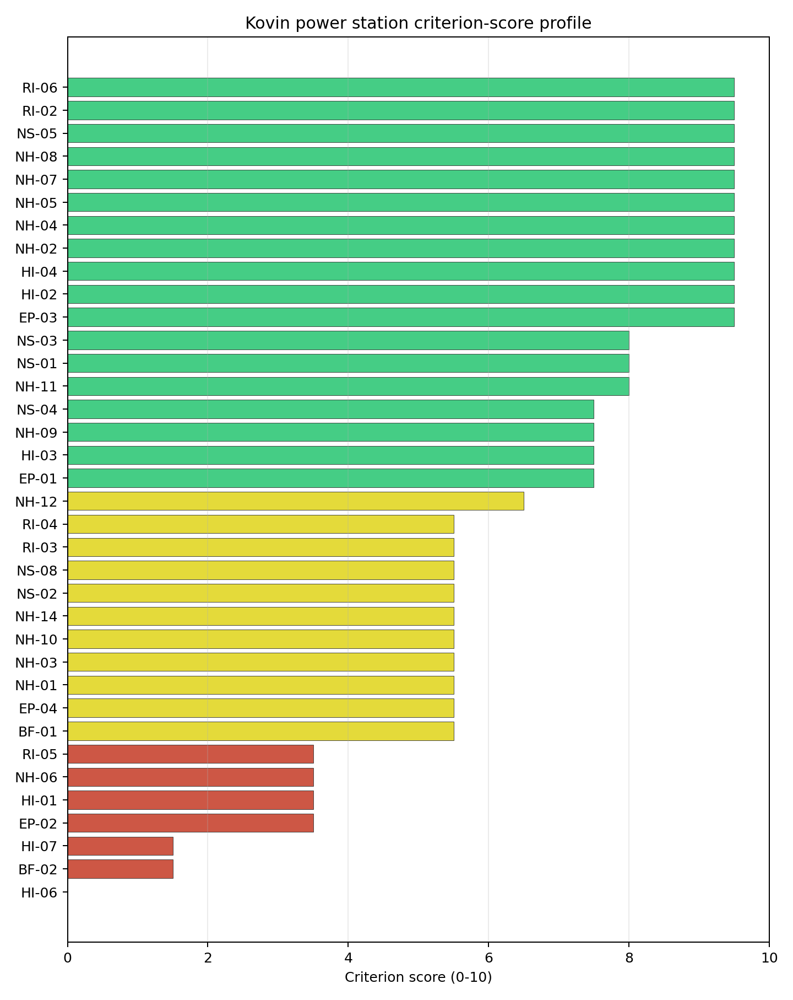
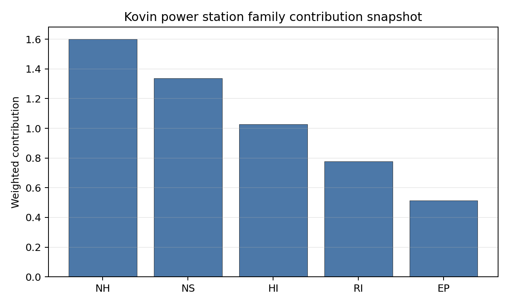

# Kovin power station Site Profile

Kovin power station is a coal/thermal site in Serbia that has been tested against the NuScale VOYGR-6 reference deployment envelope. This profile reads the screening evidence at a level that supports a decision to progress toward Stage 3 characterisation. It is not a site suitability determination, vendor recommendation, or licensing finding.

## Site Snapshot

| Field | Value |
| --- | --- |
| Site name | Kovin power station |
| Coordinates | 44.7500, 20.9667 |
| Subnational unit | Vojvodina |
| Installed thermal capacity (source data) | 700 MW |
| Available surface area | 209.3 ha |
| Available surface area for development | 7.9 ha |
| Composite score (baseline weights) | 6.503 (5.831-7.094 MC band) |
| National stability band | H (top-10% hit rate 0%) |
| National rank | 4 |

_See the country status map in_ [Serbia Country Profile](../RS_country_prototype.md#country-status-map).

## Ownership and Coal-to-Nuclear Context

- **Gazprom PJSC** (11.30% share), headquartered in Russia; immediate operator Naftna Industrija Srbije AD. Path: Gazprom PJSC -> Naftna Industrija Srbije AD [11.3%] -> Kovin power station Unit 1 [100.0%]
- **Rosneftegaz JSC** (1.24% share), headquartered in Russia; immediate operator Naftna Industrija Srbije AD. Path: Rosneftegaz JSC -> Gazprom PJSC [10.97%] -> Naftna Industrija Srbije AD [11.3%] -> Kovin power station Unit 1 [100.0%]
- **Government of Russia** (4.34% share), headquartered in Russia; immediate operator Naftna Industrija Srbije AD. Path: Government of Russia -> Federal Agency for State Property Management (Russia) [100.0%] -> Gazprom PJSC [38.37%] -> Naftna Industrija Srbije AD [11.3%] -> Kovin power station Unit 1 [100.0%]
- **Government of Serbia** (share not specified), headquartered in Serbia; immediate operator Government of Serbia. Path: Government of Serbia -> Kovin power station Unit 1 [unknown %]
- **Federal Agency for State Property Management (Russia)** (4.34% share), headquartered in Russia; immediate operator Naftna Industrija Srbije AD. Path: Federal Agency for State Property Management (Russia) -> Gazprom PJSC [38.37%] -> Naftna Industrija Srbije AD [11.3%] -> Kovin power station Unit 1 [100.0%]
- **Gazprom Neft PJSC** (44.85% share), headquartered in Russia; immediate operator Naftna Industrija Srbije AD. Path: Gazprom Neft PJSC -> Naftna Industrija Srbije AD [44.85%] -> Kovin power station Unit 1 [100.0%]
- **small shareholder(s)** (13.98% share); immediate operator Naftna Industrija Srbije AD. Path: small shareholder(s) -> Naftna Industrija Srbije AD [13.98%] -> Kovin power station Unit 1 [100.0%]
- **Naftna Industrija Srbije AD** (100.00% share), headquartered in Serbia; immediate operator Naftna Industrija Srbije AD. Path: Naftna Industrija Srbije AD -> Kovin power station Unit 2 [100.0%]

Generating units on record: 2 cancelled.

## Natural Hazards (NH)

- **Seismic: Ground Motion (NH-01)** - score 5.5/10 (MC 5.0-6.0) - pass-mark band: At or below the score-5 risk boundary, weight 0.0455, data quality high. Evidence: PGA at 475-year return period 0.104 g; PGA at 2,475-year return period 0.234 g; Vs30 reference (m/s): 760.0.
- **Seismic: Surface Rupture (NH-02)** - score 9.5/10 (MC 9.0-10.0) - favourable: Very strong separation from mapped capable faults; surface-rupture concern effectively screened at desk-study level, weight n/a, data quality screening grade. Evidence: nearest mapped capable fault 45.9 km; fault slip rate 0.071 mm/yr; fault name: RSCF00L.
- **Geotechnical: Liquefaction (NH-03)** - score 5.5/10 (MC 5.0-6.0) - pass-mark band: Moderate susceptibility, or high/very-high with documented (or pending for `high`) mitigation, weight n/a, data quality medium. Evidence: liquefaction susceptibility: moderate; dominant soil type: clay.
- **Geotechnical: Slope Stability (NH-04)** - score 9.5/10 (MC 9.0-10.0) - favourable: Well below the risk boundary, weight n/a, data quality screening grade. Evidence: site slope 1.68 deg; max slope in 1 km box 12.9 deg; slope stability class: flat.
- **Geotechnical: Subsidence (NH-05)** - score 9.5/10 (MC 9.0-10.0) - favourable: No karst; mine-feature distance well above the score-5 pivot (or unknown), weight 0.0354, data quality medium. Evidence: karst present: no; karst severity: none.
- **Geotechnical: Foundation (NH-06)** - score 3.5/10 (MC 3.0-4.0), weight 0.0253, data quality medium. Evidence: bearing capacity 68.0 kPa; depth to bedrock 22.2 m.
- **Volcanism (NH-07)** - score 9.5/10 (MC 9.0-10.0) - favourable: Very strong margin above the score-5 boundary (or no in-radius signal is recorded), weight n/a, data quality high. Evidence: volcanic hazard class: negligible.
- **Coastal Flooding (NH-08)** - score 9.5/10 (MC 9.0-10.0) - favourable: Non-coastal OR elevation >= 50 m AMSL OR landlocked country, with no positive marine-hazard signal, weight 0.0303, data quality medium. Evidence: distance to coast 317.5 km.
- **River Flooding (NH-09)** - score 7.5/10 (MC 7.0-8.0), weight 0.0404, data quality medium. Evidence: flood zone class: negligible.
- **Extreme Winds (NH-10)** - score 5.5/10 (MC 5.0-6.0) - pass-mark band: Middle relative wind exposure around the observed cohort mean (9.0-10.5 m/s), weight 0.0152, data quality medium. Evidence: screening wind-speed index 9.17 m/s.
- **Extreme Precipitation (NH-11)** - score 8.0/10 (MC 8.0-9.0) - favourable: aggregated(mean_of_sub_scores), weight 0.0152, data quality medium. Evidence: screening extreme-precipitation index 0.23 mm; screening precipitation index 26.1 mm/yr.
- **Extreme Temperatures (NH-12)** - score 6.5/10 (MC 6.0-7.0) - pass-mark band: aggregated(mean_of_sub_scores), weight 0.0202, data quality medium. Evidence: extreme high temperature 26.7 deg C; extreme low temperature -3.82 deg C.
- **Combined Hazards (NH-14)** - score 5.5/10 (MC 5.0-6.0) - pass-mark band: At least 5 resolved, exactly one moderate hazard (3-5) or moderate interaction only, weight 0.0152, data quality n/a. Evidence: values not in measurement tables.

### Interpretation - Natural Hazards (NH)

Natural hazards at Kovin power station support a Stage 1-2 screening read, but they do not remove the need for site-specific characterisation. Key measured evidence is Geotechnical: Foundation (NH-06): bearing capacity 68.0 kPa; depth to bedrock 22.2 m; Seismic: Ground Motion (NH-01): PGA at 475-year return period 0.104 g; PGA at 2,475-year return period 0.234 g; Geotechnical: Liquefaction (NH-03): liquefaction susceptibility: moderate; dominant soil type: clay. The main Stage 3 questions are Geotechnical: Foundation (NH-06), Seismic: Ground Motion (NH-01), Geotechnical: Liquefaction (NH-03); each should be re-measured or confirmed before the site is treated as more than a screening-stage candidate.

## Human-Induced and Security-Relevant Hazards (HI)

- **Aircraft Crash (HI-01)** - score 3.5/10 (MC 3.0-4.0), weight 0.0354, data quality high. Evidence: nearest airport 2.74 km; nearest flight path 1.37 km; airports within search radius 3; airport name: Kovin Airstrip; airport type: small airfield.
- **Industrial Explosions (HI-02)** - score 9.5/10 (MC 9.0-10.0) - favourable: Very strong margin above the score-5 boundary (or no in-radius signal is recorded), weight 0.0354, data quality medium. Evidence: nearest industrial hazard establishment 25.3 km; nearest industrial site 25.3 km.
- **Toxic/Gas Releases (HI-03)** - score 7.5/10 (MC 7.0-8.0), weight 0.0354, data quality medium. Evidence: nearest toxic source 29.4 km.
- **External Fires (HI-04)** - score 9.5/10 (MC 9.0-10.0) - favourable: > 15 km, or completed flammable-storage search found nothing in radius, weight 0.0303, data quality medium. Evidence: nearest flammable storage 25.3 km.
- **Military Installations (HI-06)** - score 0.0/10 (MC 0.0-0.0), weight 0.0303, data quality high. Evidence: nearest military installation 2.42 km; military installations within radius 6; installation name: Аеродром Ковин.
- **Electromagnetic Interference (HI-07)** - score 1.5/10 (MC 1.0-2.0), weight 0.0101, data quality medium. Evidence: nearest high-power transmitter 0.71 km; transmitters within radius 71; transmitter type: water_tower.

### Interpretation - Human-Induced and Security-Relevant Hazards (HI)

Human-induced and security-relevant hazards at Kovin power station support a Stage 1-2 screening read, but they do not remove the need for site-specific characterisation. Key measured evidence is Aircraft Crash (HI-01): nearest airport 2.74 km; nearest flight path 1.37 km; Military Installations (HI-06): nearest military installation 2.42 km; military installations within radius 6; Electromagnetic Interference (HI-07): nearest high-power transmitter 0.71 km; transmitters within radius 71. The main Stage 3 questions are Aircraft Crash (HI-01), Military Installations (HI-06), Electromagnetic Interference (HI-07); each should be re-measured or confirmed before the site is treated as more than a screening-stage candidate.

## Radiological Impact and Emergency Planning (RI / EP)

- **Emergency Planning Feasibility (EP-01)** - score 7.5/10 (MC 7.0-8.0), weight n/a, data quality high. Evidence: EP feasibility composite 69.2 /100; road sub-score 40.0 /100; special-population sub-score 90.0 /100; geography sub-score 95.0 /100; population sub-score 80.0 /100; evacuation feasible: yes.
- **Evacuation Routes (EP-02)** - score 3.5/10 (MC 3.0-4.0), weight 0.0303, data quality medium. Evidence: road density in EPZ 0.3 km/km2; road length in EPZ 590.0 km; motorway access: yes.
- **Physical Geography Constraints (EP-03)** - score 9.5/10 (MC 9.0-10.0) - favourable: No measured relief; open river/waterway context (interim screening), weight 0.0253, data quality medium. Evidence: waterways crossing EPZ 0; major river barrier: no.
- **Special Populations (EP-04)** - score 5.5/10 (MC 5.0-6.0) - pass-mark band: 9-25, weight 0.0303, data quality medium. Evidence: hospitals in EPZ 15; prisons in EPZ 3; care homes in EPZ 0.
- **Atmospheric Dispersion (RI-01)** - score no native score (unscored - no band matched), weight 0.0303, data quality medium. Evidence: annual mean wind speed 0.94 m/s; atmospheric mixing height 499.4 m; prevailing wind direction: ESE.
- **Surface Water Dispersion (RI-02)** - score 9.5/10 (MC 9.0-10.0) - favourable: > 500 m3/s, weight 0.0253, data quality n/a. Evidence: values not in measurement tables.
- **Groundwater Dispersion (RI-03)** - score 5.5/10 (MC 5.0-6.0) - pass-mark band: Moderate-permeability aquifer screening proxy, weight 0.0253, data quality medium. Evidence: aquifer type: sedimentary sands.
- **Population Density at EPZ Radii (RI-04)** - score 5.5/10 (MC 5.0-6.0) - pass-mark band: aggregated(min_of_sub_scores), weight 0.0404, data quality screening grade. Evidence: population density within 5 km 168.3 /km2; population density within 16 km 149.3 /km2; population density within 25 km 125.7 /km2; population density within 80 km 149.1 /km2; population within 25 km 246,847 people.
- **Distance to Population Centres (RI-05)** - score 3.5/10 (MC 3.0-4.0), weight 0.0505, data quality screening grade. Evidence: values not in measurement tables.
- **Population Projections (RI-06)** - score 9.5/10 (MC 9.0-10.0) - favourable: Declining (< -0.5 %/yr), weight 0.0253, data quality screening grade. Evidence: annual population growth rate -1.016 %/yr; projected population at 25 km in 60 yr 137,862 people.

### Interpretation - Radiological Impact and Emergency Planning (RI / EP)

Radiological impact and emergency planning at Kovin power station support a Stage 1-2 screening read, but they do not remove the need for site-specific characterisation. Key measured evidence is Evacuation Routes (EP-02): road density in EPZ 0.3 km/km2; road length in EPZ 590.0 km; Distance to Population Centres (RI-05): nearest city distance not recorded; required distance 16.0 km; Atmospheric Dispersion (RI-01): annual mean wind speed 0.94 m/s; atmospheric mixing height 499.4 m. The main Stage 3 questions are Evacuation Routes (EP-02), Distance to Population Centres (RI-05), Atmospheric Dispersion (RI-01); each should be re-measured or confirmed before the site is treated as more than a screening-stage candidate.

## Non-Safety and Implementation Considerations (NS)

- **Grid Capacity Basic Filter (BF-01)** - score 5.5/10 (MC 5.0-6.0) - pass-mark band: Note: substation 15-30 km OR 110-219 kV; reinforcement plausible, weight n/a, data quality n/a. Evidence: values not in measurement tables.
- **Land Area Basic Filter (BF-02)** - score 1.5/10 (MC 1.0-2.0), weight 0.0253, data quality n/a. Evidence: values not in measurement tables.
- **Cooling Water Availability (NS-01)** - score 8.0/10 (MC 8.0-9.0) - favourable: aggregated(weighted_mean_of_sub_scores), weight 0.0404, data quality screening grade. Evidence: distance to cooling source 3.92 km; cooling source flow 5,235 m3/s; cooling source type: major_river; cooling source name: Поњавица; water stress label: Low.
- **Grid Connection (NS-02)** - score 5.5/10 (MC 5.0-6.0) - pass-mark band: aggregated(min_of_sub_scores), weight 0.0404, data quality high. Evidence: nearest substation 0.4 km; nearest high-voltage line 5.64 km; highest nearby line voltage 110.0 kV; grid export capacity 700.0 MW; substations within radius 228; HV lines within radius 242.
- **Transport Access (NS-03)** - score 8.0/10 (MC 6.0-10.0) - favourable: aggregated(weighted_mean_of_sub_scores), weight 0.0404, data quality low. Evidence: nearest waterway 2.11 km; heavy-haul capable: yes.
- **Site Topography (NS-04)** - score 7.5/10 (MC 7.0-8.0), weight 0.0303, data quality screening grade. Evidence: favourable land cover 78.3 %; moderate land cover 11.6 %; unfavourable land cover 10.2 %; favourable area 209.3 ha; dominant land class: 211.
- **Site Footprint Adequacy (NS-05)** - score 9.5/10 (MC 9.0-10.0) - favourable: Very strong margin above the score-5 boundary, weight 0.0253, data quality medium. Evidence: buildable area 7.86 ha; largest contiguous patch 7.86 ha; buildable patch count 1.
- **Existing Infrastructure (NS-06)** - score no native score (unscored - no band matched), weight 0.0253, data quality n/a. Evidence: not measured at this site (criterion remains unscored).
- **Ecological Sensitivity (NS-08)** - score 5.5/10 (MC 3.5-7.5) - pass-mark band: Both networks NULL or >= 5 km, weight n/a, data quality insufficient. Evidence: natural land cover 10.2 %; distance to nearest protected area 7.364 km; Natura 2000 sensitivity class: unknown; protected-area overlap: no; protected-area sensitivity class: low; Natura 2000 sites within 5 km: 0; nearest protected-area designation: Emerald Network.
- **Workforce Availability (NS-10)** - score no native score (unscored - no band matched), weight 0.0202, data quality n/a. Evidence: not measured at this site (criterion remains unscored).
- **Regulatory/Political Environment (NS-12)** - score no native score (unscored - no band matched), weight 0.0303, data quality n/a. Evidence: not measured at this site (criterion remains unscored).
- **Construction Logistics (NS-13)** - score no native score (unscored - no band matched), weight 0.0202, data quality n/a. Evidence: not measured at this site (criterion remains unscored).

### Interpretation - Non-Safety and Implementation Considerations (NS)

Non-safety and implementation considerations at Kovin power station support a Stage 1-2 screening read, but they do not remove the need for site-specific characterisation. Key measured evidence is Land Area Basic Filter (BF-02): not measured in the current evidence set; Existing Infrastructure (NS-06): not measured in the current evidence set; Workforce Availability (NS-10): not measured in the current evidence set. The main Stage 3 questions are Land Area Basic Filter (BF-02), Existing Infrastructure (NS-06), Workforce Availability (NS-10); each should be re-measured or confirmed before the site is treated as more than a screening-stage candidate.

## Composite Score and Stability

Baseline composite score is 6.503, bracketed by Monte Carlo at 5.831-7.094. National stability band is `H` with a top-10% hit rate of 0% across 12 scored Monte Carlo scenarios.

Kovin power station's baseline composite score is 6.503, with a national Monte Carlo bracket of 5.831-7.094. The site ranks 4 nationally, sits in stability band H, and records a national top-10% hit rate of 0%. That means the site is rank-dependent on the national weight choice and should not be over-read from the point estimate alone. The composite is led by Industrial Explosions (HI-02), Industrial Explosions (HI-02), Industrial Explosions (HI-02), so Stage 3 effort should first narrow the criteria that both depress the score and carry avoidance or low-confidence evidence.

## Residual Risk Register

| Concern | Evidence | Consequence | Stage 3 action | Owner discipline |
| --- | --- | --- | --- | --- |
| Aircraft Crash (HI-01) | nearest airport 2.74 km; nearest flight path 1.37 km | Could change the screening class, site boundary, or characterisation priority. | Confirm Aircraft Crash with site-specific measurements and responsible-agency review. | security |
| Military Installations (HI-06) | nearest military installation 2.42 km; military installations within radius 6 | Could change the screening class, site boundary, or characterisation priority. | Confirm Military Installations with site-specific measurements and responsible-agency review. | security |
| Land Area Basic Filter (BF-02) | not measured in the current evidence set | Could change the screening class, site boundary, or characterisation priority. | Confirm Land Area Basic Filter with site-specific measurements and responsible-agency review. | grid |
| Electromagnetic Interference (HI-07) | nearest high-power transmitter 0.71 km; transmitters within radius 71 | Could change the screening class, site boundary, or characterisation priority. | Confirm Electromagnetic Interference with site-specific measurements and responsible-agency review. | security |
| Evacuation Routes (EP-02) | road density in EPZ 0.3 km/km2; road length in EPZ 590.0 km | Could change the screening class, site boundary, or characterisation priority. | Confirm Evacuation Routes with site-specific measurements and responsible-agency review. | emergency planning |
| Geotechnical: Foundation (NH-06) | bearing capacity 68.0 kPa; depth to bedrock 22.2 m | Could change the screening class, site boundary, or characterisation priority. | Confirm Geotechnical: Foundation with site-specific measurements and responsible-agency review. | geotech |

Aircraft Crash (HI-01), Military Installations (HI-06), Land Area Basic Filter (BF-02) dominate the residual-risk register. The register is a Stage 3 work plan for screening follow-up, not a finding of site approval or a procurement recommendation.

## Stage 3 Follow-Up Checklist

- Resolve **Aircraft Crash (HI-01)** avoidance flag - measured nearest light-airport distance 2.74 km against the 10 km small-airport screen.
- Resolve **Aircraft Crash (HI-01)** avoidance flag - measured nearest flight-path proxy 1.37 km against the 4 km airway screen.
- Re-measure **Military Installations (HI-06)** - native score 0.0/10 with confidence high.
- Re-measure **Land Area Basic Filter (BF-02)** - native score 1.5/10 with confidence insufficient.
- Re-measure **Electromagnetic Interference (HI-07)** - native score 1.5/10 with confidence medium.
- Re-measure **Evacuation Routes (EP-02)** - native score 3.5/10 with confidence medium.
- Re-measure **Aircraft Crash (HI-01)** - native score 3.5/10 with confidence high.
- Improve data quality for **Geotechnical: Subsidence & Collapse (NH-05b)** - current flag `low`.
- Improve data quality for **Transport Access (NS-03)** - current flag `low`.

## Evidence Limitations

- Geotechnical: Subsidence & Collapse (NH-05b) - quality `low`.
- Transport Access (NS-03) - quality `low`.
