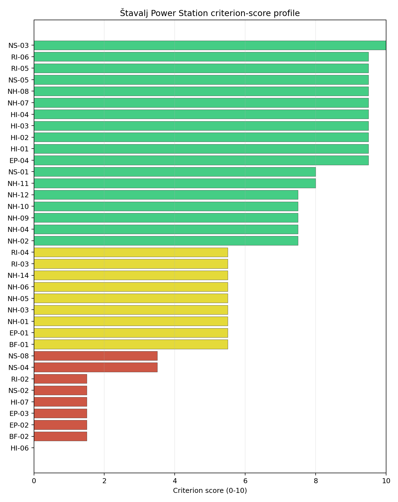
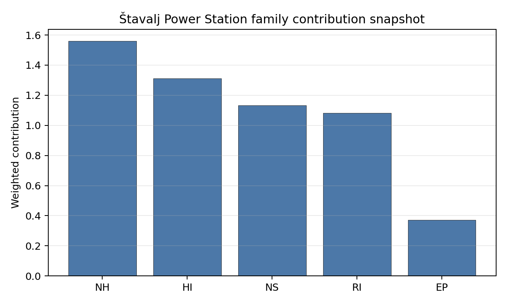

# Štavalj Power Station Site Profile

Štavalj Power Station is a coal/thermal site in Serbia that has been tested against the NuScale VOYGR-6 reference deployment envelope. This profile reads the screening evidence at a level that supports a decision to progress toward Stage 3 characterisation. It is not a site suitability determination, vendor recommendation, or licensing finding.

## Site Snapshot

| Field | Value |
| --- | --- |
| Site name | Štavalj Power Station |
| Coordinates | 43.2730, 19.9994 |
| Subnational unit | Zlatibor |
| Installed thermal capacity (source data) | 300 MW |
| Available surface area | 80.0 ha |
| Available surface area for development | 1.8 ha |
| Composite score (baseline weights) | 6.753 (5.928-7.175 MC band) |
| National stability band | A (top-10% hit rate 92%) |
| National rank | 1 |

_See the country status map in_ [Serbia Country Profile](../RS_country_prototype.md#country-status-map).

## Ownership and Coal-to-Nuclear Context

- **Elektroprivreda Srbije Beograd AD** (100.00% share), headquartered in Serbia; immediate operator Elektroprivreda Srbije Beograd AD. Path: Elektroprivreda Srbije Beograd AD -> Štavalj Power Station -- [100.0%]
- **Government of the Republic of Serbia** (100.00% share), headquartered in Serbia; immediate operator Elektroprivreda Srbije Beograd AD. Path: Government of the Republic of Serbia -> Elektroprivreda Srbije Beograd AD [100.0%] -> Štavalj Power Station -- [100.0%]

Generating units on record: 1 cancelled.

## Natural Hazards (NH)

- **Seismic: Ground Motion (NH-01)** - score 5.5/10 (MC 5.0-6.0) - pass-mark band: At or below the score-5 risk boundary, weight 0.0455, data quality high. Evidence: PGA at 475-year return period 0.129 g; PGA at 2,475-year return period 0.27 g; Vs30 reference (m/s): 760.0.
- **Seismic: Surface Rupture (NH-02)** - score 7.5/10 (MC 7.0-8.0), weight n/a, data quality screening grade. Evidence: nearest mapped capable fault 21.5 km; fault slip rate 0.122 mm/yr; fault name: RSCF00C.
- **Geotechnical: Liquefaction (NH-03)** - score 5.5/10 (MC 5.0-6.0) - pass-mark band: Moderate susceptibility, or high/very-high with documented (or pending for `high`) mitigation, weight n/a, data quality medium. Evidence: liquefaction susceptibility: high; dominant soil type: loam.
- **Geotechnical: Slope Stability (NH-04)** - score 7.5/10 (MC 7.0-8.0), weight n/a, data quality screening grade. Evidence: site slope 7.03 deg; max slope in 1 km box 88.8 deg; slope stability class: moderate.
- **Geotechnical: Subsidence (NH-05)** - score 5.5/10 (MC 5.0-6.0) - pass-mark band: At or above the mine-distance score-5 pivot; review possible, weight 0.0354, data quality medium. Evidence: karst present: no; karst severity: moderate; formation type: carbonate (Continuous carbonate rocks).
- **Geotechnical: Foundation (NH-06)** - score 5.5/10 (MC 5.0-6.0) - pass-mark band: Typical European mixed conditions (bearing 80-150 kPa), weight 0.0253, data quality medium. Evidence: bearing capacity 86.7 kPa; depth to bedrock 38.0 m.
- **Volcanism (NH-07)** - score 9.5/10 (MC 9.0-10.0) - favourable: Very strong margin above the score-5 boundary (or no in-radius signal is recorded), weight n/a, data quality high. Evidence: volcanic hazard class: negligible.
- **Coastal Flooding (NH-08)** - score 9.5/10 (MC 9.0-10.0) - favourable: Non-coastal OR elevation >= 50 m AMSL OR landlocked country, with no positive marine-hazard signal, weight 0.0303, data quality medium. Evidence: distance to coast 144.0 km.
- **River Flooding (NH-09)** - score 7.5/10 (MC 7.0-8.0), weight 0.0404, data quality medium. Evidence: flood zone class: negligible.
- **Extreme Winds (NH-10)** - score 7.5/10 (MC 7.0-8.0), weight 0.0152, data quality medium. Evidence: screening wind-speed index 8.49 m/s.
- **Extreme Precipitation (NH-11)** - score 8.0/10 (MC 7.0-8.0) - favourable: aggregated(mean_of_sub_scores), weight 0.0152, data quality medium. Evidence: screening extreme-precipitation index 0.24 mm; screening precipitation index 32.1 mm/yr.
- **Extreme Temperatures (NH-12)** - score 7.5/10 (MC 7.0-8.0), weight 0.0202, data quality medium. Evidence: extreme high temperature 21.3 deg C; extreme low temperature -6.48 deg C.
- **Combined Hazards (NH-14)** - score 5.5/10 (MC 5.0-6.0) - pass-mark band: At least 5 resolved, exactly one moderate hazard (3-5) or moderate interaction only, weight 0.0152, data quality n/a. Evidence: values not in measurement tables.

### Interpretation - Natural Hazards (NH)

Natural hazards at Štavalj Power Station support a Stage 1-2 screening read, but they do not remove the need for site-specific characterisation. Key measured evidence is Seismic: Ground Motion (NH-01): PGA at 475-year return period 0.129 g; PGA at 2,475-year return period 0.27 g; Geotechnical: Liquefaction (NH-03): liquefaction susceptibility: high; dominant soil type: loam; Geotechnical: Subsidence (NH-05): karst present: no; karst severity: moderate. The main Stage 3 questions are Seismic: Ground Motion (NH-01), Geotechnical: Liquefaction (NH-03), Geotechnical: Subsidence (NH-05); each should be re-measured or confirmed before the site is treated as more than a screening-stage candidate.

## Human-Induced and Security-Relevant Hazards (HI)

- **Aircraft Crash (HI-01)** - score 9.5/10 (MC 9.0-10.0) - favourable: Only small / GA / heliport airport >= 10 km nearby, no flight-path proxy < 4 km, no major airport within 30 km, and no military airbase within 60 km, weight 0.0354, data quality high. Evidence: nearest airport 48.1 km; nearest flight path 24.8 km; airports within search radius 0; airport name: Berane General Hospital Heliport; airport type: heliport.
- **Industrial Explosions (HI-02)** - score 9.5/10 (MC 7.5-10.0) - favourable: Very strong margin above the score-5 boundary (or no in-radius signal is recorded), weight 0.0354, data quality low. Evidence: values not in measurement tables.
- **Toxic/Gas Releases (HI-03)** - score 9.5/10 (MC 7.5-10.0) - favourable: Very strong margin above the score-5 boundary (or no in-radius signal is recorded), weight 0.0354, data quality low. Evidence: values not in measurement tables.
- **External Fires (HI-04)** - score 9.5/10 (MC 7.5-10.0) - favourable: > 15 km, or completed flammable-storage search found nothing in radius, weight 0.0303, data quality low. Evidence: values not in measurement tables.
- **Military Installations (HI-06)** - score 0.0/10 (MC 0.0-0.0), weight 0.0303, data quality high. Evidence: nearest military installation 0.39 km; military installations within radius 5; installation name: unnamed.
- **Electromagnetic Interference (HI-07)** - score 1.5/10 (MC 1.0-2.0), weight 0.0101, data quality medium. Evidence: nearest high-power transmitter 1.21 km; transmitters within radius 35; transmitter type: communication.

### Interpretation - Human-Induced and Security-Relevant Hazards (HI)

Human-induced and security-relevant hazards at Štavalj Power Station support a Stage 1-2 screening read, but they do not remove the need for site-specific characterisation. Key measured evidence is Military Installations (HI-06): nearest military installation 0.39 km; military installations within radius 5; Electromagnetic Interference (HI-07): nearest high-power transmitter 1.21 km; transmitters within radius 35; Aircraft Crash (HI-01): nearest airport 48.1 km; nearest flight path 24.8 km. The main Stage 3 questions are Military Installations (HI-06), Electromagnetic Interference (HI-07), Aircraft Crash (HI-01); each should be re-measured or confirmed before the site is treated as more than a screening-stage candidate.

## Radiological Impact and Emergency Planning (RI / EP)

- **Emergency Planning Feasibility (EP-01)** - score 5.5/10 (MC 5.0-6.0) - pass-mark band: At or above the composite score-5 boundary, weight n/a, data quality high. Evidence: EP feasibility composite 47.9 /100; road sub-score 15.5 /100; special-population sub-score 90.0 /100; geography sub-score 10.0 /100; population sub-score 80.0 /100; evacuation feasible: yes.
- **Evacuation Routes (EP-02)** - score 1.5/10 (MC 1.0-2.0), weight 0.0303, data quality medium. Evidence: road density in EPZ 0.155 km/km2; road length in EPZ 304.1 km; motorway access: no.
- **Physical Geography Constraints (EP-03)** - score 1.5/10 (MC 1.0-2.0), weight 0.0253, data quality medium. Evidence: waterways crossing EPZ 82; major river barrier: yes.
- **Special Populations (EP-04)** - score 9.5/10 (MC 9.0-10.0) - favourable: 0-2 facilities, weight 0.0303, data quality medium. Evidence: hospitals in EPZ 2; prisons in EPZ 0; care homes in EPZ 0.
- **Atmospheric Dispersion (RI-01)** - score no native score (unscored - no band matched), weight 0.0303, data quality medium. Evidence: annual mean wind speed 0.59 m/s; atmospheric mixing height 448.4 m; prevailing wind direction: NW.
- **Surface Water Dispersion (RI-02)** - score 1.5/10 (MC 1.0-2.0), weight 0.0253, data quality n/a. Evidence: values not in measurement tables.
- **Groundwater Dispersion (RI-03)** - score 5.5/10 (MC 5.0-6.0) - pass-mark band: Moderate-permeability aquifer screening proxy, weight 0.0253, data quality medium. Evidence: aquifer type: sedimentary sands.
- **Population Density at EPZ Radii (RI-04)** - score 5.5/10 (MC 5.0-6.0) - pass-mark band: aggregated(min_of_sub_scores), weight 0.0404, data quality screening grade. Evidence: population density within 5 km 186.5 /km2; population density within 16 km 26.4 /km2; population density within 25 km 19.4 /km2; population density within 80 km 51.1 /km2; population within 25 km 38,156 people.
- **Distance to Population Centres (RI-05)** - score 9.5/10 (MC 9.0-10.0) - favourable: No >=50k population-centre proxy within screening envelope, weight 0.0505, data quality screening grade. Evidence: values not in measurement tables.
- **Population Projections (RI-06)** - score 9.5/10 (MC 9.0-10.0) - favourable: Declining (< -0.5 %/yr), weight 0.0253, data quality screening grade. Evidence: annual population growth rate -1.217 %/yr; projected population at 25 km in 60 yr 21,305 people.

### Interpretation - Radiological Impact and Emergency Planning (RI / EP)

Radiological impact and emergency planning at Štavalj Power Station support a Stage 1-2 screening read, but they do not remove the need for site-specific characterisation. Key measured evidence is Evacuation Routes (EP-02): road density in EPZ 0.155 km/km2; road length in EPZ 304.1 km; Physical Geography Constraints (EP-03): waterways crossing EPZ 82; major river barrier: yes; Surface Water Dispersion (RI-02): not measured in the current evidence set. The main Stage 3 questions are Evacuation Routes (EP-02), Physical Geography Constraints (EP-03), Surface Water Dispersion (RI-02); each should be re-measured or confirmed before the site is treated as more than a screening-stage candidate.

## Non-Safety and Implementation Considerations (NS)

- **Grid Capacity Basic Filter (BF-01)** - score 5.5/10 (MC 5.0-6.0) - pass-mark band: Note: substation 15-30 km OR 110-219 kV; reinforcement plausible, weight n/a, data quality n/a. Evidence: values not in measurement tables.
- **Land Area Basic Filter (BF-02)** - score 1.5/10 (MC 1.0-2.0), weight 0.0253, data quality n/a. Evidence: values not in measurement tables.
- **Cooling Water Availability (NS-01)** - score 8.0/10 (MC 7.0-8.0) - favourable: aggregated(weighted_mean_of_sub_scores), weight 0.0404, data quality screening grade. Evidence: distance to cooling source 3.8 km; cooling source flow 5.26 m3/s; cooling source type: river; cooling source name: Grabovica; water stress label: Low.
- **Grid Connection (NS-02)** - score 1.5/10 (MC 1.0-2.0), weight 0.0404, data quality high. Evidence: nearest substation 1.39 km; nearest high-voltage line 0.52 km; grid export capacity 300.0 MW; substations within radius 28; HV lines within radius 92.
- **Transport Access (NS-03)** - score 10.0/10 (MC 8.0-10.0) - favourable: aggregated(weighted_mean_of_sub_scores), weight 0.0404, data quality low. Evidence: nearest highway 0.28 km; heavy-haul capable: yes.
- **Site Topography (NS-04)** - score 3.5/10 (MC 3.0-4.0), weight 0.0303, data quality screening grade. Evidence: favourable land cover 26.9 %; moderate land cover 68.5 %; unfavourable land cover 4.6 %; favourable area 80.0 ha; dominant land class: 321.
- **Site Footprint Adequacy (NS-05)** - score 9.5/10 (MC 7.5-10.0) - favourable: Very strong margin above the score-5 boundary, weight 0.0253, data quality low. Evidence: buildable area 1.84 ha; largest contiguous patch 1.84 ha; buildable patch count 1.
- **Existing Infrastructure (NS-06)** - score no native score (unscored - no band matched), weight 0.0253, data quality n/a. Evidence: not measured at this site (criterion remains unscored).
- **Ecological Sensitivity (NS-08)** - score 3.5/10 (MC 1.5-5.5), weight n/a, data quality insufficient. Evidence: natural land cover 4.6 %; distance to nearest protected area 3.907 km; Natura 2000 sensitivity class: unknown; protected-area overlap: no; protected-area sensitivity class: moderate; Natura 2000 sites within 5 km: 0; nearest protected-area designation: Nature Reserve.
- **Workforce Availability (NS-10)** - score no native score (unscored - no band matched), weight 0.0202, data quality n/a. Evidence: not measured at this site (criterion remains unscored).
- **Regulatory/Political Environment (NS-12)** - score no native score (unscored - no band matched), weight 0.0303, data quality n/a. Evidence: not measured at this site (criterion remains unscored).
- **Construction Logistics (NS-13)** - score no native score (unscored - no band matched), weight 0.0202, data quality n/a. Evidence: not measured at this site (criterion remains unscored).

### Interpretation - Non-Safety and Implementation Considerations (NS)

Non-safety and implementation considerations at Štavalj Power Station support a Stage 1-2 screening read, but they do not remove the need for site-specific characterisation. Key measured evidence is Grid Connection (NS-02): nearest substation 1.39 km; nearest high-voltage line 0.52 km; Land Area Basic Filter (BF-02): not measured in the current evidence set; Site Topography (NS-04): favourable land cover 26.9 %; moderate land cover 68.5 %. The main Stage 3 questions are Grid Connection (NS-02), Land Area Basic Filter (BF-02), Site Topography (NS-04); each should be re-measured or confirmed before the site is treated as more than a screening-stage candidate.

## Composite Score and Stability

Baseline composite score is 6.753, bracketed by Monte Carlo at 5.928-7.175. National stability band is `A` with a top-10% hit rate of 92% across 12 scored Monte Carlo scenarios.

Štavalj Power Station's baseline composite score is 6.753, with a national Monte Carlo bracket of 5.928-7.175. The site ranks 1 nationally, sits in stability band A, and records a national top-10% hit rate of 92%. That means the site is robust across the national weight perturbations considered. The composite is led by Distance to Population Centres (RI-05), Distance to Population Centres (RI-05), Distance to Population Centres (RI-05), so Stage 3 effort should first narrow the criteria that both depress the score and carry avoidance or low-confidence evidence.

## Residual Risk Register

| Concern | Evidence | Consequence | Stage 3 action | Owner discipline |
| --- | --- | --- | --- | --- |
| Grid Connection (NS-02) | nearest substation 1.39 km; nearest high-voltage line 0.52 km | Could change the screening class, site boundary, or characterisation priority. | Confirm Grid Connection with site-specific measurements and responsible-agency review. | grid |
| Military Installations (HI-06) | nearest military installation 0.39 km; military installations within radius 5 | Could change the screening class, site boundary, or characterisation priority. | Confirm Military Installations with site-specific measurements and responsible-agency review. | security |
| Land Area Basic Filter (BF-02) | not measured in the current evidence set | Could change the screening class, site boundary, or characterisation priority. | Confirm Land Area Basic Filter with site-specific measurements and responsible-agency review. | grid |
| Evacuation Routes (EP-02) | road density in EPZ 0.155 km/km2; road length in EPZ 304.1 km | Could change the screening class, site boundary, or characterisation priority. | Confirm Evacuation Routes with site-specific measurements and responsible-agency review. | emergency planning |
| Physical Geography Constraints (EP-03) | waterways crossing EPZ 82; major river barrier: yes | Could change the screening class, site boundary, or characterisation priority. | Confirm Physical Geography Constraints with site-specific measurements and responsible-agency review. | emergency planning |
| Electromagnetic Interference (HI-07) | nearest high-power transmitter 1.21 km; transmitters within radius 35 | Could change the screening class, site boundary, or characterisation priority. | Confirm Electromagnetic Interference with site-specific measurements and responsible-agency review. | security |

Grid Connection (NS-02), Military Installations (HI-06), Land Area Basic Filter (BF-02) dominate the residual-risk register. The register is a Stage 3 work plan for screening follow-up, not a finding of site approval or a procurement recommendation.

## Stage 3 Follow-Up Checklist

- Resolve **Grid Connection (NS-02)** avoidance flag - measured grid export capacity 300.0 MW against the reference SMR export-capacity screen.
- Re-measure **Military Installations (HI-06)** - native score 0.0/10 with confidence high.
- Re-measure **Land Area Basic Filter (BF-02)** - native score 1.5/10 with confidence insufficient.
- Re-measure **Evacuation Routes (EP-02)** - native score 1.5/10 with confidence medium.
- Re-measure **Physical Geography Constraints (EP-03)** - native score 1.5/10 with confidence medium.
- Re-measure **Electromagnetic Interference (HI-07)** - native score 1.5/10 with confidence medium.
- Improve data quality for **Geotechnical: Subsidence & Collapse (NH-05b)** - current flag `low`.
- Improve data quality for **Industrial Explosions (HI-02)** - current flag `low`.
- Improve data quality for **Toxic/Gas Releases (HI-03)** - current flag `low`.
- Improve data quality for **External Fires (HI-04)** - current flag `low`.
- Improve data quality for **Transport Access (NS-03)** - current flag `low`.
- Improve data quality for **Site Footprint Adequacy (NS-05)** - current flag `low`.

## Evidence Limitations

- Geotechnical: Subsidence & Collapse (NH-05b) - quality `low`.
- Industrial Explosions (HI-02) - quality `low`.
- Toxic/Gas Releases (HI-03) - quality `low`.
- External Fires (HI-04) - quality `low`.
- Transport Access (NS-03) - quality `low`.
- Site Footprint Adequacy (NS-05) - quality `low`.
