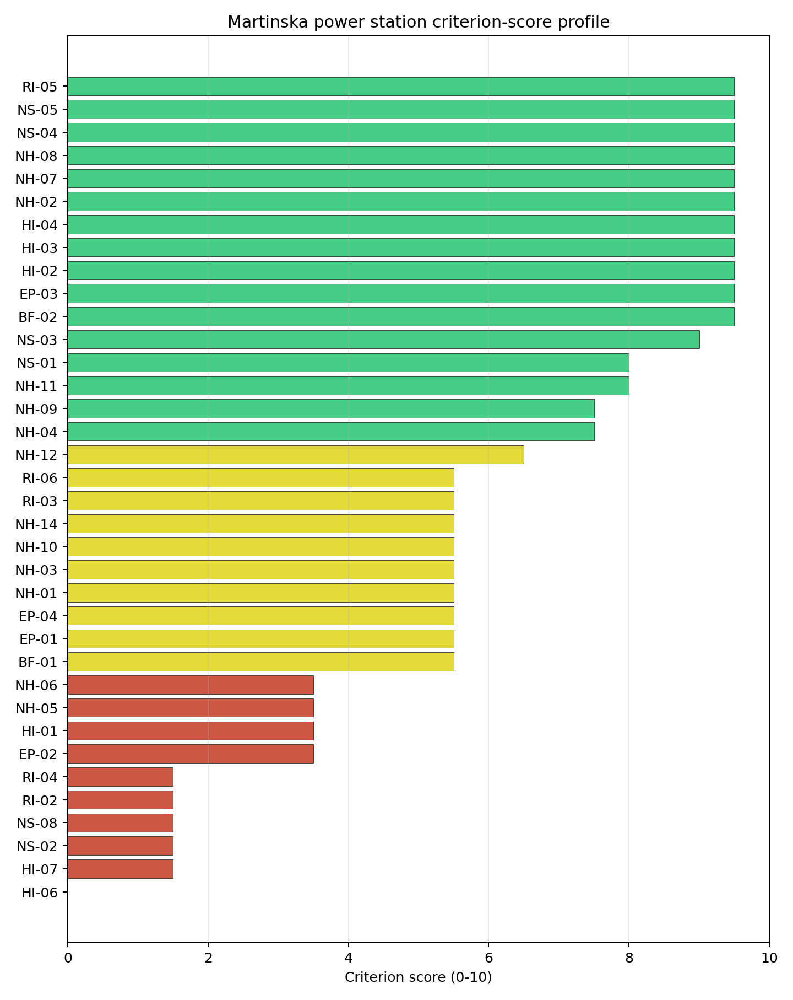
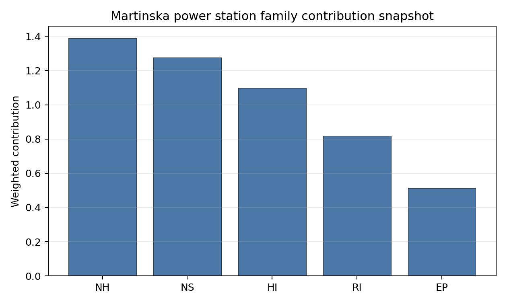

# Martinska power station Site Profile

Martinska power station is a coal/thermal site in Slovakia that has been tested against the NuScale VOYGR-6 reference deployment envelope. This profile reads the screening evidence at a level that supports a decision to progress toward Stage 3 characterisation. It is not a site-suitability determination, vendor recommendation, or licensing finding.

## Site Snapshot

| Field | Value |
| --- | --- |
| Site name | Martinska power station |
| Coordinates | 49.0592, 18.9070 |
| Subnational unit | Zilina |
| Installed thermal capacity (source data) | 32 MW |
| Available surface area | 252.9 ha |
| Available surface area for development | 252.9 ha |
| Composite score (baseline weights) | 6.303 (5.669-6.775 MC band) |
| National stability band | H (top-10% hit rate 0%) |
| National rank | 4 |

_See the country status map in_ [Slovakia Country Profile](../SK_country_prototype.md#country-status-map).

## Ownership and Coal-to-Nuclear Context

The local ownership record identifies MH Manazment AS as a 100.00% parent entry, with MH Teplarensky holding AS as the immediate operator. The ownership chain is domestically anchored in the bundle, but legal control, land parcels and operating rights still require confirmation before any Stage 3 engagement.

Generating units on record: 1 retired. Earliest unit commissioning: 1962; most recent: 1962. The recorded retirement year is 2020, leaving a small brownfield thermal context rather than a large fleet-reuse platform.

## Natural Hazards (NH)

- **Seismic: Ground Motion (NH-01)** - score 5.5/10 (MC 5.0-6.0) - pass-mark band: At or below the score-5 risk boundary., weight 0.0455, data quality high. Evidence: PGA at 475-year return period 0.125 g; PGA at 2,475-year return period 0.304 g; Vs30 reference (m/s): 760.0.
- **Seismic: Surface Rupture (NH-02)** - score 9.5/10 (MC 9.0-10.0) - favourable: Very strong separation from mapped capable faults; surface-rupture concern effectively screened at desk-study level., weight n/a, data quality screening grade. Evidence: nearest mapped capable fault 50.0 km; fault slip rate 0 mm/yr; fault name: none_in_search_radius.
- **Geotechnical: Liquefaction (NH-03)** - score 5.5/10 (MC 5.0-6.0) - pass-mark band: Moderate susceptibility, or high/very-high with documented (or pending for `high`) mitigation., weight n/a, data quality medium. Evidence: liquefaction susceptibility: high; dominant soil type: silty_clay_loam.
- **Geotechnical: Slope Stability (NH-04)** - score 7.5/10 (MC 7.0-8.0), weight n/a, data quality screening grade. Evidence: site slope 9.34 deg; max slope in 1 km box 87.4 deg; slope stability class: moderate.
- **Geotechnical: Subsidence (NH-05)** - score 3.5/10 (MC 3.0-4.0), weight 0.0354, data quality medium. Evidence: karst present: no; karst severity: none.
- **Geotechnical: Foundation (NH-06)** - score 3.5/10 (MC 3.0-4.0), weight 0.0253, data quality medium. Evidence: bearing capacity 76.7 kPa; depth to bedrock 27.7 m.
- **Volcanism (NH-07)** - score 9.5/10 (MC 9.0-10.0) - favourable: Very strong margin above the score-5 boundary (or connector confirmed no in-radius signal)., weight n/a, data quality high. Evidence: volcanic hazard class: negligible.
- **Coastal Flooding (NH-08)** - score 9.5/10 (MC 9.0-10.0) - favourable: Non-coastal OR elevation >= 50 m AMSL OR landlocked country, with no positive marine-hazard signal., weight 0.0303, data quality medium. Evidence: distance to coast 532.7 km.
- **River Flooding (NH-09)** - score 7.5/10 (MC 7.0-8.0), weight 0.0404, data quality medium. Evidence: flood zone class: negligible.
- **Extreme Winds (NH-10)** - score 5.5/10 (MC 5.0-6.0) - pass-mark band: Middle relative wind exposure around the observed cohort mean (9.0-10.5 m/s)., weight 0.0152, data quality medium. Evidence: screening wind-speed index 9.48 m/s.
- **Extreme Precipitation (NH-11)** - score 8.0/10 (MC 7.0-8.0) - favourable: aggregated(mean_of_sub_scores), weight 0.0152, data quality medium. Evidence: screening extreme-precipitation index 0.29 mm; screening precipitation index 32.9 mm/yr.
- **Extreme Temperatures (NH-12)** - score 6.5/10 (MC 6.0-7.0) - pass-mark band: aggregated(mean_of_sub_scores), weight 0.0202, data quality medium. Evidence: extreme high temperature 20.1 deg C; extreme low temperature -8.88 deg C.
- **Combined Hazards (NH-14)** - score 5.5/10 (MC 5.0-6.0) - pass-mark band: At least 5 resolved, exactly one moderate hazard (3-5) or moderate interaction only., weight 0.0152, data quality n/a. Evidence: values not in measurement tables.

### Interpretation - Natural Hazards (NH)

Natural hazards at Martinska are mixed, with seismic loading still inside the screening envelope but geotechnical scores requiring attention. PGA is 0.125 g at the 475-year return period and 0.304 g at the 2,475-year return period, and the nearest mapped capable fault is 50.0 km away. Liquefaction susceptibility is high, bearing capacity is 76.7 kPa, and depth to bedrock is 27.7 m. Subsidence scores 3.5/10 even though karst is not recorded, which signals a screening uncertainty rather than a resolved design input. Stage 3 should prioritize geotechnical investigation, liquefaction testing and confirmation of local river-flood and drainage conditions.

## Human-Induced and Security-Relevant Hazards (HI)

- **Aircraft Crash (HI-01)** - score 3.5/10 (MC 3.0-4.0), weight 0.0354, data quality high. Evidence: nearest airport 3.26 km; nearest flight path 1.63 km; airports within search radius 6; airport name: Martin Airfield; airport type: small airfield.
- **Industrial Explosions (HI-02)** - score 9.5/10 (MC 9.0-10.0) - favourable: Very strong margin above the score-5 boundary (or completed search confirmed no in-radius signal)., weight 0.0354, data quality medium. Evidence: values not in measurement tables.
- **Toxic/Gas Releases (HI-03)** - score 9.5/10 (MC 9.0-10.0) - favourable: Very strong margin above the score-5 boundary (or completed search confirmed no in-radius signal)., weight 0.0354, data quality medium. Evidence: values not in measurement tables.
- **External Fires (HI-04)** - score 9.5/10 (MC 9.0-10.0) - favourable: > 15 km, or completed flammable-storage search found nothing in radius., weight 0.0303, data quality medium. Evidence: values not in measurement tables.
- **Military Installations (HI-06)** - score 0.0/10 (MC 0.0-0.0), weight 0.0303, data quality high. Evidence: nearest military installation 1.48 km; military installations within radius 21; installation name: Základňa výcviku a mobilizačného doplňovania.
- **Electromagnetic Interference (HI-07)** - score 1.5/10 (MC 1.0-2.0), weight 0.0101, data quality medium. Evidence: nearest high-power transmitter 2.64 km; transmitters within radius 149; transmitter type: communication.

### Interpretation - Human-Induced and Security-Relevant Hazards (HI)

Human-induced hazards at Martinska are severe enough to make the site a later-wave candidate. Martin Airfield is 3.26 km away, and the nearest flight-path proxy is 1.63 km away, producing an Aircraft Crash (HI-01) avoidance flag. Military Installations (HI-06) scores 0.0/10, with Základňa výcviku a mobilizačného doplňovania 1.48 km away and 21 military features within the search radius. Electromagnetic Interference (HI-07) is also weak, with the nearest transmitter 2.64 km away and 149 transmitters recorded. Stage 3 would need defence engagement, airfield hazard modelling and RF survey work before the site can move beyond comparator status.

## Radiological Impact and Emergency Planning (RI / EP)

- **Emergency Planning Feasibility (EP-01)** - score 5.5/10 (MC 5.0-6.0) - pass-mark band: At or above the composite score-5 boundary., weight n/a, data quality high. Evidence: EP feasibility composite 48.0 /100; road sub-score 44.9 /100; special-population sub-score 90.0 /100; geography sub-score 95.0 /100; population sub-score 35.0 /100; evacuation feasible: yes.
- **Evacuation Routes (EP-02)** - score 3.5/10 (MC 3.0-4.0), weight 0.0303, data quality medium. Evidence: road density in EPZ 0.382 km/km2; road length in EPZ 749.6 km; motorway access: yes.
- **Physical Geography Constraints (EP-03)** - score 9.5/10 (MC 9.0-10.0) - favourable: No measured relief; open river/waterway context (interim screening)., weight 0.0253, data quality medium. Evidence: waterways crossing EPZ 0; major river barrier: no.
- **Special Populations (EP-04)** - score 5.5/10 (MC 5.0-6.0) - pass-mark band: 9-25., weight 0.0303, data quality medium. Evidence: hospitals in EPZ 20; prisons in EPZ 2; care homes in EPZ 0.
- **Atmospheric Dispersion (RI-01)** - score no native score (unscored - no band matched), weight 0.0303, data quality medium. Evidence: annual mean wind speed 0.64 m/s; atmospheric mixing height 446.6 m; prevailing wind direction: NNE.
- **Surface Water Dispersion (RI-02)** - score 1.5/10 (MC 1.0-2.0), weight 0.0253, data quality n/a. Evidence: values not in measurement tables.
- **Groundwater Dispersion (RI-03)** - score 5.5/10 (MC 5.0-6.0) - pass-mark band: Moderate-permeability aquifer screening proxy., weight 0.0253, data quality medium. Evidence: aquifer type: alluvial.
- **Population Density at EPZ Radii (RI-04)** - score 1.5/10 (MC 1.0-2.0), weight 0.0404, data quality screening grade. Evidence: population density within 5 km 656.9 /km2; population density within 16 km 135.1 /km2; population density within 25 km 132.0 /km2; population density within 80 km 111.8 /km2; population within 25 km 259,113 people.
- **Distance to Population Centres (RI-05)** - score 9.5/10 (MC 9.0-10.0) - favourable: Nearest >=50k population-centre proxy exceeds required distance by >= 50 %., weight 0.0505, data quality screening grade. Evidence: nearest city above 50k people 21.3 km; nearest city population 81,940 people; city name: Žilina.
- **Population Projections (RI-06)** - score 5.5/10 (MC 5.0-6.0) - pass-mark band: 0 % to +0.3 %., weight 0.0253, data quality screening grade. Evidence: annual population growth rate 0.167 %/yr; projected population at 25 km in 60 yr 214,791 people.

### Interpretation - Radiological Impact and Emergency Planning (RI / EP)

Radiological impact and emergency planning are constrained by local population density. Emergency Planning Feasibility (EP-01) scores 48.0/100 and is marked feasible, but the population sub-score is only 35.0/100. Population density reaches 656.9 people/km2 within 5 km, and the 25 km population is 259,113 people. EPZ road density is 0.382 km/km2, with 749.6 km of road and motorway access. Special-population evidence records 20 hospitals and two prisons in the EPZ. Stage 3 should therefore model evacuation clearance, special-population logistics and atmospheric dispersion in the Martin/Zilina corridor before any progression decision.

## Non-Safety and Implementation Considerations (NS)

- **Grid Capacity Basic Filter (BF-01)** - score 5.5/10 (MC 5.0-6.0) - pass-mark band: Note: substation 15-30 km OR 110-219 kV; reinforcement plausible., weight n/a, data quality n/a. Evidence: values not in measurement tables.
- **Land Area Basic Filter (BF-02)** - score 9.5/10 (MC 9.0-10.0) - favourable: Contiguous and buildable >= ideal area (70 ha/module)., weight 0.0253, data quality n/a. Evidence: values not in measurement tables.
- **Cooling Water Availability (NS-01)** - score 8.0/10 (MC 7.0-8.0) - favourable: aggregated(weighted_mean_of_sub_scores), weight 0.0404, data quality screening grade. Evidence: distance to cooling source 0.15 km; cooling source flow 7.32 m3/s; cooling source type: small_river; cooling source name: Turiec; water stress label: Low.
- **Grid Connection (NS-02)** - score 1.5/10 (MC 1.0-2.0), weight 0.0404, data quality high. Evidence: nearest substation 0.73 km; nearest high-voltage line 0.15 km; highest nearby line voltage 110.0 kV; grid export capacity 32.0 MW; substations within radius 415; HV lines within radius 388.
- **Transport Access (NS-03)** - score 9.0/10 (MC 9.0-10.0) - favourable: aggregated(weighted_mean_of_sub_scores), weight 0.0404, data quality high. Evidence: nearest highway 0.2 km; nearest rail line 0.11 km; heavy-haul capable: yes.
- **Site Topography (NS-04)** - score 9.5/10 (MC 9.0-10.0) - favourable: > 80 %., weight 0.0303, data quality screening grade. Evidence: favourable land cover 94.1 %; moderate land cover 4.6 %; unfavourable land cover 1.2 %; favourable area 228.5 ha; dominant land class: 121.
- **Site Footprint Adequacy (NS-05)** - score 9.5/10 (MC 9.0-10.0) - favourable: Very strong margin above the score-5 boundary., weight 0.0253, data quality high. Evidence: buildable area 252.9 ha; largest contiguous patch 252.9 ha; buildable patch count 4.
- **Existing Infrastructure (NS-06)** - score no native score (unscored - no band matched), weight 0.0253, data quality n/a. Evidence: not measured at this site (criterion remains unscored).
- **Ecological Sensitivity (NS-08)** - score 1.5/10 (MC 1.0-2.0), weight n/a, data quality high. Evidence: natural land cover 1.2 %; distance to nearest Natura 2000 site 1.705 km; distance to nearest protected area 1.696 km; Natura 2000 overlap: no; Natura 2000 sensitivity class: moderate; protected-area overlap: no; protected-area sensitivity class: high; nearest Natura 2000 site: Turiec a Blatnický potok; Natura 2000 sites within 5 km: 2; nearest protected-area designation: Buffer Zone of a National Nature Reserve, Nature Reserve, National Nature Monument, Nature Monument;.
- **Workforce Availability (NS-10)** - score no native score (unscored - no band matched), weight 0.0202, data quality n/a. Evidence: not measured at this site (criterion remains unscored).
- **Regulatory/Political Environment (NS-12)** - score no native score (unscored - no band matched), weight 0.0303, data quality n/a. Evidence: not measured at this site (criterion remains unscored).
- **Construction Logistics (NS-13)** - score no native score (unscored - no band matched), weight 0.0202, data quality n/a. Evidence: not measured at this site (criterion remains unscored).

### Interpretation - Non-Safety and Implementation Considerations (NS)

Martinska has a large land envelope but weak grid scale for the reference deployment. The canonical and development surface-area rows both show 252.9 ha, and Site Footprint Adequacy (NS-05) scores 9.5/10. Cooling water is close, with the Turiec 0.15 km away, 7.32 m3/s flow and a Low water-stress label. Transport access is strong, with highway at 0.20 km, rail at 0.11 km and heavy-haul capability. The binding implementation issue is Grid Connection (NS-02): export capacity is 32 MW, the highest nearby voltage is 110.0 kV, and the criterion scores 1.5/10. Ecological sensitivity is also material, with Turiec a Blatnický potok 1.705 km away and high protected-area sensitivity 1.696 km from the site. Stage 3 should only proceed if grid reinforcement, protected-area constraints and military/airfield questions can be addressed together.

## Composite Score and Stability

Baseline composite score is 6.303, bracketed by Monte Carlo at 5.669-6.775. National stability band is `H` with a top-10% hit rate of 0% in the project's 50,000-iteration national sensitivity analysis.

Martinska has a baseline composite score of 6.303, with a Monte Carlo bracket of 5.669-6.775. The national stability band is H, and the national top-10% hit rate is 0%, so the site is not a robust national shortlist candidate in the frozen sensitivity run. Its land, topography, transport and cooling proximity are attractive, but the score is undermined by a small 32 MW inherited export envelope, aircraft proximity, nearby military installations, EMI, high 5 km population density, and ecological constraints. Stage 3 would be most useful as a targeted feasibility test for grid and security constraints rather than as an immediate characterisation sequence.

## Residual Risk Register

| Concern | Evidence | Consequence | Stage 3 action | Owner discipline |
| --- | --- | --- | --- | --- |
| Grid Connection (NS-02) | Export capacity 32 MW; highest nearby voltage 110.0 kV | Transmission reinforcement could dominate feasibility | Confirm grid upgrade pathway and cost envelope | grid |
| Military Installations (HI-06) | Nearest named feature 1.48 km; 21 features within radius | Security standoff may remain structurally adverse | Engage defence authorities and classify each feature | security |
| Aircraft Crash (HI-01) | Martin Airfield 3.26 km; flight path 1.63 km | Airfield geometry may prevent removal of the avoidance flag | Model aircraft-crash hazard and flight-path geometry | security |
| Population Density at EPZ Radii (RI-04) | 656.9 people/km2 within 5 km; 259,113 people within 25 km | EPZ planning could be difficult in the immediate population zone | Model population micro-distribution and evacuation clearance | emergency planning |
| Ecological Sensitivity (NS-08) | Protected-area sensitivity high at 1.696 km; two Natura 2000 sites within 5 km | Permitting envelope may narrow available site options | Confirm protected-area boundaries and receptor pathways | EIA |

Martinska's residual risks are broad. The site has land and logistics strengths, but grid scale, security, aviation, population and ecology all need favourable Stage 3 outcomes before it can be treated as more than a later-wave comparator.

## Stage 3 Follow-Up Checklist

- Resolve **Aircraft Crash (HI-01)** avoidance flag - measured light-airport distance 3.26 km against the 10 km small-airfield screen.
- Resolve **Aircraft Crash (HI-01)** avoidance flag - measured flight-path proxy 1.63 km against the 4 km airway screen.
- Resolve **Grid Connection (NS-02)** avoidance flag - measured grid export capacity 32.0 MW against the 462 MWe reference export-capacity screen.
- Re-measure **Military Installations (HI-06)** - native score 0.0/10 with confidence high.
- Re-measure **Electromagnetic Interference (HI-07)** - native score 1.5/10 with confidence medium.
- Re-measure **Grid Connection (NS-02)** - native score 1.5/10 with confidence high.
- Re-measure **Ecological Sensitivity (NS-08)** - native score 1.5/10 with confidence high.
- Re-measure **Surface Water Dispersion (RI-02)** - native score 1.5/10 with confidence insufficient.

## Evidence Limitations

- No criterion-family quality fields are flagged as low or missing in this bundle.
