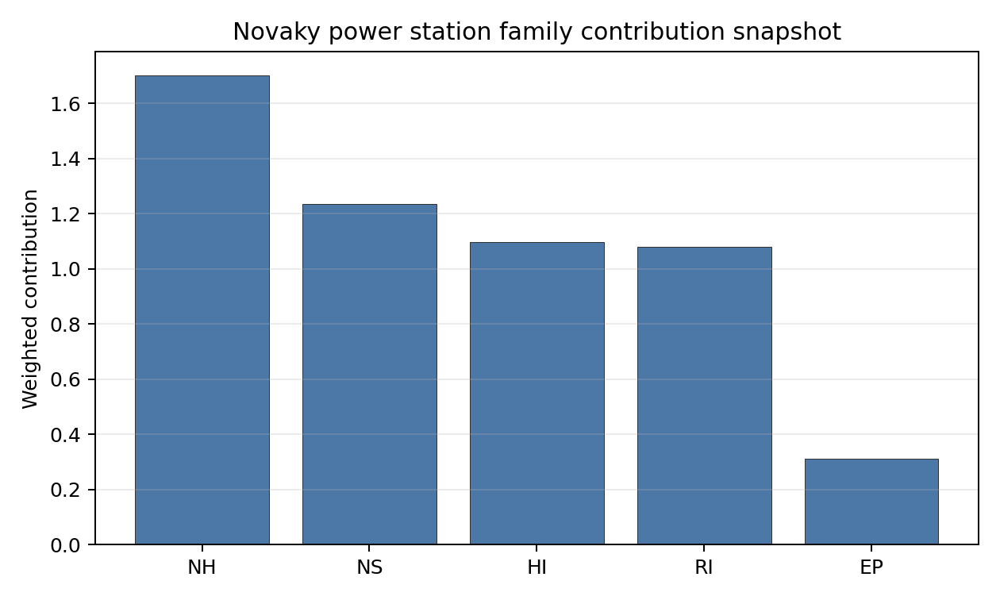

# Novaky power station Site Profile

Novaky power station is a coal/thermal site in Slovakia that has been tested against the NuScale VOYGR-6 reference deployment envelope. This profile reads the screening evidence at a level that supports a decision to progress toward Stage 3 characterisation. It is not a site-suitability determination, vendor recommendation, or licensing finding.

## Site Snapshot

| Field | Value |
| --- | --- |
| Site name | Novaky power station |
| Coordinates | 48.6988, 18.5335 |
| Subnational unit | Trenčín |
| Installed thermal capacity (source data) | 472 MW |
| Available surface area | 20.0 ha |
| Available surface area for development | 198.9 ha |
| Composite score (baseline weights) | 6.716 (6.003-7.237 MC band) |
| National stability band | H (top-10% hit rate 0%) |
| National rank | 3 |

_See the country status map in_ [Slovakia Country Profile](../SK_country_prototype.md#country-status-map).

## Ownership and Coal-to-Nuclear Context

The local ownership record identifies Slovenské Elektrárne AŞ as the immediate operator. The recorded parent interests include the Government of Slovakia and Ministry of Economy (Slovakia) at 34.00%, Enel SpA at 33.00%, and EP Slovakia BV at 33.00%, with smaller upstream public-market holders also present in the chain. Ownership and control should be confirmed legally before any site-specific engagement.

Generating units on record: 5 retired. Earliest unit commissioning: 1957; most recent: 1976. Retirements span 2013 to 2023, leaving brownfield grid, water, transport and workforce assets that support Stage 3 review.

## Natural Hazards (NH)

- **Seismic: Ground Motion (NH-01)** - score 7.5/10 (MC 7.0-8.0), weight 0.0455, data quality high. Evidence: PGA at 475-year return period 0.074 g; PGA at 2,475-year return period 0.168 g; Vs30 reference (m/s): 760.0.
- **Seismic: Surface Rupture (NH-02)** - score 9.5/10 (MC 9.0-10.0) - favourable: Very strong separation from mapped capable faults; surface-rupture concern effectively screened at desk-study level., weight n/a, data quality screening grade. Evidence: nearest mapped capable fault 50.0 km; fault slip rate 0 mm/yr; fault name: none_in_search_radius.
- **Geotechnical: Liquefaction (NH-03)** - score 5.5/10 (MC 5.0-6.0) - pass-mark band: Moderate susceptibility, or high/very-high with documented (or pending for `high`) mitigation., weight n/a, data quality medium. Evidence: liquefaction susceptibility: moderate; dominant soil type: silty_clay_loam.
- **Geotechnical: Slope Stability (NH-04)** - score 7.5/10 (MC 7.0-8.0), weight n/a, data quality screening grade. Evidence: site slope 9.32 deg; max slope in 1 km box 86.1 deg; slope stability class: moderate.
- **Geotechnical: Subsidence (NH-05)** - score 7.5/10 (MC 7.0-8.0), weight 0.0354, data quality medium. Evidence: karst present: no; karst severity: none.
- **Geotechnical: Foundation (NH-06)** - score 5.5/10 (MC 5.0-6.0) - pass-mark band: Typical European mixed conditions (bearing 80-150 kPa)., weight 0.0253, data quality medium. Evidence: bearing capacity 86.0 kPa; depth to bedrock 25.2 m.
- **Volcanism (NH-07)** - score 9.5/10 (MC 9.0-10.0) - favourable: Very strong margin above the score-5 boundary (or connector confirmed no in-radius signal)., weight n/a, data quality high. Evidence: volcanic hazard class: negligible.
- **Coastal Flooding (NH-08)** - score 9.5/10 (MC 9.0-10.0) - favourable: Non-coastal OR elevation >= 50 m AMSL OR landlocked country, with no positive marine-hazard signal., weight 0.0303, data quality medium. Evidence: distance to coast 484.4 km.
- **River Flooding (NH-09)** - score 7.5/10 (MC 7.0-8.0), weight 0.0404, data quality medium. Evidence: flood zone class: negligible.
- **Extreme Winds (NH-10)** - score 7.5/10 (MC 7.0-8.0), weight 0.0152, data quality medium. Evidence: screening wind-speed index 8.64 m/s.
- **Extreme Precipitation (NH-11)** - score 8.0/10 (MC 7.0-8.0) - favourable: aggregated(mean_of_sub_scores), weight 0.0152, data quality medium. Evidence: screening extreme-precipitation index 0.25 mm; screening precipitation index 27.7 mm/yr.
- **Extreme Temperatures (NH-12)** - score 6.5/10 (MC 6.0-7.0) - pass-mark band: aggregated(mean_of_sub_scores), weight 0.0202, data quality medium. Evidence: extreme high temperature 21.4 deg C; extreme low temperature -8.56 deg C.
- **Combined Hazards (NH-14)** - score 7.5/10 (MC 7.0-8.0), weight 0.0152, data quality n/a. Evidence: values not in measurement tables.

### Interpretation - Natural Hazards (NH)

Natural hazards at Novaky are favourable by Slovak standards, with the main field questions in geotechnical confirmation and local hydrology. Ground motion is the strongest among the selected Slovak sites, with PGA of 0.074 g at the 475-year return period and 0.168 g at the 2,475-year return period. The nearest mapped capable fault is 50.0 km away, liquefaction susceptibility is moderate, bearing capacity is 86.0 kPa, and depth to bedrock is 25.2 m. River flooding is recorded as negligible, and coastal flooding is screened out at 484.4 km from the coast. Stage 3 should confirm the alluvial profile, local drainage and precipitation inputs before using the natural-hazard result for design-basis scoping.

## Human-Induced and Security-Relevant Hazards (HI)

- **Aircraft Crash (HI-01)** - score 3.5/10 (MC 3.0-4.0), weight 0.0354, data quality high. Evidence: nearest airport 8.44 km; nearest flight path 4.22 km; airports within search radius 10; airport name: Prievidza Airfield; airport type: small airfield.
- **Industrial Explosions (HI-02)** - score 9.5/10 (MC 9.0-10.0) - favourable: Very strong margin above the score-5 boundary (or completed search confirmed no in-radius signal)., weight 0.0354, data quality medium. Evidence: values not in measurement tables.
- **Toxic/Gas Releases (HI-03)** - score 9.5/10 (MC 9.0-10.0) - favourable: Very strong margin above the score-5 boundary (or completed search confirmed no in-radius signal)., weight 0.0354, data quality medium. Evidence: values not in measurement tables.
- **External Fires (HI-04)** - score 9.5/10 (MC 9.0-10.0) - favourable: > 15 km, or completed flammable-storage search found nothing in radius., weight 0.0303, data quality medium. Evidence: values not in measurement tables.
- **Military Installations (HI-06)** - score 0.0/10 (MC 0.0-0.0), weight 0.0303, data quality high. Evidence: nearest military installation 3.12 km; military installations within radius 14; installation name: unnamed.
- **Electromagnetic Interference (HI-07)** - score 1.5/10 (MC 1.0-2.0), weight 0.0101, data quality medium. Evidence: nearest high-power transmitter 1.95 km; transmitters within radius 109; transmitter type: communication.

### Interpretation - Human-Induced and Security-Relevant Hazards (HI)

Human-induced hazards are the main reason Novaky remains avoidance-flagged. Aircraft Crash (HI-01) scores 3.5/10 because Prievidza Airfield is 8.44 km away and the nearest flight-path proxy is 4.22 km away. Military Installations (HI-06) is a binding security issue, with the nearest feature 3.12 km away and 14 military features within the search radius. Electromagnetic Interference (HI-07) also needs review: the nearest high-power transmitter is 1.95 km away and 109 transmitters are recorded within the search radius. Stage 3 should prioritize airfield geometry, military-feature classification and RF/EMI measurement before wider implementation work.

## Radiological Impact and Emergency Planning (RI / EP)

- **Emergency Planning Feasibility (EP-01)** - score 5.5/10 (MC 5.0-6.0) - pass-mark band: At or above the composite score-5 boundary., weight n/a, data quality high. Evidence: EP feasibility composite 54.8 /100; road sub-score 43.3 /100; special-population sub-score 90.0 /100; geography sub-score 10.0 /100; population sub-score 80.0 /100; evacuation feasible: yes.
- **Evacuation Routes (EP-02)** - score 3.5/10 (MC 3.0-4.0), weight 0.0303, data quality medium. Evidence: road density in EPZ 0.355 km/km2; road length in EPZ 697.5 km; motorway access: yes.
- **Physical Geography Constraints (EP-03)** - score 1.5/10 (MC 1.0-2.0), weight 0.0253, data quality medium. Evidence: waterways crossing EPZ 78; major river barrier: yes.
- **Special Populations (EP-04)** - score 5.5/10 (MC 5.0-6.0) - pass-mark band: 9-25., weight 0.0303, data quality medium. Evidence: hospitals in EPZ 12; prisons in EPZ 0; care homes in EPZ 0.
- **Atmospheric Dispersion (RI-01)** - score no native score (unscored - no band matched), weight 0.0303, data quality medium. Evidence: annual mean wind speed 0.72 m/s; atmospheric mixing height 472.5 m; prevailing wind direction: NNW.
- **Surface Water Dispersion (RI-02)** - score 1.5/10 (MC 1.0-2.0), weight 0.0253, data quality n/a. Evidence: values not in measurement tables.
- **Groundwater Dispersion (RI-03)** - score 7.5/10 (MC 7.0-8.0), weight 0.0253, data quality medium. Evidence: aquifer type: low permeability.
- **Population Density at EPZ Radii (RI-04)** - score 5.5/10 (MC 5.0-6.0) - pass-mark band: aggregated(min_of_sub_scores), weight 0.0404, data quality screening grade. Evidence: population density within 5 km 139.4 /km2; population density within 16 km 166.5 /km2; population density within 25 km 114.7 /km2; population density within 80 km 110.4 /km2; population within 25 km 225,204 people.
- **Distance to Population Centres (RI-05)** - score 9.5/10 (MC 9.0-10.0) - favourable: Nearest >=50k population-centre proxy exceeds required distance by >= 50 %., weight 0.0505, data quality screening grade. Evidence: nearest city above 50k people 41.8 km; nearest city population 54,458 people; city name: Trenčín.
- **Population Projections (RI-06)** - score 7.5/10 (MC 7.0-8.0), weight 0.0253, data quality screening grade. Evidence: annual population growth rate -0.05 %/yr; projected population at 25 km in 60 yr 186,685 people.

### Interpretation - Radiological Impact and Emergency Planning (RI / EP)

Radiological impact and emergency planning at Novaky are constrained by geography and water pathways. Emergency Planning Feasibility (EP-01) scores 54.8/100 and is marked feasible, but the geography sub-score is only 10.0/100, with 78 waterways crossing the EPZ and a major-river-barrier flag. EPZ road density is 0.355 km/km2, the lowest among the selected Slovak sites, and road length is 697.5 km. Population density is moderate, at 139.4 people/km2 within 5 km and 114.7 people/km2 within 25 km, with 225,204 people inside 25 km. Surface Water Dispersion (RI-02) scores 1.5/10. Stage 3 should model evacuation clearance, river-barrier effects and liquid-pathway dispersion for the Nitra context.

## Non-Safety and Implementation Considerations (NS)

- **Grid Capacity Basic Filter (BF-01)** - score 5.5/10 (MC 5.0-6.0) - pass-mark band: Note: substation 15-30 km OR 110-219 kV; reinforcement plausible., weight n/a, data quality n/a. Evidence: values not in measurement tables.
- **Land Area Basic Filter (BF-02)** - score 9.5/10 (MC 9.0-10.0) - favourable: Contiguous and buildable >= ideal area (70 ha/module)., weight 0.0253, data quality n/a. Evidence: values not in measurement tables.
- **Cooling Water Availability (NS-01)** - score 7.0/10 (MC 7.0-8.0), weight 0.0404, data quality screening grade. Evidence: distance to cooling source 0.73 km; cooling source flow 3.77 m3/s; cooling source type: small_river; cooling source name: Nitra; water stress label: Low.
- **Grid Connection (NS-02)** - score 5.5/10 (MC 5.0-6.0) - pass-mark band: aggregated(min_of_sub_scores), weight 0.0404, data quality high. Evidence: nearest substation 0.19 km; nearest high-voltage line 0.4 km; highest nearby line voltage 110.0 kV; grid export capacity 472.0 MW; substations within radius 279; HV lines within radius 264.
- **Transport Access (NS-03)** - score 9.0/10 (MC 9.0-10.0) - favourable: aggregated(weighted_mean_of_sub_scores), weight 0.0404, data quality high. Evidence: nearest highway 0.34 km; nearest rail line 0.02 km; heavy-haul capable: yes.
- **Site Topography (NS-04)** - score 7.5/10 (MC 7.0-8.0), weight 0.0303, data quality screening grade. Evidence: favourable land cover 73.0 %; moderate land cover 8.8 %; unfavourable land cover 18.2 %; favourable area 217.3 ha; dominant land class: 211.
- **Site Footprint Adequacy (NS-05)** - score 5.5/10 (MC 5.0-6.0) - pass-mark band: At or above the score-5 boundary., weight 0.0253, data quality medium. Evidence: buildable area 198.9 ha; largest contiguous patch 198.9 ha; buildable patch count 13.
- **Existing Infrastructure (NS-06)** - score no native score (unscored - no band matched), weight 0.0253, data quality n/a. Evidence: not measured at this site (criterion remains unscored).
- **Ecological Sensitivity (NS-08)** - score 3.5/10 (MC 3.0-4.0), weight n/a, data quality high. Evidence: natural land cover 18.2 %; distance to nearest Natura 2000 site 2.223 km; distance to nearest protected area 4.937 km; Natura 2000 overlap: no; Natura 2000 sensitivity class: low; protected-area overlap: no; protected-area sensitivity class: low; nearest Natura 2000 site: Nitrické vrchy; Natura 2000 sites within 5 km: 1; nearest protected-area designation: Protected Landscape Area; second level of protection.
- **Workforce Availability (NS-10)** - score no native score (unscored - no band matched), weight 0.0202, data quality n/a. Evidence: not measured at this site (criterion remains unscored).
- **Regulatory/Political Environment (NS-12)** - score no native score (unscored - no band matched), weight 0.0303, data quality n/a. Evidence: not measured at this site (criterion remains unscored).
- **Construction Logistics (NS-13)** - score no native score (unscored - no band matched), weight 0.0202, data quality n/a. Evidence: not measured at this site (criterion remains unscored).

### Interpretation - Non-Safety and Implementation Considerations (NS)

Novaky has a useful brownfield implementation base, but cooling water and security constraints keep it behind Vojany I. The canonical surface area is 20.0 ha, while the development-area estimate is 198.9 ha; the latter should be treated as a wider expansion envelope, not proof of available controlled land. Cooling Water Availability (NS-01) relies on the Nitra small river 0.73 km away, with 3.77 m3/s flow and a Low water-stress label. Grid Connection (NS-02) is close but moderate, with a substation at 0.19 km, a high-voltage line at 0.40 km, a highest nearby voltage of 110.0 kV and 472 MW of export capacity. Transport access is strong, with rail at 0.02 km, highway at 0.34 km and heavy-haul capability. Stage 3 should test low-flow cooling margins, the voltage upgrade path and land control.

## Composite Score and Stability

Baseline composite score is 6.716, bracketed by Monte Carlo at 6.003-7.237. National stability band is `H` with a top-10% hit rate of 0% in the project's 50,000-iteration national sensitivity analysis.

Novaky has a baseline composite score of 6.716, with a Monte Carlo bracket of 6.003-7.237. The national stability band is H, and the national top-10% hit rate is 0%, so the site is a strong point-estimate comparator but not a robust national leader. Its natural-hazard and transport record is attractive, and the brownfield retirement history strengthens the coal-to-nuclear case. The ranking is held back by aircraft proximity, military installations, EMI, geography-constrained emergency planning and weak surface-water dispersion. Stage 3 characterisation would be most valuable if it can retire those specific avoidance and low-score findings rather than re-scoring the entire site.

## Residual Risk Register

| Concern | Evidence | Consequence | Stage 3 action | Owner discipline |
| --- | --- | --- | --- | --- |
| Military Installations (HI-06) | Nearest feature 3.12 km; 14 military features within radius | Security standoff may remain an avoidance constraint | Engage defence authorities and classify the features | security |
| Aircraft Crash (HI-01) | Prievidza Airfield 8.44 km; flight path 4.22 km | Flight-path geometry may constrain siting envelope | Model aircraft-crash hazard and airfield operations | security |
| Physical Geography Constraints (EP-03) | 78 waterways crossing EPZ; major river barrier flagged | Evacuation routes may be disrupted by river barriers | Model EPZ clearance and river-crossing resilience | emergency planning |
| Surface Water Dispersion (RI-02) | Native score 1.5/10; Nitra flow 3.77 m3/s | Liquid-pathway margin may be weak under low-flow conditions | Quantify Nitra low-flow dispersion and discharge pathways | hydrology |
| Grid Connection (NS-02) | 472 MW export capacity; highest nearby voltage 110.0 kV | Export pathway may need reinforcement for the reference envelope | Confirm substation upgrade and transmission pathway | grid |

Novaky is a credible second-tier comparator because its natural-hazard and logistics profile is strong. The residual-risk register shows why it remains behind Vojany I in the national sequence: aviation, security, emergency planning and water-pathway issues all need early evidence.

## Stage 3 Follow-Up Checklist

- Resolve **Aircraft Crash (HI-01)** avoidance flag - measured light-airport distance 8.44 km against the 10 km small-airfield screen.
- Re-measure **Military Installations (HI-06)** - native score 0.0/10 with confidence high.
- Re-measure **Physical Geography Constraints (EP-03)** - native score 1.5/10 with confidence medium.
- Re-measure **Electromagnetic Interference (HI-07)** - native score 1.5/10 with confidence medium.
- Re-measure **Surface Water Dispersion (RI-02)** - native score 1.5/10 with confidence insufficient.
- Re-measure **Evacuation Routes (EP-02)** - native score 3.5/10 with confidence medium.

## Evidence Limitations

- No criterion-family quality fields are flagged as low or missing in this bundle.
