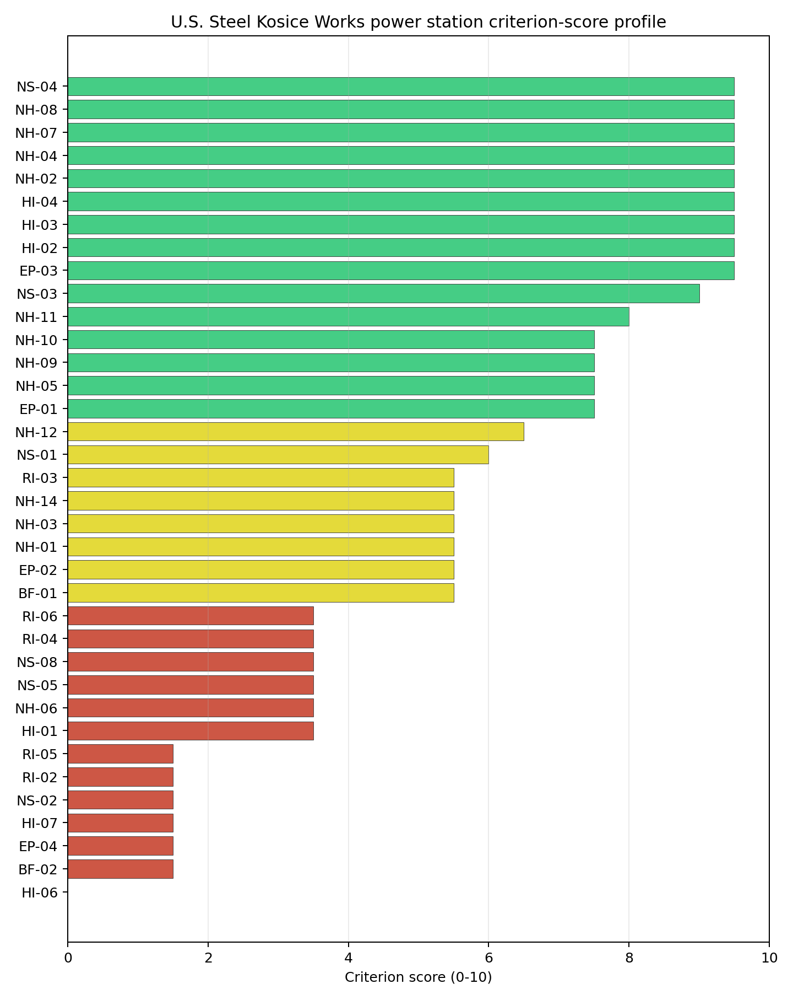

# U.S. Steel Kosice Works power station Site Profile

U.S. Steel Kosice Works power station is a coal/thermal site in Slovakia that has been tested against the NuScale VOYGR-6 reference deployment envelope. This profile reads the screening evidence at a level that supports a decision to progress toward Stage 3 characterisation. It is not a site-suitability determination, vendor recommendation, or licensing finding.

## Site Snapshot

| Field | Value |
| --- | --- |
| Site name | U.S. Steel Kosice Works power station |
| Coordinates | 48.6159, 21.1946 |
| Subnational unit | Košice |
| Installed thermal capacity (source data) | 208 MW |
| Available surface area | 11.9 ha |
| Available surface area for development | 11.9 ha |
| Composite score (baseline weights) | 5.691 (5.174-6.181 MC band) |
| National stability band | H (top-10% hit rate 0%) |
| National rank | 5 |

_See the country status map in_ [Slovakia Country Profile](../SK_country_prototype.md#country-status-map).

## Ownership and Coal-to-Nuclear Context

The local ownership record identifies US Steel Košice sro as the immediate operator. Upstream rows trace through United States Steel Corp and Nippon Steel Corp related ownership paths, but several share values are not populated in the bundle. The ownership chain therefore needs legal confirmation before the site can be treated as a controllable brownfield nuclear candidate.

Generating units on record: 1 operating. Earliest unit commissioning: 2008; most recent: 2008. The site is an active industrial power asset, so Stage 3 would need to test operational coexistence, industrial-interface risk and land-control constraints before any reuse decision.

## Natural Hazards (NH)

- **Seismic: Ground Motion (NH-01)** - score 5.5/10 (MC 5.0-6.0) - pass-mark band: At or below the score-5 risk boundary., weight 0.0455, data quality high. Evidence: PGA at 475-year return period 0.083 g; PGA at 2,475-year return period 0.221 g; Vs30 reference (m/s): 760.0.
- **Seismic: Surface Rupture (NH-02)** - score 9.5/10 (MC 9.0-10.0) - favourable: Very strong separation from mapped capable faults; surface-rupture concern effectively screened at desk-study level., weight n/a, data quality screening grade. Evidence: nearest mapped capable fault 50.0 km; fault slip rate 0 mm/yr; fault name: none_in_search_radius.
- **Geotechnical: Liquefaction (NH-03)** - score 5.5/10 (MC 5.0-6.0) - pass-mark band: Moderate susceptibility, or high/very-high with documented (or pending for `high`) mitigation., weight n/a, data quality medium. Evidence: liquefaction susceptibility: moderate.
- **Geotechnical: Slope Stability (NH-04)** - score 9.5/10 (MC 9.0-10.0) - favourable: Well below the risk boundary., weight n/a, data quality screening grade. Evidence: site slope 4 deg; max slope in 1 km box 29.7 deg; slope stability class: gentle.
- **Geotechnical: Subsidence (NH-05)** - score 7.5/10 (MC 7.0-8.0), weight 0.0354, data quality medium. Evidence: karst present: no; karst severity: none.
- **Geotechnical: Foundation (NH-06)** - score 3.5/10 (MC 3.0-4.0), weight 0.0253, data quality medium. Evidence: depth to bedrock 26.9 m.
- **Volcanism (NH-07)** - score 9.5/10 (MC 9.0-10.0) - favourable: Very strong margin above the score-5 boundary (or connector confirmed no in-radius signal)., weight n/a, data quality high. Evidence: volcanic hazard class: negligible.
- **Coastal Flooding (NH-08)** - score 9.5/10 (MC 9.0-10.0) - favourable: Non-coastal OR elevation >= 50 m AMSL OR landlocked country, with no positive marine-hazard signal., weight 0.0303, data quality medium. Evidence: distance to coast 622.7 km.
- **River Flooding (NH-09)** - score 7.5/10 (MC 7.0-8.0), weight 0.0404, data quality medium. Evidence: flood zone class: negligible.
- **Extreme Winds (NH-10)** - score 7.5/10 (MC 7.0-8.0), weight 0.0152, data quality medium. Evidence: screening wind-speed index 8.51 m/s.
- **Extreme Precipitation (NH-11)** - score 8.0/10 (MC 8.0-9.0) - favourable: aggregated(mean_of_sub_scores), weight 0.0152, data quality medium. Evidence: screening extreme-precipitation index 0.21 mm; screening precipitation index 22.3 mm/yr.
- **Extreme Temperatures (NH-12)** - score 6.5/10 (MC 6.0-7.0) - pass-mark band: aggregated(mean_of_sub_scores), weight 0.0202, data quality medium. Evidence: extreme high temperature 24.1 deg C; extreme low temperature -6.48 deg C.
- **Combined Hazards (NH-14)** - score 5.5/10 (MC 5.0-6.0) - pass-mark band: At least 5 resolved, exactly one moderate hazard (3-5) or moderate interaction only., weight 0.0152, data quality n/a. Evidence: values not in measurement tables.

### Interpretation - Natural Hazards (NH)

Natural hazards at U.S. Steel Kosice Works are generally moderate, with the main uncertainty in foundation evidence. PGA is 0.083 g at the 475-year return period and 0.221 g at the 2,475-year return period, and the nearest mapped capable fault is 50.0 km away. Liquefaction susceptibility is moderate, mean site slope is 4.0 degrees, and the maximum slope in the 1 km box is 29.7 degrees. Geotechnical: Foundation (NH-06) scores 3.5/10 because the visible evidence includes 26.9 m depth to bedrock but no bearing-capacity value. Stage 3 should therefore prioritize bearing-capacity testing, dynamic soil characterisation and confirmation of drainage/flood assumptions before the natural-hazard profile is treated as resolved.

## Human-Induced and Security-Relevant Hazards (HI)

- **Aircraft Crash (HI-01)** - score 3.5/10 (MC 3.0-4.0), weight 0.0354, data quality high. Evidence: nearest airport 3.16 km; nearest flight path 1.58 km; airports within search radius 13; airport name: Letisko Veľká Ida; airport type: small airfield.
- **Industrial Explosions (HI-02)** - score 9.5/10 (MC 9.0-10.0) - favourable: Very strong margin above the score-5 boundary (or completed search confirmed no in-radius signal)., weight 0.0354, data quality medium. Evidence: values not in measurement tables.
- **Toxic/Gas Releases (HI-03)** - score 9.5/10 (MC 9.0-10.0) - favourable: Very strong margin above the score-5 boundary (or completed search confirmed no in-radius signal)., weight 0.0354, data quality medium. Evidence: values not in measurement tables.
- **External Fires (HI-04)** - score 9.5/10 (MC 9.0-10.0) - favourable: > 15 km, or completed flammable-storage search found nothing in radius., weight 0.0303, data quality medium. Evidence: values not in measurement tables.
- **Military Installations (HI-06)** - score 0.0/10 (MC 0.0-0.0), weight 0.0303, data quality high. Evidence: nearest military installation 4.02 km; military installations within radius 72; installation name: unnamed.
- **Electromagnetic Interference (HI-07)** - score 1.5/10 (MC 1.0-2.0), weight 0.0101, data quality medium. Evidence: nearest high-power transmitter 0.87 km; transmitters within radius 433; transmitter type: communication.

### Interpretation - Human-Induced and Security-Relevant Hazards (HI)

Human-induced hazards are a major constraint at U.S. Steel Kosice Works. Aircraft Crash (HI-01) scores 3.5/10 because Letisko Veľká Ida is 3.16 km away and the nearest flight-path proxy is 1.58 km away. Military Installations (HI-06) scores 0.0/10, with the nearest military feature 4.02 km away and 72 features within the search radius. Electromagnetic Interference (HI-07) is also severe: the nearest high-power transmitter is 0.87 km away and 433 transmitters are recorded within the search radius. Stage 3 should begin with airfield hazard modelling, military-feature classification and an RF/EMI survey tied to the operating industrial context.

## Radiological Impact and Emergency Planning (RI / EP)

- **Emergency Planning Feasibility (EP-01)** - score 7.5/10 (MC 7.0-8.0), weight n/a, data quality high. Evidence: EP feasibility composite 68.9 /100; road sub-score 53.6 /100; special-population sub-score 90.0 /100; geography sub-score 95.0 /100; population sub-score 80.0 /100; evacuation feasible: yes.
- **Evacuation Routes (EP-02)** - score 5.5/10 (MC 5.0-6.0) - pass-mark band: Adequate primary routes (0.5-1.0)., weight 0.0303, data quality medium. Evidence: road density in EPZ 0.527 km/km2; road length in EPZ 1,036 km; motorway access: yes.
- **Physical Geography Constraints (EP-03)** - score 9.5/10 (MC 9.0-10.0) - favourable: No measured relief; open river/waterway context (interim screening)., weight 0.0253, data quality medium. Evidence: waterways crossing EPZ 0; major river barrier: no.
- **Special Populations (EP-04)** - score 1.5/10 (MC 1.0-2.0), weight 0.0303, data quality medium. Evidence: hospitals in EPZ 59; prisons in EPZ 2; care homes in EPZ 0.
- **Atmospheric Dispersion (RI-01)** - score no native score (unscored - no band matched), weight 0.0303, data quality medium. Evidence: annual mean wind speed 0.94 m/s; atmospheric mixing height 488.7 m; prevailing wind direction: N.
- **Surface Water Dispersion (RI-02)** - score 1.5/10 (MC 1.0-2.0), weight 0.0253, data quality n/a. Evidence: values not in measurement tables.
- **Groundwater Dispersion (RI-03)** - score 5.5/10 (MC 5.0-6.0) - pass-mark band: Moderate-permeability aquifer screening proxy., weight 0.0253, data quality medium. Evidence: aquifer type: alluvial.
- **Population Density at EPZ Radii (RI-04)** - score 3.5/10 (MC 3.0-4.0), weight 0.0404, data quality screening grade. Evidence: population density within 5 km 169.0 /km2; population density within 16 km 350.3 /km2; population density within 25 km 188.1 /km2; population density within 80 km 109.1 /km2; population within 25 km 369,221 people.
- **Distance to Population Centres (RI-05)** - score 1.5/10 (MC 1.0-2.0), weight 0.0505, data quality screening grade. Evidence: nearest city above 50k people 10.3 km; nearest city population 227,458 people; city name: Košice.
- **Population Projections (RI-06)** - score 3.5/10 (MC 3.0-4.0), weight 0.0253, data quality screening grade. Evidence: annual population growth rate 0.51 %/yr; projected population at 25 km in 60 yr 306,059 people.

### Interpretation - Radiological Impact and Emergency Planning (RI / EP)

Radiological impact and emergency planning are the principal reason U.S. Steel Kosice Works remains a weak candidate. Emergency Planning Feasibility (EP-01) scores 68.9/100 and is marked feasible, but Special Populations (EP-04) scores 1.5/10 with 59 hospitals and two prisons in the EPZ. Population Density at EPZ Radii (RI-04) is weak, with 169.0 people/km2 within 5 km, 350.3 people/km2 within 16 km, and 369,221 people within 25 km. Distance to Population Centres (RI-05) scores 1.5/10 because Košice is 10.3 km away. Stage 3 should model EPZ clearance, special-population evacuation and population-centre separation before any reuse scenario is advanced.

## Non-Safety and Implementation Considerations (NS)

- **Grid Capacity Basic Filter (BF-01)** - score 5.5/10 (MC 5.0-6.0) - pass-mark band: Note: substation 15-30 km OR 110-219 kV; reinforcement plausible., weight n/a, data quality n/a. Evidence: values not in measurement tables.
- **Land Area Basic Filter (BF-02)** - score 1.5/10 (MC 1.0-2.0), weight 0.0253, data quality n/a. Evidence: values not in measurement tables.
- **Cooling Water Availability (NS-01)** - score 6.0/10 (MC 5.0-6.0) - pass-mark band: aggregated(weighted_mean_of_sub_scores), weight 0.0404, data quality screening grade. Evidence: distance to cooling source 9.97 km; cooling source flow 1.15 m3/s; cooling source type: small_river; cooling source name: Šacký kanál; water stress label: Low-Medium.
- **Grid Connection (NS-02)** - score 1.5/10 (MC 1.0-2.0), weight 0.0404, data quality high. Evidence: nearest substation 1.72 km; nearest high-voltage line 0.97 km; highest nearby line voltage 110.0 kV; grid export capacity 208.0 MW; substations within radius 419; HV lines within radius 288.
- **Transport Access (NS-03)** - score 9.0/10 (MC 9.0-10.0) - favourable: aggregated(weighted_mean_of_sub_scores), weight 0.0404, data quality high. Evidence: nearest highway 1.55 km; nearest rail line 0.15 km; heavy-haul capable: yes.
- **Site Topography (NS-04)** - score 9.5/10 (MC 9.0-10.0) - favourable: > 80 %., weight 0.0303, data quality screening grade. Evidence: favourable land cover 96.5 %; moderate land cover 3.5 %; unfavourable land cover 0.1 %; favourable area 301.1 ha; dominant land class: 121.
- **Site Footprint Adequacy (NS-05)** - score 3.5/10 (MC 3.0-4.0), weight 0.0253, data quality high. Evidence: buildable area 11.9 ha; largest contiguous patch 11.9 ha; buildable patch count 6.
- **Existing Infrastructure (NS-06)** - score no native score (unscored - no band matched), weight 0.0253, data quality n/a. Evidence: not measured at this site (criterion remains unscored).
- **Ecological Sensitivity (NS-08)** - score 3.5/10 (MC 3.0-4.0), weight n/a, data quality high. Evidence: natural land cover 0.1 %; distance to nearest Natura 2000 site 2.316 km; distance to nearest protected area 8.391 km; Natura 2000 overlap: no; Natura 2000 sensitivity class: moderate; protected-area overlap: no; protected-area sensitivity class: low; nearest Natura 2000 site: Košická kotlina; Natura 2000 sites within 5 km: 2; nearest protected-area designation: Protected Site / Private Protected Site.
- **Workforce Availability (NS-10)** - score no native score (unscored - no band matched), weight 0.0202, data quality n/a. Evidence: not measured at this site (criterion remains unscored).
- **Regulatory/Political Environment (NS-12)** - score no native score (unscored - no band matched), weight 0.0303, data quality n/a. Evidence: not measured at this site (criterion remains unscored).
- **Construction Logistics (NS-13)** - score no native score (unscored - no band matched), weight 0.0202, data quality n/a. Evidence: not measured at this site (criterion remains unscored).

### Interpretation - Non-Safety and Implementation Considerations (NS)

Implementation conditions reflect an active industrial site rather than a retired coal-to-nuclear brownfield. The canonical and development surface-area rows both show 11.9 ha, below the 14 ha site-area avoidance threshold in the Stage 3 checklist. Cooling Water Availability (NS-01) is constrained: Šacký kanál is 9.97 km away, flow is 1.15 m3/s, and the water-stress label is Low-Medium. Grid Connection (NS-02) scores 1.5/10, with 208 MW export capacity and a highest nearby voltage of 110.0 kV. Transport access is strong, with highway at 1.55 km, rail at 0.15 km and heavy-haul capability, but land, water, grid and population-centre constraints dominate the implementation read. Stage 3 should treat this as an industrial-interface feasibility case, not a straightforward retired-thermal reuse candidate.

## Composite Score and Stability

Baseline composite score is 5.691, bracketed by Monte Carlo at 5.174-6.181. National stability band is `H` with a top-10% hit rate of 0% in the project's 50,000-iteration national sensitivity analysis.

U.S. Steel Kosice Works has a baseline composite score of 5.691, with a Monte Carlo bracket of 5.174-6.181. Its national stability band is H, and the national top-10% hit rate is 0%, placing it at the bottom of the selected Slovakia top-five set. The score benefits from strong transport access and flat topography, but those strengths are overwhelmed by aviation proximity, military features, EMI, high special-population counts, Košice proximity, small site area, low cooling flow and a 208 MW grid export envelope. Stage 3 should only be considered if the programme specifically wants to test active-industrial-site reuse; it is not a priority characterisation candidate under the national sensitivity analysis.

## Residual Risk Register

| Concern | Evidence | Consequence | Stage 3 action | Owner discipline |
| --- | --- | --- | --- | --- |
| Distance to Population Centres (RI-05) | Košice 10.3 km away; nearest city population 227,458 | Population-centre separation may remain an avoidance constraint | Model EPZ and population-centre separation at site scale | emergency planning |
| Special Populations (EP-04) | 59 hospitals and two prisons in the EPZ | Emergency planning could be complex and resource-intensive | Model special-population evacuation logistics | emergency planning |
| Aircraft Crash (HI-01) | Letisko Veľká Ida 3.16 km; flight path 1.58 km | Airfield and flight-path geometry may remain adverse | Model aircraft-crash hazard and airspace controls | security |
| Site Footprint Adequacy (NS-05) | Site area 11.9 ha; largest patch 11.9 ha | The reference envelope may not fit without additional controlled land | Confirm controllable contiguous land and constraints | ownership/legal |
| Cooling Water Availability (NS-01) | Šacký kanál 9.97 km away; flow 1.15 m3/s | Cooling-water supply may require major redesign or alternative strategy | Quantify cooling-water availability and alternatives | hydrology |
| Grid Connection (NS-02) | Export capacity 208 MW; highest nearby voltage 110.0 kV | Grid export pathway is undersized for the reference envelope | Confirm reinforcement pathway and substation options | grid |

The U.S. Steel Kosice Works register is a set of programme-level constraints, not a normal characterisation punch list. The site remains in the top five by national rank, but the frozen sensitivity result and constraint stack place it behind the retired brownfield candidates.

## Stage 3 Follow-Up Checklist

- Resolve **Aircraft Crash (HI-01)** avoidance flag - measured light-airport distance 3.16 km against the 10 km small-airfield screen.
- Resolve **Aircraft Crash (HI-01)** avoidance flag - measured major-airport distance 6.3 km against the commercial-airport separation screen.
- Resolve **Aircraft Crash (HI-01)** avoidance flag - measured flight-path proxy 1.58 km against the 4 km airway screen.
- Resolve **Grid Connection (NS-02)** avoidance flag - measured grid export capacity 208.0 MW against the 462 MWe reference export-capacity screen.
- Resolve **Site Footprint Adequacy (NS-05)** avoidance flag - measured canonical site area 11.95 ha against the 14 ha nuclear-island footprint screen.
- Resolve **Distance to Population Centres (RI-05)** avoidance flag - measured 10.33 km separation from the nearest city above 50,000 people against the 16 km population-centre screen.
- Re-measure **Military Installations (HI-06)** - native score 0.0/10 with confidence high.
- Re-measure **Land Area Basic Filter (BF-02)** - native score 1.5/10 with confidence insufficient.
- Re-measure **Special Populations (EP-04)** - native score 1.5/10 with confidence medium.
- Re-measure **Electromagnetic Interference (HI-07)** - native score 1.5/10 with confidence medium.
- Re-measure **Grid Connection (NS-02)** - native score 1.5/10 with confidence high.

## Evidence Limitations

- No criterion-family quality fields are flagged as low or missing in this bundle.
