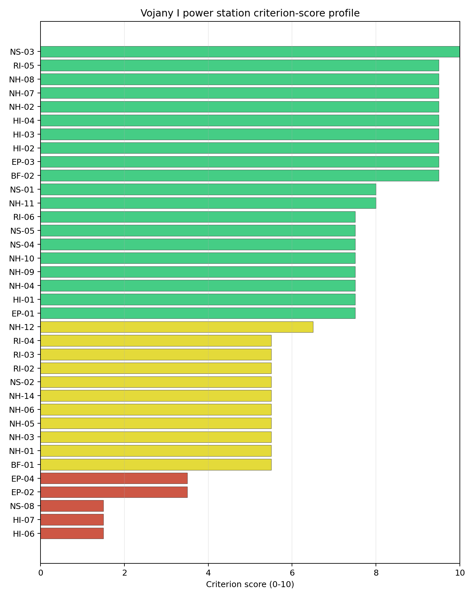
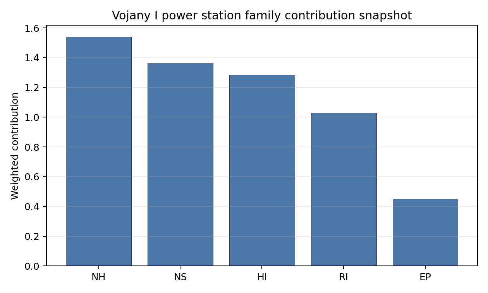

# Vojany I power station Site Profile

Vojany I power station is a coal/thermal site in Slovakia that has been tested against the NuScale VOYGR-6 reference deployment envelope. This profile reads the screening evidence at a level that supports a decision to progress toward Stage 3 characterisation. It is not a site-suitability determination, vendor recommendation, or licensing finding.

## Site Snapshot

| Field | Value |
| --- | --- |
| Site name | Vojany I power station |
| Coordinates | 48.5525, 21.9726 |
| Subnational unit | Košice |
| Installed thermal capacity (source data) | 660 MW |
| Available surface area | 53.0 ha |
| Available surface area for development | 89.5 ha |
| Composite score (baseline weights) | 7.022 (6.250-7.481 MC band) |
| National stability band | A (top-10% hit rate 100%) |
| National rank | 1 |

_See the country status map in_ [Slovakia Country Profile](../SK_country_prototype.md#country-status-map).

## Ownership and Coal-to-Nuclear Context

The local ownership record identifies Slovenské Elektrárne AŞ as the immediate operator. The recorded parent interests include the Government of Slovakia and Ministry of Economy (Slovakia) at 34.00%, Enel SpA at 33.00%, and EP Slovakia BV at 33.00%, with smaller upstream public-market holders also present in the chain. Ownership and control should be confirmed legally before any site-specific engagement.

Generating units on record: 6 retired. Earliest unit commissioning: 1965; most recent: 1966. Retirements span 2008 to 2024, leaving a brownfield grid, water, transport and workforce context for Stage 3 review.

## Natural Hazards (NH)

- **Seismic: Ground Motion (NH-01)** - score 5.5/10 (MC 5.0-6.0) - pass-mark band: At or below the score-5 risk boundary., weight 0.0455, data quality high. Evidence: PGA at 475-year return period 0.095 g; PGA at 2,475-year return period 0.237 g; Vs30 reference (m/s): 760.0.
- **Seismic: Surface Rupture (NH-02)** - score 9.5/10 (MC 9.0-10.0) - favourable: Very strong separation from mapped capable faults; surface-rupture concern effectively screened at desk-study level., weight n/a, data quality screening grade. Evidence: nearest mapped capable fault 50.0 km; fault slip rate 0 mm/yr; fault name: none_in_search_radius.
- **Geotechnical: Liquefaction (NH-03)** - score 5.5/10 (MC 5.0-6.0) - pass-mark band: Moderate susceptibility, or high/very-high with documented (or pending for `high`) mitigation., weight n/a, data quality medium. Evidence: liquefaction susceptibility: high; dominant soil type: silty_clay_loam.
- **Geotechnical: Slope Stability (NH-04)** - score 7.5/10 (MC 7.0-8.0), weight n/a, data quality screening grade. Evidence: site slope 5.45 deg; max slope in 1 km box 79.4 deg; slope stability class: moderate.
- **Geotechnical: Subsidence (NH-05)** - score 5.5/10 (MC 5.0-6.0) - pass-mark band: At or above the mine-distance score-5 pivot; review possible., weight 0.0354, data quality medium. Evidence: karst present: no; karst severity: none.
- **Geotechnical: Foundation (NH-06)** - score 5.5/10 (MC 5.0-6.0) - pass-mark band: Typical European mixed conditions (bearing 80-150 kPa)., weight 0.0253, data quality medium. Evidence: bearing capacity 88.0 kPa; depth to bedrock 22.9 m.
- **Volcanism (NH-07)** - score 9.5/10 (MC 9.0-10.0) - favourable: Very strong margin above the score-5 boundary (or connector confirmed no in-radius signal)., weight n/a, data quality high. Evidence: volcanic hazard class: negligible.
- **Coastal Flooding (NH-08)** - score 9.5/10 (MC 9.0-10.0) - favourable: Non-coastal OR elevation >= 50 m AMSL OR landlocked country, with no positive marine-hazard signal., weight 0.0303, data quality medium. Evidence: distance to coast 660.1 km.
- **River Flooding (NH-09)** - score 7.5/10 (MC 7.0-8.0), weight 0.0404, data quality medium. Evidence: flood zone class: negligible.
- **Extreme Winds (NH-10)** - score 7.5/10 (MC 7.0-8.0), weight 0.0152, data quality medium. Evidence: screening wind-speed index 7.63 m/s.
- **Extreme Precipitation (NH-11)** - score 8.0/10 (MC 8.0-9.0) - favourable: aggregated(mean_of_sub_scores), weight 0.0152, data quality medium. Evidence: screening extreme-precipitation index 0.21 mm; screening precipitation index 25.2 mm/yr.
- **Extreme Temperatures (NH-12)** - score 6.5/10 (MC 6.0-7.0) - pass-mark band: aggregated(mean_of_sub_scores), weight 0.0202, data quality medium. Evidence: extreme high temperature 25.3 deg C; extreme low temperature -5.87 deg C.
- **Combined Hazards (NH-14)** - score 5.5/10 (MC 5.0-6.0) - pass-mark band: At least 5 resolved, exactly one moderate hazard (3-5) or moderate interaction only., weight 0.0152, data quality n/a. Evidence: values not in measurement tables.

### Interpretation - Natural Hazards (NH)

Natural hazards at Vojany I support Stage 3 consideration, with geotechnical and floodplain confirmation as the main field tasks. Ground motion is moderate, with PGA of 0.095 g at the 475-year return period and 0.237 g at the 2,475-year return period, and the nearest mapped capable fault is 50.0 km away. The site has high liquefaction susceptibility on a silty-clay-loam profile, bearing capacity of 88.0 kPa, and 22.9 m depth to bedrock, so the favourable seismic read still needs a site-specific soil campaign. River flooding is currently recorded as negligible, while coastal flooding is screened out at 660.1 km from the coast. Stage 3 should start with CPT/SPT ground investigation, liquefaction modelling and a Laborec/Bodrog flood review before design-basis natural-hazard claims are hardened.

## Human-Induced and Security-Relevant Hazards (HI)

- **Aircraft Crash (HI-01)** - score 7.5/10 (MC 7.0-8.0), weight 0.0354, data quality high. Evidence: nearest airport 12.3 km; nearest flight path 6.14 km; airports within search radius 8; airport name: Kačanov Airstrip; airport type: small airfield.
- **Industrial Explosions (HI-02)** - score 9.5/10 (MC 9.0-10.0) - favourable: Very strong margin above the score-5 boundary (or completed search confirmed no in-radius signal)., weight 0.0354, data quality medium. Evidence: values not in measurement tables.
- **Toxic/Gas Releases (HI-03)** - score 9.5/10 (MC 9.0-10.0) - favourable: Very strong margin above the score-5 boundary (or completed search confirmed no in-radius signal)., weight 0.0354, data quality medium. Evidence: values not in measurement tables.
- **External Fires (HI-04)** - score 9.5/10 (MC 9.0-10.0) - favourable: > 15 km, or completed flammable-storage search found nothing in radius., weight 0.0303, data quality medium. Evidence: values not in measurement tables.
- **Military Installations (HI-06)** - score 1.5/10 (MC 1.0-2.0), weight 0.0303, data quality medium. Evidence: nearest military installation 14.9 km; military installations within radius 20; installation name: Už.
- **Electromagnetic Interference (HI-07)** - score 1.5/10 (MC 1.0-2.0), weight 0.0101, data quality medium. Evidence: nearest high-power transmitter 0.46 km; transmitters within radius 183; transmitter type: mast.

### Interpretation - Human-Induced and Security-Relevant Hazards (HI)

Human-induced hazards at Vojany I are manageable but require security and electromagnetic-interference confirmation. The nearest airport is Kačanov Airstrip at 12.3 km, while the nearest flight-path proxy is 6.14 km, so aircraft-crash review remains a Stage 3 task even though the airport distance is outside the 10 km small-airfield screen. Military Installations (HI-06) is weak at 1.5/10, with the nearest feature named Už at 14.9 km and 20 military features within the search radius. Electromagnetic Interference (HI-07) is also weak: the nearest high-power transmitter is 0.46 km away and 183 transmitters are recorded within the search radius. Stage 3 should classify the military features, survey RF field strengths and refresh the local hazardous-neighbour inventory.

## Radiological Impact and Emergency Planning (RI / EP)

- **Emergency Planning Feasibility (EP-01)** - score 7.5/10 (MC 7.0-8.0), weight n/a, data quality high. Evidence: EP feasibility composite 70.7 /100; road sub-score 51.8 /100; special-population sub-score 90.0 /100; geography sub-score 95.0 /100; population sub-score 95.0 /100; evacuation feasible: yes.
- **Evacuation Routes (EP-02)** - score 3.5/10 (MC 3.0-4.0), weight 0.0303, data quality medium. Evidence: road density in EPZ 0.496 km/km2; road length in EPZ 974.4 km; motorway access: yes.
- **Physical Geography Constraints (EP-03)** - score 9.5/10 (MC 9.0-10.0) - favourable: No measured relief; open river/waterway context (interim screening)., weight 0.0253, data quality medium. Evidence: waterways crossing EPZ 0; major river barrier: no.
- **Special Populations (EP-04)** - score 3.5/10 (MC 3.0-4.0), weight 0.0303, data quality medium. Evidence: hospitals in EPZ 36; prisons in EPZ 1; care homes in EPZ 0.
- **Atmospheric Dispersion (RI-01)** - score no native score (unscored - no band matched), weight 0.0303, data quality medium. Evidence: annual mean wind speed 0.9 m/s; atmospheric mixing height 487.6 m; prevailing wind direction: N.
- **Surface Water Dispersion (RI-02)** - score 5.5/10 (MC 5.0-6.0) - pass-mark band: 30-100 m3/s., weight 0.0253, data quality n/a. Evidence: values not in measurement tables.
- **Groundwater Dispersion (RI-03)** - score 5.5/10 (MC 5.0-6.0) - pass-mark band: Moderate-permeability aquifer screening proxy., weight 0.0253, data quality medium. Evidence: aquifer type: alluvial.
- **Population Density at EPZ Radii (RI-04)** - score 5.5/10 (MC 5.0-6.0) - pass-mark band: aggregated(min_of_sub_scores), weight 0.0404, data quality screening grade. Evidence: population density within 5 km 50.2 /km2; population density within 16 km 78.1 /km2; population density within 25 km 139.0 /km2; population density within 80 km 107.5 /km2; population within 25 km 272,837 people.
- **Distance to Population Centres (RI-05)** - score 9.5/10 (MC 9.0-10.0) - favourable: Nearest >=50k population-centre proxy exceeds required distance by >= 50 %., weight 0.0505, data quality screening grade. Evidence: nearest city above 50k people 57.3 km; nearest city population 227,458 people; city name: Košice.
- **Population Projections (RI-06)** - score 7.5/10 (MC 7.0-8.0), weight 0.0253, data quality screening grade. Evidence: annual population growth rate -0.172 %/yr; projected population at 25 km in 60 yr 226,167 people.

### Interpretation - Radiological Impact and Emergency Planning (RI / EP)

Radiological impact and emergency planning are the main non-geotechnical workstream for Vojany I. Emergency Planning Feasibility (EP-01) scores 70.7/100 and is marked feasible, but Evacuation Routes (EP-02) remain weak with 0.496 km/km2 road density and 974.4 km of road in the EPZ. Special Populations (EP-04) is material: 36 hospitals and one prison are recorded in the EPZ. Population density is moderate at 50.2 people/km2 within 5 km and 139.0 people/km2 within 25 km, and Košice is 57.3 km away as the nearest city above 50,000 people. Stage 3 should model EPZ clearance times, special-population transport and meteorological dispersion using the 0.9 m/s annual mean wind speed and 487.6 m mixing-height inputs.

## Non-Safety and Implementation Considerations (NS)

- **Grid Capacity Basic Filter (BF-01)** - score 5.5/10 (MC 5.0-6.0) - pass-mark band: Note: substation 15-30 km OR 110-219 kV; reinforcement plausible., weight n/a, data quality n/a. Evidence: values not in measurement tables.
- **Land Area Basic Filter (BF-02)** - score 9.5/10 (MC 9.0-10.0) - favourable: Contiguous and buildable >= ideal area (70 ha/module)., weight 0.0253, data quality n/a. Evidence: values not in measurement tables.
- **Cooling Water Availability (NS-01)** - score 8.0/10 (MC 7.0-8.0) - favourable: aggregated(weighted_mean_of_sub_scores), weight 0.0404, data quality screening grade. Evidence: distance to cooling source 1.37 km; cooling source flow 34.7 m3/s; cooling source type: river; cooling source name: Laborec; water stress label: Low-Medium.
- **Grid Connection (NS-02)** - score 5.5/10 (MC 5.0-6.0) - pass-mark band: aggregated(min_of_sub_scores), weight 0.0404, data quality high. Evidence: nearest substation 0.46 km; nearest high-voltage line 0.21 km; highest nearby line voltage 110.0 kV; grid export capacity 660.0 MW; substations within radius 194; HV lines within radius 384.
- **Transport Access (NS-03)** - score 10.0/10 (MC 9.0-10.0) - favourable: aggregated(weighted_mean_of_sub_scores), weight 0.0404, data quality medium. Evidence: nearest rail line 0.06 km; heavy-haul capable: yes.
- **Site Topography (NS-04)** - score 7.5/10 (MC 7.0-8.0), weight 0.0303, data quality screening grade. Evidence: favourable land cover 69.5 %; moderate land cover 12.9 %; unfavourable land cover 17.6 %; favourable area 195.6 ha; dominant land class: 211.
- **Site Footprint Adequacy (NS-05)** - score 7.5/10 (MC 7.0-8.0), weight 0.0253, data quality high. Evidence: buildable area 89.5 ha; largest contiguous patch 89.5 ha; buildable patch count 10.
- **Existing Infrastructure (NS-06)** - score no native score (unscored - no band matched), weight 0.0253, data quality n/a. Evidence: not measured at this site (criterion remains unscored).
- **Ecological Sensitivity (NS-08)** - score 1.5/10 (MC 1.0-2.0), weight n/a, data quality high. Evidence: natural land cover 17.6 %; distance to nearest Natura 2000 site 0.213 km; distance to nearest protected area 2.427 km; Natura 2000 overlap: no; Natura 2000 sensitivity class: high; protected-area overlap: no; protected-area sensitivity class: moderate; nearest Natura 2000 site: Medzibodrožie; Natura 2000 sites within 5 km: 7; nearest protected-area designation: Protected Landscape Area; second level of protection.
- **Workforce Availability (NS-10)** - score no native score (unscored - no band matched), weight 0.0202, data quality n/a. Evidence: not measured at this site (criterion remains unscored).
- **Regulatory/Political Environment (NS-12)** - score no native score (unscored - no band matched), weight 0.0303, data quality n/a. Evidence: not measured at this site (criterion remains unscored).
- **Construction Logistics (NS-13)** - score no native score (unscored - no band matched), weight 0.0202, data quality n/a. Evidence: not measured at this site (criterion remains unscored).

### Interpretation - Non-Safety and Implementation Considerations (NS)

Non-safety implementation conditions are the strongest part of Vojany I, but ecological sensitivity and voltage pathway are material. The canonical site footprint is 53.0 ha, and the development-area estimate is 89.5 ha, so land is not the first constraint. Cooling Water Availability (NS-01) is favourable at 8.0/10: the Laborec is 1.37 km away with 34.7 m3/s flow and a Low-Medium water-stress label. Grid Connection (NS-02) has close assets, with a substation at 0.46 km, a high-voltage line at 0.21 km and 660 MW of export capacity, but the highest nearby voltage is 110.0 kV. Ecological Sensitivity (NS-08) is the main implementation risk: Medzibodrožie is 0.213 km away, seven Natura 2000 sites lie within 5 km, and the nearest protected area is 2.427 km away. Stage 3 should therefore confirm grid upgrade options, protected-area constraints and cooling-water low-flow margins.

## Composite Score and Stability

Baseline composite score is 7.022, bracketed by Monte Carlo at 6.250-7.481. National stability band is `A` with a top-10% hit rate of 100% in the project's 50,000-iteration national sensitivity analysis.

Vojany I has a baseline composite score of 7.022, with a Monte Carlo bracket of 6.250-7.481. The national stability band is A, and the site records a 100% top-10% hit rate across the national sensitivity analysis. That is the only robust Slovak leadership signal in this run: Vojany I remains the national leader under the weight perturbations considered, while the other scored sites fall into band H. The score is supported by full-pass status, strong transport access, a credible land envelope, cooling-water proximity and good population-centre separation. Stage 3 effort should focus on the issues that can most narrow the uncertainty band: ecological sensitivity, EMI, special-population emergency planning, voltage-pathway confirmation and liquefaction characterisation.

## Residual Risk Register

| Concern | Evidence | Consequence | Stage 3 action | Owner discipline |
| --- | --- | --- | --- | --- |
| Electromagnetic Interference (HI-07) | Nearest high-power transmitter 0.46 km; 183 transmitters within radius | RF constraints could affect instrumentation siting and operating protocols | Survey transmitter inventory and field strengths | security |
| Ecological Sensitivity (NS-08) | Medzibodrožie 0.213 km away; seven Natura 2000 sites within 5 km | Permitting envelope may narrow around protected receptors | Confirm receptor pathways and appropriate-assessment trigger status | EIA |
| Special Populations (EP-04) | 36 hospitals and one prison in the EPZ | Evacuation planning may require dedicated transport and sheltering arrangements | Model special-population evacuation logistics | emergency planning |
| Grid Connection (NS-02) | 660 MW export capacity; highest nearby voltage 110.0 kV | Connection may require reinforcement before a multi-module export case | Confirm 220/400 kV pathway and substation upgrade scope | grid |
| Geotechnical: Liquefaction (NH-03) | High susceptibility on silty-clay-loam profile | Foundation design uncertainty may persist without field testing | Re-measure liquefaction and dynamic soil parameters | geotech |

These risks form a Stage 3 work plan for the leading Slovak screening candidate. The register does not remove Vojany I from consideration; it identifies the evidence needed before a characterisation programme can rely on the screening result.

## Stage 3 Follow-Up Checklist

- Re-measure **Military Installations (HI-06)** - native score 1.5/10 with confidence medium.
- Re-measure **Electromagnetic Interference (HI-07)** - native score 1.5/10 with confidence medium.
- Re-measure **Ecological Sensitivity (NS-08)** - native score 1.5/10 with confidence high.
- Re-measure **Evacuation Routes (EP-02)** - native score 3.5/10 with confidence medium.
- Re-measure **Special Populations (EP-04)** - native score 3.5/10 with confidence medium.

## Evidence Limitations

- No criterion-family quality fields are flagged as low or missing in this bundle.
