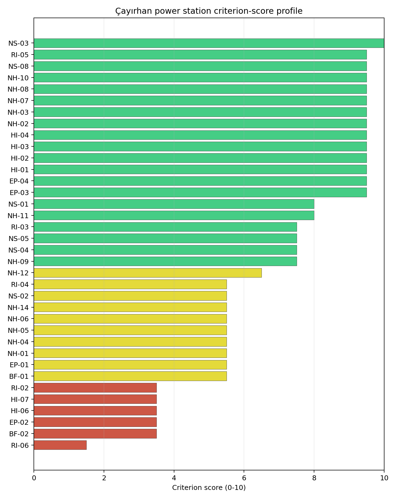
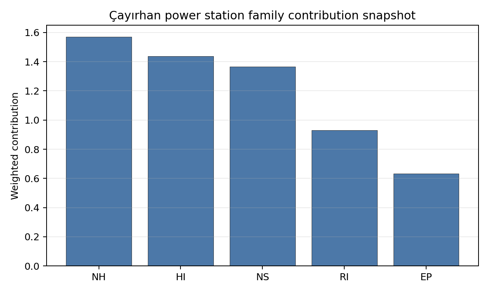

# Çayırhan power station Site Profile

Çayırhan power station is a coal/thermal site in Türkiye that has been tested against the NuScale VOYGR-6 reference deployment envelope. This profile reads the screening evidence at a level that supports a decision to progress toward Stage 3 characterisation. It is not a site-suitability determination, vendor recommendation, or licensing finding.

## Site Snapshot

| Field | Value |
| --- | --- |
| Site name | Çayırhan power station |
| Coordinates | 40.0970, 31.6950 |
| Subnational unit | Ankara |
| Installed thermal capacity (source data) | 1,420 MW |
| Available surface area | 28.7 ha |
| Available surface area for development | 28.7 ha |
| Composite score (baseline weights) | 7.347 (6.513-7.806 MC band) |
| National stability band | B (top-10% hit rate 100%) |
| National rank | 5 |

_See the country status map in_ [Türkiye Country Profile](../TR_country_prototype.md#country-status-map).

## Ownership and Coal-to-Nuclear Context

- **Çelikler Yatırım Holding AŞ** (nan% share), headquartered in Türkiye; immediate operator Kolin-Kalyon-Celikler Consortium. Path: Çelikler Yatırım Holding AŞ -> Kolin-Kalyon-Celikler Consortium  [unknown %] -> Çayırhan power station Phase B [100.0%]
- **Kolin Group** (nan% share), headquartered in Türkiye; immediate operator Kolin-Kalyon-Celikler Consortium. Path: Kolin Group  -> Kolin-Kalyon-Celikler Consortium  [unknown %] -> Çayırhan power station Phase B [100.0%]

Generating units on record: 1 cancelled, 4 operating.
Earliest unit commissioning: 1987; most recent: 2000.

## Natural Hazards (NH)

- **Seismic: Ground Motion (NH-01)** - score 5.5/10 (MC 5.0-6.0) - pass-mark band: At or below the score-5 risk boundary., weight 0.0455, data quality high. Evidence: PGA at 475-year return period 0.225 g; PGA at 2,475-year return period 0.461 g; Vs30 reference (m/s): 760.0.
- **Seismic: Surface Rupture (NH-02)** - score 9.5/10 (MC 9.0-10.0) - favourable: Very strong separation from mapped capable faults; surface-rupture concern effectively screened at desk-study level., weight n/a, data quality screening grade. Evidence: nearest mapped capable fault 50.0 km; fault slip rate 0 mm/yr; fault name: none_in_search_radius.
- **Geotechnical: Liquefaction (NH-03)** - score 9.5/10 (MC 9.0-10.0) - favourable: Negligible susceptibility (Stage-1 favourable default)., weight n/a, data quality medium. Evidence: liquefaction susceptibility: very_low; dominant soil type: clay_loam.
- **Geotechnical: Slope Stability (NH-04)** - score 5.5/10 (MC 5.0-6.0) - pass-mark band: At or below the score-5 risk boundary., weight n/a, data quality screening grade. Evidence: site slope 13.4 deg; max slope in 1 km box 88.1 deg; slope stability class: steep.
- **Geotechnical: Subsidence (NH-05)** - score 5.5/10 (MC 5.0-6.0) - pass-mark band: At or above the mine-distance score-5 pivot; review possible., weight 0.0354, data quality medium. Evidence: karst present: no; karst severity: moderate; formation type: carbonate (Discontinuous carbonate rocks).
- **Geotechnical: Foundation (NH-06)** - score 5.5/10 (MC 5.0-6.0) - pass-mark band: Typical European mixed conditions (bearing 80-150 kPa)., weight 0.0253, data quality medium. Evidence: bearing capacity 87.3 kPa; depth to bedrock 9.74 m.
- **Volcanism (NH-07)** - score 9.5/10 (MC 9.0-10.0) - favourable: Very strong margin above the score-5 boundary (or completed screening found no in-radius signal)., weight n/a, data quality high. Evidence: volcanic hazard class: negligible.
- **Coastal Flooding (NH-08)** - score 9.5/10 (MC 9.0-10.0) - favourable: Non-coastal OR elevation >= 50 m AMSL OR landlocked country, with no positive marine-hazard signal., weight 0.0303, data quality medium. Evidence: distance to coast 118.2 km.
- **River Flooding (NH-09)** - score 7.5/10 (MC 7.0-8.0), weight 0.0404, data quality medium. Evidence: flood zone class: negligible.
- **Extreme Winds (NH-10)** - score 9.5/10 (MC 9.0-10.0) - favourable: Lowest relative wind exposure in the current reanalysis-grade monthly-mean gust cohort (< 7.5 m/s)., weight 0.0152, data quality medium. Evidence: screening wind-speed index 5.91 m/s.
- **Extreme Precipitation (NH-11)** - score 8.0/10 (MC 8.0-9.0) - favourable: aggregated(mean_of_sub_scores), weight 0.0152, data quality medium. Evidence: screening extreme-precipitation index 0.17 mm; screening precipitation index 12.1 mm/yr.
- **Extreme Temperatures (NH-12)** - score 6.5/10 (MC 6.0-7.0) - pass-mark band: aggregated(mean_of_sub_scores), weight 0.0202, data quality medium. Evidence: extreme high temperature 28.6 deg C; extreme low temperature -2.13 deg C.
- **Combined Hazards (NH-14)** - score 5.5/10 (MC 5.0-6.0) - pass-mark band: At least 5 resolved, exactly one moderate hazard (3-5) or moderate interaction only., weight 0.0152, data quality n/a. Evidence: values not in measurement tables.

### Interpretation - Natural Hazards (NH)

The natural-hazards evidence for Çayırhan power station supports Stage 3 characterisation, with the strongest screening signals in Extreme Winds (NH-10) at 9.5/10, Coastal Flooding (NH-08) at 9.5/10. The main constraints are Land Area Basic Filter (BF-02) at 3.5/10, Grid Capacity Basic Filter (BF-01) at 5.5/10, Seismic: Ground Motion (NH-01) at 5.5/10. These scores should be read as Stage 1-2 screening evidence: the criterion bullets above carry the measured values, while the Stage 3 programme should confirm the low-scoring and low-confidence inputs through field, authority and engineering review before any siting claim is hardened.

## Human-Induced and Security-Relevant Hazards (HI)

- **Aircraft Crash (HI-01)** - score 9.5/10 (MC 9.0-10.0) - favourable: Only small / GA / heliport airport >= 10 km nearby, no flight-path proxy < 4 km, no major airport within 30 km, and no military airbase within 60 km., weight 0.0354, data quality high. Evidence: nearest airport 64.2 km; nearest flight path 32.1 km; airports within search radius 0; airport name: Orhan Ünsal Air Park; airport type: small airfield.
- **Industrial Explosions (HI-02)** - score 9.5/10 (MC 7.5-10.0) - favourable: Very strong margin above the score-5 boundary (or completed search confirmed no in-radius signal)., weight 0.0354, data quality low. Evidence: values not in measurement tables.
- **Toxic/Gas Releases (HI-03)** - score 9.5/10 (MC 7.5-10.0) - favourable: Very strong margin above the score-5 boundary (or completed search confirmed no in-radius signal)., weight 0.0354, data quality low. Evidence: values not in measurement tables.
- **External Fires (HI-04)** - score 9.5/10 (MC 7.5-10.0) - favourable: > 15 km, or completed flammable-storage search found nothing in radius., weight 0.0303, data quality low. Evidence: values not in measurement tables.
- **Military Installations (HI-06)** - score 3.5/10 (MC 3.0-4.0), weight 0.0303, data quality medium. Evidence: nearest military installation 20.4 km; military installations within radius 3; installation name: Jandarma Komutanlığı.
- **Electromagnetic Interference (HI-07)** - score 3.5/10 (MC 3.0-4.0), weight 0.0101, data quality medium. Evidence: nearest high-power transmitter 3.58 km; transmitters within radius 24; transmitter type: communication.

### Interpretation - Human-Induced and Security-Relevant Hazards (HI)

The human-induced and security-relevant evidence for Çayırhan power station supports Stage 3 characterisation, with the strongest screening signals in External Fires (HI-04) at 9.5/10, Toxic/Gas Releases (HI-03) at 9.5/10. The main constraints are Military Installations (HI-06) at 3.5/10, Electromagnetic Interference (HI-07) at 3.5/10, Aircraft Crash (HI-01) at 9.5/10. These scores should be read as Stage 1-2 screening evidence: the criterion bullets above carry the measured values, while the Stage 3 programme should confirm the low-scoring and low-confidence inputs through field, authority and engineering review before any siting claim is hardened.

## Radiological Impact and Emergency Planning (RI / EP)

- **Emergency Planning Feasibility (EP-01)** - score 5.5/10 (MC 5.0-6.0) - pass-mark band: At or above the composite score-5 boundary., weight n/a, data quality high. Evidence: EP feasibility composite 63.6 /100; road sub-score 44.4 /100; special-population sub-score 90.0 /100; geography sub-score 95.0 /100; population sub-score 80.0 /100; evacuation feasible: yes.
- **Evacuation Routes (EP-02)** - score 3.5/10 (MC 3.0-4.0), weight 0.0303, data quality medium. Evidence: road density in EPZ 0.374 km/km2; road length in EPZ 733.9 km; motorway access: yes.
- **Physical Geography Constraints (EP-03)** - score 9.5/10 (MC 9.0-10.0) - favourable: No measured relief; open river/waterway context (interim screening)., weight 0.0253, data quality medium. Evidence: waterways crossing EPZ 0; major river barrier: no.
- **Special Populations (EP-04)** - score 9.5/10 (MC 9.0-10.0) - favourable: 0-2 facilities., weight 0.0303, data quality medium. Evidence: hospitals in EPZ 1; prisons in EPZ 0; care homes in EPZ 0.
- **Atmospheric Dispersion (RI-01)** - score no native score (unscored - no band matched), weight 0.0303, data quality medium. Evidence: annual mean wind speed 0.81 m/s; atmospheric mixing height 600.3 m; prevailing wind direction: NW.
- **Surface Water Dispersion (RI-02)** - score 3.5/10 (MC 3.0-4.0), weight 0.0253, data quality n/a. Evidence: values not in measurement tables.
- **Groundwater Dispersion (RI-03)** - score 7.5/10 (MC 7.0-8.0), weight 0.0253, data quality medium. Evidence: aquifer type: low permeability.
- **Population Density at EPZ Radii (RI-04)** - score 5.5/10 (MC 5.0-6.0) - pass-mark band: aggregated(min_of_sub_scores), weight 0.0404, data quality screening grade. Evidence: population density within 5 km 147.2 /km2; population density within 16 km 23.2 /km2; population density within 25 km 35.4 /km2; population density within 80 km 70.5 /km2; population within 25 km 69,457 people.
- **Distance to Population Centres (RI-05)** - score 9.5/10 (MC 9.0-10.0) - favourable: No >=50k population-centre proxy within screening envelope., weight 0.0505, data quality screening grade. Evidence: values not in measurement tables.
- **Population Projections (RI-06)** - score 1.5/10 (MC 1.0-2.0), weight 0.0253, data quality screening grade. Evidence: annual population growth rate 1.786 %/yr; projected population at 25 km in 60 yr 76,151 people.

### Interpretation - Radiological Impact and Emergency Planning (RI / EP)

The radiological-impact and emergency-planning evidence for Çayırhan power station supports Stage 3 characterisation, with the strongest screening signals in Distance to Population Centres (RI-05) at 9.5/10, Special Populations (EP-04) at 9.5/10. The main constraints are Population Projections (RI-06) at 1.5/10, Evacuation Routes (EP-02) at 3.5/10, Surface Water Dispersion (RI-02) at 3.5/10. These scores should be read as Stage 1-2 screening evidence: the criterion bullets above carry the measured values, while the Stage 3 programme should confirm the low-scoring and low-confidence inputs through field, authority and engineering review before any siting claim is hardened.

## Non-Safety and Implementation Considerations (NS)

- **Grid Capacity Basic Filter (BF-01)** - score 5.5/10 (MC 5.0-6.0) - pass-mark band: Note: substation 15-30 km OR 110-219 kV; reinforcement plausible., weight n/a, data quality n/a. Evidence: values not in measurement tables.
- **Land Area Basic Filter (BF-02)** - score 3.5/10 (MC 3.0-4.0), weight 0.0253, data quality n/a. Evidence: values not in measurement tables.
- **Cooling Water Availability (NS-01)** - score 8.0/10 (MC 7.0-8.0) - favourable: aggregated(weighted_mean_of_sub_scores), weight 0.0404, data quality screening grade. Evidence: distance to cooling source 3.68 km; cooling source flow 13.0 m3/s; cooling source type: river; cooling source name: Aladağ Çayı; water stress label: Low.
- **Grid Connection (NS-02)** - score 5.5/10 (MC 5.0-6.0) - pass-mark band: aggregated(min_of_sub_scores), weight 0.0404, data quality high. Evidence: nearest substation 0.24 km; nearest high-voltage line 0.41 km; highest nearby line voltage 154.0 kV; grid export capacity 1,420 MW; substations within radius 8; HV lines within radius 24.
- **Transport Access (NS-03)** - score 10.0/10 (MC 9.0-10.0) - favourable: aggregated(weighted_mean_of_sub_scores), weight 0.0404, data quality medium. Evidence: nearest highway 0.47 km; heavy-haul capable: yes.
- **Site Topography (NS-04)** - score 7.5/10 (MC 7.0-8.0), weight 0.0303, data quality screening grade. Evidence: favourable land cover 60.3 %; moderate land cover 37.6 %; unfavourable land cover 2.1 %; favourable area 178.9 ha; dominant land class: 321.
- **Site Footprint Adequacy (NS-05)** - score 7.5/10 (MC 7.0-8.0), weight 0.0253, data quality high. Evidence: buildable area 28.7 ha; largest contiguous patch 28.7 ha; buildable patch count 1.
- **Existing Infrastructure (NS-06)** - score no native score (unscored - no band matched), weight 0.0253, data quality n/a. Evidence: not measured at this site (criterion remains unscored).
- **Ecological Sensitivity (NS-08)** - score 9.5/10 (MC 7.5-10.0) - favourable: Both networks NULL or > 25 km AND eco_pct NULL or < 15 %., weight n/a, data quality insufficient. Evidence: natural land cover 2.1 %; Natura 2000 sensitivity class: unknown; protected-area overlap: no; protected-area sensitivity class: none; Natura 2000 sites within 5 km: 0.
- **Workforce Availability (NS-10)** - score no native score (unscored - no band matched), weight 0.0202, data quality n/a. Evidence: not measured at this site (criterion remains unscored).
- **Regulatory/Political Environment (NS-12)** - score no native score (unscored - no band matched), weight 0.0303, data quality n/a. Evidence: not measured at this site (criterion remains unscored).
- **Construction Logistics (NS-13)** - score no native score (unscored - no band matched), weight 0.0202, data quality n/a. Evidence: not measured at this site (criterion remains unscored).

### Interpretation - Non-Safety and Implementation Considerations (NS)

The non-safety and implementation evidence for Çayırhan power station supports Stage 3 characterisation, with the strongest screening signals in Transport Access (NS-03) at 10.0/10, Ecological Sensitivity (NS-08) at 9.5/10. The main constraints are Land Area Basic Filter (BF-02) at 3.5/10, Existing Infrastructure (NS-06) at 5.0/10, Workforce Availability (NS-10) at 5.0/10. These scores should be read as Stage 1-2 screening evidence: the criterion bullets above carry the measured values, while the Stage 3 programme should confirm the low-scoring and low-confidence inputs through field, authority and engineering review before any siting claim is hardened.

## Composite Score and Stability

Baseline composite score is 7.347, bracketed by Monte Carlo at 6.513-7.806. National stability band is `B` with a top-10% hit rate of 100% across 12 scored Monte Carlo scenarios.

Çayırhan power station's baseline composite score is 7.347, with a Monte Carlo bracket of 6.513-7.806. The national stability band is B, with a national top-10% hit rate of 100% in the project's 50,000-iteration national Monte Carlo sensitivity analysis. That places the site in the national shortlist on the accepted Turkey basis. The result supports prioritised Stage 3 characterisation, not site approval or licensing readiness.

## Residual Risk Register

| Concern | Evidence | Consequence | Stage 3 action | Owner discipline |
| --- | --- | --- | --- | --- |
| Population Projections (RI-06) | Screening score 1.5/10, MC 1.0-2.0, confidence medium | Could narrow the viable siting envelope or require mitigation before characterisation progresses | Confirm measured inputs, authority constraints and engineering response for RI-06 | RI specialist |
| Land Area Basic Filter (BF-02) | Screening score 3.5/10, MC 3.0-4.0, confidence insufficient | Could narrow the viable siting envelope or require mitigation before characterisation progresses | Confirm measured inputs, authority constraints and engineering response for BF-02 | BF specialist |
| Evacuation Routes (EP-02) | Screening score 3.5/10, MC 3.0-4.0, confidence medium | Could narrow the viable siting envelope or require mitigation before characterisation progresses | Confirm measured inputs, authority constraints and engineering response for EP-02 | EP specialist |
| Military Installations (HI-06) | Screening score 3.5/10, MC 3.0-4.0, confidence medium | Could narrow the viable siting envelope or require mitigation before characterisation progresses | Confirm measured inputs, authority constraints and engineering response for HI-06 | HI specialist |
| Electromagnetic Interference (HI-07) | Screening score 3.5/10, MC 3.0-4.0, confidence medium | Could narrow the viable siting envelope or require mitigation before characterisation progresses | Confirm measured inputs, authority constraints and engineering response for HI-07 | HI specialist |

These residual risks define the first Stage 3 work package. They do not overturn the national ranking, but they identify the evidence needed before Turkey treats the site as more than a screening-stage candidate.

## Stage 3 Follow-Up Checklist

- Re-measure **Population Projections (RI-06)** - native score 1.5/10 with confidence medium.
- Re-measure **Land Area Basic Filter (BF-02)** - native score 3.5/10 with confidence insufficient.
- Re-measure **Evacuation Routes (EP-02)** - native score 3.5/10 with confidence medium.
- Re-measure **Military Installations (HI-06)** - native score 3.5/10 with confidence medium.
- Re-measure **Electromagnetic Interference (HI-07)** - native score 3.5/10 with confidence medium.
- Improve data quality for **Geotechnical: Subsidence & Collapse (NH-05b)** - current flag `low`.
- Improve data quality for **Industrial Explosions (HI-02)** - current flag `low`.
- Improve data quality for **Toxic/Gas Releases (HI-03)** - current flag `low`.
- Improve data quality for **External Fires (HI-04)** - current flag `low`.

## Evidence Limitations

- Geotechnical: Subsidence & Collapse (NH-05b) - quality `low`.
- Industrial Explosions (HI-02) - quality `low`.
- Toxic/Gas Releases (HI-03) - quality `low`.
- External Fires (HI-04) - quality `low`.
